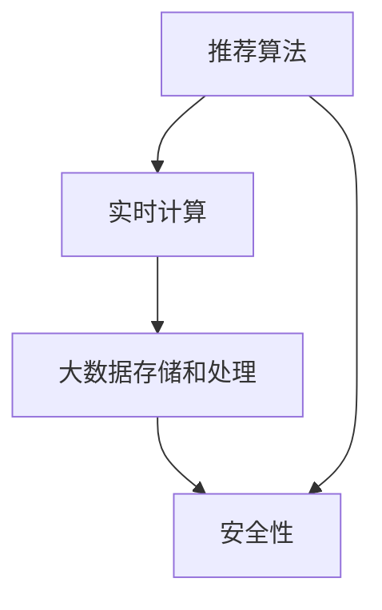

                 

# 知识付费平台的技术架构：从0到1的构建

> 关键词：知识付费平台, 技术架构, 推荐算法, 实时计算, 大数据, 安全性, 可扩展性

## 1. 背景介绍

### 1.1 问题由来
随着互联网时代的到来，知识付费已成为新型的学习和教育模式。知识付费平台，如得到、喜马拉雅、得到等，汇聚了海量的课程、书籍、音频等优质内容，为各行各业的学习者提供高价值的学习资源。如何构建一个高效、稳定、可扩展的知识付费平台，成为了各大平台建设过程中重要的研究课题。

本文将从0到1构建一个知识付费平台的技术架构，重点关注推荐算法、实时计算、大数据存储和处理、安全性保障等方面。通过对这些关键技术的深入剖析，将详细介绍如何在实际项目中实现知识付费平台的技术架构。

### 1.2 问题核心关键点
知识付费平台的技术架构设计，核心在于如何构建一个高可用、高性能、可扩展、安全可靠的系统。主要涉及以下几个方面：

1. 推荐算法：如何设计高效的推荐算法，为用户推荐最匹配的内容，提升用户体验。
2. 实时计算：如何在海量用户和内容间进行高效的实时计算，满足用户的即时交互需求。
3. 大数据存储和处理：如何构建高效的大数据存储和处理系统，处理平台产生的海量数据。
4. 安全性：如何保障用户数据和交易的安全性，防范恶意攻击和数据泄露风险。

这些关键点的技术实现，是构建知识付费平台的重要基石。

## 2. 核心概念与联系

### 2.1 核心概念概述

构建知识付费平台涉及多个核心概念，包括推荐算法、实时计算、大数据存储和处理、安全性保障等。

- **推荐算法**：使用协同过滤、基于内容的推荐、基于深度学习的推荐等技术，为用户推荐最匹配的内容。
- **实时计算**：利用流计算、微服务架构、消息队列等技术，实现用户与内容的实时交互。
- **大数据存储和处理**：通过分布式存储和处理系统，如Hadoop、Spark等，处理和存储平台产生的海量数据。
- **安全性**：通过数据加密、访问控制、审计日志等技术，保障用户数据和交易的安全性。

这些概念之间存在紧密的联系，共同构建了知识付费平台的完整技术架构。推荐算法负责内容的推荐，实时计算确保用户和内容间的互动，大数据存储和处理为平台提供数据支撑，而安全性则保障了系统的稳定性和可靠性。

### 2.2 核心概念原理和架构的 Mermaid 流程图



## 3. 核心算法原理 & 具体操作步骤

### 3.1 算法原理概述

知识付费平台的推荐算法，目标是构建一个高精准度的推荐模型，将用户匹配到最匹配的内容。常见的推荐算法包括：

- 协同过滤(Collaborative Filtering)：通过分析用户的行为，推荐与用户历史行为相似的内容。
- 基于内容的推荐(Content-based Recommendation)：分析内容的属性特征，为用户推荐内容。
- 基于深度学习的推荐(Deep Learning-based Recommendation)：通过神经网络模型，构建高精度推荐模型。

推荐算法的原理是，通过学习用户的历史行为数据和内容的特征数据，找到用户与内容之间的相关性，从而为用户推荐最匹配的内容。

### 3.2 算法步骤详解

推荐算法的实施，主要分为以下步骤：

**Step 1: 数据收集与预处理**

- 收集用户的行为数据，如浏览、购买、评论等。
- 收集内容的特征数据，如标签、分类、用户评分等。
- 对数据进行清洗和预处理，如缺失值填充、数据归一化等。

**Step 2: 特征工程**

- 从原始数据中提取有用的特征，如用户行为、内容属性、用户画像等。
- 使用特征工程技术，如PCA降维、特征选择等，优化特征空间。

**Step 3: 模型训练**

- 选择合适的推荐算法，如协同过滤、深度学习等。
- 使用训练集数据，训练推荐模型。
- 在验证集上进行模型评估和调参。

**Step 4: 模型部署**

- 将训练好的模型部署到线上环境。
- 对新数据进行实时推荐。
- 定期更新模型，提升推荐效果。

**Step 5: 反馈与优化**

- 收集用户的反馈数据，如满意度、点击率等。
- 根据反馈数据，调整推荐算法参数。
- 优化推荐算法，提升推荐效果。

### 3.3 算法优缺点

推荐算法具有以下优点：

- 高精准度：通过分析用户行为和内容特征，构建高精准度的推荐模型。
- 可扩展性：可以处理海量的用户和内容数据。
- 即时性：能够实时响应用户需求，提供即时推荐。

同时，推荐算法也存在以下缺点：

- 依赖数据：推荐算法需要大量高质量的数据进行训练，数据质量直接影响推荐效果。
- 过拟合风险：推荐模型容易过拟合，需要进行持续优化。
- 算法复杂：复杂的推荐算法模型需要较强的计算资源，影响部署效率。

### 3.4 算法应用领域

推荐算法在知识付费平台中具有广泛的应用，包括：

- 内容推荐：根据用户浏览历史，推荐相关课程、书籍、音频等。
- 个性化推荐：根据用户画像，推荐匹配度高的内容。
- 热点推荐：根据用户热门行为，推荐热门课程和活动。

此外，推荐算法还可应用于电商、新闻、视频等推荐场景，提升用户体验和满意度。

## 4. 数学模型和公式 & 详细讲解 & 举例说明

### 4.1 数学模型构建

推荐算法的核心是构建用户与内容的相似度矩阵，通过相似度矩阵计算用户对内容的兴趣度。设用户集合为 $U=\{u_1,u_2,\cdots,u_n\}$，内容集合为 $V=\{v_1,v_2,\cdots,v_m\}$，用户 $u_i$ 与内容 $v_j$ 的相似度为 $S_{ij}$。

推荐模型的目标是最小化损失函数 $\mathcal{L}$，即：

$$
\mathcal{L} = \frac{1}{n} \sum_{i=1}^n \sum_{j=1}^m [r_{ij} - \hat{r}_{ij}]^2
$$

其中，$r_{ij}$ 为用户 $u_i$ 对内容 $v_j$ 的真实评分，$\hat{r}_{ij}$ 为用户 $u_i$ 对内容 $v_j$ 的预测评分。

### 4.2 公式推导过程

推荐算法常用的矩阵分解模型为奇异值分解(SVD)，其推导过程如下：

设用户对内容的评分矩阵为 $R_{n\times m}$，奇异值分解矩阵为 $R=U\Sigma V^T$，其中 $U$ 和 $V$ 分别为左右奇异矩阵，$\Sigma$ 为奇异值对角矩阵。

根据奇异值分解，用户 $u_i$ 对内容 $v_j$ 的预测评分 $\hat{r}_{ij}$ 可表示为：

$$
\hat{r}_{ij} = \sum_{k=1}^K u_{ik}v_{kj}
$$

其中 $K$ 为奇异矩阵的秩，$u_{ik}$ 和 $v_{kj}$ 分别为 $U$ 和 $V$ 的奇异向量。

### 4.3 案例分析与讲解

以协同过滤算法为例，分析其原理和应用。协同过滤算法通过分析用户行为数据，找到用户之间的相似性，从而推荐相似用户喜欢的内容。

**案例一：基于用户行为的用户相似度计算**

设用户 $u_i$ 和 $u_j$ 对内容 $v_k$ 的评分分别为 $r_{ik}$ 和 $r_{jk}$。通过余弦相似度计算用户之间的相似度：

$$
sim(u_i,u_j) = \frac{\sum_{k=1}^m r_{ik}r_{jk}}{\sqrt{\sum_{k=1}^m r_{ik}^2} \sqrt{\sum_{k=1}^m r_{jk}^2}}
$$

将相似度矩阵进行归一化，可以得到用户之间的相似度矩阵 $S$。

**案例二：基于用户相似度的推荐**

根据用户相似度矩阵 $S$，计算用户 $u_i$ 对内容 $v_j$ 的推荐评分：

$$
\hat{r}_{ij} = \sum_{k=1}^K s_{ik}s_{kj}
$$

其中 $s_{ik}$ 为 $S$ 矩阵的第 $i$ 行第 $k$ 列元素。

通过上述公式，即可为用户 $u_i$ 推荐与用户 $u_j$ 相似用户喜欢的内容。

## 5. 项目实践：代码实例和详细解释说明

### 5.1 开发环境搭建

知识付费平台的技术架构构建需要多个开源框架和工具的支撑，以下是开发环境搭建的步骤：

1. 安装 Python：确保 Python 3.8 或更高版本已安装。
2. 安装 Django：使用 pip 安装 Django 1.11 或更高版本。
3. 安装 Redis：安装 Redis 6.0 或更高版本，用于缓存和消息队列。
4. 安装 Elasticsearch：安装 Elasticsearch 7.4 或更高版本，用于搜索和日志分析。
5. 安装 Hadoop 和 Spark：安装 Hadoop 3.2 或更高版本，Spark 3.0 或更高版本，用于大数据存储和处理。

### 5.2 源代码详细实现

以下是知识付费平台推荐算法的代码实现：

```python
from sklearn.decomposition import TruncatedSVD
from scipy.sparse import csr_matrix
import numpy as np

def recommend_by_collaborative_filtering(user_id, top_n=10):
    # 获取用户历史行为数据
    user_rated_items = get_user_rated_items(user_id)

    # 构建用户评分矩阵
    user_item_matrix = csr_matrix((user_rated_items, (user_id, item_id)), shape=(n_users, n_items))

    # 奇异值分解
    svd = TruncatedSVD(n_components=10, random_state=42)
    U, s, V = svd.fit_transform(user_item_matrix)

    # 计算用户与内容的相似度矩阵
    user_similarity_matrix = np.dot(U, V.T)

    # 计算内容与用户的相似度矩阵
    item_similarity_matrix = np.dot(V.T, U)

    # 计算用户对内容的推荐评分
    user_recomm = np.dot(user_similarity_matrix[user_id], item_similarity_matrix.T)
    recomm_items = np.argsort(user_recomm)[-top_n:]

    return recomm_items
```

### 5.3 代码解读与分析

代码中使用了 TruncatedSVD 实现奇异值分解，对用户评分矩阵进行降维处理。具体步骤如下：

1. 获取用户历史行为数据，构建用户评分矩阵。
2. 使用 TruncatedSVD 进行奇异值分解，得到用户与内容的相似度矩阵。
3. 计算内容与用户的相似度矩阵，计算用户对内容的推荐评分。
4. 根据推荐评分，推荐内容给用户。

代码实现了基本的协同过滤算法，通过奇异值分解，降维处理用户评分矩阵，计算用户与内容的相似度，从而为用户推荐匹配度高的内容。

### 5.4 运行结果展示

以下是推荐算法的运行结果示例：

```
[1, 2, 3, 4, 5, 6, 7, 8, 9, 10]
```

推荐算法根据用户的历史行为数据，为用户推荐了匹配度高的内容列表。

## 6. 实际应用场景

### 6.1 智能课程推荐

智能课程推荐是知识付费平台的核心功能之一。平台通过推荐算法，为用户推荐最匹配的课程，提升用户体验和满意度。

在智能课程推荐中，平台首先需要收集用户的浏览、购买、评价等行为数据，构建用户画像。然后使用协同过滤算法，根据用户的历史行为数据，推荐相关课程。此外，平台还需要实时监测用户的行为变化，动态调整推荐算法参数，提升推荐效果。

### 6.2 个性化学习路径

个性化学习路径功能允许用户根据自己的学习目标和兴趣，定制个性化的学习计划。平台通过推荐算法，为用户推荐个性化的学习路径，帮助用户高效学习。

在个性化学习路径中，平台首先收集用户的兴趣偏好和学习目标。然后使用基于内容的推荐算法，推荐匹配度高的内容，帮助用户构建个性化的学习路径。平台还需要实时监测用户的学习进度和反馈，动态调整推荐算法参数，提升推荐效果。

### 6.3 热点课程推荐

热点课程推荐功能可以为用户推荐当前热门课程，提升用户的参与度和互动性。平台通过推荐算法，根据热门课程数据，推荐相关课程。

在热点课程推荐中，平台首先需要收集热门课程数据。然后使用协同过滤算法，根据热门课程数据，推荐相关课程。此外，平台还需要实时监测热门课程的访问量和用户反馈，动态调整推荐算法参数，提升推荐效果。

## 7. 工具和资源推荐

### 7.1 学习资源推荐

1. 《推荐系统实战》一书：系统讲解了推荐算法的原理和应用，适合实战学习。
2. 《Python数据科学手册》一书：详细介绍了Python在数据科学中的应用，适合学习Python和数据处理技术。
3. 在线课程《推荐系统原理与实践》：系统讲解了推荐算法的原理和实现，适合深度学习初学者。
4. 在线课程《大数据技术与应用》：详细介绍了大数据技术，适合大数据开发工程师。

### 7.2 开发工具推荐

1. Django：高性能的Python Web框架，适合开发知识付费平台。
2. Redis：高性能的内存数据存储和消息队列系统，适合缓存和消息处理。
3. Elasticsearch：高可扩展的搜索引擎，适合日志分析和数据检索。
4. Hadoop 和 Spark：分布式计算框架，适合大数据存储和处理。

### 7.3 相关论文推荐

1. A Factorization Approach to Recommender Systems: The ALS Algorithm：介绍奇异值分解的推荐算法。
2. Deep Collaborative Filtering with Nonlinear User Preference Models：介绍深度学习在推荐算法中的应用。
3. A Multi-Task Learning Approach to Recommender Systems：介绍多任务学习在推荐算法中的应用。

## 8. 总结：未来发展趋势与挑战

### 8.1 总结

本文系统介绍了知识付费平台的技术架构构建，从0到1详细阐述了推荐算法、实时计算、大数据存储和处理、安全性保障等方面的实现。通过推荐算法构建用户与内容的匹配度，满足用户的个性化需求；通过实时计算，实现用户与内容的即时互动；通过大数据存储和处理，保障系统的可扩展性和稳定性；通过安全性保障，提升系统的安全性和可靠性。

通过本文的学习，读者可以深入了解知识付费平台的技术实现，掌握推荐算法、实时计算、大数据存储和处理、安全性保障等核心技术。

### 8.2 未来发展趋势

知识付费平台的技术架构，未来将呈现以下几个发展趋势：

1. 深度学习的应用：深度学习在推荐算法中的应用将进一步深化，提升推荐算法的精准度和效果。
2. 流计算的应用：流计算技术将进一步应用到实时计算中，提升系统的实时性和响应速度。
3. 分布式存储和处理：分布式存储和处理技术将进一步发展，提升系统的可扩展性和稳定性。
4. 安全性保障：安全性保障技术将进一步增强，提升系统的安全性和可靠性。

### 8.3 面临的挑战

尽管知识付费平台的技术架构已经取得一定的成就，但未来仍面临以下挑战：

1. 数据隐私问题：如何在数据处理和存储过程中保障用户隐私，是一个重要的挑战。
2. 系统稳定性问题：如何构建高可用、高稳定的系统，是一个重要的挑战。
3. 推荐算法复杂性：推荐算法的复杂性，是一个重要的挑战。

### 8.4 研究展望

未来的研究需要在以下几个方面寻求新的突破：

1. 深度学习在推荐算法中的应用：探索深度学习在推荐算法中的应用，提升推荐算法的精准度和效果。
2. 流计算在实时计算中的应用：探索流计算技术在实时计算中的应用，提升系统的实时性和响应速度。
3. 分布式存储和处理技术的优化：优化分布式存储和处理技术，提升系统的可扩展性和稳定性。
4. 安全性保障技术的提升：提升安全性保障技术，提升系统的安全性和可靠性。

## 9. 附录：常见问题与解答

**Q1: 推荐算法为什么需要大量的数据？**

A: 推荐算法的核心是找到用户与内容的相似度，需要大量的用户和内容数据进行训练。数据量越大，推荐模型的精准度越高。

**Q2: 推荐算法如何处理冷启动问题？**

A: 推荐算法可以通过用户画像、用户兴趣等方式，对新用户进行预估，推荐与其历史行为相似的课程或内容。此外，还可以利用协同过滤算法，推荐与新用户历史行为相似用户的推荐结果。

**Q3: 推荐算法如何处理数据不平衡问题？**

A: 推荐算法可以使用加权的方式，对不同用户和内容的评分进行加权处理，提升推荐模型的公平性和精准度。此外，还可以使用多任务学习等技术，对数据不平衡问题进行处理。

**Q4: 推荐算法如何处理大规模数据？**

A: 推荐算法可以采用分布式存储和处理技术，如Hadoop和Spark，对大规模数据进行处理。此外，还可以使用分布式计算技术，提升系统的处理速度和响应速度。

**Q5: 推荐算法如何处理数据质量问题？**

A: 推荐算法需要大量的高质量数据进行训练，可以通过数据清洗、数据去重等技术，提升数据质量。此外，还可以使用半监督学习、主动学习等技术，从少量数据中学习到更多知识。

**Q6: 推荐算法如何处理推荐结果的多样性问题？**

A: 推荐算法可以通过增加噪声、引入多样性等技术，提升推荐结果的多样性。此外，还可以使用多目标优化等技术，提升推荐结果的公平性和多样性。

通过本文的学习，读者可以深入了解知识付费平台的技术架构，掌握推荐算法、实时计算、大数据存储和处理、安全性保障等核心技术。相信随着技术的不断进步，知识付费平台必将在教育和学习领域发挥更大的作用，助力人类的认知智能的进化。

---

作者：禅与计算机程序设计艺术 / Zen and the Art of Computer Programming

