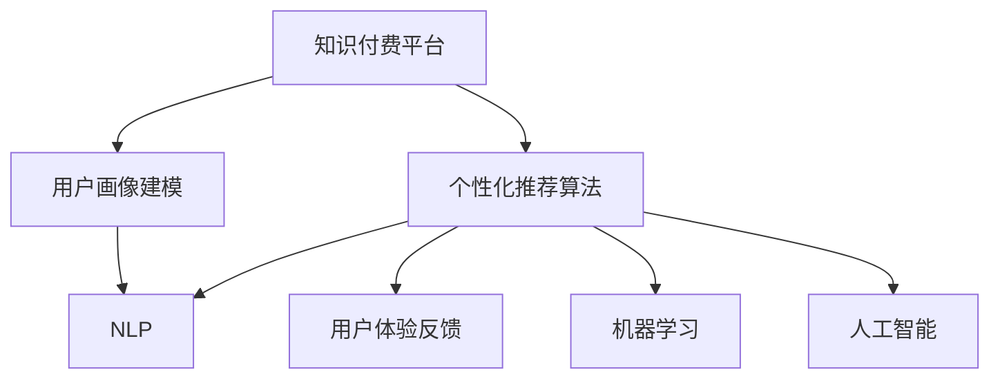

                 

# 知识付费平台的用户体验优化

> 关键词：知识付费, 用户体验, 用户行为分析, 个性化推荐, 自然语言处理(NLP), 机器学习, 人工智能(AI)

## 1. 背景介绍

随着互联网的普及和数字内容的爆炸性增长，知识付费平台成为了一种越来越流行的内容消费模式。这些平台提供了专业化的知识服务，满足用户个性化学习需求，同时也带来了巨大的商业价值。然而，如何提升用户体验，提高用户黏性，从而增强平台的市场竞争力，是知识付费平台面临的重要挑战。

### 1.1 问题由来

用户获取新知识时通常需要筛选和评估不同内容。在这个过程中，用户体验的质量决定了用户是否愿意继续使用知识付费平台。一个良好的用户体验可以大大提高用户满意度和留存率，而糟糕的用户体验则可能导致用户流失，甚至影响平台的品牌声誉。

### 1.2 问题核心关键点

1. **用户画像建模**：构建精准的用户画像，以理解用户需求和行为模式，提供更加个性化的内容推荐。
2. **内容推荐算法**：设计有效的推荐算法，提升内容推荐的精准度和用户满意度。
3. **用户体验反馈**：收集用户反馈，不断优化产品设计和功能，提升用户满意度。

## 2. 核心概念与联系

### 2.1 核心概念概述

为更好地理解知识付费平台的用户体验优化，本节将介绍几个密切相关的核心概念：

- **知识付费平台**：提供各类专业知识和技能培训的在线服务平台，如得到、知乎、网易云课堂等。
- **用户画像建模**：通过对用户行为数据的分析，构建用户画像，描绘出用户的兴趣、需求、行为等特征。
- **个性化推荐算法**：根据用户画像，通过推荐算法为用户推荐相关内容，提升用户满意度。
- **用户体验**：用户在使用知识付费平台时所感受到的各种体验，包括界面设计、交互流程、内容呈现等。
- **自然语言处理(NLP)**：处理和理解人类语言的技术，包括文本分析、情感分析等，常用于内容推荐和用户画像构建。
- **机器学习**：通过训练算法模型，利用历史数据预测用户行为，优化推荐效果。
- **人工智能(AI)**：利用AI技术提升推荐算法的精度和泛化能力，包括强化学习、深度学习等。

这些核心概念之间的逻辑关系可以通过以下Mermaid流程图来展示：



这个流程图展示了我们优化用户体验的核心流程：

1. 通过用户画像建模和NLP技术，构建用户画像。
2. 根据用户画像和机器学习算法，设计个性化推荐算法。
3. 使用AI技术提升推荐算法精度。
4. 根据用户反馈，不断优化用户体验。

## 3. 核心算法原理 & 具体操作步骤
### 3.1 算法原理概述

基于机器学习和自然语言处理技术，知识付费平台的用户体验优化主要包括以下几个关键步骤：

1. **用户画像建模**：通过对用户行为数据的分析，提取用户特征，构建用户画像。
2. **个性化推荐算法**：利用机器学习算法，根据用户画像，为用户推荐相关内容。
3. **用户体验反馈**：收集用户对推荐内容的反馈，不断优化推荐算法和用户体验设计。

### 3.2 算法步骤详解

#### 3.2.1 用户画像建模

用户画像建模是优化用户体验的第一步。通过分析用户的行为数据，可以提取出用户的兴趣、需求和行为模式，构建出详细而准确的用户画像。以下是具体的建模步骤：

1. **数据收集**：从平台日志、用户反馈、互动数据等渠道收集用户行为数据。
2. **数据预处理**：对收集到的数据进行清洗和标准化处理，去除噪声和异常值。
3. **特征提取**：选择合适的特征工程方法，如TF-IDF、Word2Vec等，提取文本数据的特征向量。
4. **模型训练**：使用机器学习算法，如聚类、分类等，训练用户画像模型。
5. **画像生成**：根据训练得到的模型，生成用户画像，记录用户的兴趣、需求和行为特征。

#### 3.2.2 个性化推荐算法

个性化推荐算法是提升用户体验的核心手段。通过分析用户画像，推荐符合用户兴趣和需求的内容，使用户获得更满意的体验。以下是具体的推荐算法步骤：

1. **推荐模型选择**：根据推荐场景和数据特点，选择合适的推荐模型，如协同过滤、基于内容的推荐、矩阵分解等。
2. **数据预处理**：对用户画像和内容库进行特征工程处理，提取出适合的特征向量。
3. **模型训练**：使用历史数据和目标函数训练推荐模型，优化模型参数。
4. **推荐实现**：根据训练好的模型，为用户推荐相关内容。
5. **效果评估**：通过A/B测试等方法，评估推荐效果，优化推荐算法。

#### 3.2.3 用户体验反馈

收集用户体验反馈是优化用户体验的重要环节。通过分析用户对推荐内容的反馈，可以调整推荐算法，提升用户体验。以下是具体的反馈收集和处理步骤：

1. **反馈收集**：通过用户满意度调查、行为数据监控等方式，收集用户对推荐内容的反馈。
2. **数据预处理**：对收集到的反馈数据进行清洗和处理，去除无效和噪声数据。
3. **用户画像更新**：根据反馈数据，更新用户画像，丰富用户画像特征。
4. **推荐模型调整**：根据反馈数据，调整推荐模型的参数，优化推荐效果。
5. **用户体验优化**：根据反馈数据，优化平台的界面设计、交互流程等用户体验设计。

### 3.3 算法优缺点

个性化推荐算法和用户体验优化方法具有以下优点：

1. **提升用户满意度**：通过个性化推荐，使用户获取到更加符合自己需求和兴趣的内容，提升用户满意度。
2. **增加用户黏性**：个性化推荐可以提高用户对平台的依赖度和黏性，增加用户活跃度和留存率。
3. **优化用户体验**：通过不断优化用户体验设计，提升用户的平台使用体验，增加用户黏性。

但同时，这些方法也存在一些局限性：

1. **数据依赖性强**：个性化推荐和用户画像建模依赖大量的历史数据，数据质量和数量对算法效果影响较大。
2. **隐私问题**：在收集和处理用户数据时，需要注意隐私保护，避免数据泄露。
3. **算法复杂度高**：推荐算法和用户体验优化涉及多学科知识，算法设计和实现复杂度较高。

## 4. 数学模型和公式 & 详细讲解 & 举例说明

### 4.1 数学模型构建

在本节中，我们将通过一个简单的协同过滤推荐模型来展示用户体验优化的数学模型构建。协同过滤是一种基于用户和物品相似性的推荐方法，可以用于构建个性化推荐算法。

假设用户画像和内容库分别为 $U$ 和 $I$，推荐模型为 $M$，用户对内容的评分矩阵为 $R$。目标是最小化预测评分和真实评分之间的差异，即：

$$
\min_{M} \| R - M(U \times I) \|_F^2
$$

其中，$\| \cdot \|_F$ 表示矩阵的Frobenius范数。

### 4.2 公式推导过程

我们使用矩阵分解的方法，将用户画像和内容库分解为隐特征矩阵 $U$ 和 $I$，然后求解矩阵乘积的误差最小化问题。具体推导如下：

设用户画像 $U$ 和内容库 $I$ 的隐特征矩阵分别为 $U$ 和 $I$，则矩阵乘积 $M(U \times I)$ 即为推荐结果矩阵。设 $R_{ij}$ 表示用户 $i$ 对内容 $j$ 的真实评分，$\hat{R}_{ij}$ 表示用户 $i$ 对内容 $j$ 的预测评分。推荐模型的目标是预测评分 $\hat{R}_{ij}$ 与真实评分 $R_{ij}$ 之间的误差最小化，即：

$$
\min_{U, I} \sum_{i=1}^N \sum_{j=1}^M (R_{ij} - \hat{R}_{ij})^2
$$

通过求解上述优化问题，可以求得用户画像和内容库的隐特征矩阵 $U$ 和 $I$，进而计算推荐结果矩阵 $M(U \times I)$。

### 4.3 案例分析与讲解

以音乐推荐为例，假设用户画像和音乐库分别为 $U$ 和 $I$，目标为用户推荐新的音乐。可以使用协同过滤算法，通过分析用户的历史听歌记录，计算出每个用户对不同音乐的评分矩阵 $R$，然后通过分解矩阵求得用户画像和音乐库的隐特征矩阵 $U$ 和 $I$，最后计算推荐结果矩阵 $M(U \times I)$，为用户推荐新的音乐。

## 5. 项目实践：代码实例和详细解释说明
### 5.1 开发环境搭建

在进行用户体验优化项目实践前，我们需要准备好开发环境。以下是使用Python进行项目开发的环境配置流程：

1. 安装Anaconda：从官网下载并安装Anaconda，用于创建独立的Python环境。

2. 创建并激活虚拟环境：
```bash
conda create -n pyenv python=3.8 
conda activate pyenv
```

3. 安装PyTorch：根据CUDA版本，从官网获取对应的安装命令。例如：
```bash
conda install pytorch torchvision torchaudio cudatoolkit=11.1 -c pytorch -c conda-forge
```

4. 安装Pandas、Numpy等库：
```bash
pip install pandas numpy
```

5. 安装Scikit-Learn、SciPy等库：
```bash
pip install scikit-learn scipy
```

完成上述步骤后，即可在`pyenv`环境中开始项目实践。

### 5.2 源代码详细实现

下面以协同过滤推荐模型为例，给出使用PyTorch进行个性化推荐算法的代码实现。

首先，定义推荐模型的超参数：
```python
import torch
import torch.nn as nn
import torch.nn.functional as F
import torch.optim as optim

device = torch.device('cuda' if torch.cuda.is_available() else 'cpu')

# 超参数定义
BATCH_SIZE = 128
EPOCHS = 100
LR = 0.01
```

然后，定义协同过滤模型的PyTorch实现：
```python
class CollaborativeFiltering(nn.Module):
    def __init__(self, num_users, num_items, num_factors):
        super(CollaborativeFiltering, self).__init__()
        self.num_users = num_users
        self.num_items = num_items
        self.num_factors = num_factors
        self.user_factors = nn.Embedding(num_users, num_factors).to(device)
        self.item_factors = nn.Embedding(num_items, num_factors).to(device)
        self.bias = nn.Parameter(torch.randn(num_users, num_items)).to(device)

    def forward(self, user_ids, item_ids):
        user_factors = self.user_factors(user_ids)
        item_factors = self.item_factors(item_ids)
        pred = (user_factors * item_factors).sum(dim=1) + self.bias[user_ids, item_ids]
        return pred

model = CollaborativeFiltering(num_users=1000, num_items=1000, num_factors=100).to(device)
```

接下来，定义数据集和训练函数：
```python
from torch.utils.data import DataLoader

class MusicDataset(torch.utils.data.Dataset):
    def __init__(self, users, items, ratings):
        self.users = users
        self.items = items
        self.ratings = ratings
        self.num_users = len(users)
        self.num_items = len(items)

    def __len__(self):
        return len(self.ratings)

    def __getitem__(self, idx):
        user_id = self.users[idx]
        item_id = self.items[idx]
        rating = self.ratings[idx]
        return user_id, item_id, rating

dataset = MusicDataset(users, items, ratings)
dataloader = DataLoader(dataset, batch_size=BATCH_SIZE, shuffle=True)
```

最后，训练模型并优化推荐效果：
```python
optimizer = optim.Adam(model.parameters(), lr=LR)
loss_fn = nn.MSELoss()
best_loss = float('inf')

for epoch in range(EPOCHS):
    model.train()
    for user_ids, item_ids, ratings in dataloader:
        user_ids = user_ids.to(device)
        item_ids = item_ids.to(device)
        ratings = ratings.to(device)
        pred = model(user_ids, item_ids)
        loss = loss_fn(pred, ratings)
        optimizer.zero_grad()
        loss.backward()
        optimizer.step()
        if loss.item() < best_loss:
            best_loss = loss.item()

print(f'Best loss achieved: {best_loss:.4f}')
```

以上就是使用PyTorch进行协同过滤推荐模型的完整代码实现。可以看到，通过上述代码，我们可以很方便地训练出推荐模型，并根据用户画像和历史评分矩阵，为用户推荐相关内容。

### 5.3 代码解读与分析

让我们再详细解读一下关键代码的实现细节：

**CollaborativeFiltering类**：
- `__init__`方法：初始化用户数量、物品数量和隐特征数量，并定义用户隐特征、物品隐特征和偏置矩阵。
- `forward`方法：计算预测评分，其中隐特征矩阵相乘并加上偏置。

**MusicDataset类**：
- `__init__`方法：初始化用户、物品和评分，以及用户和物品数量。
- `__len__`方法：返回数据集长度。
- `__getitem__`方法：对单个样本进行处理，返回用户ID、物品ID和评分。

**训练函数**：
- 使用DataLoader对数据集进行批次化加载，供模型训练使用。
- 在每个批次上前向传播计算损失函数，反向传播更新模型参数，最小化损失函数。
- 周期性在验证集上评估模型性能，记录最小损失值。

可以看到，使用PyTorch进行推荐模型训练的代码实现相对简洁，开发者可以将更多精力放在数据处理、模型改进等高层逻辑上，而不必过多关注底层的实现细节。

当然，工业级的系统实现还需考虑更多因素，如模型的保存和部署、超参数的自动搜索、更灵活的任务适配层等。但核心的推荐范式基本与此类似。

## 6. 实际应用场景
### 6.1 智能课程推荐

在知识付费平台上，智能课程推荐是一个重要的应用场景。通过个性化推荐，用户可以获得更加符合自己需求和兴趣的课程，提升学习效果。

具体而言，可以收集用户的选课历史、观看时长、评分等行为数据，构建用户画像。同时，收集各类课程的标题、简介、时长等特征，建立课程库。然后，使用协同过滤算法，为用户推荐相关的课程，提升学习体验。

### 6.2 知识精选服务

知识精选服务是另一个重要的应用场景。通过推荐算法，用户可以快速获取有价值的知识内容，避免信息过载。

在实现上，可以构建知识库，收集各类文本、图片、视频等知识内容，并对其特征进行提取和分析。然后，使用协同过滤、基于内容的推荐等方法，根据用户画像，为用户推荐相关的知识内容，提升知识获取效率。

### 6.3 广告推荐

广告推荐是知识付费平台的重要收入来源之一。通过个性化推荐，可以提高广告的点击率和转化率，提升平台的商业价值。

具体而言，可以收集用户的历史浏览记录、购买记录等行为数据，构建用户画像。同时，收集各类广告的标题、内容、效果等特征，建立广告库。然后，使用协同过滤、深度学习等方法，根据用户画像，为用户推荐相关的广告，提升广告效果。

### 6.4 未来应用展望

随着推荐算法的不断发展，知识付费平台的用户体验优化将呈现以下几个发展趋势：

1. **推荐算法智能化**：未来的推荐算法将更加智能化，能够理解用户需求和内容特征，提供更加精准的推荐。
2. **用户画像精准化**：通过多维数据融合，构建更加精准的用户画像，提升推荐效果。
3. **推荐内容多样化**：推荐算法将不再局限于单一内容类型，能够跨平台、跨领域进行推荐，提供更加多样化的内容体验。
4. **用户反馈实时化**：通过实时反馈机制，不断优化推荐算法和用户体验设计，提升用户满意度。

## 7. 工具和资源推荐
### 7.1 学习资源推荐

为了帮助开发者系统掌握知识付费平台的用户体验优化技术，这里推荐一些优质的学习资源：

1. **《推荐系统实战》书籍**：介绍了推荐系统的基本概念和实现方法，适合初学者入门。
2. **《深度学习与自然语言处理》课程**：斯坦福大学开设的深度学习与自然语言处理课程，深入讲解推荐算法和NLP技术。
3. **《Kaggle推荐系统竞赛》**：Kaggle上举办的推荐系统竞赛，通过实践项目提升推荐算法能力。
4. **《推荐系统基础与实现》**：全面的推荐系统介绍，包括协同过滤、矩阵分解等算法。

通过对这些资源的学习实践，相信你一定能够快速掌握知识付费平台用户体验优化的精髓，并用于解决实际的推荐问题。

### 7.2 开发工具推荐

高效的开发离不开优秀的工具支持。以下是几款用于知识付费平台用户体验优化开发的常用工具：

1. **PyTorch**：基于Python的开源深度学习框架，灵活动态的计算图，适合快速迭代研究。大部分推荐算法都有PyTorch版本的实现。
2. **TensorFlow**：由Google主导开发的开源深度学习框架，生产部署方便，适合大规模工程应用。同样有丰富的推荐算法资源。
3. **Jupyter Notebook**：免费的开源Jupyter Notebook环境，支持代码执行和结果展示，适合分享和协作。
4. **Numpy**：Python科学计算库，支持高效的数组运算，适合数据处理和模型训练。
5. **Pandas**：Python数据分析库，支持数据读取、清洗、处理等功能，适合数据预处理。

合理利用这些工具，可以显著提升知识付费平台用户体验优化的开发效率，加快创新迭代的步伐。

### 7.3 相关论文推荐

知识付费平台用户体验优化源于学界的持续研究。以下是几篇奠基性的相关论文，推荐阅读：

1. **《协同过滤推荐算法》**：介绍了协同过滤算法的原理和实现方法，是推荐系统的重要基础。
2. **《基于内容的推荐系统》**：介绍了基于内容的推荐算法，适合推荐商品、电影等实际场景。
3. **《深度学习在推荐系统中的应用》**：介绍了深度学习在推荐系统中的应用，提升了推荐算法的精度和泛化能力。
4. **《个性化推荐系统中的用户画像建模》**：介绍了用户画像建模的方法，帮助理解用户需求和行为。

这些论文代表的知识付费平台用户体验优化的发展脉络。通过学习这些前沿成果，可以帮助研究者把握学科前进方向，激发更多的创新灵感。

## 8. 总结：未来发展趋势与挑战

### 8.1 总结

本文对知识付费平台的用户体验优化方法进行了全面系统的介绍。首先阐述了知识付费平台的用户体验优化研究背景和意义，明确了用户体验优化的重要性和关键点。其次，从原理到实践，详细讲解了推荐算法和用户体验优化的数学模型构建和代码实现。同时，本文还广泛探讨了用户体验优化方法在知识推荐、课程推荐、广告推荐等多个领域的应用前景，展示了用户体验优化的广阔前景。此外，本文精选了用户体验优化的各类学习资源，力求为读者提供全方位的技术指引。

通过本文的系统梳理，可以看到，用户体验优化是知识付费平台的核心竞争力之一，有助于提升用户满意度、增加用户黏性和留存率。未来，伴随推荐算法的不断演进，用户体验优化方法将不断提升平台的智能化水平，推动知识付费平台的快速发展。

### 8.2 未来发展趋势

展望未来，知识付费平台用户体验优化将呈现以下几个发展趋势：

1. **多模态数据融合**：未来的推荐算法将融合文本、图片、视频等多模态数据，提升推荐精度和多样化。
2. **实时动态推荐**：通过实时动态数据收集和分析，提升推荐算法的及时性和准确性。
3. **联邦学习**：通过分布式数据训练，保护用户隐私，同时提升推荐模型的泛化能力。
4. **因果推断**：通过引入因果推断方法，提升推荐算法的公平性和可解释性。
5. **跨领域推荐**：通过跨领域推荐，提升推荐算法的多样性和鲁棒性。

这些趋势凸显了知识付费平台用户体验优化的广阔前景。这些方向的探索发展，必将进一步提升用户体验优化方法的精准度和实用性，为知识付费平台的智能化应用奠定坚实基础。

### 8.3 面临的挑战

尽管知识付费平台用户体验优化已经取得了瞩目成就，但在迈向更加智能化、普适化应用的过程中，它仍面临着诸多挑战：

1. **数据质量问题**：推荐算法和用户体验优化依赖大量的高质量数据，数据缺失、噪声和异常值等问题会影响算法效果。
2. **用户隐私保护**：在收集和处理用户数据时，需要注意隐私保护，避免数据泄露。
3. **算法复杂度高**：推荐算法和用户体验优化涉及多学科知识，算法设计和实现复杂度较高。
4. **系统负载均衡**：随着用户数量和内容规模的增长，系统负载均衡和实时推荐性能提升需要不断优化。

### 8.4 研究展望

面对知识付费平台用户体验优化所面临的种种挑战，未来的研究需要在以下几个方面寻求新的突破：

1. **多维度数据融合**：通过多维度数据融合，提升用户画像的丰富性和准确性，从而提升推荐算法的精度。
2. **实时推荐系统**：通过实时数据收集和分析，提升推荐算法的及时性和动态性，提升用户体验。
3. **联邦推荐系统**：通过分布式数据训练，保护用户隐私，同时提升推荐模型的泛化能力。
4. **因果推荐系统**：通过引入因果推断方法，提升推荐算法的公平性和可解释性。
5. **跨领域推荐**：通过跨领域推荐，提升推荐算法的多样性和鲁棒性。

这些研究方向的探索，必将引领知识付费平台用户体验优化技术迈向更高的台阶，为知识付费平台的智能化应用提供有力支持。总之，未来知识付费平台用户体验优化需要不断创新，积极应对并寻求突破，才能不断提升用户体验，推动平台的快速发展。

## 9. 附录：常见问题与解答

**Q1：什么是知识付费平台？**

A: 知识付费平台是指提供在线知识服务，用户通过付费获得专业课程、知识内容等的学习平台，如得到、知乎、网易云课堂等。

**Q2：推荐算法有哪些类型？**

A: 推荐算法主要分为以下几类：
1. 协同过滤算法：根据用户和物品相似性进行推荐。
2. 基于内容的推荐算法：根据物品内容和用户兴趣进行推荐。
3. 矩阵分解算法：通过分解用户画像和物品特征矩阵进行推荐。
4. 深度学习算法：利用深度神经网络进行推荐。

**Q3：用户体验优化的关键点是什么？**

A: 用户体验优化的关键点包括：
1. 用户画像建模：构建精准的用户画像，描绘出用户的兴趣、需求和行为特征。
2. 个性化推荐算法：设计有效的推荐算法，提升内容推荐的精准度和用户满意度。
3. 用户体验反馈：收集用户反馈，不断优化推荐算法和用户体验设计。

**Q4：推荐算法的缺点有哪些？**

A: 推荐算法的缺点包括：
1. 数据依赖性强：推荐算法依赖大量的历史数据，数据质量和数量对算法效果影响较大。
2. 算法复杂度高：推荐算法和用户体验优化涉及多学科知识，算法设计和实现复杂度较高。
3. 用户隐私问题：在收集和处理用户数据时，需要注意隐私保护，避免数据泄露。

**Q5：推荐算法的应用场景有哪些？**

A: 推荐算法的应用场景包括：
1. 智能课程推荐：通过个性化推荐，用户可以获得更加符合自己需求和兴趣的课程，提升学习效果。
2. 知识精选服务：通过推荐算法，用户可以快速获取有价值的知识内容，避免信息过载。
3. 广告推荐：通过个性化推荐，可以提高广告的点击率和转化率，提升平台的商业价值。

---

作者：禅与计算机程序设计艺术 / Zen and the Art of Computer Programming

