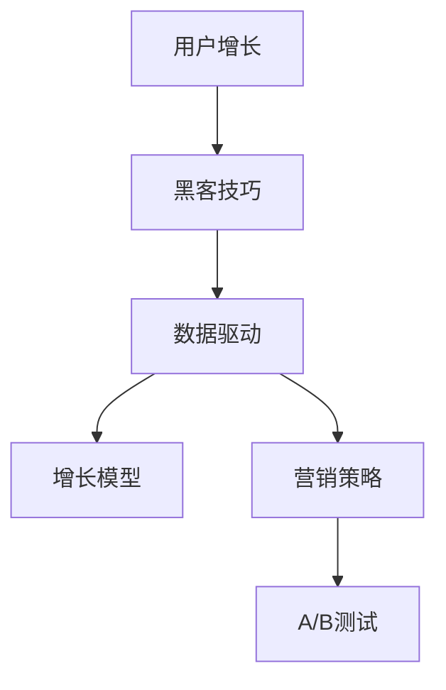

                 

# 知识付费平台的用户增长黑客技巧

> 关键词：用户增长, 黑客技巧, 知识付费平台, 数据驱动, 增长模型, 营销策略, A/B测试

## 1. 背景介绍

### 1.1 问题由来
在数字化时代，知识付费平台作为一种新型的教育消费模式，已经吸引了大量用户和投资者的关注。然而，如何实现用户的快速增长和平台收益的提升，成为知识付费平台的一大挑战。传统的推广方式往往难以触及潜在用户，而利用黑客技巧，在用户增长的道路上展开创新和实践，成为提升平台竞争力的重要手段。

### 1.2 问题核心关键点
黑客技巧，源自黑客社区中通过逆向思维、非正统手段解决问题的智慧。在知识付费平台上，黑客技巧通常指的是利用数据驱动、技术手段、用户心理等因素，对平台的用户增长策略进行优化和创新，从而快速扩大用户规模，提升平台价值。

本博客将深入探讨知识付费平台的用户增长黑客技巧，帮助平台开发者和运营人员掌握实用的增长策略，破解用户增长的困局，构建稳定增长的知识付费生态。

## 2. 核心概念与联系

### 2.1 核心概念概述

为更好地理解黑客技巧在知识付费平台用户增长中的应用，本节将介绍几个密切相关的核心概念：

- **用户增长**：通过有策略地吸引、转化和留存用户，不断提升平台的用户规模和活跃度。
- **黑客技巧**：利用创新的、非正统的方法，解决常规增长策略难以触及的问题。
- **知识付费平台**：提供有价值知识和技能，通过付费模式实现商业变现的在线平台。
- **数据驱动**：通过数据分析和挖掘，指导增长策略的制定和优化。
- **增长模型**：用于描述和预测用户增长行为的数学模型。
- **营销策略**：通过精心设计的推广活动，吸引用户参与和使用平台。
- **A/B测试**：对比两种策略的效果，验证哪种策略更有效。

这些核心概念之间的逻辑关系可以通过以下Mermaid流程图来展示：



这个流程图展示了一些核心概念及其之间的关系：

1. 用户增长通过黑客技巧获得新的策略和方法。
2. 黑客技巧在数据驱动的支持下，更加精准有效地执行。
3. 增长模型和营销策略是黑客技巧的重要支撑。
4. A/B测试用于验证黑客技巧的有效性。

这些概念共同构成了知识付费平台用户增长的关键框架，使得平台能够高效、持续地吸引用户，提升用户价值。

## 3. 核心算法原理 & 具体操作步骤
### 3.1 算法原理概述

黑客技巧在知识付费平台用户增长中的应用，本质上是一种基于数据和技术手段的用户增长优化方法。其核心思想是：通过数据分析，发现用户增长中的瓶颈，利用技术手段创造性地解决这些问题，从而实现用户快速增长。

形式化地，假设知识付费平台的用户增长目标为 $U$，当前用户量为 $U_0$，目标用户量为 $U_{\text{target}}$。用户增长的黑客技巧通过调整变量 $X_1, X_2, ..., X_n$（如广告投放、内容推广、价格调整等），使得最终用户量接近目标值 $U_{\text{target}}$。

$$
U = f(X_1, X_2, ..., X_n)
$$

其中 $f$ 为用户增长模型，用于描述变量 $X_i$ 对用户量 $U$ 的影响关系。

### 3.2 算法步骤详解

知识付费平台用户增长的黑客技巧主要包括以下几个关键步骤：

**Step 1: 数据分析与问题诊断**
- 收集平台用户行为数据，如访问路径、购买行为、付费周期等。
- 使用数据挖掘和统计分析方法，识别出用户增长的瓶颈和异常点。
- 通过可视化工具如Tableau、Power BI等，将数据分析结果直观展示出来，发现问题。

**Step 2: 黑客技巧设计**
- 针对分析发现的问题，设计创新、高效的增长策略。
- 如针对新用户引入，设计合理的广告投放策略；针对老用户留存，推出高质量的增值服务。
- 使用数据驱动的方法，如用户分群、个性化推荐等，优化用户体验。

**Step 3: 效果评估与迭代优化**
- 通过A/B测试，对比两种策略的效果，验证哪种策略更有效。
- 根据测试结果，不断迭代优化策略，直至达到用户增长目标。
- 定期回顾增长策略的效果，确保策略的有效性和适应性。

### 3.3 算法优缺点

黑客技巧在知识付费平台用户增长中的应用，具有以下优点：
1. 创新高效。黑客技巧常常突破传统思维，采用创新的方式解决问题，能够在较短时间内实现显著的用户增长。
2. 数据驱动。黑客技巧通过数据驱动的方法，确保增长策略的精准性和有效性。
3. 持续优化。黑客技巧强调持续迭代和优化，确保策略始终处于最佳状态。

同时，该方法也存在一定的局限性：
1. 风险较高。一些黑客技巧可能涉及高风险操作，如过激的广告投放，可能导致用户反感。
2. 依赖资源。黑客技巧的成功实施需要较高的资源投入，如资金、人力、技术等。
3. 适用性有限。某些黑客技巧可能仅适用于特定平台或特定阶段，具有局限性。

尽管存在这些局限性，但就目前而言，黑客技巧已成为知识付费平台用户增长的重要手段。未来相关研究的重点在于如何进一步降低实施风险，提高资源利用效率，同时兼顾用户体验和平台价值。

### 3.4 算法应用领域

黑客技巧在知识付费平台用户增长中的应用，已经涵盖了多个领域，例如：

- **新用户获取**：通过精心设计的广告投放、免费试用、内容预告等策略，吸引新用户注册。
- **老用户留存**：通过内容更新、推荐系统、会员权益等手段，提升老用户粘性和活跃度。
- **付费转化**：通过优惠券、限时折扣、专属内容等激励措施，引导用户进行付费购买。
- **用户体验优化**：通过个性化推荐、界面改进、智能客服等技术，提升用户满意度和留存率。

除了上述这些经典领域外，黑客技巧还创新性地应用于更多场景中，如跨平台引流、社区互动、内容合作等，为知识付费平台的增长带来新的突破。随着技术的不断进步和策略的持续优化，黑客技巧将在更多领域得到应用，为知识付费平台的快速成长注入新的动力。

## 4. 数学模型和公式 & 详细讲解 & 举例说明

### 4.1 数学模型构建

本节将使用数学语言对黑客技巧在知识付费平台用户增长中的应用进行更加严格的刻画。

假设知识付费平台的用户增长目标为 $U$，当前用户量为 $U_0$，目标用户量为 $U_{\text{target}}$。增长策略对用户量的影响可以用增长模型 $f(X_1, X_2, ..., X_n)$ 来描述。

在具体应用中，我们通常关注以下几个关键参数：

1. **转化率**：指访问用户转化为付费用户的比例。通过优化广告投放、内容质量和用户体验，提升转化率。
2. **流失率**：指付费用户停止付费的比例。通过提高内容质量、优化推荐系统等手段，减少流失率。
3. **复购率**：指已付费用户再次付费的比例。通过会员体系、专属内容等策略，提升复购率。

### 4.2 公式推导过程

以下我们以付费转化为例，推导转化率优化公式。

假设知识付费平台的转化率为 $\eta$，广告投放预算为 $B$，每次点击的平均成本为 $C_{\text{avg}}$，则广告投放的边际收益为 $R = \eta B - C_{\text{avg}}B$。

为了最大化广告投放的边际收益，我们构建目标函数：

$$
\max R = \eta B - C_{\text{avg}}B
$$

通过求解该最优化问题，可以找到最优的广告投放预算 $B^*$。

$$
B^* = \frac{R}{C_{\text{avg}} - \eta}
$$

在实际操作中，我们还需要考虑广告投放的ROI（投资回报率），确保广告投放的经济性。ROI计算公式为：

$$
\text{ROI} = \frac{R}{B} = \frac{\eta - C_{\text{avg}}}{C_{\text{avg}}}
$$

在满足 $\text{ROI} > 1$ 的条件下，广告投放策略才能真正带来收益。

### 4.3 案例分析与讲解

假设某知识付费平台通过广告投放提升用户转化率。通过A/B测试，我们发现以下两种广告投放策略的效果：

| 策略 | 广告投放预算 | 广告点击率 | 转化率 |
| --- | --- | --- | --- |
| 策略A | $B_A$ | $R_A$ | $\eta_A$ |
| 策略B | $B_B$ | $R_B$ | $\eta_B$ |

我们希望找到最优的广告投放策略，最大化广告投放的边际收益。通过求解目标函数：

$$
\max R = (\eta_A B_A - C_{\text{avg}} B_A) - (\eta_B B_B - C_{\text{avg}} B_B)
$$

可以得到最优的广告投放预算 $B^*$ 和点击率 $R^*$。

实际应用中，我们通常会将该过程封装成自动化工具，通过机器学习模型预测最优投放策略，从而实现快速决策和迭代优化。

## 5. 项目实践：代码实例和详细解释说明
### 5.1 开发环境搭建

在进行黑客技巧实践前，我们需要准备好开发环境。以下是使用Python进行A/B测试实验的环境配置流程：

1. 安装Anaconda：从官网下载并安装Anaconda，用于创建独立的Python环境。

2. 创建并激活虚拟环境：
```bash
conda create -n abtest_env python=3.8 
conda activate abtest_env
```

3. 安装必要的Python库：
```bash
pip install numpy pandas scikit-learn matplotlib statsmodels statsmodels
```

4. 安装A/B测试工具：
```bash
pip install aBtest
```

5. 安装可视化工具：
```bash
pip install matplotlib
```

完成上述步骤后，即可在`abtest_env`环境中开始A/B测试实践。

### 5.2 源代码详细实现

下面我们以付费转化为例，给出使用A/B测试工具对广告投放策略进行评估的Python代码实现。

```python
import aBtest as abtest
import pandas as pd
import matplotlib.pyplot as plt
import numpy as np

# 创建A/B测试实验
exp = abtest.Experiment()
exp.add_variant('variantA', {'budget': 10000, 'rate': 0.01, 'conversion_rate': 0.1})
exp.add_variant('variantB', {'budget': 15000, 'rate': 0.02, 'conversion_rate': 0.2})

# 加载实验数据
data = pd.read_csv('abtest_data.csv')
exp.load(data, 'ad_id', 'conversion')

# 设置实验目标
exp.set_objective('conversion')

# 设置优化目标
exp.set_optimization('ROI')

# 运行实验
exp.run()

# 输出实验结果
print(exp.get_results())
```

以上代码实现了基本的A/B测试流程，具体步骤如下：

1. 创建A/B测试实验，定义两种广告投放策略。
2. 加载实验数据，确保实验数据的准确性和完整性。
3. 设置实验目标和优化目标，明确我们希望优化的指标。
4. 运行实验，自动生成测试结果。
5. 输出实验结果，供我们进行分析和决策。

### 5.3 代码解读与分析

让我们再详细解读一下关键代码的实现细节：

**abtest库的使用**：
- `abtest.Experiment()`：创建一个新的A/B测试实验，定义实验组和对照组。
- `exp.add_variant(variant_name, params)`：向实验中添加一个新的变异组，定义其参数。
- `exp.load(data, key1, key2)`：加载实验数据，指定数据来源和关键字段。
- `exp.set_objective(objective)`：设置实验目标，例如付费转化率。
- `exp.set_optimization(optimization)`：设置优化目标，例如ROI。
- `exp.run()`：运行实验，生成测试结果。
- `exp.get_results()`：获取实验结果，供分析和决策。

**实验设计**：
- 定义两个广告投放策略，分别设置预算、点击率、转化率等参数。
- 加载实验数据，确保数据覆盖全部广告投放样本。
- 设置实验目标为付费转化率，优化目标为ROI。

**实验运行**：
- 运行实验，自动进行A/B测试，生成测试结果。
- 输出实验结果，分析哪种策略效果更好。

**实验分析**：
- 通过可视化工具，将测试结果绘制成图表，供决策者直观分析。
- 根据测试结果，选择最优的广告投放策略，迭代优化实验参数。

## 6. 实际应用场景
### 6.1 用户获取

基于黑客技巧的用户获取策略，可以有效地提升新用户的注册和转化。以下是几种常见的方法：

- **定向广告**：通过精准的定向广告，投放至潜在用户活跃的平台和时段，如社交媒体、视频网站等。
- **试用期优惠**：提供免费试用期或优惠券，吸引用户尝试平台服务。
- **内容预告**：通过预热活动和优质内容的发布，吸引用户关注和参与。
- **推荐系统**：利用用户历史行为数据，推荐相关课程和内容，提升用户注册意愿。

### 6.2 用户留存

用户留存是知识付费平台用户增长的关键环节。以下是几种常见的方法：

- **内容更新**：定期更新高质量内容，保持用户对平台的粘性。
- **个性化推荐**：根据用户兴趣和行为数据，提供个性化推荐，提升用户满意度。
- **专属服务**：提供会员专享服务，如VIP会员、专属客服等，增强用户粘性。
- **社区互动**：构建活跃的社区，通过用户互动和讨论，提升用户留存率。

### 6.3 付费转化

付费转化是知识付费平台的核心目标。以下是几种常见的方法：

- **优惠折扣**：通过限时折扣和优惠券，吸引用户付费购买。
- **内容预览**：提供内容预览，吸引用户付费购买完整课程。
- **会员体系**：建立会员体系，提供会员专享内容和优惠，提升付费转化率。
- **反馈激励**：通过用户反馈和评价，提供奖励和优惠，鼓励用户付费购买。

### 6.4 未来应用展望

随着黑客技巧的不断发展，基于数据和技术手段的用户增长策略将越来越精准和高效。未来，黑客技巧在知识付费平台的应用可能包括以下几个方面：

- **数据可视化**：利用大数据和可视化工具，实时监控用户增长数据，及时发现和解决问题。
- **用户分群**：通过用户行为数据和机器学习模型，将用户进行精细化分群，提供个性化的增长策略。
- **智能推荐**：利用推荐系统，提升用户体验和满意度，增加用户粘性。
- **个性化内容**：根据用户兴趣和行为，生成个性化内容，提升用户转化率。
- **社交化营销**：通过社交媒体和社区营销，快速扩大用户规模，提升品牌知名度。

这些方向的探索发展，将进一步推动知识付费平台的快速增长，为教育技术的发展注入新的动力。相信随着技术的不断进步和策略的持续优化，黑客技巧将在更多领域得到应用，为知识付费平台的快速成长注入新的动力。

## 7. 工具和资源推荐
### 7.1 学习资源推荐

为了帮助开发者系统掌握黑客技巧在知识付费平台用户增长中的应用，这里推荐一些优质的学习资源：

1. **《数据驱动的产品增长》**：详细介绍了如何利用数据驱动的产品增长，包括A/B测试、用户增长模型、增长策略等。
2. **《Python数据分析》**：通过Python进行数据分析和可视化，展示如何利用数据驱动用户增长。
3. **《用户增长黑客指南》**：涵盖用户增长策略、A/B测试、数据驱动方法等内容，适合初学者和中级开发者。
4. **《增长黑客实战》**：通过真实案例，展示如何运用黑客技巧实现用户快速增长，适合实战学习。
5. **《增长黑客工具箱》**：提供一系列工具和资源，帮助开发者高效实施用户增长策略。

通过对这些资源的学习实践，相信你一定能够快速掌握黑客技巧在知识付费平台用户增长中的应用，并用于解决实际的增长问题。

### 7.2 开发工具推荐

高效的开发离不开优秀的工具支持。以下是几款用于黑客技巧开发的常用工具：

1. **Python**：开源且灵活的编程语言，广泛用于数据分析、机器学习等领域。
2. **A/B测试工具**：如abtest、Optimizely等，帮助开发者进行实验对比，验证策略效果。
3. **数据可视化工具**：如Tableau、Power BI等，帮助开发者直观展示数据，发现问题。
4. **机器学习库**：如scikit-learn、TensorFlow等，帮助开发者进行模型训练和优化。
5. **自动化测试工具**：如Jenkins、Travis CI等，帮助开发者实现自动化测试和部署。

合理利用这些工具，可以显著提升黑客技巧的开发效率，加快创新迭代的步伐。

### 7.3 相关论文推荐

黑客技巧在知识付费平台用户增长中的应用，得益于学界的持续研究。以下是几篇奠基性的相关论文，推荐阅读：

1. **《基于A/B测试的用户增长优化》**：介绍如何使用A/B测试进行用户增长优化，包含实验设计、结果分析和优化策略等内容。
2. **《数据驱动的用户增长模型》**：详细介绍了如何通过数据驱动的方法构建用户增长模型，实现精准的增长预测和策略优化。
3. **《个性化推荐系统在用户增长中的应用》**：探讨了个性化推荐系统如何提升用户满意度和留存率，增强用户增长效果。
4. **《知识付费平台的用户增长策略》**：通过实际案例，展示了知识付费平台的用户增长策略和优化方法。
5. **《用户增长的机器学习模型》**：介绍了机器学习在用户增长中的应用，包括用户分群、行为预测等内容。

这些论文代表了大规模数据分析和用户增长方法的研究方向，通过学习这些前沿成果，可以帮助研究者把握学科前进方向，激发更多的创新灵感。

## 8. 总结：未来发展趋势与挑战
### 8.1 总结

本文对基于黑客技巧的知识付费平台用户增长方法进行了全面系统的介绍。首先阐述了黑客技巧在知识付费平台用户增长中的应用背景和意义，明确了黑客技巧在用户增长中的独特价值。其次，从原理到实践，详细讲解了黑客技巧的数学原理和关键步骤，给出了黑客技巧任务开发的完整代码实例。同时，本文还广泛探讨了黑客技巧在知识付费平台多个领域的实际应用前景，展示了黑客技巧范式的巨大潜力。此外，本文精选了黑客技巧技术的各类学习资源，力求为读者提供全方位的技术指引。

通过本文的系统梳理，可以看到，基于黑客技巧的用户增长方法在知识付费平台上的应用前景广阔，能够帮助平台快速提升用户规模，实现稳定增长。黑客技巧不仅突破了传统的增长策略，更通过数据驱动和创新方法，实现了用户增长的快速迭代和优化。未来，随着黑客技巧的持续探索和发展，知识付费平台的用户增长将迈向更高水平，为教育技术的发展注入新的动力。

### 8.2 未来发展趋势

展望未来，黑客技巧在知识付费平台用户增长中的应用将呈现以下几个发展趋势：

1. **数据驱动的精准化**：通过更加精细化的数据分析，挖掘用户行为模式，实现更精准的用户增长策略。
2. **个性化推荐的深入应用**：利用推荐系统，提升个性化内容和推荐，增强用户粘性和转化率。
3. **跨平台协同增长**：通过多平台联动，实现用户数据的整合和共享，提升用户增长效果。
4. **智能营销的创新应用**：结合人工智能技术，进行智能广告投放和内容推荐，提升营销效果。
5. **用户分群和细分策略**：通过用户分群和细分策略，提供个性化的用户增长方案，提高增长效率。
6. **动态调整和优化**：实时监控用户行为和增长数据，动态调整策略，确保用户增长的持续优化。

这些趋势将进一步推动黑客技巧在知识付费平台上的应用，实现更加精准、高效的增长策略，推动平台快速成长。

### 8.3 面临的挑战

尽管黑客技巧在知识付费平台用户增长上取得了显著效果，但在实践中也面临诸多挑战：

1. **数据隐私和安全**：在收集和分析用户数据时，需要注意数据隐私和安全性，确保用户数据不被滥用。
2. **资源消耗**：黑客技巧的应用需要大量的数据和计算资源，可能导致成本上升。
3. **策略风险**：部分黑客技巧可能涉及高风险操作，需要谨慎设计和测试。
4. **用户体验**：在追求增长效果时，需要平衡用户需求和体验，避免过度干扰用户。
5. **跨平台兼容性**：在不同平台和设备上进行用户增长，需要考虑兼容性问题，确保策略的一致性和效果。

尽管存在这些挑战，但通过合理的策略设计和持续的优化，这些挑战是可以通过技术手段和精细化管理来解决的。未来，随着黑客技巧的不断成熟和优化，知识付费平台的用户增长将更加稳定和高效，为教育技术的进步提供坚实的基础。

### 8.4 研究展望

面对黑客技巧在知识付费平台用户增长上所面临的挑战，未来的研究需要在以下几个方面寻求新的突破：

1. **数据隐私保护**：研究如何在保障数据隐私的前提下，进行用户行为数据的收集和分析。
2. **资源优化**：研究如何高效利用计算资源，降低黑客技巧的实施成本。
3. **策略可解释性**：研究如何提高黑客技巧的策略可解释性，增强用户信任和接受度。
4. **跨平台兼容**：研究如何实现跨平台的用户增长策略，确保策略的一致性和效果。
5. **个性化推荐**：研究如何通过推荐系统提升个性化内容和推荐，增强用户粘性和转化率。
6. **智能营销**：研究如何结合人工智能技术，进行智能广告投放和内容推荐，提升营销效果。

这些研究方向将进一步推动黑客技巧在知识付费平台上的应用，实现更加精准、高效的增长策略，推动平台快速成长。相信随着技术的不断进步和策略的持续优化，黑客技巧将在更多领域得到应用，为知识付费平台的快速成长注入新的动力。

## 9. 附录：常见问题与解答

**Q1：黑客技巧在知识付费平台的用户增长中，如何确保数据隐私和安全？**

A: 确保数据隐私和安全是黑客技巧在知识付费平台用户增长中的重要课题。具体措施包括：

1. **数据匿名化**：在数据收集和分析过程中，采用数据匿名化技术，确保用户身份信息不被泄露。
2. **加密传输**：在数据传输过程中，使用加密算法保护数据安全。
3. **访问控制**：设置严格的访问权限控制，确保只有授权人员能够访问和处理数据。
4. **数据存储安全**：采用安全的数据存储方案，如数据加密、定期备份等，防止数据丢失和篡改。
5. **合规审查**：遵守数据保护法规，如GDPR、CCPA等，确保数据处理的合规性。

通过这些措施，可以在保障用户隐私的前提下，进行黑客技巧的应用和优化。

**Q2：黑客技巧在知识付费平台的用户增长中，如何平衡用户体验和增长效果？**

A: 在用户增长的过程中，平衡用户体验和增长效果是关键。具体措施包括：

1. **个性化推荐**：通过个性化推荐，提升用户满意度和留存率，避免过度干扰用户。
2. **即时反馈**：提供即时反馈机制，让用户能够及时了解其行为的影响，增强用户粘性。
3. **用户体验优化**：不断优化平台的用户体验，提升用户满意度，避免用户体验受损。
4. **用户教育**：通过用户教育，让用户了解其行为对平台的影响，增强用户的参与感和信任度。

通过这些措施，可以在提升增长效果的同时，确保用户体验的优化，实现用户增长和平台价值的双重提升。

**Q3：黑客技巧在知识付费平台的用户增长中，如何应对跨平台兼容性问题？**

A: 在跨平台进行用户增长时，需要注意兼容性问题，确保策略的一致性和效果。具体措施包括：

1. **统一数据格式**：在跨平台数据交换时，采用统一的数据格式，确保数据的一致性和准确性。
2. **平台适配**：针对不同平台的特点，进行平台适配，确保策略在不同平台上的效果一致。
3. **API接口设计**：设计统一的API接口，方便跨平台的数据传输和处理。
4. **实时同步**：实时同步用户数据，确保不同平台上的数据一致性。
5. **多平台测试**：在实施策略前，进行多平台测试，确保策略在不同平台上的效果一致。

通过这些措施，可以有效地应对跨平台兼容性问题，确保用户增长的稳定和高效。

---

作者：禅与计算机程序设计艺术 / Zen and the Art of Computer Programming

