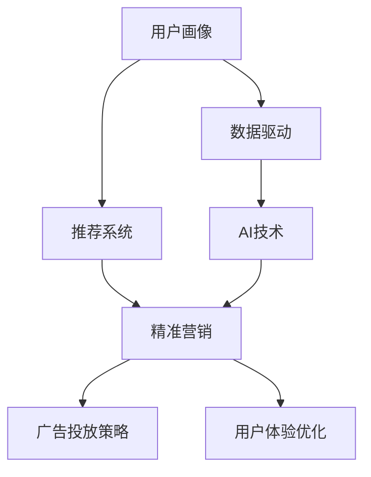

                 

# 知识付费平台的用户画像与精准营销

> 关键词：用户画像(User Persona), 精准营销(Precision Marketing), 推荐系统(Recommendation System), 数据驱动(Data-Driven), 人工智能(Artificial Intelligence), 客户细分(Customer Segmentation)

## 1. 背景介绍

### 1.1 问题由来
随着互联网与智能科技的飞速发展，知识付费平台如雨后春笋般涌现。这些平台通过提供有价值的知识内容，满足用户的终身学习需求，加速个人技能提升和职业发展。然而，面对海量用户与复杂的用户需求，如何精准匹配内容，提高用户体验与留存率，成为知识付费平台亟需解决的问题。

### 1.2 问题核心关键点
精准营销是知识付费平台提高用户粘性、增加收入的关键。其核心在于对用户行为和需求的深入理解，通过个性化推荐和定向广告等手段，实现内容与用户的高匹配度，进而提升用户价值和平台收益。

精准营销的关键点包括：
1. **用户画像构建**：理解目标用户的基本属性、行为特征和需求偏好，为个性化推荐提供依据。
2. **推荐算法设计**：构建高效、灵活的推荐系统，实现内容的个性化匹配。
3. **数据驱动决策**：基于用户数据与行为，进行实时分析和迭代优化，确保推荐系统的精度与效率。
4. **广告投放策略**：通过精准定位，确保广告投放效果最大化，提升平台的商业价值。
5. **用户体验优化**：保证内容推荐和广告投放的互动友好，避免用户反感，提升用户满意度。

本文聚焦于用户画像的构建与精准营销的实施，介绍如何通过数据驱动和AI技术，实现知识付费平台的个性化推荐和高效营销。

## 2. 核心概念与联系

### 2.1 核心概念概述

为更好地理解知识付费平台的精准营销方法，本节将介绍几个关键概念：

- **用户画像(User Persona)**：基于用户的个人基本信息、行为特征、兴趣爱好等构建的描述性模型，用于指导个性化推荐和定向广告。
- **精准营销(Precision Marketing)**：通过精准识别和定位目标用户，实施个性化推荐和定向广告，提高营销效果和用户满意度。
- **推荐系统(Recommendation System)**：根据用户历史行为和偏好，自动推荐相关内容的系统，是精准营销的核心工具。
- **数据驱动(Data-Driven)**：利用大数据和机器学习技术，从海量数据中挖掘用户需求和行为规律，指导推荐系统的设计与优化。
- **人工智能(Artificial Intelligence)**：包括机器学习、深度学习、自然语言处理等技术，用于构建推荐算法和优化营销策略。
- **客户细分(Customer Segmentation)**：将用户群体划分为若干细分市场，针对不同市场制定差异化的营销策略。

这些核心概念之间的联系可以通过以下Mermaid流程图来展示：



这个流程图展示了一些关键概念及其之间的关系：

1. 用户画像基于用户数据，为推荐系统提供依据。
2. 推荐系统利用用户画像，实现内容个性化匹配。
3. 数据驱动和AI技术用于优化推荐系统的设计和优化。
4. 精准营销通过推荐系统与广告投放策略，提升用户价值和平台收益。
5. 用户体验优化确保推荐和广告投放的互动友好。

## 3. 核心算法原理 & 具体操作步骤
### 3.1 算法原理概述

精准营销的核心在于推荐系统，其核心算法原理主要包括以下几个方面：

1. **协同过滤算法**：基于用户历史行为，找到兴趣相似的用户，向用户推荐其感兴趣的内容。
2. **基于内容的推荐算法**：根据用户喜欢的内容，推荐与之内容相关的内容。
3. **深度学习推荐算法**：利用深度神经网络，从用户行为数据中挖掘用户需求，实现更加灵活、高效的推荐。
4. **混合推荐算法**：将协同过滤、基于内容与深度学习算法结合，实现推荐效果的最优化。

协同过滤算法和基于内容的推荐算法是推荐系统最基础的方法，但随着深度学习技术的兴起，深度学习推荐算法成为推荐系统的最新发展方向。混合推荐算法则是将不同算法进行有效融合，提升推荐效果的综合方案。

### 3.2 算法步骤详解

以下详细介绍深度学习推荐算法的基本步骤：

**Step 1: 数据准备**
- 收集用户行为数据，包括浏览、购买、评分等行为。
- 清洗数据，去除噪声和异常值。
- 划分训练集和测试集。

**Step 2: 特征工程**
- 从用户行为数据中提取特征，如点击次数、浏览时间、购买记录等。
- 对特征进行标准化、归一化等处理。
- 设计推荐模型所需的用户-物品相似度矩阵。

**Step 3: 模型训练**
- 构建深度神经网络模型，通常包括多个全连接层和嵌入层。
- 使用反向传播算法和随机梯度下降法（SGD）进行模型训练。
- 设置合适的超参数，如学习率、批次大小等。

**Step 4: 评估与优化**
- 使用测试集评估模型性能，计算均方根误差（RMSE）、平均绝对误差（MAE）等指标。
- 利用梯度下降等优化算法，对模型进行微调，提升预测精度。
- 引入正则化技术，防止模型过拟合。

**Step 5: 部署与迭代**
- 将训练好的模型部署到推荐系统中。
- 实时更新用户行为数据，进行模型迭代。
- 定期回测模型性能，优化模型参数。

### 3.3 算法优缺点

深度学习推荐算法具有以下优点：
1. 能处理高维稀疏数据，适应大规模数据集。
2. 自适应性强，能够动态更新推荐结果。
3. 推荐结果更加个性化，准确度较高。

同时，该算法也存在一些局限性：
1. 对新用户的推荐效果较差，需要大量历史数据。
2. 计算复杂度高，训练和推理耗时较长。
3. 模型黑盒性较强，可解释性不足。

深度学习推荐算法是推荐系统发展的最新趋势，尽管存在上述局限，但综合来看，其在用户画像构建与精准营销中的应用前景广阔。

### 3.4 算法应用领域

深度学习推荐算法在知识付费平台的精准营销中有着广泛的应用，主要涵盖以下几个方面：

- **个性化推荐**：根据用户历史行为，推荐用户感兴趣的内容，提高用户粘性和满意度。
- **定向广告**：基于用户画像，精准投放广告，提升平台收入。
- **用户画像构建**：通过分析用户行为数据，形成详细的用户画像，指导营销策略。
- **用户细分**：对用户进行细分，制定差异化营销策略，提升用户价值。
- **平台优化**：优化平台内容和广告策略，提升用户体验与留存率。

以上领域中，个性化推荐和定向广告是深度学习推荐算法的主要应用场景，对平台的用户增长和收入提升起到至关重要的作用。

## 4. 数学模型和公式 & 详细讲解 & 举例说明

### 4.1 数学模型构建

本节将使用数学语言对推荐系统的数学模型进行描述。

设用户为 $U$，物品为 $V$，推荐系统记录了 $N$ 个用户的 $M$ 个行为 $(i, j)$，其中 $i \in U, j \in V$。目标是构建推荐模型 $f: U \times V \rightarrow \mathbb{R}$，用于预测用户对物品的兴趣评分。

推荐系统的目标函数为：

$$
\min_{f} \sum_{(i, j) \in D} L(f(i, j), y_{i, j})
$$

其中 $L$ 为损失函数，$y_{i, j}$ 为物品 $j$ 在用户 $i$ 上的实际评分，$D$ 为训练数据集。

常见的损失函数包括均方误差损失和交叉熵损失。推荐模型的预测评分 $f(i, j)$ 可以通过多层神经网络计算得到，其中嵌入层用于将用户和物品映射到低维空间，全连接层用于捕捉用户和物品之间的关系。

### 4.2 公式推导过程

以协同过滤算法为例，推导用户 $i$ 对物品 $j$ 的评分预测 $f(i, j)$。

设用户 $i$ 和物品 $j$ 的邻居用户集合分别为 $N_i$ 和 $N_j$，则协同过滤算法根据邻居用户的评分，预测用户 $i$ 对物品 $j$ 的评分：

$$
f(i, j) = \sum_{k \in N_i \cap N_j} (\frac{u_i^T w_k u_j}{\sum_{k'} \frac{u_i^T w_k' u_j}})
$$

其中 $u_i$ 和 $u_j$ 为物品 $i$ 和物品 $j$ 的向量表示，$w_k$ 为权重矩阵，$u_i^T$ 为向量 $u_i$ 的转置。

### 4.3 案例分析与讲解

考虑一个典型的电商平台推荐系统，用户可以浏览、购买、评分商品，推荐系统根据用户行为，预测用户对商品的评分，实现个性化推荐。

假设用户 $i$ 购买了物品 $j_1$ 和 $j_2$，推荐系统记录了其评分数据 $(3, j_1)$ 和 $(4, j_2)$。根据协同过滤算法，可以计算用户 $i$ 对物品 $j_3$ 的预测评分：

$$
f(i, j_3) = \frac{u_i^T w_{j_1} u_{j_3}}{\sum_{k'} \frac{u_i^T w_{j_1} u_{k'}}}
$$

其中 $w_{j_1}$ 为物品 $j_1$ 的权重矩阵。通过预测评分 $f(i, j_3)$，推荐系统可以推荐用户 $i$ 可能感兴趣的商品 $j_3$。

## 5. 项目实践：代码实例和详细解释说明
### 5.1 开发环境搭建

进行推荐系统开发前，需要搭建合适的开发环境。以下是使用Python进行推荐系统开发的环境配置流程：

1. 安装Python：
```bash
conda install python=3.8
```

2. 安装必要的依赖包：
```bash
pip install numpy scipy pandas scikit-learn torch
```

3. 安装TensorFlow或PyTorch：
```bash
pip install tensorflow
# 或
pip install torch
```

4. 安装推荐系统相关的库：
```bash
pip install lightning
```

完成上述步骤后，即可在PyTorch或TensorFlow环境下开始推荐系统的开发。

### 5.2 源代码详细实现

以下是一个基于TensorFlow的推荐系统的代码实现，使用协同过滤算法和深度学习模型进行个性化推荐：

```python
import tensorflow as tf
import numpy as np
from tensorflow.keras.layers import Input, Embedding, Dot, Flatten, Dense

# 定义模型
user_input = Input(shape=(1,))
item_input = Input(shape=(1,))
user_embedding = Embedding(input_dim=N_users, output_dim=100)(user_input)
item_embedding = Embedding(input_dim=N_items, output_dim=100)(item_input)
dot = Dot(axes=1)([user_embedding, item_embedding])
output = Dense(1, activation='sigmoid')(dot)

# 定义数据集
user_data = np.random.randint(0, N_users, size=(M,))
item_data = np.random.randint(0, N_items, size=(M,))
rating_data = np.random.randint(1, 5, size=(M,))

# 构建模型
model = tf.keras.Model(inputs=[user_input, item_input], outputs=output)

# 定义损失函数
loss = tf.keras.losses.BinaryCrossentropy()

# 编译模型
model.compile(optimizer=tf.keras.optimizers.Adam(), loss=loss)

# 训练模型
model.fit([user_data, item_data], rating_data, epochs=10)
```

### 5.3 代码解读与分析

让我们再详细解读一下关键代码的实现细节：

**定义模型**：
- 用户和物品的嵌入层：将用户和物品映射到100维的向量空间。
- 点积层：计算用户和物品的向量点积，得到用户对物品的预测评分。
- 全连接层：输出最终预测评分，使用sigmoid激活函数进行二分类。

**数据集构建**：
- 使用随机生成的用户ID和物品ID，模拟用户的行为数据。

**模型编译与训练**：
- 使用Adam优化器进行模型训练，损失函数为二分类交叉熵。
- 设置10轮训练，每轮训练1个batch。

**推荐系统实现**：
- 模型训练完毕后，即可使用`predict`方法进行推荐。

## 6. 实际应用场景
### 6.1 智能推荐系统

智能推荐系统是推荐系统在知识付费平台中最典型、最广泛的应用场景。通过分析用户行为数据，推荐系统能够精准匹配用户与内容，提高用户粘性和满意度。

具体而言，推荐系统可以基于用户的历史浏览记录、购买记录和评分记录，推荐其感兴趣的内容。对于新用户，推荐系统可以基于其关注话题或浏览记录，进行冷启动推荐，帮助其快速发现感兴趣的内容。

### 6.2 个性化课程推荐

知识付费平台的核心内容是课程。个性化课程推荐能够帮助用户发现感兴趣的课程，提高学习效率。推荐系统可以根据用户的学习历史、浏览记录和评分数据，推荐与其兴趣相关的课程。例如，对于喜欢编程的用户，推荐系统可以推荐相关的编程课程，如Python、Java等。

### 6.3 精准广告投放

广告是知识付费平台的重要收入来源之一。精准广告投放能够显著提高广告转化率，提升平台收益。推荐系统可以根据用户画像，精准投放广告，实现广告收入的最大化。例如，对于高消费用户，推荐系统可以推荐高价值课程或高级会员，提升广告收入。

### 6.4 未来应用展望

随着推荐系统技术的不断进步，未来的知识付费平台将具备以下特点：

1. **跨模态推荐**：推荐系统将整合视觉、听觉、文本等多种模态的信息，实现多模态推荐。例如，通过分析用户的浏览记录和购买行为，推荐相关的视频课程或音频书籍。

2. **实时推荐**：推荐系统将实现实时更新，即时响应用户行为变化。例如，用户在观看视频时，推荐系统可以动态推荐相关课程或书籍。

3. **自适应推荐**：推荐系统将根据用户行为变化，动态调整推荐策略。例如，对于学习态度变化的用户，推荐系统可以及时调整推荐内容，保持其学习兴趣。

4. **个性化广告**：推荐系统将实现高度个性化的广告投放，避免用户反感，提升广告效果。例如，对于喜欢经济类的用户，推荐系统可以推荐相关的经济学课程或书籍。

5. **知识图谱推荐**：推荐系统将整合知识图谱信息，实现更加全面、精准的推荐。例如，推荐系统可以根据用户的学习兴趣，推荐相关的论文、文献等。

## 7. 工具和资源推荐
### 7.1 学习资源推荐

为了帮助开发者系统掌握推荐系统的理论基础和实践技巧，这里推荐一些优质的学习资源：

1. **《推荐系统实战》**：书中详细介绍推荐系统的基本概念和实现方法，包括协同过滤、基于内容的推荐和深度学习推荐等。
2. **《Deep Learning for Recommendation Systems》**：由深度学习领域的专家撰写，介绍深度学习在推荐系统中的应用，包括深度神经网络、注意力机制等。
3. **Coursera《Recommender Systems Specialization》**：由斯坦福大学教授开设的推荐系统专项课程，涵盖推荐系统的基本原理和实现方法。
4. **Udacity《Reinforcement Learning for Recommendation Systems》**：课程涵盖推荐系统中的强化学习算法，适合有一定深度学习基础的开发者。
5. **Kaggle推荐系统竞赛**：参与Kaggle推荐系统竞赛，积累实战经验，提升推荐系统的设计能力。

通过这些资源的学习实践，相信你一定能够快速掌握推荐系统的精髓，并用于解决实际的推荐问题。

### 7.2 开发工具推荐

高效的开发离不开优秀的工具支持。以下是几款用于推荐系统开发的常用工具：

1. **TensorFlow**：由Google主导开发的深度学习框架，生产部署方便，适合大规模工程应用。
2. **PyTorch**：基于Python的开源深度学习框架，灵活动态的计算图，适合快速迭代研究。
3. **Lightning**：基于PyTorch的轻量级深度学习框架，提供高效的模型训练和部署支持。
4. **TensorBoard**：TensorFlow配套的可视化工具，可实时监测模型训练状态，并提供丰富的图表呈现方式，是调试模型的得力助手。
5. **Weights & Biases**：模型训练的实验跟踪工具，可以记录和可视化模型训练过程中的各项指标，方便对比和调优。

合理利用这些工具，可以显著提升推荐系统的开发效率，加快创新迭代的步伐。

### 7.3 相关论文推荐

推荐系统的发展源于学界的持续研究。以下是几篇奠基性的相关论文，推荐阅读：

1. **《The BellKor 2010 Recommendation Challenge and Prize》**：详细介绍了Collaborative Filtering算法的竞赛结果和实现方法。
2. **《Neural Factorization Machines for Recommender Systems》**：提出神经网络因子分解机（NFM）算法，在推荐系统中取得优异表现。
3. **《Deep Interest Networks for Recommender Systems》**：提出深度兴趣网络（DIN）算法，利用用户兴趣动态生成推荐结果。
4. **《Adversarial Examples for Deep Reinforcement Learning》**：提出对抗性训练方法，提升推荐系统的鲁棒性和安全性。
5. **《Attention Is All You Need》**：提出Transformer模型，为深度学习推荐算法提供新的思路。

这些论文代表了大规模推荐系统的最新研究成果，通过学习这些前沿成果，可以帮助研究者把握学科前进方向，激发更多的创新灵感。

## 8. 总结：未来发展趋势与挑战
### 8.1 总结

本文对知识付费平台的用户画像构建与精准营销方法进行了全面系统的介绍。首先阐述了推荐系统在知识付费平台中的应用背景和重要意义，明确了推荐系统在提高用户粘性、增加收入等方面的关键作用。其次，从原理到实践，详细讲解了推荐系统的数学模型和核心算法，给出了推荐系统开发的完整代码实现。同时，本文还广泛探讨了推荐系统在智能推荐、个性化课程推荐、精准广告投放等方面的实际应用前景，展示了推荐系统的巨大潜力。此外，本文精选了推荐系统的各类学习资源，力求为读者提供全方位的技术指引。

通过本文的系统梳理，可以看到，推荐系统是知识付费平台精准营销的重要工具，能够通过数据分析和机器学习技术，实现内容的个性化推荐和高效营销。未来，伴随推荐系统技术的不断演进，推荐系统必将在知识付费平台中发挥更大的作用，促进平台的持续发展与用户价值的最大化。

### 8.2 未来发展趋势

展望未来，推荐系统将呈现以下几个发展趋势：

1. **深度学习技术的应用将更加广泛**：深度学习算法将成为推荐系统的主流方法，推荐系统将实现更加个性化和高效的推荐。
2. **推荐系统的应用领域将更加多样化**：推荐系统将不仅仅应用于知识付费平台，还将扩展到电商、社交、媒体等多个领域，实现多场景的个性化推荐。
3. **推荐系统的融合度将更高**：推荐系统将与其他AI技术如自然语言处理、视觉识别等进行深度融合，提升推荐效果和应用广度。
4. **推荐系统的可解释性将进一步提升**：推荐系统将具备更强的可解释性，便于用户理解推荐逻辑和改进推荐策略。
5. **推荐系统的安全性将更加重要**：推荐系统将需要更加注重数据隐私和安全，避免恶意广告和虚假信息对用户的侵害。

以上趋势凸显了推荐系统在未来的广泛应用和重要价值，进一步提升了推荐系统在知识付费平台中的地位和作用。

### 8.3 面临的挑战

尽管推荐系统已经取得了显著成就，但在迈向更加智能化、普适化应用的过程中，仍面临诸多挑战：

1. **数据隐私和安全问题**：推荐系统需要处理大量用户数据，数据隐私和安全问题不容忽视。如何在保护用户隐私的同时，提升推荐效果，将是推荐系统需要解决的重要问题。
2. **推荐系统的鲁棒性**：推荐系统面对复杂的网络环境和多变的数据分布，需要具备高度的鲁棒性，避免异常数据对推荐结果的影响。
3. **推荐系统的可解释性**：推荐系统往往是"黑盒"系统，难以解释其内部工作机制和决策逻辑。如何在保证推荐效果的同时，提升推荐系统的可解释性，将是未来的重要研究方向。
4. **推荐系统的跨模态融合**：推荐系统需要将多种模态的信息进行整合，提升推荐效果的全面性和准确性。
5. **推荐系统的实时性**：推荐系统需要实现实时更新，及时响应用户行为变化，提升用户体验。

这些挑战需要学界和产业界共同努力，通过创新技术和新方法，不断优化推荐系统，提升其性能和应用效果。

### 8.4 研究展望

面对推荐系统面临的种种挑战，未来的研究需要在以下几个方面寻求新的突破：

1. **数据隐私保护**：开发更加高效的数据隐私保护算法，在保护用户隐私的同时，提升推荐效果。
2. **推荐系统鲁棒性**：设计鲁棒性更强的推荐算法，提升推荐系统的鲁棒性和泛化能力。
3. **推荐系统可解释性**：结合因果分析和解释性AI技术，提升推荐系统的可解释性。
4. **跨模态推荐系统**：开发跨模态推荐算法，整合多种模态的信息，提升推荐系统的全面性和准确性。
5. **实时推荐系统**：开发实时推荐算法，实现推荐系统的即时更新和动态调整。

这些研究方向将引领推荐系统迈向更高的台阶，为知识付费平台和多个领域的推荐系统提供新的突破。面向未来，推荐系统需要与其他AI技术进行更深入的融合，共同推动智能推荐技术的发展。只有勇于创新、敢于突破，才能不断拓展推荐系统的边界，让智能推荐技术更好地服务于用户。

## 9. 附录：常见问题与解答

**Q1: 推荐系统为何需要用户画像？**

A: 用户画像描述了用户的兴趣、行为、偏好等特征，是推荐系统的关键输入。通过构建详细的用户画像，推荐系统能够更加精准地匹配用户与内容，提高推荐效果和用户满意度。

**Q2: 推荐系统如何处理新用户？**

A: 对于新用户，推荐系统可以通过以下方法进行冷启动推荐：
1. 根据用户行为数据，使用协同过滤算法进行推荐。
2. 根据用户兴趣标签，使用基于内容的推荐算法进行推荐。
3. 使用深度学习模型，根据用户行为数据进行推荐。

**Q3: 推荐系统的评估指标有哪些？**

A: 推荐系统的评估指标包括：
1. 均方根误差（RMSE）：用于评估推荐模型的预测精度。
2. 平均绝对误差（MAE）：用于评估推荐模型的预测精度。
3. 准确率（Accuracy）：用于评估推荐模型的分类精度。
4. 召回率（Recall）：用于评估推荐系统的覆盖率。
5. F1-Score：综合考虑准确率和召回率，用于评估推荐系统的综合性能。

**Q4: 推荐系统在实际应用中需要注意哪些问题？**

A: 推荐系统在实际应用中需要注意以下问题：
1. 数据隐私和安全：确保用户数据的隐私和安全，避免数据泄露和滥用。
2. 推荐系统鲁棒性：提升推荐系统的鲁棒性，避免异常数据对推荐结果的影响。
3. 推荐系统可解释性：提高推荐系统的可解释性，便于用户理解推荐逻辑和改进推荐策略。
4. 跨模态推荐系统：开发跨模态推荐算法，整合多种模态的信息，提升推荐效果的全面性和准确性。
5. 实时推荐系统：开发实时推荐算法，实现推荐系统的即时更新和动态调整。

这些问题是推荐系统在实际应用中需要关注的重要方面，需要在设计和开发中予以充分考虑和解决。

---

作者：禅与计算机程序设计艺术 / Zen and the Art of Computer Programming

