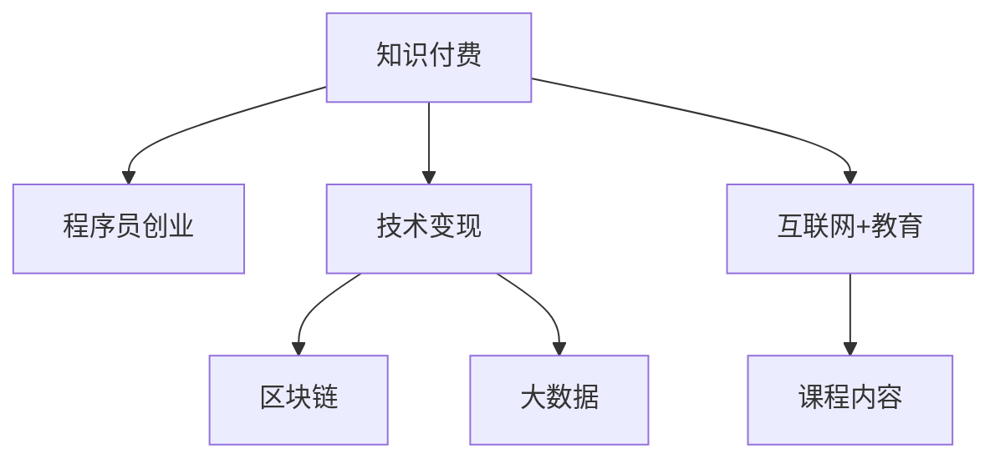

                 

# 知识付费时代程序员的创业机会与挑战

> 关键词：知识付费, 程序员创业, 人工智能, 技术变现, 区块链, 大数据, 互联网+教育

## 1. 背景介绍

### 1.1 问题由来

随着互联网技术的快速发展和普及，信息获取方式日益多元化，知识付费成为人们获取专业知识、提升职业技能的重要途径。知识付费模式不仅改变了传统的学习方式，也为程序员等专业人士提供了全新的创业机遇。

与此同时，伴随互联网+、AI技术的应用，市场对程序员的专业能力提出了更高的要求，同时也带来了巨大的挑战。如何利用自身优势，抓住知识付费的机遇，同时应对技术和市场的多变性，是每位程序员面临的重要课题。

### 1.2 问题核心关键点

在知识付费时代，程序员创业的关键点主要包括：
- 精准定位市场，识别有需求的用户群体。
- 开发高质量、有价值的课程内容。
- 合理利用技术手段，提升课程内容交付效率和用户体验。
- 借助新兴技术（如区块链、大数据等）保障课程知识产权，提高市场信任度。
- 应对技术和市场变化，保持持续创新和灵活调整。

## 2. 核心概念与联系

### 2.1 核心概念概述

为更好地理解程序员在知识付费领域的创业机会和挑战，本节将介绍几个密切相关的核心概念：

- **知识付费**：指用户为获取知识和技能，向内容创作者付费的行为。
- **程序员创业**：指程序员利用自身专业技能，通过创业方式进入知识付费市场，提供价值导向的专业教育内容。
- **技术变现**：指程序员将自身技术能力转化为商业价值，获取经济收益的过程。
- **区块链**：一种去中心化的分布式账本技术，可以用于解决知识产权和交易信任问题。
- **大数据**：指海量的结构化和非结构化数据，可以通过数据分析挖掘潜在商业价值。
- **互联网+教育**：指通过互联网技术，对传统教育方式进行升级和创新，提供更加便捷、高效的学习体验。

这些核心概念之间的逻辑关系可以通过以下Mermaid流程图来展示：



这个流程图展示了知识付费模式、程序员创业、技术变现以及新兴技术应用之间的关系：

1. 知识付费模式为程序员创业提供了新的市场机遇。
2. 程序员通过创业，将自己的技术能力转化为课程内容。
3. 技术变现是程序员创业的最终目标，实现其经济收益。
4. 区块链和大数据等新兴技术，可以提升课程内容质量和交易信任度。
5. 互联网+教育的理念，为课程内容交付提供了高效便捷的渠道。

这些核心概念共同构成了程序员在知识付费领域创业的基础框架，为识别机遇和应对挑战提供了清晰的指引。

## 3. 核心算法原理 & 具体操作步骤
### 3.1 算法原理概述

程序员在知识付费领域的创业，本质上是一个技术变现的过程。其核心思想是通过开发高质量的课程内容，满足目标用户的学习需求，最终实现课程销售和用户支付的闭环。

形式化地，假设程序员提供的课程内容为 $G$，目标用户数量为 $N$，课程价格为 $P$。课程销售的总体收益 $R$ 可以表示为：

$$
R = N \times P \times \eta
$$

其中 $\eta$ 为课程内容的受欢迎程度，通过用户反馈、评价和购买行为等指标来衡量。

通过迭代优化课程内容 $G$，不断提升 $\eta$ 值，可以最大化收益 $R$。

### 3.2 算法步骤详解

程序员在知识付费领域的创业，一般包括以下几个关键步骤：

**Step 1: 市场调研和用户定位**
- 通过问卷调查、用户访谈等方式，了解目标用户的需求和痛点。
- 确定课程内容的受众群体，如IT新手、中高级开发者、数据科学家等。
- 分析目标市场的需求规模、用户增长潜力和竞争格局。

**Step 2: 课程内容设计与开发**
- 根据市场需求和用户定位，设计课程大纲，涵盖基础知识、核心技术和进阶实践。
- 利用编程语言和开发工具，编写课程讲义、代码示例、实验演示等教学材料。
- 采用录制视频、在线直播、互动问答等方式，丰富课程形式和交互体验。

**Step 3: 技术平台搭建与运营**
- 选择合适的课程发布平台，如Udemy、Coursera、网易云课堂等。
- 搭建在线课程平台，实现课程内容的管理、发布、更新和用户互动。
- 集成数据分析和用户管理工具，实时监控课程销量、用户反馈和课程评价。

**Step 4: 课程推广与营销**
- 通过SEO、SEM、社交媒体、邮件营销等手段，扩大课程曝光率。
- 参与技术交流会、编程比赛、技术论坛等活动，建立品牌知名度。
- 利用课程试听、优惠券等方式，吸引潜在用户试用和付费。

**Step 5: 用户体验优化与售后服务**
- 收集用户反馈，持续优化课程内容、平台功能和用户体验。
- 提供技术支持、售后咨询等服务，增强用户粘性和满意度。
- 定期更新课程内容，保持与技术发展的同步，吸引用户复购。

### 3.3 算法优缺点

知识付费领域创业的优势在于：
1. 高毛利。知识付费产品成本较低，售价较高，利润空间大。
2. 市场大。技术、教育、金融等行业对专业人才的需求巨大，市场潜力无限。
3. 低门槛。创业所需设备和平台门槛较低，入门相对容易。
4. 可拓展性。课程内容和平台功能可不断迭代优化，满足不同用户需求。

同时，也存在一些局限性：
1. 竞争激烈。知识付费市场竞争激烈，同质化产品多，获取用户成本高。
2. 需求不确定。用户需求多变，难以把握。
3. 用户信任度低。缺乏传统教育机构的品牌和信任基础，获取用户信任需要时间。
4. 内容维护困难。课程内容和平台更新维护需要大量时间和精力。
5. 技术风险。课程开发、平台维护需要较高的技术水平，稍有疏忽可能导致课程质量下降。

尽管存在这些局限性，但总体而言，知识付费领域为程序员提供了广阔的创业机会。

### 3.4 算法应用领域

知识付费领域的创业，广泛适用于以下场景：

1. **技术教育**：如编程入门、数据科学、人工智能、区块链等课程。
2. **职业发展**：如高级开发、项目管理、软件测试、数据分析等职业提升课程。
3. **产品开发**：如Web应用开发、移动应用开发、物联网开发等实战项目课程。
4. **兴趣教育**：如机器学习、深度学习、计算机视觉、自然语言处理等前沿技术课程。
5. **职业转型**：如从传统行业转向IT领域、从IT从业者转型到管理层等职业转型课程。

这些领域的需求各异，但程序员凭借其在技术上的优势，能够快速设计并交付高质量的课程内容，满足不同用户群体的需求。

## 4. 数学模型和公式 & 详细讲解  
### 4.1 数学模型构建

在知识付费领域的创业中，用户满意度 $U$ 和收益 $R$ 之间的关系可以用以下数学模型表示：

$$
U = f(G, N, P, \eta)
$$

其中：
- $G$ 为课程内容质量，影响用户的学习效果。
- $N$ 为目标用户数量，影响课程的市场需求。
- $P$ 为课程售价，影响用户购买意愿。
- $\eta$ 为用户满意度，综合课程内容、用户体验、售后服务等因素。

假设 $f$ 函数为单调递增函数，即课程内容质量、用户数量、课程售价和用户满意度越高，用户满意度 $U$ 也越高。

### 4.2 公式推导过程

假设 $G$ 为课程内容质量，其取值范围为 $[0, 1]$，$N$ 为目标用户数量，其取值范围为 $[0, +\infty)$，$P$ 为课程售价，其取值范围为 $[0, +\infty)$。用户满意度 $U$ 的函数关系可以表示为：

$$
U = aG + bN + cP + d\eta
$$

其中 $a, b, c, d$ 为系数，影响各因素对用户满意度的影响权重。

为了最大化用户满意度 $U$，需要通过优化课程内容 $G$、目标用户数量 $N$、课程售价 $P$ 和用户满意度 $\eta$ 来调整。具体优化策略如下：

1. **课程内容优化**：通过增加课程互动环节、增加实验和项目实战，提升课程内容质量。
2. **市场拓展**：通过精准广告投放、社交媒体推广等方式，扩大目标用户数量。
3. **定价策略**：根据市场需求和用户购买力，设定合理课程售价。
4. **用户体验提升**：通过优化平台交互、提供优质售后服务，提高用户满意度。

### 4.3 案例分析与讲解

以一位程序员在知识付费平台上的课程销售为例，分析其收益最大化的优化过程。

假设该课程售价为 $P = 199$ 元，初始课程质量为 $G_0 = 0.7$，目标用户数量为 $N_0 = 5000$，用户满意度为 $\eta_0 = 0.8$。根据公式推导，可以计算出初始用户满意度 $U_0$ 和收益 $R_0$：

$$
U_0 = aG_0 + bN_0 + cP_0 + d\eta_0
$$
$$
R_0 = N_0 \times P_0 \times \eta_0
$$

若要提升用户满意度 $U$，可以考虑以下几种方法：

1. **提升课程质量**：将课程质量提升至 $G_1 = 0.9$，假设 $a = 0.3$，则 $U_1 = 0.3 \times 0.9 + bN_0 + cP_0 + d\eta_0$。若 $U_1 > U_0$，则说明提升课程质量有正向影响。

2. **市场拓展**：将目标用户数量提升至 $N_1 = 10000$，假设 $b = 0.1$，则 $U_1 = aG_0 + 0.1 \times (10000 - 5000) + cP_0 + d\eta_0$。若 $U_1 > U_0$，则说明扩大市场有正向影响。

3. **调整售价**：将课程售价调整至 $P_1 = 299$，假设 $c = 0.2$，则 $U_1 = aG_0 + bN_0 + 0.2 \times (299 - 199) + d\eta_0$。若 $U_1 > U_0$，则说明提升售价有正向影响。

4. **提升用户满意度**：将用户满意度提升至 $\eta_1 = 0.9$，假设 $d = 0.05$，则 $U_1 = aG_0 + bN_0 + cP_0 + 0.05 \times (0.9 - 0.8)$。若 $U_1 > U_0$，则说明提升用户满意度有正向影响。

通过优化上述各因素，可以最大化用户满意度 $U$，从而提升收益 $R$。

## 5. 项目实践：代码实例和详细解释说明
### 5.1 开发环境搭建

在进行知识付费领域创业的项目实践前，我们需要准备好开发环境。以下是使用Python进行Django开发的环境配置流程：

1. 安装Anaconda：从官网下载并安装Anaconda，用于创建独立的Python环境。

2. 创建并激活虚拟环境：
```bash
conda create -n course-env python=3.8 
conda activate course-env
```

3. 安装Django：
```bash
pip install django
```

4. 安装相关库：
```bash
pip install Pillow django-crispy-forms django-filter django-graphene
```

5. 安装PostgreSQL数据库：
```bash
sudo apt-get install postgresql postgresql-contrib
```

6. 初始化数据库：
```bash
python manage.py migrate
```

完成上述步骤后，即可在`course-env`环境中开始知识付费项目实践。

### 5.2 源代码详细实现

这里我们以一个简单的Python Flask应用为例，展示如何搭建一个基础的知识付费课程平台。

首先，定义`models.py`中的课程模型：

```python
from django.db import models

class Course(models.Model):
    name = models.CharField(max_length=100)
    description = models.TextField()
    price = models.DecimalField(max_digits=8, decimal_places=2)
    instructor = models.CharField(max_length=100)
    published_date = models.DateField()
```

然后，定义`views.py`中的课程列表视图：

```python
from django.shortcuts import render
from .models import Course

def course_list(request):
    courses = Course.objects.all()
    return render(request, 'course_list.html', {'courses': courses})
```

最后，定义`urls.py`中的路由配置：

```python
from django.urls import path
from . import views

urlpatterns = [
    path('courses/', views.course_list, name='course_list'),
]
```

完成上述步骤后，启动开发服务器并访问`http://localhost:8000/courses/`，即可看到课程列表页面。

### 5.3 代码解读与分析

让我们再详细解读一下关键代码的实现细节：

**models.py**：
- `Course`模型定义了课程的基本属性，包括课程名称、描述、售价、讲师和发布日期。

**views.py**：
- `course_list`视图从数据库中获取所有课程，并将其传递给`course_list.html`模板进行渲染展示。

**urls.py**：
- `urlpatterns`定义了路由规则，将`/courses/`路径映射到`course_list`视图。

可以看到，通过Python Flask框架，我们可以较为快速地搭建一个基础的知识付费课程平台。开发者可以基于此模板，进一步扩展课程详情页、课程购买、评论系统等功能。

## 6. 实际应用场景

### 6.1 互联网教育平台

在互联网教育平台中，知识付费模式已经成为主流。程序员可以利用自身的编程和软件开发技能，为不同学习阶段和技术领域的学生提供专业课程。例如，某程序员可以针对Python编程语言，设计一系列从入门到进阶的课程，涵盖语法基础、常用库使用、项目实战等知识点。通过这些课程，学生可以快速掌握编程技能，提高就业竞争力。

### 6.2 企业培训

企业内部培训也是程序员创业的重要领域。程序员可以为企业提供定制化的技术培训课程，帮助员工提升专业技能，提高工作效率。例如，某程序员可以根据企业需求，设计一系列数据分析、人工智能、区块链等领域的培训课程，通过线上线下结合的方式，提供灵活便捷的培训服务。

### 6.3 在线技术支持

程序员还可以提供在线技术支持服务，为需要技术帮助的企业和个人提供快速、专业的服务。例如，某程序员可以成立技术支持公司，提供代码优化、项目调试、系统维护等技术服务，帮助客户解决技术难题，提高生产效率。

### 6.4 未来应用展望

随着互联网技术的发展和普及，知识付费市场还将持续扩大。未来，程序员创业将面临更多机遇和挑战：

1. **技术多样化**：除了传统的编程技能外，新兴技术（如大数据、人工智能、区块链等）也将成为创业的新方向。
2. **服务模式创新**：线上线下结合、个性化推荐、实时交互等新型服务模式将进一步提升用户体验。
3. **市场竞争加剧**：知识付费市场竞争激烈，要求创业者不断创新和优化产品，提升竞争力。
4. **用户需求多样化**：用户需求不断变化，要求创业者具备敏锐的市场洞察力和快速应变能力。
5. **技术门槛提升**：技术复杂度提升，要求创业者具备更高的技术水平和持续学习能力。

## 7. 工具和资源推荐
### 7.1 学习资源推荐

为了帮助程序员掌握知识付费领域的创业技能，这里推荐一些优质的学习资源：

1. **《知识付费变现指南》**：讲解知识付费创业的各个环节，从课程设计、平台搭建、市场推广到用户运营，提供全面指导。
2. **Coursera、Udacity、edX等在线课程平台**：提供大量高质量的编程和技能课程，帮助程序员提升自身技能。
3. **《编程思维的艺术》**：讲解编程思维和软件工程方法，提升程序员的编程能力和项目管理能力。
4. **《区块链原理与应用》**：介绍区块链技术和应用场景，为程序员进入区块链领域提供理论基础。
5. **《大数据技术与应用》**：讲解大数据处理和分析技术，为程序员从事大数据相关工作提供支持。

通过对这些资源的学习实践，相信程序员可以全面提升自身能力，抓住知识付费领域的创业机遇。

### 7.2 开发工具推荐

高效的开发离不开优秀的工具支持。以下是几款用于知识付费领域创业开发的常用工具：

1. **Python Flask、Django、Pyramid**：Python全栈开发框架，适合快速搭建课程平台和在线商店。
2. **JavaScript、React、Vue**：前端技术栈，适合构建交互丰富的课程平台和移动端应用。
3. **MySQL、PostgreSQL、MongoDB**：关系型和非关系型数据库，适合存储课程信息、用户数据和订单信息。
4. **AWS、Google Cloud、阿里云**：云服务提供商，提供强大的计算、存储和网络服务，支持大规模应用部署。
5. **Git、GitHub、GitLab**：版本控制和代码托管工具，支持代码协作和项目管理。

合理利用这些工具，可以显著提升知识付费领域创业的开发效率，加速产品迭代和市场推广。

### 7.3 相关论文推荐

知识付费领域的创业，涉及多个交叉学科。以下是几篇奠基性的相关论文，推荐阅读：

1. **《编程教育的未来：技术、设计和社区》**：探讨编程教育的未来发展方向和技术趋势。
2. **《知识付费：挑战与机遇》**：分析知识付费市场的发展现状和未来趋势。
3. **《区块链在知识付费中的应用》**：探讨区块链技术在知识付费领域的应用场景和优势。
4. **《大数据在知识付费中的应用》**：探讨大数据技术在课程推荐、用户分析等方面的应用。
5. **《互联网教育的发展趋势与挑战》**：探讨互联网教育的发展现状和未来趋势。

这些论文代表了大知识付费领域创业的发展脉络。通过学习这些前沿成果，可以帮助创业者把握学科前进方向，激发更多的创新灵感。

## 8. 总结：未来发展趋势与挑战

### 8.1 总结

本文对程序员在知识付费领域的创业机会与挑战进行了全面系统的介绍。首先阐述了知识付费领域的市场现状和发展前景，明确了程序员创业的关键点，包括市场调研、课程内容设计与开发、技术平台搭建与运营、课程推广与营销、用户体验优化与售后服务。

通过本文的系统梳理，可以看到，程序员在知识付费领域的创业，通过开发高质量课程内容，满足目标用户的学习需求，可以最大化用户满意度和收益，实现技术变现。未来，伴随知识付费市场和新兴技术的不断发展，程序员的创业机会将更加广阔。

### 8.2 未来发展趋势

展望未来，知识付费领域将呈现以下几个发展趋势：

1. **技术多样化**：伴随新兴技术的发展，知识付费领域将出现更多新技术应用，如AR/VR、人工智能、区块链等。
2. **服务模式创新**：线上线下结合、个性化推荐、实时交互等新型服务模式将进一步提升用户体验。
3. **市场规模扩大**：伴随技术普及和用户需求增加，知识付费市场将持续扩大。
4. **用户需求多样化**：用户需求不断变化，要求创业者具备敏锐的市场洞察力和快速应变能力。
5. **技术门槛提升**：技术复杂度提升，要求创业者具备更高的技术水平和持续学习能力。

### 8.3 面临的挑战

尽管知识付费领域为程序员提供了广阔的创业机会，但也面临诸多挑战：

1. **竞争激烈**：知识付费市场竞争激烈，同质化产品多，获取用户成本高。
2. **需求不确定**：用户需求多变，难以把握。
3. **用户信任度低**：缺乏传统教育机构的品牌和信任基础，获取用户信任需要时间。
4. **内容维护困难**：课程内容和平台更新维护需要大量时间和精力。
5. **技术风险**：课程开发、平台维护需要较高的技术水平，稍有疏忽可能导致课程质量下降。

### 8.4 研究展望

面对知识付费领域创业所面临的挑战，未来的研究需要在以下几个方面寻求新的突破：

1. **市场调研与用户画像**：通过大数据和机器学习技术，深入分析用户需求，提供更精准的课程内容。
2. **课程质量与个性化**：通过人工智能技术，实现课程内容质量评估和个性化推荐。
3. **平台优化与用户体验**：通过用户行为分析和用户体验设计，提升平台功能和用户粘性。
4. **区块链与版权保护**：利用区块链技术，保障课程内容的知识产权和用户交易安全。
5. **多模态数据融合**：将视觉、听觉等多模态数据与文本数据结合，提升课程的互动性和趣味性。

这些研究方向的探索，必将引领知识付费领域创业迈向更高的台阶，为程序员创业者提供更广阔的发展空间。未来，伴随技术进步和市场成熟，知识付费领域必将为程序员带来更多机遇和挑战。

## 9. 附录：常见问题与解答

**Q1：程序员如何进入知识付费领域？**

A: 程序员可以采取以下步骤进入知识付费领域：
1. 确定自己擅长的技术和领域，选择适合自己的知识付费方向。
2. 进行市场调研和用户画像分析，了解目标用户的需求和痛点。
3. 设计课程大纲，开发课程内容，制作课程资料。
4. 选择适合的课程发布平台，进行课程发布和推广。
5. 提供优质的售后服务和技术支持，增强用户粘性。

**Q2：程序员在知识付费领域创业有哪些注意事项？**

A: 程序员在知识付费领域创业需要注意以下几点：
1. 持续提升自身技术水平和课程质量，保持竞争优势。
2. 关注用户需求和市场变化，灵活调整课程内容和运营策略。
3. 借助新兴技术，提升课程交付和平台性能。
4. 注重知识产权保护和平台安全，避免法律风险。
5. 保持持续学习和创新，跟进技术发展趋势。

**Q3：如何提高知识付费课程的销量？**

A: 提高知识付费课程的销量可以从以下几个方面入手：
1. 优化课程内容，提供高质量、有价值的教学资料。
2. 通过SEO、SEM、社交媒体等手段，扩大课程曝光率。
3. 提供试听课程和优惠活动，吸引用户试用和付费。
4. 建立良好的用户反馈机制，不断优化课程和平台。
5. 与知名品牌和专家合作，提升课程可信度和影响力。

通过持续优化课程内容和服务质量，并借助有效的营销手段，可以有效提升知识付费课程的销量。

**Q4：程序员如何通过区块链技术保障课程版权？**

A: 程序员可以通过区块链技术保障课程版权，具体步骤如下：
1. 将课程内容上传到区块链平台，进行分布式存储。
2. 利用区块链的加密和共识机制，保障课程内容的安全性和可信度。
3. 通过智能合约，自动验证课程内容是否被篡改，确保课程版权。
4. 利用区块链的分布式账本，记录课程的发布和购买信息，提供透明的交易记录。

通过区块链技术，可以有效保障课程版权和用户交易安全，增强市场信任度。

**Q5：如何提高知识付费平台的用户粘性？**

A: 提高知识付费平台的用户粘性可以从以下几个方面入手：
1. 提供优质的课程内容和互动体验，增强用户学习效果和满意度。
2. 提供丰富的社区讨论和用户交流功能，建立用户社区。
3. 提供个性化的推荐和服务，满足用户多样化需求。
4. 提供持续的技术支持和更新维护，保持课程的更新和迭代。
5. 提供优惠活动和奖励机制，激励用户积极参与和学习。

通过优化用户体验和提供丰富的互动功能，可以有效提升用户粘性和平台活跃度。

---

作者：禅与计算机程序设计艺术 / Zen and the Art of Computer Programming

