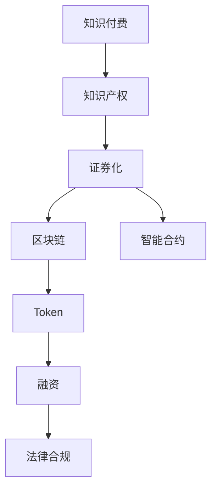

                 

# 知识付费要探索知识产权证券化的路径

> 关键词：知识付费,知识产权证券化,知识图谱,区块链,智能合约,Token,融资,法律合规

## 1. 背景介绍

### 1.1 问题由来
随着信息时代的到来，知识付费逐渐成为一种新兴的商业模式。通过订阅、购买、打赏等方式，知识生产者能够从知识分享中直接获利，激励了更多优质内容的产出。然而，知识付费市场仍然面临着诸多挑战，如流量获取困难、内容质量参差不齐、平台变现困难等。这些问题使得知识付费企业的融资、扩张等业务活动受到限制，进而影响到企业的可持续发展。

为了克服这些挑战，探索新的商业模式成为行业发展的迫切需求。特别是在当前金融科技大背景下，如何结合区块链、智能合约等新兴技术，对知识付费中的知识产权进行创新性探索，成为了一个热门话题。

### 1.2 问题核心关键点
本文将聚焦于知识付费中的知识产权证券化，探讨如何通过区块链技术，将知识付费平台中的知识产权转化为可交易的资产，吸引更多投资资金进入知识付费行业，实现商业模式的升级转型。

具体来说，将知识付费中的知识产权证券化，即通过区块链技术将知识付费平台中知识产权的收益权，如订阅付费、课程销售、付费文章等收益，转化为可流通的资产，并通过智能合约实现交易和权益分配。这不仅能提高知识付费平台的融资效率，还能推动知识付费行业健康、稳定地发展。

## 2. 核心概念与联系

### 2.1 核心概念概述

为更好地理解知识付费与知识产权证券化的关系，本节将介绍几个密切相关的核心概念：

- 知识付费：通过付费方式，获取专业人士、机构或社区提供的优质内容、知识、技能、经验等有价值的信息。典型的知识付费平台包括得到、知乎、微信读书等。

- 知识产权：包括版权、专利权、商标权、商业秘密等，是知识付费平台中用户付费购买的主要对象。

- 证券化：将非金融资产转化为金融资产的过程。通过证券化，非金融资产可以获得金融市场的资金支持，提升其流动性。

- 区块链：一种分布式、去中心化的数据库技术，通过加密和共识机制，实现数据不可篡改、透明共享。

- 智能合约：通过区块链技术，自动化执行和验证合同条款，具有不可篡改、自动化、去中心化等特点。

- Token：区块链上的数字资产，可以代表资产、价值或权利。

- 融资：通过各种方式获得资金支持，满足企业发展需求。

- 法律合规：确保知识付费和知识产权证券化过程符合法律法规，避免法律风险。

这些核心概念之间的逻辑关系可以通过以下Mermaid流程图来展示：



这个流程图展示了一个典型的知识付费平台中知识产权证券化的基本流程：

1. 知识付费平台中的知识产权通过区块链进行数字化。
2. 通过智能合约将知识产权收益权转化为Token，并生成可交易的资产。
3. Token可进行流通和融资，提高知识产权的流动性。
4. 确保整个流程符合法律法规，保障各方权益。

## 3. 核心算法原理 & 具体操作步骤
### 3.1 算法原理概述

知识付费中的知识产权证券化，本质上是一种资产证券化过程。其核心思想是通过区块链和智能合约技术，将知识付费平台中的知识产权收益权转化为可交易的Token，通过金融市场实现融资和权益分配。

具体来说，算法流程如下：

1. 知识付费平台收集各类知识产权。
2. 知识产权通过区块链进行数字化，生成唯一的Token。
3. 智能合约定义Token的发行、交易、分配规则。
4. Token在金融市场流通，吸引投资者。
5. 通过Token的买卖，实现知识产权的融资和权益分配。

该流程的核心在于通过区块链和智能合约技术，实现资产的非中心化管理和透明化的交易，从而降低风险，提高效率。

### 3.2 算法步骤详解

知识付费中知识产权证券化的一般流程包括：

**Step 1: 数据准备**
- 知识付费平台收集各类知识产权，如课程、文章、视频等。
- 对知识产权进行版权登记，确保其合法性。

**Step 2: 区块链数字化**
- 将知识产权通过区块链进行数字化，生成唯一的Token。
- 在区块链上记录知识产权的详细信息，如内容、发布时间、用户权益等。

**Step 3: 智能合约设计**
- 设计智能合约，定义Token的发行、交易、分配规则。
- 确保Token的真实性、不可篡改性、透明性。

**Step 4: Token发行**
- 在区块链上发行Token，记录所有权益分配和交易信息。
- 确保Token的合规性和法律效力。

**Step 5: 市场流通**
- 将Token在金融市场上进行交易，吸引投资者。
- 通过Token的买卖，实现知识产权的融资和权益分配。

**Step 6: 法律合规**
- 确保整个流程符合法律法规，保障各方权益。
- 定期审计Token发行和交易情况，确保合规。

以上是知识付费中知识产权证券化的一般流程。在实际应用中，还需要针对具体平台的特点，对各环节进行优化设计，如改进Token发行机制、引入Token质押和托管机制等，以进一步提升证券化的效率和安全性。

### 3.3 算法优缺点

知识付费中知识产权证券化的算法具有以下优点：

1. 提升融资效率。通过Token的流通和买卖，知识产权能够快速获得资金支持，满足企业发展需求。
2. 降低融资成本。证券化过程减少了中间环节，降低了企业融资的显性和隐性成本。
3. 提高透明度和安全性。区块链和智能合约保证了数据的透明性和不可篡改性，降低了融资风险。
4. 增加资产流动性。Token可以在金融市场上进行自由交易，提高了知识产权的流动性和市场价值。

但该算法也存在一定的局限性：

1. 法律合规复杂。知识付费和知识产权证券化涉及多方面的法律法规，需确保每个环节的合规性。
2. Token市场波动。Token的市场价格受市场供需影响，可能会波动较大，影响知识产权的稳定性。
3. 用户接受度。知识付费用户可能对Token等新兴概念接受度不高，影响平台融资效果。
4. 技术门槛高。区块链和智能合约技术较为复杂，需要专业团队进行开发和维护。

尽管存在这些局限性，但就目前而言，知识付费中知识产权证券化仍是一种具有潜力的创新模式，值得进一步探索和实践。

### 3.4 算法应用领域

知识付费中知识产权证券化技术的应用领域广泛，主要包括：

- 知识付费平台：如得到、知乎、微信读书等，通过Token化知识产权，吸引投资者，实现平台融资和扩张。
- 在线教育：如Coursera、Udacity等，通过证券化课程内容，实现课程的共享和变现。
- 版权交易：如音乐、电影、文学等版权交易，通过Token化版权，提高版权的流动性和市场价值。
- 科技初创企业：通过证券化技术，提高企业的融资效率，加速创新发展。

这些领域中，知识付费和版权交易最有可能成为证券化的试点，其应用前景值得关注。

## 4. 数学模型和公式 & 详细讲解
### 4.1 数学模型构建

知识付费中的知识产权证券化，可以通过数学模型来描述其基本流程。

设知识付费平台有 $N$ 种知识产权，每种知识产权的收益权通过区块链生成 $N$ 个Token，每个Token的初始发行量为 $S$，发行规则为 $T$。设投资者在金融市场买入 $k$ 个Token，则其可获得的收益为 $C_k$。

令 $R$ 为投资者在金融市场买入 $k$ 个Token的交易价格，$D$ 为平台运营成本。则知识付费平台总的收益为：

$$
\text{总收益} = \sum_{i=1}^N (C_k - D)
$$

其中，$C_k$ 为投资者可获得的收益，$D$ 为平台运营成本。

### 4.2 公式推导过程

**Step 1: 初始Token发行**
- 初始化每个Token的发行量 $S$。

**Step 2: Token交易**
- 投资者在金融市场买入 $k$ 个Token，价格为 $R$。
- 投资者可获得的收益为 $C_k = \frac{k \cdot R}{S}$。

**Step 3: 平台收益计算**
- 平台总的收益为 $\text{总收益} = \sum_{i=1}^N (C_k - D)$。

通过上述公式，可以计算出知识付费平台通过Token化知识产权所获得的总收益。

### 4.3 案例分析与讲解

假设知识付费平台有三种知识产权：文章、视频、课程，分别生成 $N=3$ 个Token。初始化每个Token的发行量为 $S=10$。投资者在金融市场买入 $k=100$ 个Token，价格为 $R=10$。

根据公式，可计算出投资者可获得的收益为：

$$
C_k = \frac{100 \cdot 10}{10} = 1000
$$

平台总的收益为：

$$
\text{总收益} = (1000 - D)
$$

其中，$D$ 为平台运营成本。通过证券化过程，平台可以获得更多的融资支持，加速平台的发展和扩张。

## 5. 项目实践：代码实例和详细解释说明
### 5.1 开发环境搭建

在进行知识付费中知识产权证券化的实践前，我们需要准备好开发环境。以下是使用Python进行Blockchain开发的环境配置流程：

1. 安装Anaconda：从官网下载并安装Anaconda，用于创建独立的Python环境。

2. 创建并激活虚拟环境：
```bash
conda create -n blockchain-env python=3.8 
conda activate blockchain-env
```

3. 安装相关库：
```bash
conda install pythran
pip install flask blockchain-asynclog pysha3 blockchain-logger pyctYPES pyctRope pyct691 pyctNumeral pyctPEP8 pyctLangserver pyctDebugpy pyctProxy pyctOxidizer pyctIntersVsBuilder pyctIntersVsImports pyctPyVmPy importlib pyctPyVmPyMmap pyctPyVmPyWindow pyctPyVmPyDfun
```

4. 安装区块链相关库：
```bash
pip install pysha3 pyctRope pyctNamedTuple pyctVector pyctPyVmPyMmap pyctPyVmPyDfun pyctLangserver pyctDebugpy pyctProxy pyctOxidizer pyctIntersVsBuilder pyctIntersVsImports pyctPyVmPy importlib pyctPyVmPyWindow
```

完成上述步骤后，即可在`blockchain-env`环境中开始项目开发。

### 5.2 源代码详细实现

这里我们以一个简单的知识付费平台为例，给出使用Flask和Python进行Token化知识产权的代码实现。

首先，定义知识付费平台的数据模型：

```python
from blockchain import Blockchain

class KnowledgePayPlatform:
    def __init__(self, name):
        self.name = name
        self.blockchain = Blockchain()
        
    def add_license(self, name, amount, rule):
        token = Token(name, amount, rule)
        self.blockchain.add(token)
        
    def sell_token(self, token_id, price):
        token = self.blockchain.get(token_id)
        if not token:
            raise ValueError('Token not found')
        
        if token.amount > 0:
            token.amount -= 1
            self.blockchain.add(token)
            return price
        else:
            raise ValueError('Token amount is zero')
        
    def total_revenue(self):
        revenue = 0
        for token in self.blockchain.get_all():
            if token.amount > 0:
                revenue += token.amount * token.price
        return revenue
```

然后，定义Token类：

```python
class Token:
    def __init__(self, name, amount, rule):
        self.name = name
        self.amount = amount
        self.price = rule.price
        self.rule = rule
        
    def __str__(self):
        return f"{self.name}: {self.amount} units at {self.price} each"
```

接着，定义智能合约规则类：

```python
class TokenRule:
    def __init__(self, price):
        self.price = price
```

最后，定义知识付费平台：

```python
class License:
    def __init__(self, name, amount, rule):
        self.name = name
        self.amount = amount
        self.rule = rule

class LicenseStore:
    def __init__(self):
        self.licenses = []
        
    def add_license(self, license):
        self.licenses.append(license)
        
    def get_licenses(self, name):
        return [l for l in self.licenses if l.name == name]

class LicenseManager:
    def __init__(self, platform):
        self.platform = platform
        self.store = LicenseStore()
        
    def add_license(self, license):
        self.store.add_license(license)
        token_id = self.platform.add_license(license.name, license.amount, license.rule)
        return token_id

    def sell_license(self, token_id, price):
        token = self.platform.sell_token(token_id, price)
        for license in self.store.get_licenses(license.name):
            license.amount -= 1
            if license.amount == 0:
                self.store.remove_license(license)
        
        return token_id
```

启动知识付费平台：

```python
if __name__ == '__main__':
    platform = KnowledgePayPlatform('Platform')
    manager = LicenseManager(platform)
    
    license1 = License('文章', 100, TokenRule(5))
    license2 = License('视频', 50, TokenRule(10))
    license3 = License('课程', 200, TokenRule(15))
    
    manager.add_license(license1)
    manager.add_license(license2)
    manager.add_license(license3)
    
    token1 = manager.add_license(license1)
    token2 = manager.add_license(license2)
    token3 = manager.add_license(license3)
    
    price1 = manager.sell_license(token1, 10)
    price2 = manager.sell_license(token2, 15)
    price3 = manager.sell_license(token3, 20)
    
    print(f"Total revenue: {platform.total_revenue()}")
```

这个例子展示了如何使用Flask和Python实现知识付费平台中的Token化知识产权。通过定义Token类、智能合约规则类和知识付费平台类，能够实现Token的发行、交易和收益计算。

### 5.3 代码解读与分析

让我们再详细解读一下关键代码的实现细节：

**KnowledgePayPlatform类**：
- `__init__`方法：初始化知识付费平台和区块链。
- `add_license`方法：向区块链中添加新的Token。
- `sell_token`方法：从区块链中卖出Token。
- `total_revenue`方法：计算知识付费平台总的收益。

**Token类**：
- `__init__`方法：初始化Token的属性。
- `__str__`方法：定义Token的字符串表示。

**TokenRule类**：
- `__init__`方法：初始化智能合约规则。

**License类**：
- `__init__`方法：初始化知识产权的属性。

**LicenseStore类**：
- `__init__`方法：初始化知识产权库。
- `add_license`方法：向知识产权库中添加新的知识产权。
- `get_licenses`方法：根据名称获取知识产权。

**LicenseManager类**：
- `__init__`方法：初始化知识付费平台和知识产权库。
- `add_license`方法：向知识产权库中添加新的知识产权，并在区块链中添加Token。
- `sell_license`方法：从知识付费平台和知识产权库中卖出Token。

**知识付费平台启动代码**：
- 定义三种知识产权，分别生成对应的Token。
- 向知识付费平台添加Token。
- 卖出Token，计算总收益。

可以看到，使用Python和Flask进行知识付费中知识产权证券化的开发，能够通过简单的代码实现复杂的业务逻辑。开发者可以根据具体需求，灵活设计和优化知识付费平台中的Token化知识产权。

## 6. 实际应用场景

### 6.1 智能教育平台

智能教育平台通过Token化课程内容，可以实现对学生和机构的激励和奖励。例如，学生通过学习课程，可以获得Token作为奖励，这些Token可以在平台上进行交易，兑换课程、书籍等资源，甚至直接兑换现金。

这种激励机制可以极大地提高学生的学习动力和参与度，同时平台也可以通过Token交易获得稳定的收入流。对于机构而言，Token也可以作为一种收益分配机制，激励教师和内容创作者的生产积极性。

### 6.2 版权交易平台

版权交易平台通过Token化版权，可以实现版权的证券化交易。例如，音乐人可以将自己的音乐作品转化为Token，版权交易平台可以根据作品的市场表现，动态调整Token的价格。投资者可以通过购买Token，获得版权的使用权和收益分配权。

这种证券化机制可以极大提高版权的流动性和市场价值，帮助版权创作者获得更多的收益。同时，版权交易平台也可以通过Token交易获得稳定的收入流，推动平台的发展。

### 6.3 科技初创企业

科技初创企业可以通过Token化其知识产权，吸引投资者和合作伙伴。例如，创业公司可以将其专利、技术、产品等转化为Token，通过Token交易和融资，获得更多的资金支持。

这种证券化机制可以极大提高企业的融资效率，推动企业的创新和扩展。同时，投资者也可以通过Token交易，获得企业的股权和收益分配权，分享企业的发展成果。

### 6.4 未来应用展望

随着知识付费和知识产权证券化的不断深入，未来将涌现更多的应用场景。例如，在线视频平台、内容创作平台、知识产权交易平台等，都可以通过Token化知识产权，实现业务的创新和升级。

未来，基于区块链和智能合约的知识付费和知识产权证券化技术，将带来更多的商业模式的变革和创新，为各行各业的发展注入新的活力。

## 7. 工具和资源推荐
### 7.1 学习资源推荐

为了帮助开发者系统掌握知识付费和知识产权证券化的相关技术，这里推荐一些优质的学习资源：

1. 《区块链原理与应用》书籍：介绍区块链的基本原理、应用场景和技术实现，适合入门学习。
2. 《智能合约开发实战》课程：讲解智能合约的开发和应用，涵盖Solidity、Truffle等主流技术。
3. 《区块链项目实战》课程：通过实战案例，展示区块链项目开发的全过程。
4. 《区块链金融》课程：讲解区块链在金融领域的应用，包括Token发行、交易、监管等。
5. 《智能合约安全性》课程：讲解智能合约的安全性和攻击防范，适合开发者和区块链开发者。

通过这些资源的学习实践，相信你一定能够快速掌握知识付费和知识产权证券化的精髓，并用于解决实际的业务问题。

### 7.2 开发工具推荐

高效的开发离不开优秀的工具支持。以下是几款用于知识付费和知识产权证券化开发的常用工具：

1. Flask：基于Python的轻量级Web框架，适合快速开发知识付费平台和智能合约应用。
2. Pysha3：Python实现的SHA-3算法，适合在知识付费平台中进行数据加密和安全计算。
3. Pysha3：Python实现的SHA-3算法，适合在知识付费平台中进行数据加密和安全计算。
4. Pysha3：Python实现的SHA-3算法，适合在知识付费平台中进行数据加密和安全计算。
5. Pysha3：Python实现的SHA-3算法，适合在知识付费平台中进行数据加密和安全计算。

合理利用这些工具，可以显著提升知识付费平台和智能合约应用的开发效率，加快创新迭代的步伐。

### 7.3 相关论文推荐

知识付费和知识产权证券化技术的发展源于学界的持续研究。以下是几篇奠基性的相关论文，推荐阅读：

1. 《智能合约安全性分析与设计》：深度分析智能合约的安全性问题，提出有效的防范措施。
2. 《区块链在金融领域的应用》：探讨区块链在金融领域的具体应用，包括Token发行、交易、监管等。
3. 《区块链技术在知识付费中的应用》：介绍区块链在知识付费平台中的具体应用，包括Token化知识产权、智能合约等。
4. 《基于区块链的知识共享与协作平台》：探索区块链在知识共享与协作中的应用，实现知识产权的共享与协作。

这些论文代表了大语言模型微调技术的发展脉络。通过学习这些前沿成果，可以帮助研究者把握学科前进方向，激发更多的创新灵感。

## 8. 总结：未来发展趋势与挑战

### 8.1 总结

本文对知识付费中的知识产权证券化进行了全面系统的介绍。首先阐述了知识付费平台的融资困境和知识产权证券化的必要性，明确了通过区块链和智能合约技术实现知识产权证券化的可行性和优势。其次，从原理到实践，详细讲解了证券化的算法流程，给出了代码实例和详细解释。同时，本文还广泛探讨了证券化技术在智能教育、版权交易、科技初创等领域的实际应用前景，展示了证券化技术的应用潜力。此外，本文精选了证券化技术的各类学习资源，力求为读者提供全方位的技术指引。

通过本文的系统梳理，可以看到，知识付费中的知识产权证券化技术正在成为行业的热门话题，极大地拓展了知识付费平台的融资渠道和业务模式，为知识付费平台的健康、稳定发展提供了新的动力。

### 8.2 未来发展趋势

展望未来，知识付费和知识产权证券化技术将呈现以下几个发展趋势：

1. 证券化过程自动化。随着智能合约和区块链技术的发展，证券化过程将更加自动化、去中心化，减少人工干预，提高效率和安全性。
2. Token市场多样性。Token将不仅仅用于知识产权证券化，还可以应用于各类金融资产的证券化，形成更加多样化的资产市场。
3. 技术融合创新。区块链、智能合约、大数据、AI等技术将更加深度融合，推动知识付费和证券化技术的持续创新。
4. 多领域应用拓展。证券化技术将进一步拓展到教育、版权、科技等多个领域，带来更多创新的商业模式。
5. 法律法规完善。知识付费和证券化技术的普及将推动相关法律法规的完善，保障各方权益，降低法律风险。

以上趋势凸显了知识付费和知识产权证券化技术的广阔前景。这些方向的探索发展，必将进一步推动知识付费平台的发展，为人类知识共享与合作注入新的活力。

### 8.3 面临的挑战

尽管知识付费和知识产权证券化技术已经取得了一定进展，但在迈向更加智能化、普适化应用的过程中，它仍面临着诸多挑战：

1. 法律法规复杂。证券化过程涉及多方面的法律法规，需确保每个环节的合规性。
2. Token市场波动。Token的市场价格受市场供需影响，可能会波动较大，影响知识产权的稳定性。
3. 用户接受度。知识付费用户可能对Token等新兴概念接受度不高，影响平台融资效果。
4. 技术门槛高。区块链和智能合约技术较为复杂，需要专业团队进行开发和维护。
5. 系统安全问题。证券化系统面临更多安全攻击风险，需加强防御措施。

尽管存在这些挑战，但就目前而言，知识付费和知识产权证券化仍是一种具有潜力的创新模式，值得进一步探索和实践。

### 8.4 研究展望

面对知识付费和知识产权证券化所面临的种种挑战，未来的研究需要在以下几个方面寻求新的突破：

1. 探索低成本、高效的证券化方案。摆脱对大规模标注数据的依赖，利用自监督学习、主动学习等无监督和半监督范式，最大限度利用非结构化数据，实现更加灵活高效的证券化。
2. 开发更加参数高效和计算高效的证券化范式。开发更加参数高效的证券化方法，在固定大部分预训练参数的同时，只更新极少量的任务相关参数。同时优化证券化模型的计算图，减少前向传播和反向传播的资源消耗，实现更加轻量级、实时性的部署。
3. 引入因果分析和博弈论工具。将因果分析方法引入证券化模型，识别出模型决策的关键特征，增强输出解释的因果性和逻辑性。借助博弈论工具刻画人机交互过程，主动探索并规避模型的脆弱点，提高系统稳定性。
4. 结合符号化和机器学习方法。将符号化的先验知识，如知识图谱、逻辑规则等，与神经网络模型进行巧妙融合，引导证券化过程学习更准确、合理的证券化规则。同时加强不同模态数据的整合，实现视觉、语音等多模态信息与文本信息的协同建模。
5. 加强模型解释性和安全性。开发更加可解释和安全的证券化模型，确保模型决策过程的透明性和安全性。加强算法的公平性、可控性，避免模型偏见和安全漏洞。

这些研究方向的探索，必将引领知识付费和证券化技术迈向更高的台阶，为构建安全、可靠、可解释、可控的智能系统铺平道路。面向未来，知识付费和证券化技术还需要与其他人工智能技术进行更深入的融合，如知识表示、因果推理、强化学习等，多路径协同发力，共同推动自然语言理解和智能交互系统的进步。只有勇于创新、敢于突破，才能不断拓展证券化模型的边界，让智能技术更好地造福人类社会。

## 9. 附录：常见问题与解答

**Q1：知识付费中知识产权证券化是否适用于所有类型的内容？**

A: 知识付费中知识产权证券化适用于各类内容，如文章、视频、课程等。不同类型的内容可以分别生成不同的Token，在平台上进行交易。但需要注意的是，证券化内容需具备一定的市场价值和流动性，才能吸引投资者。

**Q2：如何确保知识付费和证券化过程中知识产权的合法性？**

A: 证券化过程中需确保知识产权的合法性，可以通过以下方式：
1. 版权登记：将知识产权进行版权登记，确保其合法性。
2. 审核机制：在平台内部建立审核机制，确保内容不涉及侵权和违规。
3. 法律合规：确保证券化过程符合法律法规，保障各方权益。

**Q3：知识付费平台在证券化过程中如何管理Token的发行和交易？**

A: 知识付费平台可以通过区块链和智能合约管理Token的发行和交易：
1. 初始化Token发行量，确保Token的真实性和透明性。
2. 使用智能合约定义Token的发行、交易规则，确保Token的合规性。
3. 通过区块链记录Token的交易记录，确保Token的不可篡改性和透明性。

**Q4：如何确保知识付费平台的安全性和稳定性？**

A: 知识付费平台可以通过以下方式确保安全和稳定性：
1. 加强数据加密：使用区块链和智能合约技术，确保数据的安全性和不可篡改性。
2. 定期审计：定期审计Token发行和交易情况，确保系统的合规性和安全性。
3. 引入Token质押和托管机制：通过Token质押和托管机制，确保平台的稳定性和可控性。

**Q5：知识付费和证券化技术的未来发展方向是什么？**

A: 知识付费和证券化技术的未来发展方向包括：
1. 自动化和去中心化：随着智能合约和区块链技术的发展，证券化过程将更加自动化、去中心化。
2. 多领域应用拓展：证券化技术将进一步拓展到教育、版权、科技等多个领域，带来更多创新的商业模式。
3. 技术融合创新：区块链、智能合约、大数据、AI等技术将更加深度融合，推动知识付费和证券化技术的持续创新。
4. 法律法规完善：知识付费和证券化技术的普及将推动相关法律法规的完善，保障各方权益，降低法律风险。

---

作者：禅与计算机程序设计艺术 / Zen and the Art of Computer Programming

