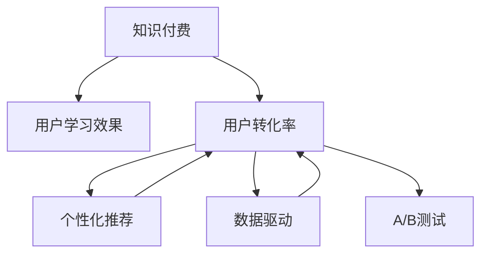

                 

# 知识付费要重视用户的学习效果和转化率

> 关键词：知识付费,用户学习效果,用户转化率,个性化推荐,模型优化,数据驱动,用户反馈

## 1. 背景介绍

### 1.1 问题由来

随着互联网技术的不断发展和普及，知识付费作为一种新兴的商业模式逐渐走入人们的视野。相较于传统的广告模式，知识付费更能够精准触达目标用户，提高营销效果。同时，它也迎合了当代人对于知识渴求的趋势，促进了学习知识的普及。

然而，知识付费的竞争异常激烈，内容同质化严重，如何在众多平台中脱颖而出，提高用户转化率，成为平台面临的一大难题。

### 1.2 问题核心关键点

知识付费平台的核心关键点在于如何提升用户的学习效果和转化率，从而实现商业变现。其中，用户的学习效果主要通过知识的吸收率、应用能力和反馈行为来评估；用户转化率则包括付费订阅率、内容复购率和平台活跃度等指标。

提升这两项指标，不仅能增强用户黏性，还能为平台带来稳定的收入来源。因此，平台应通过个性化推荐、数据驱动等手段，不断提高用户的学习效果和转化率。

## 2. 核心概念与联系

### 2.1 核心概念概述

为更好地理解知识付费平台如何通过用户学习效果和转化率的提升来实现商业成功，本节将介绍几个密切相关的核心概念：

- 知识付费：通过网络平台提供有偿的课程、文章、音频等知识内容，让用户支付费用进行学习和使用。
- 用户学习效果：指用户在学习知识过程中所获得的能力提升和知识吸收水平。
- 用户转化率：指用户在平台上的付费行为、复购行为、平台活跃度等指标。
- 个性化推荐：基于用户行为数据和历史偏好，向用户推荐符合其兴趣和学习需求的内容。
- 数据驱动：利用用户行为数据、交易数据等进行建模和分析，发现用户需求，优化运营策略。
- A/B测试：通过对比不同的运营策略、产品设计，验证其效果，优化产品体验。

这些核心概念之间的逻辑关系可以通过以下Mermaid流程图来展示：



这个流程图展示了几者之间的联系：

1. 知识付费以用户学习效果和转化率为目标，通过个性化推荐和数据驱动等手段，不断优化用户体验，提升用户转化率。
2. 个性化推荐基于用户的学习效果和转化率，调整推荐策略，从而更好地满足用户需求。
3. 数据驱动通过分析用户行为数据和转化数据，帮助平台调整策略，优化用户体验。
4. A/B测试通过对比不同运营策略的效果，发现最优方案，优化用户体验和运营效果。

## 3. 核心算法原理 & 具体操作步骤
### 3.1 算法原理概述

知识付费平台的用户学习效果和转化率提升，本质上是一个数据驱动和个性化推荐的问题。其核心思想是：通过分析用户行为数据，了解用户的学习需求和兴趣偏好，再利用个性化推荐算法，向用户推荐合适的知识内容，从而提升用户的学习效果和转化率。

形式化地，假设用户集合为 $U$，内容集合为 $C$，用户行为数据为 $D$，个性化推荐算法为 $A$，则平台的目标可以表示为：

$$
\max_{D,A} \sum_{u \in U} \sum_{c \in C} w_{uc} f_{uc}(D, A)
$$

其中 $w_{uc}$ 为内容 $c$ 对于用户 $u$ 的权重，$f_{uc}(D, A)$ 为内容 $c$ 对于用户 $u$ 的影响因子。

### 3.2 算法步骤详解

基于知识付费平台的用户学习效果和转化率提升问题，本节将详细讲解其具体的算法步骤。

**Step 1: 数据收集与预处理**
- 收集用户行为数据，包括但不限于：点击次数、浏览时长、付费记录、评价反馈等。
- 对数据进行清洗和归一化，去除异常值和噪音数据。
- 划分数据集，分为训练集、验证集和测试集。

**Step 2: 用户行为建模**
- 利用机器学习算法，对用户行为数据进行建模，找出用户偏好和行为规律。常用的算法包括协同过滤、决策树、深度学习等。
- 评估不同算法的效果，选择最优模型作为用户行为建模的基础。

**Step 3: 内容特征提取**
- 对内容进行特征提取，将文本、音频等非结构化数据转化为结构化特征，如词频、情感极性、音频特征等。
- 利用自然语言处理、图像处理等技术，提升特征提取的准确性和全面性。

**Step 4: 个性化推荐系统构建**
- 基于用户行为模型和内容特征，设计推荐算法，如基于内容的推荐、协同过滤推荐、混合推荐等。
- 在推荐算法中引入评分机制、时间衰减、兴趣融合等优化策略，提升推荐效果。

**Step 5: 效果评估与优化**
- 在测试集上评估推荐系统的准确率和召回率，使用AUC、RMSE等指标进行衡量。
- 对推荐算法进行优化，引入A/B测试，对比不同策略的效果，选取最优方案。

**Step 6: 实时监控与调整**
- 实时监控用户行为数据和推荐效果，利用机器学习算法进行在线学习，动态调整推荐策略。
- 定期收集用户反馈，优化内容和推荐算法，提升用户满意度。

以上是知识付费平台提升用户学习效果和转化率的完整算法流程。在实际应用中，还需要针对具体平台的用户特性和内容特点，对算法步骤进行优化设计，如改进用户行为建模方法、引入更多特征维度等，以进一步提升推荐效果。

### 3.3 算法优缺点

基于知识付费平台的用户学习效果和转化率提升算法，具有以下优点：

1. 精准推荐：通过个性化推荐，能够更好地满足用户的学习需求，提高用户的学习效果。
2. 数据驱动：基于用户行为数据进行优化，能够实时调整策略，提高用户转化率。
3. 自适应性：能够动态调整推荐算法，适应不同用户和内容的需求变化。
4. 用户满意度：通过个性化推荐，提升用户的学习体验和满意度，提高平台黏性。

同时，该算法也存在一定的局限性：

1. 数据质量依赖：算法的有效性依赖于高质量、丰富度的数据，获取和清洗数据的成本较高。
2. 冷启动问题：对于新用户和新内容，推荐系统需要一定时间进行冷启动，影响推荐效果。
3. 隐私和安全：用户行为数据涉及隐私问题，需要严格的数据保护措施和隐私政策。
4. 算法复杂度：基于深度学习等高级算法，计算资源和计算时间较高。

尽管存在这些局限性，但就目前而言，基于用户学习效果和转化率的个性化推荐算法，仍然是知识付费平台提升用户体验和商业价值的重要手段。未来相关研究的重点在于如何进一步降低数据依赖，提高推荐系统的鲁棒性和泛化能力，同时兼顾隐私和安全性等因素。

### 3.4 算法应用领域

基于知识付费平台的用户学习效果和转化率提升算法，已经在多个领域得到了应用，例如：

- 在线教育平台：通过个性化推荐，提高学生的学习效果和课程复购率。如Coursera、Udacity等平台。
- 职业培训平台：针对企业员工提供技能培训课程，利用推荐系统提升员工培训效果和学习效果。如LinkedIn Learning、Skillshare等。
- 学术研究平台：为学者提供学术资源推荐，提升研究成果的传播和引用率。如ResearchGate、Academia.edu等。
- 企业培训平台：为企业内部员工提供定制化的培训课程，提高培训效果和学习转化率。如SAP SuccessFactors、Salesforce Training等。

除了上述这些经典领域外，个性化推荐系统还被创新性地应用到更多场景中，如可控内容推荐、内容组合优化、交叉销售等，为知识付费平台带来了新的价值点。

## 4. 数学模型和公式 & 详细讲解
### 4.1 数学模型构建

本节将使用数学语言对知识付费平台的用户学习效果和转化率提升问题进行更加严格的刻画。

假设用户行为数据为 $D=\{(u_i, c_i, b_i)\}_{i=1}^N$，其中 $u_i \in U$ 表示用户，$c_i \in C$ 表示内容，$b_i \in \{0,1\}$ 表示用户是否购买了该内容。设 $x_u^c$ 为用户 $u$ 对内容 $c$ 的兴趣评分，$y_{uc}$ 为内容 $c$ 对于用户 $u$ 的影响因子。

定义用户行为模型为 $P(u|c)$，内容特征提取模型为 $F(c)$，推荐算法为 $A(D)$。则推荐系统的目标可以表示为：

$$
\max_{P(u|c),F(c),A(D)} \sum_{u \in U} \sum_{c \in C} P(u|c) F(c) \log A(D) + \alpha \sum_{u \in U} \sum_{c \in C} P(u|c) \log y_{uc}
$$

其中 $P(u|c)$ 为用户对内容的点击概率，$F(c)$ 为内容的影响因子，$A(D)$ 为推荐算法输出的点击概率。$\alpha$ 为模型正则化系数，用于控制模型的复杂度。

### 4.2 公式推导过程

以下我们以协同过滤算法为例，推导推荐系统的效果评估指标。

假设用户 $u$ 对内容 $c$ 的评分矩阵为 $M \in R^{N \times M}$，内容 $c$ 对用户 $u$ 的评分矩阵为 $M^T \in R^{M \times N}$。协同过滤算法通过计算用户之间的相似度和内容之间的相似度，得到用户对内容的推荐评分。设 $\sigma_{uc} \in R^{N \times M}$ 为用户对内容的推荐评分矩阵。

推荐系统的效果评估指标包括：

1. 平均绝对误差(MAE)：
$$
MAE = \frac{1}{N} \sum_{u=1}^N \sum_{c=1}^M |x_u^c - \sigma_{uc}^c| 
$$

2. 均方误差(MSE)：
$$
MSE = \frac{1}{N} \sum_{u=1}^N \sum_{c=1}^M (x_u^c - \sigma_{uc}^c)^2 
$$

3. 均方根误差(RMSE)：
$$
RMSE = \sqrt{\frac{1}{N} \sum_{u=1}^N \sum_{c=1}^M (x_u^c - \sigma_{uc}^c)^2}
$$

4. 平均绝对百分误差(AAPSE)：
$$
AAPSE = \frac{1}{N} \sum_{u=1}^N \sum_{c=1}^M \frac{|x_u^c - \sigma_{uc}^c|}{x_u^c + \sigma_{uc}^c}
$$

通过这些指标，可以评估推荐系统的效果，指导算法的优化。

## 5. 项目实践：代码实例和详细解释说明
### 5.1 开发环境搭建

在进行知识付费平台推荐系统开发前，我们需要准备好开发环境。以下是使用Python进行推荐系统开发的常用环境配置流程：

1. 安装Anaconda：从官网下载并安装Anaconda，用于创建独立的Python环境。

2. 创建并激活虚拟环境：
```bash
conda create -n recsys-env python=3.8 
conda activate recsys-env
```

3. 安装Python推荐系统库：
```bash
conda install -c conda-forge python-recsys
```

4. 安装PyTorch：根据CUDA版本，从官网获取对应的安装命令。例如：
```bash
conda install pytorch torchvision torchaudio cudatoolkit=11.1 -c pytorch -c conda-forge
```

5. 安装各类工具包：
```bash
pip install numpy pandas scikit-learn matplotlib tqdm jupyter notebook ipython
```

完成上述步骤后，即可在`recsys-env`环境中开始推荐系统实践。

### 5.2 源代码详细实现

下面我以协同过滤推荐系统为例，给出使用Python进行知识付费平台推荐系统开发的代码实现。

首先，定义协同过滤推荐系统的评分矩阵：

```python
import numpy as np

# 假设评分矩阵
M = np.random.randn(1000, 1000)
M = M / np.linalg.norm(M, axis=0)
```

然后，定义协同过滤算法的评分计算函数：

```python
def cosine_similarity(A, B):
    return np.dot(A, B) / (np.linalg.norm(A) * np.linalg.norm(B))

def predict(u, N):
    similarities = cosine_similarity(M[u], M)
    weights = np.zeros(N)
    for i in range(N):
        weights[i] = similarities[i, i]
        weights[i] = np.sqrt(similarities[i, i])
    prediction = np.dot(M.T, weights)
    return prediction
```

接着，定义评估指标函数：

```python
from sklearn.metrics import mean_absolute_error, mean_squared_error, mean_squared_log_error

def evaluate(M, prediction):
    MAE = mean_absolute_error(M, prediction)
    MSE = mean_squared_error(M, prediction)
    RMSE = np.sqrt(MSE)
    AAPSE = mean_squared_log_error(M, prediction)
    return MAE, MSE, RMSE, AAPSE
```

最后，启动协同过滤推荐系统的测试流程：

```python
M_test = np.random.randn(100, 1000)
prediction = predict(10, 1000)
MAE, MSE, RMSE, AAPSE = evaluate(M_test, prediction)
print(f"MAE: {MAE:.3f}, MSE: {MSE:.3f}, RMSE: {RMSE:.3f}, AAPSE: {AAPSE:.3f}")
```

以上就是使用Python进行知识付费平台协同过滤推荐系统的完整代码实现。可以看到，通过简单的评分计算和评估指标，我们就能构建起一个基本的协同过滤推荐系统。

### 5.3 代码解读与分析

让我们再详细解读一下关键代码的实现细节：

**协同过滤评分计算**：
- `cosine_similarity`函数：计算两个向量之间的余弦相似度，用于衡量用户和内容之间的相似度。
- `predict`函数：根据用户对内容的评分矩阵，计算用户对其他内容的推荐评分。

**评估指标函数**：
- 使用`mean_absolute_error`计算平均绝对误差。
- 使用`mean_squared_error`计算均方误差。
- 使用`mean_squared_log_error`计算平均绝对百分误差。

**测试流程**：
- 构造一个随机测试评分矩阵 `M_test`。
- 使用 `predict` 函数计算推荐评分。
- 使用 `evaluate` 函数计算推荐效果，输出评估指标。

可以看到，协同过滤推荐系统的代码实现相对简洁，易于理解和调整。当然，工业级的系统实现还需考虑更多因素，如用户行为建模、内容特征提取等环节，但核心的协同过滤思想基本与此类似。

## 6. 实际应用场景
### 6.1 在线教育平台

知识付费平台的用户学习效果和转化率提升，在在线教育平台中得到了广泛的应用。传统在线教育往往难以精准推荐课程，难以保证学生的学习效果。

通过个性化推荐，在线教育平台能够根据学生的学习历史和行为数据，推荐合适的课程内容，提高课程的完成率和学生成绩。平台还能通过分析学生的学习行为，发现学习效果不佳的课程，进行优化调整，提升整体教学效果。

### 6.2 企业培训平台

企业培训平台通过个性化推荐，能够提高员工培训效果和学习转化率。企业可以收集员工的培训行为数据，结合员工的工作岗位和技能需求，推荐合适的培训课程和资料，帮助员工提升工作能力。

个性化推荐系统还能根据员工的学习反馈，动态调整课程内容和推荐策略，提升员工的培训满意度和平台黏性。同时，平台还能通过数据分析，发现培训效果不佳的课程，进行优化调整，提高整体培训效果。

### 6.3 学术研究平台

学术研究平台通过个性化推荐，能够提升研究成果的传播和引用率。平台可以收集学者的研究行为数据，结合学者的研究方向和兴趣，推荐相关的学术论文和研究资源，帮助学者发现前沿研究成果。

个性化推荐系统还能根据学者的反馈，动态调整推荐策略，提升学者的满意度和平台黏性。同时，平台还能通过数据分析，发现研究趋势和热点，指导研究方向，提升整体研究质量。

### 6.4 未来应用展望

随着知识付费平台的用户学习效果和转化率提升算法的发展，未来的应用场景将更加广泛。

在智慧城市治理中，个性化推荐系统可以为市民提供定制化的服务，提高公共服务效率和市民满意度。在智慧医疗领域，个性化推荐系统可以帮助医生推荐最新的医学研究成果，提升医疗诊断和治疗效果。

此外，在电子商务、社交媒体、金融服务等众多领域，个性化推荐系统也将不断涌现，为人工智能技术的应用带来新的突破。相信随着算法的不断进步，推荐系统将为知识付费平台带来更多的商业价值，推动社会各领域的智能化进程。

## 7. 工具和资源推荐
### 7.1 学习资源推荐

为了帮助开发者系统掌握知识付费平台推荐系统的理论基础和实践技巧，这里推荐一些优质的学习资源：

1. 《推荐系统实战》系列博文：由大模型技术专家撰写，深入浅出地介绍了推荐系统原理、协同过滤、深度学习等前沿话题。

2. Coursera《推荐系统》课程：斯坦福大学开设的推荐系统明星课程，系统讲解推荐系统的理论和实践。

3. 《推荐系统》书籍：系统介绍了推荐系统的基础知识、算法实现和应用案例，是推荐系统入门的经典教材。

4. KDD竞赛：参加KDD竞赛，实战练习推荐系统算法，提升解决实际问题的能力。

5. PyTorch推荐系统库：PyTorch提供的推荐系统库，集成了多种推荐算法，适合快速迭代研究。

通过对这些资源的学习实践，相信你一定能够快速掌握知识付费平台推荐系统的精髓，并用于解决实际的NLP问题。

### 7.2 开发工具推荐

高效的开发离不开优秀的工具支持。以下是几款用于知识付费平台推荐系统开发的常用工具：

1. Python推荐系统库：用于快速构建推荐系统，包括协同过滤、深度学习等多种算法。

2. PyTorch：基于Python的开源深度学习框架，灵活动态的计算图，适合快速迭代研究。

3. TensorFlow：由Google主导开发的开源深度学习框架，生产部署方便，适合大规模工程应用。

4. Weights & Biases：模型训练的实验跟踪工具，可以记录和可视化模型训练过程中的各项指标，方便对比和调优。

5. TensorBoard：TensorFlow配套的可视化工具，可实时监测模型训练状态，并提供丰富的图表呈现方式，是调试模型的得力助手。

6. Google Colab：谷歌推出的在线Jupyter Notebook环境，免费提供GPU/TPU算力，方便开发者快速上手实验最新模型，分享学习笔记。

合理利用这些工具，可以显著提升知识付费平台推荐系统的开发效率，加快创新迭代的步伐。

### 7.3 相关论文推荐

知识付费平台推荐系统的研究源于学界的持续研究。以下是几篇奠基性的相关论文，推荐阅读：

1. "Collaborative Filtering for Implicit Feedback Datasets"：介绍协同过滤算法的基本原理和实现方法。

2. "Neighborhood-based Collaborative Filtering"：介绍基于邻居的协同过滤算法。

3. "Projecting Trust: A Factorization Method for Recommendation"：介绍基于矩阵分解的协同过滤算法。

4. "Hybrid Collaborative Filtering"：介绍混合推荐算法，将协同过滤和基于内容的推荐方法相结合。

5. "SlimSurgeon: A Sparsity-Aware Algorithm for Matrix Factorization"：介绍稀疏矩阵分解算法，提升推荐系统的稀疏性。

这些论文代表的知识付费平台推荐系统的发展脉络。通过学习这些前沿成果，可以帮助研究者把握学科前进方向，激发更多的创新灵感。

## 8. 总结：未来发展趋势与挑战
### 8.1 总结

本文对知识付费平台的用户学习效果和转化率提升问题进行了全面系统的介绍。首先阐述了知识付费平台在NLP领域的重要性，明确了提升用户学习效果和转化率的关键点。其次，从原理到实践，详细讲解了推荐系统的数学模型和关键步骤，给出了推荐系统开发的完整代码实例。同时，本文还广泛探讨了推荐系统在在线教育、企业培训、学术研究等多个领域的应用前景，展示了推荐系统的巨大潜力。此外，本文精选了推荐系统的各类学习资源，力求为读者提供全方位的技术指引。

通过本文的系统梳理，可以看到，知识付费平台推荐系统通过个性化推荐，能够显著提升用户的学习效果和转化率，带来更精准的用户体验和更高的商业价值。未来，伴随推荐系统的持续演进，知识付费平台必将在NLP应用中扮演越来越重要的角色，推动人工智能技术向更广泛的领域发展。

### 8.2 未来发展趋势

展望未来，知识付费平台推荐系统将呈现以下几个发展趋势：

1. 深度学习技术的引入。随着深度学习算法的发展，推荐系统将更能够捕捉复杂用户行为和内容特征，提升推荐精度。
2. 实时推荐系统的部署。实时推荐系统将能够更快响应用户需求，提升用户体验和运营效果。
3. 跨领域推荐系统的拓展。推荐系统将不仅仅局限于单一领域，将跨领域进行用户行为建模和内容推荐，提升整体用户体验。
4. 多模态推荐系统的融合。推荐系统将融合图像、视频、音频等多模态信息，提升推荐效果和用户体验。
5. 自适应推荐系统的设计。推荐系统将根据用户偏好和学习效果，动态调整推荐策略，提升推荐精度和用户满意度。
6. 用户隐私保护。随着数据隐私保护意识的增强，推荐系统将采用更加严格的数据保护措施，确保用户隐私和数据安全。

以上趋势凸显了知识付费平台推荐系统的广阔前景。这些方向的探索发展，必将进一步提升推荐系统的性能和应用范围，为知识付费平台带来更多的商业价值和用户满意度。

### 8.3 面临的挑战

尽管知识付费平台推荐系统已经取得了瞩目成就，但在迈向更加智能化、普适化应用的过程中，它仍面临着诸多挑战：

1. 数据质量瓶颈。推荐系统依赖高质量的用户行为数据，但数据获取和清洗的成本较高，可能影响推荐效果。
2. 冷启动问题。对于新用户和新内容，推荐系统需要一定时间进行冷启动，影响推荐效果。
3. 计算资源限制。深度学习算法的计算复杂度高，需要高性能计算设备，可能影响系统部署效率。
4. 隐私和安全问题。推荐系统涉及用户隐私保护，需要严格的数据保护措施和隐私政策。
5. 模型可解释性。推荐系统的决策过程难以解释，可能影响用户信任和满意度。

尽管存在这些挑战，但随着技术的发展和研究的深入，这些难题终将逐渐被克服。知识付费平台推荐系统必将迎来更加智能、高效、可控的未来。

### 8.4 研究展望

面对知识付费平台推荐系统所面临的挑战，未来的研究需要在以下几个方面寻求新的突破：

1. 探索无监督和半监督推荐方法。摆脱对高质量标注数据的依赖，利用自监督学习、主动学习等无监督和半监督范式，最大限度利用非结构化数据，实现更加灵活高效的推荐。
2. 研究参数高效和计算高效的推荐范式。开发更加参数高效的推荐方法，在固定大部分模型参数的同时，只更新极少量的推荐参数。同时优化推荐模型的计算图，减少前向传播和反向传播的资源消耗，实现更加轻量级、实时性的部署。
3. 融合因果和对比学习范式。通过引入因果推断和对比学习思想，增强推荐系统建立稳定因果关系的能力，学习更加普适、鲁棒的用户行为模型。
4. 引入更多先验知识。将符号化的先验知识，如知识图谱、逻辑规则等，与推荐系统进行巧妙融合，引导推荐过程学习更准确、合理的用户行为模型。
5. 结合因果分析和博弈论工具。将因果分析方法引入推荐系统，识别出推荐决策的关键特征，增强推荐结果的因果性和逻辑性。借助博弈论工具刻画人机交互过程，主动探索并规避推荐系统的脆弱点，提高系统稳定性。
6. 纳入伦理道德约束。在推荐目标中引入伦理导向的评估指标，过滤和惩罚有害的推荐内容，确保推荐系统的伦理安全性。

这些研究方向的探索，必将引领知识付费平台推荐系统技术迈向更高的台阶，为构建安全、可靠、可解释、可控的智能系统铺平道路。面向未来，知识付费平台推荐系统还需要与其他人工智能技术进行更深入的融合，如知识表示、因果推理、强化学习等，多路径协同发力，共同推动自然语言理解和智能交互系统的进步。只有勇于创新、敢于突破，才能不断拓展推荐系统的边界，让智能技术更好地造福人类社会。

## 9. 附录：常见问题与解答

**Q1：知识付费平台如何平衡推荐效果和用户体验？**

A: 知识付费平台在推荐时，需要综合考虑用户的学习效果和转化率。一般来说，可以通过以下几个方面来平衡推荐效果和用户体验：
1. 用户个性化：根据用户的学习历史、行为数据等，推荐符合其兴趣和学习需求的内容。
2. 多目标优化：平衡推荐效果和用户体验，可以通过多目标优化算法，如Pareto优化，找到最优的推荐策略。
3. 用户反馈：实时收集用户反馈，根据用户满意度调整推荐策略，提升用户体验。
4. 多样性控制：引入多样性控制策略，避免推荐内容过于单一，影响用户体验。

**Q2：推荐系统如何应对数据稀疏问题？**

A: 推荐系统常常面临数据稀疏问题，即用户行为数据较少，难以准确推荐。为应对这一问题，可以采用以下方法：
1. 引入协同过滤：通过用户之间的相似度，推荐相似用户喜欢的内容。
2. 引入深度学习：利用深度学习算法，学习用户行为特征，提升推荐精度。
3. 引入混合推荐：结合协同过滤和基于内容的推荐方法，提高推荐效果。
4. 引入矩阵分解：通过矩阵分解算法，对用户行为数据进行低秩逼近，提升推荐精度。

**Q3：推荐系统如何应对新用户和新内容的问题？**

A: 推荐系统在新用户和新内容的推荐上，通常存在冷启动问题。为应对这一问题，可以采用以下方法：
1. 利用推荐系统本身的数据，为新用户和新内容进行冷启动推荐。
2. 利用用户行为数据，预测新用户和新内容的兴趣偏好。
3. 利用主动学习、元学习等方法，提高推荐系统的适应性。
4. 引入推荐系统外的信息，如社交网络、用户画像等，提升推荐效果。

**Q4：推荐系统如何提升用户的参与度？**

A: 提升用户的参与度是知识付费平台的重要目标之一。为实现这一目标，可以采用以下方法：
1. 引入动态推荐：实时调整推荐策略，根据用户行为数据和内容变化，动态推荐适合的内容。
2. 引入个性化推荐：根据用户的兴趣和偏好，推荐符合其需求的内容，提升用户满意度。
3. 引入社交推荐：利用社交网络，推荐好友或专家推荐的内容，提升用户参与度。
4. 引入内容多样性：引入多样化的内容，满足用户的不同需求，提高用户参与度。

**Q5：推荐系统如何处理用户数据隐私问题？**

A: 用户数据隐私问题在推荐系统中非常重要。为处理这一问题，可以采用以下方法：
1. 数据去标识化：对用户数据进行去标识化处理，保护用户隐私。
2. 数据加密：对用户数据进行加密处理，保护数据安全。
3. 数据匿名化：对用户数据进行匿名化处理，保护用户隐私。
4. 数据访问控制：限制数据访问权限，保护数据安全。

这些方法可以有效地保护用户数据隐私，确保推荐系统的安全性和合规性。

---

作者：禅与计算机程序设计艺术 / Zen and the Art of Computer Programming

