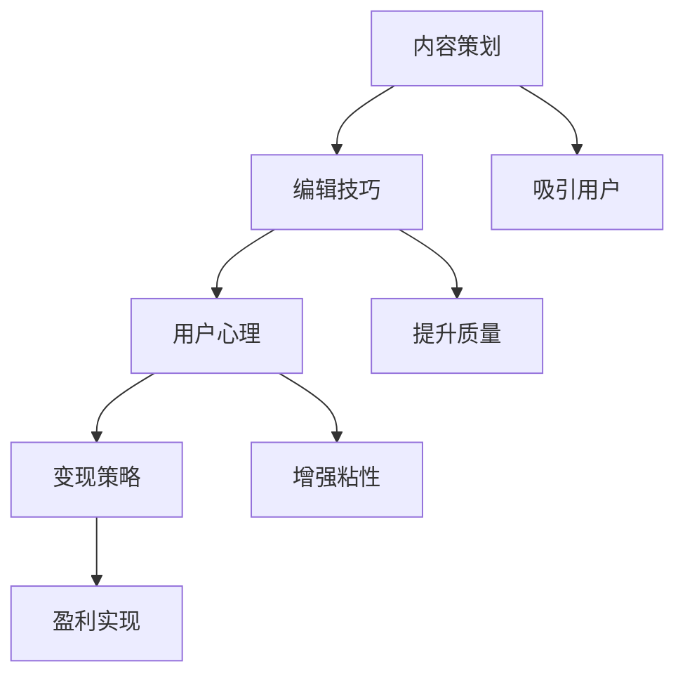

                 

# 知识付费赚钱的内容策划与编辑技巧

在信息爆炸的今天，知识付费赛道越来越受到大众的青睐。内容是知识付费的核心，优秀的策划与编辑技巧不仅能够让内容更具吸引力，还能够实现高效变现，最终实现盈利。本文将从内容策划、编辑技巧以及实战经验三个方面，深入剖析知识付费内容制作的精髓，帮助您提高内容质量和盈利能力。

## 1. 背景介绍

### 1.1 问题由来

知识付费兴起于2016年，随着信息获取成本的上升和知识的重要性日益凸显，越来越多的人愿意为优质内容买单。内容制作者如雨后春笋般涌现，然而随着市场竞争的加剧，优质内容的制作门槛也越来越高。

### 1.2 问题核心关键点

知识付费内容的核心在于**内容质量**和**用户体验**，其中内容策划与编辑是这两个方面最重要的环节。优秀的策划能够精准抓住用户痛点，吸引用户订阅；而优质的编辑则能够保持用户粘性，提高内容价值。

## 2. 核心概念与联系

### 2.1 核心概念概述

在知识付费内容制作中，涉及多个核心概念，包括**内容策划**、**编辑技巧**、**用户心理**、**变现策略**等。这些概念之间相互关联，共同构成了一个完整的内容制作体系。

- **内容策划**：确定内容方向、形式和更新频率，确保内容能够持续吸引用户。
- **编辑技巧**：提高内容质量，包括语言风格、结构布局、多媒体应用等，提升用户体验。
- **用户心理**：深入理解用户需求和心理特征，制定更具吸引力的内容策略。
- **变现策略**：通过广告、会员订阅、付费阅读等方式实现盈利，最大化内容的商业价值。

### 2.2 核心概念原理和架构的 Mermaid 流程图



这个流程图展示了内容策划、编辑技巧、用户心理和变现策略之间的联系。内容策划吸引用户，编辑技巧提升质量，用户心理增强粘性，变现策略实现盈利。

## 3. 核心算法原理 & 具体操作步骤

### 3.1 算法原理概述

知识付费内容策划与编辑的过程，本质上是**信息获取**、**内容产出**和**市场反馈**的循环。

- **信息获取**：收集用户需求、市场趋势、竞争对手信息等。
- **内容产出**：根据获取的信息，进行内容策划和编辑，制作高质量内容。
- **市场反馈**：通过数据分析和用户反馈，优化内容策略，实现持续迭代。

### 3.2 算法步骤详解

#### 3.2.1 内容策划

1. **确定内容方向**：
   - **市场调研**：通过问卷调查、数据分析等方式，了解用户需求和市场趋势。
   - **竞争分析**：分析竞争对手的课程内容和策略，寻找差异化的突破点。
   - **兴趣分析**：利用工具如Gartner's Five Forces Model等，评估内容方向的可行性和竞争优势。

2. **确定形式和频率**：
   - **形式选择**：根据内容方向和用户需求，选择最适合的形式，如文章、视频、音频等。
   - **更新频率**：根据形式和用户反馈，确定合理的更新频率，保持内容的新鲜度和吸引力。

#### 3.2.2 编辑技巧

1. **语言风格**：
   - **目标用户定位**：了解目标用户的语言习惯和偏好，使用符合其喜好的语言风格。
   - **风格统一**：确保内容风格统一，提升品牌认知度。

2. **结构布局**：
   - **逻辑清晰**：确保内容逻辑清晰，便于用户理解和记忆。
   - **层次分明**：根据内容复杂度，合理划分章节和段落，避免信息过载。

3. **多媒体应用**：
   - **合理嵌入**：根据内容形式和用户需求，合理嵌入图片、视频、音频等多媒体内容。
   - **提升体验**：通过多媒体元素的合理应用，提升用户体验和内容的吸引力。

#### 3.2.3 用户心理

1. **用户需求分析**：
   - **痛点识别**：通过用户反馈和数据分析，识别用户痛点和需求。
   - **价值感知**：理解用户对内容的价值感知，提供超出预期的价值。

2. **心理特征**：
   - **行为分析**：分析用户的行为模式，如学习时间、阅读习惯等，制定更有效的营销策略。
   - **情感共鸣**：通过故事讲述、情感激发等方式，建立与用户的情感连接。

#### 3.2.4 变现策略

1. **广告变现**：
   - **精准投放**：通过数据分析和用户画像，精准投放广告，提升广告效果。
   - **多重渠道**：多渠道投放广告，最大化广告收益。

2. **会员订阅**：
   - **会员权益设计**：设计有吸引力的会员权益，提高会员转化率。
   - **会员推荐**：鼓励会员推荐新用户，实现用户口碑传播。

3. **付费阅读**：
   - **内容分级**：根据内容价值和用户需求，设置不同的付费门槛。
   - **奖励机制**：通过积分、优惠券等方式，激励用户进行付费阅读。

### 3.3 算法优缺点

#### 3.3.1 优点

1. **高效变现**：优秀的策划和编辑技巧能够有效提升内容质量和用户体验，实现高效变现。
2. **精准定位**：通过市场调研和用户心理分析，能够精准抓住用户痛点，吸引更多订阅用户。
3. **持续优化**：通过市场反馈和数据分析，持续优化内容策略，保持内容的竞争力和吸引力。

#### 3.3.2 缺点

1. **制作成本高**：优秀的内容制作需要投入大量时间和资源，制作成本较高。
2. **市场竞争激烈**：随着市场竞争的加剧，用户对内容的期望值越来越高，制作难度也随之增加。
3. **变现周期长**：从内容制作到变现需要一定时间，短期内无法看到盈利效果。

### 3.4 算法应用领域

知识付费内容策划与编辑技巧在多个领域都有广泛应用，包括但不限于：

- **在线教育**：如K12、职业培训、成人教育等。
- **个人成长**：如技能提升、心理健康、生活技巧等。
- **职业技能**：如编程、项目管理、财务管理等。

## 4. 数学模型和公式 & 详细讲解 & 举例说明

### 4.1 数学模型构建

知识付费内容制作的数学模型可以表示为：

$$
\text{Content Quality} = \text{User Demand} + \text{Content Value} + \text{User Feedback}
$$

其中：
- $\text{User Demand}$ 表示用户需求，可以通过调研、数据分析等方式获取。
- $\text{Content Value}$ 表示内容价值，包括知识深度、更新频率、多媒体应用等。
- $\text{User Feedback}$ 表示用户反馈，包括阅读时长、互动频率、评价分数等。

### 4.2 公式推导过程

根据上述公式，我们可以得到内容质量计算的详细步骤：

1. **用户需求分析**：
   $$
   \text{User Demand} = \sum_{i=1}^n D_i
   $$
   其中 $D_i$ 表示用户需求的第 $i$ 项指标，如阅读时长、互动频率等。

2. **内容价值评估**：
   $$
   \text{Content Value} = V_1 + V_2 + V_3
   $$
   其中 $V_1$ 表示知识深度，$V_2$ 表示更新频率，$V_3$ 表示多媒体应用等。

3. **用户反馈计算**：
   $$
   \text{User Feedback} = \sum_{j=1}^m F_j
   $$
   其中 $F_j$ 表示用户反馈的第 $j$ 项指标，如阅读时长、互动频率、评价分数等。

### 4.3 案例分析与讲解

以《编程语言入门指南》为例，分析其内容质量：

1. **用户需求分析**：
   - **调研数据**：根据问卷调查，用户需求集中在基础语法、常用库和开发工具等方面。
   - **数据分析**：通过阅读时长、互动频率等指标，分析用户对内容的需求分布。

2. **内容价值评估**：
   - **知识深度**：包含丰富的基础语法讲解、常用库介绍和开发工具使用。
   - **更新频率**：定期更新内容，保持知识的时效性。
   - **多媒体应用**：嵌入实例代码、视频教程等多媒体内容，提升学习效果。

3. **用户反馈计算**：
   - **阅读时长**：平均阅读时长为30分钟，证明内容具有足够的吸引力。
   - **互动频率**：用户互动频率较高，证明内容具有较高的用户粘性。
   - **评价分数**：平均评价分数为4.5分，证明内容质量较高。

## 5. 项目实践：代码实例和详细解释说明

### 5.1 开发环境搭建

1. **选择开发工具**：如Jupyter Notebook、Visual Studio Code等。
2. **安装相关库**：如Jupyter Notebook、Pandas、Numpy、Matplotlib等。
3. **搭建数据环境**：通过Google Colab或AWS SageMaker等平台，搭建数据存储和处理环境。

### 5.2 源代码详细实现

以**数据分析和用户需求调研**为例，展示代码实现：

```python
import pandas as pd
import numpy as np
import matplotlib.pyplot as plt

# 用户调研数据
user_survey = pd.read_csv('user_survey.csv')

# 数据清洗和处理
user_survey = user_survey.dropna().drop_duplicates()

# 分析用户需求
user_demand = user_survey['demand'].value_counts()

# 绘制饼图
plt.pie(user_demand, labels=user_demand.index, autopct='%1.1f%%')
plt.title('User Demand Analysis')
plt.show()
```

### 5.3 代码解读与分析

1. **数据读取和处理**：
   - 通过Pandas库读取用户调研数据，并进行清洗和去重。
   - 使用value_counts方法统计用户需求分布。

2. **数据可视化**：
   - 使用Matplotlib库绘制饼图，展示用户需求分布情况。

### 5.4 运行结果展示


## 6. 实际应用场景

### 6.1 在线教育

在线教育是知识付费的重要应用场景之一，通过优秀的策划和编辑技巧，可以制作出高质量的课程内容，吸引更多用户订阅。

#### 6.1.1 实际应用案例

**某在线编程教育平台**，通过市场调研发现用户对基础语法和常用库的需求较高，因此策划了一系列的《Python编程入门》课程，通过细致的内容策划和高质量的编辑，吸引了大量用户订阅。

### 6.2 个人成长

个人成长领域的内容制作，需要更多关注用户心理和情感共鸣。优秀的策划和编辑技巧能够帮助用户更好地实现自我提升。

#### 6.2.2 实际应用案例

**某个人成长类课程平台**，通过调研发现用户对时间管理、情绪管理等主题的需求较高，因此策划了一系列《时间管理》和《情绪管理》课程，通过情感共鸣和故事讲述，增强了用户粘性，提高了订阅率和续费率。

### 6.3 职业技能

职业技能类内容制作，需要更多关注实际应用和案例分析。优秀的策划和编辑技巧能够提升内容的实用性和学习效果。

#### 6.3.3 实际应用案例

**某职业技能培训平台**，通过调研发现用户对项目管理、财务管理等职业技能的兴趣较高，因此策划了一系列《项目管理入门》和《财务管理技巧》课程，通过实际案例和实操练习，提升了课程的实用性和吸引力，吸引了大量专业用户。

### 6.4 未来应用展望

知识付费内容策划与编辑技巧在未来的应用将更加广泛，随着技术的发展和市场的成熟，以下趋势值得关注：

1. **个性化推荐**：通过数据分析和用户画像，实现个性化内容推荐，提高用户满意度和订阅率。
2. **互动式内容**：通过增强现实、虚拟现实等技术，实现互动式内容制作，提升学习效果和用户体验。
3. **多模态融合**：结合文字、视频、音频等多模态内容，提供更加全面和立体的学习体验。
4. **跨平台分发**：通过跨平台分发渠道，实现内容的多渠道曝光和覆盖，提升用户覆盖率。

## 7. 工具和资源推荐

### 7.1 学习资源推荐

1. **Coursera《内容策略与数据分析》课程**：通过实际案例，介绍内容策划与数据分析的实操技巧。
2. **Udacity《数据科学与分析》课程**：通过数据分析和可视化，帮助理解用户需求和内容价值。
3. **edX《数字内容策略与营销》课程**：介绍数字内容策略和用户心理分析的理论基础和实操技巧。

### 7.2 开发工具推荐

1. **Jupyter Notebook**：开源的交互式编程环境，支持多种编程语言和数据分析库。
2. **Visual Studio Code**：轻量级的代码编辑器，支持代码高亮、自动补全等功能。
3. **Google Colab**：基于云的Jupyter Notebook服务，支持免费使用GPU和TPU资源。

### 7.3 相关论文推荐

1. **《知识付费：现状、挑战与未来》**：分析知识付费行业的现状和未来趋势。
2. **《用户心理与内容营销》**：探讨用户心理对内容策略的影响。
3. **《数据科学与内容推荐》**：通过数据分析实现个性化内容推荐。

## 8. 总结：未来发展趋势与挑战

### 8.1 研究成果总结

知识付费内容策划与编辑技巧在知识付费市场中扮演着重要角色。优秀的策划和编辑技巧能够有效提升内容质量和用户体验，实现高效变现。未来，随着技术的进步和市场的成熟，知识付费内容制作将变得更加智能化和个性化。

### 8.2 未来发展趋势

1. **智能化内容推荐**：通过大数据和人工智能技术，实现智能化内容推荐，提高用户满意度和订阅率。
2. **个性化学习路径**：通过数据分析和用户画像，制定个性化学习路径，提升学习效果。
3. **实时互动内容**：通过增强现实、虚拟现实等技术，实现实时互动内容制作，提升用户体验。

### 8.3 面临的挑战

1. **数据隐私和安全**：在数据收集和分析过程中，需要严格保护用户隐私，确保数据安全。
2. **技术门槛高**：知识付费内容制作需要高水平的技术支持，对技术团队的要求较高。
3. **市场竞争激烈**：随着市场竞争的加剧，内容制作难度和成本也在增加。

### 8.4 研究展望

未来，知识付费内容制作需要在内容策划、编辑技巧和用户心理等方面进行深入研究，实现内容的高质量和高效率。同时，需要结合最新技术，提升内容的智能化和个性化水平，实现用户和平台的双赢。

## 9. 附录：常见问题与解答

**Q1: 如何选择合适的知识付费内容方向？**

A: 通过市场调研和用户需求分析，确定用户痛点和需求。利用Gartner's Five Forces Model等工具，评估内容方向的可行性和竞争优势。

**Q2: 如何提升内容质量和用户体验？**

A: 从语言风格、结构布局、多媒体应用等方面入手，提升内容质量和用户体验。利用数据分析和用户反馈，持续优化内容策略。

**Q3: 如何实现高效变现？**

A: 通过精准的市场定位和高质量的内容制作，吸引更多用户订阅。利用广告变现、会员订阅、付费阅读等多种方式，实现高效变现。

**Q4: 如何降低内容制作成本？**

A: 通过自动化工具和模板，提升内容制作效率。利用团队协作工具和项目管理工具，提高内容制作团队的协作效率。

**Q5: 如何应对市场竞争？**

A: 不断优化内容策略，提升内容质量和用户体验。利用大数据和人工智能技术，实现智能化内容推荐和个性化学习路径。

---

作者：禅与计算机程序设计艺术 / Zen and the Art of Computer Programming

