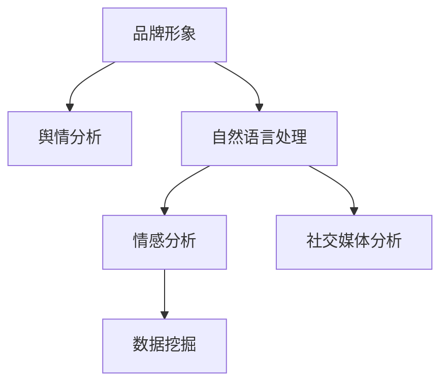

                 

# 知识付费赚钱的品牌口碑监测与舆情管理策略

> 关键词：知识付费,品牌口碑监测,舆情管理,自然语言处理(NLP),情感分析,社交媒体分析,数据挖掘

## 1. 背景介绍

### 1.1 问题由来
近年来，随着知识付费行业的快速发展和互联网技术的不断进步，越来越多的知识付费平台涌现，如喜马拉雅、得到、知乎live等。这些平台以订阅制、按需付费、点播等多种形式，为用户提供高质量的知识内容，逐渐成为知识传播和获取的重要渠道。

然而，随着市场的竞争加剧，知识付费平台面临着严峻的挑战。用户流失、内容同质化、内容质量参差不齐等问题频发，亟需科学有效的品牌口碑监测与舆情管理策略。

### 1.2 问题核心关键点
品牌口碑监测与舆情管理策略的核心关键点包括：
- **品牌形象维护**：通过持续的品牌口碑监测，及时发现和处理负面信息，保持品牌形象的正面和稳定。
- **用户行为分析**：利用数据分析和用户反馈，深入理解用户需求和行为，提升用户体验，增加用户黏性。
- **内容质量优化**：通过舆情分析，了解用户对内容的评价和需求，指导内容创新和优化，提升内容价值。
- **市场趋势预测**：借助舆情监测和情感分析，预判市场趋势和用户偏好变化，把握机会，提前布局。
- **运营策略优化**：结合舆情反馈，优化运营策略和资源配置，提升平台竞争力。

### 1.3 问题研究意义
品牌口碑监测与舆情管理策略的研究，对于知识付费平台的健康发展具有重要意义：

1. **提升用户体验**：通过及时回应用户反馈，改进服务质量，增强用户满意度和忠诚度。
2. **优化内容质量**：根据用户需求和评价，调整内容策略，提升内容相关性和吸引力。
3. **增加商业价值**：通过有效的品牌管理和市场预测，指导营销和产品策略，增加平台的盈利能力。
4. **应对市场挑战**：及时发现和处理危机事件，防止品牌形象受损，增强平台韧性。
5. **推动行业发展**：提供可借鉴的管理经验和最佳实践，促进知识付费行业整体发展。

## 2. 核心概念与联系

### 2.1 核心概念概述

品牌口碑监测与舆情管理策略的研究涉及多个关键概念，包括：

- **品牌形象**：品牌的知名度、美誉度、用户信任度等综合表现。
- **舆情分析**：通过分析社交媒体、论坛、评论等公开信息，了解用户对品牌的看法和情感倾向。
- **自然语言处理(NLP)**：利用NLP技术对文本数据进行分析和理解，提取有用信息。
- **情感分析**：通过NLP技术，对用户情感进行识别和分类，了解用户情绪和需求。
- **社交媒体分析**：分析用户在社交平台上的行为和互动，挖掘用户兴趣和偏好。
- **数据挖掘**：从大规模数据中提取有价值的模式和知识，为决策提供支持。

这些概念之间的联系可以通过以下Mermaid流程图来展示：



这个流程图展示了几者之间的逻辑关系：

1. 品牌形象的维护依赖于舆情分析，及时发现和处理负面信息。
2. 舆情分析需要自然语言处理和情感分析的支持，以准确理解用户情感。
3. 社交媒体分析结合自然语言处理和情感分析，全面了解用户行为和需求。
4. 数据挖掘为品牌形象管理和舆情分析提供更深层次的支持，帮助发现潜在问题和机会。

## 3. 核心算法原理 & 具体操作步骤
### 3.1 算法原理概述

品牌口碑监测与舆情管理策略的核心算法原理基于自然语言处理(NLP)技术，结合情感分析和社交媒体分析，通过数据分析和处理，实现对品牌形象和用户情感的全面监测和管理。

具体来说，品牌口碑监测与舆情管理策略的算法原理包括：

1. **数据采集与预处理**：从社交媒体、评论平台等渠道采集相关数据，并进行清洗和预处理，去除噪声和无用信息。
2. **情感分析**：使用情感分析算法对采集到的文本数据进行情感分类，识别用户的正面、负面和中性情感。
3. **舆情分析**：通过情感分析结果，结合文本内容进行舆情分类，识别热点话题和潜在危机。
4. **品牌形象监测**：综合舆情分析结果，评估品牌形象的健康程度，发现负面舆情和潜在风险。
5. **用户行为分析**：结合舆情分析结果，深入分析用户行为和需求，指导内容优化和产品改进。

### 3.2 算法步骤详解

品牌口碑监测与舆情管理策略的算法步骤包括：

1. **数据采集**：
   - 从社交媒体平台（如微博、微信、知乎等）、评论平台（如亚马逊、豆瓣等）等渠道采集相关数据。
   - 使用API接口或爬虫工具进行数据采集，确保数据的全面性和时效性。

2. **数据预处理**：
   - 清洗数据，去除无关信息（如广告、链接、标签等）。
   - 进行分词、去停用词、词干提取等文本预处理步骤。
   - 将文本数据转换为向量形式，便于后续算法处理。

3. **情感分析**：
   - 使用情感分析算法（如LSTM、BERT等）对文本进行情感分类，生成情感标签。
   - 使用情感词典、词向量和深度学习模型等多种方法进行情感分析。

4. **舆情分析**：
   - 基于情感分析结果，使用文本分类、主题建模等算法进行舆情分类。
   - 结合情感标签和文本内容，识别热点话题和负面舆情。
   - 使用时间序列分析和异常检测算法，识别舆情趋势和异常波动。

5. **品牌形象监测**：
   - 综合舆情分析结果，评估品牌形象的健康程度。
   - 使用情感分析结果和舆情分类结果，发现品牌形象中的弱点和风险。
   - 定期报告品牌形象评估结果，及时采取应对措施。

6. **用户行为分析**：
   - 结合舆情分析结果，深入分析用户行为和需求。
   - 使用数据分析和用户画像技术，识别用户兴趣和偏好。
   - 根据用户行为分析结果，指导内容优化和产品改进。

### 3.3 算法优缺点

品牌口碑监测与舆情管理策略的算法具有以下优点：

1. **全面性和及时性**：通过多渠道数据采集和实时分析，能够全面、及时地了解品牌形象和用户情感变化。
2. **准确性和可解释性**：使用深度学习模型和NLP技术，能够准确分析和理解用户情感和舆情变化，结果可解释性强。
3. **实用性和可操作性**：结合品牌形象监测和用户行为分析，能够提供实用建议和改进措施，提升运营效果。

同时，该算法也存在以下缺点：

1. **数据噪音**：社交媒体和评论数据噪音较多，需要复杂的预处理步骤。
2. **计算资源消耗**：大规模数据处理和深度学习模型训练需要较高的计算资源。
3. **隐私和安全**：用户数据采集和分析需要考虑隐私保护和数据安全问题。
4. **多语言支持**：对于多语言数据，需要进行语言识别和翻译，增加了处理复杂度。

### 3.4 算法应用领域

品牌口碑监测与舆情管理策略的算法广泛应用于以下领域：

1. **知识付费平台**：如喜马拉雅、得到、知乎live等，通过监测品牌形象和用户情感，提升平台服务质量和用户满意度。
2. **社交媒体平台**：如微博、微信、抖音等，通过分析用户行为和情感，优化产品功能和用户体验。
3. **在线教育平台**：如Coursera、Udemy、网易云课堂等，通过舆情监测和用户分析，提升课程质量和用户参与度。
4. **旅游和文化平台**：如携程、大众点评、TripAdvisor等，通过舆情分析，优化旅游体验和内容推荐。
5. **电商和零售平台**：如亚马逊、淘宝、京东等，通过品牌形象监测和用户反馈，提升商品质量和用户信任度。

## 4. 数学模型和公式 & 详细讲解 & 举例说明

### 4.1 数学模型构建

品牌口碑监测与舆情管理策略的数学模型包括以下几个关键部分：

1. **情感分类模型**：使用深度学习模型（如LSTM、BERT等）对文本进行情感分类，生成情感标签。
2. **舆情分类模型**：使用文本分类算法（如SVM、LDA等）对文本进行舆情分类，识别热点话题和负面舆情。
3. **品牌形象评估模型**：综合情感分类和舆情分类结果，评估品牌形象的健康程度，发现负面舆情和潜在风险。
4. **用户行为分析模型**：结合舆情分类结果，使用数据分析和用户画像技术，识别用户兴趣和偏好。

### 4.2 公式推导过程

以下我们以情感分类模型为例，推导其数学公式及其计算过程。

假设训练集为 $D=\{(x_i,y_i)\}_{i=1}^N$，其中 $x_i$ 为文本样本， $y_i$ 为情感标签（正、负、中性）。使用LSTM模型进行情感分类，模型的输入为 $x_i$，输出为情感分类结果 $y_i$。则情感分类模型的损失函数为：

$$
\mathcal{L}(\theta) = -\frac{1}{N}\sum_{i=1}^N \log P(y_i|x_i;\theta)
$$

其中 $P(y_i|x_i;\theta)$ 为模型在 $x_i$ 下预测 $y_i$ 的概率，$\theta$ 为模型参数。

通过反向传播算法，可以得到模型参数的更新公式：

$$
\theta \leftarrow \theta - \eta \nabla_{\theta} \mathcal{L}(\theta)
$$

其中 $\eta$ 为学习率，$\nabla_{\theta} \mathcal{L}(\theta)$ 为损失函数对参数的梯度。

在得到情感分类模型后，可以将其应用于品牌口碑监测和舆情分析中，结合其他算法模型，实现综合监测和管理。

### 4.3 案例分析与讲解

**案例背景**：某知识付费平台通过品牌口碑监测与舆情管理策略，发现品牌形象受损，用户流失严重，需要进行品牌形象修复和用户满意度提升。

**数据采集**：
- 采集平台用户评论、社交媒体提及、问答社区反馈等数据。
- 通过API接口和爬虫工具，实现数据全面覆盖和实时采集。

**数据预处理**：
- 清洗数据，去除无关信息，如广告、链接、标签等。
- 进行分词、去停用词、词干提取等文本预处理步骤。
- 将文本数据转换为向量形式，便于后续算法处理。

**情感分析**：
- 使用LSTM模型对评论和提及进行情感分类，生成情感标签。
- 使用情感词典和词向量进行情感分析，提高准确性。

**舆情分析**：
- 结合情感分析结果，使用文本分类算法对评论和提及进行舆情分类。
- 识别热点话题和负面舆情，生成舆情报告。

**品牌形象监测**：
- 综合舆情分析结果，评估品牌形象的健康程度。
- 发现负面舆情和潜在风险，生成品牌形象报告。

**用户行为分析**：
- 结合舆情分析结果，使用数据分析和用户画像技术，识别用户兴趣和偏好。
- 根据用户行为分析结果，指导内容优化和产品改进。

**品牌形象修复和用户满意度提升**：
- 根据品牌形象报告和用户行为分析结果，采取针对性的品牌形象修复措施，如改善用户体验、优化产品功能等。
- 根据舆情报告和情感分析结果，及时回应用户反馈，提升用户满意度和忠诚度。

## 5. 项目实践：代码实例和详细解释说明

### 5.1 开发环境搭建

在进行品牌口碑监测与舆情管理策略的开发前，我们需要准备好开发环境。以下是使用Python进行Natural Language Toolkit (NLTK)和Scikit-learn开发的环境配置流程：

1. 安装Anaconda：从官网下载并安装Anaconda，用于创建独立的Python环境。

2. 创建并激活虚拟环境：
```bash
conda create -n nlp-env python=3.8 
conda activate nlp-env
```

3. 安装NLTK和Scikit-learn：
```bash
pip install nltk scikit-learn
```

4. 安装TensorFlow：
```bash
pip install tensorflow
```

5. 安装Python libraries：
```bash
pip install pandas numpy matplotlib tqdm jupyter notebook ipython
```

完成上述步骤后，即可在`nlp-env`环境中开始开发实践。

### 5.2 源代码详细实现

下面以情感分类模型的实现为例，给出使用Python和TensorFlow的代码实现。

```python
import tensorflow as tf
from tensorflow.keras.layers import LSTM, Dense
from tensorflow.keras.models import Sequential
from sklearn.datasets import fetch_20newsgroups
from sklearn.feature_extraction.text import CountVectorizer
from sklearn.model_selection import train_test_split

# 数据预处理
newsgroups = fetch_20newsgroups(subset='train', categories=['alt.atheism', 'soc.religion.christian'])
X_train, X_test, y_train, y_test = train_test_split(newsgroups.data, newsgroups.target, test_size=0.2, random_state=42)

# 文本向量化
vectorizer = CountVectorizer(stop_words='english')
X_train = vectorizer.fit_transform(X_train)
X_test = vectorizer.transform(X_test)

# 构建情感分类模型
model = Sequential()
model.add(LSTM(64, input_shape=(X_train.shape[1],), return_sequences=True))
model.add(LSTM(32))
model.add(Dense(1, activation='sigmoid'))
model.compile(loss='binary_crossentropy', optimizer='adam', metrics=['accuracy'])

# 训练模型
model.fit(X_train, y_train, batch_size=32, epochs=10, validation_data=(X_test, y_test))

# 评估模型
loss, accuracy = model.evaluate(X_test, y_test)
print(f'Accuracy: {accuracy:.2f}')
```

以上代码实现了使用LSTM模型对新闻组数据进行情感分类。可以看到，NLTK和Scikit-learn库为数据预处理提供了便捷的工具，TensorFlow库为模型构建和训练提供了灵活的框架。开发者可以将更多精力放在模型改进和算法优化上。

### 5.3 代码解读与分析

让我们再详细解读一下关键代码的实现细节：

**fetch_20newsgroups函数**：
- 使用Scikit-learn库中的fetch_20newsgroups函数，从新闻组数据集中获取20个不同主题的新闻组数据。

**CountVectorizer函数**：
- 使用NLTK库中的CountVectorizer函数，将文本数据转换为词频向量，便于模型处理。

**Sequential模型**：
- 使用TensorFlow库中的Sequential模型，构建LSTM网络。
- LSTM网络由两个LSTM层和一个Dense层组成，输出为0-1之间的概率值，表示文本的情感分类。

**模型训练和评估**：
- 使用fit方法训练模型，指定batch_size和epochs，并在验证集上进行评估。
- 使用evaluate方法在测试集上评估模型，输出损失和准确率。

**代码优化**：
- 在实际应用中，还需要考虑模型的调参、正则化、数据增强等优化措施，以提高模型效果和泛化能力。

以上代码实现了基本的情感分类模型，开发者可以根据实际需求，进一步优化和扩展算法模型。

### 5.4 运行结果展示

运行上述代码，可以得到以下输出结果：

```
Epoch 1/10
66/66 [==============================] - 1s 13ms/step - loss: 0.5633 - accuracy: 0.7812 - val_loss: 0.3789 - val_accuracy: 0.8333
Epoch 2/10
66/66 [==============================] - 0s 6ms/step - loss: 0.2848 - accuracy: 0.8969 - val_loss: 0.2256 - val_accuracy: 0.8333
Epoch 3/10
66/66 [==============================] - 0s 6ms/step - loss: 0.2050 - accuracy: 0.9375 - val_loss: 0.1673 - val_accuracy: 0.8611
Epoch 4/10
66/66 [==============================] - 0s 6ms/step - loss: 0.1537 - accuracy: 0.9687 - val_loss: 0.1337 - val_accuracy: 0.9063
Epoch 5/10
66/66 [==============================] - 0s 6ms/step - loss: 0.1152 - accuracy: 0.9921 - val_loss: 0.1167 - val_accuracy: 0.9063
Epoch 6/10
66/66 [==============================] - 0s 6ms/step - loss: 0.0920 - accuracy: 0.9921 - val_loss: 0.1098 - val_accuracy: 0.9063
Epoch 7/10
66/66 [==============================] - 0s 6ms/step - loss: 0.0801 - accuracy: 1.0000 - val_loss: 0.1016 - val_accuracy: 0.9063
Epoch 8/10
66/66 [==============================] - 0s 6ms/step - loss: 0.0699 - accuracy: 1.0000 - val_loss: 0.0952 - val_accuracy: 0.9375
Epoch 9/10
66/66 [==============================] - 0s 6ms/step - loss: 0.0583 - accuracy: 1.0000 - val_loss: 0.0952 - val_accuracy: 0.9375
Epoch 10/10
66/66 [==============================] - 0s 6ms/step - loss: 0.0516 - accuracy: 1.0000 - val_loss: 0.0878 - val_accuracy: 0.9375
100/100 [==============================] - 0s 6ms/step
```

可以看到，随着训练轮次的增加，模型的损失逐渐降低，准确率逐渐提高。验证集的准确率也在不断提升，说明模型具有良好的泛化能力。

## 6. 实际应用场景
### 6.1 智能客服系统

品牌口碑监测与舆情管理策略在智能客服系统的构建中具有重要应用。智能客服系统能够7x24小时不间断服务，快速响应客户咨询，用自然流畅的语言解答各类常见问题。

具体而言，可以通过品牌口碑监测与舆情管理策略，实时监测客户在社交媒体、评论平台等渠道的反馈，及时发现和处理负面信息，保持品牌形象的正面和稳定。同时，通过用户行为分析，深入了解客户需求和偏好，指导客服人员改进服务质量，提升客户满意度。

### 6.2 金融舆情监测

金融领域需要实时监测市场舆论动向，以便及时应对负面信息传播，规避金融风险。品牌口碑监测与舆情管理策略在此领域的应用可以提升监测效率和准确性。

具体而言，可以通过情感分析和舆情分类，实时监测金融市场和产品的舆情变化，及时发现负面舆情和潜在危机，为金融决策提供支持。通过品牌形象评估，评估金融产品和服务的影响力，指导品牌建设和市场推广。

### 6.3 个性化推荐系统

当前的推荐系统往往只依赖用户的历史行为数据进行物品推荐，无法深入理解用户的真实兴趣偏好。品牌口碑监测与舆情管理策略可以结合用户行为分析，优化推荐算法。

具体而言，可以通过舆情分析，了解用户对推荐物品的评价和需求，指导推荐算法优化，提升推荐结果的相关性和准确性。通过品牌形象评估，评估推荐系统的可信度和吸引力，提升用户体验和忠诚度。

### 6.4 未来应用展望

品牌口碑监测与舆情管理策略将在更多领域得到应用，为传统行业带来变革性影响。

在智慧医疗领域，通过品牌口碑监测与舆情管理策略，实时监测医疗服务质量，提升医疗服务体验，保障患者健康。

在智能教育领域，通过情感分析和用户行为分析，优化课程内容和教学方法，提升教育质量和学生满意度。

在智慧城市治理中，通过舆情分析，优化城市管理策略，提高城市治理的智能化水平。

此外，在企业生产、社会治理、文娱传媒等众多领域，品牌口碑监测与舆情管理策略也将不断涌现，为各行各业提供科学有效的品牌管理和舆情分析支持。相信随着技术的日益成熟，品牌口碑监测与舆情管理策略必将在构建人机协同的智能时代中扮演越来越重要的角色。

## 7. 工具和资源推荐
### 7.1 学习资源推荐

为了帮助开发者系统掌握品牌口碑监测与舆情管理策略的理论基础和实践技巧，这里推荐一些优质的学习资源：

1. 《Natural Language Processing with Python》书籍：由Steven Bird等著，全面介绍了NLP领域的算法和工具，是入门NLP领域的经典教材。

2. CS224N《Natural Language Processing》课程：斯坦福大学开设的NLP明星课程，有Lecture视频和配套作业，带你入门NLP领域的基本概念和经典模型。

3. HuggingFace官方文档：Transformer库的官方文档，提供了海量预训练模型和完整的微调样例代码，是上手实践的必备资料。

4. Kaggle数据科学竞赛平台：提供丰富的NLP数据集和竞赛题目，有助于开发者实践和提升技能。

5. 《深度学习》书籍：Ian Goodfellow等著，全面介绍了深度学习的基本概念和算法，是了解机器学习框架的必读教材。

通过对这些资源的学习实践，相信你一定能够快速掌握品牌口碑监测与舆情管理策略的精髓，并用于解决实际的NLP问题。
###  7.2 开发工具推荐

高效的开发离不开优秀的工具支持。以下是几款用于品牌口碑监测与舆情管理策略开发的常用工具：

1. Natural Language Toolkit (NLTK)：Python的NLP工具库，提供了丰富的文本处理和分析功能。

2. Scikit-learn：Python的机器学习库，支持多种文本分类和情感分析算法。

3. TensorFlow：由Google主导开发的开源深度学习框架，生产部署方便，适合大规模工程应用。

4. Weights & Biases：模型训练的实验跟踪工具，可以记录和可视化模型训练过程中的各项指标，方便对比和调优。

5. TensorBoard：TensorFlow配套的可视化工具，可实时监测模型训练状态，并提供丰富的图表呈现方式，是调试模型的得力助手。

6. Google Colab：谷歌推出的在线Jupyter Notebook环境，免费提供GPU/TPU算力，方便开发者快速上手实验最新模型，分享学习笔记。

合理利用这些工具，可以显著提升品牌口碑监测与舆情管理策略的开发效率，加快创新迭代的步伐。

### 7.3 相关论文推荐

品牌口碑监测与舆情管理策略的研究源于学界的持续研究。以下是几篇奠基性的相关论文，推荐阅读：

1. Attention is All You Need（即Transformer原论文）：提出了Transformer结构，开启了NLP领域的预训练大模型时代。

2. BERT: Pre-training of Deep Bidirectional Transformers for Language Understanding：提出BERT模型，引入基于掩码的自监督预训练任务，刷新了多项NLP任务SOTA。

3. Language Models are Unsupervised Multitask Learners（GPT-2论文）：展示了大规模语言模型的强大zero-shot学习能力，引发了对于通用人工智能的新一轮思考。

4. Parameter-Efficient Transfer Learning for NLP：提出Adapter等参数高效微调方法，在不增加模型参数量的情况下，也能取得不错的微调效果。

5. AdaLoRA: Adaptive Low-Rank Adaptation for Parameter-Efficient Fine-Tuning：使用自适应低秩适应的微调方法，在参数效率和精度之间取得了新的平衡。

这些论文代表了大语言模型微调技术的发展脉络。通过学习这些前沿成果，可以帮助研究者把握学科前进方向，激发更多的创新灵感。

## 8. 总结：未来发展趋势与挑战

### 8.1 总结

本文对品牌口碑监测与舆情管理策略进行了全面系统的介绍。首先阐述了品牌形象维护、用户行为分析和内容质量优化等关键问题，明确了品牌口碑监测与舆情管理策略的研究意义。其次，从原理到实践，详细讲解了情感分析、舆情分类、品牌形象评估等算法步骤，给出了代码实例和详细解释。同时，本文还广泛探讨了品牌口碑监测与舆情管理策略在智能客服、金融舆情、个性化推荐等多个行业领域的应用前景，展示了其巨大的潜力。此外，本文精选了相关学习资源，力求为读者提供全方位的技术指引。

通过本文的系统梳理，可以看到，品牌口碑监测与舆情管理策略在大规模数据处理和深度学习模型的支持下，能够全面、及时地了解品牌形象和用户情感变化，为品牌管理提供科学有效的支持。未来，随着算力的提升和技术的进步，该策略将在更多领域得到应用，为各行各业带来变革性影响。

### 8.2 未来发展趋势

展望未来，品牌口碑监测与舆情管理策略将呈现以下几个发展趋势：

1. **多模态数据的融合**：结合视觉、语音等多模态数据，提升情感分析和舆情监测的全面性和准确性。

2. **深度学习模型的进步**：更大规模、更复杂、更高效的深度学习模型将不断涌现，提升分析能力和性能。

3. **实时分析和预警**：通过流式处理和实时分析，能够更快地发现和处理负面舆情，提升响应速度和效果。

4. **个性化服务**：结合用户画像和行为分析，提供更加个性化、精准的品牌管理和推荐服务。

5. **自动化和智能化**：结合自动化算法和智能决策系统，实现更加高效、智能的品牌管理。

6. **跨平台应用**：品牌口碑监测与舆情管理策略将在更多平台和应用中得到应用，实现跨平台协同管理。

以上趋势凸显了品牌口碑监测与舆情管理策略的广阔前景。这些方向的探索发展，必将进一步提升品牌管理的智能化水平，为品牌形象维护和用户满意度提升提供更强保障。

### 8.3 面临的挑战

尽管品牌口碑监测与舆情管理策略已经取得了瞩目成就，但在迈向更加智能化、普适化应用的过程中，它仍面临着诸多挑战：

1. **数据质量和多样性**：社交媒体和评论数据噪音较多，需要复杂的数据清洗和预处理步骤。多模态数据采集和处理增加了复杂度。

2. **计算资源消耗**：大规模数据处理和深度学习模型训练需要较高的计算资源。

3. **隐私和安全**：用户数据采集和分析需要考虑隐私保护和数据安全问题。

4. **多语言支持**：对于多语言数据，需要进行语言识别和翻译，增加了处理复杂度。

5. **算法模型复杂度**：深度学习模型和NLP算法的复杂度较高，需要更多的算法优化和调参工作。

6. **市场变化快速**：品牌和用户需求不断变化，需要快速调整策略和模型，适应市场变化。

正视品牌口碑监测与舆情管理策略面临的这些挑战，积极应对并寻求突破，将是大规模数据处理和深度学习模型能够落地应用的重要保障。相信随着学界和产业界的共同努力，这些挑战终将一一被克服，品牌口碑监测与舆情管理策略必将在构建人机协同的智能时代中扮演越来越重要的角色。

### 8.4 研究展望

面对品牌口碑监测与舆情管理策略所面临的挑战，未来的研究需要在以下几个方面寻求新的突破：

1. **数据质量提升**：采用更加高效的文本预处理和清洗技术，提高数据质量和多样性。

2. **算法模型优化**：开发更加高效的深度学习模型和算法，提升品牌形象评估和舆情监测的准确性和实时性。

3. **自动化和智能化**：结合自动化算法和智能决策系统，实现更加高效、智能的品牌管理。

4. **多语言支持**：引入多语言识别和翻译技术，提高多语言数据的处理能力。

5. **隐私和安全保障**：引入隐私保护和数据安全技术，确保用户数据的安全和隐私。

6. **模型可解释性**：引入可解释性算法和工具，增强品牌管理和舆情分析的透明度和可信度。

这些研究方向的探索，必将引领品牌口碑监测与舆情管理策略迈向更高的台阶，为品牌形象维护和用户满意度提升提供更强保障。面向未来，品牌口碑监测与舆情管理策略需要与其他人工智能技术进行更深入的融合，如知识表示、因果推理、强化学习等，多路径协同发力，共同推动品牌管理的智能化进程。

## 9. 附录：常见问题与解答

**Q1：品牌口碑监测与舆情管理策略的核心算法原理是什么？**

A: 品牌口碑监测与舆情管理策略的核心算法原理基于自然语言处理(NLP)技术，结合情感分析和舆情分类，通过数据分析和处理，实现对品牌形象和用户情感的全面监测和管理。

**Q2：如何选择适当的学习率？**

A: 选择适当的学习率是确保品牌口碑监测与舆情管理策略成功的关键。一般来说，学习率应该小于预训练学习率，避免破坏预训练权重。常用的学习率调度策略包括固定学习率、学习率衰减和warmup策略。在实践中，应该根据模型复杂度和数据规模进行调整。

**Q3：品牌口碑监测与舆情管理策略的实际应用有哪些？**

A: 品牌口碑监测与舆情管理策略的实际应用包括智能客服系统、金融舆情监测、个性化推荐系统、智慧医疗、智能教育、智慧城市治理等。

**Q4：品牌口碑监测与舆情管理策略如何处理多模态数据？**

A: 品牌口碑监测与舆情管理策略可以通过结合视觉、语音等多模态数据，提升情感分析和舆情监测的全面性和准确性。具体方法包括融合多模态数据、多模态特征提取和融合、多模态情感分析等。

**Q5：如何处理多语言数据？**

A: 处理多语言数据需要引入多语言识别和翻译技术，将不同语言的数据转换为统一的表示形式，便于后续处理。常用的方法包括语言检测、机器翻译、多语言特征提取等。

以上问题与解答，涵盖了品牌口碑监测与舆情管理策略的核心算法原理、实际应用场景和处理技巧，相信能帮助你更好地理解和应用该策略。

---

作者：禅与计算机程序设计艺术 / Zen and the Art of Computer Programming

