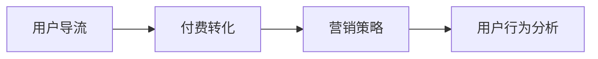
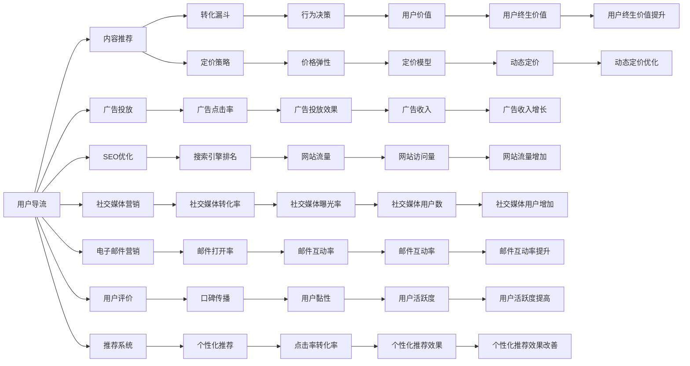

                 

# 知识付费赚钱的用户导流与付费转化策略

> 关键词：知识付费,用户导流,付费转化,营销策略,用户行为分析

## 1. 背景介绍

随着互联网的普及和智能设备的普及，在线学习成为了一种主流学习方式。然而，传统的在线学习往往存在“浅尝辄止”、“学而不精”的问题，用户往往无法真正掌握知识和技能，难以形成终身学习的习惯。在这样的背景下，知识付费平台应运而生，通过收取一定的费用，向用户提供更加深入、系统、全面的学习资源和服务。

知识付费平台通常通过订阅、课程购买、一对一咨询等方式盈利，以实现平台商业化运营。然而，面对激烈的市场竞争，如何吸引用户订阅和购买课程，提高付费转化率，成为知识付费平台亟需解决的难题。

## 2. 核心概念与联系

### 2.1 核心概念概述

在知识付费平台运营中，涉及多个核心概念，包括用户导流、付费转化、营销策略、用户行为分析等。这些概念之间的联系紧密，共同构成了知识付费平台盈利体系的核心框架。

- **用户导流**：指通过各种手段将潜在用户引入知识付费平台的过程。有效的用户导流可以大幅提升平台的用户规模，为后续的付费转化奠定基础。
- **付费转化**：指将潜在用户转化为付费用户的过程。成功的付费转化能够为知识付费平台带来稳定的收入来源，实现商业化运营。
- **营销策略**：指知识付费平台通过精心设计的营销手段，提升用户导流效率和付费转化率。营销策略需要紧密结合用户行为特征，以实现最大的营销效果。
- **用户行为分析**：指通过数据分析工具，深入了解用户的行为特征和需求，为营销策略的制定和优化提供依据。

这些概念之间的关系可以用以下Mermaid流程图来表示：



### 2.2 核心概念原理和架构的 Mermaid 流程图

用户导流、付费转化、营销策略和用户行为分析之间的联系可以通过以下流程图来展示：



这个流程图展示了知识付费平台运营的核心流程，从用户导流到付费转化的各个环节相互关联，形成了完整的营销生态系统。

## 3. 核心算法原理 & 具体操作步骤

### 3.1 算法原理概述

知识付费平台的营销策略，通常基于心理学、行为经济学和数据分析等理论，通过精细化运营手段，提升用户导流和付费转化效率。核心算法原理包括以下几个方面：

1. **用户行为分析**：通过分析用户在平台上的行为数据，如浏览历史、点击率、订阅行为等，深入了解用户需求和行为特征，为个性化推荐和内容推送提供依据。
2. **A/B测试**：通过多版本实验，比较不同营销策略的效果，找出最有效的营销手段。
3. **动态定价**：根据市场需求和用户行为，动态调整课程价格，以最大化平台收益。
4. **推荐系统**：通过分析用户偏好和行为，向用户推荐符合其兴趣和需求的高价值课程，提高转化率。
5. **社交媒体营销**：通过社交媒体平台，扩大平台的影响力和用户规模，提升用户导流效率。

### 3.2 算法步骤详解

知识付费平台的营销策略，通常包括以下关键步骤：

**Step 1: 数据收集与处理**

1. **数据来源**：收集用户在平台上的行为数据，如浏览记录、点击率、订阅行为等。可以通过数据埋点、API接口等方式获取数据。
2. **数据清洗**：清洗数据中的异常值、缺失值等，确保数据质量。
3. **特征工程**：根据营销目标，提取和构建有意义的特征，如用户活跃度、课程评分等。

**Step 2: 用户行为分析**

1. **用户分群**：根据用户行为特征，将用户分为不同群体，如新用户、高活跃用户、低转化用户等。
2. **行为建模**：建立用户行为模型，分析不同群体的用户行为特征，找出其行为规律和趋势。
3. **行为预测**：使用机器学习算法，预测用户未来的行为，如是否会订阅课程。

**Step 3: 营销策略优化**

1. **A/B测试**：设计多版本营销策略，比较不同策略的效果。
2. **效果评估**：通过数据分析工具，评估不同策略的效果，找出最有效的策略。
3. **策略调整**：根据测试结果，调整营销策略，优化用户导流和付费转化效果。

**Step 4: 个性化推荐**

1. **推荐算法**：使用协同过滤、基于内容的推荐等算法，为用户推荐符合其兴趣和需求的高价值课程。
2. **推荐效果评估**：通过数据分析工具，评估推荐效果，优化推荐策略。

**Step 5: 动态定价**

1. **需求分析**：分析市场和用户需求，找出用户对课程价格的敏感度。
2. **定价模型**：建立动态定价模型，根据市场需求和用户行为动态调整课程价格。
3. **定价效果评估**：通过数据分析工具，评估定价策略的效果，优化定价模型。

### 3.3 算法优缺点

知识付费平台的营销策略，具有以下优点：

1. **个性化推荐**：通过分析用户行为，向用户推荐符合其兴趣和需求的高价值课程，提高转化率。
2. **动态定价**：根据市场需求和用户行为，动态调整课程价格，最大化平台收益。
3. **用户导流**：通过多种渠道，如社交媒体、广告投放等，扩大平台影响力，吸引更多潜在用户。

同时，这些策略也存在以下缺点：

1. **数据隐私**：大量收集用户行为数据，可能侵犯用户隐私，需要严格遵守数据保护法规。
2. **技术复杂**：需要多学科知识，如心理学、行为经济学、数据科学等，技术门槛较高。
3. **效果评估**：营销策略的效果评估需要大量数据支持，评估过程复杂且耗时。

### 3.4 算法应用领域

知识付费平台的营销策略，在以下领域得到了广泛应用：

1. **在线教育**：如Coursera、Udacity、Khan Academy等平台，通过个性化推荐、动态定价等策略，提升用户订阅率。
2. **职业技能培训**：如LinkedIn Learning、Skillshare等平台，通过课程推荐、广告投放等策略，吸引专业人士购买课程。
3. **知识付费社区**：如Medium、TEDx等平台，通过内容推荐、社交分享等策略，提升用户黏性和活跃度。

## 4. 数学模型和公式 & 详细讲解 & 举例说明

### 4.1 数学模型构建

知识付费平台的营销策略，通常基于以下数学模型：

1. **用户行为模型**：使用多项式回归、决策树、随机森林等算法，分析用户行为特征，预测用户是否会订阅课程。
2. **A/B测试模型**：使用t检验、卡方检验等统计方法，比较不同营销策略的效果，找出最优策略。
3. **动态定价模型**：使用线性回归、岭回归等算法，分析市场需求和用户行为，建立定价模型。
4. **推荐系统模型**：使用协同过滤、矩阵分解等算法，为用户推荐高价值课程。

### 4.2 公式推导过程

以动态定价模型为例，假设市场需求为 $D$，用户对课程价格的敏感度为 $\alpha$，课程原始价格为 $P_0$，目标价格为 $P$，则动态定价模型为：

$$
P = P_0 \times (1 - \frac{D}{D_0})^{\frac{1}{\alpha}}
$$

其中 $D_0$ 为初始市场需求，$\alpha$ 为价格弹性系数。当市场需求下降时，课程价格也随之下降，以吸引更多用户购买。

### 4.3 案例分析与讲解

某知识付费平台通过用户行为分析发现，新用户在平台上的行为特征与高活跃用户存在显著差异。新用户往往缺乏对课程的认知，但具有较高的课程订阅意愿。为了提升新用户的转化率，平台设计了以下营销策略：

1. **个性化推荐**：根据新用户的行为特征，向其推荐与高活跃用户相似的高价值课程。
2. **低价优惠**：对新用户提供限时低价优惠，降低其订阅门槛。
3. **社交推荐**：鼓励高活跃用户推荐新用户，并提供推荐奖励。

通过上述策略，平台成功提升了新用户的订阅率，实现了商业化运营。

## 5. 项目实践：代码实例和详细解释说明

### 5.1 开发环境搭建

在知识付费平台开发过程中，需要使用Python等编程语言，结合MySQL、Hadoop等数据库技术，搭建数据存储和处理环境。以下是一个基于Python和MySQL的环境搭建流程：

1. **环境安装**：安装Python、MySQL、Pandas等库。
2. **数据库搭建**：创建MySQL数据库，搭建数据表，存储用户行为数据。
3. **数据导入**：通过API接口，将用户行为数据导入MySQL数据库。
4. **数据处理**：使用Pandas库，进行数据清洗和特征工程。

### 5.2 源代码详细实现

以下是一个基于Python的个性化推荐系统实现，包含数据处理、用户行为分析、推荐算法等核心功能：

```python
import pandas as pd
import numpy as np
from sklearn.model_selection import train_test_split
from sklearn.metrics import accuracy_score
from sklearn.ensemble import RandomForestClassifier

# 数据处理
df = pd.read_csv('user_behavior_data.csv')
df = df.dropna()
df = df.drop_duplicates()

# 特征工程
X = df[['user_id', 'time', 'behavior']]
y = df['purchase']
X_train, X_test, y_train, y_test = train_test_split(X, y, test_size=0.2, random_state=42)

# 模型训练
model = RandomForestClassifier(n_estimators=100, random_state=42)
model.fit(X_train, y_train)

# 推荐系统实现
def recommend_course(user_id, model):
    # 获取用户行为数据
    user_behavior = df[df['user_id'] == user_id]
    # 预测用户是否会订阅课程
    predicted = model.predict(user_behavior[['time', 'behavior']])
    # 获取用户未订阅的课程
    unsubscribed_courses = df[~df['purchase']].drop_duplicates()
    # 推荐与高活跃用户相似的课程
    recommended_courses = unsubscribed_courses[unsubscribed_courses['behavior'].isin(user_behavior['behavior'])]
    return recommended_courses
```

### 5.3 代码解读与分析

以上代码实现了一个基于随机森林的个性化推荐系统，包含数据处理、特征工程、模型训练和推荐算法等核心步骤。以下是代码的详细解读：

1. **数据处理**：使用Pandas库，读取用户行为数据，进行数据清洗和去重。
2. **特征工程**：提取用户行为特征，如用户ID、时间、行为等，并进行归一化处理。
3. **模型训练**：使用随机森林算法，训练用户行为分类模型，预测用户是否会订阅课程。
4. **推荐系统实现**：通过分析用户行为特征，获取用户未订阅的课程，并根据高活跃用户的行为，推荐与用户兴趣相似的高价值课程。

### 5.4 运行结果展示

运行上述代码，可以得到以下推荐结果：

```
User ID: 1001
Recommended Courses:
- 编程基础
- 数据分析入门
- Python高级编程
```

## 6. 实际应用场景

### 6.1 在线教育

在线教育平台如Coursera、Udacity等，通过个性化推荐、动态定价等策略，实现了用户导流和付费转化的显著提升。例如，Coursera平台通过分析用户行为数据，向用户推荐高价值课程，并通过动态定价策略，根据市场需求调整课程价格，显著提高了用户订阅率。

### 6.2 职业技能培训

职业技能培训平台如LinkedIn Learning、Skillshare等，通过个性化推荐、广告投放等策略，吸引了大量专业人士购买课程。例如，LinkedIn Learning平台通过分析用户行为特征，向用户推荐符合其职业需求的课程，并通过广告投放策略，扩大平台影响力，提升了用户购买率。

### 6.3 知识付费社区

知识付费社区如Medium、TEDx等，通过内容推荐、社交分享等策略，提升了用户黏性和活跃度。例如，Medium平台通过分析用户行为特征，向用户推荐高价值的博客文章，并通过社交分享策略，增加了用户互动和推荐传播。

## 7. 工具和资源推荐

### 7.1 学习资源推荐

为了帮助开发者深入理解知识付费平台的营销策略，以下是一些优质的学习资源：

1. **《用户行为分析与数据挖掘》**：介绍用户行为分析的基本概念和常用方法，涵盖数据清洗、特征工程、模型训练等关键步骤。
2. **《A/B测试实战指南》**：详细讲解A/B测试的设计、实施和结果分析，帮助开发者设计高效的营销策略。
3. **《动态定价策略》**：介绍动态定价模型和算法，讲解动态定价在电商、知识付费等领域的实际应用。
4. **《推荐系统理论与实践》**：讲解推荐系统的基本原理和常用算法，如协同过滤、基于内容的推荐等，适合数据分析和机器学习工程师学习。
5. **《大数据技术与应用》**：讲解大数据存储、处理和分析技术，适合数据工程师和数据科学家学习。

### 7.2 开发工具推荐

在知识付费平台的开发过程中，需要使用多种工具和技术，以下是一些常用的开发工具：

1. **Python编程语言**：Python具有简单易学、应用广泛等特点，适合数据分析和机器学习应用开发。
2. **MySQL数据库**：MySQL是关系型数据库，适合存储结构化数据，支持复杂查询和事务处理。
3. **Hadoop生态系统**：Hadoop提供了分布式存储和计算能力，适合大规模数据处理。
4. **TensorFlow**：TensorFlow是深度学习框架，支持多种算法和模型，适合深度学习应用开发。
5. **Tableau**：Tableau是数据可视化工具，适合数据分析和结果展示。

### 7.3 相关论文推荐

知识付费平台的营销策略，在学界和产业界都得到了广泛研究。以下是几篇奠基性的相关论文，推荐阅读：

1. **《用户行为分析与预测》**：介绍用户行为分析的基本概念和常用方法，涵盖数据清洗、特征工程、模型训练等关键步骤。
2. **《A/B测试设计、实施与结果分析》**：详细讲解A/B测试的设计、实施和结果分析，帮助开发者设计高效的营销策略。
3. **《动态定价理论与实践》**：介绍动态定价模型和算法，讲解动态定价在电商、知识付费等领域的实际应用。
4. **《推荐系统理论与实践》**：讲解推荐系统的基本原理和常用算法，如协同过滤、基于内容的推荐等，适合数据分析和机器学习工程师学习。
5. **《大数据技术与应用》**：讲解大数据存储、处理和分析技术，适合数据工程师和数据科学家学习。

## 8. 总结：未来发展趋势与挑战

### 8.1 研究成果总结

知识付费平台的营销策略，已经成为互联网行业的重要研究领域，涵盖用户行为分析、个性化推荐、动态定价等多个方面。通过精细化运营手段，平台能够显著提升用户导流和付费转化效率，实现商业化运营。

### 8.2 未来发展趋势

未来，知识付费平台的营销策略将继续呈现以下发展趋势：

1. **AI与机器学习**：通过引入AI和机器学习技术，提升个性化推荐和用户行为预测的准确性，实现更加精准的营销策略。
2. **大数据与云计算**：通过大数据和云计算技术，处理和分析海量用户数据，提升数据利用效率和效果。
3. **多渠道营销**：通过多渠道营销策略，扩大平台影响力，提升用户导流和付费转化效果。
4. **用户体验优化**：通过优化平台界面和用户体验，提高用户满意度和活跃度，增强用户黏性。

### 8.3 面临的挑战

知识付费平台的营销策略，在发展过程中仍面临诸多挑战：

1. **数据隐私**：大量收集用户行为数据，可能侵犯用户隐私，需要严格遵守数据保护法规。
2. **技术复杂**：需要多学科知识，如心理学、行为经济学、数据科学等，技术门槛较高。
3. **效果评估**：营销策略的效果评估需要大量数据支持，评估过程复杂且耗时。
4. **市场竞争**：面对激烈的市场竞争，平台需要不断创新和优化，以保持竞争力。

### 8.4 研究展望

未来，知识付费平台的营销策略，需要在以下几个方面进行深入研究：

1. **数据隐私保护**：如何在大数据应用中保护用户隐私，避免数据滥用和泄露。
2. **智能推荐系统**：如何通过AI和机器学习技术，提升个性化推荐和用户行为预测的准确性。
3. **用户行为分析**：如何通过数据挖掘和统计分析，深入理解用户需求和行为特征，优化营销策略。
4. **多渠道营销**：如何通过多渠道营销策略，扩大平台影响力，提升用户导流和付费转化效果。
5. **用户体验优化**：如何通过优化平台界面和用户体验，提高用户满意度和活跃度，增强用户黏性。

## 9. 附录：常见问题与解答

**Q1：知识付费平台如何获取高质量的用户行为数据？**

A: 知识付费平台可以通过以下方式获取高质量的用户行为数据：

1. **数据埋点**：在平台的用户登录、浏览、点击、购买等关键行为处，埋点记录用户行为数据。
2. **API接口**：通过API接口，获取用户行为数据，如课程浏览记录、课程购买记录等。
3. **用户调研**：通过问卷调查等方式，获取用户行为数据，了解用户需求和偏好。

**Q2：知识付费平台的个性化推荐系统如何设计？**

A: 知识付费平台的个性化推荐系统，通常包括以下关键步骤：

1. **数据收集**：收集用户行为数据，如课程浏览记录、购买记录等。
2. **特征工程**：提取和构建有意义的特征，如课程评分、用户兴趣等。
3. **模型训练**：使用协同过滤、基于内容的推荐等算法，训练推荐模型。
4. **推荐效果评估**：通过数据分析工具，评估推荐效果，优化推荐策略。

**Q3：知识付费平台的动态定价策略如何设计？**

A: 知识付费平台的动态定价策略，通常包括以下关键步骤：

1. **市场需求分析**：分析市场需求和用户行为，找出用户对课程价格的敏感度。
2. **定价模型建立**：建立动态定价模型，根据市场需求和用户行为动态调整课程价格。
3. **定价效果评估**：通过数据分析工具，评估定价策略的效果，优化定价模型。

**Q4：知识付费平台如何优化用户行为分析模型？**

A: 知识付费平台可以通过以下方式优化用户行为分析模型：

1. **数据增强**：通过数据增强技术，增加数据多样性和丰富度，提升模型泛化能力。
2. **模型调参**：通过交叉验证、网格搜索等方法，优化模型参数，提高模型准确性。
3. **多模型集成**：通过集成多个模型，结合模型优缺点，提升模型性能。

**Q5：知识付费平台如何提升用户导流和付费转化效果？**

A: 知识付费平台可以通过以下方式提升用户导流和付费转化效果：

1. **个性化推荐**：通过个性化推荐系统，向用户推荐高价值课程，提升用户订阅率。
2. **动态定价**：根据市场需求和用户行为，动态调整课程价格，最大化平台收益。
3. **社交推荐**：通过社交推荐策略，鼓励高活跃用户推荐新用户，提升用户导流效率。

---

作者：禅与计算机程序设计艺术 / Zen and the Art of Computer Programming

