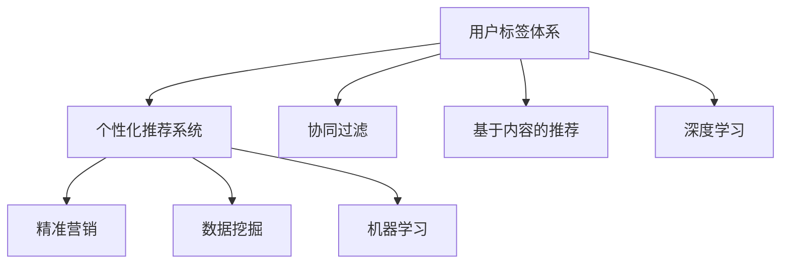

                 

# 知识付费赚钱的用户标签体系与个性化推荐策略

> 关键词：知识付费, 用户标签体系, 个性化推荐, 算法, 精准营销, 数据挖掘, 机器学习

## 1. 背景介绍

### 1.1 问题由来
随着互联网技术的发展，知识付费平台成为了一个日益壮大的市场。在知识付费领域，如何精准匹配用户和内容，提升用户满意度和平台盈利能力，成为一个重要且具有挑战性的问题。传统的基于人工编辑的推荐方式，无法满足海量用户和内容的匹配需求，导致用户体验差、平台流失率高。

### 1.2 问题核心关键点
为了解决上述问题，构建一个高效、精准的知识付费推荐系统变得至关重要。用户标签体系作为推荐系统的重要组成部分，通过挖掘用户的兴趣爱好和行为特征，可以更好地实现个性化推荐。通过机器学习算法，可以对用户标签进行挖掘和处理，动态调整推荐策略，提高平台的转化率和营收。

### 1.3 问题研究意义
构建高效的用户标签体系和个性化推荐策略，对于知识付费平台的成功运营具有重要意义：

1. 提升用户体验：通过个性化推荐，用户能够更快速地找到感兴趣的内容，提高满意度和留存率。
2. 提升平台营收：精准推荐能够促进用户订阅和购买，提高平台收入。
3. 优化资源利用：合理分配内容资源，避免资源浪费，提高平台运营效率。
4. 提供数据支持：用户标签体系和推荐策略的形成，可以提供丰富的用户行为数据，为进一步的用户分析和产品优化提供支持。

## 2. 核心概念与联系

### 2.1 核心概念概述

构建用户标签体系和个性化推荐策略涉及多个关键概念：

- **用户标签体系(User Tagging System)**：通过对用户的行为数据、兴趣偏好、历史消费等进行挖掘，形成用户的个性化标签，用于描述用户特征和需求。
- **个性化推荐系统(Personalized Recommendation System)**：基于用户标签和内容标签，使用机器学习算法预测用户对内容的兴趣度，实现内容的个性化推荐。
- **算法模型(Algorithm Model)**：包括协同过滤、基于内容的推荐、深度学习等方法，用于处理用户和内容的复杂关系，进行精准推荐。
- **精准营销(Precision Marketing)**：结合用户标签和推荐结果，实现有针对性的用户触达和营销策略，提高转化率和营收。
- **数据挖掘(Data Mining)**：通过数据预处理、特征工程等方法，从海量数据中挖掘有价值的信息，为推荐系统提供支持。
- **机器学习(Machine Learning)**：利用算法模型处理用户和内容的关系，实现个性化推荐。

这些核心概念之间的逻辑关系可以通过以下Mermaid流程图来展示：



这个流程图展示了一些关键概念之间的联系：

1. 用户标签体系通过对用户行为的挖掘形成用户特征。
2. 个性化推荐系统利用算法模型处理用户和内容的关系，进行个性化推荐。
3. 精准营销基于推荐结果，实现有针对性的用户触达。
4. 数据挖掘和机器学习为推荐系统提供技术支持。

## 3. 核心算法原理 & 具体操作步骤
### 3.1 算法原理概述

个性化推荐系统通过用户标签体系，挖掘用户的兴趣爱好和行为特征，使用机器学习算法预测用户对内容的兴趣度，实现内容的个性化推荐。其核心思想是：

1. **用户画像构建**：通过分析用户的历史行为数据，形成用户的兴趣标签和行为标签，描述用户特征。
2. **内容画像构建**：通过分析内容的属性特征，形成内容的标签和分类信息。
3. **相似度计算**：使用协同过滤、基于内容的推荐、深度学习等算法，计算用户和内容之间的相似度。
4. **推荐生成**：根据相似度计算结果，生成个性化推荐列表。

### 3.2 算法步骤详解

个性化推荐系统的一般步骤如下：

**Step 1: 数据收集和预处理**

- 收集用户行为数据，包括浏览记录、购买记录、评分记录等。
- 对数据进行清洗、去重、归一化等预处理，形成可用于机器学习的数据集。

**Step 2: 用户画像构建**

- 使用聚类算法（如K-Means、DBSCAN）对用户行为进行分组，形成用户的兴趣标签。
- 使用TF-IDF、词袋模型等方法，对用户的浏览记录和购买记录进行向量化，形成行为标签。

**Step 3: 内容画像构建**

- 对内容进行分类和标签标注，形成内容的属性特征。
- 使用TF-IDF、词袋模型等方法，对内容的属性特征进行向量化，形成内容的标签。

**Step 4: 相似度计算**

- 使用协同过滤算法（如User-Item协同过滤）计算用户和内容之间的相似度。
- 使用基于内容的推荐算法（如CF-Bag）计算用户和内容之间的相似度。
- 使用深度学习模型（如DNN、RNN、Transformer）对用户和内容进行相似度计算。

**Step 5: 推荐生成**

- 根据相似度计算结果，生成个性化推荐列表。
- 使用A/B测试等方法评估推荐策略的效果，进行动态调整。

**Step 6: 效果评估**

- 使用各种评估指标（如准确率、召回率、F1-score）评估推荐系统的性能。
- 根据评估结果调整算法参数，优化推荐效果。

### 3.3 算法优缺点

个性化推荐系统具有以下优点：

1. **高效性**：通过用户标签体系和机器学习算法，能够快速匹配用户和内容，提高推荐效率。
2. **个性化**：基于用户画像和内容画像，提供高度个性化的推荐，提升用户体验。
3. **灵活性**：能够动态调整推荐策略，适应不同用户和内容的变化。
4. **可扩展性**：能够处理大规模用户和内容数据，适应平台扩展需求。

同时，该系统也存在以下局限性：

1. **冷启动问题**：新用户和内容往往缺乏足够的行为数据，难以形成准确的标签和相似度计算。
2. **稀疏性问题**：用户和内容之间存在大量的无效数据，影响推荐效果。
3. **过拟合问题**：模型可能对训练数据过度拟合，导致推荐结果偏差。
4. **数据隐私问题**：用户行为数据的收集和处理可能涉及隐私问题，需要谨慎处理。

尽管存在这些局限性，但就目前而言，个性化推荐系统仍是最为主流和有效的推荐方法。未来相关研究的重点在于如何进一步提升算法的精度和泛化能力，解决冷启动和稀疏性问题，同时兼顾数据隐私和安全。

### 3.4 算法应用领域

个性化推荐系统在多个领域都有广泛应用，包括：

- **电商平台**：基于用户历史浏览和购买行为，推荐相关商品，提高转化率。
- **内容平台**：推荐用户感兴趣的文章、视频、音乐等，提升用户粘性和平台活跃度。
- **视频平台**：推荐用户未观看的视频内容，提升内容覆盖和观看量。
- **社交平台**：推荐用户可能感兴趣的朋友和内容，提升平台互动性。
- **金融领域**：推荐用户感兴趣的投资产品，提高用户投资收益和平台收入。

除了上述这些经典领域外，个性化推荐系统还被创新性地应用于更多场景中，如个性化广告、个性化旅游推荐等，为用户的个性化需求提供更精准的解决方案。

## 4. 数学模型和公式 & 详细讲解 & 举例说明

### 4.1 数学模型构建

个性化推荐系统的数学模型可以通过以下几个关键步骤进行构建：

1. **用户画像构建**：
   - 用户历史行为数据 $U=\{(x_i, y_i)\}_{i=1}^N$，其中 $x_i$ 为用户的浏览记录，$y_i$ 为用户的评分记录。
   - 用户标签体系 $L=\{(l_1, \ldots, l_k)\}$，其中 $l_i$ 为用户的兴趣标签。

2. **内容画像构建**：
   - 内容属性数据 $C=\{(c_j, t_j)\}_{j=1}^M$，其中 $c_j$ 为内容的分类，$t_j$ 为内容的标签。
   - 内容标签体系 $T=\{(t_1, \ldots, t_n)\}$，其中 $t_i$ 为内容的兴趣标签。

3. **相似度计算**：
   - 用户和内容的相似度计算公式：
     - 协同过滤：$\text{similarity}_{UC}(u, c) = \frac{1}{N} \sum_{i=1}^N x_i \times t_j$
     - 基于内容的推荐：$\text{similarity}_{BC}(u, c) = \frac{1}{M} \sum_{j=1}^M c_j \times t_j$
     - 深度学习模型：$\text{similarity}_{DNN}(u, c) = \text{model}(u, c)$

4. **推荐生成**：
   - 使用softmax函数对用户和内容相似度进行归一化，生成推荐列表：$\text{output}_{UC} = \text{softmax}(\text{similarity}_{UC})$，$\text{output}_{BC} = \text{softmax}(\text{similarity}_{BC})$，$\text{output}_{DNN} = \text{softmax}(\text{similarity}_{DNN})$

### 4.2 公式推导过程

以协同过滤算法为例，推导用户和内容的相似度计算公式。

设用户 $u$ 的浏览记录为 $U=\{(x_1, x_2, \ldots, x_n)\}$，内容 $c$ 的分类为 $C=\{(c_1, c_2, \ldots, c_m)\}$，内容标签为 $T=\{(t_1, t_2, \ldots, t_k)\}$。则用户和内容的相似度计算公式为：

$$
\text{similarity}_{UC}(u, c) = \frac{1}{N} \sum_{i=1}^N x_i \times t_j
$$

其中，$x_i$ 和 $t_j$ 分别表示用户 $u$ 和内容 $c$ 的特征向量。

### 4.3 案例分析与讲解

以电商平台推荐系统为例，分析用户画像和内容画像的构建方法。

假设电商平台收集了用户的历史浏览记录和评分记录，形成了用户数据集 $U=\{(x_1, y_1), (x_2, y_2), \ldots, (x_N, y_N)\}$，其中 $x_i$ 为用户浏览记录，$y_i$ 为用户评分。使用K-Means聚类算法，将用户分为多个兴趣标签，形成用户画像 $L=\{(l_1, l_2, \ldots, l_k)\}$。

同时，电商平台还收集了商品的属性数据，包括分类 $C=\{(c_1, c_2, \ldots, c_m)\}$ 和标签 $T=\{(t_1, t_2, \ldots, t_n)\}$。使用TF-IDF和词袋模型，将商品的属性数据向量化，形成内容画像 $T=\{(t_1, t_2, \ldots, t_n)\}$。

## 5. 项目实践：代码实例和详细解释说明
### 5.1 开发环境搭建

在进行个性化推荐系统开发前，我们需要准备好开发环境。以下是使用Python进行Scikit-learn开发的环境配置流程：

1. 安装Anaconda：从官网下载并安装Anaconda，用于创建独立的Python环境。

2. 创建并激活虚拟环境：
```bash
conda create -n recsys-env python=3.8 
conda activate recsys-env
```

3. 安装Scikit-learn：
```bash
conda install scikit-learn
```

4. 安装其他工具包：
```bash
pip install numpy pandas scipy tqdm jupyter notebook ipython
```

完成上述步骤后，即可在`recsys-env`环境中开始推荐系统开发。

### 5.2 源代码详细实现

下面以协同过滤算法为例，给出使用Scikit-learn对用户行为数据进行聚类和相似度计算的Python代码实现。

首先，定义用户行为数据处理函数：

```python
import pandas as pd
from sklearn.decomposition import TruncatedSVD
from sklearn.cluster import MiniBatchKMeans
from sklearn.metrics.pairwise import cosine_similarity

def preprocess_data(data_path):
    # 读取用户行为数据
    data = pd.read_csv(data_path)
    
    # 数据清洗和预处理
    data = data.dropna()  # 去除缺失值
    data = data.drop_duplicates()  # 去除重复记录
    
    # 构建用户画像
    user_items = data.groupby('user_id').agg({'item_id': 'count'}).dropna()  # 计算用户浏览商品数量
    user_labels = MiniBatchKMeans(n_clusters=10, random_state=42).fit_transform(user_items.values)  # 对用户画像进行聚类
    
    # 构建内容画像
    content_labels = TruncatedSVD(n_components=10).fit_transform(data[['item_id', 'category', 'rating']].values)  # 对商品属性进行降维
    
    return user_labels, content_labels
```

然后，定义推荐函数：

```python
def recommend(user_labels, content_labels, user, top_n=10):
    # 计算用户和内容的相似度
    similarity = cosine_similarity(user_labels, content_labels)
    
    # 计算推荐列表
    recommended_items = []
    for i in range(len(similarity)):
        if user == i:
            continue  # 跳过自身
        recommended_items.append((i, similarity[i]))
    recommended_items = sorted(recommended_items, key=lambda x: x[1], reverse=True)[:top_n]
    
    return recommended_items
```

最后，启动推荐流程：

```python
# 准备数据
user_labels, content_labels = preprocess_data('user_data.csv')
user_id = 1  # 用户ID

# 推荐商品
recommended_items = recommend(user_labels, content_labels, user_id)
print(recommended_items)
```

以上就是使用Scikit-learn对协同过滤算法进行推荐系统开发的完整代码实现。可以看到，Scikit-learn的简单易用使得推荐系统的实现变得高效快捷。

### 5.3 代码解读与分析

让我们再详细解读一下关键代码的实现细节：

**preprocess_data函数**：
- 读取用户行为数据，并进行清洗和预处理。
- 使用MiniBatchKMeans对用户画像进行聚类，形成用户的兴趣标签。
- 使用TruncatedSVD对商品属性进行降维，形成内容画像。

**recommend函数**：
- 计算用户和内容的相似度，并根据相似度生成推荐列表。
- 使用cosine_similarity函数计算相似度，返回用户ID及其与内容的相似度列表。
- 根据相似度列表生成推荐商品列表，并返回前top_n条商品。

**启动推荐流程**：
- 调用preprocess_data函数，获取用户画像和内容画像。
- 指定用户ID，调用recommend函数生成推荐商品列表。

通过这些步骤，就可以实现一个简单的推荐系统，提供个性化的商品推荐。

## 6. 实际应用场景
### 6.1 电商平台推荐

在电商平台推荐中，个性化推荐系统可以实时为用户提供个性化的商品推荐，提升购物体验和转化率。电商平台可以收集用户的历史浏览、购买、评分等行为数据，构建用户画像和内容画像，使用协同过滤、基于内容的推荐等算法进行推荐，提高用户满意度和平台营收。

### 6.2 视频平台推荐

在视频平台推荐中，个性化推荐系统可以根据用户的历史观看记录，推荐用户可能感兴趣的视频内容。通过分析用户的观看历史和评分数据，形成用户的兴趣标签，使用协同过滤、基于内容的推荐等算法，生成个性化推荐列表，提升用户观看量和平台收益。

### 6.3 内容平台推荐

在内容平台推荐中，个性化推荐系统可以推荐用户感兴趣的文章、视频、音乐等。通过分析用户的历史浏览和评分数据，形成用户的兴趣标签，使用协同过滤、基于内容的推荐等算法，生成个性化推荐列表，提升平台的用户粘性和活跃度。

### 6.4 未来应用展望

随着推荐系统的不断发展，未来将会有更多的应用场景出现，例如：

1. **个性化广告**：推荐系统可以根据用户的行为数据，生成个性化的广告内容，提高广告的点击率和转化率。
2. **个性化旅游推荐**：结合用户的兴趣标签和行为数据，推荐适合用户的旅游目的地和行程，提升用户的旅游体验。
3. **个性化娱乐推荐**：结合用户的兴趣标签和行为数据，推荐适合用户的影视剧、游戏等娱乐内容，提升用户满意度。
4. **个性化健康推荐**：结合用户的健康数据和行为数据，推荐适合用户的健康计划和产品，提升用户健康水平和满意度。

## 7. 工具和资源推荐
### 7.1 学习资源推荐

为了帮助开发者系统掌握推荐系统的理论基础和实践技巧，这里推荐一些优质的学习资源：

1. 《推荐系统实践》一书：详细介绍了推荐系统的理论和算法，提供了大量实战案例和代码示例。
2. 《机器学习实战》一书：介绍了机器学习的基本概念和算法，结合Scikit-learn等库，提供了推荐系统的实现案例。
3. 《数据挖掘与统计学习》课程：斯坦福大学开设的课程，涵盖了数据挖掘和机器学习的核心内容，适合初学者学习。
4. Kaggle竞赛平台：提供了大量推荐系统的竞赛数据和开源代码，可以学习和实践推荐系统算法。
5. PyCon等开源会议：定期举办推荐系统的开源会议和研讨会，分享最新的研究进展和实践经验。

通过对这些资源的学习实践，相信你一定能够快速掌握推荐系统的精髓，并用于解决实际的推荐问题。

### 7.2 开发工具推荐

高效的推荐系统开发离不开优秀的工具支持。以下是几款用于推荐系统开发的常用工具：

1. Scikit-learn：基于Python的开源机器学习库，提供了丰富的机器学习算法和工具，适合推荐系统开发。
2. TensorFlow：由Google主导开发的开源深度学习框架，生产部署方便，适合大规模工程应用。
3. PyTorch：基于Python的开源深度学习框架，灵活动态的计算图，适合研究型开发。
4. Scrapy：Python爬虫框架，用于抓取和清洗推荐系统所需的数据。
5. Numpy：高效的数值计算库，适合进行大规模数据处理和计算。
6. Pandas：Python数据分析库，适合进行数据清洗和预处理。

合理利用这些工具，可以显著提升推荐系统的开发效率，加快创新迭代的步伐。

### 7.3 相关论文推荐

推荐系统的发展源于学界的持续研究。以下是几篇奠基性的相关论文，推荐阅读：

1. **《推荐系统评价指标》**：详细介绍了推荐系统的各种评估指标，帮助理解推荐系统的性能。
2. **《基于协同过滤的推荐系统》**：介绍了协同过滤算法的基本原理和实现方法，是推荐系统领域的基础。
3. **《基于内容的推荐系统》**：介绍了基于内容的推荐算法，强调了内容特征的重要性。
4. **《深度学习在推荐系统中的应用》**：介绍了深度学习算法在推荐系统中的应用，展示了深度学习算法的优势和挑战。
5. **《近邻算法在推荐系统中的应用》**：介绍了近邻算法在推荐系统中的应用，展示了近邻算法的优势和局限性。

这些论文代表推荐系统的发展脉络。通过学习这些前沿成果，可以帮助研究者把握学科前进方向，激发更多的创新灵感。

## 8. 总结：未来发展趋势与挑战
### 8.1 总结

本文对基于用户标签体系的个性化推荐系统进行了全面系统的介绍。首先阐述了推荐系统的发展背景和用户标签体系的重要性，明确了推荐系统在提升用户体验和平台营收方面的独特价值。其次，从原理到实践，详细讲解了推荐系统的数学原理和关键步骤，给出了推荐系统开发的完整代码实例。同时，本文还广泛探讨了推荐系统在电商平台、视频平台、内容平台等多个领域的应用前景，展示了推荐系统的巨大潜力。此外，本文精选了推荐系统的各类学习资源，力求为读者提供全方位的技术指引。

通过本文的系统梳理，可以看到，基于用户标签体系的个性化推荐系统正在成为推荐领域的重要范式，极大地拓展了推荐系统的应用边界，催生了更多的落地场景。得益于海量数据和先进算法的支持，推荐系统能够提供高度个性化的服务，提升用户的满意度和平台收益。未来，伴随推荐系统的不断发展，结合更先进的深度学习算法和大数据分析技术，推荐系统必将在更广阔的领域取得突破，为用户的个性化需求提供更精准的解决方案。

### 8.2 未来发展趋势

展望未来，推荐系统将呈现以下几个发展趋势：

1. **深度学习算法的应用**：深度学习算法在推荐系统中的应用将更加广泛，通过神经网络模型提高推荐精度和效果。
2. **协同过滤与基于内容的融合**：未来的推荐系统将结合协同过滤和基于内容的推荐方法，形成更加全面和精准的推荐策略。
3. **实时推荐与动态调整**：推荐系统将具备实时推荐和动态调整的能力，根据用户行为数据实时更新推荐列表，提高推荐效果。
4. **多模态数据融合**：未来的推荐系统将结合文本、图像、视频等多模态数据，形成更加丰富的用户画像和内容画像，提高推荐效果。
5. **数据隐私与安全**：未来的推荐系统将更加注重用户数据隐私和安全问题，采用差分隐私等技术保障用户数据安全。

以上趋势凸显了推荐系统的广阔前景。这些方向的探索发展，必将进一步提升推荐系统的性能和应用范围，为用户的个性化需求提供更精准的解决方案。

### 8.3 面临的挑战

尽管推荐系统已经取得了显著成效，但在迈向更加智能化、普适化应用的过程中，它仍面临诸多挑战：

1. **冷启动问题**：新用户和内容往往缺乏足够的行为数据，难以形成准确的标签和相似度计算。
2. **稀疏性问题**：用户和内容之间存在大量的无效数据，影响推荐效果。
3. **过拟合问题**：模型可能对训练数据过度拟合，导致推荐结果偏差。
4. **数据隐私问题**：用户行为数据的收集和处理可能涉及隐私问题，需要谨慎处理。
5. **实时性问题**：推荐系统需要实时更新推荐列表，对于大规模数据集和复杂模型，实时性难以保障。

尽管存在这些挑战，但通过不断的技术创新和实践优化，推荐系统仍有望在未来的应用中取得突破。

### 8.4 研究展望

面对推荐系统面临的这些挑战，未来的研究需要在以下几个方面寻求新的突破：

1. **多模态数据融合**：结合文本、图像、视频等多模态数据，提高推荐系统的性能和效果。
2. **深度学习算法优化**：通过优化深度学习算法，提高推荐系统的泛化能力和效果。
3. **实时推荐系统**：设计高效的实时推荐系统，保证推荐列表的实时性和精度。
4. **用户数据隐私保护**：采用差分隐私等技术，保障用户数据的隐私和安全。
5. **推荐系统优化算法**：设计高效的推荐系统优化算法，提高推荐系统的效果和性能。

这些研究方向的探索，必将引领推荐系统技术迈向更高的台阶，为构建智能化、普适化的推荐系统铺平道路。面向未来，推荐系统需要结合更多的先进技术，如深度学习、大数据、隐私保护等，多路径协同发力，共同推动推荐系统的进步。

## 9. 附录：常见问题与解答
### 9.1 问题1：推荐系统如何缓解冷启动问题？

答：冷启动问题可以通过以下方法缓解：
1. 引入隐式反馈：收集用户的浏览记录、搜索记录等隐式反馈，构建用户画像。
2. 使用内容标签：通过内容标签进行推荐，减少对用户行为的依赖。
3. 采用启发式算法：使用启发式算法（如随机推荐、基于时间戳的推荐）进行初期推荐。
4. 引入专家知识：结合专家知识，构建初始的用户画像和内容画像。

### 9.2 问题2：推荐系统如何避免稀疏性问题？

答：稀疏性问题可以通过以下方法避免：
1. 数据填充：使用数据填充技术，补全缺失数据。
2. 协同过滤改进：使用基于图模型的协同过滤算法，提高模型的鲁棒性和泛化能力。
3. 基于内容的推荐：结合内容标签和属性特征，提高推荐效果。
4. 深度学习模型：使用深度学习模型进行推荐，能够处理更复杂的关系和数据。

### 9.3 问题3：推荐系统如何避免过拟合问题？

答：过拟合问题可以通过以下方法避免：
1. 数据增强：使用数据增强技术，提高模型的泛化能力。
2. 正则化技术：使用L2正则、Dropout等正则化技术，防止模型过度拟合。
3. 模型简化：使用更简单的模型结构，减少过拟合风险。
4. 模型融合：结合多个模型的预测结果，提高模型的鲁棒性和泛化能力。

### 9.4 问题4：推荐系统如何提高实时性？

答：提高推荐系统的实时性可以通过以下方法实现：
1. 数据预处理：对数据进行预处理，减少计算量和存储需求。
2. 数据分布式处理：使用分布式计算框架，提高数据处理速度。
3. 实时推荐算法：设计高效的实时推荐算法，保证推荐列表的实时性。
4. 缓存机制：使用缓存机制，减少重复计算，提高响应速度。

### 9.5 问题5：推荐系统如何保障用户数据隐私？

答：保障用户数据隐私可以通过以下方法实现：
1. 差分隐私技术：使用差分隐私技术，保障用户数据的安全性。
2. 数据匿名化：对用户数据进行匿名化处理，减少隐私泄露风险。
3. 数据加密：对用户数据进行加密处理，防止数据泄露。
4. 访问控制：采用访问控制技术，限制数据的访问权限。

通过这些方法，可以有效保障用户数据隐私，提高推荐系统的可信度和安全性。

---

作者：禅与计算机程序设计艺术 / Zen and the Art of Computer Programming

