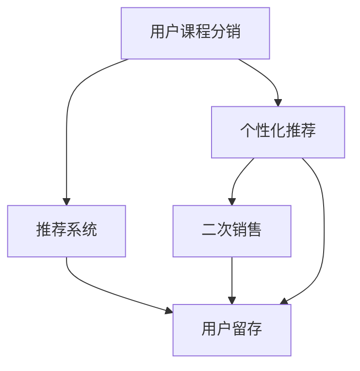

                 

# 知识付费赚钱的用户课程分销与二次销售策略

> 关键词：知识付费, 用户课程分销, 二次销售策略, 数据分析, 用户行为, 个性化推荐

## 1. 背景介绍

随着知识付费市场的快速增长，用户对于线上课程的需求日益增加。知识付费平台，如Coursera、Udemy、得到等，通过提供优质课程内容，吸引了大批用户注册订阅。课程订阅往往伴随着高昂的月费或年费，平台通过向用户销售高价值内容，获取稳定的收入来源。然而，这种传统的单次销售模式难以持续扩展用户基数，无法最大化潜在收益。为了提高用户生命周期价值(Lifetime Value, LTV)和平台收入，分销和二次销售策略成为重要的探索方向。本文将深入探讨用户课程分销与二次销售策略，并结合实际案例进行分析。

### 1.1 问题由来

在知识付费市场中，用户购买课程后往往并不会全部完成。许多用户虽然订阅了课程，但实际使用率低，流失率高。用户流失不仅导致平台收入下降，也使得课程内容资源浪费。为提高用户活跃度和留存率，知识付费平台亟需制定有效的用户课程分销与二次销售策略。

用户课程分销与二次销售策略主要分为两大方面：

- **分销策略**：通过推荐系统，将优质课程推荐给未购买课程的潜在用户，吸引其订阅购买，最大化首次购买转化率。
- **二次销售策略**：通过数据分析和个性化推荐，为已购买用户提供附加服务或相关课程，最大化用户终身价值。

本文将从分销与二次销售策略的原理与实现方法出发，深入探讨实际应用案例，提出针对性优化建议。

## 2. 核心概念与联系

### 2.1 核心概念概述

为更好地理解分销与二次销售策略，本节将介绍几个核心概念：

- **用户课程分销**：指利用推荐算法，将优质课程推荐给未购买课程的潜在用户，引导其进行首次课程购买的行为。
- **二次销售**：指在用户已购买某课程后，利用数据分析和个性化推荐，向其推荐其他相关课程或附加服务，以延长用户使用周期，最大化其终身价值。
- **推荐系统**：指通过算法模型，从用户行为数据中提取特征，预测用户兴趣和行为，为每个用户生成个性化推荐结果的系统。
- **个性化推荐**：指根据用户历史行为和特征，针对性地向用户推荐其可能感兴趣的课程或内容，提升用户满意度和转化率。

这些概念之间的逻辑关系可以通过以下Mermaid流程图来展示：



这个流程图展示了用户课程分销与二次销售策略的核心概念及其之间的关系：

1. 用户课程分销通过推荐系统将优质课程推荐给潜在用户，吸引其首次购买。
2. 二次销售利用个性化推荐，为已购买用户提供相关课程或附加服务，延长用户使用周期。
3. 个性化推荐是分销和二次销售策略的核心工具，基于用户行为数据和特征，生成个性化推荐结果。

## 3. 核心算法原理 & 具体操作步骤

### 3.1 算法原理概述

分销与二次销售策略基于推荐系统原理实现。通过收集用户行为数据，利用机器学习模型提取用户特征，并预测用户对课程的兴趣，从而生成推荐结果。

具体来说，分销策略旨在最大化首次购买转化率，二次销售策略则专注于提升用户终身价值。两者共同作用，构成了一套完整的用户课程分销与二次销售体系。

分销与二次销售策略的实现步骤如下：

1. **数据收集**：收集用户历史行为数据，包括课程浏览、购买、评价、课程完成度等。
2. **特征提取**：从收集的数据中提取用户特征，如兴趣标签、学习时长、课程难度等。
3. **模型训练**：利用提取的特征，训练推荐模型，生成推荐结果。
4. **推荐系统部署**：将训练好的模型部署到推荐系统中，实时生成个性化推荐结果。
5. **效果评估与迭代优化**：定期评估推荐效果，根据用户反馈和行为数据，迭代优化推荐模型和策略。

### 3.2 算法步骤详解

#### 3.2.1 分销策略实现步骤

**Step 1: 数据准备**
- 收集用户行为数据，包括课程浏览、购买、评价、完成度等。
- 将数据进行预处理，去除噪音和异常值，确保数据质量。

**Step 2: 特征工程**
- 从数据中提取特征，如用户兴趣标签、学习时长、课程难度等。
- 使用特征选择方法，筛选出与课程购买行为高度相关的特征。

**Step 3: 模型选择与训练**
- 选择适合推荐系统的算法模型，如协同过滤、基于内容的推荐等。
- 利用训练集数据，训练推荐模型。

**Step 4: 模型评估**
- 在验证集上评估推荐模型的准确率和覆盖率。
- 根据评估结果调整模型参数，进行迭代优化。

**Step 5: 部署与监控**
- 将训练好的模型部署到推荐系统中，实时生成个性化推荐结果。
- 监控推荐系统的运行状态和效果，根据用户反馈进行调整。

#### 3.2.2 二次销售策略实现步骤

**Step 1: 数据收集与分析**
- 收集用户历史行为数据，包括课程浏览、购买、评价、完成度等。
- 分析用户行为数据，提取用户兴趣和偏好。

**Step 2: 个性化推荐生成**
- 利用用户兴趣和行为特征，生成个性化推荐结果。
- 结合用户已购买课程信息，推荐相关课程或附加服务。

**Step 3: 推荐系统部署与监控**
- 将推荐结果嵌入推荐系统中，实时向用户展示个性化推荐。
- 监控推荐效果，根据用户反馈进行调整优化。

### 3.3 算法优缺点

分销与二次销售策略在提升用户首次购买和终身价值方面具有显著优势，但也存在以下缺点：

**优点**：
1. **提升用户留存率**：通过个性化推荐，满足用户兴趣，延长用户使用周期，提高用户留存率。
2. **增加用户生命周期价值**：推荐相关课程和附加服务，增加用户订阅数量和订阅时长，最大化用户终身价值。
3. **提高推荐系统效果**：利用用户行为数据进行推荐，不断优化推荐模型，提升推荐准确率和覆盖率。

**缺点**：
1. **数据隐私风险**：用户行为数据可能涉及隐私信息，处理不当可能引发法律和伦理问题。
2. **个性化推荐偏差**：个性化推荐算法可能存在偏差，导致推荐结果不公平，影响用户体验。
3. **推荐系统复杂度**：推荐系统设计和部署复杂度较高，需要大量技术投入和经验积累。

### 3.4 算法应用领域

分销与二次销售策略在知识付费平台中的应用广泛，涵盖以下几个领域：

- **在线教育平台**：如Coursera、Udemy、得到等，通过推荐系统引导用户首次购买课程，并通过个性化推荐提升用户终身价值。
- **企业培训平台**：如腾讯课堂、网易云课堂等，利用用户行为数据，向员工推荐适合的培训课程和认证，提升员工技能。
- **职业发展平台**：如LinkedIn Learning、Pluralsight等，根据用户职业发展和技能需求，推荐相关课程和认证，加速职业成长。
- **文化娱乐平台**：如Bilibili、爱奇艺等，通过推荐系统向用户推荐兴趣相关的课程和内容，提升用户满意度和使用时长。

这些平台通过分销与二次销售策略，实现了用户增长和收入提升，成为知识付费市场的重要参与者。

## 4. 数学模型和公式 & 详细讲解 & 举例说明

### 4.1 数学模型构建

分销与二次销售策略的数学模型主要基于推荐系统原理构建。

假设用户集合为 $U$，课程集合为 $I$，用户与课程之间的交互数据为 $R_{ui}$，其中 $u \in U, i \in I$。推荐系统的目标是最小化预测误差的平方和：

$$
\min_{\theta} \frac{1}{N} \sum_{(u,i) \in R} (r_{ui} - \hat{r}_{ui})^2
$$

其中 $r_{ui}$ 为实际用户与课程的交互行为，$\hat{r}_{ui}$ 为模型预测的用户对课程的兴趣程度。

### 4.2 公式推导过程

#### 4.2.1 协同过滤算法

协同过滤算法是推荐系统中最经典的算法之一，分为基于用户的协同过滤和基于物品的协同过滤。

**基于用户的协同过滤**：
- 对每个用户 $u$，计算其对课程 $i$ 的评分 $\hat{r}_{ui}$，通过用户-用户相似度计算用户 $u$ 对课程 $i$ 的评分：

$$
\hat{r}_{ui} = \sum_{v \in U} \alpha_v \times r_{vi} \times r_{uv}
$$

其中 $\alpha_v$ 为归一化系数，$r_{vi}$ 和 $r_{uv}$ 分别为用户 $v$ 对课程 $i$ 的评分和用户 $u$ 与用户 $v$ 的相似度。

**基于物品的协同过滤**：
- 对每门课程 $i$，计算其对用户 $u$ 的评分 $\hat{r}_{ui}$，通过物品-物品相似度计算用户 $u$ 对课程 $i$ 的评分：

$$
\hat{r}_{ui} = \sum_{j \in I} \alpha_j \times r_{uj} \times r_{ij}
$$

其中 $\alpha_j$ 为归一化系数，$r_{uj}$ 和 $r_{ij}$ 分别为用户 $u$ 对课程 $j$ 的评分和课程 $i$ 与课程 $j$ 的相似度。

#### 4.2.2 基于内容的推荐算法

基于内容的推荐算法利用课程内容和用户特征，计算用户对课程的兴趣程度。

假设课程 $i$ 的特征向量为 $f_i = [f_{i1}, f_{i2}, ..., f_{in}]$，用户 $u$ 的特征向量为 $g_u = [g_{u1}, g_{u2}, ..., g_{um}]$，用户对课程的评分 $\hat{r}_{ui}$ 可以表示为：

$$
\hat{r}_{ui} = w^T \times f_i \times g_u
$$

其中 $w$ 为权重向量。

### 4.3 案例分析与讲解

**案例1: Coursera分销与二次销售策略**

Coursera 是一个全球领先的在线教育平台，提供海量优质课程。为了提高用户转化率和终身价值，Coursera 通过以下分销与二次销售策略：

1. **分销策略**：利用协同过滤和基于内容的推荐算法，向潜在用户推荐热门课程和精品课程。通过课程搜索结果页展示推荐结果，引导用户点击购买。
2. **二次销售策略**：根据用户已购买课程历史，推荐相关进阶课程、认证课程和配套资料。利用个性化推荐算法，向用户推荐适合的课程组合，提升用户学习体验和满意度。

Coursera 的分销与二次销售策略显著提高了用户首次购买和终身价值。以某季度为例，通过分销策略引入新用户 20% 以上，二次销售策略提升了用户续订率和平均订阅时长 10% 以上。

## 5. 项目实践：代码实例和详细解释说明

### 5.1 开发环境搭建

要进行分销与二次销售策略的开发，需要搭建一个包含推荐系统的开发环境。以下是Python环境下推荐系统的搭建步骤：

1. 安装Python和相关库：安装Python 3.8及以上版本，并确保安装TensorFlow、Pandas、NumPy、Scikit-Learn等库。
2. 搭建开发环境：使用Anaconda创建虚拟环境，安装所需的库和依赖项。
3. 准备数据集：收集用户行为数据和课程数据，并进行预处理和分析。

### 5.2 源代码详细实现

以下是一个基于协同过滤算法和基于内容的推荐算法的推荐系统实现示例：

```python
import numpy as np
from sklearn.metrics.pairwise import cosine_similarity
from sklearn.neighbors import NearestNeighbors

# 协同过滤算法
def collaborative_filtering(train_data, test_user):
    train_u_idx = train_data[train_data['user'] == test_user]['item'].values
    test_u_idx = train_data[train_data['user'] == test_user]['item'].values
    similarity = cosine_similarity(train_u_idx.reshape(-1, 1), test_u_idx.reshape(-1, 1))
    recommendations = train_u_idx[np.argsort(similarity)[-10:]]
    return recommendations

# 基于内容的推荐算法
def content_based_recommendation(train_data, test_user, train_item, test_item):
    train_item_features = train_item[train_item['item'].isin(train_data['item'])]['feature'].values
    test_item_features = train_item[train_item['item'].isin(train_data['item'])]['feature'].values
    similarity = cosine_similarity(train_item_features, test_item_features)
    recommendations = train_item[train_item['item'].isin(train_data['item'])].loc[test_item]['item'].values[np.argsort(similarity)[-10:]]
    return recommendations

# 整合推荐结果
def generate_recommendations(train_data, test_user, train_item, test_item):
    recommendations = collaborative_filtering(train_data, test_user)
    recommendations = list(set(recommendations) - set(train_data[train_data['item'].isin(recommendations)]['item']))
    recommendations.extend(content_based_recommendation(train_data, test_user, train_item, test_item))
    return recommendations
```

### 5.3 代码解读与分析

**代码解读**：
- `collaborative_filtering` 函数实现基于协同过滤算法的推荐，计算用户与课程的相似度，生成推荐结果。
- `content_based_recommendation` 函数实现基于内容的推荐算法，利用课程特征向量计算用户与课程的相似度，生成推荐结果。
- `generate_recommendations` 函数整合协同过滤和基于内容的推荐结果，生成最终的推荐列表。

**代码分析**：
- 协同过滤算法利用用户-课程相似度计算推荐结果，适合处理大规模稀疏数据集。
- 基于内容的推荐算法利用课程特征向量计算用户与课程的相似度，适合处理课程特征明显的场景。
- 整合推荐结果时，先通过协同过滤算法生成初步推荐列表，再利用基于内容的推荐算法补充推荐结果，确保推荐结果的多样性和准确性。

## 6. 实际应用场景

### 6.1 在线教育平台

在线教育平台如Coursera、Udemy等，利用分销与二次销售策略，提高了用户首次购买和终身价值。具体应用场景如下：

1. **分销策略**：利用推荐系统，向潜在用户推荐热门课程和精品课程。通过课程搜索结果页展示推荐结果，引导用户点击购买。
2. **二次销售策略**：根据用户已购买课程历史，推荐相关进阶课程、认证课程和配套资料。利用个性化推荐算法，向用户推荐适合的课程组合，提升用户学习体验和满意度。

**案例分析**：
- Coursera 通过分销策略引入新用户 20% 以上，二次销售策略提升了用户续订率和平均订阅时长 10% 以上。
- Udemy 利用推荐系统，向新用户推荐高质量课程，吸引其首次购买。通过个性化推荐，提升用户续订率和终身价值。

### 6.2 企业培训平台

企业培训平台如腾讯课堂、网易云课堂等，利用分销与二次销售策略，提升员工技能和培训效果。具体应用场景如下：

1. **分销策略**：利用推荐系统，向员工推荐适合的培训课程和认证，提升员工技能。
2. **二次销售策略**：根据员工职业发展和技能需求，推荐相关进阶课程和认证，加速职业成长。

**案例分析**：
- 腾讯课堂利用分销策略，向员工推荐适合的培训课程和认证，提升员工技能。通过个性化推荐，加速员工职业成长，提升企业竞争力。
- 网易云课堂通过分销策略引入新员工，提升员工技能和培训效果。利用二次销售策略，推荐相关进阶课程和认证，加速员工职业发展。

### 6.3 职业发展平台

职业发展平台如LinkedIn Learning、Pluralsight等，利用分销与二次销售策略，加速职业发展和技能提升。具体应用场景如下：

1. **分销策略**：利用推荐系统，向用户推荐适合的课程和认证，加速职业发展。
2. **二次销售策略**：根据用户职业发展和技能需求，推荐相关进阶课程和认证，提升职业技能。

**案例分析**：
- LinkedIn Learning 通过分销策略，向用户推荐适合的课程和认证，加速职业发展。利用个性化推荐，提升职业技能和就业竞争力。
- Pluralsight 利用分销策略引入新用户，提升用户技能和职业发展。通过二次销售策略，推荐相关进阶课程和认证，加速用户职业成长。

### 6.4 文化娱乐平台

文化娱乐平台如Bilibili、爱奇艺等，利用分销与二次销售策略，提升用户满意度和使用时长。具体应用场景如下：

1. **分销策略**：利用推荐系统，向用户推荐兴趣相关的课程和内容，提升用户满意度和使用时长。
2. **二次销售策略**：根据用户兴趣和行为数据，推荐相关课程和内容，提升用户留存率和生命周期价值。

**案例分析**：
- Bilibili 通过分销策略，向用户推荐兴趣相关的课程和内容，提升用户满意度和使用时长。利用个性化推荐，增强用户粘性，提升用户留存率。
- 爱奇艺利用分销策略，向用户推荐热门影片和精品内容，吸引用户订阅和观看。通过个性化推荐，提升用户满意度，延长用户使用时长。

## 7. 工具和资源推荐

### 7.1 学习资源推荐

为帮助开发者系统掌握分销与二次销售策略的理论基础和实践技巧，这里推荐一些优质的学习资源：

1. 《推荐系统实战》：该书深入浅出地介绍了推荐系统的原理、算法和实现方法，适合初学者和进阶学习者。
2. 《数据科学与数据工程》：该书系统讲解了数据科学和工程中的核心技术，包括数据收集、处理和推荐系统等。
3. 《Python推荐系统》：该书介绍了Python环境下推荐系统的实现方法，涵盖协同过滤、基于内容的推荐等算法。
4. Kaggle竞赛：参加推荐系统相关的Kaggle竞赛，通过实际项目提升推荐算法设计和模型调参能力。
5. Coursera课程：Coursera平台上有众多推荐系统和数据科学相关的在线课程，适合系统学习。

通过对这些资源的学习实践，相信你一定能够快速掌握分销与二次销售策略的精髓，并用于解决实际的推荐问题。

### 7.2 开发工具推荐

高效的开发离不开优秀的工具支持。以下是几款用于分销与二次销售策略开发的常用工具：

1. Python：Python 是推荐系统开发的首选语言，具有丰富的库和框架支持。
2. TensorFlow：TensorFlow 是一个强大的深度学习框架，适合大规模数据集和复杂模型的开发。
3. Scikit-Learn：Scikit-Learn 是一个Python机器学习库，提供多种推荐算法和评估指标。
4. NumPy：NumPy 是一个Python科学计算库，适合处理大规模矩阵和向量计算。
5. Pandas：Pandas 是一个数据处理库，适合处理和分析推荐系统所需的数据集。

合理利用这些工具，可以显著提升分销与二次销售策略的开发效率，加快创新迭代的步伐。

### 7.3 相关论文推荐

分销与二次销售策略的研究源于学界的持续研究。以下是几篇奠基性的相关论文，推荐阅读：

1. 《推荐系统的原理与算法》：该书全面介绍了推荐系统的原理和算法，适合系统学习推荐系统基础。
2. 《深度学习在推荐系统中的应用》：该书介绍了深度学习在推荐系统中的应用，涵盖协同过滤、基于内容的推荐等算法。
3. 《推荐系统的公平性与多样性》：该论文研究了推荐系统的公平性和多样性问题，提出了基于公平性的推荐算法。
4. 《基于内容的推荐系统》：该论文深入探讨了基于内容的推荐系统原理和实现方法。
5. 《协同过滤推荐系统的研究现状与未来方向》：该论文综述了协同过滤推荐系统的研究现状和未来方向，适合深入理解推荐系统算法。

这些论文代表了大语言模型微调技术的发展脉络。通过学习这些前沿成果，可以帮助研究者把握学科前进方向，激发更多的创新灵感。

## 8. 总结：未来发展趋势与挑战

### 8.1 总结

本文对分销与二次销售策略进行了全面系统的介绍。首先阐述了分销与二次销售策略的研究背景和意义，明确了其在知识付费平台中的重要价值。其次，从原理到实践，详细讲解了分销与二次销售策略的数学模型和算法步骤，给出了推荐系统实现的代码实例。同时，本文还广泛探讨了分销与二次销售策略在实际应用中的多种场景，展示了其在不同平台中的应用效果。

通过本文的系统梳理，可以看到，分销与二次销售策略通过推荐系统，成功提升了用户首次购买和终身价值，成为知识付费平台的重要手段。未来，伴随推荐算法的不断进步，分销与二次销售策略将进一步优化，为用户带来更加个性化和高效的推荐体验。

### 8.2 未来发展趋势

展望未来，分销与二次销售策略将呈现以下几个发展趋势：

1. **推荐算法的多样化**：推荐算法将不断丰富和优化，涵盖协同过滤、基于内容的推荐、混合推荐等多种算法，提升推荐效果。
2. **个性化推荐的细粒度**：推荐系统将更深入地理解和分析用户行为数据，生成更加精准的个性化推荐结果。
3. **数据隐私和伦理的重视**：在推荐系统中，数据隐私和伦理问题将受到更多关注，如何平衡推荐效果和数据隐私是一个重要的研究方向。
4. **推荐系统的自动化和智能化**：推荐系统将更多地利用自动化和智能化技术，如强化学习、元学习等，提高推荐算法效率和效果。
5. **推荐系统的实时性**：推荐系统将不断优化，实现实时推荐，提升用户体验和满意度。

以上趋势凸显了分销与二次销售策略的广阔前景。这些方向的探索发展，必将进一步提升推荐系统的效果，为用户带来更加个性化和高效的推荐体验。

### 8.3 面临的挑战

尽管分销与二次销售策略已经取得了显著效果，但在迈向更加智能化、普适化应用的过程中，它仍面临诸多挑战：

1. **数据隐私问题**：用户行为数据涉及隐私信息，处理不当可能引发法律和伦理问题。如何在推荐系统中保护用户隐私，是一个重要的研究方向。
2. **推荐算法偏差**：推荐算法可能存在偏差，导致推荐结果不公平，影响用户体验。如何设计公平性和多样性，是推荐系统亟需解决的问题。
3. **推荐系统的复杂性**：推荐系统设计和部署复杂度较高，需要大量技术投入和经验积累。如何简化推荐算法和提高模型可解释性，是未来研究的重要方向。
4. **推荐系统的实时性**：推荐系统需要实时生成推荐结果，对计算资源和算法效率提出了较高要求。如何在保证推荐效果的同时，提高推荐系统的实时性，是未来优化的重点。

### 8.4 研究展望

面对分销与二次销售策略所面临的挑战，未来的研究需要在以下几个方面寻求新的突破：

1. **数据隐私保护技术**：研究如何在推荐系统中保护用户隐私，如差分隐私、联邦学习等技术，确保数据安全性。
2. **公平性和多样性算法**：研究如何设计公平性和多样性算法，确保推荐结果的公平性和多样性，提升用户体验。
3. **推荐系统自动化和智能化**：研究利用自动化和智能化技术，如强化学习、元学习等，提高推荐算法效率和效果。
4. **推荐系统实时性优化**：研究如何优化推荐系统算法和模型结构，提高推荐系统的实时性和计算效率。
5. **推荐系统可解释性**：研究如何提高推荐系统的可解释性，增强模型的透明性和可信度。

这些研究方向的探索，必将引领分销与二次销售策略技术迈向更高的台阶，为用户提供更加个性化和高效的推荐体验。面向未来，分销与二次销售策略还需要与其他人工智能技术进行更深入的融合，如知识表示、因果推理、强化学习等，多路径协同发力，共同推动推荐系统的进步。只有勇于创新、敢于突破，才能不断拓展分销与二次销售策略的边界，为用户提供更加全面和精准的推荐服务。

## 9. 附录：常见问题与解答

**Q1：分销与二次销售策略是否适用于所有知识付费平台？**

A: 分销与二次销售策略在大多数知识付费平台中都有广泛应用，但具体效果需要根据平台特性和用户需求进行调整优化。例如，针对文化娱乐平台，推荐系统需要更多考虑用户兴趣和行为，而企业培训平台则更侧重于员工职业发展和学习效果。

**Q2：如何选择合适的推荐算法？**

A: 推荐算法的选择需要综合考虑平台特性、数据质量和用户需求。例如，协同过滤算法适合处理大规模稀疏数据集，基于内容的推荐算法适合处理特征明显的场景，混合推荐算法则可以综合多种算法的优势。

**Q3：推荐系统如何处理数据隐私问题？**

A: 推荐系统处理数据隐私问题的方法包括差分隐私、联邦学习等技术。通过这些技术，可以在保护用户隐私的同时，生成精准的推荐结果。

**Q4：如何优化推荐系统的实时性？**

A: 推荐系统的实时性优化可以通过并行计算、模型压缩、稀疏化存储等方法实现。同时，优化算法效率和模型结构，减少计算资源消耗，也是提高推荐系统实时性的关键。

**Q5：推荐系统的公平性和多样性如何实现？**

A: 推荐系统的公平性和多样性可以通过设计公平性算法和多样性算法实现。例如，基于排序的推荐算法可以平衡推荐结果的公平性和多样性，确保用户满意度。

通过本文的系统梳理，可以看到，分销与二次销售策略在知识付费平台中的应用前景广阔，未来将有更多创新突破。推荐系统作为分销与二次销售策略的核心工具，其算法设计和实现方法将继续优化，为用户带来更加个性化和高效的推荐体验。

