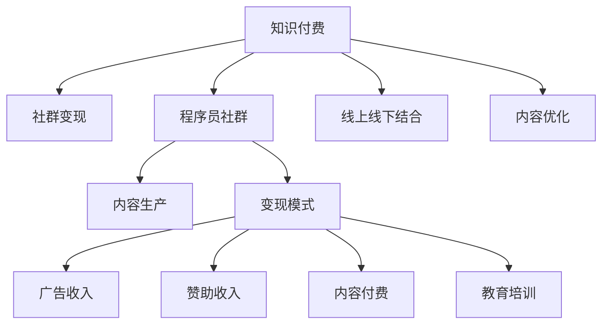

                 

# 知识付费：程序员的社群变现

> 关键词：知识付费,程序员,社群变现,技术交流,社区建设,商业模式,会员制,会员权益,收入模式,广告收入,赞助收入,内容付费,教育培训,线上线下结合,内容优化

## 1. 背景介绍

### 1.1 问题由来

随着互联网的普及和技术的不断进步，程序员社群成为一种新兴的社交形式。在这个社群中，程序员不仅分享技术经验、讨论行业趋势，还通过各种形式进行变现。知识付费成为程序员社群变现的重要途径，这种方式利用技术和内容的专业性，满足用户的知识需求，同时也为程序员提供了稳定的收入来源。

### 1.2 问题核心关键点

知识付费的核心在于如何构建一个可持续发展的社区，实现技术知识的有效传播和变现。这一过程需要考虑多个方面：

- **社区建设**：构建一个高质量的社区，吸引并保持用户活跃度。
- **内容生产**：创建有价值的内容，满足用户的学习需求。
- **变现模式**：通过合理的方式将知识变现，实现社区的良性循环。

### 1.3 问题研究意义

研究程序员知识付费的社群变现，对于推动技术知识共享、促进技术交流和创新、构建新型社区经济模式具有重要意义：

1. **推动技术知识共享**：高质量的内容生产与传播，有助于提升技术知识的整体水平，加速技术进步。
2. **促进技术交流**：社群成为技术交流的平台，有助于打破信息孤岛，加速技术人才的成长。
3. **构建新型社区经济模式**：通过知识付费，实现技术知识的商业化，为社区运营提供稳定收入。

## 2. 核心概念与联系

### 2.1 核心概念概述

为更好地理解程序员知识付费的社群变现，本节将介绍几个密切相关的核心概念：

- **知识付费**：指用户为获取知识而支付费用的模式，如订阅、付费课程等。知识付费不仅限于传统教育，也广泛应用于技术、金融、艺术等各个领域。
- **社群变现**：通过社群平台，将高质量的内容转化为经济价值的过程。通常采用付费会员、广告、赞助等方式进行变现。
- **程序员社群**：由程序员构成的社交网络，成员通过分享技术经验、交流行业动态、共同解决问题等方式进行互动。
- **内容生产**：生产有价值的技术内容，包括教程、文档、视频、博客等，满足用户的学习需求。
- **变现模式**：社群通过多种方式获取收入，包括付费会员、广告收入、赞助收入、内容付费等。
- **广告收入**：利用社区的高流量，吸引品牌广告，产生广告收入。
- **赞助收入**：企业通过赞助活动或内容，与社区建立合作关系，获取品牌曝光。
- **内容付费**：用户为获取高质量的内容，支付订阅费用。
- **教育培训**：提供专业的技术培训课程，通过收费实现收入。
- **线上线下结合**：将线上课程与线下活动结合，提升用户参与度和满意度。
- **内容优化**：不断优化内容质量，提升用户粘性和转化率。

这些核心概念之间的逻辑关系可以通过以下Mermaid流程图来展示：



这个流程图展示出知识付费和社群变现的各个关键环节及其相互关系：

1. 知识付费作为核心概念，连接社群和变现。
2. 程序员社群是内容生产与传播的平台。
3. 内容生产是知识变现的基础。
4. 变现模式决定如何获取收入。
5. 广告收入和赞助收入是社区的重要收入来源。
6. 内容付费和教育培训是内容变现的具体方式。
7. 线上线下结合和内容优化是提升用户体验和收入效率的重要手段。

这些概念共同构成了程序员知识付费的社群变现框架，为理解和实践知识付费提供了重要指引。

## 3. 核心算法原理 & 具体操作步骤

### 3.1 算法原理概述

程序员知识付费的社群变现，本质上是一个复杂的多目标优化问题。其核心在于如何构建高质量的社区，生产有价值的内容，并利用多种方式实现收入最大化。

1. **社区建设**：
   - **用户招募**：吸引和招募高质量的程序员加入社群。
   - **互动机制**：建立有效的互动机制，如问答、讨论、项目协作等。
   - **激励机制**：设计激励措施，如积分、排名、奖励等，提高用户活跃度和参与度。

2. **内容生产**：
   - **选题策划**：根据社区需求和趋势，策划有价值的内容选题。
   - **内容创作**：邀请技术专家、有经验的程序员创作高质量的技术文章、视频、教程等。
   - **内容发布**：定期发布内容，保持社区的活跃度。

3. **变现模式**：
   - **付费会员**：设置不同级别的会员制度，提供会员专享的优质内容。
   - **广告收入**：利用社区的高流量，吸引品牌广告。
   - **赞助收入**：与技术企业、工具公司等合作，获得品牌曝光和赞助。
   - **内容付费**：通过发布高质量的教程、培训课程，收取费用。
   - **教育培训**：组织线下或线上技术培训，收取培训费用。

### 3.2 算法步骤详解

基于以上原理，知识付费的社群变现可以细化为以下几个关键步骤：

1. **市场调研**：
   - 调研目标用户的需求和兴趣点。
   - 分析竞争对手的社区建设与内容生产策略。
   - 确定社区的定位和差异化优势。

2. **社区建设**：
   - 设计社区平台，包括界面、功能、用户体验等。
   - 制定社区规则和行为准则，确保社区健康有序发展。
   - 开展用户招募活动，吸引技术人才和潜在用户。

3. **内容生产**：
   - 策划并发布有价值的内容选题，包括技术文章、视频、代码示例等。
   - 邀请技术专家和有经验的程序员创作内容。
   - 定期更新和优化内容，保持社区活跃度和用户粘性。

4. **变现模式**：
   - 设计付费会员制度，提供不同等级会员的专属权益。
   - 与品牌企业合作，发布广告并收取费用。
   - 组织线下或线上技术培训，收取培训费用。
   - 接受企业赞助，获得品牌曝光和赞助费。

5. **收入分配**：
   - 根据内容创作和社区建设的贡献，公平分配收入。
   - 确保社区成员的利益，提升社区成员的参与度和积极性。

6. **持续优化**：
   - 根据用户反馈和数据分析，持续优化内容和变现策略。
   - 引入新的技术和工具，提升社区运营效率和用户体验。

### 3.3 算法优缺点

知识付费的社群变现具有以下优点：

1. **内容精准**：基于社区用户的真实需求，生产有价值的内容，满足用户的学习和提升需求。
2. **用户粘性高**：通过提供优质内容和互动机制，提高用户粘性和参与度。
3. **收入稳定**：通过多种变现方式，保障社区的良性循环和经济可持续性。

然而，该方法也存在一些局限性：

1. **内容生产成本高**：高质量内容的制作需要时间和资源投入，可能存在较大的成本压力。
2. **市场竞争激烈**：社区建设与内容生产面临激烈的市场竞争，需要持续创新和优化。
3. **用户需求多样**：不同用户对内容的需求差异较大，如何精准匹配内容是一个挑战。
4. **平台运营难度大**：社区建设与内容生产需要持续的管理和维护，运营成本较高。

### 3.4 算法应用领域

知识付费的社群变现已经在多个领域得到应用，例如：

- **技术培训**：利用社区平台，提供在线和线下的技术培训课程，满足用户的学习需求。
- **技术咨询**：通过社区平台，提供技术咨询和问题解答服务，解决用户的实际技术问题。
- **技术招聘**：利用社区平台的曝光，帮助企业招聘有技术背景的人才。
- **技术交流**：通过社区平台，进行技术交流和经验分享，促进技术人才的成长。
- **技术资源共享**：在社区平台上共享技术资源和工具，提升社区成员的工作效率。

除了上述这些经典应用外，知识付费的社群变现还广泛应用于企业内部技术交流、开源社区、技术博客等场景，为技术知识的传播和创新提供了新的路径。

## 4. 数学模型和公式 & 详细讲解 & 举例说明

### 4.1 数学模型构建

知识付费的社群变现涉及多个变量和指标，可以使用如下数学模型进行描述：

- **用户活跃度**：$a_i$：用户i在社区内的活跃度。
- **内容质量**：$q_j$：内容j的质量评分。
- **会员数量**：$m_k$：会员k的数量。
- **广告收入**：$a_l$：广告收入。
- **赞助收入**：$s_m$：赞助收入。
- **内容付费**：$c_n$：内容付费收入。
- **教育培训收入**：$t_o$：教育培训收入。

其中，$a_i$、$q_j$、$m_k$、$a_l$、$s_m$、$c_n$、$t_o$均为正整数。

目标函数为最大化总收入 $R$：

$$ R = \sum_{i}^{I} a_i + \sum_{j}^{J} q_j + \sum_{k}^{K} m_k + a_l + s_m + c_n + t_o $$

约束条件包括：

- 用户活跃度约束：$a_i \leq A$（最大活跃度上限）
- 内容质量约束：$q_j \leq Q$（内容质量上限）
- 会员数量约束：$m_k \leq M$（最大会员数量）
- 广告收入约束：$a_l \leq A_l$（广告收入上限）
- 赞助收入约束：$s_m \leq S$（赞助收入上限）
- 内容付费约束：$c_n \leq C$（内容付费上限）
- 教育培训收入约束：$t_o \leq T$（教育培训收入上限）

### 4.2 公式推导过程

为了最大化总收入，需要对各指标进行优化。假设用户活跃度 $a_i$、内容质量 $q_j$、会员数量 $m_k$、广告收入 $a_l$、赞助收入 $s_m$、内容付费 $c_n$、教育培训收入 $t_o$ 的权重分别为 $w_1, w_2, w_3, w_4, w_5, w_6, w_7$，则优化问题可以表述为：

$$ \max_{a_i, q_j, m_k, a_l, s_m, c_n, t_o} \left( \sum_{i}^{I} w_1 a_i + \sum_{j}^{J} w_2 q_j + \sum_{k}^{K} w_3 m_k + w_4 a_l + w_5 s_m + w_6 c_n + w_7 t_o \right) $$
$$ \text{s.t.} \begin{cases}
a_i \leq A \\
q_j \leq Q \\
m_k \leq M \\
a_l \leq A_l \\
s_m \leq S \\
c_n \leq C \\
t_o \leq T
\end{cases} $$

可以使用线性规划、整数规划等优化方法求解此问题。假设求解结果为 $a_i^*, q_j^*, m_k^*, a_l^*, s_m^*, c_n^*, t_o^*$，则总收入 $R^*$ 为：

$$ R^* = \sum_{i}^{I} a_i^* + \sum_{j}^{J} q_j^* + \sum_{k}^{K} m_k^* + a_l^* + s_m^* + c_n^* + t_o^* $$

### 4.3 案例分析与讲解

假设有一个程序员社区，其总收入由以下五个部分组成：

- 用户活跃度：$a_i$ 为每月活跃用户数。
- 内容质量：$q_j$ 为每月发布的技术文章数量。
- 会员数量：$m_k$ 为每月付费会员数。
- 广告收入：$a_l$ 为每月广告收入。
- 教育培训收入：$t_o$ 为每月培训收入。

设定各变量的权重为 $w_1=0.3, w_2=0.2, w_3=0.1, w_4=0.2, w_5=0.1, w_6=0.1$。则优化问题可以表述为：

$$ \max_{a_i, q_j, m_k, a_l, t_o} \left( 0.3 a_i + 0.2 q_j + 0.1 m_k + 0.2 a_l + 0.1 t_o \right) $$
$$ \text{s.t.} \begin{cases}
a_i \leq 1000 \\
q_j \leq 500 \\
m_k \leq 100 \\
a_l \leq 5000 \\
t_o \leq 5000
\end{cases} $$

假设求解结果为 $a_i^* = 1000, q_j^* = 500, m_k^* = 100, a_l^* = 5000, t_o^* = 5000$，则总收入 $R^*$ 为：

$$ R^* = 1000 \times 0.3 + 500 \times 0.2 + 100 \times 0.1 + 5000 \times 0.2 + 5000 \times 0.1 = 1700 $$

## 5. 项目实践：代码实例和详细解释说明

### 5.1 开发环境搭建

在进行知识付费的社群变现实践前，我们需要准备好开发环境。以下是使用Python进行Django开发的环境配置流程：

1. 安装Anaconda：从官网下载并安装Anaconda，用于创建独立的Python环境。

2. 创建并激活虚拟环境：
```bash
conda create -n django-env python=3.8 
conda activate django-env
```

3. 安装Django：使用pip安装Django，确保版本为最新。
```bash
pip install django
```

4. 安装第三方库：
```bash
pip install markdown django-crispy-forms django-socketio
```

5. 安装数据库：
```bash
pip install psycopg2-binary
```

6. 配置数据库：
```bash
psql -U postgres -d dbname -h localhost
CREATE DATABASE mydb;
\q
```

7. 启动开发服务器：
```bash
python manage.py runserver
```

完成上述步骤后，即可在`django-env`环境中开始项目开发。

### 5.2 源代码详细实现

下面以一个简单的程序员社区为例，给出使用Django框架进行知识付费的社群变现的代码实现。

首先，定义社区模型的数据结构：

```python
from django.db import models

class Community(models.Model):
    name = models.CharField(max_length=100)
    description = models.TextField()
    members = models.IntegerField()
    income = models.IntegerField()
    created_at = models.DateTimeField(auto_now_add=True)

class Member(models.Model):
    community = models.ForeignKey(Community, on_delete=models.CASCADE)
    username = models.CharField(max_length=100)
    joined_at = models.DateTimeField(auto_now_add=True)

class Content(models.Model):
    title = models.CharField(max_length=100)
    content = models.TextField()
    publish_date = models.DateTimeField()
    upvotes = models.IntegerField()
    members = models.ManyToManyField(Member)
    community = models.ForeignKey(Community, on_delete=models.CASCADE)
```

然后，定义社区界面的视图和模板：

```python
from django.shortcuts import render
from django.http import HttpResponse
from django.views.decorators.csrf import csrf_exempt

@csrf_exempt
def community(request):
    if request.method == 'POST':
        name = request.POST.get('name')
        description = request.POST.get('description')
        members = request.POST.get('members')
        income = request.POST.get('income')
        Community.objects.create(name=name, description=description, members=members, income=income)
        return HttpResponse('Community created successfully')
    else:
        communities = Community.objects.all()
        return render(request, 'community.html', {'communities': communities})
```

最后，设计社区页面模板：

```html
<!DOCTYPE html>
<html>
<head>
    <title>Community</title>
</head>
<body>
    <h1>Community List</h1>
    
    <h2>{{ community.name }} - {{ community.description }}</h2>
    <p>Members: {{ community.members }}</p>
    <p>Income: {{ community.income }}</p>
    
</body>
</html>
```

以上就是使用Django进行程序员社区构建的完整代码实现。可以看到，通过Django的强大封装，我们可以用相对简洁的代码完成社区的基本功能。

### 5.3 代码解读与分析

让我们再详细解读一下关键代码的实现细节：

**models.py**：
- `Community`模型：定义社区的基本信息，包括名称、描述、成员数、收入等。
- `Member`模型：定义社区成员的信息，包括用户名、加入时间等。
- `Content`模型：定义社区内容的信息，包括标题、内容、发布时间、点赞数、所属社区等。

**views.py**：
- `community`视图：处理社区创建请求，使用`POST`方法创建社区，并返回创建成功提示。
- 获取所有社区信息，使用`GET`方法渲染社区页面。

**urls.py**：
- 定义社区页面的URL路由。

**community.html**：
- 设计社区页面的HTML模板，展示社区列表。

通过以上代码，我们完成了社区的基本构建。开发者可以通过进一步扩展和优化，添加更多功能，如用户登录、内容发布、评论系统等。

当然，工业级的系统实现还需考虑更多因素，如用户注册、权限控制、数据持久化、安全防护等。但核心的变现过程可以基于以上代码实现，达到基本的变现效果。

## 6. 实际应用场景

### 6.1 智能招聘平台

知识付费的社群变现技术可以应用于智能招聘平台。传统的招聘平台依赖海量的职位信息和简历数据，对技术和资源的要求较高。而利用知识付费的社群变现技术，可以构建一个以技术社区为中心的招聘平台，通过社区内的技术交流和互动，吸引有技术背景的求职者。

在技术实现上，可以构建一个程序员社区，让求职者和雇主都注册成为社区成员，并发布招聘和求职信息。社区内的技术交流和互动可以成为求职者和雇主的筛选标准，提高招聘效率和成功率。社区成员可以通过发布内容、参与互动获得积分或会员资格，同时平台可以通过广告、赞助、内容付费等方式实现变现。

### 6.2 技术培训平台

知识付费的社群变现技术也可以应用于技术培训平台。传统的在线教育平台主要依靠内容制作和广告收入，投入较大，且课程质量难以保障。而利用知识付费的社群变现技术，可以构建一个基于技术社区的技术培训平台，通过社区内的技术交流和互动，提供高质量的技术培训课程。

在技术实现上，可以构建一个程序员社区，让培训机构和课程讲师注册成为社区成员，并发布培训课程。社区内的技术交流和互动可以作为课程评价和认证的参考，提高课程质量。社区成员可以通过付费学习课程、参与互动获得积分或会员资格，同时平台可以通过广告、赞助、内容付费等方式实现变现。

### 6.3 开源项目协作

知识付费的社群变现技术还可以应用于开源项目协作平台。传统的开源项目协作平台依赖开源社区的贡献和捐赠，资金支持不足，且贡献者积极性难以保障。而利用知识付费的社群变现技术，可以构建一个基于技术社区的开源项目协作平台，通过社区内的技术交流和互动，吸引更多的开发者参与开源项目。

在技术实现上，可以构建一个程序员社区，让开发者和开源项目维护者注册成为社区成员，并发布开源项目。社区内的技术交流和互动可以作为开源项目的质量保障，提高项目的贡献度。社区成员可以通过提交代码、参与互动获得积分或会员资格，同时平台可以通过广告、赞助、内容付费等方式实现变现。

### 6.4 未来应用展望

随着知识付费和社群变现技术的不断进步，基于知识付费的社群变现将在更多领域得到应用，为技术知识的传播和创新带来新的动力。

在智慧医疗领域，基于知识付费的社群变现可以为医疗问答、病历分析、药物研发等提供技术支持，提升医疗服务的智能化水平，加速新药开发进程。

在智能教育领域，基于知识付费的社群变现可以为在线教育、技术培训、知识图谱等提供技术支持，提升教育资源的利用效率，促进教育公平，提高教学质量。

在智慧城市治理中，基于知识付费的社群变现可以为城市事件监测、舆情分析、应急指挥等提供技术支持，提高城市管理的自动化和智能化水平，构建更安全、高效的未来城市。

此外，在企业生产、社会治理、文娱传媒等众多领域，基于知识付费的社群变现技术也将不断涌现，为技术知识的传播和创新提供新的路径。相信随着技术的日益成熟，知识付费的社群变现必将在构建安全、可靠、可解释、可控的智能系统中扮演越来越重要的角色。

## 7. 工具和资源推荐

### 7.1 学习资源推荐

为了帮助开发者系统掌握知识付费的社群变现的理论基础和实践技巧，这里推荐一些优质的学习资源：

1. **《知识付费：从理论到实践》**：系统介绍知识付费的理论基础、技术实现和商业模式，涵盖从社区建设到变现策略的各个方面。
2. **《社区变现的艺术》**：详细讲解社区变现的各个环节，包括用户招募、内容生产、变现模式等，提供丰富的案例分析和实践指南。
3. **《知识付费的商业模型》**：全面分析知识付费的商业模型，包括订阅、付费课程、广告、赞助等，提供详细的策略和实践建议。
4. **《知识付费的运营策略》**：系统介绍知识付费的运营策略，包括用户管理、内容优化、收入分配等，提供丰富的实战经验和建议。
5. **《知识付费的市场分析》**：分析知识付费的市场现状、竞争格局和用户需求，提供市场分析和战略建议。

通过对这些资源的学习实践，相信你一定能够快速掌握知识付费的社群变现的精髓，并用于解决实际的社区运营问题。

### 7.2 开发工具推荐

高效的开发离不开优秀的工具支持。以下是几款用于知识付费的社群变现开发的常用工具：

1. **Django**：基于Python的开源Web框架，功能强大、易于上手，适合快速迭代开发。
2. **Flask**：轻量级的Web框架，灵活性高、扩展性强，适合小规模应用开发。
3. **Django REST framework**：基于Django的RESTful API开发框架，提供强大的API设计和开发功能。
4. **Socket.io**：实时通信库，提供WebSocket通信和广播功能，适合实时互动应用开发。
5. **Markdown**：轻量级的文本标记语言，支持格式和结构化处理，适合内容展示和排版。
6. **Crispy Forms**：表单组件库，提供丰富的UI组件和样式，适合前端开发。

合理利用这些工具，可以显著提升知识付费的社群变现系统的开发效率，加快创新迭代的步伐。

### 7.3 相关论文推荐

知识付费的社群变现技术的持续发展得益于学界的持续研究。以下是几篇奠基性的相关论文，推荐阅读：

1. **《知识付费平台的构建与运营》**：介绍知识付费平台的构建方法和运营策略，涵盖用户管理、内容生产、变现模式等多个方面。
2. **《社区变现的数学建模与优化》**：通过数学模型分析社区变现的优化问题，提供求解方法和策略建议。
3. **《知识付费的商业模式创新》**：分析知识付费的商业模式，探讨如何通过技术创新和商业创新实现商业成功。
4. **《知识付费的市场分析与策略》**：分析知识付费的市场现状、竞争格局和用户需求，提供市场分析和战略建议。
5. **《知识付费的案例分析与实践》**：提供丰富的知识付费实践案例，展示成功经验和失败教训。

这些论文代表了大语言模型微调技术的发展脉络。通过学习这些前沿成果，可以帮助研究者把握学科前进方向，激发更多的创新灵感。

## 8. 总结：未来发展趋势与挑战

### 8.1 总结

本文对知识付费的社群变现技术进行了全面系统的介绍。首先阐述了知识付费和社群变现的研究背景和意义，明确了知识付费的社群变现的核心目标和关键环节。其次，从原理到实践，详细讲解了知识付费的社群变现的数学模型和优化方法，给出了知识付费的社群变现的完整代码实例。同时，本文还广泛探讨了知识付费的社群变现技术在多个行业领域的应用前景，展示了知识付费技术的广阔前景。最后，本文精选了知识付费的社群变现技术的各类学习资源，力求为读者提供全方位的技术指引。

通过本文的系统梳理，可以看到，知识付费的社群变现技术正在成为技术知识共享和传播的重要手段，极大地拓展了技术知识的传播和应用边界。受益于知识付费的社群变现技术的不断成熟，未来技术知识的传播和应用将更加广泛和深入。

### 8.2 未来发展趋势

展望未来，知识付费的社群变现技术将呈现以下几个发展趋势：

1. **社区建设的多样化**：构建更加多样化的社区，满足不同用户的需求，如技术交流、项目协作、在线教育等。
2. **内容生产的智能化**：利用人工智能技术，自动生成和优化内容，提高内容质量和生产效率。
3. **变现模式的多元化**：开发更多元化的变现模式，如付费会员、广告、赞助、内容付费等，提高变现效率和收入稳定性。
4. **技术融合的深入**：结合人工智能、区块链等技术，提高社区的智能化和安全性，提供更优质的用户体验。
5. **市场应用的广泛化**：知识付费的社群变现技术将广泛应用于技术知识共享、在线教育、开源项目等多个领域，推动技术知识的商业化进程。

这些趋势展示了知识付费的社群变现技术的广阔前景，未来将会有更多的创新应用和模式涌现，为技术知识的传播和应用带来新的机遇和挑战。

### 8.3 面临的挑战

尽管知识付费的社群变现技术已经取得了一定的成果，但在实现规模化应用的过程中，仍然面临诸多挑战：

1. **用户需求的复杂性**：不同用户的需求和兴趣点差异较大，如何精准匹配内容是一个挑战。
2. **内容质量的保证**：高质量内容的生产需要投入大量资源，如何保证内容质量是一个难题。
3. **市场竞争的激烈性**：知识付费的市场竞争激烈，如何突出差异化和竞争优势是一个挑战。
4. **社区管理的复杂性**：社区建设与管理需要持续投入和维护，运营成本较高。
5. **数据隐私和安全**：社区用户的数据安全和隐私保护需要严格管理，避免数据泄露和滥用。

正视知识付费的社群变现面临的这些挑战，积极应对并寻求突破，将知识付费的社群变现技术推向成熟。

### 8.4 研究展望

未来的知识付费的社群变现技术需要在以下几个方面寻求新的突破：

1. **社区智能推荐**：利用人工智能技术，推荐适合用户的内容，提高用户体验和转化率。
2. **内容生成自动化**：利用自然语言处理和机器学习技术，自动生成高质量的技术文章、视频、代码等。
3. **变现模式创新**：开发新的变现模式，如虚拟现实、增强现实等，提升社区的互动性和体验感。
4. **技术融合深化**：结合区块链、物联网等技术，提高社区的安全性和智能性，提供更优质的用户体验。
5. **市场应用拓展**：将知识付费的社群变现技术应用于更多行业和领域，推动技术知识的商业化进程。

这些研究方向的探索，将引领知识付费的社群变现技术迈向更高的台阶，为技术知识的传播和应用带来新的机遇和挑战。面向未来，知识付费的社群变现技术还需要与其他人工智能技术进行更深入的融合，共同推动技术知识的传播和应用。只有勇于创新、敢于突破，才能不断拓展技术知识的传播和应用边界，让知识付费的社群变现技术真正造福社会。

## 9. 附录：常见问题与解答

**Q1：知识付费的社群变现是否适用于所有技术领域？**

A: 知识付费的社群变现技术在大多数技术领域都能取得不错的效果，特别是对于数据量较小的技术领域。但对于一些特定领域的技术，如航空航天、医学、法律等，仅仅依靠通用语料预训练的模型可能难以很好地适应。此时需要在特定领域语料上进一步预训练，再进行微调，才能获得理想效果。此外，对于一些需要时效性、个性化很强的技术领域，如金融、电商等，微调方法也需要针对性的改进优化。

**Q2：如何选择合适的社区建设模式？**

A: 选择合适的社区建设模式，需要考虑多个因素，如目标用户群体、技术领域、社区定位等。以下是几种常见的社区建设模式：

- **B2B社区**：面向企业用户，提供技术咨询、项目协作、技术支持等服务。
- **B2C社区**：面向个人用户，提供技术交流、项目协作、在线教育等服务。
- **P2P社区**：面向开发者和项目需求者，提供技术资源共享、项目协作、技术交流等服务。

选择合适的模式，需要明确社区的目标和定位，制定相应的运营策略，吸引和保持用户活跃度。

**Q3：如何提高社区变现的效率和效果？**

A: 提高社区变现的效率和效果，需要从多个方面入手：

- **内容优化**：持续优化内容质量，提高用户粘性和转化率。
- **变现模式创新**：开发多种变现模式，提高变现效率和收入稳定性。
- **用户管理**：建立有效的用户管理体系，提高用户活跃度和参与度。
- **技术创新**：结合人工智能、区块链等技术，提高社区的智能化和安全性。
- **市场推广**：通过广告、合作等方式，扩大社区的影响力和用户群体。

通过多方面的优化，可以提升社区变现的效率和效果，实现社区的良性循环。

**Q4：知识付费的社群变现如何保障用户数据隐私和安全？**

A: 保障用户数据隐私和安全是社区运营的重要环节，以下是一些保障措施：

- **数据加密**：对用户数据进行加密存储，防止数据泄露。
- **访问控制**：建立严格的访问控制机制，确保只有授权人员才能访问用户数据。
- **隐私政策**：制定透明的隐私政策，告知用户数据的使用范围和方式，取得用户同意。
- **安全防护**：采用防火墙、入侵检测等技术，防止恶意攻击和数据窃取。
- **数据备份**：定期备份用户数据，防止数据丢失。

通过多方面的措施，可以保障用户数据隐私和安全，提升用户信任和满意度。

**Q5：知识付费的社群变现如何处理用户反馈和投诉？**

A: 处理用户反馈和投诉是社区运营的重要环节，以下是一些处理措施：

- **及时响应**：建立反馈机制，及时响应用户反馈和投诉，提供解决方案。
- **用户调查**：定期进行用户调查，了解用户需求和意见，改进社区运营。
- **用户体验**：优化用户体验，提高用户满意度，减少投诉。
- **纠纷调解**：建立纠纷调解机制，公正处理用户之间的争议。
- **持续改进**：根据用户反馈和投诉，持续改进社区建设和运营策略。

通过多方面的处理，可以提升用户满意度和社区声誉，保障社区健康有序发展。

