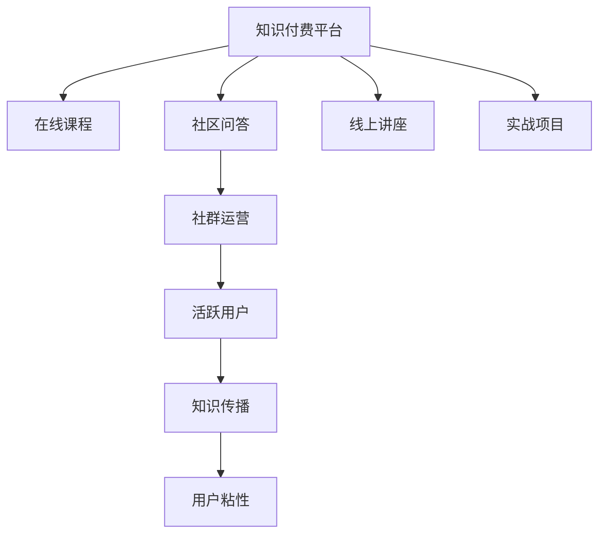

                 

# 知识付费：程序员的社群运营技巧

## 1. 背景介绍

随着互联网技术的飞速发展，知识付费市场也迎来了爆发式增长。程序员作为技术类人才的核心群体，其教育和培训需求尤为旺盛，也成为了知识付费平台的重要用户。然而，传统的在线教育模式存在诸多不足，如缺乏互动、难以形成长期用户粘性等。因此，知识付费平台的社群运营技巧变得尤为重要。

## 2. 核心概念与联系

### 2.1 核心概念概述

知识付费平台通常由在线课程、社区问答、线上讲座、实战项目等组成。其中，社区问答和线上讲座是用户互动的重要环节。社群运营的目的是在平台上构建活跃的社群氛围，促进知识传播和用户留存。

以下是几个关键概念：

- **知识付费平台**：提供线上课程和讲座、社区问答、实战项目等内容的在线服务平台。
- **社群**：基于同一兴趣或学习目标的在线用户群体。
- **用户粘性**：用户对平台的持续使用度和忠诚度。
- **知识传播**：将课程内容通过互动形式在社群中传播。

### 2.2 核心概念原理和架构的 Mermaid 流程图

## 3. 核心算法原理 & 具体操作步骤

### 3.1 算法原理概述

知识付费平台的社群运营策略主要基于用户行为分析和互动反馈。其核心思想是通过数据分析，识别用户需求，并通过互动机制，增强用户粘性。

以下是几个关键步骤：

1. **用户行为分析**：通过记录和分析用户的行为数据，如课程浏览、讲座参与度、问题提问等，理解用户的兴趣和需求。
2. **互动机制设计**：根据用户行为，设计互动机制，如论坛讨论、实时问答、直播讲座等，增强用户间的互动。
3. **激励机制设计**：引入积分、徽章、优惠券等激励机制，鼓励用户积极参与社群活动。
4. **内容推荐**：基于用户行为数据，推荐相关课程和讲座，增加用户粘性。

### 3.2 算法步骤详解

#### 3.2.1 用户行为数据分析

**数据收集**：
- 用户浏览记录：记录用户访问课程页面、观看讲座视频等行为。
- 用户互动记录：记录用户在社区中的提问、回答、评论等互动行为。

**数据处理**：
- 数据清洗：去除异常数据、噪声数据，保留有效数据。
- 数据转换：将行为数据转换为数值型特征，如浏览时长、问题数量等。
- 数据整合：将不同来源的数据进行整合，形成完整的用户行为数据集。

**数据分析**：
- 用户兴趣分析：通过聚类算法，识别用户兴趣群组，如编程语言、技术栈等。
- 用户需求识别：通过关联规则挖掘，发现用户行为中的潜在需求，如某一课程的观看量突然增加。

#### 3.2.2 互动机制设计

**论坛讨论**：
- 引入论坛功能，支持用户在课程页面下留言互动。
- 使用爬虫技术，实时监控论坛讨论，提取有用信息。

**实时问答**：
- 集成在线聊天功能，支持用户实时提问和回答。
- 使用NLP技术，自动匹配相关问题，提供知识推荐。

**直播讲座**：
- 安排专家定期进行在线讲座，提升用户参与度。
- 实时直播并回放，方便用户随时观看。

#### 3.2.3 激励机制设计

**积分系统**：
- 根据用户互动行为，如提问、回答、分享等，给予积分奖励。
- 积分可兑换课程、优惠券等。

**徽章系统**：
- 根据用户成就，如获得某课程证书、回答问题质量高等，发放徽章。
- 徽章可在用户个人资料中展示，提升用户荣誉感。

**优惠券系统**：
- 定期推出优惠券，鼓励用户购买课程。
- 设置限时抢购，增加用户紧迫感。

#### 3.2.4 内容推荐

**协同过滤**：
- 基于用户行为数据，推荐相关课程和讲座。
- 可以使用协同过滤算法，找到兴趣相似的用户，推荐其喜欢的课程。

**内容相似性度量**：
- 使用文本相似度、标签关联度等指标，度量课程内容相似性。
- 基于相似性度量，推荐最相关的课程。

### 3.3 算法优缺点

#### 3.3.1 优点

1. **提升用户粘性**：通过互动机制和激励机制，提升用户对平台的持续使用度。
2. **促进知识传播**：实时问答、论坛讨论等机制，促进知识的交流和传播。
3. **提高课程完成率**：用户互动和激励机制，可以降低课程流失率，提高课程完成率。

#### 3.3.2 缺点

1. **数据隐私问题**：用户行为数据的收集和使用需要严格遵守隐私法规，避免数据泄露。
2. **算法复杂度**：用户行为分析、内容推荐等算法复杂度较高，需要高效的计算和存储支持。
3. **运营成本高**：专家讲座、社区运营等需要较高的人力和物力投入，运营成本较高。

### 3.4 算法应用领域

知识付费平台的社群运营策略广泛应用于教育培训、技术交流、职业发展等多个领域。以下是几个典型应用场景：

- **编程教育**：如Coursera、Udacity等，通过社群互动，提升编程技能。
- **职业发展**：如LinkedIn Learning、Pluralsight等，提供职业发展相关的课程和讲座。
- **技术交流**：如Stack Overflow、GitHub等，提供技术社区和实时问答。

## 4. 数学模型和公式 & 详细讲解

### 4.1 数学模型构建

知识付费平台的社群运营策略主要基于用户行为数据和互动数据，构建用户兴趣图和行为预测模型。

**用户兴趣图**：
- 用户-课程关联矩阵：记录用户对不同课程的访问次数和互动次数。
- 课程-课程关联矩阵：记录不同课程之间的关联度，如标签关联、内容相似度等。

**行为预测模型**：
- 用户行为预测：使用随机森林、梯度提升树等算法，预测用户是否完成某课程。
- 课程推荐模型：使用协同过滤算法，推荐相关课程。

### 4.2 公式推导过程

**用户行为预测模型**：
设用户 $u$ 完成课程 $c$ 的概率为 $p(u,c)$，则预测模型可以表示为：

$$
p(u,c) = f(\mathbf{x}_u, \mathbf{x}_c)
$$

其中，$\mathbf{x}_u$ 为用户行为特征，$\mathbf{x}_c$ 为课程特征。$f$ 为预测函数，可以使用线性回归、逻辑回归、神经网络等。

**协同过滤算法**：
协同过滤算法可以根据用户行为数据和课程标签，计算用户 $u$ 和课程 $c$ 的相似度 $sim(u,c)$，从而推荐相关课程：

$$
sim(u,c) = \frac{\sum_{i=1}^{n} x_{ui} \times x_{ci}}{\sqrt{\sum_{i=1}^{n} x_{ui}^2} \times \sqrt{\sum_{i=1}^{n} x_{ci}^2}}
$$

其中，$x_{ui}$ 为用户 $u$ 对课程 $i$ 的评分，$x_{ci}$ 为课程 $i$ 的标签向量。

### 4.3 案例分析与讲解

以Coursera平台为例，其社区运营策略包括：

- **用户行为数据分析**：通过分析用户观看课程时长、提交作业情况等行为数据，识别出热门课程和用户兴趣点。
- **互动机制设计**：通过课程讨论区、在线问答等机制，增强用户互动，促进知识传播。
- **激励机制设计**：发放课程证书、积分奖励等，激励用户积极参与学习。
- **内容推荐**：基于用户兴趣图和行为预测模型，推荐相关课程和讲座。

## 5. 项目实践：代码实例和详细解释说明

### 5.1 开发环境搭建

#### 5.1.1 服务器搭建

**服务器配置**：
- 推荐使用亚马逊AWS或阿里云等云服务平台，搭建高可用性的服务器环境。
- 配置至少4核CPU、16GB内存，支持高并发访问。

**开发环境配置**：
- 安装Python 3.8及以上版本。
- 安装Numpy、Pandas、Scikit-learn等常用数据科学库。
- 安装Flask、TensorFlow等后端开发库。

### 5.2 源代码详细实现

#### 5.2.1 用户行为数据收集

**数据收集模块**：
- 使用Flask框架，实现API接口，接收用户行为数据。
- 使用Web爬虫，从论坛、讲座页面抓取互动数据。

**数据清洗模块**：
- 使用Pandas库，对数据进行清洗和预处理。
- 去除异常数据、噪声数据，保留有效数据。

**数据整合模块**：
- 使用Apache Kafka等消息队列，实时接收用户行为数据。
- 使用Hadoop或Spark等大数据处理框架，将不同来源的数据进行整合。

#### 5.2.2 用户兴趣图构建

**用户-课程关联矩阵构建**：
- 使用Pandas库，记录用户对不同课程的访问次数和互动次数。
- 构建稀疏矩阵，使用Scipy库进行矩阵运算。

**课程-课程关联矩阵构建**：
- 使用Scikit-learn库，提取课程标签和内容特征。
- 计算课程之间的相似度，构建课程关联矩阵。

#### 5.2.3 行为预测模型训练

**用户行为预测模型训练**：
- 使用Scikit-learn库，训练随机森林或梯度提升树模型。
- 使用交叉验证和网格搜索，优化模型参数。

**协同过滤算法实现**：
- 使用Scipy库，实现协同过滤算法，计算用户-课程相似度。
- 使用Flask框架，将协同过滤算法封装成API服务。

### 5.3 代码解读与分析

#### 5.3.1 数据收集模块

**数据收集API实现**：
- 使用Flask框架，实现API接口，接收用户行为数据。
- 定义路由，接受POST请求，获取请求体中的行为数据。
- 使用JSON库，将数据转换成JSON格式，进行存储。

**Web爬虫实现**：
- 使用BeautifulSoup库，从论坛、讲座页面抓取互动数据。
- 定义爬虫函数，使用多线程技术，加快数据收集速度。

#### 5.3.2 数据清洗模块

**数据清洗函数实现**：
- 使用Pandas库，对数据进行清洗和预处理。
- 去除异常数据、噪声数据，保留有效数据。

**数据整合函数实现**：
- 使用Apache Kafka等消息队列，实时接收用户行为数据。
- 使用Hadoop或Spark等大数据处理框架，将不同来源的数据进行整合。

#### 5.3.3 行为预测模型训练

**用户行为预测模型训练函数实现**：
- 使用Scikit-learn库，训练随机森林或梯度提升树模型。
- 使用交叉验证和网格搜索，优化模型参数。

**协同过滤算法实现函数**：
- 使用Scipy库，实现协同过滤算法，计算用户-课程相似度。
- 使用Flask框架，将协同过滤算法封装成API服务。

### 5.4 运行结果展示

#### 5.4.1 用户行为数据分析结果展示

**用户兴趣分析**：
- 使用聚类算法，识别用户兴趣群组。
- 展示用户兴趣图，分析用户兴趣分布。

**用户需求识别**：
- 使用关联规则挖掘，发现用户行为中的潜在需求。
- 展示关联规则结果，分析用户需求变化。

#### 5.4.2 内容推荐结果展示

**课程推荐结果**：
- 使用协同过滤算法，推荐相关课程。
- 展示课程推荐结果，分析推荐效果。

**讲座推荐结果**：
- 使用行为预测模型，预测用户对讲座的兴趣。
- 展示讲座推荐结果，分析推荐效果。

## 6. 实际应用场景

### 6.1 教育培训

**编程教育**：
- 如Coursera、Udacity等，通过社群互动，提升编程技能。
- 通过互动机制和激励机制，提升用户对平台的持续使用度。

**职业发展**：
- 如LinkedIn Learning、Pluralsight等，提供职业发展相关的课程和讲座。
- 通过实时问答、论坛讨论等机制，增强用户互动，促进知识传播。

### 6.2 技术交流

**技术社区**：
- 如Stack Overflow、GitHub等，提供技术社区和实时问答。
- 通过专家讲座、在线问答等机制，增强用户互动，促进知识传播。

### 6.3 职业发展

**职业发展平台**：
- 如Coursera、Udacity等，提供职业发展相关的课程和讲座。
- 通过互动机制和激励机制，提升用户对平台的持续使用度。

## 7. 工具和资源推荐

### 7.1 学习资源推荐

#### 7.1.1 在线课程推荐

**Coursera**：
- 提供大量编程教育、职业发展相关的课程。
- 提供社群互动功能，增强用户粘性。

**Udacity**：
- 提供大量编程教育、职业发展相关的课程。
- 提供实时问答、论坛讨论等机制，增强用户互动。

#### 7.1.2 技术交流推荐

**Stack Overflow**：
- 提供技术社区和实时问答功能。
- 通过专家讲座、在线问答等机制，增强用户互动。

**GitHub**：
- 提供代码仓库和项目协作功能。
- 通过代码审查、问题讨论等机制，增强用户互动。

### 7.2 开发工具推荐

#### 7.2.1 数据科学工具推荐

**Pandas**：
- 数据清洗和预处理。

**Scikit-learn**：
- 机器学习算法实现。

**Scipy**：
- 矩阵运算和科学计算。

#### 7.2.2 后端开发工具推荐

**Flask**：
- 轻量级Web框架，实现API接口。

**TensorFlow**：
- 深度学习模型实现。

**Apache Kafka**：
- 实时数据流处理。

**Apache Hadoop/Spark**：
- 大数据处理和分布式计算。

### 7.3 相关论文推荐

#### 7.3.1 在线教育推荐

**《The Educational Impact of Online Learning Platforms: A Comprehensive Review》**：
- 一篇对在线教育平台影响进行全面综述的论文，探讨了在线教育平台在用户行为分析、互动机制设计等方面的应用。

**《A Systematic Review of Online Learning Platforms in Professional Development: Challenges and Opportunities》**：
- 一篇对在线学习平台在职业发展领域应用进行系统综述的论文，分析了在线学习平台的优势和挑战。

#### 7.3.2 技术交流推荐

**《Social Learning and Collaboration in Online Communities》**：
- 探讨了在线技术社区中用户互动和知识传播机制的研究。

**《An Overview of Online Learning Platforms in Technical Communities》**：
- 对在线技术社区平台进行了综述，分析了技术社区的特征和应用。

## 8. 总结：未来发展趋势与挑战

### 8.1 总结

本文介绍了知识付费平台中的社群运营技巧，探讨了如何通过用户行为分析和互动机制设计，提升用户粘性和知识传播效果。通过详细分析Coursera等平台的实际应用，展示了社群运营策略的实际效果。此外，本文还介绍了相关学习资源和开发工具，为开发者提供了一站式的解决方案。

### 8.2 未来发展趋势

1. **个性化推荐**：未来，个性化推荐系统将更加智能，根据用户行为和兴趣，实时推送个性化课程和讲座。
2. **实时互动**：通过实时互动机制，如视频会议、实时讨论等，增强用户沉浸感和参与感。
3. **AI辅助运营**：引入AI技术，自动分析用户行为和反馈，优化社群运营策略。
4. **多平台融合**：将知识付费平台与其他社交媒体、视频平台进行融合，形成全渠道互动。

### 8.3 面临的挑战

1. **数据隐私**：用户行为数据的收集和使用需要严格遵守隐私法规，避免数据泄露。
2. **算法复杂度**：用户行为分析、内容推荐等算法复杂度较高，需要高效的计算和存储支持。
3. **运营成本**：专家讲座、社区运营等需要较高的人力和物力投入，运营成本较高。

### 8.4 研究展望

1. **增强互动机制**：开发更多形式的互动机制，如视频会议、实时讨论等，增强用户沉浸感和参与感。
2. **引入AI辅助**：引入AI技术，自动分析用户行为和反馈，优化社群运营策略。
3. **多平台融合**：将知识付费平台与其他社交媒体、视频平台进行融合，形成全渠道互动。
4. **个性化推荐**：引入个性化推荐算法，提升推荐精度和用户粘性。

## 9. 附录：常见问题与解答

### 9.1 常见问题

**Q1：如何提高用户粘性？**

A：通过互动机制和激励机制，如实时问答、积分奖励等，增强用户对平台的持续使用度。

**Q2：如何优化内容推荐？**

A：使用协同过滤算法，结合用户行为数据和课程标签，计算用户-课程相似度，推荐相关课程。

**Q3：如何保障数据隐私？**

A：严格遵守隐私法规，对用户数据进行匿名化处理，使用加密传输和存储技术。

### 9.2 解答

**Q1：如何提高用户粘性？**

A：通过互动机制和激励机制，如实时问答、积分奖励等，增强用户对平台的持续使用度。

**Q2：如何优化内容推荐？**

A：使用协同过滤算法，结合用户行为数据和课程标签，计算用户-课程相似度，推荐相关课程。

**Q3：如何保障数据隐私？**

A：严格遵守隐私法规，对用户数据进行匿名化处理，使用加密传输和存储技术。

---

作者：禅与计算机程序设计艺术 / Zen and the Art of Computer Programming

