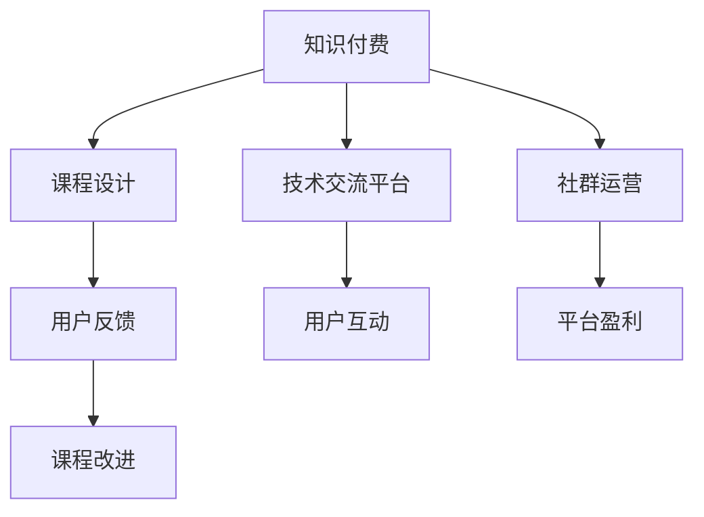

                 

# 知识付费：程序员的社群运营指南

> 关键词：知识付费, 程序员, 社群运营, 课程设计, 技术交流

## 1. 背景介绍

### 1.1 问题由来
随着互联网的快速发展和数字化转型的浪潮，知识付费作为一种新兴的商业模式，正在逐步改变传统的教育和信息获取方式。特别是在技术领域，知识付费的兴起为程序员提供了更多获取高质量技术知识的机会，同时也为技术社区和平台的运营者提供了新的盈利模式。然而，如何高效运营知识付费社群，最大化地挖掘其价值，成为广大社群运营者亟待解决的问题。

### 1.2 问题核心关键点
在知识付费社群运营中，核心关键点在于以下几个方面：
- 如何设计并推出高质量的技术课程，满足用户的学习需求。
- 如何构建活跃的技术交流平台，促进用户之间的互动和分享。
- 如何通过知识付费的方式实现社群的良性循环，提升用户满意度和平台盈利能力。

### 1.3 问题研究意义
研究知识付费和程序员社群运营的策略，对于推动技术社区的健康发展和提升技术学习的质量，具有重要意义：

1. 提升用户学习体验：通过科学的设计和技术交流平台，用户可以更方便地获取和分享知识，提升学习效率。
2. 促进知识传播：高质量的课程和活跃的交流环境，有助于知识的快速传播和创新。
3. 驱动社区发展：良好的运营策略可以吸引更多用户加入社群，形成良性循环，促进社群的长期发展。
4. 提高平台盈利能力：通过合理收费和有效的社群管理，可以实现平台的可持续发展。
5. 推动技术进步：高质量的课程和交流平台有助于新技术的传播和应用，推动技术进步。

## 2. 核心概念与联系

### 2.1 核心概念概述

为更好地理解知识付费和程序员社群运营的理论基础，本节将介绍几个密切相关的核心概念：

- 知识付费：指用户为获取知识或技能而支付的费用，通常以线上课程、电子书、专栏文章等形式呈现。知识付费不仅是一种商业模式，也是一种高效的知识传播方式。
- 程序员社群：由具有相同兴趣和需求的程序员组成的网络社区，通过技术交流、知识分享、项目合作等方式进行互动。
- 课程设计：指设计和开发技术课程的过程，包括确定课程目标、内容、结构、教学方法等。
- 技术交流平台：指提供技术交流、知识分享、问题解答等功能的在线平台，促进程序员之间的互动和合作。
- 用户反馈：指用户对课程和平台的使用体验、满意度等的评价和建议，对于课程设计和平台优化至关重要。

这些核心概念之间的逻辑关系可以通过以下Mermaid流程图来展示：



这个流程图展示了知识付费、课程设计、技术交流平台、用户反馈、社群运营和平台盈利之间的关系：

1. 知识付费推动课程设计和技术交流平台的发展。
2. 高质量的课程和平台促进用户互动和反馈。
3. 用户反馈和互动推动课程改进和平台优化。
4. 高效的社群运营和平台盈利策略实现平台的可持续发展。

## 3. 核心算法原理 & 具体操作步骤

### 3.1 算法原理概述

知识付费和程序员社群运营的核心在于如何高效设计和运营高质量的课程和技术交流平台。其核心思想是：

- 通过课程设计和平台搭建，满足用户的学习需求，提升学习效果。
- 利用技术交流平台促进用户之间的互动和分享，形成良性循环。
- 通过用户反馈和社群运营，不断优化课程和平台，提升用户体验。
- 通过合理的盈利策略，实现平台的长期发展。

形式化地，假设课程设计为 $C$，平台运营为 $P$，用户反馈为 $F$，盈利策略为 $R$。课程设计和平台运营的目标是最小化用户反馈 $F$，同时最大化盈利策略 $R$。

课程设计和平台运营的优化目标可以表示为：

$$
\min_{C,P} F(C,P)
$$

$$
\max_{R} R(C,P,F)
$$

其中 $F$ 是用户反馈函数，$R$ 是盈利策略函数。

### 3.2 算法步骤详解

知识付费和程序员社群运营的一般步骤包括：

**Step 1: 课程设计**
- 确定课程目标和受众群体，如初级程序员、高级开发者等。
- 调研市场需求，选择适合的教学内容，如编程语言、框架、算法等。
- 设计课程结构和教学方法，如视频讲解、实战项目、在线答疑等。
- 开发课程内容和配套资料，如讲义、代码示例、练习题等。

**Step 2: 平台搭建**
- 选择适合的技术栈，如React、Vue、Flask等。
- 开发课程管理和用户管理功能，如注册、登录、课程搜索等。
- 实现课程发布和发布管理，如课程预览、购买、支付等。
- 集成技术交流功能，如论坛、问答、代码分享等。

**Step 3: 用户互动**
- 设计互动形式，如论坛、直播、讨论组等。
- 组织技术交流活动，如技术分享会、编程马拉松等。
- 激励用户参与，如积分系统、奖励机制等。
- 收集用户反馈，如问卷调查、用户评价等。

**Step 4: 用户反馈**
- 分析用户反馈，识别问题点和改进需求。
- 优化课程内容和教学方法，提升学习效果。
- 改进平台功能和使用体验，增强用户满意度。
- 发布更新和改进措施，反馈给用户。

**Step 5: 平台盈利**
- 制定合理的收费策略，如按课程购买、按月订阅等。
- 设计多样化的盈利模式，如广告收入、会员增值服务、企业合作等。
- 分析用户数据，制定精准的市场推广策略。
- 定期评估和调整盈利策略，确保平台可持续运营。

### 3.3 算法优缺点

知识付费和程序员社群运营的算法具有以下优点：

- 高质量的课程和活跃的互动环境，可以大幅提升用户的学习效果。
- 用户反馈机制和平台优化策略，可以不断改进课程和平台，满足用户需求。
- 通过多样化的盈利模式，可以实现平台的可持续发展。

同时，该算法也存在一定的局限性：

- 对课程设计和平台搭建要求较高，需要投入较多时间和资源。
- 用户互动和反馈收集需要持续的维护和管理，成本较高。
- 课程和平台内容的更新和优化，需要及时跟进技术发展，难度较大。
- 盈利模式的确定和调整，需要市场调研和用户数据分析，存在不确定性。

尽管存在这些局限性，但就目前而言，知识付费和程序员社群运营的算法仍是一种有效的商业策略，被广泛应用于技术社区和平台。未来相关研究的重点在于如何进一步降低运营成本，提高课程和平台的质量，同时兼顾用户的个性化需求和平台的盈利目标。

### 3.4 算法应用领域

知识付费和程序员社群运营的算法已经在多个领域得到应用，例如：

- 在线编程教育平台：如Codecademy、LeetCode、Udacity等，通过推出高质量的编程课程和互动平台，吸引用户参与和学习。
- 开源社区：如GitHub、Stack Overflow等，通过提供丰富的技术交流和分享功能，促进开发者之间的互动和合作。
- 技术博客和媒体：如Medium、掘金、知乎等，通过发布高质量的技术文章和课程，吸引用户订阅和阅读。
- 技术培训和咨询公司：如Coursera、Udemy、LinkedIn Learning等，通过设计专业的技术课程和培训方案，满足企业和技术人员的培训需求。

除了上述这些常见应用外，知识付费和程序员社群运营的算法还在更多场景中得到创新性地应用，如企业内训、在线咨询、技术论坛等，为技术学习和社区发展带来了新的突破。随着技术的发展和用户需求的变化，知识付费和程序员社群运营的算法必将进一步拓展其应用范围，为技术学习和社区运营带来更多的创新和机遇。

## 4. 数学模型和公式 & 详细讲解

### 4.1 数学模型构建

本节将使用数学语言对知识付费和程序员社群运营的算法进行更加严格的刻画。

记课程设计为 $C$，平台运营为 $P$，用户反馈为 $F$，盈利策略为 $R$。

假设用户对课程的满意度为 $S(C,P,F)$，课程的观看次数为 $V(C,P,F)$，平台的活跃用户数为 $U(C,P,F)$，平台的日均付费用户数为 $P_{\text{day}}(C,P,F)$。则目标函数可以表示为：

$$
\min_{C,P} F(C,P)
$$

$$
\max_{R} R(C,P,F)
$$

其中 $F$ 是用户反馈函数，$R$ 是盈利策略函数。

### 4.2 公式推导过程

以下我们以编程马拉松活动为例，推导用户互动的数学模型及其梯度计算。

假设编程马拉松活动的参与用户数为 $N$，活动总时间为 $T$，活动质量为 $Q$，活动满意度为 $S$。则活动质量和满意度的关系可以表示为：

$$
Q = f(T,S)
$$

其中 $f$ 为活动质量函数。

用户互动的满意度 $S$ 可以表示为：

$$
S = \alpha Q + \beta N
$$

其中 $\alpha$ 和 $\beta$ 为权重系数。

活动满意度的期望 $E(S)$ 可以表示为：

$$
E(S) = \frac{1}{N} \sum_{i=1}^N S_i
$$

其中 $S_i$ 为第 $i$ 个用户的满意度。

用户互动的目标函数可以表示为：

$$
\min_{N,T} F(N,T) = \min_{N,T} \frac{1}{N} \sum_{i=1}^N (S_i - E(S))^2
$$

通过梯度下降等优化算法，微调参数 $N$ 和 $T$，最小化用户反馈函数 $F(N,T)$，使得活动满意度 $S$ 最大化。

在得到用户反馈函数 $F$ 的梯度后，即可带入梯度下降公式，完成用户互动的迭代优化。重复上述过程直至收敛，最终得到适应用户满意度的编程马拉松活动参数 $N^*$ 和 $T^*$。

## 5. 项目实践：代码实例和详细解释说明

### 5.1 开发环境搭建

在进行知识付费和程序员社群运营的实践前，我们需要准备好开发环境。以下是使用Python进行Django开发的环境配置流程：

1. 安装Anaconda：从官网下载并安装Anaconda，用于创建独立的Python环境。

2. 创建并激活虚拟环境：
```bash
conda create -n django-env python=3.8 
conda activate django-env
```

3. 安装Django：从官网获取对应的安装命令。例如：
```bash
pip install django==3.2.8
```

4. 安装Gunicorn：
```bash
pip install gunicorn==20.1.0
```

5. 安装Django-allauth：
```bash
pip install django-allauth
```

6. 安装pylint、black、flake8：
```bash
pip install pylint black flake8
```

完成上述步骤后，即可在`django-env`环境中开始知识付费和程序员社群运营的实践。

### 5.2 源代码详细实现

下面我们以在线编程教育平台为例，给出使用Django进行知识付费和程序员社群运营的Python代码实现。

首先，定义课程模型和用户模型：

```python
from django.db import models
from django.contrib.auth.models import User

class Course(models.Model):
    title = models.CharField(max_length=100)
    description = models.TextField()
    instructor = models.ForeignKey(User, on_delete=models.CASCADE)
    start_date = models.DateField()
    end_date = models.DateField()
    status = models.CharField(max_length=20)

class User(models.Model):
    email = models.EmailField(unique=True)
    first_name = models.CharField(max_length=30)
    last_name = models.CharField(max_length=30)
    date_joined = models.DateTimeField(auto_now_add=True)
```

然后，定义用户注册和登录视图：

```python
from django.shortcuts import render, redirect
from django.contrib.auth import authenticate, login, logout

def register(request):
    if request.method == 'POST':
        username = request.POST['username']
        email = request.POST['email']
        password = request.POST['password']
        user = User.objects.create_user(username, email, password)
        login(request, user)
        return redirect('home')
    return render(request, 'register.html')

def login_view(request):
    if request.method == 'POST':
        username = request.POST['username']
        password = request.POST['password']
        user = authenticate(request, username=username, password=password)
        if user is not None:
            login(request, user)
            return redirect('home')
    return render(request, 'login.html')

def logout_view(request):
    logout(request)
    return redirect('home')
```

接着，定义课程注册和浏览视图：

```python
from django.shortcuts import render, redirect
from .models import Course

def enroll_course(request, course_id):
    course = Course.objects.get(pk=course_id)
    if request.user in course.students.all():
        return redirect('home')
    course.students.add(request.user)
    return redirect('course_detail', course_id=course_id)

def course_detail(request, course_id):
    course = Course.objects.get(pk=course_id)
    return render(request, 'course_detail.html', {'course': course})
```

最后，定义用户反馈和互动视图：

```python
from django.shortcuts import render, redirect
from .models import Course, Review

def review_course(request, course_id):
    course = Course.objects.get(pk=course_id)
    if request.method == 'POST':
        rating = request.POST['rating']
        comment = request.POST['comment']
        review = Review.objects.create(user=request.user, course=course, rating=rating, comment=comment)
    return redirect('course_detail', course_id=course_id)

def course_feedback(request, course_id):
    course = Course.objects.get(pk=course_id)
    reviews = Review.objects.filter(course=course).order_by('-id')
    return render(request, 'course_feedback.html', {'course': course, 'reviews': reviews})
```

以上就是使用Django进行知识付费和程序员社群运营的完整代码实现。可以看到，通过Django框架，我们可以快速构建和维护一个完整的知识付费和程序员社群运营平台。

### 5.3 代码解读与分析

让我们再详细解读一下关键代码的实现细节：

**Course和User模型**：
- `Course` 模型定义了课程的基本信息，包括课程名称、描述、讲师、开始和结束日期、状态等。
- `User` 模型定义了用户的基本信息，包括用户名、邮箱、姓名、注册时间等。

**注册和登录视图**：
- `register` 视图处理用户注册，将注册信息保存到数据库，并自动登录用户。
- `login_view` 视图处理用户登录，使用`authenticate`方法验证用户名和密码，成功登录后重定向到首页。
- `logout_view` 视图处理用户注销，将用户从系统中注销并重定向到首页。

**课程注册和浏览视图**：
- `enroll_course` 视图处理课程注册，将用户添加到课程的学生列表中。
- `course_detail` 视图显示课程详情，包括课程名称、描述、讲师、开始和结束日期等。

**用户反馈和互动视图**：
- `review_course` 视图处理课程评价，允许用户对课程进行评分和评论，并将评价信息保存到数据库。
- `course_feedback` 视图显示课程的评价信息，按评分从高到低排序。

可以看到，通过Django框架，我们可以快速实现一个完整的知识付费和程序员社群运营平台。开发者可以根据具体需求，进一步扩展和优化平台功能。

## 6. 实际应用场景

### 6.1 在线编程教育平台

在线编程教育平台通过提供高质量的编程课程和互动环境，吸引大量程序员参与学习。平台通过课程注册、课程浏览、课程评价等机制，不断优化课程内容和教学方法，提升用户的学习效果。同时，平台还可以推出编程马拉松、编程竞赛等互动活动，增强用户之间的互动和合作。

### 6.2 开源社区

开源社区通过提供丰富的技术交流和分享功能，吸引大量开发者参与贡献和交流。社区通过技术博客、代码分享、问题解答等机制，促进开发者之间的互动和合作。同时，社区还可以引入编程马拉松、技术沙龙等互动活动，增强社区的活跃度和凝聚力。

### 6.3 技术博客和媒体

技术博客和媒体通过发布高质量的技术文章和课程，吸引大量技术爱好者订阅和阅读。平台通过评论、点赞、分享等机制，增强用户之间的互动和反馈。同时，平台还可以引入技术讨论、编程马拉松等互动活动，提升用户的学习效果和社区的活跃度。

### 6.4 未来应用展望

随着知识付费和程序员社群运营的算法不断发展，未来的应用场景将更加丰富多样。

在智慧城市治理中，知识付费平台可以提供各种智能应用的知识培训，提升城市管理人员的智能化水平，推动智慧城市的发展。

在企业内训中，知识付费平台可以提供定制化的技术课程，满足企业的培训需求，提升企业技术人员的素质和能力。

在在线咨询中，知识付费平台可以提供多种形式的技术咨询服务，解决用户的实际问题，提升用户的满意度。

此外，在更多领域，知识付费和程序员社群运营的应用也将不断涌现，为技术学习和社区运营带来更多的创新和机遇。相信随着技术的不断进步和市场需求的变化，知识付费和程序员社群运营必将在更多领域大放异彩。

## 7. 工具和资源推荐

### 7.1 学习资源推荐

为了帮助开发者系统掌握知识付费和程序员社群运营的理论基础和实践技巧，这里推荐一些优质的学习资源：

1. 《知识付费：从概念到运营》系列博文：由知识付费专家撰写，深入浅出地介绍了知识付费的运营策略和商业模式。

2. 《程序员社群运营实战》课程：由程序员社群运营专家开设的实战课程，详细讲解社群运营的技巧和案例。

3. 《技术博客的商业化运营》书籍：由技术博客运营专家所著，全面介绍了技术博客的运营策略和盈利模式。

4. 《开源社区的治理与运营》书籍：由开源社区运营专家所著，详细讲解开源社区的治理和运营策略。

5. GitHub社区：全球最大的开源社区，提供丰富的技术交流和学习资源，是程序员社群运营的优秀案例。

通过对这些资源的学习实践，相信你一定能够快速掌握知识付费和程序员社群运营的精髓，并用于解决实际的业务问题。

### 7.2 开发工具推荐

高效的开发离不开优秀的工具支持。以下是几款用于知识付费和程序员社群运营开发的常用工具：

1. Django：由Python社区开发的开源Web框架，易于上手、功能强大，适合构建复杂的技术平台。

2. Flask：轻量级的Python Web框架，适用于快速开发小型技术平台。

3. GitLab：基于Git版本控制系统的项目管理平台，提供丰富的技术交流和协作功能。

4. GitHub：全球最大的开源代码托管平台，提供丰富的代码分享和版本控制功能。

5. GitKraken：跨平台的Git客户端，支持复杂的项目管理和代码审查功能。

合理利用这些工具，可以显著提升知识付费和程序员社群运营的开发效率，加快创新迭代的步伐。

### 7.3 相关论文推荐

知识付费和程序员社群运营的研究源于学界的持续研究。以下是几篇奠基性的相关论文，推荐阅读：

1. "Knowledge-Paying as a New Era in Education"：探讨知识付费在教育领域的应用和挑战。

2. "Community Building in Open Source"：介绍开源社区的治理和运营策略。

3. "Learning and Sharing in Online Education"：研究在线教育平台的知识传播和用户互动机制。

4. "Content Generation and Revenue Model in Knowledge-Paying"：探讨知识付费平台的盈利模式和内容生成策略。

5. "AI in Knowledge-Paying Platforms"：研究人工智能技术在知识付费平台中的应用。

这些论文代表了大数据时代知识付费和程序员社群运营的研究脉络。通过学习这些前沿成果，可以帮助研究者把握学科前进方向，激发更多的创新灵感。

## 8. 总结：未来发展趋势与挑战

### 8.1 总结

本文对知识付费和程序员社群运营的算法进行了全面系统的介绍。首先阐述了知识付费和程序员社群运营的研究背景和意义，明确了平台运营的目标和关键点。其次，从原理到实践，详细讲解了知识付费和程序员社群运营的数学模型和操作步骤，给出了平台开发和运营的完整代码实例。同时，本文还广泛探讨了知识付费和程序员社群运营在多个行业领域的应用前景，展示了其广阔的发展潜力。此外，本文精选了知识付费和程序员社群运营的学习资源，力求为读者提供全方位的技术指引。

通过本文的系统梳理，可以看到，知识付费和程序员社群运营的算法正在成为技术社区和平台的重要运营范式，极大地提升了技术学习的质量和效率，推动了技术社区的健康发展。未来，伴随技术的发展和市场需求的变化，知识付费和程序员社群运营必将在更多领域大放异彩，为技术学习和社区运营带来更多的创新和机遇。

### 8.2 未来发展趋势

展望未来，知识付费和程序员社群运营的算法将呈现以下几个发展趋势：

1. 课程和平台内容的个性化定制。通过数据分析和机器学习技术，提供更符合用户需求和偏好的个性化课程和平台内容，提升用户的学习效果和满意度。

2. 技术交流和互动的多样化。通过引入在线讨论、直播、编程马拉松等多样化的互动形式，增强用户之间的交流和合作，提升社区的活跃度和凝聚力。

3. 知识付费模式的创新。通过引入订阅服务、按需课程、社区贡献等方式，实现知识的持续传播和价值的最大化利用。

4. 平台的智能化和自动化。通过引入人工智能技术，如自然语言处理、计算机视觉等，提升平台的智能化水平，提供更加便捷和高效的服务。

5. 跨平台和跨领域的融合。通过与其他技术和平台的融合，提供更加全面和多样化的服务，提升用户的整体体验。

以上趋势凸显了知识付费和程序员社群运营的算法在未来的广阔前景。这些方向的探索发展，必将进一步提升平台的用户体验和运营效率，为技术学习和社区运营带来更多的创新和机遇。

### 8.3 面临的挑战

尽管知识付费和程序员社群运营的算法已经取得了瞩目成就，但在迈向更加智能化、普适化应用的过程中，它仍面临着诸多挑战：

1. 用户需求的动态变化。用户需求和偏好的快速变化，要求平台能够及时更新和调整课程内容，以满足用户的最新需求。这对平台的灵活性和响应速度提出了较高要求。

2. 课程和平台质量的提升。高质量的课程和平台是知识付费和程序员社群运营的核心。如何不断提升课程和平台的质量，使其更具吸引力和实用性，是平台运营的关键挑战。

3. 技术交流和互动的深度。用户之间深度交流和互动是社区的核心价值之一。如何设计有效的交流和互动机制，促进用户之间的分享和合作，是社区运营的重要课题。

4. 平台的盈利模式。平台的盈利模式需要兼顾用户需求和平台运营的成本，找到最佳的平衡点。如何设计合理的盈利模式，实现平台的可持续发展，是平台运营的长期挑战。

5. 数据和隐私保护。知识付费和程序员社群运营需要大量的用户数据支持，如何保护用户隐私和数据安全，是平台运营的重要责任。

这些挑战需要平台运营者不断探索和优化，才能实现知识付费和程序员社群运营的可持续发展。

### 8.4 研究展望

面对知识付费和程序员社群运营所面临的挑战，未来的研究需要在以下几个方面寻求新的突破：

1. 知识图谱与个性化推荐。通过引入知识图谱技术，构建用户知识模型，提供更加个性化的课程推荐和内容推送。

2. 用户行为分析与预测。通过数据分析技术，预测用户行为和需求，优化课程和平台的内容和功能，提升用户满意度。

3. 社区治理与激励机制。通过设计有效的社区治理和激励机制，提升用户的参与度和活跃度，促进社区的健康发展。

4. 多模态交互与融合。通过引入多模态交互技术，如语音、视频等，提升平台的智能化水平，提供更加丰富和高效的服务。

5. 跨领域知识传播。通过与其他领域知识的融合，提升平台的知识广度和深度，提供更加全面和多样化的服务。

这些研究方向的探索，必将引领知识付费和程序员社群运营技术迈向更高的台阶，为构建安全、可靠、可解释、可控的智能系统铺平道路。面向未来，知识付费和程序员社群运营技术还需要与其他人工智能技术进行更深入的融合，如知识表示、因果推理、强化学习等，多路径协同发力，共同推动知识付费和程序员社群运营的发展。只有勇于创新、敢于突破，才能不断拓展知识付费和程序员社群运营的边界，让智能技术更好地造福人类社会。

## 9. 附录：常见问题与解答

**Q1：知识付费平台如何吸引用户？**

A: 知识付费平台的吸引力主要在于其提供的高质量课程和良好的用户体验。具体措施包括：
1. 推出高性价比的课程，满足不同用户的学习需求。
2. 设计简洁易用的平台界面，提升用户的使用体验。
3. 提供多种互动形式，如课程评论、讨论组等，增强用户的参与感。
4. 定期推出优惠活动和特别课程，吸引新用户注册和购买。

**Q2：如何设计有效的用户反馈机制？**

A: 有效的用户反馈机制可以不断优化课程和平台的质量。具体措施包括：
1. 设计问卷调查，收集用户对课程和平台的评价和建议。
2. 引入用户评论和评分功能，实时获取用户反馈。
3. 定期分析用户反馈数据，识别问题点和改进需求。
4. 发布更新和改进措施，反馈给用户，提升用户满意度。

**Q3：知识付费平台如何实现盈利？**

A: 知识付费平台的盈利主要来源于课程销售、广告收入、会员增值服务等。具体措施包括：
1. 推出高价值课程，吸引用户付费购买。
2. 引入广告系统，向用户展示相关广告，增加收入。
3. 设计会员增值服务，如VIP会员、课程推荐等，提升用户粘性和平台收益。

这些措施需要综合考虑用户需求和平台运营成本，找到最佳的平衡点，实现平台的可持续发展。

通过以上系统分析和实战经验的分享，相信你对知识付费和程序员社群运营有了更深入的理解。知识付费和程序员社群运营的算法正在成为技术社区和平台的重要运营范式，其发展前景广阔，挑战重重。通过不断探索和优化，我们可以实现知识付费和程序员社群运营的可持续发展，为技术学习和社区运营带来更多的创新和机遇。面向未来，让我们共同期待知识付费和程序员社群运营技术的突破和应用，推动技术社区的健康发展和技术的普及应用。

