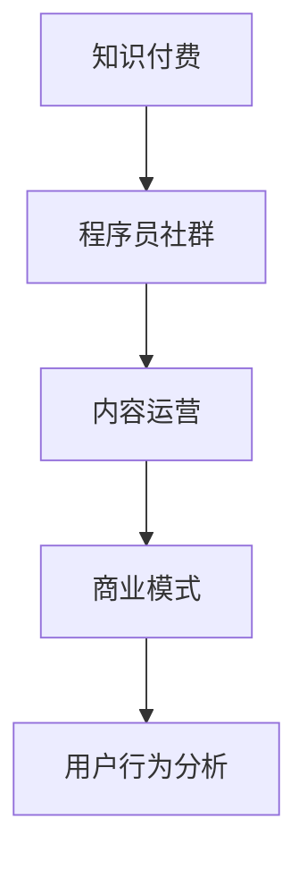

                 

# 知识付费：程序员的社群运营方案

> 关键词：知识付费, 程序员社群, 内容运营, 商业模式, 用户行为分析, 用户留存, 社群裂变

## 1. 背景介绍

### 1.1 问题由来

在互联网快速发展的今天，知识付费成为了一种新兴的学习方式，通过订阅、购买等形式，消费者获取高质量的内容服务。而程序员作为互联网的核心力量，他们的学习需求和付费行为更值得关注。据相关报告显示，有超过七成的程序员表示愿意为学习付费，这一数字在未来有望进一步增长。

然而，目前市场上大多数知识付费产品仍然以内容单向传播为主，缺乏互动和反馈机制，无法真正解决程序员的学习需求。此外，多数产品重内容轻运营，导致内容丰富但用户留存低，难以形成良性循环。因此，如何构建一个符合程序员特点的知识付费社群，提升用户粘性和满意度，是当下亟需解决的问题。

### 1.2 问题核心关键点

构建程序员社群的核心关键点包括以下几点：

- 社群定位：明确社群的定位和目标，吸引对编程、技术、职业发展等话题感兴趣的程序员。
- 内容创作：构建高质量的内容生产机制，吸引程序员和专家参与内容创作。
- 用户互动：引入互动功能，如论坛、讨论、问答等，增强用户参与感。
- 商业化探索：探索多样化的商业化路径，提升社群的经济价值。
- 用户行为分析：通过数据分析，优化社群运营策略，提升用户留存率。

## 2. 核心概念与联系

### 2.1 核心概念概述

为更好地理解程序员社群的运营机制，本节将介绍几个密切相关的核心概念：

- 知识付费：一种新型的知识传递方式，用户通过订阅、购买等形式获取高质量内容服务。
- 程序员社群：围绕程序员群体构建的社交平台，注重编程、技术、职业发展等话题的交流。
- 内容运营：以内容为核心，通过创作、筛选、推送等方式，吸引用户并提升用户满意度。
- 商业模式：以提供有价值的内容服务，实现知识变现，形成良性循环。
- 用户行为分析：通过数据分析，识别用户需求和行为模式，优化产品运营策略。

这些核心概念之间的逻辑关系可以通过以下Mermaid流程图来展示：



这个流程图展示了几大核心概念之间的关系：

1. 知识付费是构建程序员社群的初衷和基础。
2. 内容运营是吸引和留住程序员用户的关键。
3. 商业模式是实现知识付费可持续性的保障。
4. 用户行为分析是优化运营策略的依据。

这些概念共同构成了程序员社群的核心框架，使得社群能够持续发展并产生社会和经济价值。

## 3. 核心算法原理 & 具体操作步骤
### 3.1 算法原理概述

程序员社群的运营主要依赖于以下几大算法原理：

1. 推荐系统：通过数据分析和机器学习技术，为用户推荐符合其兴趣的内容。
2. 用户行为分析：通过用户互动数据，分析用户行为模式和偏好，提升用户留存率。
3. 内容协同过滤：基于用户互动数据和内容特征，构建协同过滤模型，发现高质量内容。
4. 社群激励机制：设计合理的激励机制，吸引用户参与内容创作和社群建设。

### 3.2 算法步骤详解

基于上述算法原理，程序员社群的运营可以包括以下几个关键步骤：

**Step 1: 社群筹备**

- 明确社群定位和目标，确定目标用户群体。
- 设计社群功能和规则，构建社群平台。
- 吸引首批用户，建立社区氛围。

**Step 2: 内容创作**

- 制定内容创作机制，吸引程序员和专家参与创作。
- 提供创作工具和资源，简化内容制作流程。
- 组织内容评审委员会，筛选高质量内容。

**Step 3: 用户互动**

- 引入论坛、讨论、问答等互动功能，增强用户参与感。
- 设计活动和竞赛，鼓励用户积极参与。
- 及时反馈和回应用户，建立信任关系。

**Step 4: 商业化探索**

- 探索付费订阅、广告、付费问答、课程等多种商业化路径。
- 根据用户反馈和市场变化，不断优化商业化策略。
- 建立合作机制，引入外部资源和支持。

**Step 5: 用户行为分析**

- 收集和分析用户互动数据，识别用户行为模式。
- 根据分析结果，优化内容推荐和社群运营策略。
- 持续监控用户留存率，及时调整运营策略。

以上是程序员社群运营的一般流程。在实际应用中，还需要针对具体社群的特点，对各环节进行优化设计，如改进推荐算法，引入更多的互动方式，搜索最优的商业化组合等，以进一步提升社群运营的效果。

### 3.3 算法优缺点

构建程序员社群的算法原理有以下优点：

1. 提升用户满意度：通过推荐系统和内容运营，提升用户参与度和满意度。
2. 提高内容质量：协同过滤算法能够发现高质量内容，吸引更多高质量创作者。
3. 促进商业化：多渠道商业化探索，提高社群的经济价值。
4. 优化运营策略：通过用户行为分析，优化运营策略，提升用户留存率。

同时，这些算法也存在一定的局限性：

1. 对算法依赖性高：推荐系统、内容协同过滤等算法需要大量数据和计算资源，对算力要求较高。
2. 数据隐私问题：用户行为数据和内容创作数据可能涉及隐私，需要严格的数据保护措施。
3. 内容审核难度大：社区内容的审核和管理难度较大，需要建立严格的内容管理机制。
4. 商业化效果存在不确定性：商业化路径的选择和运营需要市场验证，存在一定风险。

尽管存在这些局限性，但就目前而言，这些算法原理仍是目前社群运营的主流范式。未来相关研究的重点在于如何进一步提升算法的精确度和效率，同时兼顾隐私保护和内容管理。

### 3.4 算法应用领域

构建程序员社群的算法原理已经在多个领域得到广泛应用，如社交网络、在线教育、内容聚合平台等。以下是几个典型应用场景：

- **社交网络**：通过用户行为分析，推荐朋友、分享内容，提升用户粘性。
- **在线教育**：通过内容运营和推荐系统，提升课程质量和用户体验。
- **内容聚合平台**：通过内容协同过滤，发现高质量内容，提升平台价值。
- **游戏社区**：通过用户行为分析，优化游戏内容推荐，提升用户留存率。
- **知识分享平台**：通过内容创作机制，鼓励用户分享知识，形成良性循环。

除了上述这些场景外，构建程序员社群的算法原理还可以应用到更多领域中，如智能客服、智能搜索、智能推荐等，为内容服务行业带来新的突破。

## 4. 数学模型和公式 & 详细讲解  
### 4.1 数学模型构建

本节将使用数学语言对程序员社群的运营机制进行更加严格的刻画。

记程序员社群为 $G=(U,E,C)$，其中 $U$ 为社群用户集合，$E$ 为社群内容集合，$C$ 为社群互动数据集合。定义用户行为特征为 $f:U \rightarrow \mathbb{R}^d$，内容特征为 $g:E \rightarrow \mathbb{R}^d$，互动数据为 $h:C \rightarrow \mathbb{R}^d$。

定义用户行为相似度为 $\sigma(u,v) \in [0,1]$，表示用户 $u$ 和 $v$ 在行为上的相似程度。定义内容相似度为 $\delta(e,f) \in [0,1]$，表示内容 $e$ 与用户行为特征 $f$ 的相似程度。

社群推荐系统可以表示为 $\mathcal{R}(u,E) \in \{0,1\}$，表示用户 $u$ 是否点击或购买内容 $e$。

用户行为分析模型可以表示为 $\mathcal{A}(u) \in \mathbb{R}^k$，表示用户 $u$ 的行为模式，其中 $k$ 为行为模式维度。

社群商业化模型可以表示为 $\mathcal{B}(u) \in \mathbb{R}^m$，表示用户 $u$ 的商业化收益，其中 $m$ 为商业化收益维度。

### 4.2 公式推导过程

以下我们以推荐系统为例，推导协同过滤模型的公式和计算过程。

协同过滤模型基于用户的相似性和内容的相似性，计算用户对内容的预测评分。假设用户 $u$ 和内容 $e$ 的相似度分别为 $\sigma(u,v)$ 和 $\delta(e,f)$，则用户 $u$ 对内容 $e$ 的预测评分 $r_{ue}$ 可以表示为：

$$
r_{ue} = \alpha \sigma(u,v) + \beta \delta(e,f)
$$

其中 $\alpha$ 和 $\beta$ 为权重系数，用于平衡用户相似度和内容相似度。

在得到用户对内容的预测评分后，可以将其作为推荐模型的一部分，计算用户对内容的推荐排序。具体步骤如下：

1. 计算所有用户对所有内容的预测评分。
2. 对每个用户 $u$，按照预测评分 $r_{ue}$ 进行降序排序。
3. 取排序前 $N$ 条内容推荐给用户 $u$，其中 $N$ 为用户推荐数量。

通过上述过程，即可构建推荐系统，实现内容的个性化推荐。

### 4.3 案例分析与讲解

假设我们构建了一个程序员社群，用户可以通过分享技术文章、参与讨论、发表评论等方式，与其他程序员互动。我们可以使用协同过滤算法推荐高质量的文章和讨论话题。具体实现步骤如下：

1. 收集用户互动数据，包括点赞、评论、回复等行为，构建用户行为特征 $f$。
2. 对文章和讨论话题进行特征提取，构建内容特征 $g$。
3. 计算用户之间的相似度 $\sigma(u,v)$ 和内容之间的相似度 $\delta(e,f)$。
4. 根据协同过滤模型，计算用户 $u$ 对内容 $e$ 的预测评分 $r_{ue}$。
5. 按照预测评分进行降序排序，取前 $N$ 条内容推荐给用户 $u$。

在实际应用中，协同过滤算法需要考虑数据稀疏性和冷启动问题，可以使用矩阵分解、近邻算法等方法进行优化。此外，需要注意用户行为和内容特征的更新频率，保持数据的时效性。

## 5. 项目实践：代码实例和详细解释说明
### 5.1 开发环境搭建

在进行程序员社群的开发实践前，我们需要准备好开发环境。以下是使用Python进行Flask开发的环境配置流程：

1. 安装Anaconda：从官网下载并安装Anaconda，用于创建独立的Python环境。

2. 创建并激活虚拟环境：
```bash
conda create -n flask-env python=3.8 
conda activate flask-env
```

3. 安装Flask：从官网下载并安装Flask框架，用于构建Web应用。
```bash
conda install flask
```

4. 安装各类工具包：
```bash
pip install numpy pandas scikit-learn flask
```

完成上述步骤后，即可在`flask-env`环境中开始社群应用的开发。

### 5.2 源代码详细实现

下面我们以推荐系统为例，给出使用Flask实现程序员社群内容推荐的Python代码实现。

首先，定义Flask应用和路由：

```python
from flask import Flask, request, jsonify

app = Flask(__name__)

@app.route('/recommend', methods=['POST'])
def recommend():
    user_id = request.json['user_id']
    return jsonify({'recommendations': recommend_content(user_id)})

def recommend_content(user_id):
    # 推荐算法实现
    pass
```

然后，定义推荐算法函数：

```python
import numpy as np

def recommend_content(user_id):
    # 从数据库或API获取用户行为特征 f 和内容特征 g
    f = get_user_behavior(user_id)
    g = get_content_features()

    # 计算用户之间的相似度
    user_similarity = calculate_similarity(f)

    # 计算内容之间的相似度
    content_similarity = calculate_content_similarity(g)

    # 计算用户对内容的预测评分
    predictions = calculate_predictions(f, g, user_similarity, content_similarity)

    # 对预测评分进行降序排序
    sorted_predictions = np.argsort(predictions)[::-1]

    # 取前N条内容作为推荐
    recommendations = g[sorted_predictions][:5]

    return recommendations
```

最后，实现推荐算法的具体计算过程：

```python
def calculate_similarity(f):
    # 计算用户行为特征的余弦相似度
    similarity_matrix = np.dot(f, f.T) / (np.linalg.norm(f, axis=1, keepdims=True) * np.linalg.norm(f.T, axis=0, keepdims=True))
    return similarity_matrix

def calculate_content_similarity(g):
    # 计算内容特征的余弦相似度
    similarity_matrix = np.dot(g, g.T) / (np.linalg.norm(g, axis=1, keepdims=True) * np.linalg.norm(g.T, axis=0, keepdims=True))
    return similarity_matrix

def calculate_predictions(f, g, user_similarity, content_similarity):
    # 计算用户对内容的预测评分
    alpha = 0.8
    beta = 0.2
    predictions = alpha * np.dot(user_similarity, content_similarity * g) + beta * g
    return predictions
```

以上就是使用Flask构建程序员社群推荐系统的完整代码实现。可以看到，使用Python和Flask可以快速搭建一个Web应用，调用推荐算法实现个性化内容推荐。

### 5.3 代码解读与分析

让我们再详细解读一下关键代码的实现细节：

**Flask应用和路由**：
- 定义Flask应用对象，使用 `@app.route` 装饰器定义路由和请求方法。
- 通过 POST 请求获取用户 ID，调用推荐算法函数并返回推荐结果。

**推荐算法函数**：
- 从数据库或 API 获取用户行为特征 f 和内容特征 g。
- 计算用户之间的相似度 user_similarity，以及内容之间的相似度 content_similarity。
- 使用协同过滤算法，计算用户对内容的预测评分 predictions。
- 对预测评分进行降序排序，取前 N 条内容作为推荐结果。

**推荐算法具体计算**：
- 使用 numpy 计算余弦相似度，构建用户和内容之间的相似度矩阵。
- 根据协同过滤模型，计算用户对内容的预测评分。
- 对预测评分进行降序排序，取前 N 条内容作为推荐结果。

在实际应用中，代码需要进一步优化，如引入缓存机制、优化数据访问速度、实现分布式计算等。此外，还需要考虑用户行为和内容特征的更新频率，保持数据的时效性。

## 6. 实际应用场景
### 6.1 程序员社群推荐系统

构建程序员社群推荐系统，可以显著提升用户体验和满意度。程序员社群通常包含大量的技术文章、项目分享、讨论话题等内容，用户如何快速发现和推荐高质量内容，是一个亟待解决的问题。

推荐系统可以根据用户行为数据，发现用户感兴趣的内容，减少用户查找的时间成本。同时，通过协同过滤算法，发现高质量的创作者和文章，吸引更多高质量的用户和创作者，形成一个良性循环。

### 6.2 程序员在线教育平台

在线教育平台需要提供高质量的课程和辅导，帮助程序员快速提升技术水平。推荐系统可以帮助平台推荐符合用户学习阶段的课程，提高学习效果。

通过用户行为数据，推荐系统可以发现用户的兴趣和能力，推荐与其水平相匹配的课程，避免“假、大、空”课程的出现。同时，平台可以根据用户的反馈和评价，不断优化课程推荐策略，提升用户的学习体验。

### 6.3 程序员职业发展平台

职业发展平台可以帮助程序员了解职业发展路径，提升职场竞争力。推荐系统可以根据用户的历史行为和兴趣，推荐合适的培训课程、职业指导、工作机会等信息，提升用户职业发展效率。

通过分析用户的行为数据和反馈，推荐系统可以发现用户的职业兴趣和发展方向，推荐符合其职业发展的课程和机会，帮助用户制定职业规划，提升职业竞争力。

### 6.4 未来应用展望

随着程序员社群的不断发展，推荐系统的应用场景将进一步拓展，如智能搜索、智能客服、智能招聘等，为程序员提供更全面的服务。同时，推荐系统也将与其他人工智能技术进行更深入的融合，如知识图谱、因果推理、强化学习等，提升系统的智能水平。

## 7. 工具和资源推荐
### 7.1 学习资源推荐

为了帮助开发者系统掌握程序员社群推荐系统的理论基础和实践技巧，这里推荐一些优质的学习资源：

1. 《推荐系统实践》系列博文：由推荐系统专家撰写，深入浅出地介绍了推荐系统原理、算法、案例等前沿话题。

2. Coursera《Recommender Systems Specialization》课程：由斯坦福大学教授主讲，涵盖推荐系统理论和实际应用，适合初学者和进阶者学习。

3. 《推荐系统基础》书籍：豆瓣9.6分，系统介绍了推荐系统的基本原理和算法，适合深入学习和研究。

4. 《Python推荐系统实战》课程：通过Python实现推荐系统，涵盖协同过滤、深度学习等多种算法，适合动手实践。

5. Kaggle推荐系统竞赛：通过实际数据集进行推荐系统竞赛，积累实战经验，提升算法能力。

通过对这些资源的学习实践，相信你一定能够快速掌握程序员社群推荐系统的精髓，并用于解决实际的推荐问题。

### 7.2 开发工具推荐

高效的开发离不开优秀的工具支持。以下是几款用于程序员社群推荐系统开发的常用工具：

1. Python：免费的开源编程语言，功能强大，生态系统丰富，适合进行推荐系统开发。

2. Flask：轻量级的Web框架，易于上手，适合构建Web应用。

3. TensorFlow：由Google主导开发的深度学习框架，生产部署方便，适合进行深度学习模型开发。

4. Scikit-learn：Python的机器学习库，提供了丰富的机器学习算法和工具，适合进行特征工程和数据预处理。

5. Jupyter Notebook：免费的交互式笔记本环境，支持Python等语言的快速迭代开发。

合理利用这些工具，可以显著提升程序员社群推荐系统的开发效率，加快创新迭代的步伐。

### 7.3 相关论文推荐

推荐系统的研究源于学界的持续研究。以下是几篇奠基性的相关论文，推荐阅读：

1. Large-Scale Parallel Collaborative Filtering for Recommender Systems：提出基于模型和模型的混合协同过滤算法，提高了推荐系统的效率和精度。

2. Factorization Machines for Ad Click Prediction：提出基于矩阵分解的推荐算法，广泛应用于推荐系统实践中。

3. The BellKor 2012 PLE: A Top-N Recommendation Algorithm for Large Scale Datasets：提出基于矩阵分解和主成分分析的推荐算法，适合大规模数据集。

4. Deep Matrix Factorization for Recommender Systems：提出基于深度学习的矩阵分解算法，提高了推荐系统的精度和泛化能力。

5. Factorization Machine with Neural Network Layer: A Hybrid Model for Recommender Systems：提出基于神经网络层的矩阵分解算法，进一步提升了推荐系统的性能。

这些论文代表了大数据推荐系统的研究进展，为推荐系统的发展提供了重要的理论支持。通过学习这些前沿成果，可以帮助研究者把握学科前进方向，激发更多的创新灵感。

## 8. 总结：未来发展趋势与挑战

### 8.1 总结

本文对程序员社群推荐系统的运营机制进行了全面系统的介绍。首先阐述了知识付费和程序员社群的发展背景和意义，明确了推荐系统在社群运营中的关键作用。其次，从原理到实践，详细讲解了协同过滤、用户行为分析等核心算法，给出了推荐系统开发的完整代码实例。同时，本文还广泛探讨了推荐系统在程序员社群、在线教育、职业发展等多个领域的应用前景，展示了推荐系统的巨大潜力。此外，本文精选了推荐系统的各类学习资源，力求为开发者提供全方位的技术指引。

通过本文的系统梳理，可以看到，程序员社群推荐系统的构建，需要从用户需求、内容质量、商业化路径等多个维度进行全面优化。只有从数据、算法、工程、商业等多个层面协同发力，才能真正实现程序员社群的成功运营。未来，伴随着推荐系统技术的不断演进，程序员社群推荐系统也将迎来更多的应用场景和更大的商业价值。

### 8.2 未来发展趋势

展望未来，程序员社群推荐系统将呈现以下几个发展趋势：

1. 数据融合与多模态推荐：未来的推荐系统将融合用户行为数据、内容数据、社交网络数据等多种数据源，进行多模态推荐，提高推荐的准确性和丰富性。

2. 深度学习和强化学习：深度学习和强化学习技术将广泛应用于推荐系统中，提高模型的预测能力和自适应能力。

3. 实时推荐与动态调整：实时推荐系统将结合用户行为和环境变化，动态调整推荐策略，提升推荐效果。

4. 用户隐私保护：推荐系统将更加重视用户隐私保护，采用差分隐私、联邦学习等技术，保护用户数据安全。

5. 可解释性与透明度：推荐系统将增加可解释性，让用户理解推荐结果的生成过程，提升用户的信任度。

6. 跨平台与多设备推荐：未来的推荐系统将支持跨平台、多设备推荐，提升用户的无缝体验。

以上趋势凸显了程序员社群推荐系统的广阔前景。这些方向的探索发展，必将进一步提升推荐系统的性能和用户满意度，为程序员社群带来更好的服务体验。

### 8.3 面临的挑战

尽管程序员社群推荐系统已经取得了显著的成果，但在迈向更加智能化、普适化应用的过程中，它仍面临着诸多挑战：

1. 数据获取难度大：推荐系统需要大量的用户行为数据和内容数据，如何获取高质量的数据是一个关键问题。

2. 算法复杂度高：推荐算法涉及复杂的机器学习模型，需要大量的计算资源和专业知识。

3. 用户隐私问题：用户行为数据可能涉及隐私，如何保护用户隐私是一个重要问题。

4. 用户满意度不足：推荐系统可能无法完全满足用户的需求，导致用户满意度不高。

5. 商业化效果不确定：推荐系统需要多渠道商业化，如何确定最优的商业化策略，是一个挑战。

6. 技术更新快：推荐系统需要不断更新算法和技术，保持系统的先进性。

这些挑战需要开发人员在开发过程中不断优化算法、数据和工程，确保系统的稳定性和效率。同时，也需要开发人员具备较强的业务理解能力和技术储备，才能应对不断变化的市场需求。

### 8.4 研究展望

面对程序员社群推荐系统所面临的挑战，未来的研究需要在以下几个方面寻求新的突破：

1. 优化推荐算法：开发更加高效的推荐算法，降低数据和计算资源的需求。

2. 数据获取与融合：探索多渠道数据获取和融合机制，提高数据质量和数量。

3. 用户隐私保护：引入隐私保护技术，如差分隐私、联邦学习等，保护用户数据安全。

4. 用户满意度提升：通过用户行为分析，优化推荐策略，提升用户满意度。

5. 商业化策略优化：探索多样化的商业化路径，提升系统的经济价值。

6. 技术创新与融合：引入新技术，如深度学习、强化学习、因果推理等，提升系统的智能水平。

这些研究方向的探索，必将引领程序员社群推荐系统迈向更高的台阶，为程序员社群带来更好的服务体验。总之，推荐系统需要开发者根据具体需求，不断迭代和优化算法、数据和工程，方能得到理想的效果。

## 9. 附录：常见问题与解答

**Q1：推荐系统是否可以解决程序员社群推荐的所有问题？**

A: 推荐系统可以有效解决程序员社群推荐的大部分问题，但并不能解决所有问题。推荐系统需要大量高质量的数据和复杂的算法，存在一定的局限性。此外，程序员社群还需要考虑内容质量和用户行为分析等因素，才能构建高质量的推荐系统。

**Q2：推荐系统需要多少数据才能实现有效的推荐？**

A: 推荐系统需要足够的数据才能实现有效的推荐，一般需要至少数万条以上的用户行为数据和内容数据。数据量越大，推荐的准确性和效果越好。但数据质量同样重要，需要保证数据的真实性和准确性。

**Q3：如何评估推荐系统的性能？**

A: 推荐系统的性能评估可以从以下几个方面进行：

1. 点击率预测准确率（CTR）：评估推荐系统对用户点击行为的预测准确性。
2. 平均绝对误差（MAE）：评估推荐系统对物品评分的预测误差。
3. 对数损失（Log Loss）：评估推荐系统对物品评分的预测准确性。
4. 平均精度（MAP）：评估推荐系统对用户排序评分的预测准确性。

通过综合评估这些指标，可以全面了解推荐系统的性能。

**Q4：如何构建程序员社群推荐系统？**

A: 构建程序员社群推荐系统需要以下几个步骤：

1. 收集用户行为数据和内容数据，构建数据集。
2. 选择合适的推荐算法，如协同过滤、深度学习等。
3. 实现推荐算法，并将其集成到Web应用中。
4. 进行测试和优化，提升推荐效果和系统性能。

开发者需要根据具体需求，选择合适的算法和技术，并进行系统集成和优化。

**Q5：如何提升程序员社群推荐系统的用户满意度？**

A: 提升程序员社群推荐系统的用户满意度需要从多个方面进行优化：

1. 提高推荐算法的准确性，推荐高质量的内容。
2. 引入用户反馈机制，及时调整推荐策略。
3. 提供多样化的推荐内容，满足不同用户的需求。
4. 增加推荐系统的人性化设计，提升用户体验。

通过综合考虑这些因素，可以提升程序员社群推荐系统的用户满意度。

总之，构建程序员社群推荐系统需要开发者具备较强的技术能力和业务理解能力，不断优化算法、数据和工程，才能得到理想的效果。相信随着技术的不断发展，程序员社群推荐系统将为程序员带来更好的服务体验，提升他们的技术水平和职业发展效率。

