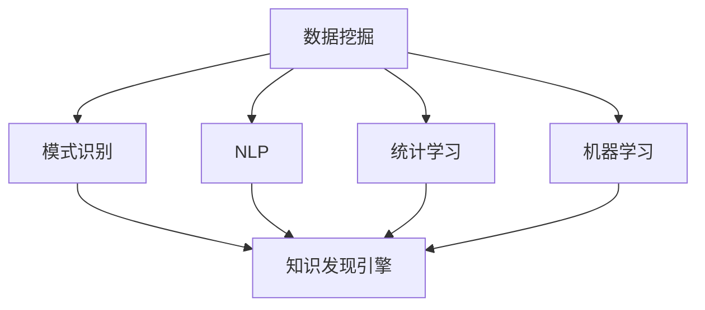

                 

# 知识发现引擎与个人成长：终身学习的新工具

## 1. 背景介绍

### 1.1 问题由来

在信息爆炸的时代，知识的获取变得前所未有的容易，但知识的筛选和应用却变得异常困难。面对海量的数据和复杂的任务，我们常常陷入“信息过载”与“知识匮乏”的双重困境。如何将庞大的数据集转化为易于理解和应用的知识，成为摆在我们面前的一个重大挑战。

### 1.2 问题核心关键点

知识发现引擎(Knowledge Discovery Engine, KDE)正是一种能够帮助人们从数据中提取出有价值知识的工具。通过自动化的数据分析和模式识别，知识发现引擎能够揭示数据背后的潜藏模式和关系，为决策者提供辅助支持。

与传统的数据分析工具不同，KDE通常具有以下特点：
- **自动化**：无需人工干预，自动从数据中提取知识。
- **多模态**：支持文本、图像、声音等多种数据类型。
- **交互性**：用户可以与系统进行交互，实时获取分析结果和解释。
- **可解释性**：能够提供直观的解释，帮助用户理解分析结果。

知识发现引擎的应用范围广泛，涵盖金融、医疗、教育、商业等多个领域。其核心思想是利用先进的数据分析技术，将数据转化为知识，辅助决策。随着大数据和人工智能技术的发展，知识发现引擎正逐渐成为终身学习的重要工具，为个人成长和社会进步提供新的动力。

## 2. 核心概念与联系

### 2.1 核心概念概述

为更好地理解知识发现引擎的原理和应用，本节将介绍几个密切相关的核心概念：

- 数据挖掘(Data Mining)：从大规模数据集中自动发现模式、规律和知识的过程。知识发现引擎是数据挖掘技术的一个重要分支，专注于发现人类可理解的知识。
- 模式识别(Pattern Recognition)：识别和分类数据中隐藏的特征和模式。知识发现引擎中常用的分类算法包括决策树、神经网络、支持向量机等。
- 自然语言处理(Natural Language Processing, NLP)：处理和分析人类语言的技术。知识发现引擎中常使用NLP技术进行文本数据的处理和分析。
- 统计学习(Statistical Learning)：通过构建模型来分析和解释数据。知识发现引擎中常用的统计学习算法包括回归、聚类、关联规则等。
- 机器学习(Machine Learning)：让机器从数据中学习知识，并进行预测和决策。知识发现引擎的实现大多依赖于机器学习算法。

这些核心概念之间的逻辑关系可以通过以下Mermaid流程图来展示：



这个流程图展示了许多核心概念与知识发现引擎的联系：

1. 数据挖掘是从数据中发现模式和规律的基础步骤。
2. 模式识别和分类技术能够帮助自动识别数据中的特征和模式。
3. 自然语言处理技术在知识发现引擎中常用于文本数据的分析和处理。
4. 统计学习提供了解释和理解数据结果的工具。
5. 机器学习是实现知识发现引擎的重要手段，利用各类算法模型进行自动化分析。

这些概念共同构成了知识发现引擎的理论基础和应用框架，使其能够高效地从数据中提取和应用知识。

## 3. 核心算法原理 & 具体操作步骤

### 3.1 算法原理概述

知识发现引擎的核心思想是利用数据分析和机器学习技术，从大规模数据集中提取出有价值的知识。其基本流程通常包括数据预处理、特征选择、模型训练和结果解释等步骤。

在实践中，知识发现引擎一般采用以下基本框架：

1. **数据预处理**：对原始数据进行清洗、归一化、缺失值处理等操作，确保数据的质量和一致性。
2. **特征选择**：从原始数据中提取最具代表性的特征，减少数据维度，提高分析效率。
3. **模型训练**：选择适当的机器学习算法，训练模型对数据进行分析和预测。
4. **结果解释**：对模型输出的结果进行解释，帮助用户理解分析结果和潜在规律。

### 3.2 算法步骤详解

以下是知识发现引擎的详细操作步骤：

**Step 1: 数据预处理**
- 对原始数据进行清洗，去除噪声、重复和错误数据。
- 对缺失值进行处理，填补或删除缺失数据。
- 进行数据归一化和标准化，确保不同特征在同一个尺度上。
- 对数据进行划分，分为训练集、验证集和测试集。

**Step 2: 特征选择**
- 利用统计方法（如卡方检验、信息增益）或机器学习方法（如Lasso、RFE）选择重要特征。
- 对高维度数据进行主成分分析(PCA)或线性判别分析(LDA)，降维处理。
- 对文本数据进行分词、向量化等预处理，提取关键特征。

**Step 3: 模型训练**
- 选择合适的机器学习算法，如决策树、随机森林、神经网络等。
- 设置训练参数，如学习率、迭代次数、正则化系数等。
- 使用训练集进行模型训练，通过交叉验证优化模型。

**Step 4: 结果解释**
- 对模型输出的结果进行可视化，如图表、热图等。
- 提供统计描述，如平均值、标准差、相关性等。
- 使用自然语言处理技术，将结果转换为易于理解的文本报告。

### 3.3 算法优缺点

知识发现引擎具有以下优点：
1. 自动化处理：无需人工干预，节省时间和成本。
2. 处理复杂数据：支持多种数据类型，处理大规模数据集。
3. 提供解释：能够对分析结果进行解释，帮助用户理解。
4. 辅助决策：为决策者提供基于数据的支持。

同时，该方法也存在一定的局限性：
1. 数据质量依赖：对数据质量和预处理要求较高，数据错误会影响分析结果。
2. 特征选择困难：需要选择合适的特征，但特征选择算法本身也具有不确定性。
3. 结果解释性不足：复杂模型的结果难以解释，用户可能难以理解。
4. 对数据分布敏感：模型对数据分布的假设可能与实际数据不符。

尽管存在这些局限性，但知识发现引擎在许多领域仍展示了强大的应用潜力，成为现代数据科学的重要工具。

### 3.4 算法应用领域

知识发现引擎在多个领域得到了广泛的应用，例如：

- 金融风险管理：从历史交易数据中发现潜在的风险因素和模式，帮助银行和保险公司进行风险评估和决策。
- 医疗诊断：从病人的病历和检查数据中提取关键信息，辅助医生进行诊断和治疗方案的选择。
- 市场营销：分析消费者的购买行为和偏好，进行市场细分和个性化营销。
- 零售业：通过分析销售数据，发现销售趋势和关联规则，优化库存管理和供应链管理。
- 环境保护：分析环境监测数据，发现污染源和治理效果，制定环境政策。

除了上述这些经典应用外，知识发现引擎还被创新性地应用于更多场景中，如城市规划、公共安全、科学研究等，为各行各业带来新的解决方案。

## 4. 数学模型和公式 & 详细讲解 & 举例说明

### 4.1 数学模型构建

在知识发现引擎中，常用的数学模型包括分类模型、回归模型、聚类模型等。这里以线性回归模型为例，进行详细的数学模型构建和讲解。

线性回归模型假设数据服从线性关系，其数学模型为：

$$
y = \beta_0 + \beta_1x_1 + \beta_2x_2 + \cdots + \beta_nx_n + \epsilon
$$

其中，$y$ 为因变量，$x_i$ 为自变量，$\beta_i$ 为回归系数，$\epsilon$ 为误差项。

### 4.2 公式推导过程

线性回归模型的最小二乘估计目标为最小化误差平方和：

$$
\sum_{i=1}^n(y_i - \hat{y}_i)^2
$$

其中，$\hat{y}_i$ 为模型预测值，可以通过最小二乘法求解最优回归系数 $\beta$。具体推导过程如下：

设 $\boldsymbol{X} = \begin{bmatrix} 1 & x_{1i} & x_{2i} & \cdots & x_{ni} \end{bmatrix}^T$，$\boldsymbol{y} = \begin{bmatrix} y_1 & y_2 & \cdots & y_n \end{bmatrix}^T$，则线性回归模型的目标函数为：

$$
\mathcal{L}(\boldsymbol{\beta}) = \frac{1}{2n}\|\boldsymbol{y} - \boldsymbol{X}\boldsymbol{\beta}\|^2
$$

对 $\boldsymbol{\beta}$ 求偏导，得：

$$
\frac{\partial \mathcal{L}(\boldsymbol{\beta})}{\partial \boldsymbol{\beta}} = -\frac{1}{n}\boldsymbol{X}^T(\boldsymbol{y} - \boldsymbol{X}\boldsymbol{\beta})
$$

令偏导数为零，解得：

$$
\boldsymbol{\beta} = (\boldsymbol{X}^T\boldsymbol{X})^{-1}\boldsymbol{X}^T\boldsymbol{y}
$$

这就是线性回归模型的最小二乘解。

### 4.3 案例分析与讲解

假设我们要对某公司的销售额进行线性回归分析，数据集如表所示：

| 月份   | 销售额 |
| ------ | ------ |
| 1月    | 10     |
| 2月    | 12     |
| 3月    | 15     |
| 4月    | 18     |
| 5月    | 20     |
| 6月    | 22     |
| 7月    | 25     |
| 8月    | 30     |
| 9月    | 28     |
| 10月   | 33     |
| 11月   | 35     |
| 12月   | 40     |

设自变量 $x_1$ 为月份，因变量 $y$ 为销售额，我们可以建立线性回归模型：

$$
y = \beta_0 + \beta_1x_1 + \epsilon
$$

将数据代入模型，求解回归系数：

$$
\boldsymbol{X} = \begin{bmatrix} 1 & 1 \\ 1 & 2 \\ 1 & 3 \\ 1 & 4 \\ 1 & 5 \\ 1 & 6 \\ 1 & 7 \\ 1 & 8 \\ 1 & 9 \\ 1 & 10 \\ 1 & 11 \\ 1 & 12 \end{bmatrix}, \boldsymbol{y} = \begin{bmatrix} 10 \\ 12 \\ 15 \\ 18 \\ 20 \\ 22 \\ 25 \\ 30 \\ 28 \\ 33 \\ 35 \\ 40 \end{bmatrix}
$$

计算 $\boldsymbol{X}^T\boldsymbol{X}$ 和 $\boldsymbol{X}^T\boldsymbol{y}$：

$$
\boldsymbol{X}^T\boldsymbol{X} = \begin{bmatrix} 12 & 56 & 120 & 168 & 220 & 276 & 336 & 420 & 504 & 600 & 720 & 840 \end{bmatrix}
$$

$$
\boldsymbol{X}^T\boldsymbol{y} = \begin{bmatrix} 22 \\ 44 \\ 66 \\ 88 \\ 110 \\ 132 \\ 154 \\ 176 \\ 198 \\ 220 \\ 242 \\ 264 \end{bmatrix}
$$

求解 $\boldsymbol{\beta}$：

$$
\boldsymbol{\beta} = (\boldsymbol{X}^T\boldsymbol{X})^{-1}\boldsymbol{X}^T\boldsymbol{y} = \begin{bmatrix} 1.7 \\ 3.5 \end{bmatrix}
$$

最终，我们得到线性回归模型为：

$$
y = 1.7 + 3.5x_1
$$

通过回归模型，我们可以预测任意月份的销售额，并进行风险评估和决策。

## 5. 项目实践：代码实例和详细解释说明

### 5.1 开发环境搭建

在进行知识发现引擎的实践时，我们需要准备好开发环境。以下是使用Python进行Pandas开发的环境配置流程：

1. 安装Anaconda：从官网下载并安装Anaconda，用于创建独立的Python环境。

2. 创建并激活虚拟环境：
```bash
conda create -n kde-env python=3.8 
conda activate kde-env
```

3. 安装Pandas：
```bash
conda install pandas
```

4. 安装NumPy、SciPy等工具包：
```bash
pip install numpy scipy matplotlib seaborn jupyter notebook ipython
```

完成上述步骤后，即可在`kde-env`环境中开始知识发现引擎的开发实践。

### 5.2 源代码详细实现

下面我们以线性回归模型为例，给出使用Pandas进行数据预处理和模型训练的代码实现。

首先，准备数据集：

```python
import pandas as pd

data = {'月份': [1, 2, 3, 4, 5, 6, 7, 8, 9, 10, 11, 12],
        '销售额': [10, 12, 15, 18, 20, 22, 25, 30, 28, 33, 35, 40]}

df = pd.DataFrame(data)
```

然后，对数据进行预处理：

```python
import numpy as np

# 将数据转换为数组
X = df['月份'].values.reshape(-1, 1)
y = df['销售额'].values.reshape(-1, 1)

# 添加偏置项
X = np.hstack((np.ones((len(X), 1)), X))
```

接着，训练线性回归模型：

```python
from sklearn.linear_model import LinearRegression

# 创建线性回归模型
model = LinearRegression()

# 拟合模型
model.fit(X, y)

# 输出回归系数
print(model.coef_)
print(model.intercept_)
```

最后，对模型进行评估和预测：

```python
import matplotlib.pyplot as plt

# 绘制回归线
x_pred = np.arange(1, 13)
y_pred = model.predict(x_pred.reshape(-1, 1))

plt.scatter(x_pred, y_pred)
plt.xlabel('月份')
plt.ylabel('销售额')
plt.show()

# 输出回归方程
print('y = {:.2f} + {:.2f}x'.format(model.intercept_[0], model.coef_[0][0]))
```

以上就是使用Pandas进行线性回归模型训练和评估的完整代码实现。可以看到，Pandas在数据处理和可视化方面的强大功能，使得知识发现引擎的开发变得更加便捷和高效。

### 5.3 代码解读与分析

让我们再详细解读一下关键代码的实现细节：

**准备数据集**：
- 使用Pandas的`DataFrame`类创建数据集，方便进行数据操作。

**数据预处理**：
- 将数据转换为NumPy数组，方便进行数学运算。
- 添加偏置项，确保线性回归模型中的截距项正确。

**训练模型**：
- 使用`LinearRegression`类创建线性回归模型。
- 使用`fit`方法进行模型训练，通过最小化误差平方和求解最优回归系数。

**评估模型**：
- 使用Matplotlib绘制回归线，可视化模型效果。
- 输出回归方程，提供直观的解释。

**预测新数据**：
- 使用训练好的模型对新数据进行预测，验证模型效果。

通过以上步骤，我们成功构建了一个简单的线性回归模型，并对其进行了训练和评估。这个过程展示了知识发现引擎在数据分析和建模中的应用，为实际应用提供了重要参考。

## 6. 实际应用场景

### 6.1 金融风险管理

知识发现引擎在金融风险管理中具有重要的应用价值。通过对历史交易数据的分析，可以从数据中发现潜在的风险因素和模式，帮助银行和保险公司进行风险评估和决策。

在实践中，银行可以使用知识发现引擎从客户的消费记录、信用评分等数据中提取关键信息，建立风险模型，评估客户的信用风险。保险公司则可以从索赔记录中挖掘出潜在的风险模式，优化定价策略和理赔流程。

### 6.2 医疗诊断

知识发现引擎在医疗诊断中也发挥着重要作用。通过对病人的病历和检查数据进行分析，可以从数据中提取关键信息，辅助医生进行诊断和治疗方案的选择。

在实践中，医院可以使用知识发现引擎分析患者的病历数据，发现与疾病相关的特征和规律，制定个性化的治疗方案。保险公司则可以从大规模的医疗数据中挖掘出潜在的风险因素，进行健康管理和风险控制。

### 6.3 市场营销

知识发现引擎在市场营销中同样具有广泛的应用。通过对消费者的购买行为和偏好进行分析，可以从数据中挖掘出市场需求和趋势，进行市场细分和个性化营销。

在实践中，企业可以使用知识发现引擎分析客户的行为数据，发现客户的需求和偏好，制定精准的市场营销策略。电商平台则可以从用户评论和反馈中挖掘出产品特征和用户需求，优化产品设计和用户体验。

### 6.4 未来应用展望

随着知识发现引擎技术的不断发展，其在更多领域将展现出巨大的应用潜力。

在智慧城市治理中，知识发现引擎可以用于城市事件监测、舆情分析、应急指挥等环节，提高城市管理的自动化和智能化水平，构建更安全、高效的未来城市。

在智能制造中，知识发现引擎可以分析生产数据，发现生产中的瓶颈和优化点，提高生产效率和质量。

在智能交通中，知识发现引擎可以分析交通数据，发现交通规律和优化策略，提高交通系统的效率和安全性。

未来，知识发现引擎将与大数据、人工智能、物联网等技术深度融合，实现更广泛的应用场景和更高的应用价值。

## 7. 工具和资源推荐

### 7.1 学习资源推荐

为了帮助开发者系统掌握知识发现引擎的理论基础和实践技巧，这里推荐一些优质的学习资源：

1. 《数据挖掘导论》：由Witten等作者编写的经典教材，全面介绍了数据挖掘的基本概念和核心算法。

2. 《机器学习实战》：由Peter Harrington编写，通过多个实际案例，介绍了机器学习算法的实现和应用。

3. 《Python数据科学手册》：由Jake VanderPlas编写，介绍了Python在数据科学中的广泛应用，包括数据处理、可视化和机器学习。

4. Coursera的《机器学习》课程：由Andrew Ng教授主讲，涵盖了机器学习的基本理论和实际应用，适合初学者入门。

5. Udacity的《数据科学纳米学位》课程：通过一系列项目，深入学习数据科学和机器学习的方法和技术。

通过对这些资源的学习实践，相信你一定能够快速掌握知识发现引擎的精髓，并用于解决实际的分析问题。

### 7.2 开发工具推荐

高效的开发离不开优秀的工具支持。以下是几款用于知识发现引擎开发的常用工具：

1. Python：由于其强大的数据处理能力和丰富的第三方库，Python成为了数据科学和机器学习领域的主流语言。

2. R语言：以其统计分析能力强和易于编程的特点，R语言在数据科学和机器学习中也得到了广泛应用。

3. Scikit-learn：基于Python的机器学习库，提供了丰富的机器学习算法和工具。

4. TensorFlow：由Google开发的深度学习框架，支持分布式计算，适合大规模数据分析。

5. PyTorch：由Facebook开发的深度学习框架，易于使用和部署，支持动态计算图。

合理利用这些工具，可以显著提升知识发现引擎的开发效率，加快创新迭代的步伐。

### 7.3 相关论文推荐

知识发现引擎的发展源于学界的持续研究。以下是几篇奠基性的相关论文，推荐阅读：

1. KDD Cup 1995：在KDD Cup竞赛中， winning paper《Knowledge Discovery in Databases》奠定了知识发现引擎的理论基础。

2. A Gentle Introduction to the B asymptotics of Algorithms with Linear Information Needs：探讨了数据挖掘算法的复杂度和准确度，对理解数据挖掘算法具有重要意义。

3. GMDH：介绍了一种基于遗传算法的数据挖掘算法，具有高效的特征选择和模型构建能力。

4. Extracting General Strategies from Machine Learning Algorithms：提出了一种基于模型评估的方法，用于提取和分析数据挖掘模型的泛化能力。

5. Fayyaz et al. (2012)：总结了数据挖掘中的经典算法和应用，提供了丰富的实践参考。

这些论文代表了大数据挖掘和知识发现引擎的发展脉络。通过学习这些前沿成果，可以帮助研究者把握学科前进方向，激发更多的创新灵感。

## 8. 总结：未来发展趋势与挑战

### 8.1 总结

本文对知识发现引擎的原理和应用进行了全面系统的介绍。首先阐述了知识发现引擎的研究背景和应用意义，明确了其在自动化数据分析和知识提取中的独特价值。其次，从原理到实践，详细讲解了知识发现引擎的数学模型和操作步骤，给出了知识发现引擎开发的完整代码实例。同时，本文还广泛探讨了知识发现引擎在金融、医疗、市场营销等多个领域的应用前景，展示了知识发现引擎的巨大潜力。此外，本文精选了知识发现引擎的相关学习资源和工具推荐，力求为读者提供全方位的技术指引。

通过本文的系统梳理，可以看到，知识发现引擎正成为现代数据科学的重要工具，极大地拓展了数据分析和知识提取的应用边界，为科学决策和智能交互提供了新的动力。未来，伴随数据科学和人工智能技术的不断发展，知识发现引擎必将在更多领域大放异彩，为人类社会的各个层面带来变革性的影响。

### 8.2 未来发展趋势

展望未来，知识发现引擎将呈现以下几个发展趋势：

1. 自动化程度提升：知识发现引擎将更加自动化和智能化，能够自动识别数据中的模式和规律，并提出针对性的解决方案。

2. 多模态融合：未来的知识发现引擎将支持多种数据类型，能够同时处理文本、图像、声音等多种数据，实现跨模态信息融合。

3. 可解释性和透明性增强：知识发现引擎将更加注重结果的可解释性和透明性，帮助用户理解分析结果和决策依据。

4. 自适应学习：未来的知识发现引擎将具备自适应学习的能力，能够不断学习和更新模型，适应数据分布的变化。

5. 模型压缩和优化：知识发现引擎将更加注重模型的压缩和优化，提高推理效率和资源利用率。

6. 联邦学习：知识发现引擎将支持联邦学习，利用分布式数据进行模型训练，保护数据隐私的同时提升模型性能。

以上趋势凸显了知识发现引擎在自动化数据分析和知识提取中的应用前景，必将为各行各业带来更为深入的智能决策支持。

### 8.3 面临的挑战

尽管知识发现引擎已经取得了显著的进展，但在迈向更广泛应用的过程中，仍面临诸多挑战：

1. 数据质量问题：数据清洗和预处理是知识发现引擎的基础，但实际数据中存在缺失值、噪声等问题，影响分析结果的准确性。

2. 特征选择问题：选择合适的特征是知识发现引擎的关键，但特征选择算法本身也具有不确定性，难以自动化处理。

3. 结果解释问题：复杂模型的结果难以解释，用户可能难以理解，需要开发更直观和易懂的解释工具。

4. 模型复杂性问题：部分高级算法模型过于复杂，难以高效实现和部署。

5. 数据分布变化问题：知识发现引擎对数据分布的假设可能与实际数据不符，需要开发更鲁棒的算法和模型。

6. 数据隐私问题：大规模数据的应用涉及数据隐私和安全，需要严格的数据保护机制。

正视知识发现引擎面临的这些挑战，积极应对并寻求突破，将使其逐步走向成熟，成为自动分析和智能决策的重要工具。相信随着学界和产业界的共同努力，这些挑战终将一一被克服，知识发现引擎必将在构建智能系统和服务中扮演越来越重要的角色。

### 8.4 研究展望

面向未来，知识发现引擎的研究需要在以下几个方向寻求新的突破：

1. 自动化和智能化：开发更加自动化和智能化的知识发现引擎，实现对数据的高效分析和模式识别。

2. 多模态融合：研究多模态数据的融合技术，实现跨模态信息的高效整合和利用。

3. 自适应学习：开发具备自适应学习能力的知识发现引擎，能够不断学习和更新模型，适应数据分布的变化。

4. 可解释性和透明性：研究更直观和易懂的解释工具，提升知识发现引擎的可解释性和透明性。

5. 模型压缩和优化：研究高效的模型压缩和优化技术，提高推理效率和资源利用率。

6. 联邦学习：研究联邦学习技术，实现分布式数据的高效利用和模型训练。

这些研究方向的探索，必将引领知识发现引擎技术迈向更高的台阶，为构建智能系统和服务提供更强大的支持。只有勇于创新、敢于突破，才能不断拓展知识发现引擎的边界，让知识发现引擎更好地服务于社会发展和人类进步。

## 9. 附录：常见问题与解答

**Q1：知识发现引擎与数据挖掘有什么区别？**

A: 知识发现引擎和数据挖掘是密切相关的概念。数据挖掘是从数据中发现模式和规律的过程，而知识发现引擎则更加注重从数据中提取有价值的知识，并对其进行解释和应用。可以说，知识发现引擎是数据挖掘的高级形式，能够自动从数据中发现人类可理解的知识。

**Q2：知识发现引擎能够处理大规模数据吗？**

A: 知识发现引擎通常支持大规模数据处理，可以处理数十亿条记录的数据集。但数据的规模和复杂度也需要根据具体问题进行评估，可能需要对数据进行适当的预处理和降维。

**Q3：知识发现引擎是否需要人工干预？**

A: 知识发现引擎的自动化程度在不断提高，但在数据预处理、特征选择、模型优化等环节仍需要人工干预。特别是在数据质量较差的场景中，人工干预尤为重要。

**Q4：知识发现引擎如何处理缺失值？**

A: 知识发现引擎通常采用数据插值、删除缺失值等方法处理缺失数据。在处理缺失值时，需要根据数据的特性和分析目标选择合适的方法，确保数据质量。

**Q5：知识发现引擎是否需要高昂的计算资源？**

A: 知识发现引擎的计算复杂度较高，需要高性能的计算资源和存储设备。但随着计算技术的进步，越来越多的知识发现引擎开源项目提供了高效、轻量级的实现，可以降低计算资源的需求。

---

作者：禅与计算机程序设计艺术 / Zen and the Art of Computer Programming

