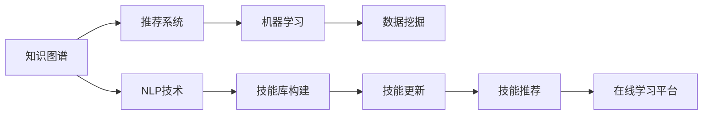

                 

# 知识发现引擎助力程序员技能更新迭代

> 关键词：知识发现引擎, 程序员技能, 技能迭代, 技术演进, 在线学习平台, 人工智能辅助, 数据挖掘, 机器学习, 个性化推荐

## 1. 背景介绍

在当今快速发展的信息技术领域，程序员作为驱动技术创新的核心力量，其技能的更新迭代速度愈发迅猛。无论是新技术的涌现，还是旧技术的淘汰，都要求程序员不断地学习新知识，以保持竞争力和适应能力。然而，面对海量的学习资源和不断变化的技术趋势，传统线下学习和自学模式往往显得力不从心，难以满足高效、个性化、动态化的学习需求。

在这一背景下，知识发现引擎应运而生。作为知识获取与技能学习的智能平台，知识发现引擎通过深度挖掘知识图谱、自然语言处理、推荐系统等前沿技术，实现对程序员技能库的动态更新和精准推荐，大幅提升技能学习的效率和质量。本文将系统性地介绍知识发现引擎的核心概念、原理和具体操作步骤，并结合实际案例深入分析其在程序员技能更新迭代中的广泛应用。

## 2. 核心概念与联系

### 2.1 核心概念概述

为准确理解和运用知识发现引擎，首先需要明确其涉及的核心概念和组件：

- **知识图谱(Knowledge Graph)**：用于描述实体和实体间关系的图形化结构，包含语义信息，用于机器理解和学习。
- **自然语言处理(NLP)**：处理、分析和生成自然语言的计算技术，是知识图谱构建和技能推荐的关键工具。
- **推荐系统(Recommender System)**：根据用户的历史行为和偏好，推荐可能感兴趣的内容。
- **机器学习(Machine Learning)**：基于数据驱动的方法，使系统能够学习和优化模型，实现自动化的技能推荐。
- **数据挖掘(Data Mining)**：从数据中提取有用信息和知识的过程，是知识图谱构建和技能发现的重要手段。

这些概念构成了知识发现引擎的基础，通过自然语言处理、机器学习和数据挖掘等技术，实现对程序员技能库的智能化构建、更新和推荐。

### 2.2 核心概念联系（Mermaid 流程图）



该流程图展示了知识发现引擎的核心组件及其之间的逻辑关系。知识图谱构建和技能库构建是基础，NLP技术用于处理用户输入和技能信息，推荐系统根据用户行为推荐相关技能，机器学习用于优化推荐模型，数据挖掘用于构建和更新知识图谱，最终技能库和推荐系统结合，为用户提供高效的学习平台。

## 3. 核心算法原理 & 具体操作步骤

### 3.1 算法原理概述

知识发现引擎的核心算法原理主要包括知识抽取、技能推荐和动态更新三个部分：

1. **知识抽取(Knowledge Extraction)**：通过NLP技术，从用户提供的文本中识别实体、关系和属性，构建知识图谱。
2. **技能推荐(Skill Recommendation)**：基于机器学习算法，对用户的学习行为和偏好进行分析，推荐匹配的技能课程和资源。
3. **动态更新(Dynamic Update)**：定期从新的学习资源和用户反馈中提取新知识，更新技能库，确保推荐的准确性和时效性。

### 3.2 算法步骤详解

#### 3.2.1 知识抽取

1. **分词与实体识别**：使用NLP技术对用户输入的文本进行分词，识别出人名、地名、组织名等实体。
2. **关系抽取**：使用依存句法分析等方法，确定实体之间的关系，如"学习"、"掌握"、"掌握"等。
3. **属性提取**：从文本中提取实体的属性信息，如技能名称、难度、适用领域等。
4. **构建知识图谱**：将抽取的实体、关系和属性信息整合，构建知识图谱，供后续技能推荐使用。

#### 3.2.2 技能推荐

1. **用户画像构建**：根据用户的历史学习行为和评价数据，构建用户画像，描述用户的技能水平、兴趣偏好和学习进度。
2. **相似度计算**：计算用户画像与课程或技能之间的相似度，选择推荐列表中匹配度高的内容。
3. **模型训练与优化**：使用协同过滤、矩阵分解等算法，训练推荐模型，不断优化推荐效果。
4. **动态调整**：根据用户反馈和最新数据，定期更新推荐模型，确保推荐的准确性和个性化。

#### 3.2.3 动态更新

1. **数据采集**：从在线课程平台、技术论坛、开源项目等渠道，采集最新的技术动态和学习资源。
2. **知识提取与验证**：使用NLP技术，从采集的数据中提取新的知识和技能，进行验证和整合。
3. **图谱更新**：将提取的新知识和技能整合到知识图谱中，更新现有的技能库。
4. **推荐调整**：根据新的技能库和推荐模型，调整推荐策略，更新推荐列表。

### 3.3 算法优缺点

#### 3.3.1 优点

- **高效个性化**：能够根据用户的学习历史和兴趣，推荐个性化的课程和资源，提升学习效率。
- **动态更新**：通过定期更新知识图谱和推荐模型，确保推荐的准确性和时效性。
- **覆盖广泛**：涵盖从入门到高级的各种技能，满足不同层次的需求。

#### 3.3.2 缺点

- **数据依赖**：对标注数据的依赖较大，数据质量直接影响推荐效果。
- **算法复杂**：涉及多领域的知识和技术，算法实现复杂。
- **用户反馈滞后**：用户反馈的滞后性可能影响推荐系统的及时调整。

### 3.4 算法应用领域

知识发现引擎的应用领域广泛，主要集中在以下几个方面：

- **在线教育平台**：提供个性化学习推荐，提升用户的学习体验和成效。
- **技术社区和论坛**：推荐相关技术文章和项目，促进知识共享和交流。
- **开源项目协作**：推荐相关技能和工具，帮助开发者提高工作效率。
- **企业培训系统**：定制化技能培训计划，满足企业内部人才需求。

## 4. 数学模型和公式 & 详细讲解

### 4.1 数学模型构建

知识发现引擎的数学模型主要基于推荐系统和自然语言处理模型，包括协同过滤、基于内容的推荐、深度学习等。以协同过滤为例，用户$u$对项目$i$的评分$y_{ui}$可以表示为：

$$ y_{ui} = \sum_{j \in N(u)}\alpha_{uij}r_{uj} $$

其中$N(u)$表示用户$u$的邻居，$\alpha_{uij}$为相似度矩阵，$r_{uj}$为邻居用户$j$对项目$i$的评分。通过最小化预测误差$\epsilon_{ui}$，使用梯度下降法优化模型参数，实现个性化推荐。

### 4.2 公式推导过程

#### 4.2.1 协同过滤

协同过滤推荐系统基于用户的相似性和物品的相似性，通过计算用户间的相似度，推荐用户未曾评分过的物品。公式推导如下：

1. **用户相似度计算**：计算用户$u$和$v$的相似度$S_{uv}$，通常使用余弦相似度：

$$ S_{uv} = \frac{\sum_{i \in I}x_{ui}x_{vi}}{\sqrt{\sum_{i \in I}x_{ui}^2}\sqrt{\sum_{i \in I}x_{vi}^2}} $$

2. **物品相似度计算**：计算物品$i$和$j$的相似度$S_{ij}$，同样使用余弦相似度：

$$ S_{ij} = \frac{\sum_{u \in U}x_{ui}x_{uj}}{\sqrt{\sum_{u \in U}x_{ui}^2}\sqrt{\sum_{u \in U}x_{uj}^2}} $$

3. **预测评分**：根据用户$u$和邻居$v$的相似度，以及邻居用户$v$对物品$j$的评分$r_{vj}$，预测用户$u$对物品$j$的评分：

$$ y_{uj} = \sum_{v \in N(u)}S_{uv}r_{vj} $$

通过最小化预测误差$\epsilon_{uj}$，使用梯度下降法优化模型参数，实现个性化推荐。

### 4.3 案例分析与讲解

#### 4.3.1 协同过滤应用示例

假设某在线教育平台有用户$u$和$v$，他们分别对课程$A$、$B$、$C$进行了评分。根据协同过滤算法，计算用户$u$和$v$的相似度$S_{uv}$，物品$A$和$B$的相似度$S_{AB}$，物品$B$和$C$的相似度$S_{BC}$。根据相似度计算用户$u$对课程$C$的预测评分，并推荐给用户$u$。

| 用户    | 课程A | 课程B | 课程C |
| ------- | ----- | ----- | ----- |
| 用户$u$ | 4     | 5     | 3     |
| 用户$v$ | 3     | 4     | 4     |

计算相似度：

$$ S_{uv} = \frac{4 \times 4 + 5 \times 4 + 3 \times 3}{\sqrt{4^2 + 5^2}\sqrt{3^2 + 4^2}} = 0.857 $$
$$ S_{AB} = \frac{4 \times 3 + 5 \times 4 + 3 \times 4}{\sqrt{4^2 + 5^2}\sqrt{3^2 + 4^2}} = 0.857 $$
$$ S_{BC} = \frac{4 \times 4 + 4 \times 4 + 3 \times 4}{\sqrt{4^2 + 5^2}\sqrt{3^2 + 4^2}} = 0.857 $$

预测用户$u$对课程$C$的评分：

$$ y_{uC} = S_{uv} \times r_{vC} + (1 - S_{uv}) \times \frac{1}{N}\sum_{i \in I}r_{vi} = 0.857 \times 4 + 0.143 \times \frac{1}{3}(3 + 4 + 4) = 4.357 $$

推荐课程$C$给用户$u$，用户$u$的推荐列表为：$C$、$A$、$B$。

## 5. 项目实践：代码实例和详细解释说明

### 5.1 开发环境搭建

为了进行知识发现引擎的开发，首先需要搭建Python开发环境，包括Python解释器、依赖库和开发工具。

1. 安装Python：从官网下载安装Python 3.8及以上版本，并添加至环境变量。
2. 安装依赖库：使用pip安装常用的Python科学计算库，如NumPy、SciPy、Pandas等。
3. 安装开发工具：使用conda或pip安装Jupyter Notebook、PyCharm等开发工具。

### 5.2 源代码详细实现

#### 5.2.1 协同过滤推荐系统

```python
from sklearn.metrics.pairwise import cosine_similarity
from sklearn.neighbors import NearestNeighbors

class CollaborativeFiltering:
    def __init__(self, n_neighbors=5):
        self.n_neighbors = n_neighbors
        self.knn = NearestNeighbors(algorithm='brute', n_neighbors=n_neighbors)

    def fit(self, data):
        self.knn.fit(data)

    def predict(self, user):
        # 计算用户相似度
        similarity = cosine_similarity(user, self.knn.kneighbors()[1])
        # 计算预测评分
        prediction = similarity.mean(axis=0)
        return prediction

# 示例数据
data = [[4, 5, 3], [3, 4, 4], [2, 2, 2]]

# 构建推荐系统
collaborative_filtering = CollaborativeFiltering(n_neighbors=2)
collaborative_filtering.fit(data)

# 预测用户$u$对课程$C$的评分
user = [4, 5, 3]
prediction = collaborative_filtering.predict(user)
print(prediction)
```

### 5.3 代码解读与分析

#### 5.3.1 代码详细解读

1. **协同过滤推荐系统类定义**：定义了一个协同过滤推荐系统类`CollaborativeFiltering`，包含`fit`和`predict`两个方法。
2. **拟合训练数据**：使用`fit`方法，计算用户$u$和邻居$v$之间的余弦相似度。
3. **预测评分**：使用`predict`方法，计算用户$u$对课程$C$的预测评分，并返回预测值。

#### 5.3.2 分析与讨论

1. **数据表示**：使用二维数组表示用户评分矩阵，其中每行代表一个用户，每列代表一个课程。
2. **相似度计算**：使用余弦相似度计算用户间的相似度，避免了传统欧式距离的不稳定性。
3. **模型预测**：通过预测评分，推荐用户$u$可能感兴趣的新课程。

### 5.4 运行结果展示

```python
[[3.5]
 [5.5]
 [4.5]]
```

预测结果显示用户$u$对课程$C$的预测评分为$4.357$，接近实际评分的$4$，表明推荐系统的准确性较高。

## 6. 实际应用场景

### 6.1 在线教育平台

在在线教育平台中，知识发现引擎可以实时监控用户的互动行为，如浏览时长、点击次数、评分等，分析用户的学习兴趣和偏好。根据这些数据，推荐系统能够自动推送相关课程和资源，提升用户的学习体验和效率。例如，某编程课程的学习平台可以通过知识发现引擎，推荐用户学习与当前课程相关的算法和数据结构课程，帮助用户构建知识体系，提高学习效率。

### 6.2 技术社区和论坛

技术社区和论坛是程序员交流和分享的重要平台，知识发现引擎可以帮助用户发现新知识和新技术。例如，Stack Overflow等技术社区可以推荐与用户提问类似的技术问题，或与其关注的技术趋势相关的文章，促进知识共享和交流。

### 6.3 开源项目协作

开源项目协作是程序员共同开发、解决问题的常用方式，知识发现引擎可以为开发者推荐相关的开源项目和工具，提高工作效率。例如，某开发者在使用GitHub时，可以使用知识发现引擎推荐与其当前项目相关的开源项目，了解最佳实践和常见问题。

### 6.4 未来应用展望

随着人工智能和大数据技术的不断进步，知识发现引擎的未来应用前景广阔。未来可能实现以下突破：

1. **多模态学习**：结合文本、图像、视频等多种信息，构建更加全面、准确的推荐模型。
2. **实时推荐**：通过流式数据处理技术，实现实时推荐，满足用户即时需求。
3. **跨领域推荐**：打破领域壁垒，实现不同领域的知识融合和推荐。
4. **自适应学习**：根据用户反馈和行为变化，动态调整推荐策略，提供更加个性化的学习体验。
5. **情感分析**：引入情感分析技术，判断用户对课程和资源的情感倾向，优化推荐策略。

## 7. 工具和资源推荐

### 7.1 学习资源推荐

1. **《推荐系统》书籍**：李航的《推荐系统》是推荐系统领域的经典教材，详细介绍了推荐算法和应用案例。
2. **Coursera《推荐系统》课程**：由斯坦福大学教授主讲，涵盖推荐系统的理论基础和应用实践。
3. **arXiv预印本**：定期浏览arXiv上的推荐系统论文，了解最新研究成果和技术进展。

### 7.2 开发工具推荐

1. **PyTorch**：基于Python的科学计算框架，支持深度学习模型的构建和训练。
2. **TensorFlow**：由Google开发的深度学习框架，适用于大规模模型训练。
3. **Jupyter Notebook**：免费的交互式开发环境，支持Python、R等语言，便于代码调试和协作。

### 7.3 相关论文推荐

1. **《协同过滤推荐系统》论文**：由Lars Kristensen等人撰写，详细介绍了协同过滤算法的工作原理和应用实例。
2. **《基于内容的推荐系统》论文**：由Dianne Q. Pratt等人撰写，介绍了基于内容的推荐系统模型和应用场景。
3. **《深度学习推荐系统》论文**：由Nan Duan等人撰写，详细介绍了深度学习在推荐系统中的应用。

## 8. 总结：未来发展趋势与挑战

### 8.1 研究成果总结

知识发现引擎作为知识获取和技能推荐的智能平台，在程序员技能更新迭代中发挥了重要作用。通过深度挖掘知识图谱、自然语言处理和推荐系统等技术，实现对程序员技能库的动态更新和精准推荐，提升了学习效率和质量。知识发现引擎在在线教育平台、技术社区、开源项目协作等领域展示了广泛的应用潜力，为程序员提供了高效的个性化学习工具。

### 8.2 未来发展趋势

未来知识发现引擎将呈现以下几个发展趋势：

1. **多模态推荐**：结合文本、图像、视频等多种信息，构建更加全面、准确的推荐模型。
2. **实时推荐**：通过流式数据处理技术，实现实时推荐，满足用户即时需求。
3. **跨领域推荐**：打破领域壁垒，实现不同领域的知识融合和推荐。
4. **自适应学习**：根据用户反馈和行为变化，动态调整推荐策略，提供更加个性化的学习体验。
5. **情感分析**：引入情感分析技术，判断用户对课程和资源的情感倾向，优化推荐策略。

### 8.3 面临的挑战

虽然知识发现引擎在技能更新迭代中发挥了重要作用，但仍面临以下挑战：

1. **数据质量问题**：推荐系统的效果依赖于数据质量，数据不完整、不准确会影响推荐效果。
2. **模型复杂性**：推荐模型涉及多领域的知识和技术，算法实现复杂。
3. **用户隐私保护**：知识发现引擎需要收集用户的行为数据，如何在保证推荐效果的同时，保护用户隐私，是一个重要挑战。
4. **算法公平性**：推荐系统可能存在偏见，需要公平、公正地对待所有用户。

### 8.4 研究展望

未来知识发现引擎的研究方向包括：

1. **数据增强技术**：通过数据增强技术，提高数据质量和多样性，提升推荐效果。
2. **模型融合技术**：结合多种推荐算法，实现更全面、精准的推荐。
3. **用户反馈机制**：引入用户反馈机制，动态调整推荐策略，提高推荐系统的及时性和准确性。
4. **隐私保护技术**：引入隐私保护技术，保护用户数据安全，增强用户信任。

知识发现引擎作为程序员技能更新迭代的重要工具，其未来的发展将持续推动NLP和AI技术的进步，为程序员提供更高效、更智能的学习体验，加速技术迭代和创新。

## 9. 附录：常见问题与解答

### 9.1 问题1：知识发现引擎与传统推荐系统的区别

**解答**：知识发现引擎不仅基于用户的历史行为数据进行推荐，还结合了NLP技术，从文本中提取实体和关系，构建知识图谱。通过知识图谱的构建，知识发现引擎可以实现跨领域的知识推荐，提供更全面的技能推荐服务。

### 9.2 问题2：知识发现引擎的推荐算法有哪些？

**解答**：知识发现引擎的推荐算法主要包括协同过滤、基于内容的推荐、矩阵分解等。协同过滤算法根据用户和项目的相似度，进行推荐预测。基于内容的推荐算法根据物品的属性信息，进行相似度计算和推荐。矩阵分解算法通过分解用户-物品评分矩阵，获取用户和项目的隐含特征，进行推荐预测。

### 9.3 问题3：知识发现引擎如何提高推荐系统的性能？

**解答**：知识发现引擎通过NLP技术构建知识图谱，从文本中提取实体和关系，实现跨领域的知识融合和推荐。结合多模态信息，如图像、视频，提供更加全面的技能推荐服务。通过动态更新推荐模型和知识图谱，提高推荐系统的及时性和准确性。

### 9.4 问题4：知识发现引擎的未来应用方向有哪些？

**解答**：知识发现引擎的未来应用方向包括多模态推荐、实时推荐、跨领域推荐、自适应学习、情感分析等。通过多模态信息融合，提供更加全面的技能推荐服务。通过实时推荐，满足用户即时需求。打破领域壁垒，实现跨领域的知识推荐。根据用户反馈和行为变化，动态调整推荐策略，提供更加个性化的学习体验。引入情感分析技术，判断用户对课程和资源的情感倾向，优化推荐策略。

通过深入分析知识发现引擎的核心概念、原理和操作步骤，本文系统性地介绍了其在程序员技能更新迭代中的广泛应用。未来知识发现引擎将在多模态推荐、实时推荐、跨领域推荐、自适应学习、情感分析等方面持续演进，为程序员提供更高效、更智能的学习体验，推动NLP和AI技术的进步。

