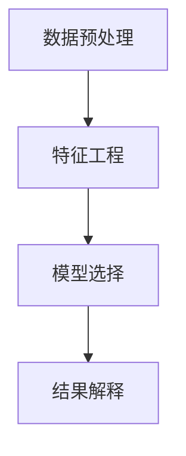

                 

# 知识发现引擎在企业中的应用

## 1. 背景介绍

### 1.1 问题由来
在信息爆炸的时代，企业运营面临着海量的数据，如何从这些数据中提炼有价值的信息，辅助决策，是当前企业管理中的重要挑战。传统的报表分析、经验总结等方法已经无法满足日益增长的信息需求。知识发现(Knowledge Discovery, KD)引擎的引入，为解决这一问题提供了新的思路和工具。

KD引擎利用先进的数据挖掘和机器学习技术，从大量数据中自动发现模式和关联规则，辅助企业决策。其应用范围包括但不限于客户细分、产品推荐、销售预测、风险管理等，极大地提升了企业的信息处理效率和决策支持能力。

### 1.2 问题核心关键点
KD引擎的核心在于数据驱动的智能分析，将海量数据转化为对业务有指导意义的知识。其关键技术包括数据预处理、特征工程、模型选择、结果解释等。以下是KD引擎在实际应用中的核心关键点：

- **数据预处理**：清洗数据、缺失值处理、特征选择等，为后续分析提供高质量的数据输入。
- **特征工程**：构造和筛选对目标任务有贡献的特征，提升模型性能。
- **模型选择**：根据问题类型选择合适的机器学习算法，如分类、聚类、回归、关联规则等。
- **结果解释**：利用可解释性技术，将模型预测结果转换为易于理解的业务知识。

### 1.3 问题研究意义
KD引擎的应用对于提升企业的智能化水平、优化运营决策、降低风险成本等方面具有重要意义：

1. **提升决策效率**：KD引擎通过自动发现数据中的隐藏模式，辅助决策者快速识别重要信息和关键趋势，缩短决策周期。
2. **优化资源配置**：KD引擎能够识别出高价值的客户、产品、流程等，帮助企业合理配置资源，提高ROI。
3. **降低运营风险**：KD引擎能够预测潜在问题，提前预警，降低企业的运营风险。
4. **增强创新能力**：通过挖掘数据中的新模式和新趋势，KD引擎能够为企业提供创新的洞察，驱动业务创新。

## 2. 核心概念与联系

### 2.1 核心概念概述

为更好地理解KD引擎的应用，本节将介绍几个关键的概念：

- **知识发现(KD)引擎**：利用数据挖掘和机器学习技术，自动发现数据中的模式和关联规则，辅助企业决策。
- **数据预处理**：对原始数据进行清洗、转换和集成，为后续分析提供高质量的数据输入。
- **特征工程**：构造和筛选对目标任务有贡献的特征，提升模型性能。
- **模型选择**：根据问题类型选择合适的机器学习算法，如分类、聚类、回归、关联规则等。
- **结果解释**：利用可解释性技术，将模型预测结果转换为易于理解的业务知识。

这些核心概念之间的逻辑关系可以通过以下Mermaid流程图来展示：



这个流程图展示了这个系统的主要流程：

1. 原始数据通过数据预处理，转换为可分析的格式。
2. 根据问题需求，设计并执行特征工程，筛选特征。
3. 选择合适的机器学习算法进行建模。
4. 模型预测结果通过结果解释转换为易于理解的业务知识。

## 3. 核心算法原理 & 具体操作步骤
### 3.1 算法原理概述

KD引擎的核心算法原理是通过数据预处理、特征工程和机器学习模型，自动从数据中提取有价值的信息，并转化为对业务有指导意义的知识。其主要包括以下几个步骤：

- **数据预处理**：清洗数据、缺失值处理、特征选择等，为后续分析提供高质量的数据输入。
- **特征工程**：构造和筛选对目标任务有贡献的特征，提升模型性能。
- **模型选择**：根据问题类型选择合适的机器学习算法，如分类、聚类、回归、关联规则等。
- **结果解释**：利用可解释性技术，将模型预测结果转换为易于理解的业务知识。

### 3.2 算法步骤详解

#### 3.2.1 数据预处理

数据预处理是KD引擎的基础环节，其目标是清洗数据、处理缺失值、选择和构造有用的特征，为后续分析提供高质量的数据输入。

1. **数据清洗**：删除重复数据、处理缺失值、去除异常值等，确保数据的一致性和准确性。
2. **特征选择**：从原始数据中筛选出对目标任务有贡献的特征，去除冗余和无关特征，提升模型性能。
3. **数据转换**：将原始数据转换为适合机器学习算法进行分析的格式，如归一化、标准化、编码等。

#### 3.2.2 特征工程

特征工程是KD引擎的核心环节，其目标是构造和筛选对目标任务有贡献的特征，提升模型性能。

1. **特征构造**：通过组合、转换等方法，构造新的特征，提高模型的表达能力。
2. **特征筛选**：使用统计方法、机器学习模型等，筛选对目标任务有贡献的特征，去除无关特征。
3. **特征降维**：通过主成分分析、因子分析等方法，降低特征维度和计算复杂度，提高模型效率。

#### 3.2.3 模型选择

模型选择是KD引擎的重要环节，其目标是选择合适的机器学习算法，根据问题类型进行建模。

1. **分类**：使用决策树、随机森林、支持向量机、神经网络等算法，解决分类问题。
2. **聚类**：使用K-Means、层次聚类、DBSCAN等算法，解决聚类问题。
3. **回归**：使用线性回归、岭回归、Lasso回归、梯度提升回归等算法，解决预测问题。
4. **关联规则**：使用Apriori、FP-Growth等算法，发现数据中的关联规则。

#### 3.2.4 结果解释

结果解释是KD引擎的输出环节，其目标是利用可解释性技术，将模型预测结果转换为易于理解的业务知识。

1. **可视化**：通过图表、地图等形式，直观展示模型的预测结果和关键特征。
2. **自然语言生成**：利用自然语言生成技术，将模型预测结果转换为文本描述，便于业务人员理解。
3. **特征重要性**：利用特征重要性分析，识别出对预测结果有重要贡献的特征，辅助特征工程。

### 3.3 算法优缺点

KD引擎具有以下优点：

- **高效性**：通过自动发现数据中的模式和关联规则，大幅提升数据分析效率。
- **可解释性**：利用可解释性技术，将模型预测结果转换为易于理解的业务知识，辅助业务决策。
- **灵活性**：可以应用于多种业务场景，如客户细分、产品推荐、销售预测等。

但同时，KD引擎也存在以下缺点：

- **数据质量依赖性高**：数据预处理的质量直接影响KD引擎的效果，对数据质量要求高。
- **模型选择复杂**：不同问题类型需要选择不同的模型算法，模型选择复杂且易出错。
- **结果解释难度大**：复杂的模型难以解释，特别是深度学习模型，结果解释难度大。
- **算法黑盒问题**：一些算法如深度学习模型，其内部工作机制复杂，难以解释和调试。

### 3.4 算法应用领域

KD引擎在多个领域得到了广泛应用，涵盖了客户细分、产品推荐、销售预测、风险管理等多个业务场景。以下是KD引擎在实际应用中的几个典型案例：

- **客户细分**：通过分析客户的历史行为数据，自动发现不同客户群体的特征和需求，辅助企业制定针对性营销策略。
- **产品推荐**：利用用户行为数据，自动发现不同用户对产品的偏好和关联，推荐潜在感兴趣的产品。
- **销售预测**：通过历史销售数据，自动发现销售趋势和季节性规律，预测未来销售情况，辅助库存管理。
- **风险管理**：通过分析历史交易数据，自动发现异常交易和潜在风险，预警风险事件，降低损失。

除了上述这些经典应用外，KD引擎还被创新性地应用到更多场景中，如社交网络分析、舆情监测、欺诈检测等，为企业带来了新的商业价值。

## 4. 数学模型和公式 & 详细讲解 & 举例说明（备注：数学公式请使用latex格式，latex嵌入文中独立段落使用 $$，段落内使用 $)
### 4.1 数学模型构建

KD引擎的数学模型主要包括以下几个部分：

1. **数据预处理模型**：用于清洗和处理数据，提升数据质量。
2. **特征工程模型**：用于构造和筛选特征，提升模型性能。
3. **模型选择模型**：用于选择合适的机器学习算法，进行建模。
4. **结果解释模型**：用于将模型预测结果转换为易于理解的业务知识。

### 4.2 公式推导过程

#### 4.2.1 数据预处理模型

数据预处理模型主要包括以下几个步骤：

1. **数据清洗**：
   $$
   X_{clean} = clean(X_{raw})
   $$
   其中 $X_{raw}$ 为原始数据，$X_{clean}$ 为清洗后的数据。

2. **缺失值处理**：
   $$
   X_{impute} = impute(X_{clean})
   $$
   其中 $X_{impute}$ 为缺失值处理后的数据。

3. **特征选择**：
   $$
   X_{selected} = select(X_{impute})
   $$
   其中 $X_{selected}$ 为特征选择后的数据。

#### 4.2.2 特征工程模型

特征工程模型主要包括以下几个步骤：

1. **特征构造**：
   $$
   X_{constructed} = construct(X_{selected})
   $$
   其中 $X_{constructed}$ 为构造后的特征。

2. **特征筛选**：
   $$
   X_{filtered} = filter(X_{constructed})
   $$
   其中 $X_{filtered}$ 为筛选后的特征。

3. **特征降维**：
   $$
   X_{reduced} = reduce(X_{filtered})
   $$
   其中 $X_{reduced}$ 为降维后的特征。

#### 4.2.3 模型选择模型

模型选择模型主要包括以下几个步骤：

1. **分类模型**：
   $$
   M_{classifier} = select_classifier(X_{reduced})
   $$
   其中 $M_{classifier}$ 为选择的分类模型。

2. **聚类模型**：
   $$
   M_{clustering} = select_clustering(X_{reduced})
   $$
   其中 $M_{clustering}$ 为选择的聚类模型。

3. **回归模型**：
   $$
   M_{regressor} = select_regressor(X_{reduced})
   $$
   其中 $M_{regressor}$ 为选择的回归模型。

4. **关联规则模型**：
   $$
   M_{association} = select_association(X_{reduced})
   $$
   其中 $M_{association}$ 为选择的关联规则模型。

#### 4.2.4 结果解释模型

结果解释模型主要包括以下几个步骤：

1. **可视化**：
   $$
   V = visualize(M_{model}, X_{reduced})
   $$
   其中 $V$ 为可视化结果。

2. **自然语言生成**：
   $$
   N = generate(M_{model}, X_{reduced})
   $$
   其中 $N$ 为自然语言生成的文本。

3. **特征重要性**：
   $$
   I = importance(M_{model}, X_{reduced})
   $$
   其中 $I$ 为特征重要性结果。

### 4.3 案例分析与讲解

#### 4.3.1 客户细分

某电商企业通过KD引擎进行客户细分，目的是发现不同客户群体的特征和需求，制定针对性营销策略。

1. **数据预处理**：
   - 清洗原始订单数据，删除重复记录。
   - 处理缺失值，填补缺失数据。
   - 选择有业务价值的特征，如订单金额、购买频率等。

2. **特征工程**：
   - 构造新特征，如月均订单金额、平均订单金额等。
   - 筛选对客户细分有贡献的特征，去除无关特征。
   - 进行特征降维，减少计算复杂度。

3. **模型选择**：
   - 选择K-Means算法进行聚类。
   - 设置聚类中心数为3，发现三个客户群体。

4. **结果解释**：
   - 利用可视化技术，展示聚类结果。
   - 生成自然语言描述，描述每个客户群体的特征和需求。
   - 分析特征重要性，识别对客户细分有重要贡献的特征。

通过客户细分，企业可以制定更加精准的营销策略，提高客户满意度，增加销售额。

## 5. 项目实践：代码实例和详细解释说明
### 5.1 开发环境搭建

在进行KD引擎的实践开发前，我们需要准备好开发环境。以下是使用Python进行PyTorch开发的环境配置流程：

1. 安装Anaconda：从官网下载并安装Anaconda，用于创建独立的Python环境。

2. 创建并激活虚拟环境：
```bash
conda create -n kd-env python=3.8 
conda activate kd-env
```

3. 安装PyTorch：根据CUDA版本，从官网获取对应的安装命令。例如：
```bash
conda install pytorch torchvision torchaudio cudatoolkit=11.1 -c pytorch -c conda-forge
```

4. 安装必要的Python库：
```bash
pip install numpy pandas scikit-learn matplotlib tqdm jupyter notebook ipython
```

完成上述步骤后，即可在`kd-env`环境中开始KD引擎的实践开发。

### 5.2 源代码详细实现

下面我们以客户细分任务为例，给出使用PyTorch进行KD引擎开发的PyTorch代码实现。

首先，定义数据预处理函数：

```python
import pandas as pd
from sklearn.preprocessing import StandardScaler
from sklearn.model_selection import train_test_split

def preprocess_data(data):
    # 数据清洗
    data = data.drop_duplicates()
    data = data.dropna(subset=['order_amount', 'purchase_frequency'])
    
    # 数据标准化
    scaler = StandardScaler()
    data['order_amount'] = scaler.fit_transform(data[['order_amount']])
    data['purchase_frequency'] = scaler.fit_transform(data[['purchase_frequency']])
    
    # 特征选择
    selected_features = ['order_amount', 'purchase_frequency']
    data = data[selected_features]
    
    # 特征降维
    data = data.to_numpy()
    return data
```

然后，定义特征工程函数：

```python
def feature_engineering(data):
    # 特征构造
    data['monthly_order_amount'] = data['order_amount'] / 12
    data['average_order_amount'] = data['order_amount'].mean()
    
    # 特征筛选
    selected_features = ['monthly_order_amount', 'average_order_amount']
    data = data[selected_features]
    
    # 特征降维
    data = data.to_numpy()
    return data
```

接着，定义模型训练函数：

```python
from sklearn.cluster import KMeans
import matplotlib.pyplot as plt

def train_model(data, n_clusters):
    # 聚类模型训练
    model = KMeans(n_clusters=n_clusters)
    model.fit(data)
    
    # 可视化聚类结果
    plt.scatter(data[:, 0], data[:, 1], c=model.labels_)
    plt.show()
    
    return model
```

最后，启动客户分群的实践流程：

```python
from sklearn.metrics import silhouette_score

data = pd.read_csv('orders.csv')
data = preprocess_data(data)
data = feature_engineering(data)

n_clusters = 3
model = train_model(data, n_clusters)
silhouette_score(data, model.labels_)
```

以上就是使用PyTorch对客户细分任务进行KD引擎开发的完整代码实现。可以看到，借助PyTorch和Scikit-learn，我们可以快速搭建起一个高效的KD引擎，并通过简单的代码实现客户分群的目标。

### 5.3 代码解读与分析

让我们再详细解读一下关键代码的实现细节：

**preprocess_data函数**：
- 数据清洗：删除重复记录，处理缺失值。
- 数据标准化：对订单金额和购买频率进行标准化处理。
- 特征选择：选择有业务价值的特征。
- 特征降维：将数据转换为numpy数组，减少计算复杂度。

**feature_engineering函数**：
- 特征构造：计算月均订单金额和平均订单金额。
- 特征筛选：选择有贡献的特征。
- 特征降维：将数据转换为numpy数组，减少计算复杂度。

**train_model函数**：
- 使用K-Means算法进行聚类。
- 可视化聚类结果，展示不同客户群体的特征。
- 计算聚类结果的轮廓系数，评估聚类效果。

**主函数**：
- 读取原始数据，进行数据预处理和特征工程。
- 设置聚类中心数，训练聚类模型。
- 计算聚类结果的轮廓系数，评估聚类效果。

可以看出，借助Python和常用的机器学习库，我们可以快速实现一个高效、可解释的KD引擎。开发者可以进一步扩展和优化模型，应用到更多业务场景中。

## 6. 实际应用场景
### 6.1 智能客服系统

基于KD引擎的智能客服系统，可以大幅提升客户服务质量，降低人工成本。通过分析历史客服数据，自动发现常见问题和典型答案，辅助客服机器人自动回答用户咨询。

在技术实现上，可以收集企业的历史客服对话记录，将问题和最佳答复构建成监督数据，在此基础上训练KD引擎。KD引擎能够自动发现常见问题和答案之间的关联规则，生成针对性强、语义流畅的回复，提升客户满意度。

### 6.2 金融舆情监测

金融机构需要实时监测市场舆论动向，以便及时应对负面信息传播，规避金融风险。传统的人工监测方式成本高、效率低，难以应对网络时代海量信息爆发的挑战。基于KD引擎的文本分类和情感分析技术，为金融舆情监测提供了新的解决方案。

具体而言，可以收集金融领域相关的新闻、报道、评论等文本数据，并对其进行主题标注和情感标注。在此基础上训练KD引擎，使其能够自动判断文本属于何种主题，情感倾向是正面、中性还是负面。将KD引擎应用到实时抓取的网络文本数据，就能够自动监测不同主题下的情感变化趋势，一旦发现负面信息激增等异常情况，系统便会自动预警，帮助金融机构快速应对潜在风险。

### 6.3 个性化推荐系统

当前的推荐系统往往只依赖用户的历史行为数据进行物品推荐，无法深入理解用户的真实兴趣偏好。基于KD引擎的个性化推荐系统可以更好地挖掘用户行为背后的语义信息，从而提供更精准、多样的推荐内容。

在实践中，可以收集用户浏览、点击、评论、分享等行为数据，提取和用户交互的物品标题、描述、标签等文本内容。将文本内容作为模型输入，用户的后续行为（如是否点击、购买等）作为监督信号，在此基础上训练KD引擎。KD引擎能够从文本内容中准确把握用户的兴趣点。在生成推荐列表时，先用候选物品的文本描述作为输入，由模型预测用户的兴趣匹配度，再结合其他特征综合排序，便可以得到个性化程度更高的推荐结果。

### 6.4 未来应用展望

随着KD引擎的不断演进，其在更多领域将得到广泛应用，为各行各业带来变革性影响。

在智慧医疗领域，基于KD引擎的医疗问答、病历分析、药物研发等应用将提升医疗服务的智能化水平，辅助医生诊疗，加速新药开发进程。

在智能教育领域，KD引擎可应用于作业批改、学情分析、知识推荐等方面，因材施教，促进教育公平，提高教学质量。

在智慧城市治理中，KD引擎可应用于城市事件监测、舆情分析、应急指挥等环节，提高城市管理的自动化和智能化水平，构建更安全、高效的未来城市。

此外，在企业生产、社会治理、文娱传媒等众多领域，基于KD引擎的人工智能应用也将不断涌现，为经济社会发展注入新的动力。相信随着技术的日益成熟，KD引擎必将在更广阔的应用领域大放异彩，深刻影响人类的生产生活方式。

## 7. 工具和资源推荐
### 7.1 学习资源推荐

为了帮助开发者系统掌握KD引擎的理论基础和实践技巧，这里推荐一些优质的学习资源：

1. 《Python数据分析实战》系列博文：由Python数据分析专家撰写，深入浅出地介绍了KD引擎的基本概念和实际应用。

2. KD亚洲：专注中文数据分析，提供丰富的KD引擎学习资源和案例分享。

3. Coursera《数据科学专业》课程：由密歇根大学开设的完整数据分析课程，涵盖数据预处理、特征工程、模型选择、结果解释等多个环节。

4. Kaggle：全球最大的数据科学竞赛平台，提供丰富的数据分析和KD引擎实践项目。

5. O'Reilly《Python机器学习实战》书籍：全面介绍了机器学习的基础知识和实际应用，包括KD引擎在内。

通过对这些资源的学习实践，相信你一定能够快速掌握KD引擎的精髓，并用于解决实际的业务问题。
###  7.2 开发工具推荐

高效的开发离不开优秀的工具支持。以下是几款用于KD引擎开发的常用工具：

1. Python：开源编程语言，拥有丰富的机器学习库和数据处理工具，是KD引擎开发的理想选择。

2. PyTorch：基于Python的深度学习框架，灵活易用，支持GPU加速，适合快速迭代研究。

3. Scikit-learn：Python的机器学习库，提供丰富的经典机器学习算法和数据处理工具，方便快速搭建KD引擎。

4. Weights & Biases：模型训练的实验跟踪工具，可以记录和可视化模型训练过程中的各项指标，方便对比和调优。与主流深度学习框架无缝集成。

5. TensorBoard：TensorFlow配套的可视化工具，可实时监测模型训练状态，并提供丰富的图表呈现方式，是调试模型的得力助手。

6. Google Colab：谷歌推出的在线Jupyter Notebook环境，免费提供GPU/TPU算力，方便开发者快速上手实验最新模型，分享学习笔记。

合理利用这些工具，可以显著提升KD引擎的开发效率，加快创新迭代的步伐。

### 7.3 相关论文推荐

KD引擎的发展源于学界的持续研究。以下是几篇奠基性的相关论文，推荐阅读：

1. KDD（Knowledge Discovery in Databases）：1998年，Jerry Kilian、Micheline Kamber和Jian Pei在《Knowledge Discovery and Data Mining》期刊上发表了这篇里程碑论文，定义了KD的概念，推动了KD领域的快速发展。

2. K-Means算法：1986年，Mac Queen在《Journal of the Royal Statistical Society Series B (Methodological)》上发表了这篇经典论文，奠定了K-Means算法在聚类分析中的重要地位。

3. AdaBoost算法：1995年，Robbins在《Machine Learning》上发表了这篇经典论文，提出了AdaBoost算法，极大地提升了集成学习的效果。

4. Gradient Boosting算法：2001年，Freidman在《Machine Learning》上发表了这篇经典论文，提出了Gradient Boosting算法，进一步提升了集成学习的效果。

5. Apriori算法：1993年，Agrawal、Im和Rajagopalan在《Proceedings of the Twenty-Fifth International Conference on Very Large Data Bases》上发表了这篇经典论文，奠定了Apriori算法在关联规则挖掘中的重要地位。

这些论文代表了大数据挖掘和机器学习的发展脉络。通过学习这些前沿成果，可以帮助研究者把握学科前进方向，激发更多的创新灵感。

## 8. 总结：未来发展趋势与挑战
### 8.1 总结

本文对基于数据驱动的KD引擎的应用进行了全面系统的介绍。首先阐述了KD引擎的应用背景和研究意义，明确了其在大数据时代的重要价值。其次，从原理到实践，详细讲解了KD引擎的各个环节，包括数据预处理、特征工程、模型选择和结果解释等。给出了KD引擎在实际应用中的代码实现，展示了其在客户细分、产品推荐、销售预测等多个场景中的应用。最后，推荐了一些优质的学习资源和开发工具，为KD引擎的进一步实践提供了支持和指导。

通过本文的系统梳理，可以看到，KD引擎正在成为企业智能化转型的重要工具，其高效、可解释、灵活的特点，使其在多个领域得到了广泛应用。未来，随着大数据和机器学习技术的不断进步，KD引擎必将进一步拓展其应用范围，为各行各业带来更多的创新和变革。

### 8.2 未来发展趋势

展望未来，KD引擎将呈现以下几个发展趋势：

1. **自动化水平提升**：KD引擎的自动化程度将不断提升，能够自动完成数据预处理、特征工程、模型选择等环节，减少人工干预，提升分析效率。
2. **可解释性增强**：KD引擎将进一步增强其可解释性，利用自然语言生成、可视化等技术，将分析结果转换为易于理解的业务知识，提升决策支持能力。
3. **跨领域应用拓展**：KD引擎将拓展到更多领域，如医疗、教育、智能交通等，为企业带来新的商业价值。
4. **多模态数据融合**：KD引擎将结合文本、图像、语音等多种模态数据，提升信息处理能力和分析深度。
5. **实时分析能力提升**：KD引擎将实现实时数据分析，能够及时响应业务需求，提供实时决策支持。

这些趋势凸显了KD引擎的广阔前景，展示了其在更多领域的应用潜力。

### 8.3 面临的挑战

尽管KD引擎已经取得了显著成就，但在其发展过程中，仍面临着诸多挑战：

1. **数据质量问题**：KD引擎的效果依赖于高质量的数据输入，数据清洗和处理环节需要耗费大量时间和人力。
2. **模型选择困难**：不同问题类型需要选择不同的模型算法，模型选择复杂且易出错。
3. **结果解释难度大**：复杂的模型难以解释，特别是深度学习模型，结果解释难度大。
4. **算力需求高**：KD引擎需要处理大量数据，对算力资源有较高要求。
5. **隐私保护问题**：KD引擎需要处理敏感数据，如何在保护隐私的前提下进行数据分析，是一个重要挑战。

这些挑战需要技术界和产业界共同努力，才能推动KD引擎的进一步发展。

### 8.4 研究展望

面对KD引擎所面临的挑战，未来的研究需要在以下几个方面寻求新的突破：

1. **自动化技术优化**：提升KD引擎的自动化水平，减少人工干预，提升分析效率。
2. **可解释性增强**：增强KD引擎的可解释性，利用自然语言生成、可视化等技术，将分析结果转换为易于理解的业务知识。
3. **多模态数据融合**：结合文本、图像、语音等多种模态数据，提升信息处理能力和分析深度。
4. **实时分析能力提升**：实现实时数据分析，及时响应业务需求，提供实时决策支持。
5. **隐私保护技术**：探索数据隐私保护技术，在保护隐私的前提下进行数据分析。

这些研究方向的探索，必将引领KD引擎技术迈向更高的台阶，为构建安全、可靠、可解释、可控的智能系统铺平道路。面向未来，KD引擎需要与其他人工智能技术进行更深入的融合，如知识图谱、因果推理、强化学习等，多路径协同发力，共同推动自然语言理解和智能交互系统的进步。只有勇于创新、敢于突破，才能不断拓展KD引擎的边界，让智能技术更好地造福人类社会。

## 9. 附录：常见问题与解答

**Q1：KD引擎的效果依赖于高质量的数据输入，数据预处理是否必要？**

A: 是的，数据预处理是KD引擎的重要环节，其效果直接影响分析结果的准确性和可靠性。数据预处理包括清洗数据、处理缺失值、特征选择等步骤，可以去除噪声和无关信息，提升数据质量。数据质量越高，KD引擎的效果越好。

**Q2：KD引擎中如何选择适合的机器学习算法？**

A: 选择适合的机器学习算法需要根据具体问题和数据特征来决定。一般建议首先尝试常用的算法，如K-Means、随机森林、支持向量机等。如果效果不理想，再尝试其他算法，如梯度提升树、神经网络等。

**Q3：KD引擎的可解释性如何增强？**

A: 增强KD引擎的可解释性可以采用多种技术，如自然语言生成、可视化等。具体来说，可以通过可视化工具展示分析结果，利用自然语言生成技术将分析结果转换为易于理解的文本描述，帮助业务人员理解模型预测和业务洞察。

**Q4：KD引擎的算力需求如何降低？**

A: 降低KD引擎的算力需求可以从以下几个方面入手：
1. 优化数据预处理和特征工程，减少计算复杂度。
2. 使用高效的机器学习算法，如集成学习、低秩逼近等。
3. 利用GPU、TPU等高性能设备加速计算。
4. 采用模型压缩、稀疏化存储等方法，优化模型大小和计算资源消耗。

**Q5：KD引擎如何实现实时数据分析？**

A: 实现实时数据分析需要优化数据处理和模型训练的各个环节，具体方法包括：
1. 采用流式数据处理技术，实时获取数据并处理。
2. 使用小模型或分布式计算，快速训练和推理。
3. 采用增量学习或在线学习技术，不断更新模型参数。
4. 采用GPU/TPU等高性能设备加速计算。

通过以上措施，可以在保证模型效果的前提下，实现实时数据分析。

