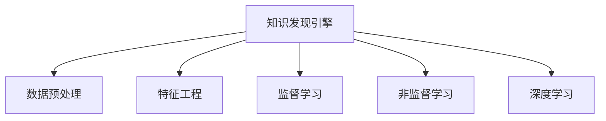

                 

# 知识发现引擎如何改变程序员的学习模式与方法

> 关键词：知识发现引擎, 数据挖掘, 数据科学, 机器学习, 深度学习, 程序员学习, 模式与方法

## 1. 背景介绍

### 1.1 问题由来
在过去的几十年中，计算机编程一直是程序员技能提升的主要来源。然而，随着技术的迅速发展，尤其是数据科学和机器学习的崛起，知识发现引擎（Knowledge Discovery Engine, KDE）正在迅速改变这一现状。

知识发现引擎，即KDE，是一种从大量数据中自动提取有价值知识的工具。它结合了数据挖掘、数据科学和机器学习，利用统计分析、模式识别和知识工程方法，从原始数据中挖掘出有用的信息。这对于程序员来说，意味着他们需要掌握更复杂的数据处理和分析技能，同时应用这些技能来提升编程能力。

### 1.2 问题核心关键点
本文旨在探讨知识发现引擎如何改变程序员的学习模式和方法，从以下几个方面入手：
1. **数据科学知识**：掌握数据预处理、特征工程、模型选择等基本技能。
2. **机器学习算法**：了解常用的监督学习和非监督学习算法，如回归、分类、聚类等。
3. **深度学习技术**：熟悉深度学习框架，如TensorFlow、PyTorch，掌握神经网络原理和应用。
4. **编程技能提升**：通过KDE项目实践，提高数据分析和编程能力。
5. **多学科融合**：综合应用数学、统计学、计算机科学等跨学科知识，解决实际问题。

### 1.3 问题研究意义
掌握知识发现引擎相关的知识和技能，对于程序员和数据科学家来说，具有重要意义：

1. **技能升级**：掌握数据分析和挖掘技能，提升编程能力，能处理更复杂的问题。
2. **数据驱动决策**：通过数据发现新的业务机会和挑战，做出更为科学的决策。
3. **跨领域应用**：将知识发现技术应用于多个行业领域，推动技术创新和业务优化。
4. **持续学习**：知识发现引擎和数据科学是一个快速发展的领域，持续学习才能跟上技术进步。

## 2. 核心概念与联系

### 2.1 核心概念概述

为更好地理解知识发现引擎如何改变程序员的学习模式与方法，本节将介绍几个密切相关的核心概念：

- **知识发现引擎(KDE)**：利用数据挖掘和机器学习方法，从大量数据中提取有用知识的工具。
- **数据预处理**：对原始数据进行清洗、转换、归一化等操作，使之适合分析。
- **特征工程**：从原始数据中提取、选择和构造特征，用于提高模型的性能。
- **监督学习(Supervised Learning)**：有标签的数据集上训练模型，用于分类、回归等任务。
- **非监督学习(Unsupervised Learning)**：无标签的数据集上训练模型，用于聚类、降维等任务。
- **深度学习(Deep Learning)**：多层神经网络，通过反向传播算法训练，用于复杂模式识别和预测。

这些核心概念之间的逻辑关系可以通过以下Mermaid流程图来展示：



这个流程图展示了许多核心概念及其之间的关系：

1. 知识发现引擎(KDE)以数据预处理、特征工程为基础。
2. KDE结合监督学习和非监督学习，选择合适的方法提取有用信息。
3. 深度学习作为KDE中的一种高级方法，可用于处理复杂数据和模式识别。

这些概念共同构成了知识发现引擎的核心工作流程，使得KDE成为数据科学和机器学习中不可或缺的工具。

## 3. 核心算法原理 & 具体操作步骤

### 3.1 算法原理概述

知识发现引擎的核心原理是基于统计学、机器学习和数据挖掘方法，从数据中提取和理解知识。其关键步骤包括数据预处理、特征工程、模型训练和结果解释。

### 3.2 算法步骤详解

知识发现引擎的实施通常分为以下几个步骤：

**Step 1: 数据预处理**
- 收集和整理原始数据，包括清洗、处理缺失值和异常值。
- 将数据转换为适用于分析的格式，如时间序列、数值型、文本型等。

**Step 2: 特征工程**
- 选择和构造有用的特征，如统计特征、时间特征、文本特征等。
- 对特征进行标准化、归一化，去除噪声和冗余信息。

**Step 3: 模型训练**
- 选择合适的机器学习模型，如线性回归、决策树、神经网络等。
- 使用训练集数据训练模型，并使用验证集数据进行调优。
- 应用交叉验证等技术，避免模型过拟合。

**Step 4: 结果解释和应用**
- 对模型预测结果进行解释和验证，检查模型的准确性和鲁棒性。
- 将模型应用于实际问题中，提取和应用发现的知识。

### 3.3 算法优缺点

知识发现引擎具有以下优点：
1. 自动化：自动提取和分析数据，减少人工干预。
2. 高准确性：通过选择合适的算法和参数，可以取得较高的模型精度。
3. 跨领域应用：适用于多个行业和领域，如金融、医疗、零售等。

同时，也存在一些缺点：
1. 数据依赖：依赖高质量和有标签的数据，数据质量直接影响结果。
2. 复杂度：算法复杂，需要较高的数学和统计学基础。
3. 解释性：黑盒模型难以解释内部决策逻辑，缺乏透明度。
4. 计算资源需求高：需要大量的计算资源进行训练和优化。

### 3.4 算法应用领域

知识发现引擎在多个领域都有广泛应用，以下是一些典型的应用场景：

- **金融风险评估**：通过分析历史交易数据，发现潜在的风险因素和市场趋势。
- **医疗诊断和治疗**：利用患者数据，提取疾病特征，辅助诊断和治疗决策。
- **市场分析和预测**：分析消费者行为，预测市场变化，制定营销策略。
- **客户关系管理**：通过分析客户数据，提高客户满意度和忠诚度。
- **工业生产优化**：监控生产数据，预测设备故障，优化生产流程。

这些应用场景展示了知识发现引擎在实际问题解决中的强大能力，以及其在多个行业中的广泛应用。

## 4. 数学模型和公式 & 详细讲解 & 举例说明

### 4.1 数学模型构建

知识发现引擎的数学模型构建通常基于以下几个核心步骤：

1. **数据预处理模型**：将原始数据转化为数值型或文本型，进行清洗和标准化。
2. **特征选择模型**：从数据中提取关键特征，如均值、方差、最大值等。
3. **模型训练模型**：选择合适的算法，如线性回归、决策树、神经网络，训练模型参数。
4. **结果解释模型**：使用模型进行预测，解释预测结果的含义。

### 4.2 公式推导过程

以下是知识发现引擎中常见的一些公式推导：

**线性回归模型**
$$
\min_{\theta} \frac{1}{2N} \sum_{i=1}^N (y_i - \theta_0 - \theta_1 x_i)^2
$$
其中 $\theta_0, \theta_1$ 为模型参数，$y_i, x_i$ 为训练样本的标签和特征值。

**决策树模型**
- 信息增益（ID3算法）：
$$
Gain(D, A) = \sum_{v=1}^{|V|} \frac{|D_v|}{|D|} \cdot (SplitInfo(D_v) - Pureness(D_v))
$$
其中 $D$ 为数据集，$A$ 为候选属性，$V$ 为属性值集合，$D_v$ 为属性 $A$ 取值 $v$ 的数据子集。

**神经网络模型**
- 反向传播算法：
$$
\frac{\partial E}{\partial \theta} = \frac{\partial E}{\partial L} \cdot \frac{\partial L}{\partial z} \cdot \frac{\partial z}{\partial \theta}
$$
其中 $E$ 为损失函数，$L$ 为输出层激活函数，$z$ 为前一层输出。

### 4.3 案例分析与讲解

以金融风险评估为例，展示知识发现引擎的应用过程：

**数据预处理**
- 收集历史交易数据，包括股票价格、交易量、时间戳等。
- 清洗数据，去除缺失值和异常值。
- 对时间序列数据进行差分和归一化。

**特征工程**
- 提取日收益率、波动率等统计特征。
- 添加技术指标，如MACD、RSI等。
- 使用PCA降维，减少特征数量。

**模型训练**
- 选择线性回归模型，训练模型参数。
- 使用交叉验证技术，避免过拟合。
- 计算模型的均方误差（MSE）和决定系数（R²），评估模型性能。

**结果解释**
- 分析模型的输出，预测未来股票价格。
- 识别潜在的风险因素，如市场波动、政策变化等。
- 基于预测结果，制定风险控制策略。

## 5. 项目实践：代码实例和详细解释说明

### 5.1 开发环境搭建

在进行知识发现引擎项目实践前，我们需要准备好开发环境。以下是使用Python进行PyTorch开发的环境配置流程：

1. 安装Anaconda：从官网下载并安装Anaconda，用于创建独立的Python环境。

2. 创建并激活虚拟环境：
```bash
conda create -n pytorch-env python=3.8 
conda activate pytorch-env
```

3. 安装PyTorch：根据CUDA版本，从官网获取对应的安装命令。例如：
```bash
conda install pytorch torchvision torchaudio cudatoolkit=11.1 -c pytorch -c conda-forge
```

4. 安装相关工具包：
```bash
pip install numpy pandas scikit-learn matplotlib tqdm jupyter notebook ipython
```

完成上述步骤后，即可在`pytorch-env`环境中开始项目实践。

### 5.2 源代码详细实现

下面我们以金融风险评估为例，给出使用PyTorch进行线性回归模型的代码实现。

首先，定义数据处理函数：

```python
import pandas as pd
import numpy as np

def load_data(file_path):
    data = pd.read_csv(file_path, index_col='Date')
    return data.dropna()

def preprocess_data(data):
    # 对数据进行归一化
    data = (data - data.mean()) / data.std()
    return data

def split_train_test(data, test_size=0.2, random_state=42):
    np.random.seed(random_state)
    train_idx = np.random.permutation(len(data))
    split_idx = int(len(train_idx) * test_size)
    train_data = data.iloc[train_idx[:split_idx]]
    test_data = data.iloc[train_idx[split_idx:]]
    return train_data, test_data
```

然后，定义模型和训练函数：

```python
import torch
import torch.nn as nn
import torch.optim as optim
from sklearn.model_selection import train_test_split

class LinearRegression(nn.Module):
    def __init__(self, input_size, output_size):
        super(LinearRegression, self).__init__()
        self.linear = nn.Linear(input_size, output_size)
    
    def forward(self, x):
        return self.linear(x)

def train_model(model, train_data, test_data, learning_rate=0.01, epochs=100):
    model.train()
    criterion = nn.MSELoss()
    optimizer = optim.SGD(model.parameters(), lr=learning_rate)
    
    for epoch in range(epochs):
        for i, (inputs, targets) in enumerate(train_data):
            inputs = inputs.to(device)
            targets = targets.to(device)
            
            optimizer.zero_grad()
            outputs = model(inputs)
            loss = criterion(outputs, targets)
            loss.backward()
            optimizer.step()
            
            if i % 100 == 0:
                print(f"Epoch [{epoch+1}/{epochs}], Step [{i+1}/{len(train_data)}], Loss: {loss.item():.4f}")
    
    print("Training complete.")
    model.eval()
    
    with torch.no_grad():
        test_loss = criterion(model(test_data.to(device)), test_data.target.to(device))
        print(f"Test Loss: {test_loss.item():.4f}")
```

最后，启动训练流程并在测试集上评估：

```python
# 加载数据
data = load_data('data.csv')
data = preprocess_data(data)

# 分割数据集
train_data, test_data = split_train_test(data)

# 定义模型
device = torch.device('cuda' if torch.cuda.is_available() else 'cpu')
model = LinearRegression(input_size=train_data.shape[1], output_size=1).to(device)

# 训练模型
train_model(model, train_data, test_data)

# 评估模型
test_data.to(device)
test_outputs = model(test_data)
test_loss = criterion(test_outputs, test_data.target).item()
print(f"Test Loss: {test_loss:.4f}")
```

以上就是使用PyTorch进行线性回归模型训练的完整代码实现。可以看到，得益于PyTorch的强大封装，我们能够以相对简洁的代码完成模型的训练和评估。

### 5.3 代码解读与分析

让我们再详细解读一下关键代码的实现细节：

**数据预处理函数**：
- `load_data`函数：加载CSV文件，以日期为索引。
- `preprocess_data`函数：对数据进行归一化，使用均值和标准差进行标准化。

**模型定义函数**：
- `LinearRegression`类：继承自`nn.Module`，定义线性回归模型。
- `forward`方法：实现前向传播，将输入数据通过线性层输出。

**训练函数**：
- `train_model`函数：定义训练过程，包括模型初始化、损失函数、优化器、训练循环等。
- 使用均方误差损失函数（MSE），Adam优化器进行训练。
- 在每个epoch结束时，输出当前epoch的训练损失。

**启动训练流程**：
- 加载数据，进行预处理和分割。
- 定义模型，指定输入和输出维度。
- 将模型迁移到GPU/TPU设备上，加快计算速度。
- 调用训练函数，输出训练和测试损失。

## 6. 实际应用场景

### 6.1 金融风险评估

金融风险评估是知识发现引擎的一个重要应用场景。通过分析历史交易数据，可以发现潜在的风险因素和市场趋势，从而帮助投资者做出更明智的决策。

在实际应用中，可以收集历史股票价格、交易量、财务指标等数据，将其进行预处理和特征工程。然后使用线性回归模型训练预测未来的股票价格波动，并识别潜在的风险因素。这种模型可以应用于股市预测、投资组合优化、资产管理等多个领域。

### 6.2 医疗诊断和治疗

医疗诊断和治疗是知识发现引擎的另一个重要应用场景。通过分析患者的医疗记录，可以发现疾病的特征和趋势，辅助医生进行诊断和治疗决策。

具体而言，可以收集患者的病历、检验报告、治疗方案等数据，将其进行预处理和特征工程。然后使用机器学习模型训练预测患者的病情和治疗效果，并辅助医生制定治疗方案。这种模型可以应用于疾病诊断、个性化治疗、医学研究等多个领域。

### 6.3 市场分析和预测

市场分析和预测是知识发现引擎在商业领域的重要应用。通过分析消费者行为和市场数据，可以发现市场趋势和需求变化，从而制定更有效的营销策略。

具体而言，可以收集消费者的购买记录、浏览历史、评价信息等数据，将其进行预处理和特征工程。然后使用模型训练预测未来的市场变化和消费者需求，并指导企业制定营销策略。这种模型可以应用于市场预测、消费者分析、产品定价等多个领域。

### 6.4 客户关系管理

客户关系管理是知识发现引擎在企业管理中的重要应用。通过分析客户数据，可以发现客户的特征和需求，从而提高客户满意度和忠诚度。

具体而言，可以收集客户的购买记录、服务评价、反馈信息等数据，将其进行预处理和特征工程。然后使用模型训练预测客户的行为和需求，并制定相应的客户管理策略。这种模型可以应用于客户细分、客户忠诚度管理、客户满意度提升等多个领域。

## 7. 工具和资源推荐

### 7.1 学习资源推荐

为了帮助开发者系统掌握知识发现引擎的相关知识和技能，这里推荐一些优质的学习资源：

1. **Coursera《数据科学基础》课程**：由斯坦福大学开设，涵盖数据预处理、特征工程、模型选择等基本技能，适合初学者。
2. **edX《机器学习基础》课程**：由MIT和哈佛大学联合开设，介绍监督学习和非监督学习的基本概念和算法，适合中级开发者。
3. **DeepLearning.AI《深度学习》课程**：由Andrew Ng和Ian Goodfellow等专家讲授，介绍深度学习的基本原理和应用，适合高级开发者。
4. **Kaggle竞赛**：参与数据科学和机器学习的竞赛，实战练习，积累经验。
5. **GitHub项目**：参与开源项目，学习先进的知识和技能。

通过对这些资源的学习实践，相信你一定能够系统掌握知识发现引擎的相关知识，并应用于解决实际问题。

### 7.2 开发工具推荐

高效的开发离不开优秀的工具支持。以下是几款用于知识发现引擎开发的常用工具：

1. **Python**：通用编程语言，生态丰富，支持数据处理和机器学习。
2. **PyTorch**：深度学习框架，灵活可扩展，支持分布式计算和GPU加速。
3. **Scikit-Learn**：机器学习库，提供多种算法实现，适合快速开发和验证。
4. **TensorFlow**：深度学习框架，支持多种算法和模型，适合大规模生产应用。
5. **Jupyter Notebook**：交互式编程环境，支持代码和注释混排，适合数据处理和模型训练。

合理利用这些工具，可以显著提升知识发现引擎的开发效率，加快创新迭代的步伐。

### 7.3 相关论文推荐

知识发现引擎和数据科学的研究源于学界的持续研究。以下是几篇奠基性的相关论文，推荐阅读：

1. **《On the Use of Knowledge in Intelligent Systems》**：由Edward Feigenbaum等人编写，介绍了知识工程的基本原理和方法。
2. **《Data Mining: Concepts and Techniques》**：由Jian Pei等人编写，涵盖了数据挖掘和知识发现的核心技术。
3. **《Pattern Recognition and Machine Learning》**：由Christopher Bishop编写，介绍了机器学习的基本概念和算法。
4. **《Deep Learning》**：由Ian Goodfellow等人编写，介绍了深度学习的基本原理和应用。
5. **《Practical Recommender Systems》**：由Jakob Heymann-Tran等人编写，介绍了推荐系统设计和优化的技术。

这些论文代表了大数据挖掘和知识发现的最新进展，通过学习这些前沿成果，可以帮助研究者把握学科前进方向，激发更多的创新灵感。

## 8. 总结：未来发展趋势与挑战

### 8.1 总结

本文对知识发现引擎如何改变程序员的学习模式与方法进行了全面系统的介绍。首先阐述了知识发现引擎在数据科学和机器学习中的核心地位，以及其对程序员技能提升的重要性。其次，从原理到实践，详细讲解了知识发现引擎的数学模型和实现步骤，给出了知识发现引擎项目开发的完整代码实例。同时，本文还广泛探讨了知识发现引擎在金融风险评估、医疗诊断和治疗、市场分析和预测、客户关系管理等多个行业领域的应用前景，展示了其广泛的应用范围。

通过本文的系统梳理，可以看到，知识发现引擎正在成为数据科学和机器学习的重要工具，极大地拓展了数据挖掘和分析能力，为程序员和数据科学家提供了新的解决思路和技能提升途径。未来，伴随数据科学和机器学习的持续演进，知识发现引擎必将在更多领域发挥作用，为各行业带来深远影响。

### 8.2 未来发展趋势

展望未来，知识发现引擎的发展将呈现以下几个趋势：

1. **自动化与智能化**：知识发现引擎将进一步自动化和智能化，自动进行数据清洗、特征选择和模型训练，提高效率和精度。
2. **多模态融合**：结合文本、图像、音频等多模态数据，提升对复杂问题的理解能力。
3. **跨领域应用**：知识发现引擎将广泛应用于金融、医疗、零售等多个领域，推动跨学科创新。
4. **实时处理**：利用流数据处理技术，实现对实时数据的分析和预测。
5. **因果推理**：引入因果推理方法，提高模型的解释性和可靠性。
6. **透明性与可信性**：增强模型的透明性和可信性，避免“黑箱”问题，提高应用的可解释性和可验证性。

以上趋势凸显了知识发现引擎的广阔前景。这些方向的探索发展，必将进一步提升数据挖掘和分析能力，为各行业带来更多的价值。

### 8.3 面临的挑战

尽管知识发现引擎在数据科学和机器学习中已经取得了瞩目成就，但在迈向更加智能化、普适化应用的过程中，它仍面临诸多挑战：

1. **数据质量与多样性**：数据质量和多样性直接影响知识发现的效果，如何获取高质量和广泛的数据是一个重要挑战。
2. **计算资源与效率**：大数据和深度学习模型的计算需求高，如何优化计算资源使用，提升计算效率，是一个关键问题。
3. **模型可解释性**：复杂模型难以解释内部决策逻辑，如何增强模型的透明性和可解释性，是一个重要研究方向。
4. **数据隐私与安全**：数据隐私和安全问题日益严重，如何保护数据隐私，确保数据安全，是一个重要课题。
5. **跨学科融合**：数据科学和机器学习需要与多个学科结合，如何跨学科融合，提高应用价值，是一个重要挑战。

正视知识发现引擎面临的这些挑战，积极应对并寻求突破，将使知识发现引擎技术走向成熟，为数据科学和机器学习的发展做出更大贡献。

### 8.4 研究展望

面对知识发现引擎面临的挑战，未来的研究需要在以下几个方面寻求新的突破：

1. **数据清洗与预处理**：研发更高效的数据清洗和预处理技术，提高数据质量和多样性。
2. **高效计算技术**：探索更高效的计算方法，如分布式计算、混合精度计算、模型压缩等，提升计算效率。
3. **模型解释性**：研发更透明和可解释的模型，如LIME、SHAP等，提高模型可信性。
4. **数据隐私与安全**：研发数据隐私保护技术，如差分隐私、联邦学习等，确保数据安全。
5. **跨学科融合**：加强跨学科合作，推动数据科学和机器学习与其他学科结合，提高应用价值。

这些研究方向的探索，将引领知识发现引擎技术迈向更高的台阶，为数据科学和机器学习的发展带来更多突破。

## 9. 附录：常见问题与解答

**Q1: 知识发现引擎如何应用于实际问题？**

A: 知识发现引擎可以应用于多个实际问题，如金融风险评估、医疗诊断和治疗、市场分析和预测、客户关系管理等。通过收集相关数据，进行预处理和特征工程，选择合适的模型进行训练和预测，从而解决实际问题。

**Q2: 学习知识发现引擎需要哪些数学和统计学知识？**

A: 学习知识发现引擎需要掌握基本的数学和统计学知识，如概率论、统计学、线性代数、微积分等。此外，还需要了解数据预处理、特征工程、模型训练和评估等技术细节。

**Q3: 如何选择合适的知识发现算法？**

A: 选择合适的知识发现算法需要考虑数据类型、问题类型和模型性能等因素。常用的算法包括线性回归、决策树、支持向量机、神经网络等。根据具体问题和数据特点，选择合适的算法，并进行模型调优。

**Q4: 知识发现引擎在实际应用中面临哪些挑战？**

A: 知识发现引擎在实际应用中面临数据质量、计算资源、模型解释性、数据隐私等挑战。需要研发更高效的数据清洗和预处理技术、更高效的计算方法、更透明和可解释的模型，以及保护数据隐私的技术，才能更好地应对这些挑战。

**Q5: 知识发现引擎的未来发展方向是什么？**

A: 知识发现引擎的未来发展方向包括自动化与智能化、多模态融合、跨领域应用、实时处理、因果推理、透明性与可信性等。通过研发更先进的技术和算法，提高知识发现引擎的应用价值和可信性。

通过本文的系统梳理，可以看到，知识发现引擎正在成为数据科学和机器学习的重要工具，极大地拓展了数据挖掘和分析能力，为程序员和数据科学家提供了新的解决思路和技能提升途径。未来，伴随数据科学和机器学习的持续演进，知识发现引擎必将在更多领域发挥作用，为各行业带来深远影响。

