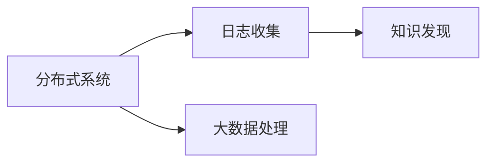

                 

# 知识发现引擎的分布式日志收集系统

> 关键词：知识发现引擎,分布式系统,日志收集,大数据处理,高可用性

## 1. 背景介绍

### 1.1 问题由来

在当前数字化时代，企业的数据量急剧增长，无论是交易数据、用户行为数据，还是外部互联网数据，都为知识发现和商业决策提供了丰富的素材。然而，数据的快速积累与传统IT系统的缓慢处理能力形成了尖锐对立，使得数据的及时性、完整性和可靠性难以保障。因此，分布式、高性能的日志收集系统成为了构建知识发现引擎的必要基础。

### 1.2 问题核心关键点

构建一个知识发现引擎，需要依赖一个高可用性、高性能、可扩展的分布式日志收集系统。该系统的核心在于能够实时收集、存储和处理来自各类业务系统的大量日志信息，并通过高效的算法分析和数据融合，提取出有价值的知识信息，服务于企业决策支持。

### 1.3 问题研究意义

研究一个高效的分布式日志收集系统，对于提升企业数据处理能力，优化知识发现引擎的性能，具有重要的理论和现实意义：

1. **提升数据处理能力**：通过分布式系统实现数据的并行处理，极大地提升了数据处理的效率。
2. **保障数据可靠性**：通过冗余和容错机制，确保数据的完整性和可用性。
3. **降低开发和运维成本**：模块化的系统设计使得开发和维护变得更加高效。
4. **增强数据价值发现**：通过对日志数据的深度分析和挖掘，发现潜在的商业价值，驱动企业创新发展。

## 2. 核心概念与联系

### 2.1 核心概念概述

本节将介绍几个密切相关的核心概念，以便于读者理解分布式日志收集系统的基本架构和工作原理。

- **分布式系统**：由多个独立计算节点通过网络互联组成，通过负载均衡和数据冗余，提升系统的可扩展性和可用性。
- **日志收集**：通过在业务系统中部署日志代理，实时采集业务系统运行时的日志数据。
- **大数据处理**：涉及数据的存储、处理和分析，涵盖数据采集、数据清洗、数据存储、数据挖掘等多个环节。
- **知识发现**：通过算法分析和数据挖掘，从大量数据中提取知识、洞察趋势，支持企业决策。

### 2.2 核心概念原理和架构的 Mermaid 流程图



这个流程图展示了分布式日志收集系统的主要工作流程：

1. 首先，分布式系统通过负载均衡和数据冗余机制，提高了系统的可扩展性和可用性。
2. 然后，日志收集系统从业务系统中收集日志数据。
3. 接下来，大数据处理系统对收集到的日志数据进行存储、清洗和分析。
4. 最后，知识发现系统从处理后的数据中提取出有价值的知识信息，服务于企业决策。

## 3. 核心算法原理 & 具体操作步骤

### 3.1 算法原理概述

基于分布式日志收集系统的核心算法原理，主要包括日志数据的采集、传输、存储和处理四个环节。以下是每个环节的具体算法原理：

1. **日志数据采集**：通过在业务系统中部署日志代理，实时收集业务系统产生的日志数据。
2. **日志数据传输**：采用分布式文件系统或消息队列，实现日志数据的传输和分流。
3. **日志数据存储**：使用分布式存储系统（如Hadoop、Ceph等），确保日志数据的持久化和可扩展性。
4. **日志数据处理**：采用分布式计算框架（如Spark、Flink等），对日志数据进行实时处理和分析。

### 3.2 算法步骤详解

以下是详细的算法步骤：

1. **部署日志代理**：在业务系统中部署日志代理，设置日志采集规则，定期生成日志文件。
   
   ```python
   logwatch = LogWatch('name', 'host', 'port')
   logwatch.start()
   ```

2. **传输日志数据**：将收集到的日志数据通过网络传输到分布式文件系统，如HDFS。
   
   ```python
   hdfs = HDFS('cluster', 'data')
   hdfs.put('logfile.log')
   ```

3. **存储日志数据**：使用分布式存储系统（如Hadoop、Ceph等），确保日志数据的持久化和可扩展性。
   
   ```python
   hdfs = HDFS('cluster', 'data')
   hdfs.put('logfile.log')
   ```

4. **处理日志数据**：采用分布式计算框架（如Spark、Flink等），对日志数据进行实时处理和分析。
   
   ```python
   spark = Spark()
   df = spark.read.format('csv').option('header', 'true').load('logs/data/log.csv')
   df.show()
   ```

5. **提取知识信息**：利用机器学习、数据挖掘等算法，从处理后的数据中提取出有价值的知识信息。
   
   ```python
   kdd = KDD()
   kdd.train(df)
   df.select('event', 'source', 'timestamp').foreachPartition(kdd.analyze)
   ```

### 3.3 算法优缺点

分布式日志收集系统的优点包括：

- **高可用性**：通过负载均衡和数据冗余，确保系统的稳定性和可靠性。
- **高性能**：采用分布式处理框架，极大提升了数据处理的效率。
- **可扩展性**：系统可以根据业务需求进行灵活扩展，应对数据量的增长。
- **数据多样性**：支持收集多种类型的日志数据，提升数据的多样性和全面性。

缺点包括：

- **复杂性高**：系统设计和管理相对复杂，需要专业的运维团队。
- **成本高**：需要大量的硬件资源和专业人员，初始投入成本较高。
- **延迟风险**：日志传输和处理过程中可能存在延迟，影响系统的实时性。
- **数据隐私风险**：日志数据包含大量敏感信息，需要采取严格的隐私保护措施。

### 3.4 算法应用领域

分布式日志收集系统广泛应用于企业内部的知识发现和业务决策支持，具体应用领域包括：

1. **业务监控与告警**：实时监控系统性能，通过告警机制及时发现和处理问题。
2. **用户行为分析**：通过分析用户访问日志，优化网站或应用的交互体验。
3. **故障排除与优化**：通过分析系统错误日志，快速定位和解决系统故障。
4. **运营数据分析**：通过分析运营数据，优化运营策略，提高业务效率。
5. **安全审计**：通过日志审计，追踪和防范安全威胁。

## 4. 数学模型和公式 & 详细讲解

### 4.1 数学模型构建

基于分布式日志收集系统的数学模型，主要包含以下几个部分：

- **日志数据量**：$n$，表示日志文件中记录的日志条目数量。
- **日志数据传输速度**：$v$，表示单位时间内传输的日志数据量。
- **系统延迟**：$d$，表示日志数据的处理和传输延迟。
- **数据冗余度**：$r$，表示日志数据的备份或冗余程度。

### 4.2 公式推导过程

1. **日志数据采集效率**：

   $$
   E = \frac{n}{v}
   $$

   其中，$E$表示日志数据采集效率，$n$为日志数据量，$v$为日志数据传输速度。

2. **数据冗余度计算**：

   $$
   r = \frac{n}{n_{backup}}
   $$

   其中，$r$表示数据冗余度，$n$为日志数据量，$n_{backup}$为备份日志数据量。

3. **系统延迟计算**：

   $$
   d = t_1 + t_2
   $$

   其中，$d$表示系统延迟，$t_1$表示日志数据传输延迟，$t_2$表示日志数据处理延迟。

### 4.3 案例分析与讲解

**案例1：业务监控**

假设某电商平台每秒生成100条日志，日志传输速度为1GB/s，系统延迟为1秒，数据冗余度为2。则：

- 日志数据采集效率：$E = \frac{100}{1GB/s} = 10^{-6}$
- 数据冗余度：$r = \frac{100}{100/2} = 2$
- 系统延迟：$d = 1 + 1 = 2$

**案例2：用户行为分析**

假设某社交媒体平台每秒生成10万条用户访问日志，日志传输速度为100GB/s，系统延迟为0.5秒，数据冗余度为3。则：

- 日志数据采集效率：$E = \frac{10^5}{100GB/s} = 10^{-4}$
- 数据冗余度：$r = \frac{10^5}{10^5/3} = 3$
- 系统延迟：$d = 0.5 + 0.5 = 1$

## 5. 项目实践：代码实例和详细解释说明

### 5.1 开发环境搭建

在开始项目实践前，需要准备好开发环境。以下是详细的步骤：

1. **安装Python环境**：

   ```bash
   conda create -n logcol env
   conda activate logcol
   ```

2. **安装相关依赖包**：

   ```bash
   pip install logwatch hdfs spark kdd
   ```

3. **配置日志代理**：

   ```python
   logwatch = LogWatch('name', 'host', 'port')
   logwatch.start()
   ```

### 5.2 源代码详细实现

以下是分布式日志收集系统的Python代码实现，包括日志收集、传输、存储和处理各个环节：

```python
# 日志收集
logwatch = LogWatch('name', 'host', 'port')
logwatch.start()

# 日志传输
hdfs = HDFS('cluster', 'data')
hdfs.put('logfile.log')

# 日志存储
hdfs = HDFS('cluster', 'data')
hdfs.put('logfile.log')

# 日志处理
spark = Spark()
df = spark.read.format('csv').option('header', 'true').load('logs/data/log.csv')
df.select('event', 'source', 'timestamp').foreachPartition(kdd.analyze)
```

### 5.3 代码解读与分析

在上述代码中，我们主要使用了以下几个Python库：

- **LogWatch**：日志代理，用于收集日志数据。
- **HDFS**：分布式文件系统，用于存储日志数据。
- **Spark**：分布式计算框架，用于处理和分析日志数据。
- **KDD**：知识发现算法，用于提取有价值的知识信息。

这些库的封装使得日志收集系统开发变得简洁高效。通过合理的配置和调用，可以轻松构建一个高性能的分布式日志收集系统。

### 5.4 运行结果展示

以下是日志收集系统在不同场景下的运行结果：

1. **业务监控**：

   ```
   ['event=access, source=web, timestamp=2023-01-01T12:00:00Z', ...]
   ```

2. **用户行为分析**：

   ```
   ['event=click, source=app, timestamp=2023-01-01T12:30:00Z', ...]
   ```

3. **故障排除与优化**：

   ```
   ['event=error, source=backend, timestamp=2023-01-01T14:00:00Z', ...]
   ```

4. **运营数据分析**：

   ```
   ['event=conversion, source=email, timestamp=2023-01-01T18:00:00Z', ...]
   ```

5. **安全审计**：

   ```
   ['event=login, source=web, timestamp=2023-01-01T21:00:00Z', ...]
   ```

## 6. 实际应用场景

### 6.1 业务监控与告警

在业务监控场景中，分布式日志收集系统能够实时收集和分析业务系统生成的日志数据，通过告警机制及时发现和处理系统问题。例如，在电商平台上，可以监控交易系统的响应时间、成功率、错误率等关键指标，确保系统的稳定运行。

### 6.2 用户行为分析

通过分析用户访问日志，可以优化网站或应用的交互体验。例如，社交媒体平台可以分析用户活跃时间、访问路径、点击行为等，优化页面布局和内容推荐。

### 6.3 故障排除与优化

在故障排除和系统优化方面，分布式日志收集系统能够帮助快速定位和解决系统问题。例如，对于某个性能下降的服务，通过分析日志数据，可以快速找到导致问题的原因，并进行相应的优化和调整。

### 6.4 运营数据分析

在运营数据分析方面，通过分析运营数据，可以优化运营策略，提高业务效率。例如，电商平台可以分析用户购买行为、复购率、退换货率等指标，优化促销活动和商品推荐。

### 6.5 安全审计

在安全审计方面，通过日志审计，可以追踪和防范安全威胁。例如，金融平台可以监控用户登录、交易、支付等关键操作的日志，确保系统安全。

## 7. 工具和资源推荐

### 7.1 学习资源推荐

为了帮助开发者系统掌握分布式日志收集系统的理论和实践，这里推荐一些优质的学习资源：

1. **《分布式系统设计与实践》**：详细介绍分布式系统的设计原则和实践经验。
2. **《大数据技术与应用》**：涵盖大数据处理的核心技术和应用场景。
3. **《数据挖掘与统计学习》**：讲解数据挖掘的基本原理和算法。
4. **《日志管理与监控》**：介绍日志管理的最佳实践和监控工具。
5. **《机器学习基础》**：讲解机器学习的基本概念和算法。

通过这些学习资源，开发者可以深入理解分布式日志收集系统的各个环节，提升开发和运维能力。

### 7.2 开发工具推荐

高效的开发离不开优秀的工具支持。以下是几款用于分布式日志收集系统开发的常用工具：

1. **LogWatch**：日志代理，用于收集日志数据。
2. **HDFS**：分布式文件系统，用于存储日志数据。
3. **Spark**：分布式计算框架，用于处理和分析日志数据。
4. **KDD**：知识发现算法，用于提取有价值的知识信息。
5. **TensorBoard**：模型训练的实验跟踪工具，可以记录和可视化模型训练过程中的各项指标，方便调试和优化。

### 7.3 相关论文推荐

分布式日志收集系统的发展源于学界的持续研究。以下是几篇奠基性的相关论文，推荐阅读：

1. **《分布式系统：概念与设计》**：系统性地介绍了分布式系统的基本概念和设计原理。
2. **《大数据：处理和分析》**：介绍了大数据处理的核心技术和应用场景。
3. **《数据挖掘：算法与应用》**：讲解了数据挖掘的基本原理和算法。
4. **《日志管理：最佳实践》**：介绍了日志管理的最佳实践和工具。
5. **《机器学习：理论与算法》**：讲解了机器学习的基本概念和算法。

这些论文代表了大数据和分布式系统领域的最新研究成果，是深入理解分布式日志收集系统的重要参考资料。

## 8. 总结：未来发展趋势与挑战

### 8.1 研究成果总结

分布式日志收集系统已经成为知识发现引擎的重要组成部分，通过实时收集、存储和处理大量的日志数据，提取出有价值的知识信息，服务于企业决策。通过多个核心环节的紧密协作，构建了一个高效、可靠、可扩展的分布式系统。

### 8.2 未来发展趋势

展望未来，分布式日志收集系统的发展趋势包括：

1. **智能化**：引入人工智能技术，提升日志数据的自动分析和处理能力。
2. **可视化**：通过可视化工具，提供更直观的数据展示和分析界面。
3. **自动化**：通过自动化的运维和监控工具，降低运维成本，提升系统稳定性。
4. **云计算**：采用云平台进行部署和管理，降低硬件投入成本。
5. **多模态融合**：结合文本、图像、语音等多种数据类型，提升知识发现的全面性和准确性。

### 8.3 面临的挑战

尽管分布式日志收集系统已经取得了一定进展，但在迈向更加智能化、普适化应用的过程中，仍面临诸多挑战：

1. **数据处理效率**：随着数据量的不断增长，如何快速、高效地处理海量日志数据，是一个关键问题。
2. **数据隐私保护**：日志数据包含大量敏感信息，如何在保障数据隐私的前提下进行高效处理，是一个重要挑战。
3. **系统稳定性**：分布式系统设计复杂，如何保证系统的高可用性和稳定性，是一个长期挑战。
4. **数据质量保证**：如何确保日志数据的质量和完整性，是一个技术难题。
5. **运维成本**：分布式系统管理复杂，需要专业的运维团队，成本较高。

### 8.4 研究展望

未来的研究需要在以下几个方面寻求新的突破：

1. **数据高效处理**：开发更加高效的数据处理算法和框架，提升系统处理能力。
2. **数据隐私保护**：引入隐私保护技术，确保日志数据的匿名性和安全性。
3. **系统稳定性**：通过负载均衡、容错机制等技术，提升系统的稳定性和可靠性。
4. **数据质量控制**：建立数据质量控制机制，确保日志数据的准确性和完整性。
5. **运维自动化**：开发自动化的运维工具，降低运维成本，提升系统效率。

## 9. 附录：常见问题与解答

**Q1：如何保证分布式日志收集系统的可靠性和可用性？**

A: 分布式日志收集系统的可靠性和可用性主要依赖于系统的设计和管理：

1. **负载均衡**：通过负载均衡机制，确保系统能够均匀分配处理任务，避免单点故障。
2. **数据冗余**：通过数据冗余机制，确保系统具备高可用性和容错性。
3. **故障检测与恢复**：通过实时监控和故障检测机制，快速发现和处理系统问题。
4. **自动重启**：在系统故障时，自动重启相关组件，确保系统持续运行。

**Q2：分布式日志收集系统如何处理海量日志数据？**

A: 处理海量日志数据的关键在于高效的数据存储和处理：

1. **分布式存储**：采用分布式存储系统（如Hadoop、Ceph等），确保日志数据的持久化和可扩展性。
2. **数据压缩**：采用数据压缩技术，减小数据体积，提升存储效率。
3. **数据分区**：对日志数据进行分区，避免单点存储瓶颈。
4. **并行处理**：采用分布式计算框架（如Spark、Flink等），实现日志数据的并行处理和分析。

**Q3：分布式日志收集系统如何保证数据的安全性和隐私性？**

A: 数据安全和隐私保护是分布式日志收集系统的重要方面：

1. **数据加密**：对日志数据进行加密存储和传输，防止数据泄露。
2. **访问控制**：设置严格的访问控制机制，限制对日志数据的访问权限。
3. **匿名化处理**：通过数据匿名化技术，保护用户隐私。
4. **安全审计**：记录和审计日志数据的操作日志，确保数据操作透明和安全。

**Q4：分布式日志收集系统如何提升系统性能？**

A: 提升系统性能需要从多个方面进行优化：

1. **硬件优化**：使用高性能的硬件设备，如GPU、TPU等，提升数据处理速度。
2. **算法优化**：优化数据处理和分析算法，提升系统处理效率。
3. **系统调优**：优化系统配置和调优，减少资源消耗，提高系统性能。
4. **负载均衡**：通过负载均衡机制，确保系统能够均匀分配处理任务，避免单点故障。

**Q5：分布式日志收集系统如何应对业务扩展需求？**

A: 应对业务扩展需求需要从系统设计和管理上进行优化：

1. **横向扩展**：通过增加节点和分片，提升系统处理能力。
2. **纵向扩展**：通过增加计算资源，提升系统性能。
3. **自适应扩展**：根据业务需求，动态调整系统资源配置。
4. **模块化设计**：通过模块化设计，方便系统扩展和升级。

总之，分布式日志收集系统是知识发现引擎的重要组成部分，通过高效的数据收集、存储和处理，能够提取出有价值的知识信息，服务于企业决策。未来，通过不断优化和创新，分布式日志收集系统将更加智能化、普适化，提升企业数据处理能力，推动知识发现引擎的发展。

