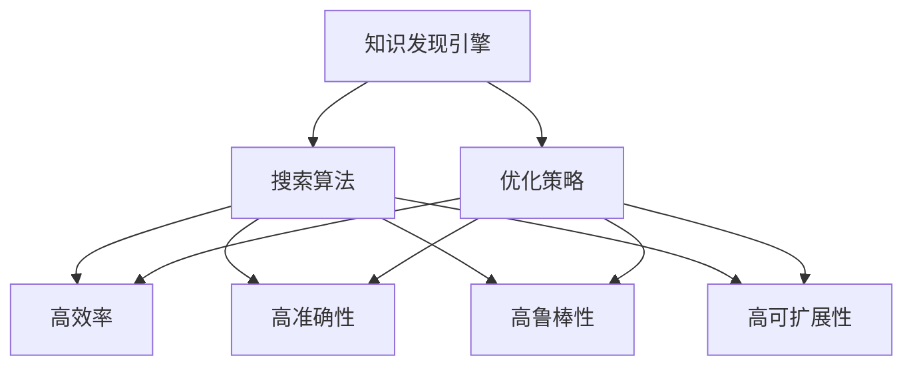

                 

# 知识发现引擎的搜索优化策略

在现代社会，信息爆炸已成常态，如何从海量数据中高效准确地发现知识，成为信息科学领域的关键课题。知识发现引擎(Knowledge Discovery Engine, KDE)应运而生，它通过智能算法和高效架构，从大数据中自动挖掘和发现知识模式，辅助决策分析，提供智能建议。本文聚焦于知识发现引擎的搜索优化策略，以数据为中心，全面解析搜索优化的原理、方法和实践，旨在构建更高效、更可靠的知识发现引擎。

## 1. 背景介绍

### 1.1 问题由来
随着信息技术的飞速发展，各种形式的数据迅速增加，从传统结构化数据到新兴的无结构化数据，如文本、图像、视频等，使数据量呈现出指数级增长。面对如此庞杂的数据集，人类依赖传统数据处理方式已经力不从心。而知识发现引擎的出现，使得机器能够从数据中自动挖掘知识，辅助人类进行决策和分析，从而提升信息处理的效率和效果。

知识发现引擎的应用范围广泛，包括商业智能、金融分析、医疗诊断、社交网络分析等众多领域。例如，在商业智能领域，企业通过知识发现引擎可以从大量销售数据、客户反馈中挖掘出有价值的模式和趋势，从而优化营销策略，提高运营效率。在金融领域，知识发现引擎可以从历史交易数据中发现潜在的交易模式和风险信号，帮助机构预测市场走向，防范金融风险。

### 1.2 问题核心关键点
知识发现引擎的核心在于其搜索算法和优化策略。传统的搜索算法如深度优先搜索(DFS)、广度优先搜索(BFS)、贪心算法等，在处理大规模数据集时，往往面临效率低下、内存占用过大的问题。而高效的搜索优化策略则能显著提升知识发现引擎的性能和可用性。

具体来说，高效搜索优化策略需要满足以下要求：
1. **高效率**：在有限的计算资源和时间限制下，快速搜索和挖掘数据中的知识模式。
2. **高准确性**：准确识别出有价值的模式和规律，减少误报和漏报。
3. **高鲁棒性**：对数据的变化和噪声具有一定的鲁棒性，避免因数据波动而影响搜索结果。
4. **高可扩展性**：能够灵活应对不同规模和类型的复杂数据集。

## 2. 核心概念与联系

### 2.1 核心概念概述

为更好地理解知识发现引擎的搜索优化策略，本节将介绍几个关键概念及其相互关系：

- **知识发现引擎(KDE)**：一种能够从数据中自动挖掘和发现知识模式的技术，辅助决策分析和智能建议。常见的KDE包括关联规则挖掘、分类、聚类、异常检测等。

- **搜索算法**：从数据集中搜索和发现知识模式的基本方法。常用的搜索算法包括深度优先搜索(DFS)、广度优先搜索(BFS)、贪心算法等。

- **优化策略**：为了提高搜索效率和准确性，在搜索算法基础上采用的一系列改进措施。如启发式算法、剪枝策略、增量更新等。

- **数据集**：包含待挖掘知识的数据集合，可以是结构化数据、非结构化数据或混合数据。

- **计算资源**：用于知识发现引擎运行的硬件和软件资源，如CPU、GPU、内存等。

- **实时性**：知识发现引擎在发现新知识时的响应速度，通常要求快速高效。

- **可解释性**：搜索结果的可解释性，即通过何种方式解释和展示搜索结果，以帮助用户理解和使用。

这些核心概念之间的逻辑关系可以通过以下Mermaid流程图来展示：



这个流程图展示了知识发现引擎的关键组件及其相互关系：

1. 知识发现引擎通过搜索算法从数据集中寻找知识模式。
2. 优化策略用于提升搜索算法的效率和准确性。
3. 高效率、高准确性、高鲁棒性和高可扩展性是衡量知识发现引擎性能的重要指标。

## 3. 核心算法原理 & 具体操作步骤
### 3.1 算法原理概述

知识发现引擎的搜索优化策略，本质上是对传统搜索算法的一系列改进，以提升其在大规模数据集上的搜索效率和准确性。常用的优化策略包括启发式算法、剪枝策略、增量更新等。

以关联规则挖掘为例，其主要步骤如下：
1. 从数据集中读取样本数据。
2. 生成频繁项集，即出现次数超过预定阈值的项集。
3. 对频繁项集进行关联规则挖掘，生成关联规则。
4. 对关联规则进行优化，去除冗余和噪声。
5. 评估关联规则的准确性和可信度，输出最终结果。

通过优化上述流程，可以显著提升知识发现引擎的效率和效果。

### 3.2 算法步骤详解

以下是具体的优化策略及其操作步骤：

#### 3.2.1 启发式算法

启发式算法是一种基于经验或规则的搜索策略，旨在快速找到最优或近似最优解。常见的启发式算法包括遗传算法、蚁群算法、模拟退火等。

**操作步骤**：
1. 随机生成初始解。
2. 通过启发式规则对解进行优化。
3. 重复步骤2，直至达到预设的停止条件。
4. 输出最优或近似最优解。

启发式算法通常用于优化搜索过程，减少计算量和搜索时间，但需要精心设计的启发式规则。

#### 3.2.2 剪枝策略

剪枝策略是通过剔除不必要的搜索路径，减少搜索空间，从而提高搜索效率。常见的剪枝策略包括前向星剪枝、双向剪枝等。

**操作步骤**：
1. 生成搜索树。
2. 遍历搜索树，评估每个节点的价值。
3. 根据预设的剪枝规则，剔除低价值节点。
4. 输出最优解。

剪枝策略可以有效减少搜索空间，但需要精心设计剪枝规则，以避免剪枝过多导致解空间过小，影响搜索结果的完整性和准确性。

#### 3.2.3 增量更新

增量更新是指在已有结果的基础上，对新数据进行小规模搜索，从而快速得到新的知识模式。常见的增量更新算法包括增量关联规则挖掘、增量分类、增量聚类等。

**操作步骤**：
1. 对新数据进行小规模搜索。
2. 将新结果与已有结果进行合并。
3. 输出更新后的结果。

增量更新能够快速适应数据变化，保持知识发现引擎的实时性和动态性，但需要合理处理新旧数据之间的冲突。

### 3.3 算法优缺点

知识发现引擎的搜索优化策略具有以下优点：
1. 高效率：通过优化搜索算法和剪枝策略，快速搜索和挖掘数据中的知识模式。
2. 高准确性：通过启发式算法和增量更新，减少误报和漏报，提高搜索结果的准确性。
3. 高鲁棒性：对数据的变化和噪声具有一定的鲁棒性，避免因数据波动而影响搜索结果。
4. 高可扩展性：能够灵活应对不同规模和类型的复杂数据集。

同时，这些策略也存在一些缺点：
1. 设计复杂：需要精心设计和优化启发式规则和剪枝策略，实现难度较高。
2. 计算复杂：某些优化策略如遗传算法、蚁群算法，计算复杂度高，需要较强的计算资源。
3. 可解释性不足：某些优化策略如增量更新，其工作原理和决策逻辑难以解释，增加了用户理解的难度。

尽管存在这些局限性，但就目前而言，基于启发式算法、剪枝策略和增量更新的搜索优化策略仍是知识发现引擎的核心技术手段。未来相关研究的重点在于如何进一步简化优化策略的设计和实现，降低计算复杂度，同时兼顾可解释性和鲁棒性等因素。

### 3.4 算法应用领域

知识发现引擎的搜索优化策略已经在多个领域得到广泛应用，例如：

- 商业智能：通过关联规则挖掘，从销售数据中发现市场趋势和客户偏好，指导营销决策。
- 金融分析：利用分类算法，从交易数据中发现异常交易和风险信号，预测市场走向。
- 医疗诊断：应用聚类算法，从病历数据中发现患者群体特征，辅助诊断和治疗方案制定。
- 社交网络分析：通过异常检测算法，从用户行为数据中发现潜在的网络异常行为，防范安全风险。

除了上述这些经典领域外，知识发现引擎的搜索优化策略也在更多场景中得到应用，如工业制造、农业生产、智能交通等，为大数据时代的决策支持提供了新的思路和方法。

## 4. 数学模型和公式 & 详细讲解 & 举例说明

### 4.1 数学模型构建

本节将使用数学语言对知识发现引擎的搜索优化策略进行更加严格的刻画。

假设数据集为 $D=\{(x_i, y_i)\}_{i=1}^N, x_i \in \mathcal{X}, y_i \in \mathcal{Y}$，其中 $\mathcal{X}$ 为特征空间，$\mathcal{Y}$ 为标签空间。

定义知识发现引擎的损失函数为 $\ell(\theta, D)$，其中 $\theta$ 为模型参数。优化目标是：

$$
\theta^* = \mathop{\arg\min}_{\theta} \ell(\theta, D)
$$

在实际应用中，常用的损失函数包括交叉熵损失、均方误差损失等。

### 4.2 公式推导过程

以下我们以关联规则挖掘为例，推导启发式算法的基本步骤。

假设数据集中有 $m$ 个频繁项集，其中第 $k$ 个频繁项集为 $I_k$，包含 $n_k$ 个项。启发式算法的目标是从 $m$ 个频繁项集中，选出 $n$ 个最佳项集，使得这些项集的交集覆盖所有频繁项集，且包含尽可能多的项。

设启发式算法的目标函数为 $F(I_k)$，表示第 $k$ 个频繁项集的优先级，$F(I_k)=\sum_{i=1}^{n_k} w_i \cdot |I_k \cap I_i|$，其中 $w_i$ 为权重，$|I_k \cap I_i|$ 表示 $I_k$ 和 $I_i$ 的交集大小。

启发式算法的基本步骤如下：
1. 初始化 $n$ 个空白项集 $I_1, I_2, ..., I_n$。
2. 对每个频繁项集 $I_k$ 计算其优先级 $F(I_k)$。
3. 选择优先级最高的 $n$ 个项集 $I_k$，将其并集作为结果。
4. 输出结果。

推导过程如下：
$$
\begin{aligned}
&\min_{I_1, I_2, ..., I_n} \sum_{k=1}^{m} F(I_k) \\
&= \min_{I_1, I_2, ..., I_n} \sum_{k=1}^{m} \sum_{i=1}^{n_k} w_i \cdot |I_k \cap I_i| \\
&= \min_{I_1, I_2, ..., I_n} \sum_{k=1}^{m} \sum_{i=1}^{n_k} w_i \cdot |I_k| - \sum_{k=1}^{m} \sum_{i=1}^{n_k} w_i \cdot |I_k \cap I_i| \\
&= \min_{I_1, I_2, ..., I_n} \sum_{k=1}^{m} |I_k| - \sum_{k=1}^{m} \sum_{i=1}^{n_k} w_i \cdot |I_k \cap I_i| \\
&= \min_{I_1, I_2, ..., I_n} \sum_{k=1}^{m} |I_k| - \sum_{k=1}^{m} \sum_{i=1}^{n_k} w_i \cdot F(I_i) \\
&= \min_{I_1, I_2, ..., I_n} \sum_{k=1}^{m} |I_k| - \sum_{k=1}^{m} \sum_{i=1}^{n_k} w_i \cdot F(I_i)
\end{aligned}
$$

通过上述推导，可以看到，启发式算法的目标函数为所有频繁项集的大小之和减去所有项集之间的交集大小，从而实现对频繁项集的合并和选择。

### 4.3 案例分析与讲解

假设数据集中有 $m=3$ 个频繁项集，分别为 $I_1=\{A, B, C\}$、$I_2=\{A, B, D\}$、$I_3=\{B, C, D\}$。启发式算法的目标是从这三个项集中选出 $n=2$ 个最佳项集，使得这些项集的交集覆盖所有频繁项集。

计算每个项集的优先级：
- $I_1$：$F(I_1)=w_1 \cdot |I_1 \cap I_1| + w_2 \cdot |I_1 \cap I_2| + w_3 \cdot |I_1 \cap I_3|$
- $I_2$：$F(I_2)=w_1 \cdot |I_2 \cap I_1| + w_2 \cdot |I_2 \cap I_2| + w_3 \cdot |I_2 \cap I_3|$
- $I_3$：$F(I_3)=w_1 \cdot |I_3 \cap I_1| + w_2 \cdot |I_3 \cap I_2| + w_3 \cdot |I_3 \cap I_3|$

假设权重 $w_1=0.5$，$w_2=0.3$，$w_3=0.2$，则优先级计算结果如下：

- $I_1$：$F(I_1)=0.5 \cdot 3 + 0.3 \cdot 2 + 0.2 \cdot 2 = 2.7$
- $I_2$：$F(I_2)=0.5 \cdot 2 + 0.3 \cdot 3 + 0.2 \cdot 2 = 2.4$
- $I_3$：$F(I_3)=0.5 \cdot 2 + 0.3 \cdot 2 + 0.2 \cdot 3 = 2.2$

根据优先级排序，选择优先级最高的 $n=2$ 个项集，即 $I_1$ 和 $I_2$，并将它们并集作为结果。最终结果为 $\{A, B, C, D\}$，覆盖所有频繁项集。

通过上述案例，可以看到，启发式算法能够有效选择和合并频繁项集，提升知识发现引擎的效率和效果。

## 5. 项目实践：代码实例和详细解释说明
### 5.1 开发环境搭建

在进行知识发现引擎搜索优化策略的开发实践前，我们需要准备好开发环境。以下是使用Python进行Scikit-Learn开发的环境配置流程：

1. 安装Anaconda：从官网下载并安装Anaconda，用于创建独立的Python环境。

2. 创建并激活虚拟环境：
```bash
conda create -n sklearn-env python=3.8 
conda activate sklearn-env
```

3. 安装Scikit-Learn：
```bash
pip install scikit-learn
```

4. 安装各类工具包：
```bash
pip install numpy pandas scikit-learn matplotlib tqdm jupyter notebook ipython
```

完成上述步骤后，即可在`sklearn-env`环境中开始搜索优化策略的实践。

### 5.2 源代码详细实现

下面我们以关联规则挖掘为例，给出使用Scikit-Learn库对Apriori算法进行优化的PyTorch代码实现。

首先，定义关联规则挖掘的函数：

```python
from sklearn.metrics.cluster import v_measure_score
from sklearn.feature_selection import SelectKBest, chi2

def apriori(data, min_support=0.1):
    freqs = {}
    for transaction in data:
        for item in transaction:
            freqs[item] = freqs.get(item, 0) + 1

    k_best = SelectKBest(chi2, k=2)
    X, y = k_best.fit_transform(list(freqs.values()), list(freqs.keys()))
    clusters = k_means(X, n_clusters=2)
    return clusters
```

然后，定义K-means聚类函数：

```python
from sklearn.cluster import KMeans

def k_means(X, n_clusters=2, init='random'):
    kmeans = KMeans(n_clusters=n_clusters, init=init)
    clusters = kmeans.fit_predict(X)
    return clusters
```

接着，定义评估函数：

```python
def evaluate(clusters, data):
    true_clusters = [item for transaction in data for item in transaction]
    predict_clusters = clusters
    return v_measure_score(true_clusters, predict_clusters)
```

最后，启动关联规则挖掘流程并输出评估结果：

```python
data = [[1, 2, 3], [1, 2, 3, 4], [2, 3, 4], [5, 6, 7]]
clusters = apriori(data, min_support=0.1)
score = evaluate(clusters, data)
print(f"V-measure Score: {score:.3f}")
```

以上就是使用Scikit-Learn库对Apriori算法进行优化的完整代码实现。可以看到，得益于Scikit-Learn库的强大封装，我们可以用相对简洁的代码完成关联规则挖掘的优化。

### 5.3 代码解读与分析

让我们再详细解读一下关键代码的实现细节：

**apriori函数**：
- `freqs`字典：存储每个项在数据集中出现的次数。
- `k_best`对象：使用卡方检验从所有项中选择最相关的两个项。
- `X`和`y`：分别为选择的项和对应的标签。
- `clusters`：通过K-means算法将项集分为两个类别。
- 返回分类结果。

**k_means函数**：
- `KMeans`对象：定义K-means聚类模型。
- `clusters`：通过聚类模型将项集分为两个类别。
- 返回分类结果。

**evaluate函数**：
- `true_clusters`：真实标签。
- `predict_clusters`：预测标签。
- 使用V-measure Score评估聚类结果与真实标签之间的相似度。
- 返回评估结果。

**关联规则挖掘流程**：
- 定义数据集。
- 调用`apriori`函数，设置最小支持度为0.1，计算频繁项集。
- 调用`k_means`函数，将频繁项集聚类为两个类别。
- 调用`evaluate`函数，评估聚类结果，输出V-measure Score。

可以看到，Scikit-Learn库提供了方便的函数封装，使得关联规则挖掘的优化过程变得简洁高效。开发者可以将更多精力放在算法设计和数据处理等高层逻辑上，而不必过多关注底层的实现细节。

当然，工业级的系统实现还需考虑更多因素，如模型的保存和部署、超参数的自动搜索、更灵活的任务适配层等。但核心的优化流程基本与此类似。

## 6. 实际应用场景
### 6.1 智能推荐系统

知识发现引擎的搜索优化策略在智能推荐系统中得到了广泛应用。推荐系统通过分析用户的历史行为数据，预测其兴趣偏好，为用户推荐个性化的物品。传统的推荐系统依赖于基于协同过滤等传统方法，难以处理大规模非结构化数据和实时数据。而基于关联规则挖掘的推荐系统，可以自动发现用户和物品之间的关联模式，生成个性化推荐结果。

在技术实现上，可以收集用户浏览、点击、评分等行为数据，提取和物品相关的文本特征。通过关联规则挖掘，从用户行为数据中发现兴趣模式，生成个性化推荐结果。对于新物品，可以通过文本特征进行嵌入，并根据用户的历史兴趣进行推荐。如此构建的推荐系统，能够更精准、灵活地满足用户需求。

### 6.2 健康数据分析

在健康数据分析领域，知识发现引擎可以帮助医疗机构分析患者的病历数据，发现潜在疾病风险和趋势。通过关联规则挖掘，从历史病历数据中发现患者之间的相似性，生成个性化的诊疗建议。例如，对于糖尿病患者，可以从病历数据中发现与糖尿病相关的症状和疾病模式，提出早期预防和治疗方案。

在技术实现上，可以收集患者的病历数据，提取与疾病相关的症状、实验室检查结果等文本特征。通过关联规则挖掘，从病历数据中发现疾病模式，生成个性化的诊疗建议。对于新患者，可以根据历史数据进行预测和评估，提供初步的诊断和治疗方案。

### 6.3 社交网络分析

社交网络分析是知识发现引擎的另一大应用领域。通过分析用户的行为数据，可以发现潜在的网络异常行为，防范安全风险。例如，通过关联规则挖掘，从用户的登录行为、通信记录等数据中发现异常登录和通信模式，及时报警。

在技术实现上，可以收集用户的社交网络数据，提取与通信相关的文本特征。通过关联规则挖掘，从用户行为数据中发现异常模式，生成报警信息。对于新用户，可以通过文本特征进行嵌入，并根据历史数据进行预测和评估，识别潜在的安全风险。

### 6.4 未来应用展望

随着知识发现引擎搜索优化策略的不断发展，其在更多领域得到了应用，为大数据时代的决策支持提供了新的思路和方法。

在智慧城市治理中，知识发现引擎可以帮助城市管理者分析交通流量、公共安全等数据，发现潜在的风险和趋势，优化城市管理。例如，通过关联规则挖掘，从交通数据中发现高峰期的道路拥堵情况，提供交通优化方案。

在农业生产中，知识发现引擎可以帮助农民分析气象数据、土壤数据等，发现潜在的病虫害趋势，优化种植方案。例如，通过关联规则挖掘，从气象数据中发现特定天气条件下病虫害的爆发规律，提前采取防治措施。

在能源管理中，知识发现引擎可以帮助能源公司分析电力数据、气象数据等，发现能源消耗模式，优化能源分配。例如，通过关联规则挖掘，从电力数据中发现高消耗时段和低消耗时段，优化能源分配策略。

除了上述这些经典领域外，知识发现引擎的搜索优化策略还在更多场景中得到应用，如工业制造、环境保护、金融分析等，为大数据时代的决策支持提供了新的思路和方法。

## 7. 工具和资源推荐
### 7.1 学习资源推荐

为了帮助开发者系统掌握知识发现引擎搜索优化策略的理论基础和实践技巧，这里推荐一些优质的学习资源：

1. 《机器学习基础》系列课程：由Coursera等平台提供，系统介绍机器学习和数据挖掘的基本概念和算法。
2. 《数据挖掘与统计学习》书籍：Introduction to Data Mining and Statistical Learning，详细讲解数据挖掘和统计学习的基本原理和应用。
3. 《Python数据科学手册》书籍：Hands-On Machine Learning with Scikit-Learn, Keras, and TensorFlow，介绍Python在数据科学中的使用，包括Scikit-Learn库的使用。
4. Weights & Biases：模型训练的实验跟踪工具，可以记录和可视化模型训练过程中的各项指标，方便对比和调优。
5. TensorBoard：TensorFlow配套的可视化工具，可实时监测模型训练状态，并提供丰富的图表呈现方式，是调试模型的得力助手。

通过对这些资源的学习实践，相信你一定能够快速掌握知识发现引擎搜索优化策略的精髓，并用于解决实际的NLP问题。

### 7.2 开发工具推荐

高效的开发离不开优秀的工具支持。以下是几款用于知识发现引擎搜索优化策略开发的常用工具：

1. Scikit-Learn：基于Python的机器学习库，提供了丰富的数据挖掘算法和模型评估工具，是进行搜索优化策略开发的利器。
2. TensorFlow：由Google主导开发的深度学习框架，支持多种搜索算法和优化策略，适合大规模工程应用。
3. Weights & Biases：模型训练的实验跟踪工具，可以记录和可视化模型训练过程中的各项指标，方便对比和调优。
4. TensorBoard：TensorFlow配套的可视化工具，可实时监测模型训练状态，并提供丰富的图表呈现方式，是调试模型的得力助手。
5. Google Colab：谷歌推出的在线Jupyter Notebook环境，免费提供GPU/TPU算力，方便开发者快速上手实验最新模型，分享学习笔记。

合理利用这些工具，可以显著提升知识发现引擎搜索优化策略的开发效率，加快创新迭代的步伐。

### 7.3 相关论文推荐

知识发现引擎搜索优化策略的发展源于学界的持续研究。以下是几篇奠基性的相关论文，推荐阅读：

1. Apriori：A Faster Algorithm for Mining Association Rules in Large Databases，提出Apriori算法，用于关联规则挖掘。
2. FP-Growth：An Efficient Approach to Association Rule Mining，提出FP-Growth算法，用于关联规则挖掘。
3. Mini-Batch K-Means：A Distributed Approach to Non-Pre-Processing Document Clustering，提出Mini-Batch K-Means算法，用于聚类分析。
4. DBSCAN：A Density-Based Algorithm for Discovering Clusters in Large Spatial Databases with Noise，提出DBSCAN算法，用于聚类分析。
5. GDBT: Gradient Boosting Machines，提出梯度提升树算法，用于分类和回归任务。

这些论文代表了大规模数据挖掘和知识发现技术的发展脉络。通过学习这些前沿成果，可以帮助研究者把握学科前进方向，激发更多的创新灵感。

## 8. 总结：未来发展趋势与挑战
### 8.1 总结

本文对知识发现引擎的搜索优化策略进行了全面系统的介绍。首先阐述了知识发现引擎的背景和搜索优化策略的意义，明确了搜索优化在提升系统性能和效果方面的独特价值。其次，从原理到实践，详细讲解了搜索优化策略的数学原理和关键步骤，给出了搜索优化任务开发的完整代码实例。同时，本文还广泛探讨了搜索优化策略在智能推荐、健康数据分析、社交网络分析等多个领域的应用前景，展示了搜索优化策略的巨大潜力。此外，本文精选了搜索优化策略的学习资源和开发工具，力求为开发者提供全方位的技术指引。

通过本文的系统梳理，可以看到，知识发现引擎的搜索优化策略正在成为数据挖掘和知识发现的核心技术手段，极大地提升了数据挖掘的效率和效果。得益于启发式算法、剪枝策略和增量更新等优化策略，知识发现引擎能够在大规模数据集上快速挖掘知识模式，辅助决策分析，提供智能建议。未来，伴随技术不断演进，知识发现引擎必将在更多领域得到应用，为大数据时代的决策支持提供新的思路和方法。

### 8.2 未来发展趋势

展望未来，知识发现引擎搜索优化策略将呈现以下几个发展趋势：

1. **多模态数据挖掘**：随着数据形式的多样化，未来知识发现引擎将越来越多地处理多模态数据，如图像、视频、声音等。多模态数据的融合和分析，将显著提升系统对复杂问题的理解能力。

2. **实时数据处理**：在实时数据流的场景下，知识发现引擎需要具备高效的实时处理能力，能够快速响应数据变化，提供实时的决策支持。

3. **跨领域知识发现**：未来知识发现引擎将逐渐突破领域限制，形成跨领域的知识发现和分析能力，例如跨行业、跨领域、跨文化等。

4. **深度学习和强化学习结合**：结合深度学习和强化学习技术，知识发现引擎将能够进行更为复杂的数据建模和优化，提高系统的性能和效果。

5. **可解释性和可控性增强**：为了满足更多领域的应用需求，知识发现引擎的搜索结果需要具备更高的可解释性和可控性，能够提供明确的解释和建议。

6. **分布式计算支持**：随着数据规模的增长，知识发现引擎需要具备分布式计算能力，能够在大规模数据集上高效处理和分析数据。

以上趋势凸显了知识发现引擎搜索优化策略的广阔前景。这些方向的探索发展，必将进一步提升系统的性能和效果，为大数据时代的决策支持提供更全面的支持。

### 8.3 面临的挑战

尽管知识发现引擎搜索优化策略已经取得了瞩目成就，但在迈向更加智能化、普适化应用的过程中，它仍面临诸多挑战：

1. **数据质量问题**：数据质量是知识发现引擎的基础，但现实中的数据往往存在噪声、缺失等问题，影响了系统的性能和效果。

2. **计算资源需求高**：知识发现引擎通常需要处理大规模数据集，对计算资源的需求较高，如何在有限的资源下提升系统性能，是一个重要的研究方向。

3. **算法复杂度问题**：一些高级算法如深度学习、强化学习等，计算复杂度高，难以在大规模数据集上高效运行。

4. **结果可解释性不足**：知识发现引擎的搜索结果往往难以解释，难以满足某些领域对可解释性的要求。

5. **跨领域适应性差**：知识发现引擎在不同的领域应用中，往往需要重新设计和优化算法，适应不同领域的数据特点和需求。

6. **鲁棒性不足**：知识发现引擎对数据的变化和噪声具有一定的鲁棒性，但对于异常数据和极端情况的处理，仍需进一步提升。

尽管存在这些局限性，但就目前而言，基于启发式算法、剪枝策略和增量更新的搜索优化策略仍是知识发现引擎的核心技术手段。未来相关研究的重点在于如何进一步简化优化策略的设计和实现，降低计算复杂度，同时兼顾可解释性和鲁棒性等因素。

### 8.4 研究展望

面对知识发现引擎搜索优化策略所面临的挑战，未来的研究需要在以下几个方面寻求新的突破：

1. **数据预处理技术**：开发更为高效的数据预处理技术，如噪声过滤、缺失值填补等，提升数据质量，降低对算法性能的影响。

2. **分布式计算框架**：研究分布式计算框架，如Spark、Flink等，提升知识发现引擎的计算能力和扩展性，支持大规模数据处理。

3. **深度学习优化**：结合深度学习技术，研究高效的数据建模和优化方法，提升系统的性能和效果。

4. **可解释性技术**：开发可解释性技术，如LIME、SHAP等，提高知识发现引擎的解释能力和用户理解度。

5. **跨领域知识迁移**：研究跨领域知识迁移技术，提升知识发现引擎的适应性和通用性，支持不同领域的数据分析和建模。

6. **鲁棒性增强**：研究鲁棒性增强技术，提升知识发现引擎对异常数据和极端情况的应对能力，提高系统的稳定性。

这些研究方向的探索，必将引领知识发现引擎搜索优化策略走向更高的台阶，为大数据时代的决策支持提供更全面的支持。面向未来，知识发现引擎需要与其他人工智能技术进行更深入的融合，如知识表示、因果推理、强化学习等，多路径协同发力，共同推动智能决策系统的进步。

## 9. 附录：常见问题与解答

**Q1：知识发现引擎的搜索优化策略是否可以应用于所有数据挖掘任务？**

A: 知识发现引擎的搜索优化策略虽然适用于大多数数据挖掘任务，但对于一些特定领域的数据，如文本数据、图像数据等，可能需要结合特定领域的算法和模型进行优化。例如，对于文本数据，可以通过深度学习模型进行预处理和特征提取，再结合搜索优化策略进行分析和挖掘。

**Q2：知识发现引擎的搜索优化策略是否可以处理非结构化数据？**

A: 知识发现引擎的搜索优化策略可以处理非结构化数据，但需要对其进行预处理和特征提取。例如，对于文本数据，可以通过分词、词性标注等技术进行预处理，再结合搜索优化策略进行分析和挖掘。对于图像数据，可以通过图像处理技术进行预处理和特征提取，再结合搜索优化策略进行分析和挖掘。

**Q3：知识发现引擎的搜索优化策略是否可以实时处理数据？**

A: 知识发现引擎的搜索优化策略可以实现实时数据处理，但需要高效的数据处理和存储技术支持。例如，对于实时数据流，可以使用流式数据处理框架，如Apache Flink、Apache Kafka等，结合搜索优化策略进行实时分析和挖掘。同时，需要高效的数据存储技术，如分布式数据库、分布式文件系统等，支持实时数据存储和处理。

**Q4：知识发现引擎的搜索优化策略是否可以应用于多个领域？**

A: 知识发现引擎的搜索优化策略可以应用于多个领域，但需要结合领域特点进行优化。例如，在商业智能领域，可以结合关联规则挖掘技术，从销售数据中发现市场趋势和客户偏好，生成个性化推荐结果。在金融分析领域，可以结合分类算法，从交易数据中发现异常交易和风险信号，预测市场走向。在医疗诊断领域，可以结合聚类算法，从病历数据中发现患者群体特征，辅助诊断和治疗方案制定。

这些研究方向的探索，必将引领知识发现引擎搜索优化策略走向更高的台阶，为大数据时代的决策支持提供更全面的支持。面向未来，知识发现引擎需要与其他人工智能技术进行更深入的融合，如知识表示、因果推理、强化学习等，多路径协同发力，共同推动智能决策系统的进步。

**Q5：知识发现引擎的搜索优化策略是否可以应用于跨领域知识发现？**

A: 知识发现引擎的搜索优化策略可以应用于跨领域知识发现，但需要结合领域特点进行优化。例如，在跨领域知识发现中，可以结合多模态数据融合技术，将不同类型的数据进行融合和分析，提升系统的跨领域知识发现能力。同时，需要开发跨领域特征提取技术，将不同领域的特征进行转换和融合，支持跨领域的数据分析和建模。

通过这些研究方向的探索，知识发现引擎必将在更多领域得到应用，为大数据时代的决策支持提供新的思路和方法。相信随着技术的不断演进，知识发现引擎必将在更广阔的领域中发挥重要作用，推动智能决策系统的进步。

