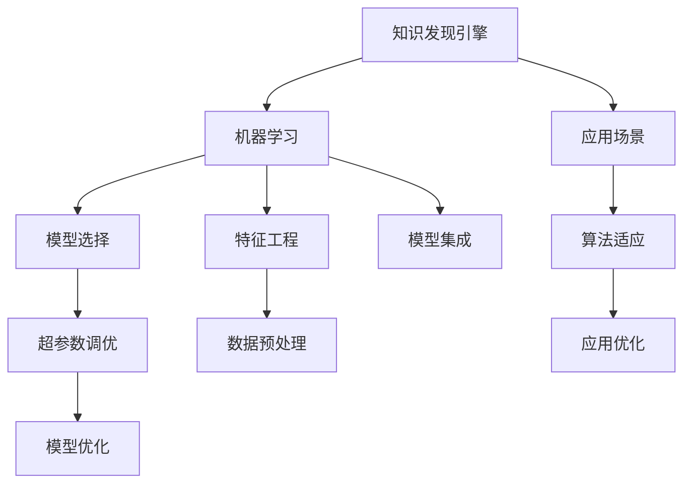

                 

# 知识发现引擎的机器学习算法优化

## 1. 背景介绍

### 1.1 问题由来
在数据驱动的时代，企业、组织和科研机构不断产生海量数据。如何高效地从这些数据中挖掘有价值的信息和知识，成为了知识工程和数据科学的重要研究课题。知识发现引擎（Knowledge Discovery Engine, KDE）是一种从数据中自动抽取知识的工具，广泛应用于商业智能（Business Intelligence, BI）、金融风控、医疗诊断等领域。传统的KDE方法依赖于统计学和规则工程，随着机器学习（Machine Learning, ML）技术的崛起，基于机器学习的KDE方法逐渐成为主流。

然而，机器学习算法在知识发现中的应用，面临着数据量大、复杂度高、特征工程困难、算法效果不稳定等挑战。如何优化机器学习算法，提升知识发现的效率和准确性，成为研究人员和企业必须面对的重要问题。

### 1.2 问题核心关键点
机器学习算法优化的核心关键点主要包括：

1. 特征工程：选择和构建高质量特征，减少模型过拟合和欠拟合。
2. 模型选择：选择合适的机器学习算法和模型，提升模型泛化性能。
3. 超参数调优：通过系统化的调优方法，优化模型参数，提高算法效果。
4. 模型集成：通过多种模型的结合，提升模型的稳定性和鲁棒性。
5. 算法可解释性：赋予模型更强的解释性，方便业务理解和决策支持。
6. 应用场景适应性：针对具体应用场景，优化算法结构和参数，提升算法效果。

这些问题需要在机器学习算法的各个阶段进行全面考虑和优化，才能实现高效的知识发现和应用。

### 1.3 问题研究意义
知识发现引擎的机器学习算法优化，对于提升企业决策水平、优化运营效率、推动科学发现具有重要意义：

1. 提升决策科学性：通过机器学习算法优化，能够从海量数据中提取更有价值的知识，辅助企业做出更科学、精准的决策。
2. 优化运营效率：机器学习算法优化能够自动发现运营中的瓶颈和问题，提出改进建议，提升企业运营效率。
3. 推动科学发现：优化后的机器学习算法能够更有效地处理科研数据，发现未知的知识和规律，加速科学发现进程。

通过优化机器学习算法，知识发现引擎可以更好地服务于企业决策和科研探索，推动数据驱动的决策和知识创新。

## 2. 核心概念与联系

### 2.1 核心概念概述

为更好地理解知识发现引擎的机器学习算法优化方法，本节将介绍几个密切相关的核心概念：

- 知识发现引擎（KDE）：一种从数据中自动抽取知识的工具，常用于商业智能、金融风控、医疗诊断等领域。
- 机器学习（ML）：通过数据驱动的方法，自动学习和提取数据中的知识，涵盖监督学习、无监督学习、强化学习等多种类型。
- 特征工程（Feature Engineering）：选择、构建和处理输入特征，提升模型性能。
- 模型选择（Model Selection）：根据任务特点，选择合适的机器学习算法和模型。
- 超参数调优（Hyperparameter Tuning）：优化算法参数，提升模型效果。
- 模型集成（Model Ensemble）：通过多种模型的结合，提升模型的稳定性和鲁棒性。
- 算法可解释性（Algorithm Interpretability）：赋予模型更强的解释性，方便业务理解和决策支持。
- 应用场景适应性（Scenario Adaptability）：针对具体应用场景，优化算法结构和参数。

这些核心概念之间的逻辑关系可以通过以下Mermaid流程图来展示：



这个流程图展示知识发现引擎与机器学习算法的各个环节：

1. 知识发现引擎以数据为基础，利用机器学习方法提取知识。
2. 机器学习算法通过特征工程和模型选择提升模型性能。
3. 超参数调优和模型集成进一步优化模型效果。
4. 算法可解释性增强模型的透明度，方便业务理解。
5. 应用场景适应性优化算法结构，提升应用效果。

这些概念共同构成了知识发现引擎的机器学习算法优化框架，使其能够高效地从数据中抽取有价值的知识。

## 3. 核心算法原理 & 具体操作步骤

### 3.1 算法原理概述

知识发现引擎的机器学习算法优化，本质上是通过优化算法各个环节，提升模型的泛化能力和应用效果。其核心思想是：选择和构建高质量特征，选择合适的算法和模型，通过系统化的调优方法，优化模型参数，提升模型效果。

形式化地，假设数据集为 $D=\{(x_i,y_i)\}_{i=1}^N$，其中 $x_i \in \mathcal{X}$ 为输入特征，$y_i \in \mathcal{Y}$ 为输出标签。目标是通过机器学习算法学习模型 $M: \mathcal{X} \rightarrow \mathcal{Y}$，使得模型在测试集 $D'$ 上的预测结果与真实标签尽可能接近。优化目标是最小化测试误差 $L_{test}(M)$：

$$
\mathop{\arg\min}_{M} L_{test}(M)
$$

其中 $L_{test}(M)$ 为模型在测试集上的损失函数。

### 3.2 算法步骤详解

知识发现引擎的机器学习算法优化一般包括以下几个关键步骤：

**Step 1: 数据预处理**
- 数据清洗：去除噪声数据、处理缺失值、处理异常值。
- 数据增强：通过数据扩增、合成生成等方式增加数据多样性。
- 特征提取：选择和构建高质量特征，提升特征解释性和质量。

**Step 2: 特征工程**
- 特征选择：根据领域知识和经验，选择相关性高的特征。
- 特征构建：通过组合、变换等方式构造新特征。
- 特征降维：通过PCA、LDA等方法减少特征维度。

**Step 3: 模型选择**
- 算法评估：评估不同算法在训练集和验证集上的性能。
- 模型选择：选择性能最优的算法和模型结构。

**Step 4: 模型训练**
- 模型初始化：初始化模型参数。
- 模型训练：在训练集上通过优化算法更新模型参数。
- 模型评估：在验证集上评估模型性能，选择最优模型。

**Step 5: 超参数调优**
- 选择调优方法：如网格搜索、随机搜索、贝叶斯优化等。
- 调优过程：逐步调整超参数，找到最优组合。
- 模型优化：通过调优提升模型性能。

**Step 6: 模型集成**
- 集成策略：如Bagging、Boosting、Stacking等。
- 模型组合：将多个模型组合成新的模型，提升模型效果。

**Step 7: 模型部署**
- 模型保存：保存最优模型和相关参数。
- 模型加载：在实际应用中加载模型。
- 模型预测：对新数据进行预测。

### 3.3 算法优缺点

知识发现引擎的机器学习算法优化方法具有以下优点：
1. 数据驱动：通过系统化的方法，自动从数据中提取知识，提高决策科学性。
2. 性能提升：通过优化各个环节，显著提升模型效果。
3. 自动化程度高：许多优化过程可以自动执行，降低人工干预成本。
4. 灵活性强：适合各种数据类型和应用场景。

同时，该方法也存在一定的局限性：
1. 数据质量要求高：需要高质量、大样本量的数据，数据处理难度大。
2. 特征工程复杂：需要领域知识和经验，特征工程难度大。
3. 模型可解释性差：许多机器学习算法缺乏可解释性，难以理解和调试。
4. 超参数调优困难：超参数众多，调优过程复杂。

尽管存在这些局限性，但就目前而言，机器学习算法优化是知识发现引擎中最主流的技术手段，能够有效提升模型的性能和应用效果。

### 3.4 算法应用领域

基于机器学习算法优化的知识发现引擎，在多个领域得到了广泛应用，例如：

- 商业智能（BI）：通过优化机器学习算法，自动提取商业数据中的知识，支持决策分析。
- 金融风控：通过机器学习算法优化，实时监控金融交易风险，提供风险预警。
- 医疗诊断：通过优化算法，自动识别医学影像和电子病历中的关键信息，辅助医生诊断。
- 智慧城市：通过机器学习算法优化，自动分析城市运行数据，提供智能决策支持。
- 智能制造：通过机器学习算法优化，自动监控生产流程，提高生产效率。

除了这些经典应用外，基于机器学习算法优化的知识发现引擎，还被创新性地应用于更多场景中，如客户关系管理、供应链优化、环境监测等，为各行各业带来了创新性的解决方案。

## 4. 数学模型和公式 & 详细讲解  
### 4.1 数学模型构建

本节将使用数学语言对知识发现引擎的机器学习算法优化过程进行更加严格的刻画。

假设数据集为 $D=\{(x_i,y_i)\}_{i=1}^N$，其中 $x_i \in \mathcal{X}$ 为输入特征，$y_i \in \mathcal{Y}$ 为输出标签。目标是通过机器学习算法学习模型 $M: \mathcal{X} \rightarrow \mathcal{Y}$，使得模型在测试集 $D'$ 上的预测结果与真实标签尽可能接近。

定义模型 $M$ 在数据集 $D$ 上的经验风险为：

$$
\mathcal{L}_{train}(M) = \frac{1}{N}\sum_{i=1}^N \ell(M(x_i),y_i)
$$

其中 $\ell$ 为损失函数，如均方误差、交叉熵等。优化目标是最小化经验风险：

$$
\hat{M} = \mathop{\arg\min}_{M} \mathcal{L}_{train}(M)
$$

在训练过程中，通常使用梯度下降等优化算法更新模型参数，更新公式为：

$$
\theta \leftarrow \theta - \eta \nabla_{\theta}\mathcal{L}_{train}(\theta)
$$

其中 $\theta$ 为模型参数，$\eta$ 为学习率，$\nabla_{\theta}\mathcal{L}_{train}(\theta)$ 为损失函数对模型参数的梯度。

### 4.2 公式推导过程

以下我们以回归任务为例，推导最小二乘法的损失函数及其梯度的计算公式。

假设模型 $M_{\theta}$ 在输入 $x$ 上的输出为 $\hat{y}=M_{\theta}(x)$，真实标签为 $y$。定义损失函数为均方误差损失：

$$
\ell(M_{\theta}(x),y) = (y - M_{\theta}(x))^2
$$

将其代入经验风险公式，得：

$$
\mathcal{L}_{train}(\theta) = \frac{1}{N}\sum_{i=1}^N (y_i - M_{\theta}(x_i))^2
$$

根据链式法则，损失函数对参数 $\theta_k$ 的梯度为：

$$
\frac{\partial \mathcal{L}_{train}(\theta)}{\partial \theta_k} = -\frac{2}{N}\sum_{i=1}^N \frac{\partial M_{\theta}(x_i)}{\partial \theta_k} (y_i - M_{\theta}(x_i))
$$

其中 $\frac{\partial M_{\theta}(x_i)}{\partial \theta_k}$ 可进一步递归展开，利用自动微分技术完成计算。

在得到损失函数的梯度后，即可带入参数更新公式，完成模型的迭代优化。重复上述过程直至收敛，最终得到适应训练集的最佳模型参数 $\hat{\theta}$。

## 5. 项目实践：代码实例和详细解释说明
### 5.1 开发环境搭建

在进行机器学习算法优化实践前，我们需要准备好开发环境。以下是使用Python进行PyTorch开发的环境配置流程：

1. 安装Anaconda：从官网下载并安装Anaconda，用于创建独立的Python环境。

2. 创建并激活虚拟环境：
```bash
conda create -n pytorch-env python=3.8 
conda activate pytorch-env
```

3. 安装PyTorch：根据CUDA版本，从官网获取对应的安装命令。例如：
```bash
conda install pytorch torchvision torchaudio cudatoolkit=11.1 -c pytorch -c conda-forge
```

4. 安装各类工具包：
```bash
pip install numpy pandas scikit-learn matplotlib tqdm jupyter notebook ipython
```

完成上述步骤后，即可在`pytorch-env`环境中开始算法优化实践。

### 5.2 源代码详细实现

下面我们以线性回归任务为例，给出使用PyTorch进行机器学习算法优化的PyTorch代码实现。

首先，定义线性回归模型：

```python
import torch
import torch.nn as nn
import torch.optim as optim

class LinearRegression(nn.Module):
    def __init__(self, input_size, output_size):
        super(LinearRegression, self).__init__()
        self.linear = nn.Linear(input_size, output_size)
    
    def forward(self, x):
        return self.linear(x)
```

然后，定义数据处理函数：

```python
from sklearn.datasets import load_boston
from sklearn.model_selection import train_test_split
from torch.utils.data import TensorDataset, DataLoader

def load_boston_data():
    boston = load_boston()
    X = torch.from_numpy(boston.data).float()
    y = torch.from_numpy(boston.target).float()
    return X, y

X, y = load_boston_data()
X_train, X_test, y_train, y_test = train_test_split(X, y, test_size=0.2, random_state=42)
train_dataset = TensorDataset(X_train, y_train)
test_dataset = TensorDataset(X_test, y_test)
```

接着，定义优化器：

```python
model = LinearRegression(X_train.shape[1], 1)
criterion = nn.MSELoss()
optimizer = optim.SGD(model.parameters(), lr=0.01)
```

然后，定义训练和评估函数：

```python
def train_epoch(model, dataset, optimizer, criterion):
    model.train()
    epoch_loss = 0
    for batch in DataLoader(dataset, batch_size=64, shuffle=True):
        inputs, targets = batch
        optimizer.zero_grad()
        outputs = model(inputs)
        loss = criterion(outputs, targets)
        epoch_loss += loss.item()
        loss.backward()
        optimizer.step()
    return epoch_loss / len(dataset)

def evaluate(model, dataset, criterion):
    model.eval()
    test_loss = 0
    for batch in DataLoader(dataset, batch_size=64, shuffle=False):
        inputs, targets = batch
        outputs = model(inputs)
        test_loss += criterion(outputs, targets).item()
    return test_loss / len(dataset)
```

最后，启动训练流程并在测试集上评估：

```python
epochs = 100
batch_size = 64

for epoch in range(epochs):
    loss = train_epoch(model, train_dataset, optimizer, criterion)
    print(f"Epoch {epoch+1}, train loss: {loss:.3f}")
    
    print(f"Epoch {epoch+1}, test loss: {evaluate(model, test_dataset, criterion):.3f}")
```

以上就是使用PyTorch进行线性回归任务机器学习算法优化的完整代码实现。可以看到，得益于PyTorch的强大封装，我们可以用相对简洁的代码完成模型的构建、数据加载、优化器设置、训练和评估等关键环节。

### 5.3 代码解读与分析

让我们再详细解读一下关键代码的实现细节：

**LinearRegression类**：
- `__init__`方法：初始化线性回归模型，定义线性层。
- `forward`方法：定义前向传播过程，计算输出。

**load_boston_data函数**：
- 利用sklearn库加载波士顿房价数据集，转化为PyTorch张量。
- 通过`train_test_split`函数将数据集划分为训练集和测试集。

**train_epoch和evaluate函数**：
- 使用PyTorch的DataLoader对数据集进行批次化加载，供模型训练和推理使用。
- `train_epoch`函数：对数据以批为单位进行迭代，在每个批次上前向传播计算loss并反向传播更新模型参数。
- `evaluate`函数：与训练类似，不同点在于不更新模型参数，并在每个batch结束后将预测和标签结果存储下来，最后使用MSE损失函数计算测试集上的平均loss。

**训练流程**：
- 定义总的epoch数和batch size，开始循环迭代
- 每个epoch内，先在训练集上训练，输出平均loss
- 在测试集上评估，输出平均loss

可以看到，PyTorch配合线性回归模型的代码实现变得简洁高效。开发者可以将更多精力放在模型优化、数据处理等高层逻辑上，而不必过多关注底层的实现细节。

当然，工业级的系统实现还需考虑更多因素，如模型保存和部署、超参数的自动搜索、更灵活的损失函数等。但核心的算法优化流程基本与此类似。

## 6. 实际应用场景
### 6.1 金融风控

金融风控是知识发现引擎的重要应用场景。通过机器学习算法优化，实时监控金融交易风险，提供风险预警。

具体而言，可以收集金融领域的交易数据、客户信息、市场数据等，构建风控模型。利用机器学习算法优化，提升模型的准确性和鲁棒性。在实时交易中，通过风控模型自动检测异常交易，发出风险预警，及时采取措施，减少金融风险。

### 6.2 智慧医疗

智慧医疗也是知识发现引擎的重要应用场景。通过机器学习算法优化，自动提取医学影像和电子病历中的关键信息，辅助医生诊断。

具体而言，可以收集医院内部的医学影像、电子病历、健康数据等，构建医疗知识发现模型。利用机器学习算法优化，提取高价值知识，支持医生诊断和治疗。在临床实践中，通过医疗知识发现模型自动分析病历，辅助医生诊断，提供个性化治疗建议，提高诊疗效率。

### 6.3 商业智能

商业智能是知识发现引擎的典型应用。通过机器学习算法优化，自动提取商业数据中的知识，支持决策分析。

具体而言，可以收集企业的销售数据、客户数据、市场数据等，构建商业知识发现模型。利用机器学习算法优化，提取高价值知识，支持商业决策。在企业运营中，通过商业知识发现模型自动分析数据，提供市场分析、客户画像、销售预测等服务，提升企业运营效率。

### 6.4 智能制造

智能制造也是知识发现引擎的重要应用。通过机器学习算法优化，自动监控生产流程，提高生产效率。

具体而言，可以收集制造企业的生产数据、设备状态、产品质量等，构建智能制造知识发现模型。利用机器学习算法优化，提取高价值知识，支持制造优化。在制造过程中，通过智能制造知识发现模型自动分析数据，预测设备故障、优化生产计划、提升产品质量，提高生产效率。

### 6.5 未来应用展望

随着机器学习算法优化的不断发展，基于机器学习知识发现引擎必将在更多领域得到应用，为各行各业带来创新性的解决方案。

在智慧医疗领域，知识发现引擎可以自动分析医学影像和电子病历，提供精准诊断和治疗方案，加速医疗服务数字化转型。

在智能制造领域，知识发现引擎可以自动监控生产流程，优化生产计划，提升产品质量，推动制造自动化、智能化发展。

在金融风控领域，知识发现引擎可以自动分析交易数据，提供风险预警和防范，保障金融安全。

在商业智能领域，知识发现引擎可以自动分析市场数据，提供市场分析、客户画像、销售预测等服务，提升企业决策水平。

未来，伴随机器学习算法和技术的不断进步，基于知识发现引擎的解决方案将不断涌现，为各行各业带来更深层次的变革。相信随着算法的优化和应用的深化，知识发现引擎必将在数据驱动的决策和知识创新中发挥更大的作用。

## 7. 工具和资源推荐
### 7.1 学习资源推荐

为了帮助开发者系统掌握知识发现引擎的机器学习算法优化理论基础和实践技巧，这里推荐一些优质的学习资源：

1. 《Python机器学习》：Scikit-Learn官方指南，详细介绍了机器学习的基本概念和常用算法。
2. 《机器学习实战》：Hastie等著，系统讲解了机器学习算法的实现和优化方法。
3. 《深度学习》：Ian Goodfellow等著，全面介绍了深度学习的基本概念和实现方法。
4. Kaggle平台：提供大量的数据集和竞赛，可以实践机器学习算法优化。
5. Coursera课程：提供机器学习、深度学习的系统课程，适合初学者和进阶者。
6. Google Colab：谷歌提供的在线Jupyter Notebook环境，免费提供GPU算力，方便开发者快速上手实验最新模型。

通过对这些资源的学习实践，相信你一定能够快速掌握机器学习算法优化的精髓，并用于解决实际的商业智能、金融风控、医疗诊断等问题。

### 7.2 开发工具推荐

高效的开发离不开优秀的工具支持。以下是几款用于机器学习算法优化开发的常用工具：

1. PyTorch：基于Python的开源深度学习框架，灵活的计算图，适合快速迭代研究。几乎所有的机器学习算法都有PyTorch版本的实现。
2. TensorFlow：由Google主导开发的开源深度学习框架，生产部署方便，适合大规模工程应用。提供丰富的机器学习算法资源。
3. Scikit-Learn：基于Python的科学计算库，包含大量机器学习算法和工具，适合初学者和快速原型开发。
4. Jupyter Notebook：免费的交互式编程环境，支持多种编程语言和数据格式，方便开发者协作开发。
5. Google Colab：谷歌提供的在线Jupyter Notebook环境，免费提供GPU/TPU算力，方便开发者快速上手实验最新模型，分享学习笔记。

合理利用这些工具，可以显著提升机器学习算法优化的开发效率，加快创新迭代的步伐。

### 7.3 相关论文推荐

机器学习算法优化的研究源于学界的持续研究。以下是几篇奠基性的相关论文，推荐阅读：

1. Linear Regression with L1 and L2 Regularization：提出L1和L2正则化方法，提升线性回归模型的泛化能力。
2. Boosting Algorithms as Gradient Descent：提出Adaboost算法，通过迭代优化提升分类器性能。
3. Random Forests for Classification and Regression：提出随机森林算法，通过集成提升模型的稳定性和鲁棒性。
4. Gradient Boosting Machines：进一步改进Adaboost算法，提出梯度提升树算法，提升模型效果。
5. Deep Learning with Confidence-Weighted Regularization：提出加权正则化方法，提升深度学习模型的泛化性能。
6. Dropout for Neural Network Training：提出Dropout方法，防止深度学习模型过拟合。

这些论文代表了大数据时代机器学习算法优化的发展脉络。通过学习这些前沿成果，可以帮助研究者把握学科前进方向，激发更多的创新灵感。

## 8. 总结：未来发展趋势与挑战

### 8.1 总结

本文对知识发现引擎的机器学习算法优化方法进行了全面系统的介绍。首先阐述了知识发现引擎与机器学习算法优化的研究背景和意义，明确了优化在提升数据驱动决策中的独特价值。其次，从原理到实践，详细讲解了机器学习算法优化的各个环节，包括数据预处理、特征工程、模型选择、模型训练、超参数调优、模型集成、模型部署等，给出了机器学习算法优化的完整代码实例。同时，本文还广泛探讨了机器学习算法优化在商业智能、金融风控、智慧医疗、智能制造等诸多领域的应用前景，展示了机器学习算法优化的广阔应用场景。最后，本文精选了机器学习算法优化的各类学习资源、开发工具和相关论文，力求为读者提供全方位的技术指引。

通过本文的系统梳理，可以看到，机器学习算法优化方法正在成为知识发现引擎的主流技术手段，显著提升了知识发现和应用的效果。未来，伴随机器学习算法和技术的不断进步，基于知识发现引擎的解决方案必将在更多领域得到应用，为各行各业带来更深层次的变革。

### 8.2 未来发展趋势

展望未来，知识发现引擎的机器学习算法优化将呈现以下几个发展趋势：

1. 自动化程度提高：随着自动机器学习（AutoML）技术的发展，机器学习算法优化将更加自动化、智能化。
2. 集成学习加速：集成学习（Ensemble Learning）技术将不断发展，通过多种模型结合，提升知识发现的稳定性和鲁棒性。
3. 深度学习深度化：深度学习技术将不断深化，应用领域将不断拓展，知识发现引擎将能够处理更复杂的任务。
4. 可解释性增强：知识发现引擎的机器学习算法优化将更加注重模型的可解释性，方便业务理解和决策支持。
5. 跨领域融合加速：知识发现引擎的机器学习算法优化将与大数据、人工智能、物联网等领域更加紧密结合，推动跨领域融合发展。
6. 智能化决策支持：知识发现引擎的机器学习算法优化将更加注重智能化决策支持，提升数据驱动决策水平。

这些趋势凸显了知识发现引擎的机器学习算法优化的广阔前景。这些方向的探索发展，必将进一步提升知识发现引擎的性能和应用效果，为数据驱动的决策和知识创新带来新的突破。

### 8.3 面临的挑战

尽管知识发现引擎的机器学习算法优化取得了一定的进展，但在迈向更加智能化、普适化应用的过程中，它仍面临着诸多挑战：

1. 数据质量瓶颈：高质量、大样本量的数据获取难度大，数据处理成本高。
2. 特征工程复杂：需要领域知识和经验，特征工程难度大。
3. 模型复杂度高：深度学习模型复杂度高，训练和调优难度大。
4. 模型可解释性差：许多机器学习模型缺乏可解释性，难以理解和调试。
5. 模型计算资源消耗大：深度学习模型计算资源消耗大，硬件设施要求高。
6. 超参数调优困难：深度学习模型超参数众多，调优过程复杂。

尽管存在这些挑战，但就目前而言，机器学习算法优化是知识发现引擎中最主流的技术手段，能够有效提升知识发现的效率和效果。未来，需要更多学术界和产业界的共同努力，探索新的算法和优化方法，才能进一步推动知识发现引擎的发展。

### 8.4 研究展望

面向未来，知识发现引擎的机器学习算法优化需要在以下几个方向进行探索：

1. 自动机器学习（AutoML）：通过自动化机器学习技术，降低人工干预成本，提升算法优化效率。
2. 深度学习优化：开发更加高效、鲁棒的深度学习算法，提升知识发现引擎的性能和应用效果。
3. 模型可解释性增强：通过可解释性算法，增强模型的透明度，方便业务理解和决策支持。
4. 跨领域融合：将知识发现引擎与大数据、人工智能、物联网等领域更加紧密结合，推动跨领域融合发展。
5. 智能化决策支持：开发智能决策支持算法，提升数据驱动决策水平。
6. 数据质量提升：通过数据清洗、增强、补全等技术手段，提升数据质量，降低数据处理成本。

这些研究方向的发展，必将进一步推动知识发现引擎的创新和应用，为各行各业带来更深层次的变革。面向未来，知识发现引擎的机器学习算法优化需要更多学术界和产业界的共同努力，探索新的算法和优化方法，才能实现更加智能、高效的知识发现和应用。

## 9. 附录：常见问题与解答

**Q1：知识发现引擎的机器学习算法优化是否适用于所有数据类型和应用场景？**

A: 知识发现引擎的机器学习算法优化在处理结构化数据、数值型数据时效果显著，但对于非结构化数据、文本数据等，效果可能有限。对于某些特定领域，如金融、医疗等，需要结合领域知识和专家经验，进行针对性的优化。

**Q2：知识发现引擎的机器学习算法优化是否需要大量标注数据？**

A: 知识发现引擎的机器学习算法优化通常需要一定数量的标注数据，但对于小样本、无标注数据等场景，可以利用自监督学习、迁移学习等技术，降低对标注数据的依赖。

**Q3：知识发现引擎的机器学习算法优化是否需要高精度的特征工程？**

A: 知识发现引擎的机器学习算法优化非常依赖高质量的特征工程，特征选择、构建和降维等环节都需要仔细设计和优化。但不同数据类型和应用场景，特征工程的具体方法也会有所不同。

**Q4：知识发现引擎的机器学习算法优化是否需要高精度的模型选择和超参数调优？**

A: 知识发现引擎的机器学习算法优化非常依赖模型选择和超参数调优，选择合适的模型和调优策略，能够显著提升算法效果。但不同数据类型和应用场景，模型选择和调优的具体方法也会有所不同。

**Q5：知识发现引擎的机器学习算法优化是否需要高精度的模型集成？**

A: 知识发现引擎的机器学习算法优化通常需要进行模型集成，通过多种模型的结合，提升模型的稳定性和鲁棒性。但不同数据类型和应用场景，模型集成的具体方法也会有所不同。

这些问题的答案展示了知识发现引擎的机器学习算法优化在实际应用中的复杂性和多样性。只有在具体问题具体分析，进行系统化的优化，才能充分发挥机器学习算法优化的潜力，实现高效的知识发现和应用。

---

作者：禅与计算机程序设计艺术 / Zen and the Art of Computer Programming

