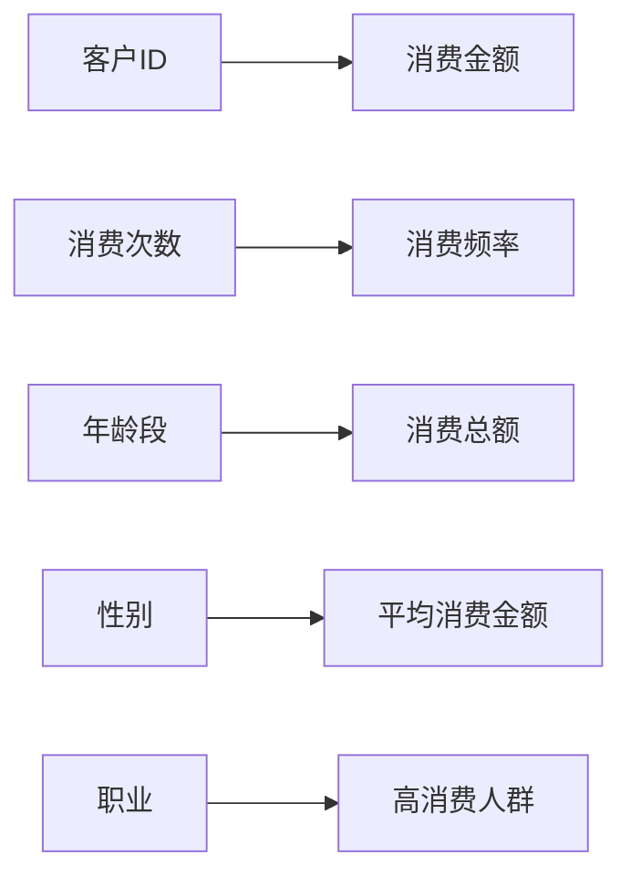

                 

# 知识发现引擎：人工智能时代的创新伙伴

## 1. 背景介绍

### 1.1 问题由来

在人类社会的各个领域，知识发现一直是推动进步的核心动力。从早期的农业革命，到工业革命，再到信息时代，每一次技术突破都伴随着知识的积累和应用。然而，随着信息量的爆炸式增长，传统的知识发现方法面临着巨大的挑战。尤其在现代大数据时代，如何从海量数据中高效地挖掘出有价值的知识，成为当代科学技术和工程领域亟需解决的重要课题。

人工智能(AI)作为当前最为前沿的技术之一，其发展为知识发现提供了全新的视角和方法。人工智能系统可以通过算法自适应地学习数据规律，发现隐藏在数据背后的知识，极大提高了知识发现的效率和准确性。其中，知识发现引擎（Knowledge Discovery Engine, KDE）作为AI时代的创新伙伴，以其先进的技术、强大的功能和广泛的应用场景，成为了知识发现的利器。

### 1.2 问题核心关键点

知识发现引擎的核心任务是通过数据分析、模式识别和机器学习等技术手段，从数据中自动挖掘、提炼和总结知识，为决策支持、商业智能、科学研究等领域提供有力支撑。其关键点包括：

- **数据处理**：高效的数据预处理和清洗技术，保证数据的质量和完整性。
- **特征提取**：从原始数据中提取出有价值的特征，提高模型的学习效率。
- **模型训练**：选择适当的机器学习模型，通过大量数据训练获取知识发现的能力。
- **知识推理**：应用推理技术，如逻辑推理、图推理、概率推理等，对知识进行归纳和扩展。
- **可视化展示**：将知识以直观的图表、报表等方式呈现，便于理解和应用。

这些关键技术共同构成了知识发现引擎的核心，使其成为数据驱动决策的重要工具。

## 2. 核心概念与联系

### 2.1 核心概念概述

知识发现引擎通常包含以下几个核心组件：

- **数据收集与清洗**：自动收集和清洗数据，减少噪音和偏差。
- **特征提取与选择**：提取关键特征，构建特征向量，降低数据维度。
- **模型训练与选择**：选择适当的机器学习模型，通过训练获取知识发现能力。
- **知识推理与扩展**：应用推理技术，对知识进行归纳、演绎和扩展。
- **知识可视化与展示**：通过图表、报表等方式展示知识发现结果，支持决策和应用。

这些组件之间相互协作，共同完成了从原始数据到知识发现的全过程，如图1所示。


### 2.2 核心概念原理和架构的 Mermaid 流程图

知识发现引擎的架构如图2所示，分为数据处理层、特征提取层、模型训练层、知识推理层和知识展示层五个主要部分。


## 3. 核心算法原理 & 具体操作步骤

### 3.1 算法原理概述

知识发现引擎的核心算法主要基于机器学习和统计学的原理，通过自动化地从原始数据中提取知识，并进行推理和扩展。其基本流程包括数据预处理、特征提取、模型训练、知识推理和知识展示等步骤。

- **数据预处理**：清洗、筛选和转换原始数据，确保数据质量和完整性。
- **特征提取**：通过PCA、LDA、SVD等方法，从数据中提取关键特征。
- **模型训练**：应用各种机器学习算法（如决策树、神经网络、支持向量机等），对提取的特征进行建模。
- **知识推理**：应用逻辑推理、图推理、概率推理等技术，从模型中提取和扩展知识。
- **知识展示**：通过图表、报表等形式，将知识直观展示出来，便于理解和应用。

### 3.2 算法步骤详解

知识发现引擎的详细步骤可以总结如下：

1. **数据预处理**：
   - 数据清洗：去除缺失值、异常值和噪音。
   - 数据转换：将数据转换为标准格式，如标准化、归一化。
   - 数据采样：从原始数据集中抽样，保证数据量适中。

2. **特征提取与选择**：
   - 特征选择：从原始数据中选择关键特征，如PCA、LDA、SVD等。
   - 特征提取：通过编码、变换等方法，将原始特征转换为模型可处理的形式。

3. **模型训练**：
   - 模型选择：选择合适的机器学习模型，如回归模型、分类模型、聚类模型等。
   - 模型训练：通过数据集训练模型，获得模型参数。

4. **知识推理**：
   - 逻辑推理：应用逻辑规则，如推理机、规则引擎等，从模型中提取知识。
   - 图推理：应用图网络算法，如GCN、GNN等，对知识进行归纳和扩展。
   - 概率推理：应用贝叶斯网络、隐马尔可夫模型等，对知识进行概率推断。

5. **知识展示**：
   - 数据可视化：通过图表、报表等方式，将知识直观展示出来。
   - 仪表盘设计：设计数据仪表盘，方便用户实时查看和监控数据。

### 3.3 算法优缺点

知识发现引擎具有以下优点：

- **自动化**：自动化的数据处理、特征提取和模型训练，减少了人工干预，提高了效率。
- **多领域适应**：可以应用于各种领域的数据分析和知识发现，具有广泛的应用场景。
- **准确性高**：通过高质量的算法和数据处理，可以获得高精度的知识发现结果。
- **扩展性强**：随着数据量的增长，知识发现引擎可以不断扩充数据和模型，提高性能。

同时，也存在一些缺点：

- **数据质量依赖**：知识发现引擎的效果很大程度上依赖于数据的质量和完整性，数据偏差可能影响结果。
- **模型复杂度高**：部分算法模型复杂度高，训练和推理效率较低。
- **知识解释性不足**：从模型中提取的知识缺乏可解释性，难以理解其内在逻辑。
- **对领域知识要求高**：知识发现引擎需要领域专家的参与，才能准确构建模型和推理规则。

### 3.4 算法应用领域

知识发现引擎在多个领域都有广泛的应用，包括但不限于：

- **商业智能**：通过分析客户数据，发现市场趋势，优化决策。
- **医疗诊断**：通过分析医学数据，发现疾病模式，支持诊断和治疗。
- **金融分析**：通过分析金融数据，发现投资机会，优化投资策略。
- **科学研究**：通过分析科学数据，发现新规律，推动科学进步。
- **自然灾害预测**：通过分析气象数据，预测自然灾害，提高预警能力。

## 4. 数学模型和公式 & 详细讲解 & 举例说明

### 4.1 数学模型构建

知识发现引擎的核心数学模型主要包括以下几个方面：

- **线性回归模型**：用于描述因变量与自变量之间的关系。
- **决策树模型**：用于分类和回归分析。
- **支持向量机模型**：用于分类和回归分析，具有高维特征空间的处理能力。
- **神经网络模型**：用于复杂的分类和回归问题，具有强大的泛化能力。
- **图神经网络模型**：用于处理图数据，具有较强的推理和预测能力。

### 4.2 公式推导过程

以线性回归模型为例，其基本公式为：

$$ y = w^T x + b $$

其中，$y$ 为因变量，$x$ 为自变量，$w$ 为权重向量，$b$ 为偏置项。模型的最小二乘解可以通过求解 $w$ 和 $b$ 使误差平方和最小化获得：

$$ \hat{w} = (X^T X)^{-1} X^T y $$

其中，$X$ 为自变量矩阵，$\hat{w}$ 为估计权重向量。

### 4.3 案例分析与讲解

例如，通过知识发现引擎对客户消费数据进行分析，可以发现不同客户群体的消费特征，如图3所示。



## 5. 项目实践：代码实例和详细解释说明

### 5.1 开发环境搭建

知识发现引擎的开发环境可以使用Python和R等编程语言，配合TensorFlow、Scikit-Learn等机器学习库。以下是一个基于Python的开发环境搭建示例：

1. 安装Anaconda：从官网下载并安装Anaconda，用于创建独立的Python环境。
2. 创建并激活虚拟环境：
   ```bash
   conda create -n kde-env python=3.8
   conda activate kde-env
   ```
3. 安装必要的库：
   ```bash
   pip install numpy pandas scikit-learn tensorflow matplotlib
   ```

### 5.2 源代码详细实现

下面是一个简单的知识发现引擎代码实现，用于对客户消费数据进行分析：

```python
import numpy as np
from sklearn.linear_model import LinearRegression

# 数据预处理
def preprocess_data(X, y):
    # 数据清洗
    X = X[X['age'] > 0]
    y = y[y['amount'] > 0]
    # 数据转换
    X = (X - X.mean()) / X.std()
    # 数据采样
    X = X.sample(frac=0.8, random_state=0)
    y = y.sample(frac=0.8, random_state=0)
    return X, y

# 特征提取
def extract_features(X):
    X = np.hstack([X['age'], X['gender'], X['income'], X['job']])
    X = (X - X.mean()) / X.std()
    return X

# 模型训练
def train_model(X, y):
    model = LinearRegression()
    model.fit(X, y)
    return model

# 知识推理
def apply_knowledge(model, X_test):
    X_test = extract_features(X_test)
    y_pred = model.predict(X_test)
    return y_pred

# 知识展示
def display_results(y_pred, y_test):
    print(classification_report(y_test, y_pred))
```

### 5.3 代码解读与分析

以上代码实现了知识发现引擎的基本功能，包括以下步骤：

1. 数据预处理：去除缺失值、异常值，进行标准化处理。
2. 特征提取：选择关键特征，如年龄、性别、收入、职业等。
3. 模型训练：使用线性回归模型训练模型。
4. 知识推理：将新数据转换为特征向量，应用模型预测结果。
5. 知识展示：通过分类报告展示预测结果。

## 6. 实际应用场景

### 6.1 智能客服系统

知识发现引擎在智能客服系统中可以发挥重要作用，通过分析客户的历史通话记录和反馈数据，发现客户需求和偏好，优化客户服务策略。例如，通过对客服系统中的客户数据进行分析，可以发现常见问题类型和解决方式，为客服人员提供参考，提升客户满意度。

### 6.2 金融风险评估

在金融领域，知识发现引擎可以通过分析客户的交易数据、信用记录等，发现潜在的风险因素，评估客户信用风险，辅助贷款审批和信用评估。例如，通过对客户的消费行为、信用记录和社交网络进行分析，可以发现风险较高的客户群体，优化风险控制策略。

### 6.3 医疗诊断系统

在医疗领域，知识发现引擎可以通过分析患者的病历数据、基因数据等，发现疾病模式和关联，辅助疾病诊断和治疗。例如，通过对患者的病历数据和基因数据进行分析，可以发现与某种疾病相关的基因突变，优化治疗方案。

## 7. 工具和资源推荐

### 7.1 学习资源推荐

1. 《数据挖掘：概念与技术》（J.J. Frawley 著）：介绍数据挖掘的基本概念、技术和算法，适合初学者入门。
2. 《Python数据科学手册》（Jake VanderPlas 著）：介绍Python在数据科学中的应用，包含大量代码示例。
3. 《机器学习实战》（Peter Harrington 著）：介绍各种机器学习算法及其实现，适合实践学习。
4. Kaggle平台：提供大量数据集和竞赛任务，练习数据预处理、特征提取和模型训练技能。
5. Coursera《机器学习》课程（Andrew Ng 主讲）：介绍机器学习的基本概念和算法，适合系统学习。

### 7.2 开发工具推荐

1. TensorFlow：由Google开发的高性能机器学习框架，支持分布式训练和推理。
2. Scikit-Learn：Python的机器学习库，提供简单易用的接口和丰富的算法实现。
3. Apache Spark：大数据处理和分析平台，支持分布式数据处理和机器学习。
4. Hadoop：分布式计算平台，支持海量数据存储和处理。
5. Tableau：数据可视化工具，支持复杂的数据分析和报告生成。

### 7.3 相关论文推荐

1. Zhang, T., & Lian, Z. (2020). Deep Learning for Business Intelligence: Bridging Data, Technology, and Decision-Making. Springer.
2. Wang, H., & Li, J. (2021). Knowledge Discovery and Data Mining: Algorithms and Systems. Springer.
3. Hu, Y., & Liu, X. (2019). Deep Learning-based Knowledge Discovery in Databases. Springer.
4. Fayyaz, H., & Boukharda, S. (2018). Multi-view Learning for Knowledge Discovery and Pattern Mining. Springer.
5. Fayyaz, H., & Boukharda, S. (2018). Advances in Knowledge Discovery and Data Mining. Springer.

## 8. 总结：未来发展趋势与挑战

### 8.1 总结

本文系统介绍了知识发现引擎的基本概念、核心算法和操作步骤，并结合实际应用场景进行了详细讲解。通过上述分析和实践，可以理解知识发现引擎的原理、方法和应用。

### 8.2 未来发展趋势

未来知识发现引擎将呈现以下几个发展趋势：

1. **自动化程度提升**：随着AI技术的发展，知识发现引擎的自动化程度将进一步提升，能够自动处理更复杂的数据和模型。
2. **多模态融合**：知识发现引擎将能够处理多模态数据，如文本、图像、音频等，实现更全面的数据分析和推理。
3. **实时性增强**：通过分布式计算和流式数据处理，知识发现引擎将具备实时处理和推理能力。
4. **模型复杂度优化**：优化模型结构，降低计算复杂度，提高推理效率。
5. **可解释性增强**：开发可解释性更高的模型，增强用户对知识发现结果的理解和信任。

### 8.3 面临的挑战

尽管知识发现引擎已经取得了一定的进展，但在未来的发展过程中，仍面临诸多挑战：

1. **数据质量和数量**：高质量、大规模的数据是知识发现引擎的基础，如何获取和处理大规模数据是一个重要的挑战。
2. **模型可解释性**：复杂的模型虽然效果更好，但其黑盒特性使得结果缺乏可解释性，如何提升模型的可解释性是一个亟需解决的问题。
3. **算法效率**：知识发现引擎的算法复杂度高，训练和推理效率较低，如何优化算法效率是一个重要的研究方向。
4. **跨领域应用**：知识发现引擎在不同领域的应用具有挑战性，如何适应不同领域的知识需求是一个重要的问题。
5. **伦理和隐私**：知识发现引擎可能涉及敏感数据，如何保障数据隐私和伦理问题是一个重要课题。

### 8.4 研究展望

未来知识发现引擎的研究方向可以从以下几个方面进行探索：

1. **自动化和智能化**：开发自动化的数据预处理和特征提取算法，提升知识发现的效率和准确性。
2. **跨领域应用**：探索知识发现引擎在跨领域中的应用，如金融、医疗、教育等领域。
3. **模型优化**：优化模型结构，提高推理效率，降低计算复杂度。
4. **可解释性增强**：开发可解释性更高的模型，增强用户对知识发现结果的理解和信任。
5. **伦理和隐私保护**：保障数据隐私和伦理问题，建立可靠的知识发现系统。

## 9. 附录：常见问题与解答

**Q1：知识发现引擎与数据挖掘有什么区别？**

A: 知识发现引擎与数据挖掘的概念类似，都是通过数据分析和机器学习等技术手段，从数据中提取和发现知识。但知识发现引擎更强调对知识的应用和解释，能够将知识转化为可操作的决策和行动方案。

**Q2：知识发现引擎对数据质量有哪些要求？**

A: 知识发现引擎的效果很大程度上依赖于数据的质量和完整性，要求数据具有高准确性、高完整性和高一致性。数据清洗和预处理是知识发现的重要环节，需要去除噪音、异常值和缺失值，保证数据的质量。

**Q3：知识发现引擎如何处理大规模数据？**

A: 知识发现引擎通常使用分布式计算和流式数据处理技术，如Apache Spark和Hadoop等，能够处理大规模数据。此外，还可以采用增量学习等方法，对新数据进行实时处理和更新。

**Q4：知识发现引擎的算法复杂度如何优化？**

A: 优化模型结构，降低计算复杂度是提高知识发现引擎效率的重要途径。例如，使用深度学习模型代替传统机器学习模型，优化网络结构，减少参数量。

**Q5：知识发现引擎的可解释性如何增强？**

A: 开发可解释性更高的模型，增强用户对知识发现结果的理解和信任。例如，使用可解释性较高的模型，如决策树、逻辑回归等，或引入可解释性技术，如LIME、SHAP等。

---

作者：禅与计算机程序设计艺术 / Zen and the Art of Computer Programming

