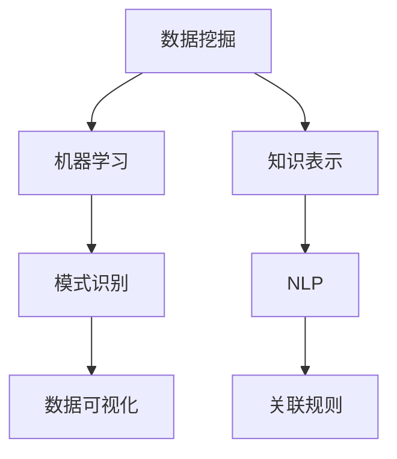

                 

## 1. 背景介绍

### 1.1 问题由来
知识发现(Knowledge Discovery, KDD)是当前科技发展和社会进步的重要推动力之一。随着大数据、云计算和人工智能技术的迅猛发展，人类获取和利用知识的能力大幅提升，极大地促进了科学创新和社会进步。知识发现引擎通过自动化和智能化手段，从海量数据中挖掘出有用知识，为人类实现知识突破和创新提供了强有力的工具。

### 1.2 问题核心关键点
知识发现引擎的核心在于数据挖掘、机器学习、自然语言处理等多学科技术的深度融合。在技术实现上，主要有以下关键点：

- 数据预处理：清洗、转换和整合数据，为后续分析提供干净的输入。
- 特征工程：从原始数据中提取有用特征，构建模型训练集。
- 模型训练：使用机器学习算法进行模型训练，优化模型参数。
- 知识呈现：将模型学习到的知识，以易于理解的形式呈现出来。

知识发现引擎的目标是通过数据驱动的智能手段，帮助人类发现和利用数据中潜在的知识，实现知识的突破和创新。它的应用广泛涉及科学研究、医学诊断、金融分析、社交网络等多个领域，具有极高的社会和经济价值。

## 2. 核心概念与联系

### 2.1 核心概念概述

为更好地理解知识发现引擎的工作原理和实现机制，本节将介绍几个密切相关的核心概念：

- 数据挖掘(Data Mining)：从大规模数据集中自动提取有用知识和信息的过程，包括分类、聚类、关联规则挖掘等。
- 机器学习(Machine Learning)：利用算法从数据中学习规律，并作出预测或决策。
- 知识表示(Knowledge Representation)：将知识以结构化的形式表示出来，便于机器理解和处理。
- 自然语言处理(Natural Language Processing, NLP)：让计算机理解、处理和生成人类语言。
- 模式识别(Pattern Recognition)：通过算法识别数据中的模式和规律，实现分类和识别。
- 数据可视化(Data Visualization)：将数据以图形化的形式呈现，便于观察和理解。
- 关联规则(Association Rule)：用于挖掘数据集中的频繁项集和关联规则，是数据挖掘中的重要技术。

这些核心概念之间的逻辑关系可以通过以下Mermaid流程图来展示：



这个流程图展示了一些核心概念及其之间的关系：

1. 数据挖掘通过清洗和转换数据，为机器学习提供数据集。
2. 机器学习利用算法从数据中学习知识，并进行模式识别和分类。
3. 知识表示和NLP用于将知识结构化表示，便于模型理解和处理。
4. 模式识别和关联规则挖掘用于发现数据中的模式和关联关系。
5. 数据可视化用于呈现发现的知识，便于观察和理解。

这些核心概念共同构成了知识发现引擎的基础，使其能够在各种场景下高效地发现和利用数据中的知识。通过理解这些核心概念，我们可以更好地把握知识发现引擎的工作原理和实现方法。

## 3. 核心算法原理 & 具体操作步骤
### 3.1 算法原理概述

知识发现引擎的核心算法原理主要包括数据预处理、特征工程、模型训练和知识呈现四个步骤。

1. **数据预处理**：对原始数据进行清洗、转换和整合，去除噪声和冗余，提取有用信息。
2. **特征工程**：从原始数据中提取有用特征，构建模型训练集，通过特征选择和降维等方法提升模型的泛化能力。
3. **模型训练**：使用机器学习算法进行模型训练，优化模型参数，得到能够泛化新数据的模型。
4. **知识呈现**：将模型学习到的知识，以易于理解的形式呈现出来，如可视化图表、知识图谱等。

### 3.2 算法步骤详解

以下是知识发现引擎的一般实现流程：

**Step 1: 数据收集与预处理**
- 收集相关的原始数据，并对其进行清洗、转换和整合，去除噪声和冗余。
- 使用数据预处理技术，如缺失值处理、归一化、标准化等，为后续分析提供干净的输入。

**Step 2: 特征工程**
- 从原始数据中提取有用特征，如文本长度、特征频率、时间特征等。
- 应用特征选择和降维等技术，选择最相关的特征，减少数据维度。
- 利用特征组合和特征交叉等方法，构建更丰富的特征集。

**Step 3: 模型训练**
- 选择合适的机器学习算法，如决策树、支持向量机、随机森林等，进行模型训练。
- 使用交叉验证等方法评估模型性能，选择最优模型。
- 使用超参数调优技术，调整模型参数，提高模型泛化能力。

**Step 4: 知识呈现**
- 使用数据可视化工具，将模型学习到的知识以图形化的形式呈现出来。
- 构建知识图谱或规则库，将知识结构化表示，便于理解和使用。
- 设计知识解释系统，以自然语言形式解释模型预测结果。

### 3.3 算法优缺点

知识发现引擎在数据挖掘和知识获取方面具有以下优点：
1. 自动化程度高。能够自动化地进行数据清洗、特征提取和模型训练，大幅提升工作效率。
2. 可扩展性强。能够处理大规模数据集，支持多领域、多任务的数据挖掘任务。
3. 结果可解释。能够将挖掘到的知识以可视化的形式呈现，便于理解和使用。
4. 跨学科融合。结合数据挖掘、机器学习、自然语言处理等多个学科的技术，提供综合性解决方案。

同时，知识发现引擎也存在一定的局限性：
1. 数据质量要求高。数据预处理和特征工程对数据质量要求较高，需要高水平的数据处理技能。
2. 模型泛化能力有限。当前主流算法依赖大量标注数据，对数据分布变化敏感，泛化能力有限。
3. 算法复杂度高。部分高级算法如深度学习、知识图谱等，计算复杂度较高，需要高性能计算资源。
4. 结果依赖性强。知识呈现依赖于算法选择和模型训练，结果解释可能存在偏差。

尽管存在这些局限性，知识发现引擎仍是目前数据挖掘和知识获取的主流技术手段。未来相关研究的重点在于如何进一步提升算法的泛化能力，降低对数据质量的依赖，优化计算效率，同时兼顾结果的可解释性和公平性等因素。

### 3.4 算法应用领域

知识发现引擎在多个领域得到了广泛应用，例如：

- 医学研究：通过挖掘病历数据，发现疾病风险因素，预测疾病发展趋势，辅助医生诊断。
- 金融分析：挖掘金融数据中的关联关系，识别交易模式，预测股市走势，辅助投资决策。
- 社交网络分析：分析用户行为数据，发现兴趣群体，预测用户行为，实现精准推荐。
- 市场营销：挖掘市场数据中的消费者需求，发现购买趋势，优化营销策略，提升销售效果。
- 科学研究：挖掘科学文献中的关联关系，发现研究热点，指导科研项目，加速科学创新。

除了上述这些经典应用外，知识发现引擎还被创新性地应用到更多场景中，如工业生产优化、环境保护监测、智能交通管理等，为各行各业带来了新的发展机遇。

## 4. 数学模型和公式 & 详细讲解 & 举例说明
### 4.1 数学模型构建

知识发现引擎的数学模型构建主要涉及数据挖掘和机器学习的相关数学知识。以下将以决策树算法为例，构建一个简单的数学模型。

**决策树算法**：
决策树是一种基于树形结构的分类算法，通过树形结构对数据进行分层，每层选择一个最优特征作为划分点，最终得到决策规则。

### 4.2 公式推导过程

决策树算法的核心公式推导过程如下：

1. **信息熵计算**：
   信息熵是衡量数据集纯度的指标，熵值越小，数据集越纯净。
   $$
   H(D) = -\sum_{i=1}^n p_i \log p_i
   $$
   其中 $p_i$ 是类别 $i$ 的频率，$D$ 是数据集。

2. **信息增益计算**：
   信息增益是衡量特征对数据集纯度提升的指标，熵值越小的特征越优。
   $$
   Gain(D, A) = H(D) - \sum_{i=1}^n \frac{|D_i|}{|D|} H(D_i)
   $$
   其中 $A$ 是特征，$D_i$ 是特征 $A$ 取值 $i$ 的数据子集。

3. **最优划分点选择**：
   根据信息增益选择最优划分点，划分数据集为子集，并递归应用上述步骤，直到达到终止条件。

### 4.3 案例分析与讲解

以下以某银行的信用风险评估为例，展示决策树模型的应用过程。

**数据准备**：
假设某银行拥有客户信用评估数据集，包含客户的年龄、性别、收入、婚姻状况等特征，以及是否违约的标签。

**特征工程**：
对原始数据进行清洗和转换，去除缺失值，进行归一化处理。

**模型训练**：
使用决策树算法对数据集进行训练，选择最优划分点，构建决策树模型。

**知识呈现**：
使用数据可视化工具，将决策树模型以图形化的形式呈现出来，便于观察和理解。

**知识应用**：
使用构建好的决策树模型，对新客户的信用风险进行评估和预测，辅助银行进行贷款决策。

## 5. 项目实践：代码实例和详细解释说明
### 5.1 开发环境搭建

在进行知识发现引擎的开发前，我们需要准备好开发环境。以下是使用Python进行Scikit-Learn开发的环境配置流程：

1. 安装Anaconda：从官网下载并安装Anaconda，用于创建独立的Python环境。

2. 创建并激活虚拟环境：
```bash
conda create -n sklearn-env python=3.8 
conda activate sklearn-env
```

3. 安装Scikit-Learn：
```bash
conda install scikit-learn
```

4. 安装各类工具包：
```bash
pip install numpy pandas matplotlib seaborn scikit-image
```

完成上述步骤后，即可在`sklearn-env`环境中开始项目实践。

### 5.2 源代码详细实现

这里我们以信用风险评估任务为例，给出使用Scikit-Learn进行决策树模型开发的PyTorch代码实现。

首先，定义数据集和标签：

```python
import numpy as np
from sklearn.datasets import load_breast_cancer
from sklearn.model_selection import train_test_split

# 加载乳腺癌数据集
data = load_breast_cancer()
X = data.data
y = data.target
```

然后，定义特征工程函数：

```python
from sklearn.preprocessing import StandardScaler

def preprocess_data(X):
    # 归一化处理
    scaler = StandardScaler()
    X = scaler.fit_transform(X)
    return X
```

接着，定义模型训练和评估函数：

```python
from sklearn.tree import DecisionTreeClassifier
from sklearn.metrics import accuracy_score

def train_model(X, y, n_estimators):
    # 划分训练集和测试集
    X_train, X_test, y_train, y_test = train_test_split(X, y, test_size=0.2, random_state=42)
    
    # 训练决策树模型
    clf = DecisionTreeClassifier(n_estimators=n_estimators, random_state=42)
    clf.fit(X_train, y_train)
    
    # 评估模型
    y_pred = clf.predict(X_test)
    acc = accuracy_score(y_test, y_pred)
    print(f"Accuracy: {acc:.2f}")

# 训练模型
train_model(X, y, n_estimators=100)
```

最后，定义数据可视化函数：

```python
import matplotlib.pyplot as plt
import seaborn as sns

def visualize_tree(clf, X):
    # 绘制决策树模型
    sns.set_context("talk")
    fig, ax = plt.subplots(figsize=(10, 8))
    sns.tree_plot(clf, ax=ax)
    ax.set_title("Decision Tree Model")
    ax.set_xlabel("Decision Points")
    ax.set_ylabel("Outcome")
    plt.show()
```

调用上述函数，进行数据预处理和模型训练：

```python
X = preprocess_data(X)
train_model(X, y, n_estimators=100)

# 可视化决策树模型
visualize_tree(clf, X)
```

以上就是使用Scikit-Learn进行决策树模型开发的完整代码实现。可以看到，通过Scikit-Learn的封装，决策树模型的开发变得简洁高效。

### 5.3 代码解读与分析

让我们再详细解读一下关键代码的实现细节：

**数据准备**：
- 使用Scikit-Learn内置的乳腺癌数据集，包含14个特征和1个标签。

**特征工程**：
- 定义`preprocess_data`函数，对原始数据进行归一化处理，提升模型训练效果。

**模型训练**：
- 使用Scikit-Learn的`DecisionTreeClassifier`类，设置参数`n_estimators`为树的数量，训练决策树模型。
- 使用`train_test_split`函数，将数据集划分为训练集和测试集，进行模型训练和评估。
- 使用`accuracy_score`函数，计算模型在测试集上的准确率，输出评估结果。

**数据可视化**：
- 使用`matplotlib`和`seaborn`库，绘制决策树模型。
- 设置图表上下文和标题，输出图表。

通过上述步骤，即可实现决策树模型的训练和可视化，展示了知识发现引擎的基本开发流程。

## 6. 实际应用场景

### 6.1 医学研究

知识发现引擎在医学研究中具有重要应用价值。通过挖掘海量的医学数据，发现疾病关联因素，预测疾病发展趋势，辅助医生诊断和治疗，可以大幅提升医疗水平和患者治愈率。

**案例分析**：
某医院对数千名患者的病历数据进行挖掘，发现某些基因突变与某种癌症高发有关。通过进一步分析，医生可以针对高危患者进行早期筛查和预防，提升治愈率。

### 6.2 金融分析

金融市场蕴含着大量复杂关系和模式，知识发现引擎可以帮助分析师挖掘市场规律，预测股市走势，辅助投资决策。

**案例分析**：
某投资公司使用知识发现引擎，挖掘了大量交易数据，发现某些特征与股票涨跌有关。通过构建预测模型，公司可以及时调整投资策略，规避市场风险。

### 6.3 社交网络分析

社交网络中蕴含着大量用户行为数据，知识发现引擎可以挖掘用户兴趣和行为模式，实现精准推荐，提升用户体验。

**案例分析**：
某电商平台使用知识发现引擎，挖掘了用户浏览和购买数据，发现某些商品与用户兴趣高度相关。通过构建推荐模型，平台可以向用户推荐相关商品，提升销售额。

### 6.4 未来应用展望

随着知识发现引擎技术的不断发展，其在各个领域的应用前景将更加广阔。

- **科学研究**：挖掘科学文献中的关联关系，发现研究热点，指导科研项目，加速科学创新。
- **智能交通**：分析交通数据，发现交通模式和瓶颈，优化交通管理，提升交通安全。
- **环境保护**：挖掘环境数据，发现污染源和污染模式，辅助环境监测和治理。
- **工业生产**：分析生产数据，发现设备异常和维护周期，优化生产流程，提升生产效率。

知识发现引擎正逐步深入到各行各业，推动数据驱动的智能化发展，为人类实现知识突破和创新提供了强有力的支持。

## 7. 工具和资源推荐
### 7.1 学习资源推荐

为了帮助开发者系统掌握知识发现引擎的理论基础和实践技巧，这里推荐一些优质的学习资源：

1. 《数据挖掘与统计学习》课程：由斯坦福大学开设，系统介绍数据挖掘和统计学习的基本概念和经典算法。

2. 《Python数据科学手册》书籍：介绍了Python在数据科学领域的应用，涵盖数据预处理、特征工程、模型训练等多个方面。

3. 《机器学习实战》书籍：由Peter Harrington撰写，详细讲解了机器学习算法的实现和应用。

4. Scikit-Learn官方文档：Scikit-Learn的官方文档，提供了丰富的示例代码和API文档，是学习Scikit-Learn的必备资料。

5. Kaggle平台：数据科学竞赛平台，提供了大量真实数据集和机器学习算法竞赛，助力数据挖掘技能提升。

通过对这些资源的学习实践，相信你一定能够快速掌握知识发现引擎的精髓，并用于解决实际的NLP问题。

### 7.2 开发工具推荐

高效的开发离不开优秀的工具支持。以下是几款用于知识发现引擎开发的常用工具：

1. Python：Python是数据科学领域的主流编程语言，简单易用，生态丰富。

2. R语言：R语言在统计分析和数据可视化方面具有强大优势，是数据科学的重要工具。

3. SQL：结构化查询语言，适用于大规模数据处理和关系数据库管理。

4. Jupyter Notebook：交互式编程环境，支持Python、R等多种语言，方便代码调试和可视化展示。

5. Apache Hadoop：大数据处理框架，适用于海量数据的存储和计算。

6. Apache Spark：大数据计算框架，支持分布式计算和机器学习算法。

合理利用这些工具，可以显著提升知识发现引擎的开发效率，加快创新迭代的步伐。

### 7.3 相关论文推荐

知识发现引擎的研究源于学界的持续探索。以下是几篇奠基性的相关论文，推荐阅读：

1. C4.5: A Decent Introduction to Decision Trees（ID3算法的改进）：提出决策树算法，是数据挖掘领域的经典之作。

2. Association Rules in Knowledge Discovery（关联规则挖掘）：提出Apriori算法，用于挖掘数据集中的频繁项集和关联规则。

3. Mining of Massive Datasets with Generalized Association Rules（Gasso算法）：提出Gasso算法，用于关联规则挖掘，支持多维数据的处理。

4. Ensemble Methods for Regression and Classification（集成学习）：介绍集成学习算法，通过组合多个模型，提升泛化能力。

5. Machine Learning for Healthcare: From Big Data to Precision Medicine（医疗领域机器学习）：讨论机器学习在医疗领域的应用，涵盖分类、聚类、特征工程等多个方面。

这些论文代表了大数据和机器学习领域的发展脉络，通过学习这些前沿成果，可以帮助研究者把握学科前进方向，激发更多的创新灵感。

## 8. 总结：未来发展趋势与挑战
### 8.1 总结

本文对知识发现引擎的原理和实现进行了全面系统的介绍。首先阐述了知识发现引擎的研究背景和应用意义，明确了其在数据挖掘和知识获取中的重要价值。其次，从原理到实践，详细讲解了知识发现引擎的数学模型和核心算法，给出了数据挖掘任务的代码实例。同时，本文还广泛探讨了知识发现引擎在多个领域的应用前景，展示了其广泛的应用价值。最后，本文精选了知识发现引擎的学习资源和开发工具，力求为读者提供全方位的技术指引。

通过本文的系统梳理，可以看到，知识发现引擎在数据挖掘和知识获取方面具有显著优势，通过自动化和智能化的手段，帮助人类发现和利用数据中的知识，实现知识的突破和创新。未来，伴随数据挖掘和机器学习技术的持续演进，知识发现引擎必将在各个领域发挥更加重要的作用，为社会进步和科技发展注入新的动力。

### 8.2 未来发展趋势

展望未来，知识发现引擎将呈现以下几个发展趋势：

1. 自动化程度提高。随着自动化技术的发展，知识发现引擎将进一步简化数据预处理和特征工程环节，提升效率。
2. 多模态数据融合。知识发现引擎将支持多模态数据的挖掘和融合，提升对复杂数据集的建模能力。
3. 深度学习应用广泛。深度学习技术在知识发现中的应用将不断深入，提升模型的泛化能力和精度。
4. 实时化数据处理。知识发现引擎将支持实时数据处理，支持高频数据挖掘和动态决策。
5. 可解释性和公平性增强。知识发现引擎将加强结果可解释性和公平性研究，提升模型透明性和公正性。
6. 联邦学习与隐私保护。知识发现引擎将支持联邦学习，保护数据隐私，支持分布式数据挖掘。

这些趋势将使知识发现引擎技术更加先进，数据挖掘和知识获取更加高效、智能和可靠。

### 8.3 面临的挑战

尽管知识发现引擎在数据挖掘和知识获取方面取得了显著成果，但在迈向更加智能化、普适化应用的过程中，它仍面临着诸多挑战：

1. 数据质量和多样性。高质量、多样化的数据是知识发现的前提，但数据获取和预处理成本较高，且数据质量难以保证。
2. 算法复杂度。深度学习、知识图谱等算法计算复杂度高，对计算资源要求高，且算法选择困难。
3. 结果解释性。知识发现引擎的输出结果可解释性不足，影响其在实际应用中的信任度和可靠性。
4. 数据隐私和安全。知识发现引擎涉及大量敏感数据，数据隐私和安全问题亟需解决。
5. 多领域应用挑战。知识发现引擎在不同领域的应用存在差异，需要针对性地优化模型和算法。
6. 数据量和时间需求。知识发现引擎需要处理海量数据，且模型训练和推理时间较长，效率问题需要解决。

这些挑战限制了知识发现引擎的进一步发展，需要通过技术创新和算法优化，逐步克服。

### 8.4 研究展望

面向未来，知识发现引擎的研究应在以下几个方面取得突破：

1. 自动化数据预处理技术。提升数据预处理的自动化程度，简化预处理流程，降低人工成本。
2. 高效数据挖掘算法。开发高效的数据挖掘算法，支持大规模数据集和高频数据的处理，提升挖掘效率。
3. 多模态数据融合方法。研究多模态数据融合技术，提升对复杂数据集的建模能力。
4. 深度学习与知识图谱融合。将深度学习和知识图谱技术相结合，提升模型泛化能力和精度。
5. 可解释性提升技术。开发可解释性技术，提升知识发现引擎的透明性和可信度。
6. 联邦学习和隐私保护。研究联邦学习技术，支持分布式数据挖掘，保护数据隐私。

这些研究方向将进一步推动知识发现引擎技术的成熟和应用，为知识获取和挖掘提供更高效、智能、可靠的技术手段，为人类实现知识突破和创新提供强有力的支持。

## 9. 附录：常见问题与解答

**Q1：知识发现引擎是否适用于所有数据挖掘任务？**

A: 知识发现引擎适用于大多数数据挖掘任务，特别是大规模数据集和复杂数据集的挖掘。但对于某些特定任务，可能需要结合领域知识进行优化。

**Q2：知识发现引擎如何进行数据预处理？**

A: 数据预处理是知识发现引擎的核心步骤，主要包括以下步骤：
1. 数据清洗：去除噪声和缺失值。
2. 数据转换：对数据进行归一化、标准化等处理。
3. 数据整合：对不同来源的数据进行整合和对齐。

**Q3：知识发现引擎如何进行特征工程？**

A: 特征工程是知识发现引擎的重要环节，主要包括以下步骤：
1. 特征提取：从原始数据中提取有用特征。
2. 特征选择：选择最相关特征，去除冗余特征。
3. 特征降维：减少特征维度，提升模型泛化能力。
4. 特征组合：通过特征组合和交叉，构建更丰富的特征集。

**Q4：知识发现引擎如何进行模型训练？**

A: 模型训练是知识发现引擎的关键步骤，主要包括以下步骤：
1. 选择合适的机器学习算法。
2. 划分训练集和测试集。
3. 训练模型并优化参数。
4. 使用交叉验证等方法评估模型性能。

**Q5：知识发现引擎如何进行知识呈现？**

A: 知识呈现是知识发现引擎的重要环节，主要包括以下步骤：
1. 构建知识图谱或规则库。
2. 使用数据可视化工具呈现挖掘结果。
3. 设计知识解释系统，解释模型预测结果。

**Q6：知识发现引擎在实际应用中需要注意哪些问题？**

A: 知识发现引擎在实际应用中需要注意以下问题：
1. 数据质量和多样性。高质量、多样化的数据是知识发现的前提，但数据获取和预处理成本较高，且数据质量难以保证。
2. 算法复杂度。深度学习、知识图谱等算法计算复杂度高，对计算资源要求高，且算法选择困难。
3. 结果解释性。知识发现引擎的输出结果可解释性不足，影响其在实际应用中的信任度和可靠性。
4. 数据隐私和安全。知识发现引擎涉及大量敏感数据，数据隐私和安全问题亟需解决。
5. 多领域应用挑战。知识发现引擎在不同领域的应用存在差异，需要针对性地优化模型和算法。
6. 数据量和时间需求。知识发现引擎需要处理海量数据，且模型训练和推理时间较长，效率问题需要解决。

通过以上解读，相信你一定能够理解知识发现引擎的基本原理和实现方法，掌握其核心步骤和优化策略，应用于实际的NLP问题解决中。

---

作者：禅与计算机程序设计艺术 / Zen and the Art of Computer Programming

