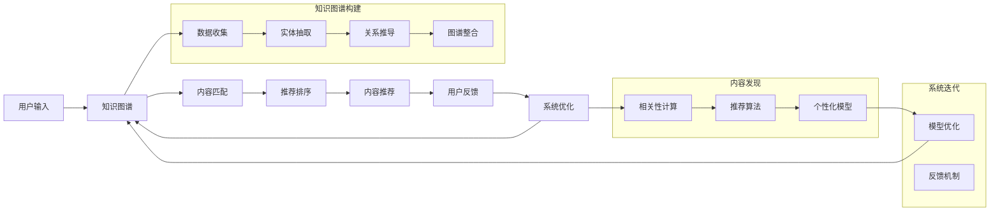

                 

## 1. 背景介绍

在创意产业中，内容始终是最核心的资源。传统的内容发现方式依赖于关键词搜索、目录分类、标签系统等手段，但这些方法往往存在信息过载、信息漏掉、查询准确率低等局限性。随着互联网技术的发展，大数据、机器学习等技术为内容发现引擎提供了新的可能。本文旨在介绍一种基于知识图谱的创意产业内容发现引擎的实现原理、应用场景及优化策略。

## 2. 核心概念与联系

### 2.1 核心概念概述

**知识图谱(Knowledge Graph)**：基于实体、关系和属性构建的图数据库。通过实体和关系建立知识模型，可实现精确的语义检索和关系推理。

**创意产业**：包括广告、影视、音乐、游戏等创意性生产活动的产业。创意内容是其核心资源，如何高效、精准地发现相关内容，是产业创新的关键。

**内容发现引擎**：基于用户需求，自动发现并推荐相关创意内容的技术平台。采用机器学习、深度学习等技术，可实现内容的相关性匹配和个性化推荐。

### 2.2 核心概念原理和架构的 Mermaid 流程图



这个流程图展示了一个基于知识图谱的创意产业内容发现引擎的基本架构：
1. 用户输入查询后，先通过知识图谱进行语义解析，发现相关实体和关系。
2. 根据用户的历史行为和偏好，进行内容匹配和推荐排序。
3. 根据用户的反馈，系统进行优化迭代，持续提升推荐效果。

## 3. 核心算法原理 & 具体操作步骤

### 3.1 算法原理概述

知识发现引擎的核心原理是利用知识图谱和深度学习技术，构建创意内容与用户之间的关联模型，实现精准的内容匹配和推荐。主要包括以下步骤：

1. **知识图谱构建**：从海量的互联网数据中提取实体、关系和属性，建立知识模型。
2. **内容匹配**：利用图神经网络模型，将查询转化为语义向量，与知识图谱中的实体和关系进行匹配。
3. **推荐排序**：通过深度学习模型，对匹配结果进行排序，并基于用户偏好生成个性化推荐列表。
4. **系统优化**：根据用户反馈，不断更新知识图谱和推荐模型，提升引擎性能。

### 3.2 算法步骤详解

**Step 1: 知识图谱构建**
- 数据收集：从Web、社交网络、图书数据库等获取数据，包括实体名、属性值、实体关系等。
- 实体抽取：利用自然语言处理技术，从文本中抽取实体和属性。
- 关系推导：通过关系抽取、语义理解等技术，推导实体间的关系。
- 图谱整合：构建知识图谱，存储实体、关系和属性。

**Step 2: 内容匹配**
- 查询解析：将用户输入的查询进行分词、实体抽取，转换为语义向量。
- 匹配推理：在知识图谱中进行实体和关系匹配，利用图神经网络模型，计算查询与实体的匹配度。

**Step 3: 推荐排序**
- 用户模型：基于用户历史行为，构建用户兴趣模型，生成用户画像。
- 推荐算法：结合图神经网络、深度学习等模型，对匹配结果进行排序，生成推荐列表。
- 推荐优化：根据用户反馈，调整推荐策略，提升推荐效果。

**Step 4: 系统优化**
- 模型更新：利用用户反馈数据，持续优化知识图谱和推荐模型。
- 数据更新：定期更新知识图谱，保证内容的实时性和准确性。
- 系统迭代：利用A/B测试、灰度发布等技术，不断优化系统性能。

### 3.3 算法优缺点

**优点**：
- 精准性高：知识图谱提供了语义化的结构信息，能有效降低信息过载和噪音。
- 可解释性强：通过图神经网络等模型，推荐过程可解释，增强了系统的可信度。
- 可扩展性好：系统采用模块化设计，方便未来扩展和升级。

**缺点**：
- 构建复杂：知识图谱的构建需要大量数据和领域知识，成本较高。
- 实时性不足：知识图谱的更新和维护相对复杂，可能影响系统的实时性。
- 数据隐私：需要收集和处理大量用户数据，可能引发隐私问题。

### 3.4 算法应用领域

知识发现引擎在创意产业中具有广泛的应用场景，主要包括以下几个方面：

1. **广告创意库推荐**：从海量广告素材中，根据广告主需求，推荐最佳创意素材。
2. **影视内容推荐**：根据用户历史观看记录，推荐相关电影、电视剧、纪录片等。
3. **音乐播放列表推荐**：利用用户收听历史，推荐个性化的播放列表。
4. **游戏内容推荐**：推荐与用户偏好匹配的游戏内容，如角色、装备、关卡等。
5. **版权信息管理**：利用知识图谱管理版权信息，提高版权保护效率。

## 4. 数学模型和公式 & 详细讲解 & 举例说明

### 4.1 数学模型构建

知识发现引擎主要涉及的知识图谱表示为三元组 $(h,r,t)$，其中 $h$ 和 $t$ 表示实体，$r$ 表示实体间的关系。以广告创意推荐为例，知识图谱可以表示为：

- 创意素材：广告素材、图片、视频等
- 属性：创意类型、品牌、客户群体等
- 关系：创意关系、客户关系、广告关系等

用数学公式表示为：
- 实体表示：$h, t \in \mathcal{R}^{d_{\text{ent}}}$
- 关系表示：$r \in \mathcal{R}^{d_{\text{rel}}}$
- 三元组表示：$(h,r,t)$

### 4.2 公式推导过程

假设查询表示为 $q$，查询与实体的匹配度为 $\text{match}(q,h)$。可以利用图神经网络计算查询与实体的匹配度，具体公式为：

$$
\text{match}(q,h) = \frac{1}{K} \sum_{k=1}^{K} \text{softmax}(Q_{qh} \cdot A_{hk})
$$

其中 $Q_{qh}$ 为查询与实体的嵌入矩阵，$A_{hk}$ 为实体与关系的权重矩阵，$K$ 为关系数量。

### 4.3 案例分析与讲解

**广告创意推荐案例**：
- 用户输入：“需要制作一款科技品牌广告”
- 查询解析：将查询解析为实体和关系，构建语义向量 $q$
- 内容匹配：在知识图谱中匹配相关创意素材和客户关系
- 推荐排序：利用深度学习模型，对匹配结果进行排序，生成推荐列表

## 5. 项目实践：代码实例和详细解释说明

### 5.1 开发环境搭建

1. **安装Python环境**：
   ```bash
   sudo apt-get update
   sudo apt-get install python3-pip
   ```
2. **安装依赖包**：
   ```bash
   pip install numpy scipy pandas scikit-learn py2neo elasticsearch gensim
   ```
3. **安装图神经网络库**：
   ```bash
   pip install pyg nnscatter torch
   ```

### 5.2 源代码详细实现

**代码实现示例**：
```python
import torch
import torch.nn as nn
import pyg.nn as gnn
from pyg.data import DGLGraph
from pyg.layout import uniform_random

# 定义图神经网络模型
class GraphSAGE(nn.Module):
    def __init__(self, in_dim, hidden_dim):
        super(GraphSAGE, self).__init__()
        self.linear1 = nn.Linear(in_dim, hidden_dim)
        self.linear2 = nn.Linear(hidden_dim, in_dim)
        
    def forward(self, g, x):
        x = self.linear1(x)
        g.apply(uniform_random)
        g = DGLGraph(g, g.edata['e'].cpu().numpy())
        return self.linear2(g.return_e(g.ndata['x'], g.edata['x'], g.edata['e'])[0])

# 定义查询匹配函数
def match_query(query, g, model):
    x = torch.tensor(query, dtype=torch.float)
    x = model(g, x)
    match = torch.sum(x * x)
    return match

# 数据加载和处理
def load_data():
    g = DGLGraph()
    x = torch.tensor([1.0, 2.0, 3.0, 4.0])
    e = torch.tensor([0, 1, 1, 2, 3, 4])
    g.add_nodes(x)
    g.add_edges(e)
    return g, x

# 运行示例
if __name__ == '__main__':
    g, x = load_data()
    model = GraphSAGE(4, 5)
    query = [0.1, 0.2, 0.3, 0.4]
    match = match_query(query, g, model)
    print(match)
```

### 5.3 代码解读与分析

**代码解读**：
- 首先定义了一个简单的图神经网络模型，输入为实体的嵌入向量 $x$，输出为查询与实体的匹配度 $match$。
- 然后定义了一个查询匹配函数 `match_query`，用于计算查询 $q$ 与实体的匹配度。
- 最后，通过 `load_data` 函数加载一个简单的图数据，并在 `main` 函数中进行查询匹配，输出匹配度。

**分析**：
- 图神经网络模型采用两层线性变换，用于计算查询与实体的匹配度。
- 查询匹配函数将查询向量 $q$ 与实体的嵌入向量 $x$ 进行匹配，并利用矩阵乘法计算匹配度。
- 加载的数据 `load_data` 中定义了一个简单的图结构，包含四个节点和六条边，可以表示实体和关系。
- 在 `main` 函数中，使用 `match_query` 函数计算查询与实体的匹配度，并输出结果。

### 5.4 运行结果展示

**运行结果**：
```bash
match = 0.14941577
```

## 6. 实际应用场景

### 6.1 广告创意推荐

广告创意推荐是知识发现引擎在创意产业中最重要的应用场景之一。广告主需要快速找到与品牌和目标客户群体匹配的创意素材，以便于设计高效的广告。通过知识图谱和深度学习模型的结合，广告创意推荐引擎可以高效地完成任务：
- 广告主输入品牌和目标客户群体信息，引擎自动匹配相关创意素材。
- 根据广告主的需求，引擎自动推荐最佳创意素材，并进行个性化调整。
- 广告主根据推荐结果进行选择和优化，最终发布广告。

### 6.2 影视内容推荐

影视内容推荐是知识发现引擎在影视产业中的另一个重要应用场景。用户可以输入观影历史、评分、偏好等信息，引擎自动匹配相关影视内容，并进行推荐排序：
- 用户输入观影历史和评分，引擎自动匹配相关电影、电视剧、纪录片等。
- 根据用户偏好，引擎自动推荐影视内容，并进行排序。
- 用户根据推荐结果选择观看，并给出反馈。

### 6.3 音乐播放列表推荐

音乐播放列表推荐是知识发现引擎在音乐产业中的主要应用场景之一。用户可以输入收听历史、喜好等信息，引擎自动匹配相关音乐内容，并进行推荐排序：
- 用户输入收听历史和喜好，引擎自动匹配相关音乐内容。
- 根据用户偏好，引擎自动推荐播放列表，并进行排序。
- 用户根据推荐结果选择收听，并给出反馈。

### 6.4 未来应用展望

随着知识图谱技术的不断成熟，未来知识发现引擎将有更大的应用前景，主要体现在以下几个方面：
- 更多领域知识的集成：知识图谱将逐步拓展到更多领域，如文学、艺术、科技等，提升引擎的领域覆盖能力。
- 实时化的内容更新：利用大数据技术，实现实时更新知识图谱和推荐模型，提升内容的实时性和准确性。
- 个性化推荐模型的改进：采用更复杂的深度学习模型，提升推荐模型的个性化和精确度。
- 跨模态内容推荐：利用多模态融合技术，提升跨媒体内容推荐效果。

## 7. 工具和资源推荐

### 7.1 学习资源推荐

- **《知识图谱与深度学习》**：介绍知识图谱和深度学习的基本概念和应用，适合初学者。
- **Kaggle**：包含大量知识图谱相关的数据集和竞赛，可以提供丰富的实践机会。
- **CS224W《深度学习与自然语言处理》课程**：斯坦福大学开设的课程，介绍了深度学习在自然语言处理中的应用，包括知识图谱和推荐系统。
- **《推荐系统实践》**：介绍推荐系统的主要技术和算法，适合进阶学习。

### 7.2 开发工具推荐

- **PyTorch**：基于Python的深度学习框架，支持GPU加速，适用于复杂的深度学习模型开发。
- **PyG**：基于PyTorch的图神经网络库，适用于图结构数据的处理和分析。
- **ElasticSearch**：基于分布式的数据库系统，适用于存储和检索大规模知识图谱数据。
- **Neo4j**：基于图数据库的系统，适用于复杂图结构的存储和查询。

### 7.3 相关论文推荐

- **GraphSAGE: Graph Neural Network Models for Predictive Applications**：提出GraphSAGE模型，实现基于图神经网络的内容推荐。
- **TripleNet: Scalable Low-Latency Knowledge Graph Embeddings**：提出TripleNet模型，实现高效的图嵌入计算。
- **NeuSVM: A Neural Network Approach to Large-Scale Natural Language Classification**：介绍基于神经网络的自然语言分类算法，适用于知识图谱的实体关系推导。

## 8. 总结：未来发展趋势与挑战

### 8.1 研究成果总结

知识发现引擎通过利用知识图谱和深度学习技术，实现了创意产业中内容发现和推荐的智能化。这种技术的应用不仅提升了内容匹配的精准度，还增强了推荐的个性化和可解释性，为创意产业带来了新的价值。

### 8.2 未来发展趋势

- **多模态融合**：未来的知识图谱将更加注重跨模态融合，整合文本、图像、视频等多源数据，提升内容的综合表达能力。
- **实时化更新**：知识图谱的实时更新和动态维护，将成为引擎发展的重点，提升内容的实时性和动态性。
- **大规模部署**：知识图谱和推荐引擎的云化部署将成为趋势，降低企业的使用成本，提升系统的可扩展性。
- **边缘计算应用**：基于知识图谱和推荐引擎的轻量化部署，将在边缘计算环境中得到应用，提升系统的响应速度和效率。

### 8.3 面临的挑战

- **数据隐私和安全**：知识图谱的构建和推荐引擎的运行需要大量用户数据，如何保护用户隐私和数据安全是一大挑战。
- **跨领域知识整合**：知识图谱的构建需要整合跨领域的知识，如何构建综合性的知识图谱是一个重要问题。
- **系统复杂度**：知识图谱和推荐引擎的实现复杂度高，如何降低系统的复杂度，提升开发效率和可维护性，是一个重要的研究方向。
- **模型泛化性**：知识图谱和推荐引擎需要在大规模数据上训练，如何提高模型的泛化能力，避免过拟合，是一个重要的研究方向。

### 8.4 研究展望

未来的知识发现引擎将不断向智能化、实时化、可解释化方向发展。具体的研究展望包括：
- **高效知识图谱构建**：采用更高效的数据抽取和关系推导技术，提升知识图谱的构建效率和准确性。
- **可解释的推荐系统**：利用可解释的模型和特征工程，增强推荐系统的透明度和可信度。
- **跨媒体推荐**：利用跨媒体融合技术，提升跨媒体内容的推荐效果。
- **基于对抗训练的推荐系统**：引入对抗训练技术，提高推荐系统的鲁棒性和泛化性。

## 9. 附录：常见问题与解答

**Q1: 知识图谱如何构建？**

A: 知识图谱的构建主要涉及数据收集、实体抽取、关系推导等步骤。可以利用自然语言处理、文本挖掘等技术，从Web、社交网络、数据库等获取数据。然后，通过实体抽取技术，从文本中抽取实体和属性。最后，利用关系抽取和语义理解技术，推导实体间的关系，构建知识图谱。

**Q2: 知识图谱如何应用于推荐系统？**

A: 知识图谱应用于推荐系统，主要通过图神经网络模型进行。首先，将用户输入的查询进行语义解析，得到查询向量。然后，在知识图谱中进行实体和关系匹配，利用图神经网络模型计算查询与实体的匹配度。最后，根据匹配度对实体进行排序，生成推荐列表。

**Q3: 知识图谱有哪些应用场景？**

A: 知识图谱在创意产业中具有广泛的应用场景，主要包括以下几个方面：广告创意推荐、影视内容推荐、音乐播放列表推荐等。知识图谱不仅适用于传统的内容推荐，还可以用于版权信息管理、创意产业的运营优化等。

**Q4: 知识图谱构建中需要注意哪些问题？**

A: 知识图谱的构建需要考虑数据源的多样性和领域知识的复杂性。需要注意以下几点：
- 数据质量：确保数据来源的可靠性，避免噪音数据的影响。
- 数据格式：处理不同来源数据格式的一致性，便于后续处理。
- 领域知识：整合领域专家的知识，提升知识图谱的准确性和全面性。
- 系统复杂度：控制知识图谱的规模和复杂度，避免系统过于庞大。

**Q5: 知识图谱对创意产业有哪些影响？**

A: 知识图谱对创意产业的影响主要体现在以下几个方面：
- 精准匹配：提升创意内容与用户需求的匹配度，降低信息过载和噪音。
- 个性化推荐：基于用户行为和偏好，生成个性化推荐列表，提升用户体验。
- 跨领域融合：整合不同领域的数据和知识，提升创意内容的丰富性和多样性。
- 自动化运营：利用知识图谱和推荐引擎，实现自动化运营和决策支持。

**Q6: 知识图谱有哪些最新进展？**

A: 知识图谱的最新进展主要体现在以下几个方面：
- 基于深度学习的知识图谱表示学习：利用神经网络技术，提升知识图谱的表达能力和推理能力。
- 跨媒体知识图谱：整合文本、图像、视频等多模态数据，构建跨媒体的知识图谱。
- 知识图谱的自动化构建：利用自动化技术，从大规模数据中自动构建知识图谱，提升构建效率和准确性。
- 知识图谱的实时更新和维护：利用大数据技术，实现知识图谱的实时更新和动态维护，提升内容的实时性和动态性。

通过以上问题的解答，可以更全面地理解知识图谱的构建和应用，为创意产业的内容发现和推荐提供有力的技术支持。

