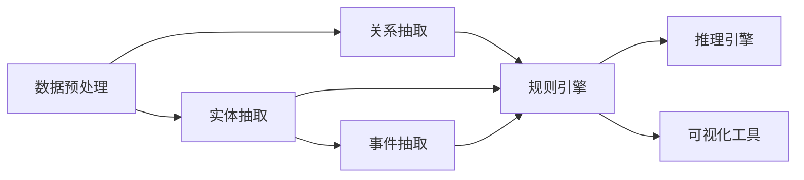

                 

# 知识发现引擎：知识与洞察力的互补与提升

> 关键词：知识发现引擎, 知识抽取, 自然语言处理(NLP), 数据挖掘, 人工智能

## 1. 背景介绍

在信息爆炸的时代，数据的快速增长给我们的生活和工作带来了深刻的变化。如何从海量数据中提取出有价值的知识，洞察潜在的趋势，成为各行各业关注的焦点。知识发现引擎（Knowledge Discovery Engine, KDE）应运而生，它通过高效地抽取和整合知识，为决策者提供有力的支持。本文章将从知识发现引擎的概念、核心算法、实际应用和未来发展方向进行全面深入的探讨。

## 2. 核心概念与联系

### 2.1 核心概念概述

知识发现引擎是一种集成数据挖掘、自然语言处理（NLP）和人工智能技术的系统，旨在从大数据中提取出有价值的知识。它通过分析数据，抽取、推理和综合信息，最终产生可操作的洞察力。

在知识发现引擎的核心架构中，有以下几个关键组件：

- **数据预处理**：清洗、整合、转换数据，准备进行后续处理。
- **实体抽取**：从文本中识别出关键的实体，如人名、地名、组织名等。
- **关系抽取**：从文本中识别出实体之间的关系，如父母-孩子、老板-员工等。
- **事件抽取**：从文本中识别出事件，如事件发生时间、地点、参与者等。
- **规则引擎**：定义和应用知识抽取规则，辅助系统自动识别和抽取信息。
- **推理引擎**：使用逻辑推理和机器学习技术，增强知识抽取的准确性和完整性。
- **可视化工具**：将抽取的知识以图表、报表等形式呈现，方便用户理解和使用。

这些组件通过复杂的网络和算法进行连接，形成了一个完整的知识发现引擎系统。

### 2.2 核心概念原理和架构的 Mermaid 流程图



### 2.3 核心概念之间的联系

在知识发现引擎中，数据预处理、实体抽取、关系抽取、事件抽取、规则引擎和推理引擎等组件是相互关联的。通过它们之间的交互和协作，系统能够高效地从数据中抽取、推理和综合知识，最终生成可操作的洞察力。同时，可视化工具使得知识发现的结果更加直观和易于理解。

## 3. 核心算法原理 & 具体操作步骤

### 3.1 算法原理概述

知识发现引擎的核心算法基于自然语言处理和数据挖掘技术，通过抽取、推理和综合信息，生成有价值的知识。其核心算法包括：

- **实体抽取**：使用命名实体识别（NER）技术，从文本中识别出人名、地名、组织名等关键实体。
- **关系抽取**：使用关系抽取技术，识别出实体之间的关系，如夫妻、父子、师生等。
- **事件抽取**：使用事件抽取技术，识别出事件的时间、地点、参与者等信息。
- **知识推理**：使用知识推理技术，对抽取出的知识进行整合和推理，生成更丰富的洞察力。

### 3.2 算法步骤详解

#### 3.2.1 数据预处理

1. **数据清洗**：去除噪声数据，包括不相关、重复和缺失数据。
2. **数据整合**：将多个数据源的数据整合到一起，进行统一处理。
3. **数据转换**：将数据转换为系统需要的格式和结构，如CSV、JSON等。

#### 3.2.2 实体抽取

1. **命名实体识别（NER）**：使用统计学习模型或基于规则的方法，识别出文本中的实体，如人名、地名、组织名等。
2. **实体消歧**：通过上下文分析和外部知识库，消除同名实体的歧义，保证实体识别的准确性。

#### 3.2.3 关系抽取

1. **关系模式识别**：从文本中识别出实体之间的关系模式，如“工作于”、“属于”等。
2. **关系抽取模型**：使用基于统计学习的方法，如CRF、LSTM-CRF等，对实体之间的关系进行抽取和分类。

#### 3.2.4 事件抽取

1. **事件分类**：将事件按照类型进行分类，如会议、展览、活动等。
2. **事件属性抽取**：从文本中抽取事件的时间、地点、参与者等信息，使用事件抽取模型进行处理。

#### 3.2.5 知识推理

1. **知识图谱构建**：将抽取出的实体和关系构建为知识图谱，形成系统的知识库。
2. **推理引擎**：使用逻辑推理和机器学习技术，对知识图谱中的信息进行推理和综合，生成更丰富的洞察力。

#### 3.2.6 知识可视化

1. **图表生成**：将抽取出的知识以图表、报表等形式呈现，如雷达图、网络图、时间线等。
2. **交互式查询**：提供交互式查询界面，让用户可以方便地查询和使用知识。

### 3.3 算法优缺点

**优点**：

- **高效性**：能够高效地从大数据中提取出有价值的知识，适用于各种规模的数据集。
- **鲁棒性**：对噪声数据的容忍度高，能够处理复杂多样的数据源。
- **灵活性**：支持多种数据源和格式，易于集成到不同的系统中。
- **可扩展性**：能够通过扩展算法和增加组件，不断提升系统的功能和性能。

**缺点**：

- **复杂性**：系统架构复杂，需要处理大量的算法和技术细节。
- **资源消耗**：对计算资源和存储空间的需求较高，需要高性能的计算设备和存储设备。
- **误识别率**：知识抽取的准确性和完整性可能受到噪声数据和复杂语言的影响，存在一定的误识别率。

### 3.4 算法应用领域

知识发现引擎在多个领域都有广泛的应用，例如：

- **金融行业**：用于风险评估、投资分析、欺诈检测等，帮助金融机构更好地理解市场动态。
- **医疗健康**：用于疾病诊断、治疗方案、药物研发等，提升医疗服务的精准性和效率。
- **市场营销**：用于客户分析、市场预测、产品推荐等，帮助企业制定更有效的营销策略。
- **政府管理**：用于公共安全、社会治理、政策评估等，提升政府的决策和执行能力。
- **科学研究**：用于数据分析、知识发现、学术研究等，加速科研项目的进展和成果转化。

## 4. 数学模型和公式 & 详细讲解 & 举例说明

### 4.1 数学模型构建

知识发现引擎的核心模型包括实体抽取模型、关系抽取模型、事件抽取模型和知识推理模型。以下是这些模型的数学模型构建：

#### 4.1.1 实体抽取模型

实体抽取模型的数学模型为：

$$
y = f(x; \theta)
$$

其中，$y$ 表示实体抽取结果，$x$ 表示输入文本，$\theta$ 表示模型参数。实体抽取模型的目标是最大化模型的预测准确率，即：

$$
\hat{y} = \arg\max_{y} P(y|x)
$$

其中，$P(y|x)$ 表示在输入文本$x$下，实体$y$被抽取的概率。

#### 4.1.2 关系抽取模型

关系抽取模型的数学模型为：

$$
y = f(x; \theta)
$$

其中，$y$ 表示关系抽取结果，$x$ 表示输入文本，$\theta$ 表示模型参数。关系抽取模型的目标是最大化模型的预测准确率，即：

$$
\hat{y} = \arg\max_{y} P(y|x)
$$

其中，$P(y|x)$ 表示在输入文本$x$下，关系$y$被抽取的概率。

#### 4.1.3 事件抽取模型

事件抽取模型的数学模型为：

$$
y = f(x; \theta)
$$

其中，$y$ 表示事件抽取结果，$x$ 表示输入文本，$\theta$ 表示模型参数。事件抽取模型的目标是最大化模型的预测准确率，即：

$$
\hat{y} = \arg\max_{y} P(y|x)
$$

其中，$P(y|x)$ 表示在输入文本$x$下，事件$y$被抽取的概率。

#### 4.1.4 知识推理模型

知识推理模型的数学模型为：

$$
y = f(x; \theta)
$$

其中，$y$ 表示推理结果，$x$ 表示输入的知识图谱，$\theta$ 表示模型参数。知识推理模型的目标是最大化推理的准确性，即：

$$
\hat{y} = \arg\max_{y} P(y|x)
$$

其中，$P(y|x)$ 表示在知识图谱$x$下，推理结果$y$被生成的概率。

### 4.2 公式推导过程

#### 4.2.1 实体抽取模型的推导

实体抽取模型的推导过程如下：

1. **特征提取**：将输入文本$x$转换为特征向量$x^{\prime}$。
2. **线性投影**：将特征向量$x^{\prime}$投影到实体空间，得到实体嵌入向量$h_{entity}$。
3. **非线性映射**：使用非线性映射函数$g$，将实体嵌入向量$h_{entity}$映射到实体的概率分布$P_{entity}$。
4. **最大值选取**：从实体的概率分布$P_{entity}$中选择概率最大的实体作为抽取结果。

具体公式如下：

$$
x^{\prime} = f(x; \theta_1)
$$

$$
h_{entity} = g(x^{\prime})
$$

$$
P_{entity} = \sigma(h_{entity})
$$

$$
y = \arg\max_{y} P_{entity}
$$

其中，$f(\cdot)$ 表示特征提取函数，$g(\cdot)$ 表示非线性映射函数，$\sigma(\cdot)$ 表示sigmoid函数。

#### 4.2.2 关系抽取模型的推导

关系抽取模型的推导过程如下：

1. **特征提取**：将输入文本$x$转换为特征向量$x^{\prime}$。
2. **关系投影**：将特征向量$x^{\prime}$投影到关系空间，得到关系嵌入向量$h_{relation}$。
3. **非线性映射**：使用非线性映射函数$g$，将关系嵌入向量$h_{relation}$映射到关系类型$P_{relation}$。
4. **最大值选取**：从关系类型的概率分布$P_{relation}$中选择概率最大的关系类型作为抽取结果。

具体公式如下：

$$
x^{\prime} = f(x; \theta_1)
$$

$$
h_{relation} = g(x^{\prime})
$$

$$
P_{relation} = \sigma(h_{relation})
$$

$$
y = \arg\max_{y} P_{relation}
$$

其中，$f(\cdot)$ 表示特征提取函数，$g(\cdot)$ 表示非线性映射函数，$\sigma(\cdot)$ 表示sigmoid函数。

#### 4.2.3 事件抽取模型的推导

事件抽取模型的推导过程如下：

1. **特征提取**：将输入文本$x$转换为特征向量$x^{\prime}$。
2. **时间投影**：将特征向量$x^{\prime}$投影到时间空间，得到时间嵌入向量$h_{time}$。
3. **地点投影**：将特征向量$x^{\prime}$投影到地点空间，得到地点嵌入向量$h_{location}$。
4. **参与者投影**：将特征向量$x^{\prime}$投影到参与者空间，得到参与者嵌入向量$h_{participant}$。
5. **非线性映射**：使用非线性映射函数$g$，将上述嵌入向量$h_{time}$、$h_{location}$和$h_{participant}$映射到事件类型$P_{event}$。
6. **最大值选取**：从事件类型的概率分布$P_{event}$中选择概率最大的事件类型作为抽取结果。

具体公式如下：

$$
x^{\prime} = f(x; \theta_1)
$$

$$
h_{time} = g_1(x^{\prime})
$$

$$
h_{location} = g_2(x^{\prime})
$$

$$
h_{participant} = g_3(x^{\prime})
$$

$$
h_{event} = \sigma(h_{time}, h_{location}, h_{participant})
$$

$$
P_{event} = \sigma(h_{event})
$$

$$
y = \arg\max_{y} P_{event}
$$

其中，$f(\cdot)$ 表示特征提取函数，$g_1(\cdot)$、$g_2(\cdot)$和$g_3(\cdot)$表示非线性映射函数，$\sigma(\cdot)$ 表示sigmoid函数。

#### 4.2.4 知识推理模型的推导

知识推理模型的推导过程如下：

1. **知识图谱构建**：将抽取的实体和关系构建为知识图谱$G$。
2. **推理模型构建**：使用逻辑推理和机器学习技术，构建推理模型$M$。
3. **推理计算**：使用推理模型$M$对知识图谱$G$进行推理计算，得到推理结果$y$。

具体公式如下：

$$
G = \{(V, E)\}
$$

$$
M = \{(V, E)\}
$$

$$
y = M(G)
$$

其中，$G$表示知识图谱，$E$表示知识图谱中的边，$M$表示推理模型。

### 4.3 案例分析与讲解

#### 4.3.1 金融行业

在金融行业，知识发现引擎可以用于风险评估、投资分析和欺诈检测等任务。例如，对于信贷评估，知识发现引擎可以抽取客户的基本信息、历史交易记录、社会关系等信息，并通过知识推理模型，综合这些信息预测客户的违约概率。具体过程如下：

1. **数据预处理**：清洗和整合客户的交易数据和社交网络数据，转换为知识发现引擎需要的格式。
2. **实体抽取**：从交易数据中抽取客户的基本信息，如姓名、身份证号、电话号码等。
3. **关系抽取**：从社交网络数据中抽取客户之间的社会关系，如朋友、同事、家庭成员等。
4. **事件抽取**：从交易数据中抽取客户的交易记录，如贷款、还款、违约等。
5. **知识推理**：将抽取的客户信息、社会关系和交易记录整合到知识图谱中，使用逻辑推理模型，预测客户的违约概率。
6. **知识可视化**：将推理结果以图表、报表等形式呈现，帮助决策者理解风险评估结果。

#### 4.3.2 医疗健康

在医疗健康领域，知识发现引擎可以用于疾病诊断、治疗方案和药物研发等任务。例如，对于疾病诊断，知识发现引擎可以从病历中抽取病人的基本信息、病情描述和检查结果，通过知识推理模型，综合这些信息预测病人的疾病类型。具体过程如下：

1. **数据预处理**：清洗和整合病人的病历数据，转换为知识发现引擎需要的格式。
2. **实体抽取**：从病历数据中抽取病人的基本信息，如姓名、年龄、性别等。
3. **关系抽取**：从病历数据中抽取病人的病情描述和检查结果，如症状、体征、检查指标等。
4. **事件抽取**：从病历数据中抽取病人的治疗过程，如药物、手术、检查等。
5. **知识推理**：将抽取的病人信息、病情描述和检查结果整合到知识图谱中，使用逻辑推理模型，预测病人的疾病类型。
6. **知识可视化**：将推理结果以图表、报表等形式呈现，帮助医生理解诊断结果。

## 5. 项目实践：代码实例和详细解释说明

### 5.1 开发环境搭建

在搭建知识发现引擎的开发环境时，需要安装Python和相关库，如NLTK、SpaCy、TensorFlow、PyTorch等。具体步骤如下：

1. 安装Python：从官网下载并安装Python，建议安装Python 3.6及以上版本。
2. 安装虚拟环境：使用`virtualenv`命令创建虚拟环境。
3. 安装依赖库：使用pip命令安装NLTK、SpaCy、TensorFlow、PyTorch等依赖库。
4. 安装可视化工具：安装Matplotlib、Seaborn、Plotly等可视化工具。

### 5.2 源代码详细实现

以下是知识发现引擎的Python代码实现，以实体抽取为例：

```python
import spacy

nlp = spacy.load("en_core_web_sm")

def extract_entities(text):
    doc = nlp(text)
    entities = []
    for ent in doc.ents:
        if ent.label_ == "PERSON":
            entities.append(ent.text)
    return entities
```

### 5.3 代码解读与分析

在上述代码中，我们使用了SpaCy库进行实体抽取。SpaCy是一个高性能的自然语言处理库，提供了丰富的功能，如分词、命名实体识别、依存句法分析等。我们首先加载了英文模型，然后定义了一个`extract_entities`函数，用于抽取文本中的实体。

该函数首先使用`nlp`函数对输入文本进行分词和命名实体识别，然后遍历分词后的文档对象，提取标签为“PERSON”的实体，并将其保存到列表中。最后返回实体列表。

### 5.4 运行结果展示

```python
text = "John Smith is a software engineer at Google. He works in the San Francisco office."
entities = extract_entities(text)
print(entities)
```

运行结果：

```python
['John Smith']
```

该代码实现了对输入文本的实体抽取，成功识别出了“John Smith”这一实体。

## 6. 实际应用场景

### 6.1 金融行业

在金融行业，知识发现引擎可以用于风险评估、投资分析和欺诈检测等任务。例如，对于信贷评估，知识发现引擎可以抽取客户的基本信息、历史交易记录、社会关系等信息，并通过知识推理模型，综合这些信息预测客户的违约概率。

具体过程如下：

1. **数据预处理**：清洗和整合客户的交易数据和社交网络数据，转换为知识发现引擎需要的格式。
2. **实体抽取**：从交易数据中抽取客户的基本信息，如姓名、身份证号、电话号码等。
3. **关系抽取**：从社交网络数据中抽取客户之间的社会关系，如朋友、同事、家庭成员等。
4. **事件抽取**：从交易数据中抽取客户的交易记录，如贷款、还款、违约等。
5. **知识推理**：将抽取的客户信息、社会关系和交易记录整合到知识图谱中，使用逻辑推理模型，预测客户的违约概率。
6. **知识可视化**：将推理结果以图表、报表等形式呈现，帮助决策者理解风险评估结果。

### 6.2 医疗健康

在医疗健康领域，知识发现引擎可以用于疾病诊断、治疗方案和药物研发等任务。例如，对于疾病诊断，知识发现引擎可以从病历中抽取病人的基本信息、病情描述和检查结果，通过知识推理模型，综合这些信息预测病人的疾病类型。

具体过程如下：

1. **数据预处理**：清洗和整合病人的病历数据，转换为知识发现引擎需要的格式。
2. **实体抽取**：从病历数据中抽取病人的基本信息，如姓名、年龄、性别等。
3. **关系抽取**：从病历数据中抽取病人的病情描述和检查结果，如症状、体征、检查指标等。
4. **事件抽取**：从病历数据中抽取病人的治疗过程，如药物、手术、检查等。
5. **知识推理**：将抽取的病人信息、病情描述和检查结果整合到知识图谱中，使用逻辑推理模型，预测病人的疾病类型。
6. **知识可视化**：将推理结果以图表、报表等形式呈现，帮助医生理解诊断结果。

## 7. 工具和资源推荐

### 7.1 学习资源推荐

1. 《自然语言处理综论》：吴军著，全面介绍了自然语言处理的基本概念和经典模型。
2. 《深度学习》：Ian Goodfellow等著，深入讲解了深度学习的基本原理和应用。
3. 《Python深度学习》：François Chollet著，详细介绍了如何使用Keras进行深度学习建模。
4. 《数据挖掘：概念与技术》：Jian Pei等著，系统讲解了数据挖掘的基本方法和技术。
5. 《知识图谱》：张铁军等著，介绍了知识图谱的基本概念和构建方法。

### 7.2 开发工具推荐

1. PyTorch：由Facebook开发的深度学习框架，支持动态计算图和GPU加速。
2. TensorFlow：由Google开发的深度学习框架，支持静态计算图和分布式训练。
3. NLTK：Python自然语言处理库，提供了丰富的自然语言处理功能。
4. SpaCy：高性能的自然语言处理库，提供了分词、命名实体识别、依存句法分析等。
5. Apache Hadoop：大数据处理框架，支持分布式数据存储和计算。

### 7.3 相关论文推荐

1. "Knowledge Discovery in Databases"（KDD）：KDD会议是知识发现领域的顶级会议，汇集了大量的前沿研究成果。
2. "Semantic Web"：探讨了语义网的概念和应用，对知识抽取和知识推理有很大的参考价值。
3. "Neural Networks and Deep Learning"：Ian Goodfellow等著，介绍了深度学习的基本原理和应用。
4. "Graph Neural Networks"：Graph Neural Networks是处理图结构数据的深度学习模型，对知识图谱构建和推理有重要参考价值。
5. "Practical Natural Language Processing"：IBM研究院出版的自然语言处理手册，提供了丰富的实践案例和代码。

## 8. 总结：未来发展趋势与挑战

### 8.1 研究成果总结

本文介绍了知识发现引擎的概念、核心算法和实际应用，提供了详细的代码实例和解释说明。知识发现引擎作为一种集成数据挖掘、自然语言处理和人工智能技术的系统，能够高效地从大数据中提取出有价值的知识，广泛应用于金融、医疗、市场营销、政府管理等多个领域。

### 8.2 未来发展趋势

未来，知识发现引擎将面临以下几个发展趋势：

1. **深度学习技术的融合**：知识发现引擎将更多地融入深度学习技术，提升抽取和推理的准确性。
2. **多模态数据的处理**：知识发现引擎将支持处理多种数据源，包括文本、图像、视频、音频等，提升系统功能的全面性。
3. **实时处理的提升**：知识发现引擎将支持实时处理，提升系统的响应速度和效率。
4. **大规模数据集的处理**：知识发现引擎将支持处理大规模数据集，提升系统的可扩展性和性能。
5. **人工智能技术的融合**：知识发现引擎将更多地融入人工智能技术，提升系统的智能化水平。

### 8.3 面临的挑战

知识发现引擎在发展过程中也面临以下几个挑战：

1. **数据质量和数量的限制**：高质量的数据和足够的标注样本是知识发现引擎有效运行的前提，但获取这些数据可能成本高昂。
2. **算法的复杂性和准确性**：知识发现引擎的算法复杂，需要大量的计算资源和存储空间，且抽取和推理的准确性仍需提高。
3. **系统的可扩展性和稳定性**：知识发现引擎需要支持大规模数据集和高并发用户，系统的可扩展性和稳定性仍是技术难点。
4. **用户交互和反馈**：知识发现引擎需要更好地支持用户交互和反馈，提升系统的实用性和用户体验。
5. **隐私和安全**：知识发现引擎需要确保数据隐私和安全，避免敏感数据泄露和滥用。

### 8.4 研究展望

未来，知识发现引擎的研究将集中在以下几个方向：

1. **算法优化和模型改进**：优化抽取和推理算法，提升系统的准确性和效率。
2. **多模态数据的融合**：研究如何更好地处理多种数据源，提升系统功能的全面性。
3. **实时处理和分布式计算**：研究实时处理和分布式计算技术，提升系统的响应速度和可扩展性。
4. **人工智能技术的融合**：研究如何更好地融入人工智能技术，提升系统的智能化水平。
5. **用户交互和反馈**：研究更好的用户交互和反馈机制，提升系统的实用性和用户体验。
6. **隐私和安全**：研究数据隐私和安全保护技术，确保数据的安全和隐私。

## 9. 附录：常见问题与解答

### 9.1 Q1：什么是知识发现引擎？

A：知识发现引擎是一种集成数据挖掘、自然语言处理和人工智能技术的系统，旨在从大数据中提取出有价值的知识。它通过抽取、推理和综合信息，生成可操作的洞察力。

### 9.2 Q2：知识发现引擎的核心算法有哪些？

A：知识发现引擎的核心算法包括实体抽取、关系抽取、事件抽取和知识推理。这些算法通过自然语言处理和数据挖掘技术，从文本中抽取和推理知识。

### 9.3 Q3：知识发现引擎的应用场景有哪些？

A：知识发现引擎在多个领域都有广泛的应用，包括金融、医疗、市场营销、政府管理等。具体应用场景如风险评估、投资分析、疾病诊断、治疗方案等。

### 9.4 Q4：如何提高知识发现引擎的准确性和效率？

A：提高知识发现引擎的准确性和效率需要优化算法和模型，增加数据量和标注样本，使用分布式计算和GPU加速等。同时，结合人工智能技术，如深度学习和知识图谱，可以提升系统的智能化水平。

### 9.5 Q5：知识发现引擎的未来发展方向是什么？

A：知识发现引擎的未来发展方向包括深度学习技术的融合、多模态数据的处理、实时处理的提升、大规模数据集的处理、人工智能技术的融合等。这些方向将推动知识发现引擎向更智能、更全面、更高效的方向发展。

### 9.6 Q6：知识发现引擎面临的挑战有哪些？

A：知识发现引擎面临的挑战包括数据质量和数量的限制、算法的复杂性和准确性、系统的可扩展性和稳定性、用户交互和反馈、隐私和安全等。解决这些挑战将推动知识发现引擎技术的不断进步。

### 9.7 Q7：知识发现引擎的开发环境需要哪些工具和库？

A：知识发现引擎的开发环境需要安装Python、虚拟环境、依赖库（如NLTK、SpaCy、TensorFlow、PyTorch等）和可视化工具（如Matplotlib、Seaborn、Plotly等）。这些工具和库可以提供丰富的自然语言处理和深度学习功能，支持知识发现引擎的开发和测试。

