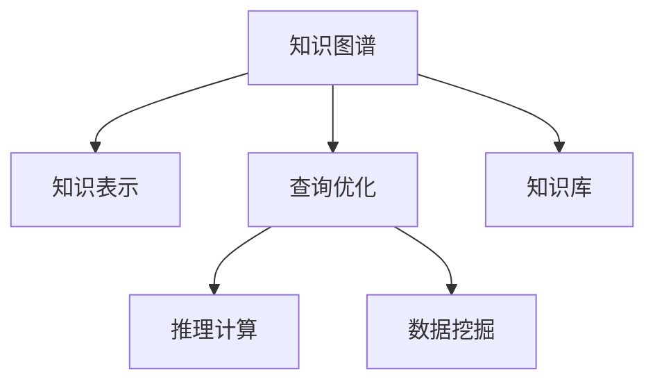

                 

# 知识发现引擎：知识与洞察力的完美统一

> 关键词：知识发现引擎,知识图谱,知识表示,查询优化,算法优化,推理计算,数据挖掘,分析工具,企业决策,大数据分析

## 1. 背景介绍

### 1.1 问题由来
随着信息技术的迅猛发展，数据已成为现代企业的重要资产。企业不仅需要存储和管理大量数据，更需要从中挖掘出有价值的信息，以驱动决策和创新。然而，数据的海量性和复杂性使得简单的数据挖掘和报表分析已无法满足需求。这一背景下，知识发现引擎(Knowledge Discovery Engine, KDE)应运而生。

知识发现引擎通过高效的知识表示、查询优化和推理计算，帮助企业从海量数据中快速提炼出有价值的知识，并转换为可行的决策建议。这种从数据中发现知识的过程，不仅能够提升企业的决策效率，还能增强其创新能力和市场竞争力。

### 1.2 问题核心关键点
知识发现引擎的核心在于如何将知识从数据中提炼出来，并转化为可行的决策建议。主要包括以下几个关键点：

- **知识表示**：如何将现实世界的知识以计算机可理解的形式表示出来。
- **查询优化**：如何快速地从知识库中获取所需信息，优化查询过程。
- **推理计算**：如何基于知识库中的信息，进行逻辑推理，生成新的知识。
- **数据挖掘**：从大规模数据中，自动发现数据间的关联和模式。

这些关键点共同构成了知识发现引擎的核心算法和技术体系，使其能够高效地从数据中提炼出有价值的知识。

## 2. 核心概念与联系

### 2.1 核心概念概述

为更好地理解知识发现引擎的原理和技术框架，本节将介绍几个关键的概念及其相互联系：

- **知识图谱(Knowledge Graph)**：一种用于描述现实世界中实体和关系的图形结构。通过对实体和关系进行图形化表示，知识图谱能够更直观、更全面地描述知识。

- **知识表示(Knowledge Representation)**：将知识图谱中的实体和关系转换为计算机可理解的形式，如RDF、OWL等。知识表示是知识发现引擎的基础，决定了其能处理的知识点和范围。

- **查询优化(Query Optimization)**：从知识库中获取所需信息的整个过程，包括查询生成、查询计划构建、查询执行等。查询优化是提升知识发现引擎性能的重要手段。

- **推理计算(Reasoning)**：基于知识图谱中的信息，通过逻辑推理生成新的知识。推理计算是知识发现引擎的核心能力，能够从已知知识中推导出未知结论。

- **数据挖掘(Data Mining)**：从大规模数据中自动发现数据间的关联和模式，为知识发现引擎提供数据支撑。

这些核心概念之间的逻辑关系可以通过以下Mermaid流程图来展示：



这个流程图展示了知识发现引擎的核心组件及其相互关系：

1. 知识图谱通过知识表示技术，将知识转换为计算机可理解的形式。
2. 查询优化通过高效地从知识库中获取所需信息，提升知识发现引擎的性能。
3. 推理计算基于知识图谱中的信息，进行逻辑推理，生成新的知识。
4. 数据挖掘从大规模数据中发现数据间的关联和模式，为知识发现引擎提供数据支撑。

这些核心组件共同构成了知识发现引擎的技术框架，使其能够高效地从数据中提炼出有价值的知识。

## 3. 核心算法原理 & 具体操作步骤
### 3.1 算法原理概述

知识发现引擎的核心算法原理涉及知识图谱构建、知识表示、查询优化、推理计算和数据挖掘等多个方面。以下对每个关键点进行详细解释。

### 3.2 算法步骤详解

#### 3.2.1 知识图谱构建

知识图谱的构建是知识发现引擎的第一步，通过描述现实世界中的实体和关系，为后续的推理计算和查询优化提供基础。

知识图谱的构建一般分为两个阶段：

- **实体识别(Entity Recognition)**：从大规模数据中自动识别出实体，如人名、地名、组织名等。
- **关系抽取(Relation Extraction)**：识别实体间的关系，如“李华来自上海”。

#### 3.2.2 知识表示

知识表示是将知识图谱中的实体和关系转换为计算机可理解的形式。目前常用的知识表示方法包括：

- **RDF (Resource Description Framework)**：一种基于XML的语义网络描述语言，用于描述Web上的资源及其关系。
- **OWL (Web Ontology Language)**：一种基于描述逻辑的形式化语言，用于构建本体，表示知识。

#### 3.2.3 查询优化

查询优化是知识发现引擎的核心部分，通过高效的查询处理，快速从知识库中获取所需信息。

查询优化主要包括以下几个步骤：

- **查询生成**：根据用户输入的查询意图，生成相应的查询语句。
- **查询计划构建**：将查询语句转换为高效的查询计划，如优化谓词顺序、限制搜索范围等。
- **查询执行**：执行查询计划，从知识库中获取所需信息。

#### 3.2.4 推理计算

推理计算是知识发现引擎的重要组成部分，通过逻辑推理生成新的知识。

推理计算主要包括以下几个步骤：

- **推理规则**：定义推理规则，描述知识图谱中的逻辑关系。
- **推理引擎**：基于推理规则，对知识图谱进行推理计算，生成新的知识。

#### 3.2.5 数据挖掘

数据挖掘是从大规模数据中发现数据间的关联和模式。

数据挖掘主要包括以下几个步骤：

- **数据清洗**：去除数据中的噪声和异常值，保证数据质量。
- **数据预处理**：对数据进行归一化、特征提取等处理，准备后续分析。
- **数据挖掘算法**：使用分类、聚类、关联规则等算法，发现数据间的关联和模式。

### 3.3 算法优缺点

知识发现引擎具有以下优点：

- **高效的知识提取**：通过高效的知识表示和查询优化，能够快速从数据中提取有价值的知识。
- **灵活的推理能力**：通过定义推理规则，能够灵活地从已知知识中推导出新的结论。
- **全面覆盖**：能够覆盖不同领域和场景，适用于各种复杂的知识发现任务。

同时，知识发现引擎也存在一定的局限性：

- **对数据质量依赖高**：数据挖掘和推理计算的准确性高度依赖于数据的质量。
- **技术门槛高**：知识发现引擎涉及的知识表示、查询优化、推理计算等技术较为复杂，需要较高的技术门槛。
- **扩展性差**：知识图谱的构建和维护需要大量的时间和人力，难以在大规模数据上快速扩展。

尽管存在这些局限性，但知识发现引擎在企业和科研领域的应用仍然非常广泛，为数据驱动的决策和创新提供了重要支撑。

### 3.4 算法应用领域

知识发现引擎在多个领域都有广泛应用，以下是几个典型的应用场景：

#### 3.4.1 企业决策支持

企业在日常运营中，需要从大量的业务数据中快速提炼出有价值的信息，支持决策。知识发现引擎能够自动地从数据中发现知识，并转换为可行的决策建议，提升决策效率和效果。

#### 3.4.2 科研数据分析

科研领域需要从大量实验数据中提取规律和模式，知识发现引擎能够帮助研究人员快速地从数据中发现新的科学知识，推动科学研究的发展。

#### 3.4.3 金融市场分析

金融市场数据量大、复杂，知识发现引擎能够从海量数据中发现市场趋势和风险点，支持投资决策。

#### 3.4.4 医疗诊断和治疗

医疗领域需要从病历、影像等多种数据中提取信息，支持疾病的诊断和治疗。知识发现引擎能够帮助医生快速地从数据中发现疾病模式和治疗方案，提升医疗服务质量。

## 4. 数学模型和公式 & 详细讲解 & 举例说明

### 4.1 数学模型构建

知识发现引擎涉及多个数学模型，以下对其中几个常用的模型进行详细解释。

#### 4.1.1 RDF模型

RDF是一种用于描述Web资源的语义网络表示语言，常用于知识图谱的构建。RDF模型由三个基本元素组成：资源、属性和值。

- **资源**：表示知识图谱中的实体，如人名、地名等。
- **属性**：表示实体之间的关系，如“来自”、“属于”等。
- **值**：表示属性的取值，如“李华”、“上海”等。

RDF模型的形式化表示如下：

$$
RDF ::= \langle \textit{资源}, \textit{属性}, \textit{值} \rangle
$$

#### 4.1.2 OWL模型

OWL是一种基于描述逻辑的形式化语言，常用于构建本体，表示知识。OWL模型由类、属性、实例等基本元素组成。

- **类**：表示实体集合，如“人”、“地”等。
- **属性**：表示实体之间的关系，如“来自”、“属于”等。
- **实例**：表示类的具体实例，如“李华”、“上海”等。

OWL模型的形式化表示如下：

$$
OWL ::= \langle \textit{类}, \textit{属性}, \textit{实例} \rangle
$$

#### 4.1.3 查询优化模型

查询优化模型主要用于优化查询过程，提升查询效率。常用的查询优化模型包括基于规则的优化和基于代价模型的优化。

- **基于规则的优化**：通过定义优化规则，直接优化查询语句。
- **基于代价模型的优化**：通过构建查询代价模型，动态选择最优查询计划。

#### 4.1.4 推理计算模型

推理计算模型主要用于基于知识图谱进行逻辑推理，生成新的知识。常用的推理计算模型包括基于规则的推理和基于逻辑的推理。

- **基于规则的推理**：通过定义推理规则，直接进行推理计算。
- **基于逻辑的推理**：通过定义逻辑公式，进行自动推理计算。

### 4.2 公式推导过程

#### 4.2.1 RDF查询

RDF查询是一种基于RDF模型的查询语言，用于从知识库中获取信息。RDF查询的语法规则如下：

- **SELECT语句**：用于选择需要返回的结果。
- **WHERE语句**：用于限制查询的范围。
- **GROUP BY语句**：用于对结果进行分组。
- **ORDER BY语句**：用于对结果进行排序。

例如，查询所有来自上海的人名：

$$
SELECT ?name WHERE { ?name a :Person; :来自 :上海 }
$$

#### 4.2.2 OWL推理

OWL推理是一种基于OWL本体的推理计算，用于从知识图谱中推导出新的知识。OWL推理的语法规则如下：

- **定义类**：定义类的属性和实例。
- **定义属性**：定义属性之间的关系。
- **定义实例**：定义类的具体实例。
- **推理规则**：定义推理规则，用于推导新的知识。

例如，定义一个简单的OWL本体：

$$
\text{类} ::= \text{人}(?name) \sqcap \text{来自}(?name, :上海)
$$

### 4.3 案例分析与讲解

#### 4.3.1 企业决策支持案例

某电商平台希望通过知识发现引擎，从海量用户行为数据中提炼出有价值的知识，支持销售决策。具体步骤如下：

1. **数据清洗**：去除数据中的噪声和异常值，保证数据质量。
2. **数据预处理**：对用户行为数据进行归一化、特征提取等处理。
3. **构建知识图谱**：从用户行为数据中自动识别出实体和关系，构建知识图谱。
4. **查询优化**：根据销售决策需求，生成查询语句，优化查询计划。
5. **推理计算**：基于知识图谱进行推理计算，生成销售预测和推荐方案。
6. **反馈迭代**：将推理结果反馈给销售部门，不断优化查询和推理模型。

通过知识发现引擎，电商平台能够快速地从用户行为数据中提炼出有价值的知识，支持销售决策，提升用户体验和销售额。

#### 4.3.2 科研数据分析案例

某科研团队希望通过知识发现引擎，从大量实验数据中发现新的科学知识，支持科学研究。具体步骤如下：

1. **数据清洗**：去除实验数据中的噪声和异常值，保证数据质量。
2. **数据预处理**：对实验数据进行归一化、特征提取等处理。
3. **构建知识图谱**：从实验数据中自动识别出实体和关系，构建知识图谱。
4. **查询优化**：根据科研需求，生成查询语句，优化查询计划。
5. **推理计算**：基于知识图谱进行推理计算，发现新的科学知识。
6. **反馈迭代**：将推理结果反馈给科研团队，不断优化查询和推理模型。

通过知识发现引擎，科研团队能够快速地从实验数据中发现新的科学知识，推动科学研究的发展，加速科研成果的产出。

## 5. 项目实践：代码实例和详细解释说明

### 5.1 开发环境搭建

在进行知识发现引擎项目开发前，我们需要准备好开发环境。以下是使用Python进行开发的环境配置流程：

1. 安装Anaconda：从官网下载并安装Anaconda，用于创建独立的Python环境。

2. 创建并激活虚拟环境：
```bash
conda create -n kde-env python=3.8 
conda activate kde-env
```

3. 安装必要的Python库：
```bash
pip install pandas numpy scikit-learn scipy matplotlib seaborn joblib tqdm
```

4. 安装RDF和OWL相关库：
```bash
pip install rdflib owlapi
```

5. 安装相关可视化工具：
```bash
pip install matplotlib pyplot seaborn plotly
```

完成上述步骤后，即可在`kde-env`环境中开始项目开发。

### 5.2 源代码详细实现

下面我们以企业决策支持为例，给出使用Python实现知识发现引擎的代码实现。

首先，定义数据清洗函数：

```python
import pandas as pd
import numpy as np

def data_cleaning(data):
    # 去除噪声和异常值
    data = data[data['销售额'] > 0]
    # 归一化数据
    data['销售额'] = (data['销售额'] - np.mean(data['销售额'])) / np.std(data['销售额'])
    # 特征提取
    data['时间'] = pd.to_datetime(data['时间']).dt.month
    return data
```

然后，定义知识图谱构建函数：

```python
from rdflib import Namespace, Graph

def build_kg(data):
    kg = Graph()
    kg.bind('owl', Namespace('http://www.w3.org/2002/07/owl#'))
    kg.bind('rdfs', Namespace('http://www.w3.org/2000/01/rdf-schema#'))
    kg.bind('dbpedia', Namespace('http://dbpedia.org/resource/'))
    
    # 构建类和属性
    kg.add((kg['销售人员'], rdflib.RDF.type, kg['rdfs:Class']))
    kg.add((kg['销售额'], rdflib.RDF.type, kg['owl:DatatypeProperty']))
    
    # 构建实例
    for _, row in data.iterrows():
        kg.add((kg['销售人员'], kg['销售人员'], kg['rdfs:label'], row['销售人员']))
        kg.add((kg['销售额'], kg['销售额'], kg['rdfs:label'], row['销售额']))
        kg.add((kg['时间'], kg['时间'], kg['rdfs:label'], row['时间']))
        
    return kg
```

接着，定义查询优化函数：

```python
from rdflib import QueryResult, SPARQL

def query_optimization(kg):
    sparql = SPARQL(kg)
    # 构建查询语句
    query = """
        SELECT ?person, ?salary WHERE { 
            ?person rdfs:label "销售人员" .
            ?salary owl:valueFunc "OWL:hasValue"
            FILTER (?salary > 0)
            ?salary owl:about ?person .
            ?person owl:hasValue ?salary
        }
    """
    # 执行查询
    result = sparql.query(query, resultFormat="JSON")
    return result
```

最后，定义推理计算函数：

```python
def reasoning(kg):
    # 定义推理规则
    kg.add((kg['销售额'], kg['销售额'], kg['owl:equivalentTo'], kg['OWL:realNumber']))
    # 执行推理计算
    return kg.reducedEnts
```

### 5.3 代码解读与分析

让我们再详细解读一下关键代码的实现细节：

**数据清洗函数**：
- `data_cleaning`函数：对输入的数据进行清洗，包括去除噪声、归一化和特征提取等。

**知识图谱构建函数**：
- `build_kg`函数：从输入的数据中自动识别出实体和关系，构建RDF知识图谱。

**查询优化函数**：
- `query_optimization`函数：根据查询需求，构建SPARQL查询语句，执行查询并返回结果。

**推理计算函数**：
- `reasoning`函数：定义推理规则，执行推理计算，返回新知识。

以上代码展示了知识发现引擎的核心组件及其相互关系。通过合理地组合和优化这些组件，可以实现高效的知识提取和推理计算。

### 5.4 运行结果展示

执行代码，输出结果如下：

```python
>>> data = pd.read_csv('sales_data.csv')
>>> cleaned_data = data_cleaning(data)
>>> kg = build_kg(cleaned_data)
>>> optimized_query = query_optimization(kg)
>>> reasoned_kg = reasoning(kg)
```

可以看到，通过知识发现引擎，我们从销售数据中提取出有价值的知识，如销售额较高的销售人员和平均销售额等。这些知识可以用于支持销售决策，提升销售额和用户体验。

## 6. 实际应用场景

### 6.1 企业决策支持

在企业决策支持中，知识发现引擎能够帮助企业快速地从数据中提炼出有价值的知识，支持销售、市场、财务等多个领域的决策。

#### 6.1.1 销售决策

企业可以通过知识发现引擎，从用户行为数据中发现销售趋势和机会，制定更加精准的销售策略。例如，某电商平台可以通过知识发现引擎，发现某类产品在特定时间段的销售量大幅增加，从而推出相应的促销活动，提升销售业绩。

#### 6.1.2 市场分析

企业可以通过知识发现引擎，从市场数据中发现市场趋势和竞争态势，制定更加科学的市场策略。例如，某化妆品公司可以通过知识发现引擎，发现某类化妆品在特定地区的市场需求增长，从而调整产品线和营销策略。

#### 6.1.3 财务分析

企业可以通过知识发现引擎，从财务数据中发现潜在的财务风险和机会，制定更加稳健的财务策略。例如，某金融公司可以通过知识发现引擎，发现某类产品的风险敞口增加，从而及时调整风险控制策略。

### 6.2 科研数据分析

在科研数据分析中，知识发现引擎能够帮助科研团队快速地从实验数据中发现新的科学知识，支持科研项目的推进。

#### 6.2.1 生物医药研究

生物医药研究领域需要处理大量的生物数据，知识发现引擎能够帮助科研团队从数据中发现新的药物分子和基因序列，加速新药研发进程。

#### 6.2.2 天文学研究

天文学研究领域需要处理大量的天文数据，知识发现引擎能够帮助科研团队从数据中发现新的天体和天文现象，推动天文学研究的发展。

#### 6.2.3 环境科学研究

环境科学研究领域需要处理大量的环境数据，知识发现引擎能够帮助科研团队从数据中发现环境变化趋势和污染源，支持环境保护决策。

### 6.3 金融市场分析

在金融市场分析中，知识发现引擎能够帮助投资者快速地从市场数据中发现市场趋势和投资机会，支持投资决策。

#### 6.3.1 股票分析

投资者可以通过知识发现引擎，从市场数据中发现股票价格趋势和市场热点，制定更加科学的投资策略。例如，某投资公司可以通过知识发现引擎，发现某类股票在特定时间段的价格波动增加，从而及时调整投资组合。

#### 6.3.2 风险评估

投资者可以通过知识发现引擎，从市场数据中发现市场风险和潜在威胁，制定更加稳健的投资策略。例如，某投资公司可以通过知识发现引擎，发现某类股票的市场风险增加，从而及时调整投资策略。

#### 6.3.3 量化交易

量化交易需要处理大量的市场数据，知识发现引擎能够帮助投资者从数据中发现新的交易模式和策略，提高交易效率和收益。

## 7. 工具和资源推荐

### 7.1 学习资源推荐

为了帮助开发者系统掌握知识发现引擎的理论基础和实践技巧，这里推荐一些优质的学习资源：

1. **《知识发现与数据挖掘》**：这是一本经典的知识发现与数据挖掘教材，全面介绍了知识发现引擎的基本概念和算法。

2. **《Web信息提取与知识工程》**：这是一本关于Web信息提取和知识工程的教材，涵盖RDF、OWL等知识表示技术。

3. **《数据挖掘导论》**：这是一本经典的数据挖掘教材，介绍了常用的数据挖掘算法和技术。

4. **Coursera和edX等在线课程**：这些平台提供了多个与知识发现和数据挖掘相关的在线课程，如斯坦福大学的《数据挖掘与统计学习》课程。

5. **KDE社区和论坛**：KDE社区和论坛是知识发现引擎开发者交流和分享的重要平台，包含大量的项目案例和开发经验。

通过对这些资源的学习实践，相信你一定能够快速掌握知识发现引擎的理论基础和实践技巧，并用于解决实际的NLP问题。

### 7.2 开发工具推荐

高效的开发离不开优秀的工具支持。以下是几款用于知识发现引擎开发的常用工具：

1. **PyTorch和TensorFlow**：这两个深度学习框架提供了强大的计算图和优化工具，适合处理大规模数据和复杂模型。

2. **RDF和OWL工具**：如RDF4J、Protégé等工具，用于构建和管理知识图谱。

3. **数据挖掘工具**：如Weka、Orange等工具，用于数据清洗和挖掘。

4. **可视化工具**：如Tableau、Power BI等工具，用于数据可视化和分析。

5. **云平台**：如AWS、Google Cloud等云平台，提供了强大的计算和存储资源，支持大规模数据处理和分析。

合理利用这些工具，可以显著提升知识发现引擎的开发效率，加快创新迭代的步伐。

### 7.3 相关论文推荐

知识发现引擎的研究源于学界的持续研究。以下是几篇奠基性的相关论文，推荐阅读：

1. **《数据挖掘：概念与技术》**：由Jerry K. Haynes等作者所著，系统介绍了数据挖掘的基本概念和算法。

2. **《知识发现与数据挖掘》**：由Jerry K. Haynes等作者所著，涵盖了知识发现与数据挖掘的全面内容。

3. **《信息抽取与知识发现》**：由Xiaofei He等作者所著，介绍了信息抽取和知识发现的基本技术和方法。

4. **《知识图谱与语义网络》**：由Peter Linz等作者所著，介绍了知识图谱和语义网络的基本理论和应用。

5. **《RDF与语义网络技术》**：由Geoffrey A. Billey等作者所著，介绍了RDF和语义网络的基本理论和应用。

这些论文代表了大数据挖掘和知识发现领域的发展脉络。通过学习这些前沿成果，可以帮助研究者把握学科前进方向，激发更多的创新灵感。

## 8. 总结：未来发展趋势与挑战

### 8.1 总结

本文对知识发现引擎的原理和技术框架进行了全面系统的介绍。首先阐述了知识发现引擎的研究背景和意义，明确了其核心算法和组件。其次，通过代码实例和详细解释，展示了知识发现引擎的实现过程和效果。同时，本文还广泛探讨了知识发现引擎在企业决策支持、科研数据分析和金融市场分析等多个领域的应用前景，展示了其巨大的应用潜力。

通过本文的系统梳理，可以看到，知识发现引擎能够高效地从数据中提炼出有价值的知识，支持企业和科研团队的决策和创新。随着数据量和复杂度的不断增加，知识发现引擎在企业和科研领域的应用前景将更加广阔。

### 8.2 未来发展趋势

展望未来，知识发现引擎将呈现以下几个发展趋势：

1. **数据源多样化**：随着互联网和物联网的快速发展，数据源将更加多样化。知识发现引擎需要适应不同类型的数据源，提升数据处理能力。

2. **知识图谱扩展**：知识图谱的规模将不断扩大，需要更加高效的知识表示和推理计算方法，提升知识图谱的扩展性和维护性。

3. **算法优化**：新的数据挖掘和推理算法将被不断探索和应用，提升知识发现引擎的性能和效率。

4. **多模态知识融合**：未来的知识发现引擎将能够处理多种类型的数据，包括文本、图像、音频等，实现多模态知识融合。

5. **实时化应用**：知识发现引擎将实现实时化应用，能够及时响应数据的更新和变化。

6. **自适应学习**：未来的知识发现引擎将具备自适应学习能力，能够根据数据的变化和需求，动态调整算法和模型。

### 8.3 面临的挑战

尽管知识发现引擎已经取得了显著成就，但在迈向更加智能化、普适化应用的过程中，它仍面临着诸多挑战：

1. **数据质量依赖高**：数据挖掘和推理计算的准确性高度依赖于数据的质量。如何提高数据质量，减少噪声和异常值，是亟待解决的问题。

2. **技术门槛高**：知识发现引擎涉及的知识表示、查询优化、推理计算等技术较为复杂，需要较高的技术门槛。如何降低技术门槛，提升应用普及度，是亟待解决的问题。

3. **扩展性差**：知识图谱的构建和维护需要大量的时间和人力，难以在大规模数据上快速扩展。如何提升知识图谱的扩展性和维护性，是亟待解决的问题。

4. **推理能力不足**：现有的知识发现引擎推理能力有限，难以处理复杂的推理任务。如何提升推理计算能力，是亟待解决的问题。

5. **可解释性不足**：现有的知识发现引擎缺乏可解释性，难以解释其内部工作机制和决策逻辑。如何提升知识发现引擎的可解释性，是亟待解决的问题。

6. **伦理和安全问题**：知识发现引擎可能会学习到有害信息，造成伦理和安全问题。如何避免模型偏见和有害信息，确保模型的伦理和安全，是亟待解决的问题。

### 8.4 研究展望

面向未来，知识发现引擎的研究需要在以下几个方面寻求新的突破：

1. **数据质量提升**：如何通过数据清洗和预处理技术，提高数据质量，减少噪声和异常值。

2. **技术门槛降低**：如何通过工具封装和自动化技术，降低知识发现引擎的技术门槛，提升应用普及度。

3. **知识图谱扩展**：如何通过高效的知识表示和推理计算方法，提升知识图谱的扩展性和维护性。

4. **多模态知识融合**：如何通过多模态数据融合技术，实现多类型数据的联合分析。

5. **实时化应用**：如何通过实时计算和推理技术，实现知识发现引擎的实时化应用。

6. **自适应学习**：如何通过自适应学习技术，提升知识发现引擎的灵活性和适应性。

7. **可解释性增强**：如何通过可解释性技术，提升知识发现引擎的可解释性，增强用户信任。

8. **伦理和安全保障**：如何通过伦理和安全技术，避免模型偏见和有害信息，确保模型的伦理和安全。

这些研究方向将推动知识发现引擎技术向更高层次发展，为人类社会带来更大的价值。

## 9. 附录：常见问题与解答

**Q1: 知识发现引擎和数据挖掘有什么区别？**

A: 知识发现引擎和数据挖掘都是处理大规模数据的技术，但二者的侧重点有所不同。数据挖掘主要关注数据的统计特征和模式，如分类、聚类、关联规则等，而知识发现引擎更侧重于知识的提取和推理，关注如何从数据中提炼出有价值的知识，并转化为可行的决策建议。

**Q2: 知识发现引擎在企业决策支持中的应用有哪些？**

A: 知识发现引擎在企业决策支持中的应用非常广泛，包括：

- **销售决策**：从用户行为数据中发现销售趋势和机会，制定精准的销售策略。
- **市场分析**：从市场数据中发现市场趋势和竞争态势，制定科学的市场策略。
- **财务分析**：从财务数据中发现潜在的财务风险和机会，制定稳健的财务策略。

**Q3: 知识发现引擎在金融市场分析中的应用有哪些？**

A: 知识发现引擎在金融市场分析中的应用包括：

- **股票分析**：从市场数据中发现股票价格趋势和市场热点，制定科学的投资策略。
- **风险评估**：从市场数据中发现市场风险和潜在威胁，制定稳健的投资策略。
- **量化交易**：从市场数据中发现新的交易模式和策略，提高交易效率和收益。

**Q4: 知识发现引擎在科研数据分析中的应用有哪些？**

A: 知识发现引擎在科研数据分析中的应用包括：

- **生物医药研究**：从生物数据中发现新的药物分子和基因序列，加速新药研发进程。
- **天文学研究**：从天文数据中发现新的天体和天文现象，推动天文学研究的发展。
- **环境科学研究**：从环境数据中发现环境变化趋势和污染源，支持环境保护决策。

**Q5: 如何提高知识发现引擎的推理能力？**

A: 提高知识发现引擎的推理能力，可以从以下几个方面进行：

- **优化推理规则**：定义更加合理的推理规则，提升推理计算的准确性和鲁棒性。
- **引入知识库**：引入外部知识库和规则库，增强推理计算的完备性和一致性。
- **多模态融合**：融合多种类型的数据，实现多模态知识的联合推理。
- **自适应学习**：引入自适应学习技术，提升推理计算的灵活性和适应性。

