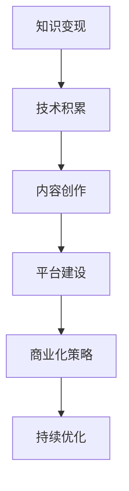

                 

# 知识变现：程序员的第二职业

> 关键词：知识变现, 程序员, 第二职业, 软件开发, 技术分享, 博客写作, 软件开发规范, 开源社区, 编程学习, 职业转型, 技术专家, 自我提升, 商业化

## 1. 背景介绍

### 1.1 问题由来

在当今数字化时代的背景下，软件开发领域的竞争日益激烈，技术的更新迭代速度不断加快，这不仅对程序员的技术能力提出了更高的要求，也对他们的职业发展提出了新的挑战。许多程序员在日复一日的编程工作中逐渐意识到，单一技能已不足以应对职业发展的复杂性，他们需要寻找新的增长点和职业路径，以保持自身的市场竞争力。

而知识变现，即通过分享自己的专业知识和技术经验，来获取经济收益，逐渐成为程序员的第二职业选择。通过博客写作、视频教程、开源项目、技术咨询等多种形式，程序员可以充分发挥自身的技术优势，不仅在职业生涯上实现自我提升，也能在经济上获得回报。

### 1.2 问题核心关键点

知识变现的核心在于如何将程序员的技术知识转化为商业价值，具体包括以下几个关键点：

- **技术积累**：持续学习新技术和最佳实践，不断提升自己的技术水平。
- **内容创作**：通过写作、教学、演讲等形式，将自己的知识经验传授给他人。
- **平台建设**：选择合适的知识变现平台，如博客、视频网站、开源社区等，建立自己的品牌和粉丝群体。
- **商业化策略**：制定有效的商业化策略，如通过打赏、付费内容、咨询、培训等方式获得收益。
- **持续优化**：根据市场反馈和自身发展需求，不断优化知识变现策略和技术内容。

本文将从这些核心关键点出发，深入探讨程序员如何通过知识变现开辟第二职业路径，并通过具体案例展示知识变现的多样性和实用性。

## 2. 核心概念与联系

### 2.1 核心概念概述

为了更好地理解知识变现的概念和实践，我们先列出几个核心概念及其相互联系：

- **知识变现**：通过分享和传播自己的知识，来获取经济回报的过程。
- **技术积累**：持续学习、研究和实践新技术，不断提升个人技术深度和广度。
- **内容创作**：将个人的技术经验、项目实践、学习心得等内容创作成有价值的文章、视频、代码等。
- **平台建设**：选择和利用知识变现的平台，如博客、视频网站、开源社区等，打造个人品牌。
- **商业化策略**：制定合理的商业模式，如打赏、付费内容、咨询、培训等，实现知识变现的商业化。
- **持续优化**：根据市场反馈和自身发展需求，不断优化知识变现内容和策略。

这些概念之间的联系可以通过以下Mermaid流程图来展示：



这个流程图展示了知识变现的基本流程：首先通过不断学习和实践积累技术知识，然后创作高质量的内容，选择合适的平台进行传播，制定有效的商业化策略，并在实际操作中不断优化。

## 3. 核心算法原理 & 具体操作步骤
### 3.1 算法原理概述

知识变现的核心在于将个人的技术知识和经验转化为有价值的内容，并通过合适的平台进行传播，最终实现经济收益。其核心算法原理可以分为以下几个步骤：

1. **技术积累**：通过持续学习和实践，积累和掌握新技术和最佳实践。
2. **内容创作**：将积累的技术知识和项目实践创作成博客文章、视频教程、开源项目等形式。
3. **平台选择**：根据内容形式和受众需求，选择合适的知识变现平台。
4. **商业化策略**：制定有效的商业模式，如打赏、付费内容、咨询、培训等。
5. **持续优化**：根据市场反馈和自身发展需求，不断优化知识变现内容和策略。

### 3.2 算法步骤详解

下面详细讲解知识变现的各个步骤：

**Step 1: 技术积累**

- **持续学习**：定期阅读技术书籍、博客、论文，参加技术会议、研讨会，订阅行业资讯，获取最新的技术动态。
- **实践项目**：通过实际项目实践，验证和提升技术能力，积累项目经验和挑战案例。
- **社区参与**：积极参与开源社区，贡献代码、参与讨论，了解行业动态和前沿技术。

**Step 2: 内容创作**

- **博客写作**：撰写深入浅出的技术文章，分享个人经验和项目实践。
- **视频教程**：录制高质量的教学视频，讲解技术细节、项目案例。
- **开源项目**：开发高质量的开源项目，并在GitHub等平台进行分享。

**Step 3: 平台选择**

- **博客平台**：如Medium、知乎、CSDN等，适合文字内容分享。
- **视频平台**：如YouTube、B站、网易云课堂等，适合视频内容分享。
- **开源平台**：如GitHub、CodePen等，适合代码和技术项目分享。

**Step 4: 商业化策略**

- **打赏模式**：通过平台提供的打赏功能，获得读者的经济支持。
- **付费内容**：发布付费课程、电子书、技术报告等，提供更深入的技术分享。
- **咨询培训**：提供技术咨询和培训服务，通过一对一辅导和团队培训等方式获取收入。

**Step 5: 持续优化**

- **市场反馈**：定期收集读者的反馈意见，了解需求和痛点，调整内容方向。
- **数据分析**：利用平台提供的分析工具，监测内容阅读量、互动率等指标，优化内容策略。
- **自我提升**：不断学习新技术、新工具，提升自己的技术能力和创作水平。

### 3.3 算法优缺点

知识变现的优势在于能够充分利用个人的技术积累和经验，通过多样化的形式进行传播，不仅提升了自身的技术水平，还能在经济上获得回报。其缺点在于需要投入大量时间和精力进行内容创作和平台运营，对于时间管理和内容产出有较高要求。

### 3.4 算法应用领域

知识变现的应用领域非常广泛，涉及软件开发、数据分析、人工智能、云计算等多个技术领域。具体应用场景包括：

- **软件开发**：通过博客和视频分享编程技巧、代码优化、架构设计等。
- **数据分析**：分享数据分析方法和工具的使用，如Python、R语言、数据可视化等。
- **人工智能**：讲解机器学习、深度学习、自然语言处理等领域的最新进展和技术实践。
- **云计算**：介绍云计算平台的使用和最佳实践，如AWS、Azure、Google Cloud等。
- **网络安全**：分享网络安全知识和防御策略，如渗透测试、漏洞分析、安全编码等。

## 4. 数学模型和公式 & 详细讲解 & 举例说明

### 4.1 数学模型构建

为了更好地理解知识变现的数学模型，我们将其简化为线性回归模型的形式。假设程序员的技术知识为 $X$，其价值为 $Y$，则知识变现的数学模型可以表示为：

$$
Y = \alpha + \beta X
$$

其中，$\alpha$ 为常数项，$\beta$ 为斜率，表示技术知识对知识变现价值的影响。

### 4.2 公式推导过程

在实际应用中，知识变现的过程可以通过以下公式进行推导：

$$
\begin{aligned}
Y &= \alpha + \beta X \\
&= \alpha + \beta \sum_{i=1}^{n} x_i \\
&= \alpha + \beta \sum_{i=1}^{n} (\text{技术积累}_i) 
\end{aligned}
$$

其中，$x_i$ 表示第 $i$ 项技术积累。

### 4.3 案例分析与讲解

以下以博客写作为例，进行知识变现的案例分析：

假设某程序员在技术博客上每月发布一篇文章，每篇文章的阅读量 $Y$ 与其技术积累 $X$（如阅读技术书籍、参与开源项目等）成正相关关系。通过统计数据，我们得到以下线性回归模型：

$$
Y = \alpha + \beta X
$$

其中，$\alpha = 100$，$\beta = 0.2$。

这意味着，如果该程序员每月增加1个技术积累（如阅读一篇技术书籍或贡献一段代码），其博客的月阅读量将增加0.2（假定单位为千）。

## 5. 项目实践：代码实例和详细解释说明
### 5.1 开发环境搭建

知识变现的技术实践需要一定的开发环境和工具支持。以下是推荐的使用环境和工具：

1. **开发环境**：
   - **操作系统**：Linux、macOS或Windows。
   - **开发工具**：Visual Studio Code、Sublime Text、Atom等。
   - **版本控制**：Git、GitHub、GitLab等。

2. **平台搭建**：
   - **博客平台**：Medium、CSDN、知乎等。
   - **视频平台**：YouTube、B站、网易云课堂等。
   - **开源平台**：GitHub、CodePen等。

### 5.2 源代码详细实现

以下以博客写作为例，展示代码实现和详细解释：

**博客平台**：Medium

1. **注册账号**：
   - 在Medium上注册账号，填写个人资料和联系方式。

2. **撰写文章**：
   - 使用文本编辑器撰写文章，引入Markdown语法，如使用粗体、斜体、列表、链接等。

3. **发布文章**：
   - 将文章保存为 `.md` 文件，上传到Medium，填写文章标题和标签。

4. **设置权限**：
   - 设置文章隐私设置，如公开、私密、仅好友可见等。

**示例代码**：

```python
import markdown
from markdown import Markdown

# 示例文本
text = """
# 标题
这是一个标题。

* 项目一
* 项目二
* 项目三

这是一段加粗文字。
这是一段斜体文字。
```

# 使用Markdown格式化

markdowner = Markdown()

# 将Markdown文本转换为HTML
html = markdowner.markdown(text)

# 打印HTML文本
print(html)
```

### 5.3 代码解读与分析

上述代码实现了使用Markdown语法编写博客文章的功能，具体解读如下：

1. **导入Markdown库**：
   - 导入 `markdown` 库，用于将Markdown文本转换为HTML。

2. **编写Markdown文本**：
   - 定义一个包含标题、列表、加粗、斜体等格式化的文本字符串。

3. **转换为HTML**：
   - 使用 `markdowner.markdown(text)` 将Markdown文本转换为HTML格式。

4. **打印HTML文本**：
   - 输出转换后的HTML文本，便于在浏览器或Markdown编辑器中查看和编辑。

### 5.4 运行结果展示

运行上述代码，输出结果如下：

```html
<h1>标题</h1>

<ul>
  <li>项目一</li>
  <li>项目二</li>
  <li>项目三</li>
</ul>

<p><strong>这是一段加粗文字</strong>。</p>

<p><em>这是一段斜体文字</em>。</p>
```

以上代码实现和输出结果展示了使用Markdown编写博客文章的基本流程。通过这种简单直观的方式，程序员可以高效地创作和发布技术内容，实现知识变现。

## 6. 实际应用场景

### 6.1 软件开发

在软件开发领域，程序员可以通过博客、视频教程、开源项目等多种形式进行知识变现。例如，撰写技术博客文章，分享项目经验和编程技巧；录制视频教程，讲解具体技术点和案例；开发开源项目，并定期更新维护，吸引开发者关注和贡献。

### 6.2 数据分析

数据分析领域中，程序员可以通过分享数据分析方法和工具的使用，如Python、R语言、数据可视化等，吸引数据科学爱好者和从业者。可以通过撰写博客、制作教程视频，或发布数据分析项目代码，进行知识变现。

### 6.3 人工智能

人工智能领域的知识变现可以包括讲解机器学习、深度学习、自然语言处理等领域的最新进展和技术实践，通过博客、视频教程、在线课程等方式进行传播。可以通过撰写技术文章、录制视频教程、开发AI项目等多种形式，实现知识变现。

### 6.4 云计算

云计算领域的知识变现可以包括分享云计算平台的使用和最佳实践，如AWS、Azure、Google Cloud等。可以通过博客、视频教程、在线课程等方式，传授云计算技术和解决方案。

## 7. 工具和资源推荐

### 7.1 学习资源推荐

为了帮助程序员提升技术水平，以下是一些优秀的学习资源：

1. **编程语言书籍**：如《深入理解计算机系统》、《Clean Code》等。
2. **在线课程平台**：如Coursera、edX、Udacity等。
3. **开源社区**：如GitHub、Stack Overflow等。
4. **技术博客**：如TechCrunch、Hacker News等。
5. **技术会议**：如Google I/O、AWS re:Invent等。

### 7.2 开发工具推荐

为了提升知识变现的效率和质量，以下是一些推荐的开发工具：

1. **文本编辑器**：如Visual Studio Code、Sublime Text、Atom等。
2. **版本控制**：如Git、GitHub、GitLab等。
3. **代码协作工具**：如JIRA、Trello、Confluence等。
4. **项目管理工具**：如Asana、Monday等。

### 7.3 相关论文推荐

以下是几篇奠基性的相关论文，推荐阅读：

1. **《知识共享与协作学习：技术创新与组织效率》**：探讨知识共享对技术创新的影响。
2. **《编程实践：开源社区的成功之路》**：分析开源社区中知识变现的机制和影响。
3. **《技术博客的流量驱动因素》**：研究技术博客的流量来源和读者行为。

## 8. 总结：未来发展趋势与挑战

### 8.1 总结

本文详细探讨了知识变现的概念和实践，通过技术积累、内容创作、平台选择、商业化策略、持续优化五个关键步骤，展示了程序员如何通过知识变现开辟第二职业路径。通过具体案例，展示了知识变现的多样性和实用性。

知识变现不仅为程序员提供了新的职业发展方向，也推动了技术的普及和传播，促进了技术社区的健康发展。未来，知识变现将与更多领域结合，为社会带来更深远的影响。

### 8.2 未来发展趋势

知识变现的未来发展趋势包括以下几个方面：

1. **内容多样化**：知识变现的形式将更加多样化，如音频、视频、直播、游戏化等，满足不同受众的需求。
2. **平台生态化**：知识变现平台将更加生态化，通过内容互动、社交网络、付费机制等提升用户黏性。
3. **技术融合化**：知识变现与人工智能、区块链、物联网等技术的融合将带来新的机遇和挑战。
4. **全球化趋势**：知识变现将打破地域限制，全球化趋势将为程序员提供更广阔的发展空间。

### 8.3 面临的挑战

知识变现在发展过程中仍面临诸多挑战，包括：

1. **内容质量**：高质量内容的创作需要大量时间和精力，如何保持持续性和创新性是一个挑战。
2. **市场竞争**：知识变现市场竞争激烈，如何在众多内容中脱颖而出是一个挑战。
3. **收益模式**：如何制定有效的收益模式，实现知识变现的商业化，是一个需要不断探索的问题。
4. **用户黏性**：如何提升用户黏性，保持用户的持续关注和参与，是一个长期挑战。
5. **版权保护**：如何保护知识产权，防止内容被盗用或侵权，是一个重要的法律问题。

### 8.4 研究展望

未来的知识变现研究可以从以下几个方面进行探索：

1. **知识变现的经济模型**：研究知识变现的经济模型，探索不同模式对创作者和受众的影响。
2. **内容推荐算法**：研究内容推荐算法，提高内容发现和匹配的效率，提升用户体验。
3. **版权保护技术**：研究版权保护技术，确保内容创作的知识产权不被侵犯。
4. **社会影响评估**：研究知识变现对社会的影响，评估其对技术创新和社会发展的贡献。

## 9. 附录：常见问题与解答

**Q1: 知识变现的优势和劣势是什么？**

A: 知识变现的优势在于能够充分利用个人的技术积累和经验，通过多样化的形式进行传播，不仅提升了自身的技术水平，还能在经济上获得回报。其劣势在于需要投入大量时间和精力进行内容创作和平台运营，对于时间管理和内容产出有较高要求。

**Q2: 如何进行内容创作和平台选择？**

A: 进行内容创作时，需持续学习和实践，积累和掌握新技术和最佳实践。选择合适的平台进行传播，如博客、视频网站、开源社区等。

**Q3: 如何制定有效的商业化策略？**

A: 制定商业化策略时，需根据内容形式和受众需求，选择合适的模式，如打赏、付费内容、咨询、培训等。

**Q4: 如何持续优化知识变现内容和策略？**

A: 持续优化时，需定期收集读者的反馈意见，了解需求和痛点，调整内容方向。利用平台提供的分析工具，监测内容阅读量、互动率等指标，优化内容策略。

**Q5: 如何保护知识产权？**

A: 保护知识产权时，需了解相关法律法规，采用合理的版权保护措施，如注册版权、使用数字水印等。

通过以上问题的解答，相信读者对知识变现有了更清晰的认识，并能够在实际应用中更好地利用这一职业路径，实现自身价值和社会价值。

