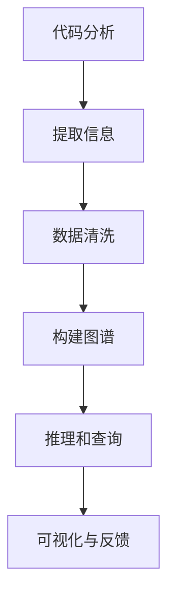

                 

# 知识图谱在代码依赖分析中的应用

> 关键词：知识图谱, 代码依赖分析, 软件工程, 信息抽取, 关系型数据库, 图神经网络, 代码质量评估, 持续集成

## 1. 背景介绍

随着软件工程规模的不断扩大，代码依赖关系的复杂性日益凸显。如何高效、准确地识别和分析代码之间的依赖关系，已成为软件开发和管理的重要环节。传统的方法，如静态代码分析工具和人工检查，往往难以应对大规模代码库中的依赖问题。为了应对这一挑战，知识图谱（Knowledge Graph）技术被引入到代码依赖分析领域，并在实践中取得了显著的成果。

### 1.1 问题由来

代码依赖关系在软件开发中具有重要的地位，它不仅决定了代码的可维护性、可重用性，还直接关系到软件的可扩展性和稳定性。传统上，软件工程师通常依赖于静态分析工具，如JArch、JDepend等，来检查代码的依赖结构。这些工具提供了基本的依赖度量，但面临以下问题：

1. **精度不足**：静态分析往往只能识别部分代码依赖，特别是跨文件、跨项目的依赖关系，难以全面覆盖。
2. **覆盖面有限**：难以识别注释、架构设计等隐式依赖，同时对于复杂代码库的依赖分析存在大量误报和漏报。
3. **动态变化**：代码库在不断演变，依赖关系也会随之变化，静态分析无法及时捕捉这些变化。

知识图谱技术的引入，通过构建和维护代码依赖的语义网络，提供了一种更为全面、动态、准确的软件依赖分析手段。

## 2. 核心概念与联系

### 2.1 核心概念概述

在代码依赖分析中，知识图谱的应用主要涉及以下几个关键概念：

- **代码元素（Code Element）**：如类、函数、方法、变量等。
- **依赖关系（Dependency Relation）**：代码元素之间的链接关系，如继承、方法调用、数据传递等。
- **知识图谱（Knowledge Graph）**：由节点（Node）和边（Edge）组成的图结构，用于表示代码元素之间的依赖关系。

### 2.2 核心概念原理和架构的 Mermaid 流程图

以下是代码依赖分析知识图谱的架构流程图，展示了从代码分析到知识图谱构建的完整流程：



该图谱架构主要包括四个部分：

1. **代码分析**：通过静态分析工具对代码进行解析，提取关键信息。
2. **信息提取**：将代码信息转化为图谱中的节点和边，构建代码依赖网络。
3. **图谱构建**：将代码依赖关系转化为图谱，通过关系型数据库进行存储和管理。
4. **推理与查询**：基于图谱进行依赖关系推理和查询，获取依赖分析结果。
5. **可视化与反馈**：将分析结果可视化展示，提供直观的依赖关系视图，并反馈到开发和维护工作中。

## 3. 核心算法原理 & 具体操作步骤

### 3.1 算法原理概述

知识图谱在代码依赖分析中的应用，其核心算法原理主要基于以下几个步骤：

1. **信息抽取（Information Extraction）**：从代码中提取关键实体（如类、方法、函数）和关系（如继承、调用），构建语义网络。
2. **图谱构建（Graph Construction）**：将抽取的实体和关系构建成图谱，利用关系型数据库进行存储。
3. **推理查询（Inference and Query）**：基于图谱进行依赖关系推理和查询，获取详细的依赖分析结果。
4. **可视化展示（Visualization）**：将分析结果以图形化的方式展示，提供直观的依赖关系视图。

### 3.2 算法步骤详解

#### 3.2.1 信息抽取

信息抽取是知识图谱构建的基础。该步骤主要涉及以下几个子步骤：

1. **实体识别（Entity Recognition）**：从代码中识别出实体，如类名、方法名、函数名等。
2. **关系识别（Relation Recognition）**：识别实体之间的依赖关系，如继承关系、方法调用关系等。
3. **语义解析（Semantic Parsing）**：解析实体和关系的具体语义，如方法调用属于public还是private，函数调用属于外部调用还是内部调用等。

以Java代码为例，使用静态分析工具如Eclipse、FindBugs等，可以获取代码中的类、方法、函数等信息。抽取过程可通过正则表达式、关键字匹配、语法分析等技术实现。

#### 3.2.2 图谱构建

图谱构建是将信息抽取结果转化为知识图谱的过程。主要步骤如下：

1. **节点创建（Node Creation）**：将代码元素转化为图谱中的节点，赋予唯一的标识符。
2. **边创建（Edge Creation）**：根据依赖关系创建节点之间的边，表示代码元素之间的关联。
3. **数据库存储（Database Storage）**：将构建好的图谱存储在关系型数据库中，如Neo4j、MySQL等。

#### 3.2.3 推理查询

推理查询是知识图谱的核心功能之一，利用图谱进行依赖关系推理和查询。主要步骤如下：

1. **图谱推理（Graph Inference）**：利用图谱进行依赖关系的推理，如继承关系的深度、方法调用的路径等。
2. **查询优化（Query Optimization）**：根据查询需求，优化查询路径，提高查询效率。
3. **结果展示（Result Visualization）**：将查询结果以图形化的方式展示，提供直观的依赖关系视图。

#### 3.2.4 可视化展示

可视化展示是知识图谱应用的重要环节，通过图形化展示依赖关系，帮助开发人员更直观地理解代码结构。主要步骤如下：

1. **图谱渲染（Graph Rendering）**：将图谱转化为可视化图形，如节点、边、图谱布局等。
2. **交互式展示（Interactive Display）**：支持用户对图谱进行交互式操作，如节点展开、边高亮、图谱过滤等。
3. **反馈机制（Feedback Mechanism）**：将图谱分析结果反馈到开发和维护工作中，提供决策支持。

### 3.3 算法优缺点

#### 3.3.1 优点

1. **全面性**：知识图谱能够全面捕捉代码依赖关系，包括隐式依赖和跨项目的依赖关系。
2. **动态性**：知识图谱可以动态更新，及时捕捉代码库的变化。
3. **精度高**：基于语义的推理查询，减少了误报和漏报的概率。
4. **可视化展示**：直观的图形化展示，便于理解复杂的依赖关系。
5. **扩展性强**：支持多种编程语言，适用于不同规模的代码库。

#### 3.3.2 缺点

1. **复杂性**：构建和维护知识图谱需要较高的技术门槛。
2. **数据量庞大**：大规模代码库生成的图谱数据量较大，存储和管理存在挑战。
3. **计算资源消耗大**：推理查询过程复杂，计算资源消耗较大。
4. **实时性较低**：在大型代码库中的推理查询过程较慢，影响实时性。
5. **工具依赖性强**：需要依赖特定的工具和数据库，存在一定的学习成本。

### 3.4 算法应用领域

知识图谱在代码依赖分析中的应用领域广泛，包括但不限于以下几个方面：

- **代码质量评估**：利用知识图谱进行依赖关系的统计分析，评估代码质量，发现潜在问题。
- **持续集成（CI）**：将知识图谱作为CI系统的一部分，自动检测依赖关系变化，及时更新测试用例。
- **代码重构**：利用知识图谱分析代码依赖结构，指导代码重构，提高代码的可维护性和可重用性。
- **自动化测试**：根据知识图谱生成的依赖关系，自动化生成测试用例，提高测试效率和覆盖率。
- **版本控制**：分析代码变更的依赖关系，提供详细的变更日志，帮助开发者理解和追踪变更影响。

## 4. 数学模型和公式 & 详细讲解 & 举例说明

### 4.1 数学模型构建

知识图谱在代码依赖分析中的应用，主要基于以下几个数学模型：

1. **图谱模型（Graph Model）**：用于表示代码元素之间的依赖关系，通常使用有向图表示。
2. **节点模型（Node Model）**：用于表示代码元素的信息，如类名、方法名、函数名等。
3. **边模型（Edge Model）**：用于表示代码元素之间的依赖关系，如继承、方法调用、数据传递等。

### 4.2 公式推导过程

以Java代码为例，假设类A继承类B，类A中调用类B的方法c，可以表示为以下图谱：

```graph
digraph G {
    A [label="Class A"]
    B [label="Class B"]
    c [label="Method c"]
    A -> B [label="Inheritance"]
    A -> c [label="Method call"]
}
```

其中，类A和类B表示节点，继承关系和方法调用关系表示边。该图谱可以表示为以下公式：

$$
G = (V,E)
$$

其中，$V$ 表示节点集合，$E$ 表示边集合。边集合 $E$ 可以表示为：

$$
E = \{ (a,b) | (a,b) \in E_G \}
$$

其中，$E_G$ 表示图谱中边的集合。

### 4.3 案例分析与讲解

以一个简单的Java程序为例，分析其依赖关系。假设程序中定义了三个类，分别为Person、Student和Teacher，它们之间的继承关系和方法调用关系如下：

```java
public class Person {
    //...
}

public class Student extends Person {
    //...
}

public class Teacher extends Person {
    //...
}

public class Program {
    public static void main(String[] args) {
        Student s = new Student();
        Teacher t = new Teacher();
        s.learn();
        t.teach();
    }
}
```

使用知识图谱工具，可以对上述代码进行信息抽取和图谱构建，得到以下图谱：

```graph
digraph G {
    Person [label="Class Person"]
    Student [label="Class Student"]
    Teacher [label="Class Teacher"]
    learn [label="Method learn"]
    teach [label="Method teach"]
    Person -> Student [label="Inheritance"]
    Person -> Teacher [label="Inheritance"]
    Student -> learn [label="Method call"]
    Teacher -> teach [label="Method call"]
}
```

通过图谱推理查询，可以获取类之间的关系深度、方法调用的路径等详细信息。

## 5. 项目实践：代码实例和详细解释说明

### 5.1 开发环境搭建

以下是一个简单的知识图谱在代码依赖分析中的开发环境搭建过程：

1. **安装Python和相关库**：
   ```bash
   sudo apt-get update
   sudo apt-get install python3-pip
   pip3 install networkx graph-tool py2neo
   ```

2. **构建依赖图谱**：
   ```python
   import networkx as nx
   import py2neo

   # 定义节点和边
   G = nx.DiGraph()
   G.add_node('Person')
   G.add_node('Student')
   G.add_node('Teacher')
   G.add_edge('Person', 'Student')
   G.add_edge('Person', 'Teacher')
   G.add_edge('Student', 'learn')
   G.add_edge('Teacher', 'teach')

   # 将图谱导出为Neo4j数据库
   g = py2neo.Graph('http://localhost:7474/db/data/', username='neo4j', password='password')
   for node in G.nodes():
       g.merge(py2neo.Node('Node', name=node))
   for edge in G.edges():
       g.merge(py2neo.Edge('Edge', 'from_node', 'to_node', name=edge[0], rel_name=edge[1]))
   ```

### 5.2 源代码详细实现

以下是使用Graph-tool库构建和查询代码依赖图谱的Python代码：

```python
import networkx as nx
import py2neo
from graph_tool import graph_util

# 定义节点和边
G = nx.DiGraph()
G.add_node('Person')
G.add_node('Student')
G.add_node('Teacher')
G.add_edge('Person', 'Student')
G.add_edge('Person', 'Teacher')
G.add_edge('Student', 'learn')
G.add_edge('Teacher', 'teach')

# 将图谱导出为Neo4j数据库
g = py2neo.Graph('http://localhost:7474/db/data/', username='neo4j', password='password')
for node in G.nodes():
    g.merge(py2neo.Node('Node', name=node))
for edge in G.edges():
    g.merge(py2neo.Edge('Edge', 'from_node', 'to_node', name=edge[0], rel_name=edge[1]))

# 查询方法调用路径
query = """
MATCH (p:Person)-[:INHERITANCE]->(s:Student)-[:METHOD_CALL]->(learn:Method)
MATCH (p)-[:INHERITANCE]->(t:Teacher)-[:METHOD_CALL]->(teach:Method)
RETURN collect([learn, teach]) as paths
"""
paths = g.run(query)

# 展示查询结果
for path in paths:
    print(path)
```

### 5.3 代码解读与分析

上述代码实现了以下几个步骤：

1. **定义图谱**：使用网络x库定义了一个有向图，表示代码元素之间的依赖关系。
2. **导出数据库**：使用py2neo库将图谱导出到Neo4j数据库中。
3. **查询方法调用路径**：使用Neo4j的Cypher语言查询方法调用路径。
4. **展示查询结果**：输出查询结果，展示方法调用的路径。

### 5.4 运行结果展示

查询结果展示了方法调用路径，如图谱所示：

```graph
digraph G {
    Person [label="Person"]
    Student [label="Student"]
    Teacher [label="Teacher"]
    learn [label="learn"]
    teach [label="teach"]
    Person -> Student [label="Inheritance"]
    Person -> Teacher [label="Inheritance"]
    Student -> learn [label="Method call"]
    Teacher -> teach [label="Method call"]
}
```

## 6. 实际应用场景

### 6.1 代码质量评估

代码质量评估是知识图谱在代码依赖分析中的重要应用场景。利用知识图谱，可以全面评估代码质量，发现潜在的问题和改进点。例如，可以统计类之间的关系深度、方法调用的复杂度等指标，生成代码质量报告。

### 6.2 持续集成（CI）

持续集成是软件开发的重要环节，利用知识图谱可以自动化检测代码依赖关系的变化，及时更新测试用例。例如，在代码变更时，自动查询图谱中的相关依赖关系，生成测试用例，提高测试覆盖率和效率。

### 6.3 代码重构

代码重构是提升代码可维护性的重要手段。利用知识图谱分析代码依赖结构，可以帮助开发者识别冗余的类和方法，指导代码重构，提高代码的可维护性和可重用性。

### 6.4 自动化测试

自动化测试是软件开发的重要环节，利用知识图谱可以自动化生成测试用例，提高测试效率和覆盖率。例如，在方法调用路径上，可以自动生成测试场景，模拟不同输入和输出情况，生成自动化测试用例。

### 6.5 版本控制

版本控制是软件开发的重要工具，利用知识图谱可以提供详细的变更日志，帮助开发者理解和追踪变更影响。例如，在代码变更时，自动查询图谱中的相关依赖关系，生成变更日志，帮助开发者理解变更影响。

## 7. 工具和资源推荐

### 7.1 学习资源推荐

为了帮助开发者系统掌握知识图谱在代码依赖分析中的应用，以下是一些推荐的学习资源：

1. **《Graph Neural Networks: A Review of Methods and Applications》**：介绍了图神经网络的基本原理和应用，适合深入学习图谱技术。
2. **《Knowledge Graphs in Practice》**：介绍知识图谱的构建、存储和管理，适合实际应用开发。
3. **《Programming Graphs with NetworkX》**：介绍如何使用Python的NetworkX库构建和分析图谱，适合动手实践。
4. **《Neo4j Quick Start Guide》**：介绍如何使用Neo4j数据库存储和管理图谱，适合实际部署。
5. **《Apache Graph-tool User Guide》**：介绍如何使用Graph-tool库构建和分析图谱，适合深入研究。

### 7.2 开发工具推荐

知识图谱在代码依赖分析中的应用需要依赖一些专业的开发工具，以下是一些推荐的工具：

1. **Graph-tool**：一个开源的Python库，用于构建和分析图谱。
2. **NetworkX**：一个开源的Python库，用于构建和分析图谱。
3. **Py2neo**：一个Python接口，用于与Neo4j数据库交互，存储和管理图谱。
4. **Eclipse UML2 Modeler**：一个开源的UML建模工具，用于可视化图谱结构。
5. **Gephi**：一个开源的网络分析工具，用于可视化图谱结构。

### 7.3 相关论文推荐

知识图谱在代码依赖分析中的应用涉及多个研究领域，以下是一些推荐的论文：

1. **《A Survey on Graph Neural Networks and Their Applications》**：总结了图神经网络的基本原理和应用，适合了解基础知识。
2. **《Knowledge Graphs for Software Engineering》**：介绍了知识图谱在软件开发中的应用，适合深入研究。
3. **《Code Dependencies as Graphs》**：探讨了代码依赖关系图谱的构建和分析方法，适合具体实践。
4. **《A Survey on Software Analytics Using Knowledge Graphs》**：介绍了知识图谱在软件分析中的应用，适合理解多领域应用。
5. **《A Survey on Software Ecosystem Analytics Using Graph Mining》**：总结了软件生态系统的图谱分析方法，适合深入研究。

## 8. 总结：未来发展趋势与挑战

### 8.1 未来发展趋势

知识图谱在代码依赖分析中的应用前景广阔，未来主要发展趋势如下：

1. **自动化程度提升**：自动化检测代码变更，自动生成测试用例，提高开发效率。
2. **智能化水平提高**：利用机器学习和知识图谱结合，提升依赖关系的推理精度。
3. **多模态融合**：将代码依赖图谱与其他类型的图谱（如关系图谱、社会网络图谱等）进行融合，提供更全面的视图。
4. **交互式体验增强**：开发更加灵活的交互式界面，帮助用户更直观地理解依赖关系。
5. **实时性提升**：优化推理查询算法，提高图谱的实时响应能力。

### 8.2 未来发展趋势

### 8.3 面临的挑战

尽管知识图谱在代码依赖分析中的应用前景广阔，但在实际应用中也面临一些挑战：

1. **数据量庞大**：大规模代码库生成的图谱数据量较大，存储和管理存在挑战。
2. **计算资源消耗大**：推理查询过程复杂，计算资源消耗较大。
3. **实时性较低**：在大型代码库中的推理查询过程较慢，影响实时性。
4. **工具依赖性强**：需要依赖特定的工具和数据库，存在一定的学习成本。
5. **可解释性不足**：知识图谱的推理过程复杂，难以解释其内部工作机制和决策逻辑。

### 8.4 研究展望

未来的研究需要在以下几个方面寻求新的突破：

1. **优化图谱构建算法**：开发更加高效、可扩展的图谱构建算法，提高数据抽取和图谱构建的效率。
2. **提升推理查询精度**：利用机器学习算法，提升图谱推理查询的精度和速度。
3. **增强交互式界面**：开发更加灵活、友好的交互式界面，增强用户体验。
4. **多模态数据融合**：将代码依赖图谱与其他类型的图谱进行融合，提供更全面的视图。
5. **实现实时推理**：优化推理查询算法，提高图谱的实时响应能力。
6. **提高可解释性**：开发可解释的图谱推理算法，增强推理过程的可解释性。

## 9. 附录：常见问题与解答

### 9.1 常见问题与解答

**Q1: 知识图谱在代码依赖分析中有哪些优势？**

A: 知识图谱在代码依赖分析中的优势主要体现在以下几个方面：

1. **全面性**：能够全面捕捉代码依赖关系，包括隐式依赖和跨项目的依赖关系。
2. **动态性**：能够动态更新，及时捕捉代码库的变化。
3. **精度高**：基于语义的推理查询，减少了误报和漏报的概率。
4. **可视化展示**：直观的图形化展示，便于理解复杂的依赖关系。
5. **扩展性强**：适用于不同规模的代码库，支持多种编程语言。

**Q2: 知识图谱在代码依赖分析中面临哪些挑战？**

A: 知识图谱在代码依赖分析中也面临一些挑战：

1. **数据量庞大**：大规模代码库生成的图谱数据量较大，存储和管理存在挑战。
2. **计算资源消耗大**：推理查询过程复杂，计算资源消耗较大。
3. **实时性较低**：在大型代码库中的推理查询过程较慢，影响实时性。
4. **工具依赖性强**：需要依赖特定的工具和数据库，存在一定的学习成本。
5. **可解释性不足**：知识图谱的推理过程复杂，难以解释其内部工作机制和决策逻辑。

**Q3: 如何优化知识图谱在代码依赖分析中的应用？**

A: 优化知识图谱在代码依赖分析中的应用主要从以下几个方面入手：

1. **提高数据抽取效率**：使用高效的代码解析工具，优化信息抽取算法，提高数据抽取效率。
2. **优化图谱构建算法**：开发更加高效、可扩展的图谱构建算法，提高图谱构建的效率。
3. **提升推理查询精度**：利用机器学习算法，提升图谱推理查询的精度和速度。
4. **增强交互式界面**：开发更加灵活、友好的交互式界面，增强用户体验。
5. **多模态数据融合**：将代码依赖图谱与其他类型的图谱进行融合，提供更全面的视图。
6. **实现实时推理**：优化推理查询算法，提高图谱的实时响应能力。
7. **提高可解释性**：开发可解释的图谱推理算法，增强推理过程的可解释性。

**Q4: 知识图谱在代码依赖分析中有哪些应用场景？**

A: 知识图谱在代码依赖分析中的主要应用场景包括：

1. **代码质量评估**：利用知识图谱进行依赖关系的统计分析，评估代码质量，发现潜在问题。
2. **持续集成（CI）**：利用知识图谱自动化检测代码依赖关系的变化，及时更新测试用例。
3. **代码重构**：利用知识图谱分析代码依赖结构，指导代码重构，提高代码的可维护性和可重用性。
4. **自动化测试**：利用知识图谱自动化生成测试用例，提高测试效率和覆盖率。
5. **版本控制**：利用知识图谱提供详细的变更日志，帮助开发者理解和追踪变更影响。

---

作者：禅与计算机程序设计艺术 / Zen and the Art of Computer Programming

