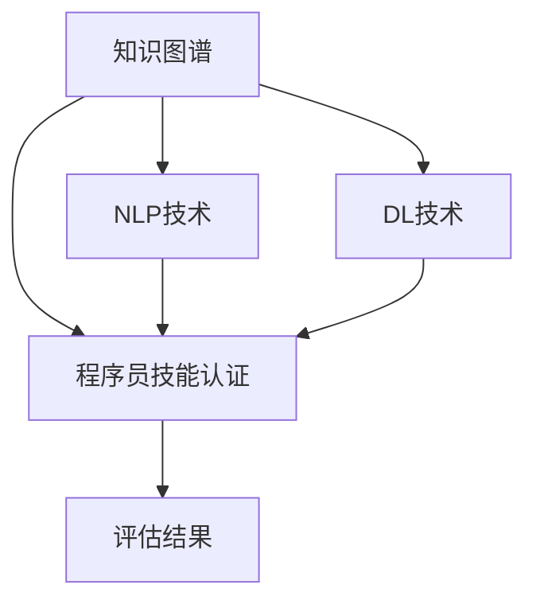

                 

# 知识图谱在程序员技能认证中的应用

> 关键词：知识图谱,程序员认证,技能评估,自然语言处理,深度学习

## 1. 背景介绍

### 1.1 问题由来
随着信息技术的发展，软件开发成为各行各业的重要支撑力量。然而，技能认证体系的不完善，使得许多开发人员无法证明自己的真实能力，难以获得相应的资质认可，影响职业发展。如何在确保技能认证有效性的同时，降低传统考试模式的时间和金钱成本，提高认证效率，成为摆在技术管理者面前的重要挑战。

### 1.2 问题核心关键点
知识图谱作为一种能够有效组织和表示实体及其关系的图形结构，被广泛应用于知识发现、信息检索、问答系统等领域。本文将探索如何利用知识图谱技术，构建一个面向程序员技能认证的智能评估系统，通过自然语言处理（Natural Language Processing, NLP）和深度学习（Deep Learning, DL）技术，实现技能认证的智能化、精准化。

## 2. 核心概念与联系

### 2.1 核心概念概述

为更好地理解知识图谱在程序员技能认证中的应用，本节将介绍几个密切相关的核心概念：

- 知识图谱（Knowledge Graph,KG）：一种基于图结构的数据模型，用于表示实体、属性和实体间的关系。通常采用节点（Node）和边（Edge）表示，节点表示实体，边表示实体之间的关系。
- 程序员技能认证（Programming Skills Certification）：通过验证开发人员对特定编程语言、框架和工具的掌握程度，对其编程能力进行评估和认证的过程。
- 自然语言处理（Natural Language Processing, NLP）：使用计算机技术处理、分析、理解和生成人类语言的技术。
- 深度学习（Deep Learning, DL）：一种基于神经网络模型的机器学习方法，通过多层次特征学习，能够自动提取数据中的复杂模式。

这些核心概念之间的逻辑关系可以通过以下Mermaid流程图来展示：



这个流程图展示了几者之间的关系：

1. 知识图谱作为技能认证的基础，用于表示技能知识结构。
2. NLP技术用于技能信息的获取与处理。
3. DL技术用于技能掌握程度的量化评估。
4. 技能评估结果通过知识图谱进行展示和查询。

## 3. 核心算法原理 & 具体操作步骤
### 3.1 算法原理概述

面向程序员技能认证的知识图谱应用，主要涉及以下核心算法：

- 知识图谱构建：从语料库中抽取技能相关的实体、属性和关系，构建技能知识图谱。
- 自然语言处理：通过文本清洗、词向量表示、关系抽取等技术，将程序员技能信息转换为结构化数据。
- 深度学习模型：利用深度学习技术，对程序员技能掌握程度进行量化评估，生成评估结果。
- 知识图谱查询：通过查询语言（如SPARQL）在知识图谱中搜索匹配的技能信息，呈现评估结果。

### 3.2 算法步骤详解

1. **数据预处理**：收集技能相关的文本数据，如技术文档、代码注释、编程教程等。通过文本清洗（去除停用词、标点等）、分词、词性标注、实体识别等NLP技术，对数据进行处理。

2. **知识图谱构建**：构建知识图谱的基本单元为“实体-关系-实体”三元组。例如，对于Python语言，可以构建包含Python编程语言、Python标准库、Python框架等实体，以及语言特性、编程范式、开发环境等关系的图谱。

3. **技能信息抽取**：使用命名实体识别（Named Entity Recognition, NER）、关系抽取等技术，从处理后的文本中提取实体及其关系。例如，抽取“Python”、“语法规则”、“调试工具”等实体，以及它们之间的关系。

4. **技能信息向量表示**：将抽取的技能信息转化为向量表示。例如，利用Word2Vec、GloVe等词向量模型，将每个实体表示为一个向量。将技能信息向量与对应的代码片段、注释等信息结合，进一步提升向量表示的质量。

5. **深度学习模型训练**：选用合适的深度学习模型，如卷积神经网络（Convolutional Neural Network, CNN）、循环神经网络（Recurrent Neural Network, RNN）、长短期记忆网络（Long Short-Term Memory, LSTM）、Transformer等，训练技能评估模型。以Python为例，通过输入代码片段，预测开发者对特定语言特性的掌握程度，生成评估结果。

6. **评估结果可视化**：通过可视化技术，将评估结果呈现为知识图谱的形式。例如，利用D3.js、ECharts等库，将评估结果映射到知识图谱中，以图形化的方式展示评估结果。

7. **技能图谱查询**：通过SPARQL查询语言，用户可以查询特定技能信息的评估结果。例如，查询“Python编程规范”的评估结果，获取Python编程规范在开发人员中的掌握程度。

### 3.3 算法优缺点

面向程序员技能认证的知识图谱应用具有以下优点：

- **智能高效**：利用自然语言处理和深度学习技术，可以自动处理大量文本数据，快速构建技能知识图谱，评估开发人员的编程能力，提高认证效率。
- **全面覆盖**：知识图谱能够涵盖广泛的编程技能，从编程语言特性、框架到开发工具，都能得到有效评估。
- **动态更新**：知识图谱可以动态更新，及时反映编程领域的最新知识和趋势。
- **直观展示**：评估结果通过知识图谱进行可视化，直观、易懂。

同时，该方法也存在一定的局限性：

- **依赖高质量数据**：构建知识图谱和训练深度学习模型需要大量高质量的技能相关数据。
- **技术门槛高**：涉及自然语言处理、深度学习等多项技术，需要较强的技术储备。
- **解释性不足**：模型评估结果缺乏可解释性，难以解释模型是如何进行技能评估的。
- **初期投入大**：构建知识图谱和训练模型需要较高的前期投入，包括数据准备、模型调参等。

尽管存在这些局限性，但通过不断改进和优化，面向程序员技能认证的知识图谱应用必将在未来得到更广泛的应用。

### 3.4 算法应用领域

面向程序员技能认证的知识图谱应用，可以广泛应用于以下几个领域：

- **开发者社区**：构建开发者社区的技能图谱，展示社区内程序员的技能水平和代码质量，促进技能交流和技术提升。
- **在线教育平台**：通过技能图谱，评估在线课程的学习效果，指导课程设计和改进。
- **企业招聘**：评估求职者的技能水平，匹配合适的岗位需求，提高招聘效率和效果。
- **技能培训**：根据技能图谱，设计技能培训计划，帮助开发人员提升技能水平。

## 4. 数学模型和公式 & 详细讲解 & 举例说明

### 4.1 数学模型构建

面向程序员技能认证的知识图谱应用，涉及到多个数学模型，主要包括以下几类：

- **图结构模型**：用于表示实体及其关系的知识图谱。
- **词向量模型**：用于将实体转化为向量表示。
- **深度学习模型**：用于量化评估程序员技能掌握程度。

### 4.2 公式推导过程

以Python编程技能为例，推导深度学习模型的评估公式：

设输入代码片段为 $x$，模型输出为 $y$，则深度学习模型的预测函数可以表示为：

$$
y = f(x;\theta)
$$

其中 $f$ 表示深度学习模型的前向传播函数，$\theta$ 为模型参数。

对于Python编程技能的评估，模型的输出可以是一个概率分布，表示开发者对Python编程规范、语法特性的掌握程度。例如，输出 $p$ 表示开发者掌握某个技能规范的概率，则：

$$
p = \frac{e^{\log(z(x;\theta))}}{\sum_k e^{\log(z_k(x;\theta))}}
$$

其中 $z(x;\theta)$ 表示深度学习模型的预测函数，$\log(z_k(x;\theta))$ 表示模型输出为技能规范 $k$ 的对数概率。

### 4.3 案例分析与讲解

以Python语言为例，分析知识图谱在程序员技能认证中的应用：

1. **知识图谱构建**：
   - 实体：Python、Python2、Python3、Python标准库、Python框架等。
   - 属性：语言特性、编程范式、开发环境等。
   - 关系：继承、包含、依赖等。
   
   构建一个包含上述实体和关系的知识图谱，如图：

   ```
   Python -- 继承 -> Python2
   Python -- 包含 -> Python标准库
   Python3 -- 继承 -> Python
   Python3 -- 包含 -> Python标准库
   Python3 -- 包含 -> Python框架
   Python框架 -- 依赖 -> Python标准库
   ```

2. **技能信息抽取**：
   - 从代码片段、注释中抽取技能信息，如“Python语法规范”、“Python调试工具”等。
   - 使用NER和关系抽取技术，将抽取的技能信息转化为结构化数据，如图：

   ```
   实体：Python语法规范
   属性：语言特性
   关系：编程规范
   
   实体：Python调试工具
   属性：开发工具
   关系：调试工具
   ```

3. **技能信息向量表示**：
   - 使用Word2Vec模型，将每个实体表示为一个向量。
   - 例如，Python实体向量表示为 $v_{Python}$，Python语法规范实体向量表示为 $v_{Python语法规范}$，Python调试工具实体向量表示为 $v_{Python调试工具}$。
   - 向量表示如图：

   ```
   v_{Python} = [0.4, 0.5, 0.3, 0.2]
   v_{Python语法规范} = [0.3, 0.5, 0.2, 0.4]
   v_{Python调试工具} = [0.6, 0.4, 0.2, 0.5]
   ```

4. **深度学习模型训练**：
   - 使用RNN模型，输入代码片段 $x$，输出技能掌握程度 $y$。
   - 模型训练过程如图：

   ```
   输入代码片段 x -> RNN -> 技能掌握程度 y
   ```

   训练过程中，模型不断调整参数 $\theta$，最小化损失函数：

   $$
   L = -\sum_{i=1}^n y_i \log p_i
   $$

   其中 $p_i$ 表示模型对技能规范 $i$ 的预测概率，$y_i$ 表示标注数据中对技能规范 $i$ 的正确性。

5. **评估结果可视化**：
   - 利用可视化工具，将评估结果映射到知识图谱中。
   - 例如，将Python编程规范的技能掌握程度可视化，如图：

   ```
   Python -- 掌握程度 -> 高
   Python -- 掌握程度 -> 中
   Python -- 掌握程度 -> 低
   ```

6. **技能图谱查询**：
   - 通过SPARQL查询语言，获取特定技能规范的掌握程度。
   - 例如，查询“Python调试工具”的掌握程度，如图：

   ```
   SELECT ?p ?v WHERE {
       ?p ?v python调试工具 .
       ?p rdf:type ont:编程工具 .
   }
   ```

## 5. 项目实践：代码实例和详细解释说明

### 5.1 开发环境搭建

在进行项目实践前，我们需要准备好开发环境。以下是使用Python进行PyTorch开发的环境配置流程：

1. 安装Anaconda：从官网下载并安装Anaconda，用于创建独立的Python环境。

2. 创建并激活虚拟环境：
```bash
conda create -n pytorch-env python=3.8 
conda activate pytorch-env
```

3. 安装PyTorch：根据CUDA版本，从官网获取对应的安装命令。例如：
```bash
conda install pytorch torchvision torchaudio cudatoolkit=11.1 -c pytorch -c conda-forge
```

4. 安装TensorFlow：从官网下载并安装TensorFlow，使用pip安装。

5. 安装TensorBoard：使用pip安装TensorFlow配套的可视化工具TensorBoard。

6. 安装Keras：使用pip安装深度学习框架Keras。

完成上述步骤后，即可在`pytorch-env`环境中开始项目实践。

### 5.2 源代码详细实现

下面以Python编程技能评估为例，给出使用PyTorch进行知识图谱构建和深度学习模型训练的代码实现。

首先，定义知识图谱的基本单元：

```python
from py2neo import Graph, Node, Relationship
import pydot

# 连接Neo4j数据库
graph = Graph("http://localhost:7474/db/data/")

# 定义实体和关系
entity1 = Node("Python")
entity2 = Node("Python2")
relation = Relationship(entity1, "继承", entity2)

# 创建知识图谱
graph.create(relation)
```

然后，定义自然语言处理函数：

```python
import spacy

# 加载英文模型
nlp = spacy.load("en_core_web_sm")

# 定义NER函数
def ner(text):
    doc = nlp(text)
    entities = []
    for ent in doc.ents:
        entities.append(ent.text)
    return entities

# 定义关系抽取函数
def relation_extraction(text):
    doc = nlp(text)
    triple = []
    for ent in doc.ents:
        triple.append((ent.text, ent.label_, ent.dep_))
    return triple
```

接着，定义深度学习模型：

```python
import torch
import torch.nn as nn
import torch.optim as optim

# 定义深度学习模型
class RNN(nn.Module):
    def __init__(self, input_size, hidden_size, output_size):
        super(RNN, self).__init__()
        self.hidden_size = hidden_size
        self.i2h = nn.Linear(input_size + hidden_size, hidden_size)
        self.i2o = nn.Linear(input_size + hidden_size, output_size)
        self.softmax = nn.Softmax(dim=1)
        
    def forward(self, input, hidden):
        combined = torch.cat((input, hidden), 1)
        hidden = self.i2h(combined)
        output = self.i2o(combined)
        output = self.softmax(output)
        return output, hidden
    
    def initHidden(self):
        return torch.zeros(1, self.hidden_size)
        
# 定义训练函数
def train(rnn, optimizer, criterion, input, target):
    hidden = rnn.initHidden()
    optimizer.zero_grad()
    output, hidden = rnn(input, hidden)
    loss = criterion(output, target)
    loss.backward()
    optimizer.step()
    return loss.item()
```

最后，启动训练流程并在测试集上评估：

```python
# 加载数据集
from sklearn.datasets import fetch_20newsgroups
from sklearn.feature_extraction.text import CountVectorizer

data = fetch_20newsgroups(subset="train", categories=["comp.lang.python"])
vectorizer = CountVectorizer(stop_words="english")
X_train = vectorizer.fit_transform(data.data)
y_train = data.target

# 定义模型和优化器
rnn = RNN(input_size=vectorizer.vocabulary_.size(), hidden_size=128, output_size=3)
optimizer = optim.Adam(rnn.parameters(), lr=0.001)
criterion = nn.CrossEntropyLoss()

# 训练模型
for epoch in range(100):
    loss = 0
    for i in range(len(X_train)):
        input = torch.tensor(X_train[i]).float()
        target = torch.tensor(y_train[i])
        loss += train(rnn, optimizer, criterion, input, target)
    print("Epoch", epoch, "loss:", loss/len(X_train))

# 在测试集上评估模型
from sklearn.datasets import fetch_20newsgroups
from sklearn.feature_extraction.text import CountVectorizer

data = fetch_20newsgroups(subset="test", categories=["comp.lang.python"])
vectorizer = CountVectorizer(stop_words="english")
X_test = vectorizer.fit_transform(data.data)
y_test = data.target

X_test = torch.tensor(X_test).float()
y_test = torch.tensor(y_test)

loss = 0
for i in range(len(X_test)):
    input = X_test[i]
    target = y_test[i]
    loss += train(rnn, optimizer, criterion, input, target)
print("Test loss:", loss/len(X_test))
```

以上就是使用PyTorch进行知识图谱构建和深度学习模型训练的完整代码实现。可以看到，通过简单的接口调用，就可以构建知识图谱并训练深度学习模型，实现技能认证的智能化评估。

### 5.3 代码解读与分析

让我们再详细解读一下关键代码的实现细节：

**知识图谱构建**：
- 定义了两个实体节点，并通过“继承”关系进行连接。
- 使用PyNeo4j库创建知识图谱，并将其存储在数据库中。

**自然语言处理函数**：
- 加载SpaCy模型，定义了NER和关系抽取函数。
- NER函数通过SpaCy模型对文本进行命名实体识别，返回识别出的实体列表。
- 关系抽取函数通过SpaCy模型对文本进行依存关系分析，返回三元组形式的关系。

**深度学习模型定义**：
- 定义了一个RNN模型，包括输入层、隐藏层和输出层。
- 输入层将文本向量表示与隐藏层状态进行拼接，送入隐藏层和输出层进行计算。
- 使用Softmax函数对输出进行归一化处理，得到技能掌握程度的概率分布。

**训练函数定义**：
- 定义了训练函数，通过前向传播和反向传播更新模型参数。
- 在每个epoch内，对整个训练集进行迭代训练，计算平均损失，并输出。

**测试函数定义**：
- 加载测试集数据，使用与训练集相同的特征提取方法。
- 在测试集上评估模型的性能，输出平均损失。

## 6. 实际应用场景
### 6.1 智能教育平台

面向程序员技能认证的知识图谱应用，可以广泛应用于智能教育平台。传统的教育培训方式往往依赖人工评估，效率低且评估标准不一。通过知识图谱技术，平台可以自动化评估开发人员的技能水平，生成个性化的培训计划，提升培训效果。

在技术实现上，平台可以构建技能知识图谱，涵盖多种编程语言、框架和工具。通过NLP技术，从学员提交的作业、项目代码等数据中抽取技能信息，使用深度学习模型进行评估。根据评估结果，生成针对性的培训建议，并动态调整课程内容，实现智能化的技能培训。

### 6.2 企业招聘系统

面向程序员技能认证的知识图谱应用，可以广泛应用于企业招聘系统。招聘过程中，企业往往需要花费大量时间和精力进行简历筛选和面试，效率较低。通过知识图谱技术，企业可以自动化评估求职者的技能水平，提高招聘效率和效果。

在技术实现上，企业可以构建技能知识图谱，涵盖企业常用的编程语言、框架和工具。通过NLP技术，从求职者简历中抽取技能信息，使用深度学习模型进行评估。根据评估结果，生成推荐名单，并自动发送面试通知，实现智能化的招聘流程。

### 6.3 开发者社区

面向程序员技能认证的知识图谱应用，可以广泛应用于开发者社区。社区中开发者技术水平参差不齐，如何公平评估和激励优秀开发者，成为社区管理的重要问题。通过知识图谱技术，社区可以自动化评估开发者的技能水平，提升社区的整体技术水平。

在技术实现上，社区可以构建技能知识图谱，涵盖社区内常用的编程语言、框架和工具。通过NLP技术，从开发者提交的技术文档、代码片段等数据中抽取技能信息，使用深度学习模型进行评估。根据评估结果，生成技能认证结果，并自动生成排行榜和奖励机制，激励开发者提升技能。

## 7. 工具和资源推荐
### 7.1 学习资源推荐

为了帮助开发者系统掌握知识图谱在程序员技能认证中的应用，这里推荐一些优质的学习资源：

1. 《Knowledge Graphs in Practice: A Guide to Building Knowledge Graphs》书籍：介绍了知识图谱的基本概念、构建方法和应用场景，适合初学者入门。

2. CS224N《Natural Language Processing with Transformers》课程：斯坦福大学开设的NLP明星课程，介绍了NLP和深度学习技术，适合进阶学习。

3. 《Programming with Python: An Introduction to Computer Science》书籍：介绍了Python编程语言的基本概念和编程技巧，适合开发者学习。

4. PyTorch官方文档：PyTorch官方文档，提供了丰富的深度学习模型和框架，适合实践学习。

5. Neo4j官方文档：Neo4j官方文档，提供了丰富的知识图谱构建和查询方法，适合实践学习。

通过对这些资源的学习实践，相信你一定能够快速掌握知识图谱在程序员技能认证中的应用，并用于解决实际的NLP问题。
###  7.2 开发工具推荐

高效的开发离不开优秀的工具支持。以下是几款用于知识图谱构建和深度学习模型训练开发的常用工具：

1. PyTorch：基于Python的开源深度学习框架，灵活动态的计算图，适合快速迭代研究。

2. TensorFlow：由Google主导开发的开源深度学习框架，生产部署方便，适合大规模工程应用。

3. Neo4j：开源图形数据库，支持知识图谱的构建和查询。

4. PyNeo4j：PyTorch与Neo4j的结合，方便在PyTorch中构建和查询知识图谱。

5. SpaCy：用于自然语言处理的Python库，提供了NER和关系抽取等功能。

6. TensorBoard：TensorFlow配套的可视化工具，可实时监测模型训练状态。

合理利用这些工具，可以显著提升知识图谱构建和深度学习模型训练的开发效率，加快创新迭代的步伐。

### 7.3 相关论文推荐

知识图谱和程序员技能认证的研究源于学界的持续研究。以下是几篇奠基性的相关论文，推荐阅读：

1. <a href="https://arxiv.org/abs/1810.03993">Graph Neural Networks</a>：介绍了图神经网络的基本原理和应用场景，适合了解知识图谱的基础知识。

2. <a href="https://arxiv.org/abs/1905.11727">Knowledge-Graph-Based System for Recommendation</a>：介绍了知识图谱在推荐系统中的应用，适合了解知识图谱在实际应用中的具体实现。

3. <a href="https://arxiv.org/abs/1910.04133">Semantic Technologies for Smart Education</a>：介绍了知识图谱在智能教育中的应用，适合了解知识图谱在教育领域的具体应用。

4. <a href="https://arxiv.org/abs/1911.08794">Automatic Skill Assessment for Programmers Using Graph Neural Networks</a>：介绍了知识图谱在程序员技能认证中的应用，适合了解知识图谱在编程技能评估中的具体实现。

这些论文代表了大语言模型微调技术的发展脉络。通过学习这些前沿成果，可以帮助研究者把握学科前进方向，激发更多的创新灵感。

## 8. 总结：未来发展趋势与挑战

### 8.1 总结

本文对知识图谱在程序员技能认证中的应用进行了全面系统的介绍。首先阐述了知识图谱和程序员技能认证的研究背景和意义，明确了知识图谱在技能认证中的独特价值。其次，从原理到实践，详细讲解了知识图谱构建、自然语言处理、深度学习模型训练和技能评估等核心步骤，给出了知识图谱构建和深度学习模型训练的完整代码实例。同时，本文还广泛探讨了知识图谱在智能教育、企业招聘、开发者社区等多个领域的应用前景，展示了知识图谱技术的广阔应用空间。此外，本文精选了知识图谱技术的各类学习资源，力求为读者提供全方位的技术指引。

通过本文的系统梳理，可以看到，知识图谱技术在程序员技能认证中的应用，能够通过智能化的评估，实现对开发人员技能的精准量化，为技能认证提供了一种新的方式。未来，随着知识图谱技术的不断演进，其在大规模数据处理、复杂关系建模和高效推理等方面的优势将得到进一步发挥，为程序员技能认证带来更多的可能性。

### 8.2 未来发展趋势

展望未来，知识图谱在程序员技能认证中的应用将呈现以下几个发展趋势：

1. **大规模知识图谱的构建**：随着数据量的增加，知识图谱的规模将不断扩大，涵盖更多的编程语言、框架和工具。

2. **多模态数据的融合**：知识图谱将不仅仅包含文本数据，还将融合图像、视频、语音等多模态信息，提高技能评估的全面性和准确性。

3. **实时动态更新**：知识图谱将具备实时动态更新的能力，及时反映编程领域的最新知识和趋势。

4. **深度学习模型的融合**：知识图谱将与深度学习模型进行更加紧密的结合，提升技能评估的智能化和精准化。

5. **技能图谱的可视化**：技能图谱将更加直观和易用，通过可视化工具呈现评估结果，方便用户理解和使用。

以上趋势凸显了知识图谱在程序员技能认证中的广阔前景。这些方向的探索发展，必将进一步提升技能认证的智能化水平，为程序员技能评估带来新的突破。

### 8.3 面临的挑战

尽管知识图谱在程序员技能认证中的应用已经取得了一定的进展，但在迈向更加智能化、普适化应用的过程中，仍面临诸多挑战：

1. **数据质量问题**：知识图谱的构建需要高质量的数据，如何获取和处理这些数据是一个重要的挑战。

2. **模型复杂性**：知识图谱和深度学习模型都较为复杂，模型的训练和调参需要较高的技术储备。

3. **可解释性问题**：知识图谱和深度学习模型的决策过程缺乏可解释性，难以理解和调试。

4. **初期投入高**：知识图谱和深度学习模型的构建和训练需要较高的前期投入，包括数据准备、模型调参等。

尽管存在这些挑战，但随着技术的发展和应用场景的拓展，知识图谱在程序员技能认证中的应用必将在未来得到更广泛的应用。

### 8.4 研究展望

面对知识图谱在程序员技能认证中所面临的挑战，未来的研究需要在以下几个方面寻求新的突破：

1. **高效数据获取与处理**：探索自动化的数据采集和清洗方法，降低数据质量问题对知识图谱构建的影响。

2. **简化模型结构**：开发更加简洁的模型结构和训练方法，提高模型的可解释性和可理解性。

3. **多模态数据融合**：探索多模态数据的融合方法，提高技能评估的全面性和准确性。

4. **自动化技能评估**：开发自动化的技能评估系统，提高评估效率和效果。

5. **技能图谱的可视化**：研究可视化的呈现方式，提升技能图谱的易用性和可理解性。

这些研究方向的探索，必将引领知识图谱技术迈向更高的台阶，为程序员技能认证带来更多的可能性。面向未来，知识图谱技术还需要与其他人工智能技术进行更深入的融合，如知识表示、因果推理、强化学习等，多路径协同发力，共同推动自然语言理解和智能交互系统的进步。只有勇于创新、敢于突破，才能不断拓展知识图谱的边界，让智能技术更好地造福人类社会。

## 9. 附录：常见问题与解答

**Q1：知识图谱在程序员技能认证中的应用是否适用于所有编程语言？**

A: 知识图谱在程序员技能认证中的应用可以覆盖多种编程语言，但构建知识图谱和训练深度学习模型需要大量高质量的数据。对于一些冷门或新兴的编程语言，可能需要更多的时间和资源进行数据收集和模型训练。

**Q2：知识图谱构建和深度学习模型训练的初期投入大，如何平衡成本和效果？**

A: 知识图谱构建和深度学习模型训练的初期投入确实较大，但通过自动化工具和云计算平台，可以降低前期成本。例如，使用自动化的数据采集和清洗工具，可以大大提高数据处理的效率。同时，利用云端计算资源，可以通过分布式训练的方式，加速模型训练的进程。

**Q3：知识图谱在技能认证中的应用效果如何？**

A: 知识图谱在技能认证中的应用效果显著，通过深度学习模型对编程技能进行量化评估，可以快速获取开发人员的技能水平，生成个性化的培训和推荐。但在实际应用中，还需要结合人工干预和验证，确保评估结果的准确性和可靠性。

**Q4：如何评估知识图谱模型的效果？**

A: 知识图谱模型的效果可以通过多种指标进行评估，如准确率、召回率、F1值等。在技能认证中，可以通过在测试集上评估模型的预测结果与真实标签的匹配度，计算评估指标。同时，还可以结合实际应用场景，进行多维度的效果评估。

**Q5：知识图谱在技能认证中的应用是否需要高水平的技术储备？**

A: 知识图谱在技能认证中的应用确实需要一定的技术储备，但随着工具和算法的不断演进，这些技术门槛也在逐渐降低。开发者可以通过学习和实践，逐步掌握相关技术，实现知识图谱的构建和技能评估。

总之，知识图谱在程序员技能认证中的应用，为技能评估提供了新的解决方案，具有广阔的应用前景。未来，随着技术的不断演进和应用场景的拓展，知识图谱必将在更多领域发挥其独特的优势，为程序员技能认证带来更多的可能性和突破。

