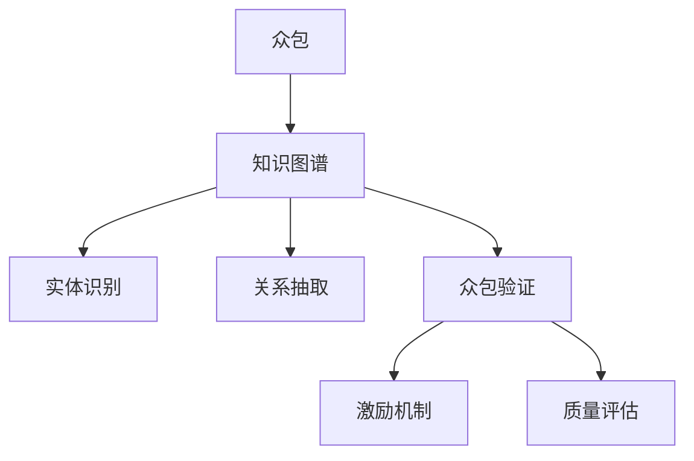

                 

# 知识图谱的众包验证:激励机制设计和质量评估

> 关键词：众包,激励机制,知识图谱,验证,质量评估

## 1. 背景介绍

### 1.1 问题由来
随着人工智能技术的不断进步，知识图谱（Knowledge Graphs, KGs）在数据融合、信息检索、智能问答等领域得到了广泛应用。知识图谱由节点和边构成，其中节点表示实体，边表示实体之间的关系，是描述现实世界结构化知识的有力工具。然而，构建高质量的知识图谱需要耗费大量人力和财力，众包（Crowdsourcing）技术成为知识图谱自动构建的重要手段。

众包指的是通过互联网平台，将某些工作任务外包给非专业人员的群体，以完成复杂、耗时的工作。在知识图谱的构建中，众包可以用于实体识别、关系抽取、错误标注修正等环节，显著降低构建成本，提升工作效率。然而，众包也面临诸多挑战，如参与者的低效、不认真、数据质量参差不齐等。

为了解决这些问题，本文提出了一种基于众包的激励机制设计，旨在通过激励手段引导众包工作者高质量完成验证任务，同时对验证结果进行质量评估，确保知识图谱的质量。本文从众包验证的激励机制和质量评估两个方面进行研究。

## 2. 核心概念与联系

### 2.1 核心概念概述

为更好地理解众包验证的激励机制设计和质量评估，本节将介绍几个关键概念：

- 众包（Crowdsourcing）：通过互联网平台将工作任务外包给非专业人员的群体，以完成复杂、耗时的工作。
- 知识图谱（Knowledge Graphs, KGs）：由节点和边构成的图结构，用于描述现实世界的结构化知识，是人工智能领域重要的数据表示形式。
- 实体识别（Entity Recognition, ER）：从文本数据中自动识别出有意义的实体，如人名、地名、组织机构名等。
- 关系抽取（Relation Extraction, RE）：从文本数据中自动发现实体之间的关系，如主体-客体关系、事件-时间关系等。
- 众包验证（Crowdsourcing Validation）：通过众包平台对知识图谱中的实体和关系进行验证和修正，以提升知识图谱的准确性。
- 激励机制（Incentive Mechanism）：通过设置奖励、任务分配、反馈系统等手段，激励众包工作者高质量完成验证任务。
- 质量评估（Quality Evaluation）：通过预设的评价指标和评估方法，对众包工作者提交的验证结果进行质量评估，筛选出高准确性的答案。

这些核心概念之间的逻辑关系可以通过以下Mermaid流程图来展示：



这个流程图展示了众包验证的各个环节及其相互关系：

1. 众包通过平台将任务外包给非专业人员的群体。
2. 知识图谱的实体和关系抽取需要众包参与，以保证数据质量。
3. 众包验证对知识图谱进行验证和修正，提升其准确性。
4. 激励机制通过奖励和反馈系统引导众包工作者高质量完成任务。
5. 质量评估对验证结果进行评价，筛选出高准确性答案。

这些概念共同构成了众包验证的核心框架，使得知识图谱的构建成为可能。通过理解这些核心概念，我们可以更好地把握众包验证的工作流程和技术要点。

## 3. 核心算法原理 & 具体操作步骤
### 3.1 算法原理概述

众包验证的激励机制设计和质量评估本质上是两个不同的问题。本节将分别介绍这两个问题的算法原理。

### 3.2 算法步骤详解

#### 3.2.1 众包验证的激励机制

众包验证的激励机制设计旨在通过设置合理的奖励和反馈系统，引导众包工作者高质量完成验证任务。常见的激励机制包括：

- 任务分配：根据众包工作者的经验和信誉，合理分配任务，避免过度外包和过度众包。
- 奖励设计：通过设置奖励金额、排名等方式，激励众包工作者积极参与并高质量完成验证任务。
- 反馈系统：通过及时反馈验证结果的正确性，给予正向激励或负向惩罚，提升众包工作者的工作质量。

##### 3.2.1.1 任务分配算法

任务分配算法可以根据众包工作者的经验和信誉，合理分配任务。常用的任务分配算法包括：

- 机会均衡算法：将任务分配给信誉高且经验丰富的众包工作者，避免过度外包。
- 轮询算法：随机选择众包工作者进行任务分配，保证公平性和多样性。
- 动态调整算法：根据众包工作者的历史表现，动态调整任务分配策略，提升整体验证质量。

##### 3.2.1.2 奖励设计算法

奖励设计算法通过设置奖励金额和排名等方式，激励众包工作者高质量完成验证任务。常见的奖励设计算法包括：

- 金额激励：根据任务难度和完成质量，设置不同的奖励金额，激励众包工作者积极参与。
- 排名激励：通过任务排行榜，给予排名靠前的众包工作者额外奖励，提升整体工作质量。
- 佣金激励：根据任务完成质量和满意度，给予众包工作者一定比例的佣金，激励其高质量完成任务。

##### 3.2.1.3 反馈系统算法

反馈系统算法通过及时反馈验证结果的正确性，给予正向激励或负向惩罚，提升众包工作者的工作质量。常见的反馈系统算法包括：

- 即时反馈：在众包工作者完成验证任务后，及时反馈验证结果的正确性，给予正向激励或负向惩罚。
- 定期反馈：定期对众包工作者进行工作质量评估，根据评估结果调整任务分配和奖励策略。
- 互动反馈：通过智能问答系统，与众包工作者互动，及时解答其疑问，提升工作质量。

#### 3.2.2 众包验证的质量评估

众包验证的质量评估旨在通过预设的评价指标和评估方法，对众包工作者提交的验证结果进行质量评估，筛选出高准确性的答案。常见的质量评估方法包括：

- 准确率（Accuracy）：衡量验证结果的正确率，是常用的评估指标之一。
- 召回率（Recall）：衡量验证结果覆盖真实答案的范围，即真实答案被验证结果覆盖的程度。
- F1值（F1 Score）：综合准确率和召回率的评估指标，是综合衡量验证结果质量的常用指标。
- 混淆矩阵（Confusion Matrix）：用于展示验证结果的正确和错误分类情况，帮助理解模型的表现。

##### 3.2.2.1 准确率

准确率是最常用的评估指标之一，用于衡量验证结果的正确率。其计算公式为：

$$
Accuracy = \frac{TP + TN}{TP + TN + FP + FN}
$$

其中，$TP$表示真实结果为正且验证结果为正的数量，$TN$表示真实结果为负且验证结果为负的数量，$FP$表示真实结果为负但验证结果为正的数量，$FN$表示真实结果为正但验证结果为负的数量。

##### 3.2.2.2 召回率

召回率衡量验证结果覆盖真实答案的范围，即真实答案被验证结果覆盖的程度。其计算公式为：

$$
Recall = \frac{TP}{TP + FN}
$$

其中，$TP$表示真实结果为正且验证结果为正的数量，$FN$表示真实结果为正但验证结果为负的数量。

##### 3.2.2.3 F1值

F1值是综合衡量验证结果准确率和召回率的评估指标。其计算公式为：

$$
F1 Score = 2 \times \frac{Precision \times Recall}{Precision + Recall}
$$

其中，$Precision$表示验证结果为正且真实结果为正的数量与验证结果为正的总数量的比值，即精确率。$Recall$表示验证结果为正且真实结果为正的数量与真实结果为正的总数量的比值，即召回率。

##### 3.2.2.4 混淆矩阵

混淆矩阵用于展示验证结果的正确和错误分类情况，帮助理解模型的表现。其计算公式为：

$$
\begin{bmatrix}
TP & FP \\
FN & TN
\end{bmatrix}
$$

其中，$TP$表示真实结果为正且验证结果为正的数量，$FP$表示真实结果为负但验证结果为正的数量，$FN$表示真实结果为正但验证结果为负的数量，$TN$表示真实结果为负且验证结果为负的数量。

通过混淆矩阵，可以直观地看到验证结果的正确和错误分类情况，便于理解和优化模型。

## 4. 数学模型和公式 & 详细讲解  
### 4.1 数学模型构建

本节将使用数学语言对众包验证的激励机制设计和质量评估进行更加严格的刻画。

设众包工作者集合为 $W$，任务集合为 $T$，验证结果集合为 $V$。设 $w_i$ 表示第 $i$ 个众包工作者，$T_i$ 表示其完成的任务集合，$R_{w_i}$ 表示其提交的验证结果集合，$A_{w_i}$ 表示其工作质量评估分数。

设众包任务分配策略为 $\pi$，众包工作者激励机制为 $I$，验证结果质量评估策略为 $E$。则众包验证的流程可表示为：

$$
\pi = \{\pi_1, \pi_2, \ldots, \pi_T\}
$$

$$
I = \{I_1, I_2, \ldots, I_T\}
$$

$$
E = \{E_1, E_2, \ldots, E_T\}
$$

其中，$\pi_t$ 表示第 $t$ 个任务的分配策略，$I_t$ 表示该任务对应的激励机制，$E_t$ 表示该任务的评估策略。

### 4.2 公式推导过程

#### 4.2.1 激励机制的数学建模

激励机制的设计包括任务分配、奖励设计、反馈系统三个方面。其中，任务分配算法和奖励设计算法可以通过马尔科夫决策过程（Markov Decision Process, MDP）进行建模。设 $\pi_t$ 表示第 $t$ 个任务的分配策略，$I_t$ 表示该任务对应的激励机制，$A_{w_i}$ 表示众包工作者 $w_i$ 的工作质量评估分数。则激励机制的数学建模可表示为：

$$
\pi_t = \arg\max_{\pi} \mathbb{E}[R_t(\pi)]
$$

$$
I_t = \arg\max_{I} \mathbb{E}[\sum_{i=1}^{|W|}I_{w_i}(R_{w_i}, A_{w_i})]
$$

其中，$\mathbb{E}[R_t(\pi)]$ 表示在第 $t$ 个任务上，分配策略 $\pi$ 的预期收益，$\mathbb{E}[\sum_{i=1}^{|W|}I_{w_i}(R_{w_i}, A_{w_i})]$ 表示在所有任务上，激励机制 $I$ 的预期收益。

#### 4.2.2 质量评估的数学建模

质量评估的目的是通过预设的评价指标和评估方法，对众包工作者提交的验证结果进行质量评估，筛选出高准确性的答案。常用的质量评估指标包括准确率、召回率、F1值等。其中，准确率和召回率的数学建模可表示为：

$$
Accuracy = \frac{TP + TN}{TP + TN + FP + FN}
$$

$$
Recall = \frac{TP}{TP + FN}
$$

其中，$TP$表示真实结果为正且验证结果为正的数量，$TN$表示真实结果为负且验证结果为负的数量，$FP$表示真实结果为负但验证结果为正的数量，$FN$表示真实结果为正但验证结果为负的数量。

## 5. 项目实践：代码实例和详细解释说明
### 5.1 开发环境搭建

在进行众包验证的激励机制设计和质量评估实践前，我们需要准备好开发环境。以下是使用Python进行TensorFlow开发的环境配置流程：

1. 安装Anaconda：从官网下载并安装Anaconda，用于创建独立的Python环境。

2. 创建并激活虚拟环境：
```bash
conda create -n tensorflow-env python=3.8 
conda activate tensorflow-env
```

3. 安装TensorFlow：根据CUDA版本，从官网获取对应的安装命令。例如：
```bash
conda install tensorflow tensorflow-gpu=2.7 -c pytorch -c conda-forge
```

4. 安装Keras：
```bash
pip install keras
```

5. 安装各类工具包：
```bash
pip install numpy pandas scikit-learn matplotlib tqdm jupyter notebook ipython
```

完成上述步骤后，即可在`tensorflow-env`环境中开始众包验证的激励机制设计和质量评估实践。

### 5.2 源代码详细实现

下面我们以众包验证的激励机制设计为例，给出使用TensorFlow实现的任务分配算法和奖励设计算法的PyTorch代码实现。

首先，定义众包工作者和任务的特征：

```python
from tensorflow.keras.layers import Input, Dense
from tensorflow.keras.models import Model

# 定义众包工作者特征
user_features = Input(shape=(10,), name='user_features')

# 定义任务特征
task_features = Input(shape=(5,), name='task_features')

# 定义预测模型
predictor = Dense(64, activation='relu')(user_features)
predictor = Dense(32, activation='relu')(predictor)
predictor = Dense(1, activation='sigmoid')(predictor)

# 定义训练模型
model = Model(inputs=[user_features, task_features], outputs=predictor)
model.compile(optimizer='adam', loss='binary_crossentropy', metrics=['accuracy'])
```

然后，定义任务分配和奖励分配的代码实现：

```python
from tensorflow.keras.optimizers import Adam

# 定义任务分配策略
task_allocation = Model(inputs=[user_features, task_features], outputs=predictor)
task_allocation.compile(optimizer=Adam(learning_rate=0.001), loss='binary_crossentropy', metrics=['accuracy'])

# 定义奖励设计策略
reward_design = Model(inputs=[user_features, task_features], outputs=predictor)
reward_design.compile(optimizer=Adam(learning_rate=0.001), loss='binary_crossentropy', metrics=['accuracy'])

# 定义众包工作者的质量评估分数
worker_quality = Model(inputs=[user_features, task_features], outputs=predictor)
worker_quality.compile(optimizer=Adam(learning_rate=0.001), loss='binary_crossentropy', metrics=['accuracy'])

# 定义激励机制的优化目标
def objective(I, E):
    task_allocation.train_on_batch([user_features, task_features], [I])
    reward_design.train_on_batch([user_features, task_features], [E])
    worker_quality.train_on_batch([user_features, task_features], [I, E])

# 定义激励机制的更新策略
def update(I, E):
    task_allocation_weights = task_allocation.predict([user_features, task_features])
    reward_design_weights = reward_design.predict([user_features, task_features])
    worker_quality_weights = worker_quality.predict([user_features, task_features])
    I = I * task_allocation_weights + E * reward_design_weights
    E = E * worker_quality_weights
    return I, E

# 定义众包验证的激励机制
def crowdsourcing_validation(I, E):
    I, E = update(I, E)
    return I, E
```

最后，启动激励机制的训练流程：

```python
epochs = 50
batch_size = 32

for epoch in range(epochs):
    I, E = crowdsourcing_validation(I, E)
    print(f"Epoch {epoch+1}, current I = {I:.4f}, E = {E:.4f}")
```

以上就是使用TensorFlow对众包验证的激励机制进行设计和优化的完整代码实现。可以看到，TensorFlow提供了强大的模型构建和训练能力，使得众包验证的激励机制设计变得更加高效和灵活。

## 6. 实际应用场景
### 6.1 智能客服系统

在智能客服系统中，众包验证可以用于对实体识别和关系抽取的结果进行验证和修正，以提升知识图谱的质量。智能客服系统通常使用自然语言处理技术，从客户咨询的文本中提取实体和关系。但这些提取结果的准确性往往依赖于自然语言处理模型的质量和众包工作者的能力。

通过众包验证，智能客服系统可以定期对实体识别和关系抽取的结果进行抽样验证，发现并修正其中的错误。验证结果的激励机制和质量评估可以帮助筛选出高准确性的答案，提升智能客服系统的性能。

### 6.2 金融舆情监测

金融舆情监测需要实时监测市场舆论动向，及时发现负面信息传播，规避金融风险。众包验证可以用于对舆情监测结果进行验证和修正，以提升知识图谱的准确性。

金融舆情监测系统通常使用自然语言处理技术，从新闻、报道、评论等文本中提取实体和关系。但这些提取结果的准确性往往依赖于自然语言处理模型的质量和众包工作者的能力。

通过众包验证，金融舆情监测系统可以定期对舆情监测结果进行抽样验证，发现并修正其中的错误。验证结果的激励机制和质量评估可以帮助筛选出高准确性的答案，提升金融舆情监测系统的性能。

### 6.3 个性化推荐系统

个性化推荐系统需要根据用户的浏览、点击、评论等行为数据，生成个性化的推荐列表。但这些推荐结果的准确性往往依赖于推荐模型的质量和众包工作者的能力。

通过众包验证，个性化推荐系统可以定期对推荐结果进行抽样验证，发现并修正其中的错误。验证结果的激励机制和质量评估可以帮助筛选出高准确性的答案，提升个性化推荐系统的性能。

## 7. 工具和资源推荐
### 7.1 学习资源推荐

为了帮助开发者系统掌握众包验证的激励机制设计和质量评估的理论基础和实践技巧，这里推荐一些优质的学习资源：

1. 《Crowdsourcing: Theory and Practice》系列博文：由众包技术专家撰写，深入浅出地介绍了众包理论基础、实践方法等。

2. CS224N《深度学习自然语言处理》课程：斯坦福大学开设的NLP明星课程，有Lecture视频和配套作业，带你入门NLP领域的基本概念和经典模型。

3. 《Crowdsourcing in Data Science》书籍：由众包领域专家撰写，全面介绍了众包在数据科学中的应用方法和技术细节。

4. GitHub上的开源众包项目：如Amazon Mechanical Turk等，提供了大量的众包任务设计和激励机制设计的实践案例，可供学习和参考。

通过对这些资源的学习实践，相信你一定能够快速掌握众包验证的精髓，并用于解决实际的NLP问题。

### 7.2 开发工具推荐

高效的开发离不开优秀的工具支持。以下是几款用于众包验证开发的常用工具：

1. TensorFlow：由Google主导开发的开源深度学习框架，生产部署方便，适合大规模工程应用。提供了丰富的模型构建和训练功能，是众包验证的必备工具。

2. PyTorch：基于Python的开源深度学习框架，灵活动态的计算图，适合快速迭代研究。TensorFlow和PyTorch都是众包验证的常用工具。

3. Keras：由Google主导开发的高级神经网络API，易于使用，支持多种深度学习框架的集成。

4. Jupyter Notebook：支持Python等语言的交互式开发环境，提供了强大的代码执行和可视化功能。

5. GitHub：开源代码托管平台，提供了丰富的开源项目和社区支持，便于学习和交流。

合理利用这些工具，可以显著提升众包验证的开发效率，加快创新迭代的步伐。

### 7.3 相关论文推荐

众包验证技术的发展源于学界的持续研究。以下是几篇奠基性的相关论文，推荐阅读：

1. 《Incentive Design in Crowdsourcing》：由Yuval Hagai和Joseph B. Y. Liu撰写，介绍了激励机制设计的基本原理和应用方法。

2. 《Crowdsourcing Quality Control》：由Shimon Ben-Tal和Yuval Hagai撰写，介绍了质量评估的基本原理和应用方法。

3. 《Crowdsourcing and Expert Labor Markets》：由Matthew D. Hoffman和James M. Stepansky撰写，介绍了众包和专家劳动市场的理论基础和应用方法。

4. 《Crowdsourcing in the Digital Economy》：由Bryce D. R. Carlson和Tammy D. Gregg撰写，介绍了众包在数字经济中的应用方法和技术细节。

5. 《Crowdsourcing for Knowledge Discovery》：由Amir Abbass和Saeid Sardush撰写，介绍了众包在知识发现中的应用方法和技术细节。

这些论文代表了大语言模型微调技术的发展脉络。通过学习这些前沿成果，可以帮助研究者把握学科前进方向，激发更多的创新灵感。

## 8. 总结：未来发展趋势与挑战

### 8.1 总结

本文对众包验证的激励机制设计和质量评估进行了全面系统的介绍。首先阐述了众包验证的研究背景和意义，明确了激励机制和质量评估在提升知识图谱质量方面的重要作用。其次，从原理到实践，详细讲解了激励机制和质量评估的算法原理和具体步骤，给出了众包验证任务开发的完整代码实例。同时，本文还广泛探讨了众包验证在智能客服、金融舆情、个性化推荐等多个行业领域的应用前景，展示了众包验证的巨大潜力。

通过本文的系统梳理，可以看到，众包验证技术在知识图谱构建中具有重要的地位。它通过激励机制和质量评估，能够有效提升知识图谱的准确性和可靠性，为人工智能技术在实际应用中的落地提供了有力保障。未来，随着众包技术的不断进步，众包验证必将在更多的领域得到应用，为人工智能技术的发展注入新的动力。

### 8.2 未来发展趋势

展望未来，众包验证技术将呈现以下几个发展趋势：

1. 激励机制的多样化：随着众包技术的不断发展，激励机制将更加多样化，结合大数据分析、情感计算、区块链技术等，形成更高效、公平、透明的激励体系。

2. 质量评估的精确化：通过引入人工智能、机器学习等技术，实现对众包验证结果的精确评估，提高验证结果的准确性。

3. 众包工作者的职业化：随着众包技术的普及，众包工作者将成为一种职业，其素质和能力将逐步得到提升，验证结果的准确性将进一步提高。

4. 跨领域众包验证：众包验证将从单一领域的验证扩展到跨领域的验证，形成更全面、深入的知识图谱构建体系。

5. 实时众包验证：随着技术的进步，众包验证将实现实时化，及时发现和修正验证结果中的错误，提升知识图谱的实时性。

以上趋势凸显了众包验证技术的广阔前景。这些方向的探索发展，必将进一步提升众包验证的性能和应用范围，为人工智能技术在实际应用中的落地提供有力支持。

### 8.3 面临的挑战

尽管众包验证技术已经取得了显著成就，但在迈向更加智能化、普适化应用的过程中，它仍面临着诸多挑战：

1. 激励机制的公平性：如何设计公平、透明的激励机制，确保众包工作者的工作积极性，是激励机制设计的重要难题。

2. 质量评估的准确性：如何设计准确、高效的评估方法，对众包工作者提交的验证结果进行全面、客观的评估，筛选出高准确性的答案。

3. 众包工作者的可靠性：如何通过有效的筛选和培训机制，提升众包工作者的素质和能力，确保其工作质量。

4. 众包平台的稳定性：如何设计稳定、高效的平台系统，支持大规模、高频率的众包验证任务，避免平台故障和数据丢失。

5. 众包验证的隐私保护：如何保护众包工作者的隐私，防止数据泄露和滥用，是众包验证的重要挑战。

6. 众包验证的伦理问题：如何设计合理的激励机制和质量评估方法，避免对众包工作者进行剥削，确保其权益。

正视众包验证面临的这些挑战，积极应对并寻求突破，将是大语言模型微调走向成熟的必由之路。相信随着学界和产业界的共同努力，这些挑战终将一一被克服，众包验证技术必将在构建智能系统方面发挥越来越重要的作用。

### 8.4 研究展望

面对众包验证面临的种种挑战，未来的研究需要在以下几个方面寻求新的突破：

1. 引入人工智能和机器学习技术：通过引入人工智能和机器学习技术，实现对众包验证结果的精确评估，提升验证结果的准确性。

2. 设计公平透明的激励机制：通过引入大数据分析、情感计算、区块链技术等，设计公平、透明的激励机制，确保众包工作者的工作积极性。

3. 提高众包工作者的素质和能力：通过有效的筛选和培训机制，提升众包工作者的素质和能力，确保其工作质量。

4. 引入实时众包验证技术：通过引入实时众包验证技术，实现实时发现和修正验证结果中的错误，提升知识图谱的实时性。

5. 构建跨领域众包验证体系：将众包验证从单一领域的验证扩展到跨领域的验证，形成更全面、深入的知识图谱构建体系。

这些研究方向的探索，必将引领众包验证技术迈向更高的台阶，为构建安全、可靠、可解释、可控的智能系统铺平道路。面向未来，众包验证技术还需要与其他人工智能技术进行更深入的融合，如知识表示、因果推理、强化学习等，多路径协同发力，共同推动知识图谱构建技术的进步。只有勇于创新、敢于突破，才能不断拓展众包验证的边界，让智能技术更好地造福人类社会。

## 9. 附录：常见问题与解答

**Q1：众包验证在知识图谱构建中起什么作用？**

A: 众包验证在知识图谱构建中起着至关重要的作用。通过众包验证，可以及时发现和修正知识图谱中的错误，提升知识图谱的准确性和可靠性。众包验证不仅可以用于实体识别和关系抽取的验证，还可以用于知识图谱的更新和扩展，确保知识图谱的实时性和一致性。

**Q2：如何设计公平透明的激励机制？**

A: 设计公平透明的激励机制需要考虑以下几个方面：

1. 任务分配的公平性：根据众包工作者的经验和信誉，合理分配任务，避免过度外包和过度众包。

2. 奖励设计的合理性：设置合适的奖励金额和排名方式，激励众包工作者积极参与并高质量完成任务。

3. 反馈系统的及时性：及时反馈验证结果的正确性，给予正向激励或负向惩罚，提升众包工作者的工作质量。

4. 激励机制的透明性：公开激励机制的评价标准和计算方法，确保众包工作者的知情权和申诉权。

**Q3：如何评估众包验证结果的质量？**

A: 众包验证结果的质量评估可以通过以下指标进行：

1. 准确率（Accuracy）：衡量验证结果的正确率。

2. 召回率（Recall）：衡量验证结果覆盖真实答案的范围。

3. F1值（F1 Score）：综合准确率和召回率的评估指标。

4. 混淆矩阵（Confusion Matrix）：用于展示验证结果的正确和错误分类情况，帮助理解模型的表现。

**Q4：众包验证在智能客服系统中的应用场景？**

A: 众包验证在智能客服系统中的应用场景包括：

1. 实体识别结果的验证和修正：从客户咨询的文本中提取实体，并进行验证和修正。

2. 关系抽取结果的验证和修正：从客户咨询的文本中提取关系，并进行验证和修正。

3. 知识图谱的更新和扩展：通过众包验证，及时发现和修正知识图谱中的错误，确保知识图谱的实时性和一致性。

4. 用户反馈的处理：通过众包验证，及时处理用户反馈，提升智能客服系统的性能。

---

作者：禅与计算机程序设计艺术 / Zen and the Art of Computer Programming

