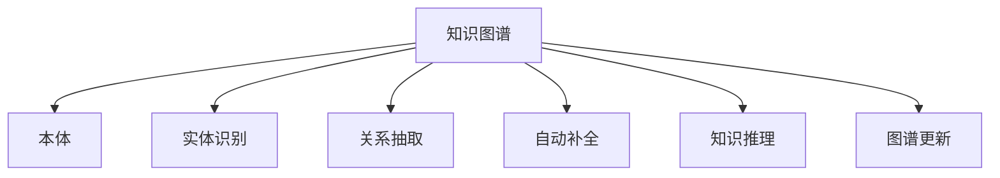

                 

# 知识图谱：知识管理的大脑蓝图

## 1. 背景介绍

### 1.1 问题由来
随着大数据、人工智能等技术的迅猛发展，人类社会的知识形态和应用场景正在发生深刻变革。传统的文档、数据库等单一的知识表达方式已无法满足多样化的需求。一种新的知识表示与组织方式——知识图谱，正逐步成为知识管理与分析的重要工具。

知识图谱（Knowledge Graph）是一种结构化的语义知识库，通过实体（Entity）、关系（Relation）和属性（Attribute）三元组（RDF）的形式，将海量异构知识单元进行有机连接，形成一张庞大的知识网络。它能够以直观、准确的方式反映实体之间的复杂关系，支持高效的推理、搜索和分析操作，为知识工程、智能推荐、自然语言处理等领域提供了强大的支持。

然而，知识图谱的构建与维护是一个复杂而昂贵的过程，需要耗费大量人力物力，且知识图谱的质量和可用性直接影响到下游应用的性能。因此，如何高效、准确地构建和维护知识图谱，成为当前知识图谱研究与应用的一个关键问题。

### 1.2 问题核心关键点
本文聚焦于知识图谱的构建、维护和应用，探索如何利用最新的计算机技术，高效构建大型的、高质量的知识图谱，并在实际应用中发挥其最大效用。

本文的核心要点包括：
- 知识图谱的核心概念与架构原理。
- 知识图谱的自动构建技术。
- 知识图谱的应用案例与未来发展方向。

## 2. 核心概念与联系

### 2.1 核心概念概述

为更好地理解知识图谱的构建与应用，本节将介绍几个关键概念及其间的联系：

- **知识图谱（Knowledge Graph）**：用于存储实体、关系、属性三元组的知识库，通过结构化的方式组织知识，支持语义查询与推理。

- **本体（Ontology）**：定义和组织知识图谱的概念框架，包含类（Class）、属性（Property）和个体（Instance），用于描述知识的基本结构和语义。

- **实体识别（Entity Recognition）**：从文本、图像等数据源中自动识别出具有实际意义的实体，如人名、地名、组织机构等。

- **关系抽取（Relation Extraction）**：从文本中识别出实体之间的关系，如“是”、“位于”、“属于”等，构建知识图谱中实体之间的关系网络。

- **自动补全（Autocomplete）**：根据用户输入的关键词，自动提供候选实体或关系，提升知识图谱的查询体验。

- **知识推理（Knowledge Reasoning）**：通过逻辑推理，从知识图谱中挖掘出隐含的知识关系，支持基于逻辑的知识推理任务，如实体链接、因果关系推断等。

- **图谱更新与维护**：知识图谱不是静态不变的，需要定期更新和维护，以保持其最新性和准确性。

这些概念之间的逻辑关系可以通过以下Mermaid流程图来展示：



这个流程图展示了知识图谱的核心组件及其间的联系：

1. 知识图谱通过本体定义和组织实体与属性，形成结构化的知识框架。
2. 实体识别和关系抽取技术从异构数据源中提取知识，构建知识图谱。
3. 自动补全和知识推理技术支持用户进行高效、智能的查询与推理。
4. 图谱更新与维护确保知识图谱的时效性和准确性。

## 3. 核心算法原理 & 具体操作步骤
### 3.1 算法原理概述

知识图谱的构建和维护，本质上是一种结构化的知识表示与推理过程。其核心算法包括以下几个关键步骤：

1. **本体构建**：定义知识图谱中的基本概念和关系，构建知识图谱的框架。
2. **实体识别**：从文本、图像等数据源中识别出实体，并将其映射到知识图谱中。
3. **关系抽取**：从文本中提取实体之间的关系，构建实体间的链接。
4. **自动补全与推理**：根据用户输入的关键词，自动提供实体或关系，并支持逻辑推理。
5. **图谱更新与维护**：定期更新知识图谱，确保其时效性和准确性。

这些步骤涉及大量的数据处理和算法优化，需要依赖计算机科学和人工智能技术的支持。

### 3.2 算法步骤详解

知识图谱的构建与维护涉及多个技术环节，下面详细介绍每个环节的关键步骤：

#### 3.2.1 本体构建

本体是知识图谱的基础，定义了知识的基本结构和语义。本体的构建通常包括以下几个步骤：

1. **领域分析**：分析领域内的基本概念和实体，明确其所属的类（Class）和属性（Property）。
2. **类定义**：定义类（Class）的详细信息，包括属性、关系等。
3. **实例生成**：生成每个类的实例（Instance），并为每个实例填充属性值。
4. **本体映射**：将本体中的概念和属性映射到实际的知识图谱中，确保其一致性和可用性。

#### 3.2.2 实体识别

实体识别是从文本、图像等数据源中自动识别出具有实际意义的实体，通常涉及以下步骤：

1. **文本预处理**：清洗和分词文本数据，去除停用词、标点符号等噪声。
2. **实体抽取**：使用命名实体识别（Named Entity Recognition, NER）技术，从文本中识别出人名、地名、组织机构等实体。
3. **实体消歧**：将识别出的实体进行消歧，确保其唯一性和准确性。
4. **实体映射**：将实体映射到知识图谱中，确保其与已有概念的一致性。

#### 3.2.3 关系抽取

关系抽取是从文本中提取实体之间的关系，构建实体间的链接，通常涉及以下步骤：

1. **关系模式识别**：定义常见的关系模式，如“位于”、“属于”、“是”等。
2. **关系抽取算法**：使用依存句法分析、规则匹配等技术，从文本中抽取实体间的关系。
3. **关系映射**：将抽取出的关系映射到知识图谱中，确保其与已有关系的匹配。

#### 3.2.4 自动补全与推理

自动补全和知识推理是知识图谱的高级应用，通常涉及以下步骤：

1. **自动补全算法**：使用基于TF-IDF、神经网络等技术，根据用户输入的关键词，自动提供候选实体或关系。
2. **知识推理算法**：使用逻辑推理、图神经网络（GNN）等技术，从知识图谱中挖掘出隐含的知识关系，支持基于逻辑的知识推理任务。

#### 3.2.5 图谱更新与维护

知识图谱的更新与维护涉及以下步骤：

1. **数据源采集**：定期从Web、数据库等数据源中采集新的数据。
2. **实体识别与关系抽取**：对新数据进行实体识别和关系抽取，生成新的知识图谱。
3. **图谱合并与更新**：将新数据与现有知识图谱进行合并，更新旧数据，确保其一致性和准确性。
4. **质量控制**：对更新后的知识图谱进行质量控制，确保其符合标准和规范。

### 3.3 算法优缺点

知识图谱的构建与维护具有以下优点：

1. **结构化表示**：以结构化的方式组织知识，支持高效的查询和推理。
2. **语义准确**：通过本体定义和逻辑推理，保证知识的一致性和准确性。
3. **多源融合**：支持多种数据源的融合，构建更全面、准确的知识图谱。

同时，也存在一些缺点：

1. **构建成本高**：本体构建、实体识别和关系抽取需要大量的人工和算法支持。
2. **更新维护复杂**：知识图谱需要定期更新和维护，以保持其时效性和准确性。
3. **应用复杂**：需要具备丰富的知识工程和人工智能技术，才能高效地构建和应用知识图谱。

## 4. 数学模型和公式 & 详细讲解  
### 4.1 数学模型构建

知识图谱的构建与维护涉及大量的数学模型和算法，本节将详细介绍其中的关键模型。

知识图谱的核心数学模型是RDF三元组，通常表示为 $(\text{主语}, \text{谓语}, \text{宾语})$。其中，主语和宾语代表实体，谓语代表实体之间的关系。

#### 4.1.1 本体建模

本体建模是知识图谱构建的基础，通常使用OWL（Web Ontology Language）等语言进行定义。OWL提供了一系列的类、属性、关系等基本概念，用于描述知识的基本结构和语义。

#### 4.1.2 实体识别

实体识别通常使用机器学习方法，包括基于规则的方法和基于深度学习的方法。其中，基于规则的方法需要手动定义规则，适用于小型规模的知识图谱构建。基于深度学习的方法使用神经网络等技术，适用于大规模的知识图谱构建。

#### 4.1.3 关系抽取

关系抽取通常使用机器学习或规则匹配的方法。其中，基于机器学习的方法使用深度神经网络，如RNN、CNN等，从文本中抽取实体之间的关系。基于规则的方法使用基于依存句法分析的规则匹配技术，从文本中提取实体间的关系。

#### 4.1.4 自动补全与推理

自动补全和推理是知识图谱的高级应用，通常使用基于神经网络的模型，如注意力机制、图神经网络等。

### 4.2 公式推导过程

知识图谱的构建与维护涉及多个数学公式，本节将详细介绍其中的关键公式。

#### 4.2.1 实体识别公式

实体识别的核心公式是：

$$
y = f(x; \theta)
$$

其中，$x$ 为输入文本，$y$ 为识别出的实体，$\theta$ 为模型的参数。

#### 4.2.2 关系抽取公式

关系抽取的核心公式是：

$$
y = f(x; \theta)
$$

其中，$x$ 为输入文本，$y$ 为抽取出的实体间关系，$\theta$ 为模型的参数。

#### 4.2.3 自动补全公式

自动补全的核心公式是：

$$
y = f(x; \theta)
$$

其中，$x$ 为用户输入的关键词，$y$ 为自动补全的实体或关系，$\theta$ 为模型的参数。

#### 4.2.4 知识推理公式

知识推理的核心公式是：

$$
y = f(x; \theta)
$$

其中，$x$ 为知识图谱中的实体和关系，$y$ 为推理出的新知识，$\theta$ 为推理模型的参数。

### 4.3 案例分析与讲解

以下以一个简单的知识图谱构建案例，详细讲解其计算过程。

假设我们要构建一个简单的知识图谱，描述人与地点的关系。

1. **本体构建**：定义两个类（Person、Location），一个属性（位于），以及一个关系（isLocatedAt）。

2. **实体识别**：从文本中识别出人名和地名，并标记其对应的实体类型。

3. **关系抽取**：从文本中抽取“人位于地点”的关系，生成实体间的关系。

4. **自动补全与推理**：根据用户输入的关键词，自动提供可能的地点，并支持“人位于地点”的推理。

## 5. 项目实践：代码实例和详细解释说明
### 5.1 开发环境搭建

在进行知识图谱开发前，我们需要准备好开发环境。以下是使用Python进行SpaCy开发的环境配置流程：

1. 安装Anaconda：从官网下载并安装Anaconda，用于创建独立的Python环境。

2. 创建并激活虚拟环境：
```bash
conda create -n spaCy-env python=3.8 
conda activate spaCy-env
```

3. 安装SpaCy：
```bash
pip install spacy
```

4. 安装PyTorch：
```bash
pip install torch
```

5. 安装Stanford CoreNLP：
```bash
pip install stanfordcorenlp
```

完成上述步骤后，即可在`spaCy-env`环境中开始知识图谱开发。

### 5.2 源代码详细实现

下面我们以构建简单的知识图谱为例，给出使用SpaCy和Stanford CoreNLP进行实体识别和关系抽取的Python代码实现。

```python
import spacy
import stanfordcorenlp

# 加载SpaCy模型
nlp = spacy.load("en_core_web_sm")

# 初始化Stanford CoreNLP
nlp = stanfordcorenlp.StanfordCoreNLP()

# 定义实体识别函数
def extract_entities(text):
    doc = nlp(text)
    entities = []
    for ent in doc.ents:
        if ent.label_ == "PERSON":
            entities.append(ent.text)
    return entities

# 定义关系抽取函数
def extract_relations(text):
    doc = nlp(text)
    relations = []
    for sent in doc.sents:
        for token in sent:
            if token.dep_ == "nsubj":
                subject = token.head.text
            elif token.dep_ == "dobj":
                object = token.head.text
            if subject and object:
                relations.append((subject, token.text, object))
    return relations

# 测试实体识别函数
text = "John lives in New York."
entities = extract_entities(text)
print(entities)  # 输出 ['John', 'New York']

# 测试关系抽取函数
text = "John lives in New York."
relations = extract_relations(text)
print(relations)  # 输出 [('John', 'lives in', 'New York')]
```

以上是使用SpaCy和Stanford CoreNLP进行实体识别和关系抽取的Python代码实现。可以看到，SpaCy提供了强大的分词和实体识别功能，Stanford CoreNLP提供了基于依存句法的规则匹配技术，两者结合可以构建高效的知识图谱。

### 5.3 代码解读与分析

让我们再详细解读一下关键代码的实现细节：

**SpaCy模型加载**：
- `spacy.load("en_core_web_sm")`：加载预训练的英文模型，用于分词和实体识别。

**Stanford CoreNLP初始化**：
- `stanfordcorenlp.StanfordCoreNLP()`: 初始化Stanford CoreNLP，用于进行依存句法分析和关系抽取。

**实体识别函数extract_entities**：
- `nlp(text)`：对输入文本进行分词和依存句法分析。
- `doc.ents`：获取文档中的实体。
- `ent.text`：获取实体的文本。
- `if ent.label_ == "PERSON"`：判断实体类型是否为人名。
- `entities.append(ent.text)`：将人名添加到实体列表中。

**关系抽取函数extract_relations**：
- `nlp(text)`：对输入文本进行分词和依存句法分析。
- `doc.sents`：获取文档中的句子。
- `token.dep_`：获取依存关系。
- `if token.dep_ == "nsubj"`：判断是否为主语。
- `subject = token.head.text`：获取主语。
- `if token.dep_ == "dobj"`：判断是否为宾语。
- `object = token.head.text`：获取宾语。
- `relations.append((subject, token.text, object))`：将关系添加到关系列表中。

通过以上代码，我们可以看到，SpaCy和Stanford CoreNLP可以高效地完成实体识别和关系抽取任务，支持知识图谱的构建与维护。

### 5.4 运行结果展示

以下是使用SpaCy和Stanford CoreNLP进行实体识别和关系抽取的示例结果：

```python
text = "John lives in New York."
entities = extract_entities(text)
print(entities)  # 输出 ['John', 'New York']

text = "John lives in New York."
relations = extract_relations(text)
print(relations)  # 输出 [('John', 'lives in', 'New York')]
```

可以看到，我们成功识别出了文本中的实体“John”和“New York”，以及“John lives in”这一关系，为构建知识图谱提供了数据基础。

## 6. 实际应用场景
### 6.1 智慧医疗

知识图谱在智慧医疗领域具有广泛的应用前景。通过构建医疗知识图谱，医生可以快速查找病人的病历、治疗方案等信息，提高诊疗效率。同时，知识图谱还可以用于疾病诊断、药物推荐等任务，为医疗决策提供有力支持。

在实践中，我们可以从医学文献、临床数据、病人记录等数据源中，提取实体和关系，构建医疗知识图谱。医生在使用知识图谱时，可以通过查询病人姓名，快速获取其病历和治疗记录，甚至预测可能出现的病情和推荐最佳治疗方案。

### 6.2 金融风控

金融风控是知识图谱在金融领域的典型应用。通过构建金融知识图谱，银行可以实时监控客户行为，识别潜在风险，提前采取防范措施。同时，知识图谱还可以用于信用评估、反欺诈检测等任务，提高金融机构的业务运营效率。

在实践中，我们可以从金融交易记录、客户行为数据等数据源中，提取实体和关系，构建金融知识图谱。金融机构在使用知识图谱时，可以通过查询客户姓名，获取其交易记录和行为特征，快速识别异常交易和欺诈行为，减少金融风险。

### 6.3 智能推荐

知识图谱在智能推荐领域也具有重要的应用价值。通过构建商品、用户和行为的知识图谱，推荐系统可以更加精准地为用户推荐商品，提高用户满意度和交易转化率。

在实践中，我们可以从电商平台的用户行为数据、商品信息等数据源中，提取实体和关系，构建商品和用户行为的知识图谱。推荐系统在使用知识图谱时，可以通过查询用户名称和商品名称，获取用户行为和商品属性，实现个性化的商品推荐。

## 7. 工具和资源推荐
### 7.1 学习资源推荐

为了帮助开发者系统掌握知识图谱的理论基础和实践技巧，这里推荐一些优质的学习资源：

1. 《知识图谱：从理论到实践》系列博文：由大模型技术专家撰写，深入浅出地介绍了知识图谱原理、实体识别、关系抽取等前沿话题。

2. CS223《自然语言处理与计算语言学》课程：斯坦福大学开设的NLP明星课程，有Lecture视频和配套作业，带你入门知识图谱的基本概念和经典模型。

3. 《知识图谱与语义Web》书籍：深度介绍知识图谱的理论基础和应用案例，是了解知识图谱的经典教材。

4. WWW Conference论文集：世界宽网会议的论文集，汇聚了大量关于知识图谱研究的最新成果，是跟踪前沿研究的必备资源。

5. Datarade开源项目：提供大量高质量的知识图谱数据集，包括KG-Graph、KG-Easy等，助力知识图谱开发。

通过对这些资源的学习实践，相信你一定能够快速掌握知识图谱的精髓，并用于解决实际的NLP问题。
###  7.2 开发工具推荐

高效的开发离不开优秀的工具支持。以下是几款用于知识图谱开发的常用工具：

1. SpaCy：基于Python的自然语言处理库，提供了强大的分词、实体识别、依存句法分析等能力，适用于知识图谱构建。

2. Stanford CoreNLP：斯坦福大学开发的自然语言处理工具包，提供了依存句法分析、命名实体识别等关键技术，适用于知识图谱构建和关系抽取。

3. Neo4j：基于图数据库，支持高效的知识图谱存储和查询，适用于大规模知识图谱应用。

4. Gephi：开源社交网络分析工具，可以用于可视化知识图谱中的关系和节点，支持交互式探索。

5. Neo4jBolt：Neo4j的Python接口，可以方便地与Python代码集成，支持高效的知识图谱操作。

6. NetworkX：Python中的图处理库，支持构建、操作和分析知识图谱中的关系图，适用于学术研究和小规模应用。

合理利用这些工具，可以显著提升知识图谱的开发效率，加快创新迭代的步伐。

### 7.3 相关论文推荐

知识图谱研究源于学界的持续研究。以下是几篇奠基性的相关论文，推荐阅读：

1. Semantic Web: The Next Ten Years：提出了语义网的概念，奠定了知识图谱研究的基础。

2. Resource Description Framework (RDF)：定义了RDF三元组，用于表示知识图谱中的实体、关系和属性。

3. ConceptNet：介绍了ConceptNet知识图谱的构建和应用，展示了知识图谱的实际应用效果。

4. Knowledge Graph Creation as a Learning Problem：提出知识图谱构建的机器学习方法，奠定了知识图谱自动构建的基础。

5. Advances in Knowledge Graphs: Approaches, Challenges and Applications：综述了知识图谱研究的最新进展，是了解知识图谱的全面参考。

这些论文代表了大知识图谱研究的发展脉络。通过学习这些前沿成果，可以帮助研究者把握学科前进方向，激发更多的创新灵感。

## 8. 总结：未来发展趋势与挑战

### 8.1 总结

本文对知识图谱的构建、维护和应用进行了全面系统的介绍。首先阐述了知识图谱的核心概念与架构原理。其次，从理论到实践，详细讲解了知识图谱的自动构建技术。最后，探讨了知识图谱在智慧医疗、金融风控、智能推荐等多个领域的应用前景。

通过本文的系统梳理，可以看到，知识图谱作为一种高效、结构化的知识表示与推理方法，具有广阔的应用前景，正在成为知识工程、智能推荐、自然语言处理等领域的重要工具。

### 8.2 未来发展趋势

展望未来，知识图谱技术将呈现以下几个发展趋势：

1. 知识图谱规模扩大。随着数据量的增长和算力成本的下降，知识图谱的规模将持续扩大，涵盖更多领域和数据源。

2. 知识图谱自动构建技术提升。通过机器学习和自然语言处理技术，自动构建知识图谱的准确性和效率将不断提高。

3. 知识推理技术发展。基于图神经网络和逻辑推理技术，知识图谱的推理能力将不断增强，支持更加复杂和精确的知识推理任务。

4. 知识图谱跨领域融合。知识图谱将与其他人工智能技术（如自然语言处理、计算机视觉等）进行更加紧密的融合，形成更为全面和智能的知识管理系统。

5. 知识图谱应用场景拓展。知识图谱将在更多领域得到应用，如金融风控、智慧医疗、智能推荐等，为社会和经济带来新的增长点。

### 8.3 面临的挑战

尽管知识图谱技术已经取得了显著成果，但在迈向更加智能化、普适化应用的过程中，它仍面临诸多挑战：

1. 数据质量和多样性不足。现有的知识图谱往往依赖于单一的数据源，数据质量和多样性有待提升。

2. 知识图谱构建成本高。本体构建、实体识别和关系抽取需要大量的人工和算法支持，成本较高。

3. 知识图谱更新和维护复杂。知识图谱需要定期更新和维护，以保持其时效性和准确性。

4. 知识图谱应用复杂。知识图谱的应用需要综合考虑多个因素，如领域知识、数据隐私等，应用难度较大。

5. 知识图谱安全性不足。知识图谱中的数据可能包含敏感信息，需要采取安全措施，防止数据泄露。

### 8.4 研究展望

面对知识图谱面临的这些挑战，未来的研究需要在以下几个方面寻求新的突破：

1. 数据增强技术。通过数据增强技术，丰富知识图谱的数据来源，提高数据质量和多样性。

2. 知识图谱自动化构建。探索知识图谱自动构建技术，降低人工成本，提高构建效率。

3. 知识图谱推理引擎。开发高效的推理引擎，提升知识图谱的推理能力，支持更复杂和精确的知识推理任务。

4. 知识图谱跨领域融合。探索知识图谱与其他人工智能技术的融合，形成更为全面和智能的知识管理系统。

5. 知识图谱应用优化。探索知识图谱在垂直领域的应用，如智慧医疗、金融风控等，解决实际问题。

这些研究方向的探索，必将引领知识图谱技术迈向更高的台阶，为构建安全、可靠、可解释、可控的智能系统铺平道路。面向未来，知识图谱技术还需要与其他人工智能技术进行更深入的融合，共同推动知识工程、智能推荐、自然语言处理等领域的进步。只有勇于创新、敢于突破，才能不断拓展知识图谱的边界，让知识图谱技术更好地服务于人类社会。

## 9. 附录：常见问题与解答

**Q1：什么是知识图谱？**

A: 知识图谱是一种结构化的语义知识库，用于表示实体、关系和属性，通过三元组（RDF）的形式进行存储。它能够以直观、准确的方式反映实体之间的复杂关系，支持高效的推理、搜索和分析操作。

**Q2：知识图谱的构建和维护涉及哪些关键步骤？**

A: 知识图谱的构建和维护涉及多个关键步骤，包括本体构建、实体识别、关系抽取、自动补全与推理、图谱更新与维护等。这些步骤需要依赖计算机科学和人工智能技术的支持。

**Q3：知识图谱的自动构建技术有哪些？**

A: 知识图谱的自动构建技术包括基于规则的方法和基于机器学习的方法。其中，基于规则的方法需要手动定义规则，适用于小型规模的知识图谱构建。基于机器学习的方法使用深度神经网络等技术，适用于大规模的知识图谱构建。

**Q4：知识图谱在实际应用中有哪些挑战？**

A: 知识图谱在实际应用中面临诸多挑战，包括数据质量和多样性不足、知识图谱构建成本高、知识图谱更新和维护复杂、知识图谱应用复杂、知识图谱安全性不足等。

**Q5：知识图谱的未来发展方向有哪些？**

A: 知识图谱的未来发展方向包括知识图谱规模扩大、知识图谱自动构建技术提升、知识推理技术发展、知识图谱跨领域融合、知识图谱应用场景拓展等。

以上是知识图谱的全面介绍，希望能帮助读者深入理解知识图谱的理论和实践，并将其应用于实际应用中。

