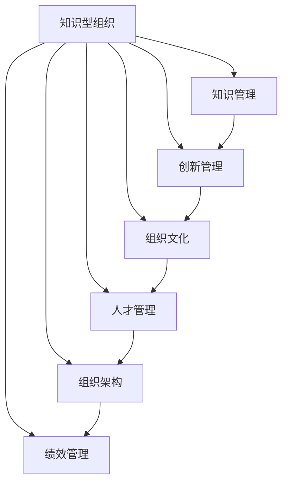

                 

# 知识型组织的特征与管理

> 关键词：知识型组织,知识管理,创新管理,组织文化,人才管理,组织架构,绩效管理

## 1. 背景介绍

### 1.1 问题由来
在知识经济时代，企业面临的竞争已经从价格和规模转向创新速度和能力。知识型组织(Knowledge-Based Organizations, KBOs)应运而生，成为了创新的前沿阵地。通过高效的知识管理、独特的组织文化和高效的人才管理，知识型组织能够快速整合外部知识，创新产品和服务，从而在市场中占据优势地位。

然而，知识型组织的运作和管理并不简单。相比于传统的以流程为中心的组织，知识型组织需要更加灵活和弹性的管理模式，以适应复杂多变的创新环境。对于如何在知识型组织中实现有效的知识管理和人才管理，国内外的学术界和业界一直在进行深入探索和实践。

### 1.2 问题核心关键点
本文将聚焦于知识型组织的特征和创新管理，分析知识型组织与传统组织的区别，探索知识型组织在知识管理、人才管理、组织文化、组织架构和绩效管理等方面的特点和策略，并结合典型案例，提出基于知识型组织的管理框架和方法。

## 2. 核心概念与联系

### 2.1 核心概念概述

为更好地理解知识型组织的特征与管理方法，本节将介绍几个密切相关的核心概念：

- **知识型组织(Knowledge-Based Organizations, KBOs)**：以知识为中心、以员工为驱动力的新型组织模式，强调通过知识共享、创新学习等方式提升组织竞争力。

- **知识管理(Knowledge Management, KM)**：通过系统的策略和技术，确保组织内部的显性知识和隐性知识能够被有效地获取、存储、共享和应用。

- **创新管理(Innovation Management)**：管理创新流程，包括创意产生、开发、实现和推广，以创造新的价值。

- **组织文化(Organizational Culture)**：组织内部成员共同持有的价值观、行为准则和信仰体系，对组织的管理和绩效有重要影响。

- **人才管理(Talent Management)**：通过吸引、培养、激励和管理人才，确保组织拥有持续的创新能力和竞争力。

- **组织架构(Organization Structure)**：企业内部的组织结构设计，包括层级、部门、职责分配等，影响组织的管理效率和创新活力。

- **绩效管理(Performance Management)**：通过设定目标、评估绩效、激励员工等方式，确保组织目标的实现和员工的持续提升。

这些核心概念之间的逻辑关系可以通过以下Mermaid流程图来展示：



这个流程图展示了两大核心概念之间以及各概念间的关联性：

1. 知识型组织以知识管理为驱动，通过系统化的知识管理策略，实现内部知识的高效流动和应用。
2. 创新管理依托于知识管理，将知识转化为创新的动力和成果。
3. 组织文化、人才管理和绩效管理与知识管理紧密相关，共同构建组织的核心竞争力。
4. 组织架构设计需考虑知识流动和创新流程，确保管理效率和创新活力。

## 3. 核心算法原理 & 具体操作步骤
### 3.1 算法原理概述

知识型组织的核心在于其独特的知识管理方式。不同于传统组织依赖文档、流程等显性知识，知识型组织更加重视员工的隐性知识，即难以编码的洞察、经验、关系网络等。因此，知识型组织的知识管理策略通常包括知识获取、知识共享、知识应用和知识创新的闭环流程。

形式化地，知识型组织的知识管理可以表示为以下过程：

1. 知识获取：从内部员工、合作伙伴、市场环境中获取知识。
2. 知识共享：通过内部平台、会议、培训等方式，将知识在组织内部传播。
3. 知识应用：将知识应用到具体的工作任务中，创造价值。
4. 知识创新：将知识转化为新产品、新服务和新方法，实现创新。

这一过程通常需要高效的组织架构和灵活的绩效管理机制来支撑，同时也依赖于良好的组织文化和人才管理。

### 3.2 算法步骤详解

基于知识型组织的知识管理原理，以下是一个典型的知识管理流程：

**Step 1: 知识获取**
- 建立知识库，记录员工的知识和经验。
- 设立知识共享平台，如内部Wiki、社交网络等。
- 组织培训和交流活动，鼓励员工分享知识和经验。

**Step 2: 知识共享**
- 开发知识共享工具，如知识管理系统、在线协作平台等。
- 定期举办知识分享会、技术交流会等，促进知识传播。
- 设立知识分享奖励机制，激励员工主动分享。

**Step 3: 知识应用**
- 将知识应用到具体的工作任务中，如项目管理、产品开发、市场营销等。
- 设立知识应用指标，如任务完成率、创新成果等，评估知识应用效果。
- 引入跨部门协作机制，促进知识在不同团队间的流动。

**Step 4: 知识创新**
- 设立创新项目组，专门负责新知识的探索和创新。
- 设立创新奖励机制，鼓励员工提出创新方案。
- 与外部研究机构和大学合作，引入外部知识资源。

### 3.3 算法优缺点

知识型组织的管理方法具有以下优点：
1. 知识共享效率高。通过系统化的知识管理平台，实现知识的高效传播和应用。
2. 创新能力强。依托于内部知识，组织能够快速响应市场变化，持续推出新产品和服务。
3. 人才管理灵活。知识型组织强调员工的自主性和创造性，能够吸引和留住高素质人才。
4. 组织文化包容。知识型组织鼓励多样性和创新，能够吸引各类人才和思想。

同时，这种方法也存在一些局限性：
1. 知识共享难度大。部分员工可能不愿意分享关键知识，导致知识流动不畅。
2. 知识管理复杂。需要设计合适的知识管理系统和激励机制，确保知识管理的有效性。
3. 知识转化难度大。部分知识难以量化和标准化，难以应用到具体任务中。
4. 创新风险高。创新过程复杂多变，需要高超的管理和协调能力。

尽管存在这些局限性，但知识型组织仍然以其独特的知识管理方式，成为创新型企业的代表。

### 3.4 算法应用领域

知识型组织的管理方法在许多创新驱动型企业中得到了广泛应用，例如：

- 高科技公司如Google、IBM等，通过设立知识共享平台和创新项目组，推动技术创新和产品开发。
- 咨询公司如麦肯锡、BCG等，通过建立知识管理系统和专业培训，提升咨询项目的专业性和效果。
- 设计公司如IDEO、Frog Design等，通过知识共享和跨部门协作，设计出具有创新性的产品。
- 创意产业如广告、影视、音乐等，通过知识共享和创意激励，不断推出创意作品。

这些企业在知识型组织的管理模式下，取得了显著的创新成果，证明了知识管理策略的有效性。

## 4. 数学模型和公式 & 详细讲解 & 举例说明
### 4.1 数学模型构建

知识型组织的知识管理可以形式化为一个动态系统，通过以下数学模型来描述：

设组织内部知识库为 $K$，知识共享平台为 $S$，知识应用项目为 $P$，知识创新项目为 $I$。知识管理过程可以表示为：

$$
K_{t+1} = K_t + S_t - P_t
$$

其中 $K_t$ 表示组织在时间 $t$ 的知识库，$S_t$ 表示知识共享平台在时间 $t$ 新增的知识量，$P_t$ 表示知识应用项目在时间 $t$ 消耗的知识量。

知识创新的数学模型为：

$$
I_{t+1} = I_t + R_t
$$

其中 $I_t$ 表示在时间 $t$ 的知识创新项目，$R_t$ 表示时间 $t$ 新增的知识创新量。

### 4.2 公式推导过程

知识共享平台和知识应用项目的具体数学模型如下：

设知识共享平台新增知识量为 $S_t$，知识应用项目消耗知识量为 $P_t$。知识共享平台和知识应用项目的关系可以表示为：

$$
S_t = f_{S}(K_t, \alpha_S)
$$

$$
P_t = f_{P}(K_t, \beta_P)
$$

其中 $f_{S}(K_t, \alpha_S)$ 和 $f_{P}(K_t, \beta_P)$ 分别为知识共享平台和知识应用项目与知识库 $K_t$ 的关系函数，$\alpha_S$ 和 $\beta_P$ 分别为知识共享平台和知识应用项目的参数。

知识共享平台和知识应用项目的参数可以表示为：

$$
\alpha_S = \frac{n_S}{\sigma_S}
$$

$$
\beta_P = \frac{n_P}{\sigma_P}
$$

其中 $n_S$ 和 $n_P$ 分别为知识共享平台和知识应用项目的规模，$\sigma_S$ 和 $\sigma_P$ 分别为知识共享平台和知识应用项目的标准化程度。

### 4.3 案例分析与讲解

以Google为例，分析其知识管理策略：

**Google的知识共享平台**
- 谷歌内部使用了一个名为“Google memo”的内部Wiki系统，员工可以在此发布和分享各类工作报告、技术文档和研究进展。
- 谷歌还设立了“Google Insights”项目，收集和分析谷歌各类产品的使用数据，共享给相关团队。

**Google的知识应用项目**
- 谷歌设立了多个跨部门的“谷歌设计”和“谷歌数据科学”项目组，将知识应用到具体的创新项目中，推动技术突破和产品创新。

**Google的知识创新**
- 谷歌设立了“谷歌X实验室”，负责探索未来技术，如自驱动汽车、可穿戴设备等。
- 谷歌还与斯坦福大学等研究机构合作，引入外部知识资源，推动技术创新。

## 5. 项目实践：代码实例和详细解释说明
### 5.1 开发环境搭建

在进行知识管理系统的开发时，需要准备好开发环境。以下是使用Python进行Django开发的环境配置流程：

1. 安装Anaconda：从官网下载并安装Anaconda，用于创建独立的Python环境。

2. 创建并激活虚拟环境：
```bash
conda create -n knowledge-env python=3.8 
conda activate knowledge-env
```

3. 安装Django：使用pip安装Django，即当前虚拟环境下的Python环境。
```bash
pip install django
```

4. 安装其他相关库：
```bash
pip install markdown django-modeltree django-simple-history
```

5. 安装数据库：安装MySQL或PostgreSQL等数据库，用于存储知识库、知识共享平台和知识应用项目的数据。

完成上述步骤后，即可在`knowledge-env`环境中开始知识管理系统开发。

### 5.2 源代码详细实现

下面是知识管理系统的核心代码实现：

```python
# 导入Django库
from django.shortcuts import render, redirect
from django.views.generic import ListView, DetailView
from django.contrib.auth.decorators import login_required
from .models import KnowledgeBase, KnowledgeShare, KnowledgeApply, InnovationProject
from .forms import KnowledgeBaseForm, KnowledgeShareForm, KnowledgeApplyForm, InnovationProjectForm

@login_required
def knowledge_base(request):
    knowledge_base = KnowledgeBase.objects.all()
    return render(request, 'knowledge_base.html', {'knowledge_base': knowledge_base})

@login_required
def knowledge_share(request):
    knowledge_share = KnowledgeShare.objects.all()
    return render(request, 'knowledge_share.html', {'knowledge_share': knowledge_share})

@login_required
def knowledge_apply(request):
    knowledge_apply = KnowledgeApply.objects.all()
    return render(request, 'knowledge_apply.html', {'knowledge_apply': knowledge_apply})

@login_required
def innovation_project(request):
    innovation_project = InnovationProject.objects.all()
    return render(request, 'innovation_project.html', {'innovation_project': innovation_project})

# 知识库管理视图
@login_required
def knowledge_base_form(request):
    if request.method == 'POST':
        form = KnowledgeBaseForm(request.POST)
        if form.is_valid():
            form.save()
            return redirect('knowledge_base')
    else:
        form = KnowledgeBaseForm()
    return render(request, 'knowledge_base_form.html', {'form': form})

# 知识共享管理视图
@login_required
def knowledge_share_form(request):
    if request.method == 'POST':
        form = KnowledgeShareForm(request.POST)
        if form.is_valid():
            form.save()
            return redirect('knowledge_share')
    else:
        form = KnowledgeShareForm()
    return render(request, 'knowledge_share_form.html', {'form': form})

# 知识应用管理视图
@login_required
def knowledge_apply_form(request):
    if request.method == 'POST':
        form = KnowledgeApplyForm(request.POST)
        if form.is_valid():
            form.save()
            return redirect('knowledge_apply')
    else:
        form = KnowledgeApplyForm()
    return render(request, 'knowledge_apply_form.html', {'form': form})

# 创新项目管理视图
@login_required
def innovation_project_form(request):
    if request.method == 'POST':
        form = InnovationProjectForm(request.POST)
        if form.is_valid():
            form.save()
            return redirect('innovation_project')
    else:
        form = InnovationProjectForm()
    return render(request, 'innovation_project_form.html', {'form': form})
```

### 5.3 代码解读与分析

让我们再详细解读一下关键代码的实现细节：

**知识库管理视图**

```python
@login_required
def knowledge_base(request):
    knowledge_base = KnowledgeBase.objects.all()
    return render(request, 'knowledge_base.html', {'knowledge_base': knowledge_base})
```

**知识共享管理视图**

```python
@login_required
def knowledge_share(request):
    knowledge_share = KnowledgeShare.objects.all()
    return render(request, 'knowledge_share.html', {'knowledge_share': knowledge_share})
```

**知识应用管理视图**

```python
@login_required
def knowledge_apply(request):
    knowledge_apply = KnowledgeApply.objects.all()
    return render(request, 'knowledge_apply.html', {'knowledge_apply': knowledge_apply})
```

**创新项目管理视图**

```python
@login_required
def innovation_project(request):
    innovation_project = InnovationProject.objects.all()
    return render(request, 'innovation_project.html', {'innovation_project': innovation_project})
```

**知识库管理表单视图**

```python
@login_required
def knowledge_base_form(request):
    if request.method == 'POST':
        form = KnowledgeBaseForm(request.POST)
        if form.is_valid():
            form.save()
            return redirect('knowledge_base')
    else:
        form = KnowledgeBaseForm()
    return render(request, 'knowledge_base_form.html', {'form': form})
```

**知识共享管理表单视图**

```python
@login_required
def knowledge_share_form(request):
    if request.method == 'POST':
        form = KnowledgeShareForm(request.POST)
        if form.is_valid():
            form.save()
            return redirect('knowledge_share')
    else:
        form = KnowledgeShareForm()
    return render(request, 'knowledge_share_form.html', {'form': form})
```

**知识应用管理表单视图**

```python
@login_required
def knowledge_apply_form(request):
    if request.method == 'POST':
        form = KnowledgeApplyForm(request.POST)
        if form.is_valid():
            form.save()
            return redirect('knowledge_apply')
    else:
        form = KnowledgeApplyForm()
    return render(request, 'knowledge_apply_form.html', {'form': form})
```

**创新项目管理表单视图**

```python
@login_required
def innovation_project_form(request):
    if request.method == 'POST':
        form = InnovationProjectForm(request.POST)
        if form.is_valid():
            form.save()
            return redirect('innovation_project')
    else:
        form = InnovationProjectForm()
    return render(request, 'innovation_project_form.html', {'form': form})
```

以上就是使用Django对知识管理系统进行开发的完整代码实现。可以看到，Django的强大框架和丰富的库支持，使得知识管理系统的开发变得简洁高效。开发者可以更加关注业务逻辑和用户体验的实现，而不必过多关注底层的实现细节。

## 6. 实际应用场景
### 6.1 智能客服系统

在智能客服系统中，知识管理可以帮助客服中心高效积累和共享常见问题解答，提升服务质量。智能客服系统通过记录和分析历史客服对话，生成标准化的问题和答案，并进行知识分类和标注。这些知识可以存储在知识库中，供客服查询和参考，从而提高客户满意度。

在技术实现上，可以引入自然语言处理技术，自动提取和标注知识，提升知识管理效率。同时，知识管理系统可以与客服系统集成，实现知识查询和推送，提升客服响应速度。

### 6.2 金融舆情监测

金融领域中的舆情监测对信息分析和风险控制至关重要。知识管理可以帮助金融机构建立舆情监测系统，高效收集和分析各类新闻、社交媒体、研究报告等信息。通过知识共享平台，不同部门和团队可以共享信息，提升舆情分析的准确性和及时性。

在技术实现上，可以引入自然语言处理技术和机器学习算法，对舆情信息进行情感分析和主题分类。同时，知识管理系统可以与舆情监测系统集成，实现信息实时更新和分析，提升风险预警能力。

### 6.3 个性化推荐系统

个性化推荐系统是电商、新闻、视频等平台的重要组成部分。通过知识管理，推荐系统可以高效积累和分析用户行为数据，提升推荐效果。推荐系统通过记录和分析用户浏览、点击、评论等行为，生成推荐知识和策略。这些知识可以存储在知识库中，供推荐算法使用，从而提升推荐精度和用户满意度。

在技术实现上，可以引入推荐算法和机器学习技术，对用户行为进行建模和预测。同时，知识管理系统可以与推荐系统集成，实现知识查询和推送，提升推荐效果。

### 6.4 未来应用展望

随着知识型组织的管理方法不断发展，其在更多行业领域的应用前景广阔。

在智慧医疗领域，知识管理可以帮助医疗机构高效积累和共享医疗知识和经验，提升医疗服务质量和效率。通过知识管理系统，医疗专家可以共享病例、治疗方案和研究成果，提升医疗研究和诊疗水平。

在智能教育领域，知识管理可以帮助教育机构高效积累和共享教学资源，提升教学质量和效果。通过知识管理系统，教师可以共享课件、案例和教学经验，提升教学创新能力。

在智慧城市治理中，知识管理可以帮助政府高效收集和分析各类数据信息，提升城市管理水平。通过知识管理系统，城市管理者可以共享政策、规划和研究报告，提升城市规划和治理能力。

此外，在企业生产、社会治理、文娱传媒等众多领域，知识管理也将发挥重要作用，为经济社会发展提供新的技术路径。

## 7. 工具和资源推荐
### 7.1 学习资源推荐

为了帮助开发者系统掌握知识型组织的管理理论基础和实践技巧，这里推荐一些优质的学习资源：

1. 《知识管理与组织创新》系列书籍：由知识管理专家撰写，详细介绍了知识型组织的理论基础和实践方法，涵盖知识管理、人才管理、组织文化等多个方面。

2. 《组织行为学》课程：许多知名大学和在线学习平台提供的组织行为学课程，系统介绍组织管理的基础理论和实践方法。

3. 《创新管理》书籍：介绍创新管理的理论、方法和工具，帮助组织实现创新驱动发展。

4. 《组织学习与知识管理》论文集：收录多篇知识管理领域的经典论文，深入探讨知识管理的关键问题和前沿技术。

5. 《知识共享平台设计与实现》书籍：介绍知识共享平台的系统架构和关键技术，帮助组织构建高效的知识共享系统。

通过对这些资源的学习实践，相信你一定能够系统掌握知识型组织的管理方法和策略，为组织的创新发展提供有力的支撑。
###  7.2 开发工具推荐

高效的开发离不开优秀的工具支持。以下是几款用于知识型组织管理开发的常用工具：

1. Django：基于Python的开源Web框架，适合构建高效的知识管理系统和应用平台。

2. Git：版本控制系统，适合协同开发和管理代码版本。

3. GitHub：代码托管平台，提供丰富的协作工具和文档管理功能。

4. Confluence：企业知识管理系统，适合组织内部文档管理和知识共享。

5. SharePoint：微软的知识管理平台，提供企业级的文档管理、协作和搜索功能。

6. JIRA：项目管理工具，适合跟踪和协作知识管理项目的进度和质量。

合理利用这些工具，可以显著提升知识型组织管理系统的开发效率，加快创新迭代的步伐。

### 7.3 相关论文推荐

知识型组织的管理方法在学术界和业界得到了广泛研究。以下是几篇奠基性的相关论文，推荐阅读：

1. 《知识型组织的管理理论与实践》：总结了知识型组织管理的理论基础和实践方法，提出了知识型组织的特征和管理策略。

2. 《基于知识管理的创新管理模型》：研究了知识管理与创新管理的关系，提出了知识型组织的创新管理模型。

3. 《知识共享平台的设计与实现》：介绍了知识共享平台的系统架构和关键技术，提出了知识共享平台的优化策略。

4. 《知识型组织的人才管理策略》：研究了知识型组织的人才管理策略，提出了有效的人才吸引、培养和激励机制。

5. 《知识型组织的绩效管理体系》：研究了知识型组织的绩效管理策略，提出了基于知识的绩效评估和激励机制。

这些论文代表了大语言模型微调技术的发展脉络。通过学习这些前沿成果，可以帮助研究者把握学科前进方向，激发更多的创新灵感。

## 8. 总结：未来发展趋势与挑战
### 8.1 总结

本文对知识型组织的特征和管理方法进行了全面系统的介绍。首先阐述了知识型组织的核心特征，分析了知识型组织与传统组织的区别，探索了知识型组织在知识管理、人才管理、组织文化、组织架构和绩效管理等方面的特点和策略，并结合典型案例，提出基于知识型组织的管理框架和方法。

通过本文的系统梳理，可以看到，知识型组织在管理方式和策略上具有独特优势，能够通过高效的知识管理实现持续创新，提升组织的竞争力和市场价值。知识型组织的管理模式，为各类创新型企业提供了有益的参考和借鉴。

### 8.2 未来发展趋势

展望未来，知识型组织的管理方法将呈现以下几个发展趋势：

1. 知识管理的智能化。随着人工智能和大数据技术的发展，知识管理系统将更加智能化，能够自动提取、标注和分类知识，提升知识管理的效率和质量。

2. 知识共享的实时化。知识型组织将进一步强化知识共享的实时性，通过实时监控和预警机制，提升组织内部知识的流动和应用。

3. 人才管理的灵活化。知识型组织将更加重视人才的自主性和创造性，通过灵活的人才管理策略，吸引和留住高素质人才。

4. 组织文化的包容性。知识型组织将更加注重组织文化的包容性，鼓励多样性和创新，吸引各类人才和思想。

5. 绩效管理的透明化。知识型组织将引入透明化的绩效管理体系，通过公开透明的评估和激励机制，提升员工的积极性和创造力。

6. 组织架构的扁平化。知识型组织将更加扁平化，通过跨部门协作和自组织管理，提升组织的管理效率和创新活力。

以上趋势凸显了知识型组织管理方法的不断进步。这些方向的探索发展，必将进一步提升知识型组织的管理效率和创新能力，推动组织的持续发展和竞争力提升。

### 8.3 面临的挑战

尽管知识型组织的管理方法已经取得了瞩目成就，但在迈向更加智能化、普适化应用的过程中，它仍面临诸多挑战：

1. 知识共享难度大。部分员工可能不愿意分享关键知识，导致知识流动不畅。
2. 知识管理复杂。需要设计合适的知识管理系统和激励机制，确保知识管理的有效性。
3. 知识转化难度大。部分知识难以量化和标准化，难以应用到具体任务中。
4. 创新风险高。创新过程复杂多变，需要高超的管理和协调能力。
5. 知识型组织的人才管理策略复杂。需要灵活的人才管理策略，吸引和留住高素质人才。
6. 知识型组织的绩效管理复杂。需要透明化的绩效管理体系，确保员工的积极性和创造力。

尽管存在这些挑战，但知识型组织仍然以其独特的知识管理方式，成为创新型企业的代表。

### 8.4 未来突破

面对知识型组织所面临的种种挑战，未来的研究需要在以下几个方面寻求新的突破：

1. 探索知识共享的智能化方法。利用人工智能和大数据技术，自动提取、标注和分类知识，提升知识共享的效率和质量。

2. 研究知识管理的系统化方法。设计合适的知识管理系统和激励机制，确保知识管理的有效性。

3. 开发知识转化的标准化方法。将知识转化为标准化、可量化的形式，提升知识应用的效果。

4. 引入透明化的绩效管理机制。通过公开透明的评估和激励机制，提升员工的积极性和创造力。

5. 采用灵活的人才管理策略。制定灵活的人才管理策略，吸引和留住高素质人才。

6. 优化组织架构和协作机制。通过跨部门协作和自组织管理，提升组织的管理效率和创新活力。

这些研究方向的探索，必将引领知识型组织的管理方法迈向更高的台阶，为组织的创新发展提供更加有力的方法和工具。面向未来，知识型组织的管理方法还需要与其他人工智能技术进行更深入的融合，如知识表示、因果推理、强化学习等，多路径协同发力，共同推动组织创新发展的进程。

## 9. 附录：常见问题与解答

**Q1：知识型组织与传统组织有何区别？**

A: 知识型组织与传统组织的核心区别在于知识管理和人才管理方式的不同。知识型组织强调知识的共享和创新，通过知识管理平台高效积累和传播知识，推动创新。而传统组织往往依赖流程和文档管理，缺乏灵活的知识管理机制。

**Q2：知识型组织如何设计知识管理平台？**

A: 知识型组织的知识管理平台需要具备以下特点：
1. 高效的知识收集和标注机制，确保知识的准确性和完整性。
2. 灵活的知识检索和查询功能，支持快速查找相关知识。
3. 多样化的知识共享和协作工具，支持内部讨论和知识传播。
4. 实时的知识更新和维护机制，确保知识的及时性和实用性。
5. 系统的知识分类和标注体系，支持知识的分类管理和应用。

**Q3：知识型组织如何提升知识应用效果？**

A: 知识型组织需要设计有效的知识应用策略，确保知识能够在实际工作中产生价值。具体方法包括：
1. 设立知识应用项目组，专门负责知识的应用和推广。
2. 引入跨部门协作机制，促进知识在不同团队间的流动。
3. 设立知识应用指标，如任务完成率、创新成果等，评估知识应用效果。

**Q4：知识型组织如何吸引和留住高素质人才？**

A: 知识型组织需要通过灵活的人才管理策略，吸引和留住高素质人才。具体方法包括：
1. 设计灵活的激励机制，如股权激励、项目分红等，激励员工的创新和贡献。
2. 设立职业发展通道，帮助员工实现个人职业目标。
3. 提供持续的学习和发展机会，提升员工的专业能力和创新能力。

**Q5：知识型组织如何实现知识创新？**

A: 知识型组织需要设立专门的创新项目组，通过引入外部知识资源和内部创新思维，推动知识创新。具体方法包括：
1. 设立创新项目组，专门负责新知识的探索和创新。
2. 引入外部研究机构和大学，引入外部知识资源。
3. 设立创新奖励机制，鼓励员工提出创新方案。

这些问题的回答，帮助读者更好地理解知识型组织的管理方法和策略，为组织的创新发展提供有益的参考和借鉴。

---

作者：禅与计算机程序设计艺术 / Zen and the Art of Computer Programming

