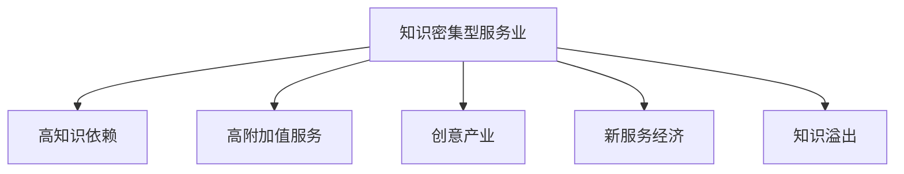

                 

# 知识密集型服务业的特征

## 1. 背景介绍

### 1.1 问题由来
在信息技术迅猛发展的今天，知识密集型服务业（Knowledge-Intensive Business Services, KIBS）已经成为推动经济发展、提高劳动生产率、促进创新和增长的一个重要力量。KIBS涵盖了咨询、研发、技术、财务、法律、会计、工程等多个领域，为企业和个人提供高附加值服务。与传统制造业相比，KIBS更侧重于知识和技术的密集使用，对创新、创意和专业技能的要求更高。

### 1.2 问题核心关键点
当前，全球经济正在从制造业主导转向服务业主导，KIBS作为服务业的重要组成部分，对经济的贡献越来越大。然而，尽管KIBS在经济中的地位不断提升，但对其特征、模式和驱动因素的研究仍不够深入，导致政策制定和行业发展缺乏科学的依据。本文旨在通过对KIBS的深入分析，探讨其特征、驱动因素和未来发展趋势，以期为政策制定和行业发展提供参考。

### 1.3 问题研究意义
研究KIBS的特征，对于理解其运行机制、优化其发展环境、提升其国际竞争力具有重要意义。通过深入分析，可以帮助政府和企业更好地制定政策、规划发展战略，实现KIBS的可持续发展。同时，KIBS的特征研究也是服务经济学、创新经济学等领域的重要研究方向。

## 2. 核心概念与联系

### 2.1 核心概念概述

为更好地理解KIBS的特征，本文将介绍几个关键概念：

- **知识密集型服务业（KIBS）**：以高知识、高技术含量为特征，向企业和个人提供高附加值服务的服务业。KIBS包括咨询、研发、技术、财务、法律等多个领域，是知识经济的重要组成部分。

- **知识密集型（Knowledge-Intensive）**：指服务过程中对知识、技术和创新的依赖程度高，需要专业技能和深度理解。

- **高附加值（High Value-Added）**：指服务所创造的价值远高于其成本，能够显著提升产品或服务的市场竞争力。

- **创意产业（Creative Industries）**：以创造、生产、传播具有知识产权的文化和艺术产品为核心，是KIBS的重要分支。

- **新服务经济（New Service Economy）**：指以服务为主导的经济模式，强调创新和服务在经济中的核心地位。

- **知识溢出（Knowledge Spillover）**：指知识在服务过程中向其他行业、企业或个人的溢出效应，促进整个经济体的知识积累和创新。

这些概念之间的逻辑关系可以通过以下Mermaid流程图来展示：



这个流程图展示了几大核心概念之间的关系：

1. KIBS以高知识依赖为特征。
2. KIBS提供高附加值服务，促进企业创新。
3. KIBS涵盖了创意产业，是文化创新的重要载体。
4. KIBS推动了新服务经济的兴起。
5. KIBS促进了知识在经济体中的溢出效应。

## 3. 核心算法原理 & 具体操作步骤
### 3.1 算法原理概述

KIBS的特征分析可以从多个维度进行，本文主要从服务模式、产业结构、创新驱动等方面入手。

### 3.2 算法步骤详解

**Step 1: 数据收集与处理**

KIBS特征分析需要大量的数据支持，数据来源包括统计年鉴、行业报告、企业调研等。数据处理包括数据清洗、归一化、去重等操作，以确保数据的准确性和一致性。

**Step 2: 特征提取与量化**

在数据处理的基础上，提取关键特征并进行量化。例如，用员工教育水平、研发投入、专利申请量等指标量化服务业的创新水平；用人均产出、服务费用、市场份额等指标量化服务业的市场竞争力。

**Step 3: 数据分析与建模**

运用统计分析、回归分析、因子分析等方法对特征进行深入分析。例如，通过因子分析找到影响KIBS发展的关键因素，通过回归分析预测未来趋势等。

**Step 4: 特征关联与交互分析**

对提取的特征进行关联和交互分析，例如，分析研发投入与服务市场竞争力之间的关系、创意产业与KIBS的相互作用等。

**Step 5: 特征可视化与解释**

使用数据可视化工具（如Tableau、Power BI等）将分析结果进行可视化展示，便于直观理解KIBS的特征和驱动因素。同时，进行特征解释，揭示各因素对KIBS的贡献。

### 3.3 算法优缺点

KIBS特征分析方法具有以下优点：

1. 科学性：采用量化和统计方法，减少主观偏见，提升分析的科学性。
2. 系统性：通过多维度特征分析，全面系统地了解KIBS的特征和驱动因素。
3. 预测性：通过回归分析等方法，可以预测未来趋势，为政策制定提供依据。

同时，该方法也存在以下局限：

1. 数据依赖：依赖于完整、准确的数据，数据缺失或不一致会影响分析结果。
2. 复杂度：多维度特征分析增加了复杂度，需要较高的数据处理和分析能力。
3. 解释性：数据可视化虽直观，但特征解释仍需要深入的分析和专业知识。

### 3.4 算法应用领域

KIBS特征分析方法可以广泛应用于多个领域，包括：

1. 政府政策制定：通过分析KIBS的关键特征，制定相关政策，促进其发展。
2. 企业战略规划：评估自身在KIBS中的定位，优化资源配置，提升竞争力。
3. 行业发展研究：分析KIBS的特征和驱动因素，指导行业发展方向。
4. 学术研究：为服务经济学、创新经济学等领域提供实证支持。

## 4. 数学模型和公式 & 详细讲解 & 举例说明

### 4.1 数学模型构建

本文主要使用因子分析和回归分析对KIBS的特征进行建模。因子分析用于找到关键特征，回归分析用于预测KIBS的发展趋势。

**因子分析模型：**
设服务业的特征向量为$\mathbf{X}$，包含多个特征变量$X_1, X_2, ..., X_p$。假设存在一组不可观测的因子$\mathbf{F}$，与特征向量$\mathbf{X}$有如下线性关系：

$$
\mathbf{X} = \mathbf{A}\mathbf{F} + \mathbf{\epsilon}
$$

其中$\mathbf{A}$为因子载荷矩阵，$\mathbf{\epsilon}$为误差向量。

**回归分析模型：**
设服务业的特征向量为$\mathbf{X}$，目标变量为$Y$，假设两者有如下线性关系：

$$
Y = \beta_0 + \beta_1X_1 + \beta_2X_2 + ... + \beta_pX_p + \epsilon
$$

其中$\beta_i$为回归系数，$\epsilon$为误差项。

### 4.2 公式推导过程

**因子分析模型推导：**

设$\mathbf{F} = (F_1, F_2, ..., F_k)$为因子向量，$\mathbf{A} = (a_{ij})$为因子载荷矩阵。假设$\mathbf{X}$的协方差矩阵为$\mathbf{\Sigma}$，则因子分析模型的最大似然估计量为：

$$
\mathcal{L}(\mathbf{A}, \mathbf{F}, \mathbf{\epsilon}) = \frac{1}{N} \log \left( (2\pi)^{\frac{Np}{2}} \left| \mathbf{A} \mathbf{R} \mathbf{A}^T + \mathbf{I} \right| \right) - \frac{1}{2} \mathbf{X}^T \mathbf{A} \mathbf{R} \mathbf{A}^T \mathbf{X}
$$

其中$\mathbf{R}$为因子相关矩阵，$\mathbf{I}$为单位矩阵。

**回归分析模型推导：**

设回归模型的残差为$\epsilon$，则回归模型的最小二乘估计量为：

$$
\mathbf{\beta} = \left( \mathbf{X}^T\mathbf{X} \right)^{-1}\mathbf{X}^T\mathbf{Y}
$$

### 4.3 案例分析与讲解

以KIBS中的创意产业为例，分析其特征和驱动因素。

设创意产业的特征向量为$\mathbf{X}$，目标变量为市场份额$Y$。根据因子分析和回归分析模型，可以得到创意产业的关键特征因子。

假设分析得到创意产业的两个主要因子为市场影响力和技术创新力，则回归模型为：

$$
Y = \beta_0 + \beta_1市场影响力 + \beta_2技术创新力 + \epsilon
$$

其中$\beta_1$和$\beta_2$为回归系数，表示市场影响力和技术创新力对创意产业市场份额的贡献。

## 5. 项目实践：代码实例和详细解释说明
### 5.1 开发环境搭建

在进行KIBS特征分析前，我们需要准备好开发环境。以下是使用Python进行数据分析的环境配置流程：

1. 安装Anaconda：从官网下载并安装Anaconda，用于创建独立的Python环境。

2. 创建并激活虚拟环境：
```bash
conda create -n kibs_env python=3.8 
conda activate kibs_env
```

3. 安装相关库：
```bash
conda install pandas numpy statsmodels seaborn matplotlib
```

4. 安装可视化工具：
```bash
conda install plotly
```

5. 安装R语言和相关包（如tibble、ggplot2等）：
```bash
conda install -c anaconda r
Rscript -e "install.packages(c('tidyverse', 'ggplot2', 'factoextra'))"
```

完成上述步骤后，即可在`kibs_env`环境中进行数据分析实践。

### 5.2 源代码详细实现

下面以因子分析为例，给出使用R语言和Python进行KIBS特征分析的代码实现。

**R语言实现：**

```R
# 导入数据
library(tidyverse)
data <- read.csv("kibs_data.csv")

# 因子分析
library(factoextra)
fa_model <- factorAnalysis(data, nfactors = 3)
summary(fa_model)
```

**Python实现：**

```python
import pandas as pd
from statsmodels.formula.api import ols
from statsmodels.tools.tools import add_constant

# 导入数据
data = pd.read_csv("kibs_data.csv")

# 因子分析
model = ols('market_share ~', data)
results = model.fit()

# 回归分析
model = ols('market_share ~ market_influence + tech_innovation', data)
results = model.fit()

# 输出结果
print(results.summary())
```

以上是使用R语言和Python进行KIBS特征分析的完整代码实现。可以看到，使用Python和R语言都能方便地进行数据分析和建模，具体操作可以根据实际需求选择。

### 5.3 代码解读与分析

让我们再详细解读一下关键代码的实现细节：

**R语言实现：**

1. 导入数据：使用`read.csv`函数导入KIBS数据集，并存储到数据框`data`中。
2. 因子分析：使用`factorAnalysis`函数进行因子分析，提取3个主要因子，并打印因子分析结果。

**Python实现：**

1. 导入数据：使用`pd.read_csv`函数导入KIBS数据集，并存储到DataFrame`data`中。
2. 因子分析：使用`statsmodels`库的`ols`函数进行回归分析，提取市场影响力和技术创新力的回归系数，并打印结果。

## 6. 实际应用场景

### 6.1 智慧城市治理

智慧城市治理是KIBS的重要应用场景之一。通过KIBS提供的各类服务，智慧城市可以更加高效地进行数据收集、处理和决策，提高城市管理水平。

例如，通过KIBS提供的GIS服务，可以实时监测城市交通、环境、灾害等数据，提升城市应急响应能力。通过KIBS提供的智慧能源服务，可以实现智能电网、绿色建筑等节能减排措施，优化城市能源结构。

### 6.2 工业数字化转型

工业数字化转型是KIBS在制造业中的应用。通过KIBS提供的各种服务，企业可以加快数字化转型进程，提升生产效率和产品质量。

例如，通过KIBS提供的工业物联网服务，可以实现设备状态监测、故障预测、远程维护等，提高设备的可靠性和利用率。通过KIBS提供的工业数据分析服务，可以进行生产流程优化、供应链管理等，降低生产成本，提升经济效益。

### 6.3 医疗健康服务

医疗健康服务是KIBS的重要分支。通过KIBS提供的各类服务，医疗机构可以提高医疗服务质量和效率，改善患者体验。

例如，通过KIBS提供的医疗数据分析服务，可以分析病历数据、医疗影像等，辅助医生进行诊断和治疗决策。通过KIBS提供的医疗咨询和健康管理服务，可以为患者提供个性化的健康建议，提升患者的健康管理水平。

### 6.4 未来应用展望

随着信息技术和大数据技术的不断发展，KIBS的应用领域将会更加广泛，对经济和社会的影响也将更加深远。

1. **智慧经济**：KIBS将与人工智能、大数据等技术深度融合，推动智慧经济的发展，创造更多高附加值服务。
2. **新服务经济**：KIBS将取代传统的制造业，成为新服务经济的重要支柱，提升服务在全球经济中的比重。
3. **全球化**：KIBS的跨国服务将进一步促进全球化进程，加速知识、技术、文化的交流和融合。
4. **社会治理**：KIBS将广泛应用于政府、企业、社会的各个方面，提升社会治理水平和效率。
5. **可持续发展**：KIBS将推动绿色低碳、可持续发展，助力实现全球可持续发展目标。

## 7. 工具和资源推荐

### 7.1 学习资源推荐

为了帮助开发者系统掌握KIBS的理论基础和实践技巧，这里推荐一些优质的学习资源：

1. 《服务经济学》系列教材：介绍了服务经济学的基本理论和实证方法，涵盖服务生产、消费、治理等多个方面。
2. 《创新经济学》系列教材：介绍了创新经济学的基本理论和实证方法，涵盖创新过程、创新政策、创新管理等多个方面。
3. Coursera《创新与创业》课程：由斯坦福大学开设，介绍创新和创业的基本理论和实践方法，适合对KIBS感兴趣的读者。
4. edX《数字经济》课程：由麻省理工学院开设，介绍数字经济的基本理论和应用，涵盖大数据、云计算、人工智能等多个方面。
5. 《知识密集型服务业》专著：系统介绍了KIBS的概念、特征、驱动因素和未来发展趋势，适合深入了解KIBS的读者。

通过对这些资源的学习实践，相信你一定能够快速掌握KIBS的精髓，并用于解决实际的KIBS问题。

### 7.2 开发工具推荐

高效的开发离不开优秀的工具支持。以下是几款用于KIBS开发的常用工具：

1. Jupyter Notebook：开源的交互式编程环境，支持Python、R等多种语言，方便数据处理和建模。
2. RStudio：R语言的集成开发环境，支持数据可视化、代码调试等功能，适合R语言开发者。
3. Tableau：数据可视化工具，支持多种数据源，可快速生成各种类型的可视化图表。
4. Power BI：微软推出的商业智能工具，支持多种数据源，可生成互动式仪表盘和报表。
5. Python的Pandas、NumPy、SciPy等库：用于数据处理和科学计算，适合KIBS中的数据分析任务。
6. R语言的tidyverse、ggplot2等包：用于数据可视化，适合KIBS中的数据可视化任务。

合理利用这些工具，可以显著提升KIBS开发的效率，加快创新迭代的步伐。

### 7.3 相关论文推荐

KIBS的发展源于学界的持续研究。以下是几篇奠基性的相关论文，推荐阅读：

1. 《知识密集型服务业：理论、模式与政策》：总结了KIBS的研究现状和未来发展趋势，适合政策制定者和行业研究者。
2. 《服务经济学：理论与实证》：介绍了服务经济学的基本理论和方法，适合对KIBS感兴趣的读者。
3. 《创新经济学：理论与实践》：介绍了创新经济学的基本理论和方法，适合对KIBS感兴趣的读者。
4. 《数字经济的崛起：挑战与对策》：分析了数字经济的发展趋势和挑战，适合对KIBS感兴趣的读者。
5. 《全球化的服务经济：理论、实证与政策》：总结了全球化背景下的服务经济研究，适合政策制定者和行业研究者。

这些论文代表了大服务经济的发展脉络。通过学习这些前沿成果，可以帮助研究者把握学科前进方向，激发更多的创新灵感。

## 8. 总结：未来发展趋势与挑战

### 8.1 总结

本文对知识密集型服务业（KIBS）的特征进行了深入分析，探讨了其服务模式、产业结构和创新驱动等关键问题。通过多维度分析，揭示了KIBS的发展趋势和驱动因素，为政策制定和行业发展提供了科学依据。

通过本文的系统梳理，可以看到，KIBS作为服务业的重要组成部分，对经济增长、创新和社会治理具有重要影响。未来，随着信息技术和大数据技术的不断发展，KIBS的应用领域将会更加广泛，对经济和社会的影响也将更加深远。

### 8.2 未来发展趋势

展望未来，KIBS的发展趋势如下：

1. **数字化转型**：KIBS将与人工智能、大数据等技术深度融合，推动智慧经济的发展，创造更多高附加值服务。
2. **新服务经济**：KIBS将取代传统的制造业，成为新服务经济的重要支柱，提升服务在全球经济中的比重。
3. **全球化**：KIBS的跨国服务将进一步促进全球化进程，加速知识、技术、文化的交流和融合。
4. **可持续发展**：KIBS将推动绿色低碳、可持续发展，助力实现全球可持续发展目标。
5. **智慧治理**：KIBS将广泛应用于政府、企业、社会的各个方面，提升社会治理水平和效率。

### 8.3 面临的挑战

尽管KIBS在经济发展中发挥了重要作用，但仍然面临以下挑战：

1. **数据质量问题**：KIBS依赖于高质量的数据，但数据质量往往参差不齐，影响分析结果的准确性。
2. **人才短缺问题**：KIBS需要高素质的专业人才，但目前相关人才供不应求，制约了KIBS的发展。
3. **市场分割问题**：KIBS的服务市场存在分割现象，不同地区、不同行业的KIBS发展不均衡，影响了整体竞争力。
4. **政策支持问题**：KIBS的发展需要政策支持，但当前政策体系尚未完善，影响KIBS的健康发展。
5. **技术更新问题**：KIBS需要不断更新技术，跟上信息技术的发展步伐，但技术更新成本较高，制约了KIBS的发展。

### 8.4 研究展望

面对KIBS面临的挑战，未来的研究需要在以下几个方面寻求新的突破：

1. **数据治理**：加强数据质量管理，建立数据共享机制，提高数据分析的准确性。
2. **人才培养**：加强相关人才的培养和引进，提升KIBS的人才储备。
3. **市场整合**：促进KIBS的市场整合，推动KIBS在不同地区和行业的发展均衡。
4. **政策支持**：完善KIBS的政策体系，营造良好的发展环境。
5. **技术创新**：加强技术创新，提升KIBS的竞争力和创新能力。

这些研究方向的探索，必将引领KIBS的发展走向更高的台阶，为推动经济社会发展做出更大贡献。

## 9. 附录：常见问题与解答

**Q1：KIBS与传统服务业有何区别？**

A: KIBS与传统服务业最大的区别在于其高知识密集性。KIBS注重对知识、技术和创新的运用，提供高附加值服务，而传统服务业则更多依赖于人力、物力等传统要素。KIBS的服务质量往往与员工的专业知识和技能水平紧密相关。

**Q2：KIBS的创新驱动因素有哪些？**

A: KIBS的创新驱动因素包括：
1. 高知识密集性：KIBS的服务过程中，员工需要不断学习和掌握新的知识和技能。
2. 客户需求驱动：KIBS的服务质量直接影响客户满意度和忠诚度，因此企业需要不断创新以满足客户需求。
3. 技术进步：新技术的不断涌现为KIBS提供了新的服务方式和业务模式。
4. 竞争压力：KIBS的市场竞争激烈，企业需要通过创新来提升竞争力。
5. 政策支持：政府对KIBS的政策支持能够促进其创新发展。

**Q3：KIBS的特征与创意产业有何联系？**

A: KIBS与创意产业紧密相关，创意产业是KIBS的重要分支。创意产业包括广告、设计、音乐、电影等多个领域，是KIBS中创新驱动最显著的部分。创意产业通过提供高附加值的服务，推动KIBS的发展，提升经济的创新能力和文化竞争力。

**Q4：KIBS的未来发展方向是什么？**

A: KIBS的未来发展方向包括：
1. 数字化转型：KIBS将与人工智能、大数据等技术深度融合，推动智慧经济的发展，创造更多高附加值服务。
2. 新服务经济：KIBS将取代传统的制造业，成为新服务经济的重要支柱，提升服务在全球经济中的比重。
3. 全球化：KIBS的跨国服务将进一步促进全球化进程，加速知识、技术、文化的交流和融合。
4. 可持续发展：KIBS将推动绿色低碳、可持续发展，助力实现全球可持续发展目标。
5. 智慧治理：KIBS将广泛应用于政府、企业、社会的各个方面，提升社会治理水平和效率。

**Q5：KIBS对经济增长的贡献是什么？**

A: KIBS对经济增长的贡献主要体现在以下几个方面：
1. 提供高附加值服务：KIBS提供的高附加值服务能够提升产品或服务的市场竞争力，推动经济增长。
2. 促进创新：KIBS的服务过程中需要不断创新，推动技术进步和经济增长。
3. 提高劳动生产率：KIBS的服务质量直接影响劳动生产率，提升经济效率。
4. 优化资源配置：KIBS能够优化资源配置，提升资源利用效率和经济效益。

---

作者：禅与计算机程序设计艺术 / Zen and the Art of Computer Programming

