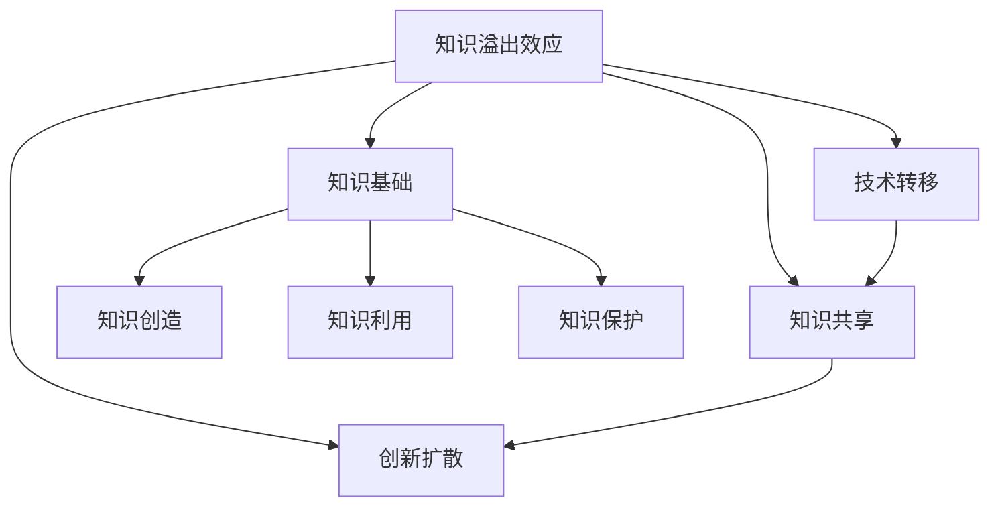

                 

# 知识溢出效应及其经济影响

> 关键词：知识溢出效应,经济影响,创新,技术转移,知识共享,知识创造,知识利用,知识基础

## 1. 背景介绍

### 1.1 问题由来
在当今知识经济时代，知识的生产和利用成为推动经济发展的重要引擎。然而，知识的创造、存储、传播和利用是一个复杂的过程，涉及个体、组织、企业和整个社会。在这个过程中，知识溢出（Knowledge Spillover）现象扮演着至关重要的角色。知识溢出指的是知识从一个地方、个体或组织转移到另一个地方、个体或组织，这可以包括技术转移、知识共享、教育培训、创新扩散等。

知识溢出效应对经济的影响是多方面的，既有积极的，也有消极的。积极的影响包括促进创新、推动技术进步、提高生产效率和增加就业机会。消极的影响包括知识产权流失、技术泄露和竞争优势的削弱。因此，了解和应对知识溢出效应，对制定有效的政策、促进经济增长和维护公平竞争具有重要意义。

### 1.2 问题核心关键点
知识溢出效应是指知识通过各种渠道从生产者向消费者转移的过程，这种转移可以是直接的（如研究论文的发布）或间接的（如企业间的合作）。知识溢出效应的核心关键点包括：

- **知识类型**：知识的溢出可能涉及技术、管理、文化等不同类型，影响范围和程度各异。
- **溢出渠道**：知识溢出可以通过市场交易、企业合作、教育培训、研究论文等不同渠道实现。
- **溢出效应**：知识溢出可以推动技术进步、促进创新、提高生产效率、增加就业等。
- **溢出控制**：为了最大化溢出效应，需要制定合理的政策和机制，如知识产权保护、技术转让协议等。

这些关键点共同构成了知识溢出效应的研究框架，帮助理解其产生机制和影响路径。

## 2. 核心概念与联系

### 2.1 核心概念概述

为更好地理解知识溢出效应的相关理论，本节将介绍几个密切相关的核心概念：

- **知识溢出效应**：知识从一个地方、个体或组织转移到另一个地方、个体或组织的过程，可以是技术、管理、文化等多种形式的知识。
- **技术转移**：技术从一个组织或国家向另一个组织或国家转移，通常通过专利交易、技术合作等方式实现。
- **知识共享**：通过教育、培训、会议、论文等方式，知识在个体、组织和国家之间共享。
- **创新扩散**：新技术、新工艺、新产品的推广和应用，通过模仿、改进、集成等方式实现。
- **知识基础**：知识溢出效应产生的基础，包括知识创造、知识利用和知识保护等方面。

这些概念之间的逻辑关系可以通过以下Mermaid流程图来展示：



这个流程图展示了几大核心概念及其之间的关系：

1. 知识溢出效应是知识在不同实体之间转移的结果。
2. 知识溢出可以通过技术转移、知识共享和创新扩散等方式实现。
3. 技术转移是知识溢出的一种形式，通常涉及专利、技术协议等。
4. 知识共享是通过教育、培训、会议等方式实现的知识转移。
5. 创新扩散是通过模仿、改进等方式实现的新技术、新产品的推广。
6. 知识创造、利用和保护是知识溢出效应的基础，共同构成了知识基础。

## 3. 核心算法原理 & 具体操作步骤
### 3.1 算法原理概述

知识溢出效应的研究通常依赖于经济理论，特别是新古典增长理论和创新理论。以下是基于新古典增长理论的知识溢出效应分析框架：

假设一个国家或地区有 $n$ 个生产要素，包括资本 $K$、劳动 $L$ 和知识 $A$。知识 $A$ 可以通过投资、教育和研发等方式增加。知识的边际产出率高于其他要素，这意味着知识在推动经济增长方面具有重要作用。知识溢出效应可以通过各种渠道实现，如教育培训、技术合作、论文发表等。

知识溢出效应对经济的影响可以用以下模型来表示：

$$
\dot{Y} = \alpha Y + \beta A + \delta K + \epsilon L + \zeta A_{spillover}
$$

其中，$Y$ 为经济产出，$A$ 为知识水平，$\alpha$、$\beta$、$\delta$ 和 $\epsilon$ 为要素投入产出系数，$\zeta$ 为知识溢出系数，$A_{spillover}$ 为知识溢出效应。

### 3.2 算法步骤详解

知识溢出效应的分析步骤如下：

1. **数据收集与处理**：收集相关国家和地区的经济数据、知识数据（如专利申请、论文发表等）、劳动力数据等。
2. **模型构建**：基于上述新古典增长模型，构建知识溢出效应的计量模型。
3. **参数估计**：使用统计方法估计模型的参数，包括知识溢出系数 $\zeta$。
4. **效应分析**：分析知识溢出效应对经济增长、生产效率和就业等变量的影响。
5. **政策建议**：根据分析结果，提出促进知识溢出效应、保护知识产权、促进技术转移等政策建议。

### 3.3 算法优缺点

知识溢出效应的分析方法具有以下优点：

1. **模型简单**：新古典增长模型是经济学中常用的模型，易于理解和应用。
2. **数据可得性**：经济数据和知识数据通常较为容易获得。
3. **政策建议**：基于模型的分析结果，可以提出有针对性的政策建议。

然而，该方法也存在一些局限：

1. **模型假设限制**：新古典增长模型假设要素边际产出率不变，这在现实中往往不成立。
2. **数据质量问题**：数据收集和处理过程中可能存在误差和不一致。
3. **复杂效应**：知识溢出效应的机制和路径复杂，难以完全解释。

### 3.4 算法应用领域

知识溢出效应的分析方法可以应用于多个领域，包括：

- **经济增长研究**：分析知识溢出效应对国家或地区的经济增长、生产效率和就业的影响。
- **技术进步研究**：研究技术转移、知识共享对技术进步的推动作用。
- **创新扩散研究**：分析新技术、新产品的推广和应用过程，推动创新扩散。
- **教育政策评估**：评估教育培训、学术交流等对知识溢出效应的影响。

这些领域的研究有助于制定有效的政策，促进知识创造、利用和保护，推动经济社会的发展。

## 4. 数学模型和公式 & 详细讲解 & 举例说明

### 4.1 数学模型构建

知识溢出效应的研究通常使用计量经济学模型来分析。以下是一个基于新古典增长模型的知识溢出效应分析框架：

假设一个国家或地区有 $n$ 个生产要素，包括资本 $K$、劳动 $L$ 和知识 $A$。知识 $A$ 可以通过投资、教育和研发等方式增加。知识的边际产出率高于其他要素，这意味着知识在推动经济增长方面具有重要作用。知识溢出效应可以通过各种渠道实现，如教育培训、技术合作、论文发表等。

知识溢出效应对经济的影响可以用以下模型来表示：

$$
\dot{Y} = \alpha Y + \beta A + \delta K + \epsilon L + \zeta A_{spillover}
$$

其中，$Y$ 为经济产出，$A$ 为知识水平，$\alpha$、$\beta$、$\delta$ 和 $\epsilon$ 为要素投入产出系数，$\zeta$ 为知识溢出系数，$A_{spillover}$ 为知识溢出效应。

### 4.2 公式推导过程

假设知识溢出系数 $\zeta$ 为常数，则知识溢出效应对经济增长的贡献可以表示为：

$$
\frac{\partial Y}{\partial A_{spillover}} = \beta \zeta
$$

这意味着，知识溢出效应每增加单位，将对经济增长贡献 $\beta \zeta$ 个单位。

### 4.3 案例分析与讲解

以美国硅谷为例，分析其知识溢出效应对经济增长的贡献。硅谷作为一个高科技聚集地，其知识溢出效应显著。根据相关研究，硅谷的知识溢出系数 $\zeta$ 约为 0.5，而 $\beta$ 为 0.2，可以计算出知识溢出效应对经济增长的贡献为：

$$
\frac{\partial Y}{\partial A_{spillover}} = 0.2 \times 0.5 = 0.1
$$

这意味着，硅谷的知识溢出效应每增加一个单位，将对经济增长贡献 0.1 个单位。

## 5. 项目实践：代码实例和详细解释说明
### 5.1 开发环境搭建

在进行知识溢出效应分析前，我们需要准备好开发环境。以下是使用Python进行计量经济学的环境配置流程：

1. 安装Anaconda：从官网下载并安装Anaconda，用于创建独立的Python环境。

2. 创建并激活虚拟环境：
```bash
conda create -n econ_env python=3.8 
conda activate econ_env
```

3. 安装必要的库：
```bash
conda install statsmodels pandas scipy numpy
```

4. 安装Jupyter Notebook：
```bash
pip install jupyter notebook
```

5. 安装相关扩展库：
```bash
pip install statsmodels pandas
```

完成上述步骤后，即可在`econ_env`环境中开始知识溢出效应的分析实践。

### 5.2 源代码详细实现

以下是一个简单的计量经济学模型，用于分析知识溢出效应对经济增长的贡献：

```python
import pandas as pd
import numpy as np
from statsmodels.formula.api import ols

# 数据集
data = pd.read_csv('data.csv')

# 定义模型
model = ols('Y ~ A + K + L + C + A_spillover', data=data).fit()

# 输出模型结果
print(model.summary())
```

这里我们使用statsmodels库进行模型构建和参数估计。模型中包含了经济产出 $Y$、知识水平 $A$、资本 $K$、劳动 $L$、常数项 $C$ 和知识溢出效应 $A_{spillover}$。

### 5.3 代码解读与分析

让我们再详细解读一下关键代码的实现细节：

**数据处理**：
- `pd.read_csv('data.csv')`：读取数据集，这里假设数据集存储在名为`data.csv`的文件中。

**模型构建**：
- `ols('Y ~ A + K + L + C + A_spillover', data=data).fit()`：构建经济增长模型，使用OLS回归方法拟合。

**结果输出**：
- `model.summary()`：输出模型结果，包括参数估计、R-squared、调整R-squared等统计指标。

**模型解释**：
- 该模型中，经济产出 $Y$ 受到知识水平 $A$、资本 $K$、劳动 $L$、常数项 $C$ 和知识溢出效应 $A_{spillover}$ 的影响。知识溢出系数 $\zeta$ 可以通过模型结果中对应参数的系数估计得到。

**结果分析**：
- 可以根据模型结果计算出知识溢出系数 $\zeta$，进一步分析其对经济增长的贡献。

## 6. 实际应用场景

### 6.1 企业研发

知识溢出效应在企业研发过程中表现显著。企业之间的技术合作、专利共享、联合研发等行为，可以加速知识的传播和利用，推动技术进步和创新。例如，谷歌和微软在人工智能领域的合作，通过知识共享和技术交流，推动了各自在AI领域的快速发展。

### 6.2 大学与研究机构

大学和研究机构是知识创造的重要来源，其研究成果通过论文发表、学术交流等方式传播，对知识溢出效应具有重要影响。例如，麻省理工学院在计算机科学领域的创新成果，通过开放课程、发表论文等方式，对全球科技界产生了深远影响。

### 6.3 政府政策

政府可以通过制定合理政策，促进知识溢出效应。例如，通过税收优惠、研发补贴、知识产权保护等措施，鼓励企业、大学和研究机构进行知识共享和技术合作。此外，政府还可以通过建立科技园区、设立技术转移机构等方式，促进知识溢出效应的发生。

### 6.4 未来应用展望

随着技术的发展，知识溢出效应的机制和路径将更加复杂和多样化。未来，我们可以预见到以下几个趋势：

1. **跨学科融合**：知识溢出效应将更加跨学科，涉及计算机科学、生物技术、工程学等多个领域。
2. **大数据与人工智能**：大数据和人工智能技术的发展，将进一步推动知识溢出效应，加速知识传播和利用。
3. **全球化**：全球化的深入发展，将促进知识溢出效应的国际传播，推动全球技术进步和经济发展。

## 7. 工具和资源推荐
### 7.1 学习资源推荐

为了帮助开发者系统掌握知识溢出效应的理论基础和实践技巧，这里推荐一些优质的学习资源：

1. 《经济学原理》（Principles of Economics）系列书籍：由知名经济学家撰写，深入浅出地介绍了经济学中的基础知识和理论。
2. 《计量经济学基础》（Foundations of Econometric Analysis）系列书籍：介绍计量经济学模型的构建和应用，是学习知识溢出效应分析的重要教材。
3. 《创新经济学》（Economics of Innovation）系列书籍：专注于创新和知识溢出效应的研究，提供系统的理论和方法。
4. 在线课程，如Coursera和edX提供的计量经济学和创新经济学课程。

通过对这些资源的学习实践，相信你一定能够全面掌握知识溢出效应的精髓，并用于解决实际的经济学问题。

### 7.2 开发工具推荐

高效的开发离不开优秀的工具支持。以下是几款用于知识溢出效应分析开发的常用工具：

1. Jupyter Notebook：用于数据处理、模型构建和结果分析的交互式编程环境。
2. R语言：用于统计分析和计量经济学建模的强大工具。
3. Excel：简单易用的数据分析工具，适合初步数据处理和可视化。
4. Python的Pandas库：用于数据处理和分析，支持多种数据格式。
5. Python的SciPy库：用于科学计算和统计分析，支持高效的数值计算和数据分析。

合理利用这些工具，可以显著提升知识溢出效应分析的开发效率，加快创新迭代的步伐。

### 7.3 相关论文推荐

知识溢出效应的研究源于学界的持续研究。以下是几篇奠基性的相关论文，推荐阅读：

1.《知识溢出效应对经济增长的影响》（Knowledge Spillovers and Economic Growth）：分析了知识溢出效应对国家或地区经济增长的影响。
2.《技术转移与创新扩散》（Technology Transfer and Diffusion）：探讨了技术转移、知识共享对创新扩散的影响。
3.《学术交流与知识共享》（Academic Collaboration and Knowledge Sharing）：研究了学术交流、合作对知识溢出效应的影响。

这些论文代表了大模型微调技术的发展脉络。通过学习这些前沿成果，可以帮助研究者把握学科前进方向，激发更多的创新灵感。

## 8. 总结：未来发展趋势与挑战

### 8.1 总结

本文对知识溢出效应的相关理论进行了全面系统的介绍。首先阐述了知识溢出效应的研究背景和意义，明确了知识溢出效应在推动经济增长、促进技术进步等方面的重要作用。其次，从原理到实践，详细讲解了知识溢出效应的数学模型和具体操作步骤，给出了知识溢出效应分析的完整代码实现。同时，本文还广泛探讨了知识溢出效应在企业研发、大学研究、政府政策等不同领域的应用前景，展示了知识溢出效应的广泛影响。此外，本文精选了知识溢出效应的各类学习资源，力求为读者提供全方位的技术指引。

通过本文的系统梳理，可以看到，知识溢出效应是推动经济和社会发展的关键因素之一，具有广泛的应用前景。无论是企业、大学还是政府，都可以通过合理的政策和技术手段，最大化知识溢出效应的积极影响，实现共同发展。

### 8.2 未来发展趋势

展望未来，知识溢出效应的研究将呈现以下几个发展趋势：

1. **数据驱动**：随着大数据技术的发展，知识溢出效应研究将更加依赖数据驱动，通过机器学习等方法分析海量数据。
2. **跨领域融合**：知识溢出效应研究将更多地涉及跨学科领域，如计算机科学、生物技术、工程学等。
3. **全球化趋势**：知识溢出效应研究将更多地关注全球化对知识传播和利用的影响。
4. **技术进步**：大数据、人工智能等新技术将进一步推动知识溢出效应研究，提供更高效、更精确的分析方法。

以上趋势凸显了知识溢出效应研究的广阔前景。这些方向的探索发展，将进一步推动知识创造、利用和保护，为经济社会的发展提供坚实基础。

### 8.3 面临的挑战

尽管知识溢出效应的研究已经取得了丰硕成果，但在迈向更加智能化、普适化应用的过程中，它仍面临着诸多挑战：

1. **数据质量问题**：知识溢出效应研究依赖于高质量的数据，但数据收集和处理过程中可能存在误差和不一致。
2. **模型复杂性**：知识溢出效应的机制和路径复杂，难以完全解释。
3. **政策实施难度**：制定合理的政策，促进知识溢出效应，需要协调各方利益，可能面临较大阻力。

尽管存在这些挑战，但通过不断改进数据质量、优化模型、制定合理政策，相信知识溢出效应研究将不断取得新的突破，为推动经济社会发展提供有力支撑。

### 8.4 研究展望

面对知识溢出效应研究面临的挑战，未来的研究需要在以下几个方面寻求新的突破：

1. **提高数据质量**：通过改进数据收集和处理方法，提高数据的一致性和准确性。
2. **优化模型构建**：引入更加复杂的模型，如机器学习模型，提高模型解释力和精度。
3. **制定合理政策**：制定更为灵活和有效的政策，促进知识共享和技术合作。
4. **跨学科研究**：加强跨学科研究，综合多领域知识，提高知识溢出效应的研究深度和广度。

这些研究方向的探索，必将引领知识溢出效应研究迈向更高的台阶，为构建智能、高效、公平的知识经济体系铺平道路。

## 9. 附录：常见问题与解答

**Q1：知识溢出效应对经济增长的影响有哪些？**

A: 知识溢出效应对经济增长的影响主要体现在以下几个方面：

1. **推动技术进步**：知识溢出效应通过技术转移和创新扩散，加速新技术的推广和应用，推动技术进步。
2. **提高生产效率**：知识溢出效应使得企业能够获得更多的知识资源，提高生产效率和产品质量。
3. **促进就业**：知识溢出效应通过创新和创业活动，创造更多的就业机会。
4. **增强竞争力**：知识溢出效应使企业能够更好地适应市场变化，增强竞争力。

**Q2：知识溢出效应如何影响企业研发？**

A: 知识溢出效应在企业研发过程中表现显著，其主要影响包括：

1. **加速知识传播**：通过技术合作、专利共享等方式，企业能够迅速获得新的知识和技能，加速研发进程。
2. **促进技术创新**：知识溢出效应使得企业能够借鉴其他企业的成功经验，推动自身技术创新。
3. **降低研发成本**：知识溢出效应减少了企业自身研发的成本，特别是对于中小型企业。

**Q3：知识溢出效应在企业之间的传递方式有哪些？**

A: 知识溢出效应在企业之间的传递方式主要包括：

1. **人员流动**：企业员工离开后，带走了所在企业的知识和技能，进入新企业，从而实现知识的传递。
2. **技术合作**：企业之间的合作项目、联合研发等，是知识溢出效应的重要渠道。
3. **专利申请**：企业通过申请专利，公开技术细节，其他企业可以借鉴和改进。
4. **学术交流**：企业通过参加学术会议、发表学术论文等方式，与其他企业进行交流，实现知识的传播。

**Q4：知识溢出效应的政策建议有哪些？**

A: 为了最大化知识溢出效应的积极影响，可以采取以下政策建议：

1. **知识产权保护**：通过专利保护、版权保护等措施，保障企业知识产权，鼓励技术创新和知识共享。
2. **技术转移政策**：制定政策促进企业之间的技术转移，推动技术扩散和应用。
3. **教育培训**：加强教育和职业培训，提高劳动力素质，增强企业技术吸收能力。
4. **国际合作**：推动国际技术合作和知识共享，促进全球技术进步。

**Q5：如何评估知识溢出效应的效果？**

A: 评估知识溢出效应的效果可以通过以下方法：

1. **经济增长分析**：通过计量经济学模型，分析知识溢出效应对经济增长的影响。
2. **生产效率分析**：通过生产函数模型，评估知识溢出效应对生产效率的提升效果。
3. **就业分析**：通过就业数据，分析知识溢出效应对就业机会的影响。
4. **技术进步分析**：通过专利数据和研发投入数据，评估知识溢出效应对技术进步的推动作用。

通过这些方法，可以全面评估知识溢出效应的效果，为政策制定提供科学依据。

---

作者：禅与计算机程序设计艺术 / Zen and the Art of Computer Programming

