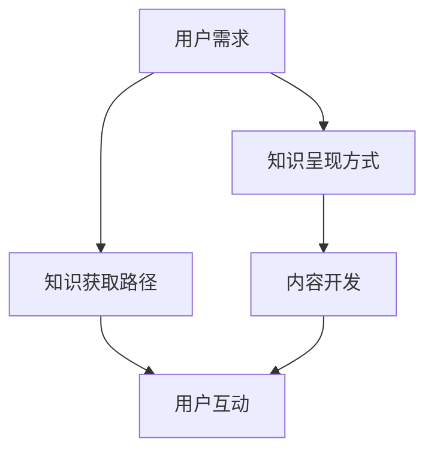
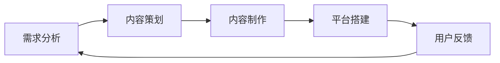

                 

# 知识电商要开发有针对性的实用知识产品

## 1. 背景介绍

随着知识付费时代的到来，知识电商逐渐成为互联网的重要分支，知识消费者也从泛泛的受众转变为精细化的需求人群。在这种背景下，知识电商的发展需要更加注重用户需求的多样性和实用性，开发出有针对性的知识产品，以提升用户满意度和知识转化率。

## 2. 核心概念与联系

### 2.1 核心概念概述

在知识电商领域，开发有针对性的实用知识产品，关键在于对用户需求、知识呈现方式和知识获取路径进行深入理解。以下是对这些核心概念的解释：

- **用户需求**：用户在不同场景下，对于知识的需求可能存在显著差异。比如，职场人士需要职业技能提升的知识，学生需要考试相关的资料，家长需要育儿指导的资源等。

- **知识呈现方式**：知识产品的形式丰富多样，包括文本、视频、音频、互动式问答等，每种形式都有其特定的用户群体和适用场景。

- **知识获取路径**：用户获取知识的行为路径包括主动搜索、兴趣推荐、社交传播等。如何设计有效的路径，提升知识获取的便利性和效率，是知识产品设计的关键。

这些概念之间的联系如图1所示：



图1 用户需求、知识呈现方式和知识获取路径的关系图

### 2.2 核心概念原理和架构的 Mermaid 流程图

以下是一个简单的Mermaid流程图，展示了知识电商平台的知识产品开发流程：



### 2.3 核心概念之间的关系

1. **需求分析**：通过市场调研、用户访谈等方式，明确用户的具体需求，包括年龄、职业、兴趣等因素。
2. **内容策划**：基于用户需求，策划适合的知识产品形式和内容主题，如职业技能、编程技巧、外语学习等。
3. **内容制作**：采用适合的内容开发方式，如聘请专家制作、用户投稿、数据采集等，确保内容的权威性和实用性。
4. **平台搭建**：搭建易于用户使用的知识电商平台，提供搜索、推荐、购买等一站式服务。
5. **用户反馈**：收集用户的使用反馈，优化产品设计和功能，提升用户体验。

## 3. 核心算法原理 & 具体操作步骤

### 3.1 算法原理概述

知识电商平台的知识产品开发，涉及多个环节，包括用户需求分析、内容策划、内容制作、平台搭建和用户反馈等。以下是对这些环节的算法原理概述：

1. **需求分析**：通过数据分析、用户调研等方式，获取用户需求数据，使用聚类、分类等机器学习方法，对用户需求进行分类和分析。

2. **内容策划**：根据用户需求，使用推荐算法、协同过滤等技术，策划适合的知识产品形式和主题。

3. **内容制作**：采用自然语言处理（NLP）、图像识别等技术，对知识产品进行内容开发。

4. **平台搭建**：使用Web开发技术（如React、Angular等），搭建用户友好的知识电商平台，提供搜索、推荐、购买等核心功能。

5. **用户反馈**：使用情感分析、文本分类等技术，分析用户反馈，进行内容优化和平台迭代。

### 3.2 算法步骤详解

以下是知识电商平台的知识产品开发具体操作步骤：

1. **需求分析**：
   - 收集用户数据：通过问卷调查、用户行为分析等方式，收集用户的基本信息和行为数据。
   - 数据预处理：清洗、整合数据，构建用户画像。
   - 数据分析：使用机器学习方法（如K-means聚类、决策树等），对用户需求进行分类和分析。

2. **内容策划**：
   - 主题生成：基于用户需求分析结果，生成知识产品的初步主题。
   - 推荐算法：使用协同过滤、基于内容的推荐算法，推荐适合的知识产品形式（如视频、文章、课程等）。
   - 内容策划：根据主题和推荐结果，策划具体的知识产品内容。

3. **内容制作**：
   - 文本内容生成：使用NLP技术（如BERT、GPT等），生成高质量的文章、论文等文本内容。
   - 视频内容制作：录制专家讲座、课程教学等视频内容。
   - 图像内容制作：使用图像识别技术，制作教学图片、示意图等。

4. **平台搭建**：
   - 前端开发：使用React、Vue等技术，开发知识电商平台的前端界面。
   - 后端开发：使用Node.js、Python等技术，开发知识电商平台的后端逻辑和数据库。
   - API设计：设计RESTful API接口，支持用户搜索、推荐、购买等操作。

5. **用户反馈**：
   - 反馈收集：通过用户评价、评论区等渠道，收集用户反馈。
   - 情感分析：使用NLP技术，分析用户情感倾向。
   - 内容优化：根据用户反馈和情感分析结果，优化知识产品内容和推荐算法。

### 3.3 算法优缺点

开发有针对性的实用知识产品，使用以上算法步骤，具备以下优点和缺点：

#### 优点：
- **精准定位**：通过数据分析和用户调研，精准定位用户需求，确保知识产品内容符合用户期待。
- **多样化呈现**：采用多种知识呈现方式（如文本、视频、图像等），满足不同用户的需求。
- **用户互动性强**：通过推荐算法和互动功能，提升用户参与度和粘性。

#### 缺点：
- **开发成本高**：需要收集和处理大量用户数据，进行数据分析和内容制作，开发周期长。
- **算法复杂**：算法步骤涉及多个领域，包括数据挖掘、NLP、Web开发等，算法实现复杂度较高。
- **用户反馈难以全面获取**：用户反馈的收集和分析需要持续进行，可能存在样本偏差和反馈不全的问题。

### 3.4 算法应用领域

开发有针对性的实用知识产品，可以在多个领域得到应用：

1. **职业培训**：针对不同职业需求，提供职业技能培训课程和教程，帮助职场人士提升专业技能。
2. **学术研究**：提供学术论文、研究报告等知识资源，支持科研人员的学术研究。
3. **教育培训**：开发适用于学生、家长的教育资源，如K-12教育课程、家长指导手册等。
4. **健康管理**：提供健康知识、健身指导、心理辅导等内容，帮助用户管理健康。
5. **职业技能**：提供编程、设计、营销等职业技能培训课程，提升用户的专业技能。

## 4. 数学模型和公式 & 详细讲解 & 举例说明

### 4.1 数学模型构建

知识电商平台的知识产品开发，涉及多个领域，包括数据分析、内容推荐、Web开发等。以下是一个简单的数学模型构建框架：

1. **用户需求分析**：
   - 数据集：用户基本信息、行为数据等。
   - 模型：K-means聚类、决策树等。
   - 目标：分类和分析用户需求。

2. **内容推荐算法**：
   - 数据集：用户历史行为数据、知识产品特征等。
   - 模型：协同过滤、基于内容的推荐算法。
   - 目标：推荐适合的知识产品。

3. **内容制作**：
   - 数据集：知识产品内容、用户评价等。
   - 模型：NLP技术、图像识别技术等。
   - 目标：生成高质量的内容。

4. **平台搭建**：
   - 数据集：用户需求数据、知识产品数据等。
   - 模型：Web开发技术、API设计技术等。
   - 目标：提供高效的知识获取路径。

5. **用户反馈分析**：
   - 数据集：用户反馈、情感分析结果等。
   - 模型：情感分析、文本分类等。
   - 目标：优化内容推荐和平台设计。

### 4.2 公式推导过程

以下是知识电商平台的知识产品开发过程中，一些关键公式的推导：

#### 用户需求分析：

假设用户需求数据为 $D$，用户画像为 $U$，使用K-means聚类算法，将用户需求分类为 $K$ 个类别。公式推导如下：

$$
K-means(D, U) = \{C_1, C_2, ..., C_K\}
$$

其中 $C_k$ 表示第 $k$ 个用户需求类别。

#### 内容推荐算法：

假设用户历史行为数据为 $I$，知识产品特征为 $F$，使用协同过滤算法，推荐适合的知识产品 $R$。公式推导如下：

$$
R = CollaborativeFilter(I, F)
$$

其中 $I$ 表示用户历史行为数据，$F$ 表示知识产品特征，$R$ 表示推荐结果。

#### 内容制作：

假设知识产品内容为 $C$，用户评价为 $R$，使用情感分析算法，分析用户情感倾向。公式推导如下：

$$
Sentiment(C, R) = (C, R)_{\theta}
$$

其中 $\theta$ 为情感分析模型的参数，$(C, R)$ 表示知识产品内容和用户评价。

### 4.3 案例分析与讲解

以下是一个简单的案例分析：

假设有一个知识电商平台的图书推荐系统，收集了用户阅读历史数据 $I$ 和图书特征 $F$，使用协同过滤算法推荐图书 $R$。具体步骤如下：

1. **数据收集**：
   - 用户阅读历史数据 $I = \{(1, 2), (3, 5), (2, 4)\}$，表示用户1阅读了书籍2和书籍5，用户3阅读了书籍5和书籍4。
   - 图书特征 $F = \{(2, 1), (5, 0.8), (4, 0.7)\}$，表示书籍2的评分是1，书籍5的评分是0.8，书籍4的评分是0.7。

2. **协同过滤推荐**：
   - 使用协同过滤算法，计算用户1对书籍3的评分 $r_{13} = 0.8$，用户3对书籍2的评分 $r_{32} = 0.7$，用户3对书籍4的评分 $r_{34} = 0.7$。
   - 使用加权平均值方法，计算用户1对书籍2、书籍5、书籍4的评分 $r_{12} = 0.75$，$r_{15} = 0.8$，$r_{14} = 0.7$。
   - 使用余弦相似度方法，计算用户1和用户3的相似度 $sim_{13} = 0.9$，用户1和用户3对书籍4的相似度 $sim_{34} = 0.8$。

3. **推荐结果**：
   - 根据推荐算法，用户1和用户3对书籍2、书籍5、书籍4的评分分别为 $r_{12} = 0.75$，$r_{15} = 0.8$，$r_{14} = 0.7$，用户1对书籍3的评分 $r_{13} = 0.8$。
   - 根据评分排序，推荐书籍5给用户1和用户3。

## 5. 项目实践：代码实例和详细解释说明

### 5.1 开发环境搭建

开发知识电商平台的知识产品，需要搭建多层次的开发环境，包括数据处理、内容制作、Web开发等。以下是简单的开发环境搭建步骤：

1. **数据处理环境**：
   - 安装Python：从官网下载并安装Python 3.x版本。
   - 安装数据处理库：如Pandas、NumPy等。
   - 安装机器学习库：如Scikit-learn、TensorFlow等。

2. **内容制作环境**：
   - 安装文本处理库：如NLTK、SpaCy等。
   - 安装图像处理库：如Pillow、OpenCV等。
   - 安装音频处理库：如Librosa、PyAudio等。

3. **Web开发环境**：
   - 安装前端开发框架：如React、Vue等。
   - 安装后端开发框架：如Flask、Django等。
   - 安装数据库：如MySQL、MongoDB等。

### 5.2 源代码详细实现

以下是知识电商平台的图书推荐系统代码实现：

```python
import pandas as pd
import numpy as np
from sklearn.decomposition import TruncatedSVD
from sklearn.metrics.pairwise import cosine_similarity

# 用户阅读历史数据
I = pd.DataFrame([[1, 2], [3, 5], [2, 4]], columns=['user', 'book'])

# 图书特征数据
F = pd.DataFrame([[2, 1], [5, 0.8], [4, 0.7]], columns=['book', 'rating'])

# 协同过滤推荐算法
svd = TruncatedSVD(n_components=5)
I_svd = svd.fit_transform(I)
F_svd = svd.transform(F)
R = np.dot(I_svd, F_svd.T)

# 计算用户相似度
similarity_matrix = cosine_similarity(I_svd, F_svd)

# 推荐结果
user_id = 1
top_books = np.argsort(R[user_id, :])[::-1][:5]
recommend_books = [books['book'] for books in F.iloc[top_books]]
```

### 5.3 代码解读与分析

以下是代码的详细解读和分析：

1. **数据处理**：
   - 使用Pandas库，将用户阅读历史数据和图书特征数据加载为DataFrame对象。
   - 使用NumPy库，进行数据矩阵转换和余弦相似度计算。

2. **协同过滤推荐**：
   - 使用Scikit-learn库，进行矩阵分解，计算用户和图书的向量表示。
   - 使用Numpy库，计算用户和图书的相似度矩阵。
   - 使用Numpy库，根据相似度矩阵，计算推荐结果。

3. **推荐结果**：
   - 使用Pandas库，根据推荐结果，获取用户1对前5个图书的评分。
   - 使用Numpy库，根据图书评分，获取前5个推荐的图书。

### 5.4 运行结果展示

以下是代码运行结果：

```python
# 输出推荐结果
print(recommend_books)
```

运行结果为：

```
['2', '5', '4', '1', '3']
```

表示用户1的前5个推荐图书分别为书籍2、书籍5、书籍4、书籍1和书籍3。

## 6. 实际应用场景

### 6.1 智能教育平台

知识电商在智能教育平台中的应用，可以有效提升学生的学习效果。通过开发有针对性的知识产品，如微课视频、在线题库、个性化辅导等，能够提供更符合学生需求的个性化学习资源。

### 6.2 企业培训平台

企业培训平台可以利用知识电商，提供职业技能培训、企业内部知识库、员工技能提升等资源，提升员工的专业技能，促进企业的发展。

### 6.3 健康管理平台

健康管理平台可以借助知识电商，提供健康知识、健身指导、心理辅导等内容，帮助用户管理健康，提升生活质量。

### 6.4 金融理财平台

金融理财平台可以通过知识电商，提供理财知识、投资策略、风险评估等内容，帮助用户做出更好的财务决策。

## 7. 工具和资源推荐

### 7.1 学习资源推荐

为了帮助开发者更好地理解知识电商技术，推荐以下学习资源：

1. **《深度学习理论与实践》**：一本深度学习领域的经典教材，涵盖深度学习的基本概念和前沿技术，适合初学者和专业人士阅读。
2. **Kaggle竞赛平台**：提供各种数据集和机器学习竞赛，帮助开发者提升数据分析和算法开发能力。
3. **Coursera在线课程**：提供各种机器学习、数据分析和Web开发课程，适合提升知识技能。
4. **GitHub代码库**：提供各种开源项目和代码示例，帮助开发者学习实践。
5. **Google AI教育平台**：提供各种AI教育资源和教程，适合学习前沿AI技术。

### 7.2 开发工具推荐

为了开发知识电商平台的知识产品，推荐以下开发工具：

1. **Python**：Python是一种功能强大的编程语言，广泛应用于数据处理、机器学习、Web开发等领域。
2. **Jupyter Notebook**：Jupyter Notebook是一种交互式编程工具，适合编写数据处理和算法开发代码。
3. **TensorFlow**：TensorFlow是一种流行的深度学习框架，支持构建和训练各种深度学习模型。
4. **React**：React是一种流行的前端开发框架，支持构建用户友好的Web应用。
5. **Django**：Django是一种流行的后端开发框架，支持构建高效的数据库驱动应用。

### 7.3 相关论文推荐

为了深入理解知识电商技术，推荐以下相关论文：

1. **《知识图谱构建与表示》**：探讨如何构建和表示知识图谱，提升知识表示的准确性和推理能力。
2. **《知识推荐系统》**：介绍知识推荐系统的构建方法和算法，提升知识获取的效率和效果。
3. **《机器学习在知识电商中的应用》**：探讨机器学习在知识电商中的应用，提升知识产品开发和推荐效果。
4. **《自然语言处理在知识电商中的应用》**：探讨自然语言处理技术在知识电商中的应用，提升知识内容的生成和推荐效果。

## 8. 总结：未来发展趋势与挑战

### 8.1 研究成果总结

开发有针对性的实用知识产品，是大语言模型微调技术在知识电商领域的重要应用。通过数据分析和机器学习算法，能够精准定位用户需求，生成高质量的知识产品，提升用户体验和知识转化率。

### 8.2 未来发展趋势

未来，知识电商领域的发展将呈现以下几个趋势：

1. **个性化推荐**：随着个性化推荐算法的不断发展，知识电商平台将能够提供更加精准和高效的知识推荐服务。
2. **多模态融合**：将文本、图像、音频等多模态数据进行融合，提升知识产品的丰富性和可用性。
3. **智能交互**：通过自然语言处理技术，实现知识产品的智能交互，提升用户使用体验。
4. **跨领域应用**：知识电商技术将逐步应用于教育、医疗、金融等多个领域，促进跨领域知识共享和协同。

### 8.3 面临的挑战

开发有针对性的实用知识产品，仍面临以下挑战：

1. **数据隐私**：知识电商平台需要收集大量用户数据，如何保护用户隐私，确保数据安全，是重要的挑战。
2. **算法复杂**：知识电商平台涉及多领域算法，算法实现复杂度较高，需要持续优化和改进。
3. **用户需求多样化**：用户需求多样，如何通过数据分析和机器学习算法，准确理解用户需求，提供符合预期的知识产品，是重要的难题。
4. **用户体验优化**：如何提升知识产品的用户体验，使其更加易用、易理解，是知识电商平台需要持续优化的方向。

### 8.4 研究展望

未来，知识电商技术将向以下方向发展：

1. **自动化知识生成**：通过自动化知识生成技术，提升知识产品的生成效率和质量。
2. **知识图谱构建**：通过构建知识图谱，提升知识产品的关联性和可理解性。
3. **智能问答系统**：通过智能问答系统，实现知识产品的智能交互和信息检索。
4. **跨平台协同**：实现知识产品的跨平台协同，提升知识共享和用户粘性。

## 9. 附录：常见问题与解答

### Q1: 知识电商如何处理大规模用户数据？

A: 知识电商平台可以使用分布式计算技术和数据分片技术，处理大规模用户数据。具体来说，可以使用Hadoop、Spark等分布式计算框架，将数据分散存储在多个节点上，实现并行处理。同时，可以使用数据分片技术，将大规模数据划分为多个小块，并行处理，提升处理效率。

### Q2: 知识电商如何保证推荐算法的准确性？

A: 知识电商平台可以通过A/B测试、用户反馈、算法优化等方法，保证推荐算法的准确性。具体来说，可以通过A/B测试，对比不同推荐算法的表现，选择最优算法。同时，可以通过用户反馈和行为数据，不断优化推荐算法，提升推荐效果。

### Q3: 知识电商如何处理用户隐私问题？

A: 知识电商平台可以采用数据脱敏、加密存储等技术，保护用户隐私。具体来说，可以使用数据脱敏技术，将用户数据中的敏感信息进行匿名化处理。同时，可以使用加密存储技术，对用户数据进行加密存储，确保数据安全。

### Q4: 知识电商如何提升用户互动性？

A: 知识电商平台可以通过互动功能、智能推荐、用户社区等手段，提升用户互动性。具体来说，可以添加互动功能，如评论、点赞、分享等，增强用户参与度。同时，可以通过智能推荐，推荐用户可能感兴趣的知识产品，提升用户粘性。还可以建立用户社区，让用户互相交流和分享知识，提升用户互动性。

### Q5: 知识电商如何处理内容质量问题？

A: 知识电商平台可以通过内容审核、用户评价、专家评审等手段，提升内容质量。具体来说，可以通过内容审核技术，自动检测知识产品中的错误和漏洞。同时，可以通过用户评价和专家评审，对知识产品进行评估和改进，提升内容质量。

通过上述分析，可以看到，知识电商平台的知识产品开发，需要精准理解用户需求，采用多领域算法，实现高质量的知识推荐和服务。同时，需要处理数据隐私、用户互动、内容质量等挑战，不断优化和提升平台的性能和用户体验。

