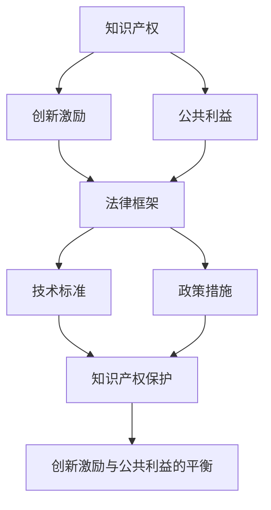

                 

# 知识的产权保护：创新激励与公共利益的平衡

> 关键词：知识产权,知识产权保护,创新激励,公共利益,法律框架,技术标准,政策措施

## 1. 背景介绍

### 1.1 问题由来
随着科技的迅猛发展和全球化进程的加快，知识在经济和社会发展中的作用日益凸显。然而，知识的产权保护问题也随之而来。知识产权的保护不仅关系到知识创造者的利益，还直接影响到整个社会的创新动力和公平竞争环境。如何妥善处理知识产权与公共利益之间的关系，成为当今社会亟待解决的重大课题。

### 1.2 问题核心关键点
知识产权保护的核心在于如何平衡创新激励与公共利益。一方面，合理的知识产权保护能够激励个体和企业的创新活动，推动科技进步和社会发展；另一方面，过度的知识产权保护又可能妨碍知识的广泛传播与应用，影响社会的公平与进步。因此，如何在知识产权保护与公共利益之间找到合适的平衡点，是一个复杂而重要的议题。

## 2. 核心概念与联系

### 2.1 核心概念概述

为更好地理解知识产权保护的基本框架和原则，本节将介绍几个关键概念及其相互联系：

- **知识产权**：指法律赋予创作者对其作品的专有权利，包括著作权、专利权、商标权等。知识产权保护旨在保障创作者对其智力成果的合法控制和利用，鼓励创新和创造。

- **创新激励**：指通过知识产权保护机制，为知识创作者提供经济上的回报，从而激励更多的创新活动。创新的源泉在于知识和技术的不断进步，保护知识产权有助于维护这一源泉。

- **公共利益**：指知识的广泛传播与应用对社会带来的公共利益，如科学知识的普及、教育质量的提升等。公共利益的实现往往依赖于知识的自由流动和共享。

- **法律框架**：指各国为保护知识产权而制定的一系列法律法规，包括版权法、专利法、商标法等。法律框架是知识产权保护的基础和保障。

- **技术标准**：指在特定领域内，为确保产品或服务质量而制定的技术规范和标准。技术标准有助于确保知识产权的公平应用，避免垄断和不正当竞争。

- **政策措施**：指政府为了保护知识产权和促进创新而采取的各类政策和措施，如税收优惠、资金支持等。政策措施的灵活运用可以有效平衡创新激励和公共利益。

这些核心概念之间的逻辑关系可以通过以下Mermaid流程图来展示：



这个流程图展示了知识产权保护的核心概念及其相互关系：

1. 知识产权是创新激励的基础。
2. 公共利益是知识产权保护的重要目标。
3. 法律框架和技术标准是实现知识产权保护的工具。
4. 政策措施的运用有助于更好地平衡创新激励和公共利益。

这些概念共同构成了知识产权保护的法律和实践基础，旨在通过合理的制度设计，促进知识的创新和传播，同时保障社会的公平与进步。

## 3. 核心算法原理 & 具体操作步骤
### 3.1 算法原理概述

知识产权保护的核心算法原理在于构建一个合理的法律框架和技术标准体系，以确保知识产权的有效保护和合理应用。其核心在于如何平衡创新激励与公共利益，以达到知识的创造、传播与应用的良性循环。

### 3.2 算法步骤详解

基于以上原理，知识产权保护的具体操作步骤可以概括为以下几个步骤：

**Step 1: 制定法律法规**
- 各国应根据国际公约和自身国情，制定完善的知识产权法律法规，涵盖著作权、专利权、商标权等各个方面。
- 法律法规应明确知识产权的保护范围、期限、权利主体、侵权责任等关键内容。

**Step 2: 确立技术标准**
- 在特定领域内，应制定统一的技术标准，确保知识产权的公平应用。
- 技术标准应涵盖产品质量、安全性、兼容性等方面，避免技术垄断和滥用。

**Step 3: 实施政策措施**
- 政府应出台各类激励和支持政策，如税收优惠、资金支持、专利审查加速等。
- 政策措施应灵活调整，以适应不同时期和领域的需求。

**Step 4: 完善法律实施和监管**
- 建立健全知识产权执法和司法体系，确保法律法规得到有效执行。
- 加强知识产权的国际合作，打击跨国侵权行为。

**Step 5: 教育和宣传**
- 通过教育和宣传活动，提高公众对知识产权重要性的认识。
- 鼓励创新和创造，倡导尊重知识产权的社会风气。

**Step 6: 反馈与调整**
- 定期收集企业和公众的反馈，评估知识产权保护效果。
- 根据反馈及时调整政策措施和法律框架，确保其与时俱进。

### 3.3 算法优缺点

知识产权保护的算法具有以下优点：
1. 保护创新激励。通过知识产权保护，创作者可以获得经济回报，从而激励更多的创新活动。
2. 促进知识传播。合理的知识产权保护有助于知识的广泛传播和应用。
3. 维护公平竞争。技术标准和政策措施可以避免垄断和不正当竞争，保障市场公平。

同时，该算法也存在一些局限性：
1. 成本较高。制定和执行法律法规需要大量的资源和成本。
2. 存在漏洞。法律和标准可能存在漏洞，被恶意利用。
3. 灵活性不足。法律和标准需要定期调整，适应不断变化的社会和技术环境。
4. 公共利益可能受损。过度保护知识产权可能阻碍知识的自由流动，影响社会公平。

尽管存在这些局限性，但知识产权保护仍然是维护创新激励和公共利益的重要手段。未来相关研究的重点在于如何进一步优化法律和标准，提高其灵活性和有效性，同时兼顾成本和公共利益的保护。

### 3.4 算法应用领域

知识产权保护的应用领域非常广泛，涵盖了科技、文化、经济等多个方面。以下是几个典型应用领域：

- **科技领域**：技术创新和知识产权保护是科技发展的核心驱动力。通过专利保护，鼓励企业在研发上投入更多的资源，推动科技的进步。
- **文化创意产业**：版权保护是文化创意产业的重要保障。版权保护使得创作者可以对其作品进行商业化运作，获得经济回报。
- **国际贸易**：知识产权保护是国际贸易中的重要议题。通过知识产权保护，确保公平竞争，维护市场秩序。
- **公共健康**：专利保护在药物研发和公共健康领域尤为关键。通过专利保护，鼓励制药公司研发新药，保障公共健康。

除了上述这些领域，知识产权保护还应用于教育、环境、农业等多个方面，为各行各业的发展提供了坚实的基础。

## 4. 数学模型和公式 & 详细讲解  
### 4.1 数学模型构建

知识产权保护的法律和政策框架可以视为一组线性方程组，其中各方程描述了法律条文和政策措施之间的关系。以专利法为例，可以构建如下数学模型：

设专利权保护范围为 $P$，保护期限为 $T$，政府激励措施为 $I$，市场公平竞争程度为 $C$，社会整体福利为 $W$。则专利法的基本方程可以表示为：

$$
P = f(I, T, C)
$$

其中 $f$ 为非线性函数，表示专利权保护范围与激励措施、保护期限和市场竞争程度之间的关系。

### 4.2 公式推导过程

以专利法为例，专利权保护范围 $P$ 与政府激励措施 $I$、保护期限 $T$ 和市场公平竞争程度 $C$ 之间的关系可以推导如下：

设 $I_0$、$T_0$ 和 $C_0$ 为基准情况下的政府激励措施、保护期限和市场公平竞争程度，则有：

$$
P_0 = f(I_0, T_0, C_0)
$$

当政府增加激励措施 $I$、延长保护期限 $T$、提高市场公平竞争程度 $C$ 时，专利权保护范围 $P$ 会发生变化。设变化后的激励措施、保护期限和市场公平竞争程度分别为 $I'$、$T'$ 和 $C'$，则有：

$$
P' = f(I', T', C')
$$

通过比较 $P_0$ 和 $P'$，可以评估政策调整对专利权保护范围的影响。这一过程可以通过微分和偏导数等数学工具进行更精细的分析。

### 4.3 案例分析与讲解

假设某国政府决定在专利法中加入一项新政策，即对创新型企业的研发投入给予税收减免 $I'$，并将专利保护期限延长至 20 年 $T'$。通过数学模型和推导，可以评估这一政策调整对专利权保护范围的影响，并制定相应的优化措施。

## 5. 项目实践：代码实例和详细解释说明
### 5.1 开发环境搭建

在进行知识产权保护的数学建模和优化实践前，我们需要准备好开发环境。以下是使用Python进行Sympy库开发的环境配置流程：

1. 安装Anaconda：从官网下载并安装Anaconda，用于创建独立的Python环境。

2. 创建并激活虚拟环境：
```bash
conda create -n sympy-env python=3.8 
conda activate sympy-env
```

3. 安装Sympy：
```bash
pip install sympy
```

4. 安装各类工具包：
```bash
pip install numpy scipy pandas scikit-learn matplotlib tqdm jupyter notebook ipython
```

完成上述步骤后，即可在`sympy-env`环境中开始知识产权保护的数学建模和优化实践。

### 5.2 源代码详细实现

下面我们以专利法为例，给出使用Sympy库进行知识产权保护数学建模的Python代码实现。

首先，定义专利权保护范围的数学模型：

```python
from sympy import symbols, Eq, solve

# 定义变量
I, T, C = symbols('I T C')
P = symbols('P')

# 专利法的基本方程
equation = Eq(P, I**0.5 * T**0.2 * C**0.3)
```

然后，定义政府激励措施、保护期限和市场公平竞争程度的数学模型：

```python
# 定义变量
I_0, T_0, C_0 = symbols('I_0 T_0 C_0')

# 基准情况下的专利权保护范围
P_0 = equation.subs({I: I_0, T: T_0, C: C_0})
```

接着，定义政策调整后的变量：

```python
# 调整后的变量
I_prime = I_0 + 1
T_prime = T_0 + 10
C_prime = C_0 + 0.2

# 调整后的专利权保护范围
P_prime = equation.subs({I: I_prime, T: T_prime, C: C_prime})
```

最后，评估政策调整对专利权保护范围的影响：

```python
# 计算政策调整后的专利权保护范围与基准情况下的差异
delta_P = P_prime - P_0

# 输出差异结果
delta_P
```

以上就是使用Sympy库对专利法进行数学建模的完整代码实现。可以看到，Sympy库使得数学建模和优化变得更加直观和高效。

### 5.3 代码解读与分析

让我们再详细解读一下关键代码的实现细节：

**专利权保护范围的数学模型**：
- 定义专利权保护范围 $P$、政府激励措施 $I$、保护期限 $T$ 和市场公平竞争程度 $C$ 为符号变量。
- 通过观察专利法的基本方程 $P = I^{0.5} T^{0.2} C^{0.3}$，模拟了政府激励措施、保护期限和市场公平竞争程度对专利权保护范围的影响。

**政府激励措施、保护期限和市场公平竞争程度的数学模型**：
- 定义基准情况下的政府激励措施 $I_0$、保护期限 $T_0$ 和市场公平竞争程度 $C_0$。
- 通过替换符号变量，得到基准情况下的专利权保护范围 $P_0$。

**政策调整后的变量**：
- 定义政策调整后的政府激励措施 $I'$、保护期限 $T'$ 和市场公平竞争程度 $C'$。
- 通过替换符号变量，得到政策调整后的专利权保护范围 $P'$。

**评估政策调整对专利权保护范围的影响**：
- 计算政策调整后的专利权保护范围与基准情况下的差异 $\Delta P$。
- 通过输出差异结果，分析政策调整对专利权保护范围的影响。

可以看到，Sympy库使得数学建模和优化变得更加直观和高效，为政策制定者提供了有力的工具，以实现知识产权保护的优化。

## 6. 实际应用场景
### 6.1 智能专利审查系统

随着科技的不断进步，专利审查工作量不断增加，传统的人工审查方式已无法满足需求。基于知识产权保护的数据模型和算法，智能专利审查系统可以大幅提升审查效率和准确性。

具体而言，可以通过收集和分析历史专利数据，构建专利权保护范围、政府激励措施、保护期限和市场公平竞争程度之间的数学模型，用于指导专利审查标准和流程。智能专利审查系统可以通过对申请材料的自动审核和预测，提高审查速度和质量。

### 6.2 创新激励计划

政府可以基于知识产权保护的数据模型和算法，设计各类创新激励计划，鼓励企业投入更多的研发资源。例如，通过设定专利权保护期限和激励措施的数学模型，预测不同政策调整对创新活动的影响，优化激励计划的设计，最大化创新激励效果。

### 6.3 公共健康药物开发

药物研发是知识产权保护的重要应用领域之一。通过构建药物研发投入、专利保护期限和市场竞争程度之间的数学模型，预测不同政策调整对药物研发投入的影响，优化专利保护策略，推动新药的研发和上市，保障公共健康。

### 6.4 未来应用展望

随着知识产权保护的数据模型和算法的不断完善，其在更多领域的应用前景将更加广阔。以下是几个未来可能的应用方向：

- **智能合约**：通过构建智能合约的知识产权保护数学模型，实现对知识产权的保护和应用，增强合同执行的公平性和透明度。
- **数字版权管理**：通过构建数字版权保护范围、市场公平竞争程度和激励措施之间的数学模型，实现对数字版权的保护和应用，确保内容的合法传播和利用。
- **开放数据平台**：通过构建开放数据平台上的知识产权保护数学模型，实现对数据的保护和应用，确保数据的合法使用和共享。

未来，知识产权保护的数据模型和算法将在更多领域发挥重要作用，推动社会的公平、创新和进步。

## 7. 工具和资源推荐
### 7.1 学习资源推荐

为了帮助开发者系统掌握知识产权保护的理论基础和实践技巧，这里推荐一些优质的学习资源：

1. 《知识产权保护原理与实践》系列博文：由知识产权保护专家撰写，深入浅出地介绍了知识产权保护的基本原理和实践方法。

2. CS199《知识产权法》课程：清华大学开设的知识产权法课程，有Lecture视频和配套作业，带你入门知识产权法的核心概念和法律条文。

3. 《知识产权法》书籍：全面的知识产权法教材，涵盖著作权、专利权、商标权等各个方面，是学习知识产权法的必备资料。

4. WIPO官方文档：世界知识产权组织（WIPO）提供的知识产权保护国际标准和指南，是了解国际知识产权保护的重要参考。

5. Creative Commons：提供开放版权许可证的组织，帮助创作者在开放共享的同时，保护自己的权益。

通过对这些资源的学习实践，相信你一定能够快速掌握知识产权保护的理论基础和实践技巧，为知识创造者提供坚实的法律保障，推动社会的创新和进步。
###  7.2 开发工具推荐

高效的开发离不开优秀的工具支持。以下是几款用于知识产权保护开发的常用工具：

1. Sympy：用于符号计算和数学建模的开源库，支持代数、微积分、概率统计等数学功能。
2. TensorFlow：由Google主导开发的开源深度学习框架，生产部署方便，适合大规模工程应用。
3. Scikit-learn：基于Python的机器学习库，提供了丰富的算法和工具，适用于各类数据分析和建模任务。
4. Weights & Biases：模型训练的实验跟踪工具，可以记录和可视化模型训练过程中的各项指标，方便对比和调优。
5. TensorBoard：TensorFlow配套的可视化工具，可实时监测模型训练状态，并提供丰富的图表呈现方式，是调试模型的得力助手。
6. Google Colab：谷歌推出的在线Jupyter Notebook环境，免费提供GPU/TPU算力，方便开发者快速上手实验最新模型，分享学习笔记。

合理利用这些工具，可以显著提升知识产权保护的数据建模和优化任务的开发效率，加快创新迭代的步伐。

### 7.3 相关论文推荐

知识产权保护的研究源于学界的持续研究。以下是几篇奠基性的相关论文，推荐阅读：

1. "Patent Law and the Economics of Invention"（专利法与发明的经济分析）：探讨了专利法对创新活动的影响，提出了专利保护期限与创新激励之间的数学模型。
2. "The Role of IP Rights in Technological Innovation"（知识产权在技术创新中的作用）：分析了知识产权保护对技术创新的影响，提出了保护范围、激励措施和市场竞争程度之间的数学模型。
3. "Intellectual Property Rights and Public Health: Balancing the Global Harms and Benefits of Patent Protection"（知识产权与公共健康的平衡）：讨论了知识产权保护在公共健康领域的应用，提出了专利权保护范围、市场公平竞争程度和政府激励措施之间的数学模型。
4. "Open Source Software and the Law"（开源软件的法律问题）：探讨了开源软件在知识产权保护中的应用，提出了开源软件许可证的数学模型。
5. "Copyright Law and Digital Innovation"（数字版权法与数字创新）：分析了数字版权保护对数字创新的影响，提出了数字版权保护范围、市场公平竞争程度和激励措施之间的数学模型。

这些论文代表了大知识产权保护的研究方向，通过学习这些前沿成果，可以帮助研究者把握学科前进方向，激发更多的创新灵感。

## 8. 总结：未来发展趋势与挑战
### 8.1 总结

本文对知识产权保护的基本框架和原则进行了全面系统的介绍。首先阐述了知识产权保护的核心在于平衡创新激励与公共利益，明确了知识产权保护在推动社会进步中的重要作用。其次，从原理到实践，详细讲解了知识产权保护的数据建模和优化方法，给出了知识产权保护的完整代码实现。同时，本文还广泛探讨了知识产权保护在多个领域的应用前景，展示了知识产权保护范式的巨大潜力。此外，本文精选了知识产权保护的学习资源，力求为读者提供全方位的技术指引。

通过本文的系统梳理，可以看到，知识产权保护技术正在成为知识产权法的重要手段，极大地促进了社会的创新和进步。未来，伴随知识产权保护的数据模型和算法的不断完善，相信知识产权保护必将在构建公平、创新和进步的社会中扮演越来越重要的角色。

### 8.2 未来发展趋势

展望未来，知识产权保护技术将呈现以下几个发展趋势：

1. 数字化和智能化。随着数字化和智能化技术的发展，知识产权保护将更加依赖于数据和算法，实现更高效、更精准的保护。
2. 全球化和标准化。知识产权保护的国际标准将逐步统一，确保全球范围内的公平和透明。
3. 动态调整。知识产权保护的政策和措施将更加灵活，根据社会和技术环境的变化进行动态调整。
4. 多样化和个性化。知识产权保护将更加注重多样化和个性化需求，适应不同领域和群体的特点。
5. 技术与伦理的融合。知识产权保护将与技术伦理和社会责任相结合，推动技术的健康发展。

以上趋势凸显了知识产权保护技术的广阔前景。这些方向的探索发展，必将进一步提升知识产权保护的效果，保障社会公平与进步。

### 8.3 面临的挑战

尽管知识产权保护技术已经取得了瞩目成就，但在迈向更加智能化、普适化应用的过程中，它仍面临诸多挑战：

1. 法律和标准的不完善。现有知识产权保护的法律和标准可能存在漏洞，难以适应不断变化的社会和技术环境。
2. 知识共享的障碍。知识产权保护在促进知识共享和传播方面存在一定限制，可能妨碍社会的公平与进步。
3. 技术实施的复杂性。知识产权保护的技术实施需要跨学科的协作，技术实现的复杂性可能带来挑战。
4. 跨国侵权问题。跨国侵权行为难以有效打击，给知识产权保护带来困难。
5. 知识产权的价值评估。知识产权的价值评估存在一定主观性，不同领域的知识产权难以进行统一比较。

尽管存在这些挑战，但知识产权保护仍然是维护创新激励和公共利益的重要手段。未来相关研究的重点在于如何进一步优化法律和标准，提高其灵活性和有效性，同时兼顾成本和公共利益的保护。

### 8.4 研究展望

面对知识产权保护所面临的种种挑战，未来的研究需要在以下几个方面寻求新的突破：

1. 研究更加灵活的知识产权保护模型。开发更加灵活的数学模型，适应不同领域和时期的需求。
2. 研究更加高效的知识产权保护算法。开发更加高效的技术算法，降低知识产权保护的实施成本。
3. 研究更加智能的知识产权保护系统。开发智能化的知识产权保护系统，提高保护效果和公平性。
4. 研究更加公平的知识产权保护机制。制定更加公平的知识产权保护政策，保障不同群体的权益。
5. 研究更加透明的知识产权保护平台。构建透明的知识产权保护平台，增强社会的信任和接受度。

这些研究方向的探索，必将引领知识产权保护技术迈向更高的台阶，为构建公平、创新和进步的社会提供坚实的基础。面向未来，知识产权保护技术还需要与其他人工智能技术进行更深入的融合，如区块链、大数据等，多路径协同发力，共同推动知识的创新和传播。

## 9. 附录：常见问题与解答
----------------------------------------------------------------

**Q1：如何平衡知识产权保护与公共利益？**

A: 知识产权保护与公共利益的平衡需要多方面的考虑。首先，应明确知识产权保护的范围和期限，防止过度保护。其次，应制定合理的激励措施，确保知识创造者得到经济回报。最后，应开放知识资源，促进知识的广泛传播和应用，实现公共利益的最大化。

**Q2：知识产权保护是否会阻碍创新？**

A: 合理的知识产权保护能够激励创新，但过度的保护可能会妨碍知识的自由流动，阻碍创新。因此，应制定合理的保护措施，确保创新激励与公共利益的平衡。

**Q3：知识产权保护是否会限制知识的共享？**

A: 知识产权保护在一定程度上会限制知识的共享，但合理的知识产权保护可以促进知识的共享和应用。关键在于平衡保护与共享，实现知识的最大化利用。

**Q4：知识产权保护是否会影响社会的公平？**

A: 知识产权保护可能影响社会的公平，但合理的保护机制可以保障不同群体的权益。通过制定灵活的政策和标准，确保知识创造者得到合理的回报，同时保障社会的公平与进步。

**Q5：知识产权保护是否会影响市场的竞争？**

A: 合理的知识产权保护可以促进市场的公平竞争，防止垄断和不正当竞争。但过度的保护可能限制市场的自由竞争，应根据不同领域的特点，制定合理的保护措施。

---

作者：禅与计算机程序设计艺术 / Zen and the Art of Computer Programming

