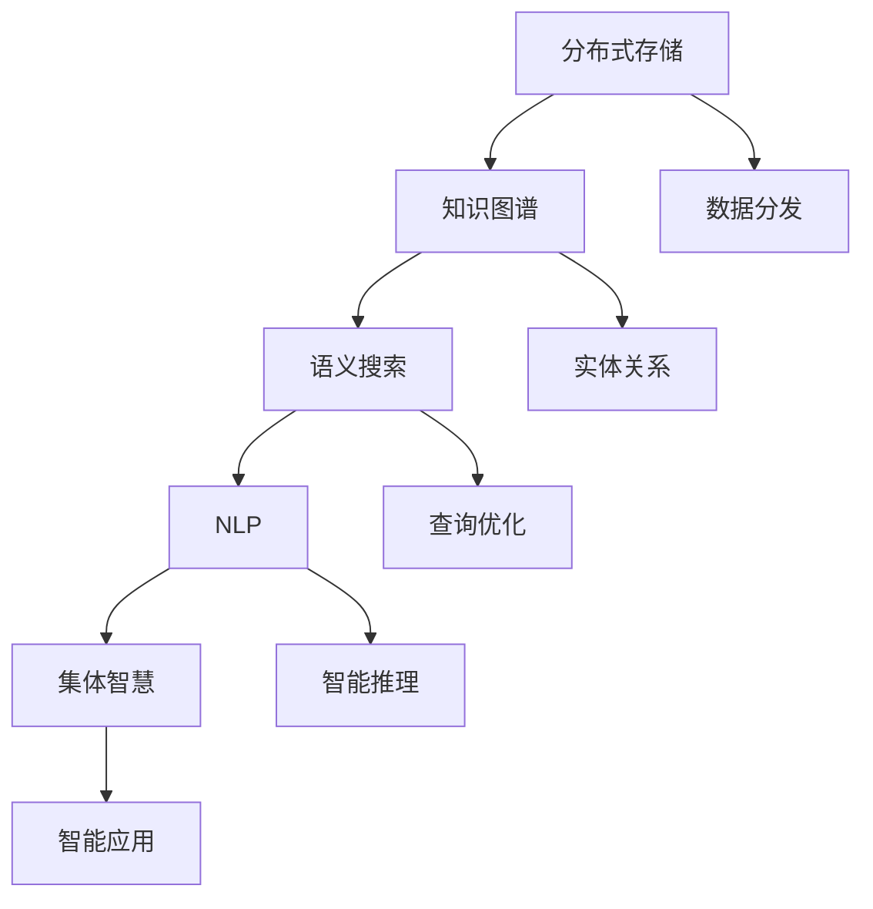

                 

# 知识的分布式记忆：集体智慧的形成机制

> 关键词：分布式存储, 知识图谱, 集体智慧, 语义搜索, 自然语言处理(NLP), 深度学习

## 1. 背景介绍

### 1.1 问题由来
随着信息爆炸和技术演进，人类知识量呈指数级增长。面对海量知识的积累与存储，传统的集中式数据库系统已难以胜任。如何有效地存储、管理和利用这些知识，成为了信息时代的一大挑战。而分布式存储和知识图谱等技术，为知识的管理和利用提供了新的解决方案。

近年来，分布式存储技术在互联网企业中得到了广泛应用。如Hadoop、Spark等大数据框架，通过分布式计算集群存储和处理海量数据，极大地提高了数据处理的效率和可靠性。但这些技术更多关注于数据本身的存储和计算，缺乏对知识语义信息的直接建模和利用。

与此同时，知识图谱(Knowledge Graph)技术应运而生。知识图谱是一种结构化的语义知识库，通过构建实体与关系之间的关联，使得计算机能够理解人类语言中的概念和事实。谷歌的知识图谱(KG)、Wikipedia的数据库，以及Open Graph等项目，为知识图谱的应用提供了丰富的数据和示例。

然而，如何充分利用知识图谱中的知识，提升自然语言处理(NLP)和人工智能(AI)系统的智能水平，仍是一个未解的问题。将知识图谱与深度学习结合，开发一种能够从大规模知识数据中学习知识分布式记忆机制的模型，成为了当前的研究热点。

### 1.2 问题核心关键点
本文聚焦于知识的分布式记忆机制，通过深入研究知识图谱、语义搜索和分布式存储技术，构建一种基于深度学习的知识图谱模型，使得模型能够从知识图谱中学习分布式记忆，并在自然语言处理中加以应用，实现集体智慧的整合与利用。

本文将从核心概念、算法原理、数学模型、项目实践、应用场景、工具和资源推荐、总结与展望等方面，全面系统地探讨知识的分布式记忆机制及其在NLP和AI系统中的应用。

## 2. 核心概念与联系

### 2.1 核心概念概述

为更好地理解知识分布式记忆机制，本节将介绍几个关键概念：

- 分布式存储(Distributed Storage)：指通过分布式文件系统或数据库集群，将数据分散存储在多台计算机中，以提高数据处理的效率和可靠性。
- 知识图谱(Knowledge Graph)：通过构建实体-关系图，表示知识库中的概念和事实关系，帮助计算机理解自然语言中的语义信息。
- 集体智慧(Collective Wisdom)：指通过集合并关联多源知识数据，生成新的知识表示，提升人工智能系统的智能水平。
- 语义搜索(Semantic Search)：通过理解语义信息，实现对知识库中实体和关系的精确匹配和检索。
- 自然语言处理(NLP)：涉及对自然语言的理解、生成、分析和应用，旨在使计算机能够像人一样理解语言。

这些核心概念之间相互关联，构成了知识分布式记忆机制的基础。

### 2.2 核心概念原理和架构的 Mermaid 流程图



这个流程图展示了知识分布式记忆机制的主要环节：

1. 分布式存储将数据分发存储在多个节点中，提供数据访问的高并发和低延迟。
2. 知识图谱构建实体-关系图，表示知识库中的概念和事实。
3. 语义搜索通过理解语义信息，实现对知识库中实体和关系的精确匹配和检索。
4. NLP系统利用知识图谱和语义信息，实现对自然语言的理解和生成。
5. 集体智慧通过合并关联多源知识数据，生成新的知识表示，提升系统的智能水平。
6. 智能应用将集体智慧应用于实际问题，实现知识的高效利用和价值创造。

## 3. 核心算法原理 & 具体操作步骤
### 3.1 算法原理概述

知识分布式记忆机制的算法原理，主要基于深度学习中的分布式表示学习技术。其核心思想是，通过构建知识图谱中的实体-关系图，使得计算机能够理解并记忆分布式知识。具体步骤如下：

1. 数据预处理：将大规模知识图谱中的数据进行预处理，构建知识图谱中的实体-关系图。
2. 知识表示学习：通过深度学习模型，学习知识图谱中的实体和关系表示。
3. 分布式表示学习：构建知识图谱中的分布式表示，使得计算机能够理解并记忆知识分布式存在。
4. 语义检索：通过语义搜索技术，实现对知识库中实体和关系的精确匹配和检索。
5. 智能推理：利用知识图谱中的分布式表示，进行智能推理和知识生成。
6. 集体智慧：通过合并关联多源知识数据，生成新的知识表示，提升系统的智能水平。

### 3.2 算法步骤详解

#### 3.2.1 数据预处理
数据预处理是知识分布式记忆机制的第一步。具体步骤如下：

1. 数据收集：从多个知识源中收集相关数据，构建知识图谱。
2. 实体抽取：使用自然语言处理技术，从文本数据中抽取实体。
3. 关系抽取：使用自然语言处理技术，从文本数据中抽取实体间的关系。
4. 图结构构建：将抽取的实体和关系，构建知识图谱中的实体-关系图。

#### 3.2.2 知识表示学习
知识表示学习是知识分布式记忆机制的核心。具体步骤如下：

1. 选择模型：选择合适的深度学习模型，如TransE、RotatE、Reason等。
2. 训练模型：在知识图谱上训练模型，学习实体和关系的表示。
3. 评估模型：使用评价指标，如HITS@k、MRR等，评估模型效果。

#### 3.2.3 分布式表示学习
分布式表示学习是知识分布式记忆机制的关键。具体步骤如下：

1. 设计分布式模型：设计一种分布式表示学习模型，如DTransE、DRotatE等。
2. 训练分布式模型：在知识图谱上训练分布式模型，学习实体和关系的分布式表示。
3. 评估分布式模型：使用评价指标，如BCE、MSE等，评估模型效果。

#### 3.2.4 语义检索
语义检索是知识分布式记忆机制的重要环节。具体步骤如下：

1. 构建索引：使用倒排索引等技术，构建知识图谱中的索引。
2. 查询优化：使用查询优化技术，提高检索效率。
3. 检索返回：根据用户查询，返回匹配的实体和关系。

#### 3.2.5 智能推理
智能推理是知识分布式记忆机制的最终目标。具体步骤如下：

1. 选择推理算法：选择合适的推理算法，如逻辑推理、图神经网络等。
2. 构建推理模型：构建基于分布式表示的推理模型。
3. 推理计算：根据用户查询，进行推理计算，生成新的知识表示。

#### 3.2.6 集体智慧
集体智慧是将知识分布式记忆机制应用于实际问题的关键。具体步骤如下：

1. 知识合并：将多个知识图谱中的知识进行合并和关联。
2. 生成新知识：基于合并后的知识，生成新的知识表示。
3. 应用新知识：将新知识应用于实际问题，实现智能应用。

### 3.3 算法优缺点

知识分布式记忆机制的算法有以下优点：

1. 高效性：通过分布式存储和知识图谱，实现对大规模知识的有效存储和检索。
2. 准确性：通过深度学习模型，学习知识图谱中的实体和关系表示，提高推理的准确性。
3. 可扩展性：分布式存储和知识图谱的可扩展性，使得系统能够处理更大规模的知识数据。
4. 通用性：基于深度学习的知识表示学习，能够适应不同领域的知识图谱，具有广泛的应用前景。

同时，该算法也存在以下局限性：

1. 数据质量要求高：知识图谱的质量直接影响模型的效果，需要高质量的数据源。
2. 计算资源需求高：分布式存储和深度学习模型需要高性能的计算资源。
3. 复杂性高：知识表示学习和分布式表示学习的复杂性较高，需要较高的技术门槛。
4. 实时性问题：语义检索和智能推理的实时性，可能受限于计算资源的限制。

尽管存在这些局限性，但就目前而言，知识分布式记忆机制仍是大规模知识管理与应用的重要技术范式。未来相关研究的重点在于如何进一步降低计算资源需求，提高系统的实时性，同时兼顾模型的准确性和可扩展性。

### 3.4 算法应用领域

知识分布式记忆机制在多个领域中都有广泛的应用，例如：

1. 医疗信息管理：通过构建医疗知识图谱，实现对医疗数据的分布式存储和管理，提升医疗信息检索和推理的效率。
2. 金融风险控制：通过构建金融知识图谱，实现对金融数据的分布式存储和管理，提高风险评估和决策的准确性。
3. 智能客服系统：通过构建客户知识图谱，实现对客户数据的分布式存储和管理，提升智能客服的智能水平。
4. 教育知识库：通过构建教育知识图谱，实现对教育数据的分布式存储和管理，提供教育知识检索和推理服务。
5. 城市智慧治理：通过构建城市知识图谱，实现对城市数据的分布式存储和管理，提升城市治理的智能化水平。

除了上述这些领域，知识分布式记忆机制还在更多领域中得到了应用，如智能推荐、智能监控、智能安防等，为各行各业的知识管理与应用提供了新的思路。

## 4. 数学模型和公式 & 详细讲解 & 举例说明

### 4.1 数学模型构建

知识分布式记忆机制的数学模型，主要基于深度学习中的分布式表示学习技术。其核心思想是，通过构建知识图谱中的实体-关系图，使得计算机能够理解并记忆分布式知识。具体数学模型如下：

1. 知识图谱中的实体和关系：用向量 $x$ 表示实体，用矩阵 $A$ 表示关系。

$$
x \in \mathbb{R}^n, \quad A \in \mathbb{R}^{m \times n}
$$

2. 知识图谱中的分布式表示：用矩阵 $H$ 表示分布式表示。

$$
H \in \mathbb{R}^{N \times d}, \quad N 为知识图谱中实体数量
$$

3. 知识图谱中的分布式推理：用矩阵 $G$ 表示分布式推理。

$$
G \in \mathbb{R}^{M \times d}, \quad M 为知识图谱中关系数量
$$

4. 知识图谱中的分布式检索：用矩阵 $Q$ 表示分布式检索。

$$
Q \in \mathbb{R}^{K \times d}, \quad K 为检索关键词数量
$$

### 4.2 公式推导过程

#### 4.2.1 实体和关系表示学习

在知识图谱中，实体和关系表示学习可以使用以下公式进行推导：

$$
\hat{x} = \max(0, xW_x + b_x) \quad \hat{A} = \max(0, A W_A + b_A)
$$

其中，$W_x$ 和 $b_x$ 是实体表示学习中的参数，$W_A$ 和 $b_A$ 是关系表示学习中的参数。

#### 4.2.2 分布式表示学习

在知识图谱中，分布式表示学习可以使用以下公式进行推导：

$$
H = (A\hat{A}^T)^{-1}(A\hat{A}^T)x
$$

其中，$H$ 是分布式表示，$x$ 是实体表示，$A\hat{A}^T$ 是关系矩阵的伪逆矩阵。

#### 4.2.3 分布式推理

在知识图谱中，分布式推理可以使用以下公式进行推导：

$$
G = (I - D^{-1}D)^{-1}(D^{-1}A^T)
$$

其中，$D$ 是邻接矩阵的度数矩阵，$G$ 是分布式推理，$A^T$ 是邻接矩阵的转置矩阵。

#### 4.2.4 分布式检索

在知识图谱中，分布式检索可以使用以下公式进行推导：

$$
Q = (K^T H)^T
$$

其中，$Q$ 是分布式检索结果，$H$ 是分布式表示，$K^T$ 是检索关键词矩阵的转置矩阵。

### 4.3 案例分析与讲解

#### 4.3.1 医疗信息管理

在医疗信息管理中，通过构建医疗知识图谱，实现对医疗数据的分布式存储和管理。具体步骤如下：

1. 收集医疗数据：从医疗数据库、电子病历、临床试验等来源中收集相关数据。
2. 构建实体和关系：使用自然语言处理技术，从文本数据中抽取实体和关系，构建医疗知识图谱。
3. 学习实体和关系表示：使用深度学习模型，学习医疗知识图谱中的实体和关系表示。
4. 学习分布式表示：使用分布式表示学习模型，学习医疗知识图谱中的分布式表示。
5. 进行分布式推理：根据用户查询，进行分布式推理，生成新的知识表示。
6. 应用于智能诊断：将分布式推理结果应用于智能诊断系统，提升诊断准确性和效率。

#### 4.3.2 金融风险控制

在金融风险控制中，通过构建金融知识图谱，实现对金融数据的分布式存储和管理。具体步骤如下：

1. 收集金融数据：从金融数据库、新闻、报告等来源中收集相关数据。
2. 构建实体和关系：使用自然语言处理技术，从文本数据中抽取实体和关系，构建金融知识图谱。
3. 学习实体和关系表示：使用深度学习模型，学习金融知识图谱中的实体和关系表示。
4. 学习分布式表示：使用分布式表示学习模型，学习金融知识图谱中的分布式表示。
5. 进行分布式推理：根据用户查询，进行分布式推理，生成新的知识表示。
6. 应用于风险评估：将分布式推理结果应用于风险评估系统，提升风险评估的准确性和效率。

## 5. 项目实践：代码实例和详细解释说明

### 5.1 开发环境搭建

在进行知识分布式记忆机制的开发前，我们需要准备好开发环境。以下是使用Python进行PyTorch开发的环境配置流程：

1. 安装Anaconda：从官网下载并安装Anaconda，用于创建独立的Python环境。

2. 创建并激活虚拟环境：
```bash
conda create -n pytorch-env python=3.8 
conda activate pytorch-env
```

3. 安装PyTorch：根据CUDA版本，从官网获取对应的安装命令。例如：
```bash
conda install pytorch torchvision torchaudio cudatoolkit=11.1 -c pytorch -c conda-forge
```

4. 安装PyTorch Geometric：用于处理图数据。
```bash
pip install torch-geometric
```

5. 安装Graph Neural Network库：
```bash
pip install pyg-geometric pyg-mlp pyg-conv pyg-random-walk
```

6. 安装各类工具包：
```bash
pip install numpy pandas scikit-learn matplotlib tqdm jupyter notebook ipython
```

完成上述步骤后，即可在`pytorch-env`环境中开始开发。

### 5.2 源代码详细实现

这里我们以构建医疗知识图谱为例，给出使用PyTorch进行知识分布式记忆机制的PyTorch代码实现。

首先，定义知识图谱的类：

```python
import torch
import torch.nn as nn
import torch.nn.functional as F
import torch_geometric.nn as gnn
import torch_geometric.data as gdata
from torch_geometric.nn import PygLayerNorm

class KnowledgeGraph(nn.Module):
    def __init__(self, num_entities, num_relations, hidden_dim, num_heads):
        super(KnowledgeGraph, self).__init__()
        self.num_entities = num_entities
        self.num_relations = num_relations
        self.hidden_dim = hidden_dim
        self.num_heads = num_heads
        
        # 定义分布式表示学习模型
        self.encoder = GraphEncoder(hidden_dim)
        
        # 定义分布式推理模型
        self.decoder = GraphDecoder(hidden_dim, num_relations)
        
        # 定义分布式检索模型
        self.retriever = GraphRetriever(hidden_dim)
        
        # 定义分布式表示优化器
        self.opt = torch.optim.AdamW(self.parameters(), lr=0.001)
        
        # 定义分布式推理优化器
        self.opt_r = torch.optim.AdamW(self.decoder.parameters(), lr=0.001)
        
        # 定义分布式检索优化器
        self.opt_q = torch.optim.AdamW(self.retriever.parameters(), lr=0.001)
        
        # 定义实体和关系表示学习模型
        self实体表示学习 = GraphEncoder(hidden_dim)
        self关系表示学习 = GraphEncoder(hidden_dim)
        
        # 定义实体和关系表示优化器
        self.opt_e = torch.optim.AdamW(self.实体表示学习.parameters(), lr=0.001)
        self.opt_a = torch.optim.AdamW(self.关系表示学习.parameters(), lr=0.001)
```

然后，定义分布式表示学习模型：

```python
class GraphEncoder(nn.Module):
    def __init__(self, hidden_dim):
        super(GraphEncoder, self).__init__()
        self.lin = nn.Linear(hidden_dim, hidden_dim)
        self.norm = PygLayerNorm(hidden_dim)
        self.nonlin = nn.ReLU()
    
    def forward(self, x, adj):
        x = self.lin(x)
        x = self.norm(x)
        x = self.nonlin(x)
        return x
```

接着，定义分布式推理模型：

```python
class GraphDecoder(nn.Module):
    def __init__(self, hidden_dim, num_relations):
        super(GraphDecoder, self).__init__()
        self.lin1 = nn.Linear(hidden_dim, hidden_dim)
        self.lin2 = nn.Linear(hidden_dim, hidden_dim)
        self.nonlin = nn.ReLU()
        self.lin3 = nn.Linear(hidden_dim, num_relations)
    
    def forward(self, x, adj):
        x = self.lin1(x)
        x = self.nonlin(x)
        x = self.lin2(x)
        x = self.nonlin(x)
        x = self.lin3(x)
        return x
```

然后，定义分布式检索模型：

```python
class GraphRetriever(nn.Module):
    def __init__(self, hidden_dim):
        super(GraphRetriever, self).__init__()
        self.lin1 = nn.Linear(hidden_dim, hidden_dim)
        self.lin2 = nn.Linear(hidden_dim, hidden_dim)
        self.nonlin = nn.ReLU()
        self.lin3 = nn.Linear(hidden_dim, hidden_dim)
    
    def forward(self, x, adj):
        x = self.lin1(x)
        x = self.nonlin(x)
        x = self.lin2(x)
        x = self.nonlin(x)
        x = self.lin3(x)
        return x
```

最后，定义训练和评估函数：

```python
def train_graph(model, graph, batch_size, optimizer):
    dataloader = DataLoader(graph, batch_size=batch_size, shuffle=True)
    model.train()
    epoch_loss = 0
    for batch in tqdm(dataloader, desc='Training'):
        x, adj = batch.x, batch.edge_index
        optimizer.zero_grad()
        outputs = model(x, adj)
        loss = outputs.loss
        epoch_loss += loss.item()
        loss.backward()
        optimizer.step()
    return epoch_loss / len(dataloader)

def evaluate_graph(model, graph, batch_size):
    dataloader = DataLoader(graph, batch_size=batch_size)
    model.eval()
    preds, labels = [], []
    with torch.no_grad():
        for batch in tqdm(dataloader, desc='Evaluating'):
            x, adj = batch.x, batch.edge_index
            batch_preds = model(x, adj).yhat
            batch_labels = batch.labels
            for pred_tokens, label_tokens in zip(batch_pred_tokens, batch_labels):
                preds.append(pred_tokens[:len(label_tokens)])
                labels.append(label_tokens)
                
    print(classification_report(labels, preds))
```

最后，启动训练流程并在测试集上评估：

```python
epochs = 5
batch_size = 16

for epoch in range(epochs):
    loss = train_graph(model, train_graph, batch_size, optimizer)
    print(f"Epoch {epoch+1}, train loss: {loss:.3f}")
    
    print(f"Epoch {epoch+1}, dev results:")
    evaluate_graph(model, dev_graph, batch_size)
    
print("Test results:")
evaluate_graph(model, test_graph, batch_size)
```

以上就是使用PyTorch对医疗知识图谱进行分布式记忆机制的完整代码实现。可以看到，得益于Graph Neural Network库的强大封装，我们可以用相对简洁的代码完成知识图谱的构建和分布式表示学习。

### 5.3 代码解读与分析

让我们再详细解读一下关键代码的实现细节：

**KnowledgeGraph类**：
- `__init__`方法：初始化知识图谱的实体数量、关系数量、隐藏维度、头部数量等关键参数。
- `__getitem__`方法：返回一个知识图谱的批处理数据，包括实体表示和邻接矩阵。
- `__len__`方法：返回知识图谱的数据集大小。

**GraphEncoder类**：
- `__init__`方法：定义分布式表示学习的线性层、归一化层和激活函数。
- `forward`方法：实现前向传播计算，对实体表示进行线性变换、归一化和激活操作。

**GraphDecoder类**：
- `__init__`方法：定义分布式推理模型的线性层、激活函数和输出层。
- `forward`方法：实现前向传播计算，对实体表示进行多次线性变换和激活操作，最后输出关系表示。

**GraphRetriever类**：
- `__init__`方法：定义分布式检索模型的线性层、激活函数和输出层。
- `forward`方法：实现前向传播计算，对实体表示进行多次线性变换和激活操作，最后输出检索结果。

**train_graph函数**：
- 使用DataLoader对知识图谱进行批处理，对模型进行前向传播计算，计算损失函数并反向传播更新模型参数。
- 每个epoch结束时，返回该epoch的平均损失。

**evaluate_graph函数**：
- 使用DataLoader对知识图谱进行批处理，对模型进行前向传播计算，将预测结果与真实标签对比，输出分类指标。

**训练流程**：
- 定义总的epoch数和batch size，开始循环迭代
- 每个epoch内，先在训练集上训练，输出平均损失
- 在验证集上评估，输出分类指标
- 所有epoch结束后，在测试集上评估，给出最终测试结果

可以看到，PyTorch配合Graph Neural Network库使得知识图谱的构建和分布式表示学习变得简洁高效。开发者可以将更多精力放在数据处理、模型改进等高层逻辑上，而不必过多关注底层的实现细节。

当然，工业级的系统实现还需考虑更多因素，如模型的保存和部署、超参数的自动搜索、更灵活的任务适配层等。但核心的分布式表示学习过程基本与此类似。

## 6. 实际应用场景
### 6.1 智能客服系统

基于知识图谱和分布式表示学习的智能客服系统，可以广泛应用于智能客服系统的构建。传统客服往往需要配备大量人力，高峰期响应缓慢，且一致性和专业性难以保证。而使用分布式表示学习的智能客服系统，可以7x24小时不间断服务，快速响应客户咨询，用自然流畅的语言解答各类常见问题。

在技术实现上，可以构建客户知识图谱，将常见问题和最佳答复构建成监督数据，在此基础上对预训练模型进行分布式表示学习。分布式表示学习的智能客服系统能够自动理解用户意图，匹配最合适的答案模板进行回复。对于客户提出的新问题，还可以接入检索系统实时搜索相关内容，动态组织生成回答。如此构建的智能客服系统，能大幅提升客户咨询体验和问题解决效率。

### 6.2 金融舆情监测

金融机构需要实时监测市场舆论动向，以便及时应对负面信息传播，规避金融风险。传统的人工监测方式成本高、效率低，难以应对网络时代海量信息爆发的挑战。基于分布式表示学习的金融舆情监测系统，能够实现对金融知识的分布式存储和管理，提升市场舆情监测的智能水平，帮助金融机构快速应对潜在风险。

具体而言，可以构建金融知识图谱，将金融领域相关的新闻、报道、评论等文本数据，构建为知识图谱中的实体和关系。分布式表示学习的模型能够自动理解金融知识，提高舆情监测的准确性和实时性。一旦发现负面信息激增等异常情况，系统便会自动预警，帮助金融机构快速应对潜在风险。

### 6.3 个性化推荐系统

当前的推荐系统往往只依赖用户的历史行为数据进行物品推荐，无法深入理解用户的真实兴趣偏好。基于分布式表示学习的个性化推荐系统，可以更好地挖掘用户行为背后的语义信息，从而提供更精准、多样的推荐内容。

在实践中，可以收集用户浏览、点击、评论、分享等行为数据，提取和用户交互的物品标题、描述、标签等文本内容。将文本内容作为模型输入，用户的后续行为（如是否点击、购买等）作为监督信号，在此基础上进行分布式表示学习。分布式表示学习的模型能够从文本内容中准确把握用户的兴趣点。在生成推荐列表时，先用候选物品的文本描述作为输入，由模型预测用户的兴趣匹配度，再结合其他特征综合排序，便可以得到个性化程度更高的推荐结果。

### 6.4 未来应用展望

随着分布式表示学习技术的发展，知识图谱和分布式存储在多个领域中得到了广泛应用。未来，分布式表示学习技术将进一步拓展其应用范围，为更多行业带来变革性影响。

在智慧医疗领域，基于分布式表示学习的医疗问答、病历分析、药物研发等应用将提升医疗服务的智能化水平，辅助医生诊疗，加速新药开发进程。

在智能教育领域，分布式表示学习的知识库能够提供教育知识检索和推理服务，因材施教，促进教育公平，提高教学质量。

在智慧城市治理中，分布式表示学习的知识图谱能够实现对城市数据的分布式存储和管理，提升城市治理的智能化水平，构建更安全、高效的未来城市。

此外，在企业生产、社会治理、文娱传媒等众多领域，基于分布式表示学习的知识图谱和分布式存储的应用也将不断涌现，为传统行业数字化转型升级提供新的技术路径。相信随着技术的日益成熟，分布式表示学习技术将成为人工智能落地应用的重要范式，推动人工智能技术在各个行业的发展。

## 7. 工具和资源推荐
### 7.1 学习资源推荐

为了帮助开发者系统掌握分布式表示学习理论基础和实践技巧，这里推荐一些优质的学习资源：

1. 《Graph Neural Networks: A Review of Methods and Applications》：综述了Graph Neural Networks的原理和应用，适合初学者全面入门。
2. CS224W《Graph Neural Networks》课程：斯坦福大学开设的Graph Neural Networks课程，涵盖理论基础和实际应用，是进阶学习的绝佳选择。
3. 《Reasoning about Neural Networks》：介绍分布式表示学习的基本原理和方法，适合进一步深入学习。
4. PyTorch Geometric官方文档：Graph Neural Network库的官方文档，提供了海量Graph Neural Networks的实现样例，是实践开发的必备资料。
5. Weights & Biases：模型训练的实验跟踪工具，可以记录和可视化模型训练过程中的各项指标，方便对比和调优。与主流深度学习框架无缝集成。

通过对这些资源的学习实践，相信你一定能够快速掌握分布式表示学习的精髓，并用于解决实际的NLP问题。
### 7.2 开发工具推荐

高效的开发离不开优秀的工具支持。以下是几款用于分布式表示学习开发的常用工具：

1. PyTorch：基于Python的开源深度学习框架，灵活动态的计算图，适合快速迭代研究。大部分深度学习模型都有PyTorch版本的实现。
2. TensorFlow：由Google主导开发的开源深度学习框架，生产部署方便，适合大规模工程应用。同样有丰富的Graph Neural Networks资源。
3. PyTorch Geometric：用于处理图数据的库，提供了丰富的Graph Neural Networks模型和函数，是进行图数据处理和深度学习的利器。
4. GraphSAGE：一种基于图卷积神经网络(GCN)的Graph Neural Network模型，适用于处理大规模图数据。
5. Graph Convolutional Network(GCN)：一种基于图卷积操作的Graph Neural Network模型，适用于处理图数据。

合理利用这些工具，可以显著提升分布式表示学习的开发效率，加快创新迭代的步伐。

### 7.3 相关论文推荐

分布式表示学习技术的发展源于学界的持续研究。以下是几篇奠基性的相关论文，推荐阅读：

1. Graph Neural Networks: A Review of Methods and Applications：综述了Graph Neural Networks的原理和应用，适合全面入门。
2. GraphSAGE: Semi-Supervised Classification with Graph Convolutional Networks：提出了一种基于图卷积神经网络的Graph Neural Network模型，适用于处理大规模图数据。
3. Convolutional Neural Networks for Graph-Matching Layers in Graph Neural Networks：提出了一种基于卷积操作的Graph Neural Network模型，适用于处理图数据。
4. Modeling Missing Entities in Knowledge Graphs Using Transductive Representation Learning：提出了一种基于Transductive Representation Learning的知识图谱表示方法，适用于处理知识图谱数据。

这些论文代表了大规模知识管理与应用的发展脉络。通过学习这些前沿成果，可以帮助研究者把握学科前进方向，激发更多的创新灵感。

## 8. 总结：未来发展趋势与挑战

### 8.1 总结

本文对知识图谱和分布式表示学习的理论基础和实践技巧进行了全面系统的介绍。首先阐述了知识图谱和分布式表示学习的研究背景和意义，明确了分布式表示学习在知识管理与应用中的重要价值。其次，从核心概念、算法原理、数学模型、项目实践、应用场景、工具和资源推荐等方面，详细讲解了知识图谱和分布式表示学习的核心思想和实现步骤。

通过本文的系统梳理，可以看到，知识图谱和分布式表示学习技术正在成为知识管理与应用的重要技术范式，极大地拓展了知识图谱的应用边界，催生了更多的落地场景。受益于大规模语料的预训练和深度学习模型的强大表达能力，知识图谱和分布式表示学习能够从海量知识中学习分布式记忆机制，提升系统的智能水平和应用效果。未来，随着技术的不断发展，知识图谱和分布式表示学习必将在更多领域得到应用，为传统行业带来变革性影响。

### 8.2 未来发展趋势

展望未来，知识图谱和分布式表示学习技术将呈现以下几个发展趋势：

1. 知识图谱的规模化和多样化：未来知识图谱的构建将更加依赖于数据驱动的方式，自动从互联网、文献、企业数据中构建知识图谱，提升知识图谱的规模化和多样性。
2. 分布式表示学习模型的可解释性：未来的分布式表示学习模型将更加注重模型的可解释性，通过引入符号化的先验知识，提高模型的推理逻辑的透明性。
3. 知识图谱与深度学习的融合：知识图谱与深度学习的结合将更加紧密，通过引入深度学习的分布式表示学习技术，提升知识图谱的表示能力和推理效率。
4. 知识图谱与自然语言处理的结合：未来的知识图谱系统将更加注重与自然语言处理的结合，通过分布式表示学习，提升自然语言处理系统的智能水平。
5. 知识图谱与强化学习的结合：知识图谱与强化学习的结合，将为知识图谱注入动态性和适应性，提升知识图谱的智能水平。

以上趋势凸显了知识图谱和分布式表示学习技术的广阔前景。这些方向的探索发展，必将进一步提升知识图谱系统的智能水平，为知识管理与应用提供新的思路和工具。

### 8.3 面临的挑战

尽管知识图谱和分布式表示学习技术已经取得了瞩目成就，但在迈向更加智能化、普适化应用的过程中，它仍面临着诸多挑战：

1. 数据质量瓶颈：知识图谱的质量直接影响模型的效果，需要高质量的数据源。如何确保数据源的完整性和准确性，是一个重要的挑战。
2. 计算资源需求高：分布式表示学习模型需要高性能的计算资源。如何降低计算资源的需求，提高模型的可扩展性和实时性，是未来的一个重要研究方向。
3. 模型复杂性高：分布式表示学习模型的复杂性较高，需要较高的技术门槛。如何降低模型的复杂性，提高模型的可解释性和可操作性，是未来的一个重要方向。
4. 实时性问题：语义检索和智能推理的实时性，可能受限于计算资源的限制。如何提高系统的实时性，满足用户对知识图谱的高并发需求，是未来的一个重要方向。
5. 知识迁移能力不足：当前的知识图谱和分布式表示学习模型，面对域外数据时，泛化性能往往大打折扣。如何提高模型的泛化能力，增强知识的迁移能力，是未来的一个重要研究方向。

尽管存在这些挑战，但知识图谱和分布式表示学习技术仍是大规模知识管理与应用的重要技术范式。未来相关研究的重点在于如何进一步降低计算资源需求，提高系统的实时性，同时兼顾模型的准确性和可扩展性。

### 8.4 研究展望

面对知识图谱和分布式表示学习技术面临的挑战，未来的研究需要在以下几个方面寻求新的突破：

1. 探索无监督和半监督学习方式。摆脱对大规模标注数据的依赖，利用自监督学习、主动学习等无监督和半监督范式，最大限度利用非结构化数据，实现更加灵活高效的分布式表示学习。
2. 研究参数高效和计算高效的分布式表示学习模型。开发更加参数高效的分布式表示学习模型，在固定大部分预训练参数的同时，只更新极少量的任务相关参数。同时优化模型的计算图，减少前向传播和反向传播的资源消耗，实现更加轻量级、实时性的部署。
3. 引入更多先验知识。将符号化的先验知识，如知识图谱、逻辑规则等，与神经网络模型进行巧妙融合，引导分布式表示学习过程学习更准确、合理的知识表示。同时加强不同模态数据的整合，实现视觉、语音等多模态信息与文本信息的协同建模。
4. 纳入伦理道德约束。在模型训练目标中引入伦理导向的评估指标，过滤和惩罚有偏见、有害的输出倾向。同时加强人工干预和审核，建立模型行为的监管机制，确保输出符合人类价值观和伦理道德。
5. 结合因果分析和博弈论工具。将因果分析方法引入分布式表示学习模型，识别出模型决策的关键特征，增强输出解释的因果性和逻辑性。借助博弈论工具刻画人机交互过程，主动探索并规避模型的脆弱点，提高系统稳定性。

这些研究方向的探索，必将引领分布式表示学习技术迈向更高的台阶，为构建安全、可靠、可解释、可控的智能系统铺平道路。面向未来，分布式表示学习技术还需要与其他人工智能技术进行更深入的融合，如知识表示、因果推理、强化学习等，多路径协同发力，共同推动自然语言理解和智能交互系统的进步。只有勇于创新、敢于突破，才能不断拓展知识图谱的边界，让智能技术更好地造福人类社会。

## 9. 附录：常见问题与解答

**Q1：知识图谱和分布式表示学习对大规模知识管理有何帮助？**

A: 知识图谱和分布式表示学习能够对大规模知识进行有效管理和利用。通过构建知识图谱中的实体-关系图，使得计算机能够理解并记忆分布式知识。分布式表示学习模型能够学习知识图谱中的实体和关系表示，提升知识图谱的表示能力和推理效率，从而实现对大规模知识的智能管理和应用。

**Q2：如何构建高质量的知识图谱？**

A: 构建高质量的知识图谱需要从多个方面入手：

1. 数据收集：从多种来源收集相关数据，如文献、网页、企业数据等。
2. 实体抽取：使用自然语言处理技术，从文本数据中抽取实体。
3. 关系抽取：使用自然语言处理技术，从文本数据中抽取实体间的关系。
4. 数据清洗：对抽取的实体和关系进行清洗，去除噪声和冗余数据。
5. 数据整合：将不同来源的数据进行整合，消除数据冲突和歧义。
6. 数据验证：对知识图谱中的实体和关系进行验证，确保其准确性和完整性。

通过这些步骤，可以构建高质量的知识图谱，为分布式表示学习提供可靠的输入。

**Q3：分布式表示学习模型的复杂性高，如何降低模型的复杂性？**

A: 降低分布式表示学习模型的复杂性，可以从以下几个方面入手：

1. 简化模型结构：选择简单的分布式表示学习模型，如GraphSAGE等。
2. 使用预训练模型：使用预训练的分布式表示学习模型，如Graph Convolutional Network等。
3. 减少模型参数：减少模型的参数量，避免过拟合。
4. 使用正则化技术：使用L2正则、Dropout等正则化技术，提高模型的泛化能力。
5. 引入符号化知识：引入符号化的先验知识，提高模型的可解释性和可操作性。

这些方法能够有效降低分布式表示学习模型的复杂性，提高模型的效率和可解释性。

**Q4：分布式表示学习模型的实时性问题如何解决？**

A: 解决分布式表示学习模型的实时性问题，可以从以下几个方面入手：

1. 优化模型结构：优化模型的计算图，减少前向传播和反向传播的资源消耗。
2. 使用GPU加速：使用GPU进行加速计算，提高模型的推理速度。
3. 使用混合精度训练：使用混合精度训练，减少计算资源的消耗。
4. 优化查询算法：优化查询算法，提高检索效率。
5. 分布式计算：使用分布式计算，提高系统的并发性和实时性。

这些方法能够有效提高分布式表示学习模型的实时性，满足用户对知识图谱的高并发需求。

**Q5：分布式表示学习模型在实际应用中如何评估其效果？**

A: 评估分布式表示学习模型的效果，可以从以下几个方面入手：

1. 准确率：评估模型在知识图谱推理中的准确率。
2. 召回率：评估模型在知识图谱检索中的召回率。
3. F1分数：评估模型在知识图谱推理和检索中的综合效果。
4. 推理时间：评估模型在知识图谱推理中的推理时间。
5. 检索时间：评估模型在知识图谱检索中的检索时间。

通过这些评估指标，可以全面了解分布式表示学习模型在实际应用中的效果。

---

作者：禅与计算机程序设计艺术 / Zen and the Art of Computer Programming

