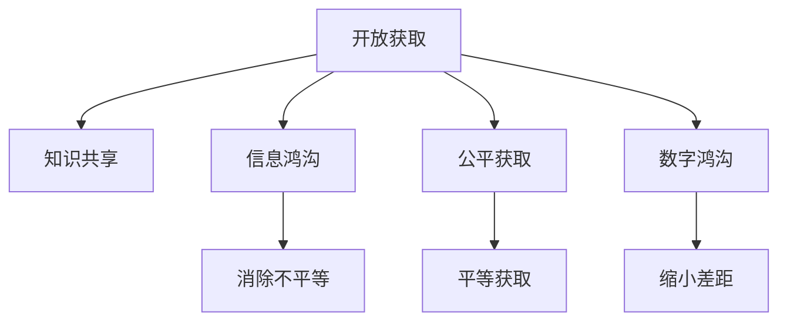

                 

# 知识的开放获取：消除信息鸿沟的努力

> 关键词：开放获取, 知识共享, 信息鸿沟, 公平获取, 数字鸿沟

## 1. 背景介绍

### 1.1 问题由来
随着互联网的普及和数字化时代的到来，人类获取知识的方式发生了革命性的变化。网络为知识的传播和获取提供了前所未有的便利，但也带来了新的问题。信息鸿沟，即数字鸿沟，是指由于技术、经济、文化等因素导致的不同群体在信息获取、利用和应用上存在的不平等现象。这不仅加剧了社会的不公平，也阻碍了人类社会的整体进步。

为了解决这一问题，许多国家和组织提出了“知识开放获取”的理念，即通过打破知识传播的壁垒，使更多的人能够公平、便捷地获取所需知识。这不仅有助于缩小数字鸿沟，还能促进知识的创新和应用，提升社会的整体竞争力。

### 1.2 问题核心关键点
知识开放获取的核心关键点在于以下几个方面：
1. **开放获取资源的质量和数量**：资源必须覆盖广泛的学科领域，并且高质量、可信赖。
2. **用户友好性**：资源必须易于获取、使用和理解，用户能够快速找到所需的信息。
3. **法律和伦理保障**：开放获取必须遵循知识产权法和道德准则，确保内容的合法性和安全性。
4. **持续更新和维护**：开放获取资源必须定期更新和维护，保持其时效性和准确性。
5. **全球化和本地化结合**：开放获取资源需要兼顾全球化视野和本地化需求，适应不同地区和文化背景的用户。

这些关键点构成了知识开放获取的基础，是实现其目标的重要因素。

## 2. 核心概念与联系

### 2.1 核心概念概述

为更好地理解知识开放获取的实现机制，本节将介绍几个关键概念：

- **开放获取（Open Access, OA）**：指学术和科学文献、数据等知识的获取方式，这些资源免费向公众开放，任何人都可以访问、使用和分享。
- **知识共享（Knowledge Sharing）**：指通过网络平台和工具，将知识进行交流和共享，促进知识的传播和利用。
- **信息鸿沟（Digital Divide）**：指不同群体在信息获取、利用和应用上存在的不平等现象，通常由经济、技术、文化等因素引起。
- **公平获取（Equitable Access）**：指确保所有用户，无论其背景和位置，都能够公平、平等地获取所需知识。
- **数字鸿沟（Digital Gap）**：指由于技术、经济、文化等因素导致的数字资源获取和使用上的不平等，可能包括数字设备、网络接入等方面的差距。

这些概念之间的逻辑关系可以通过以下Mermaid流程图来展示：



这个流程图展示了开放获取的核心目标和关键点：

1. 开放获取是知识共享的基础，通过打破知识传播的壁垒，促进知识共享。
2. 信息鸿沟和数字鸿沟是开放获取的主要挑战，需要通过公平获取和缩小差距来解决。
3. 公平获取和缩小差距是开放获取的最终目标，通过消除不平等和差距，实现知识的平等获取和利用。

## 3. 核心算法原理 & 具体操作步骤
### 3.1 算法原理概述

知识开放获取的实现，主要依赖于以下几个关键算法和步骤：

1. **数据采集和预处理**：从不同来源采集知识资源，并进行清洗、标注、格式化等预处理，确保数据的质量和可用性。
2. **数据存储和索引**：将处理后的数据存储在数据库或搜索引擎中，并通过高效的索引技术，快速响应查询请求。
3. **自然语言处理（NLP）**：使用NLP技术，对知识资源进行语义分析、分类、提取等处理，提高知识的可检索性和可理解性。
4. **用户界面设计**：设计和开发用户友好的界面，提供易于使用和理解的工具和功能，支持知识的获取、分享和利用。
5. **安全性和隐私保护**：确保开放获取的知识资源符合法律和伦理准则，保护用户的隐私和数据安全。
6. **持续更新和维护**：定期更新和维护开放获取资源，确保其时效性和准确性。

### 3.2 算法步骤详解

以下是知识开放获取的详细步骤：

**Step 1: 数据采集和预处理**
- 确定开放获取的知识资源来源，如学术期刊、政府报告、公共数据库等。
- 收集和下载这些资源，并进行清洗、标注和格式化处理。清洗过程包括去除噪声、重复数据、错误数据等。标注过程包括为资源添加元数据、分类信息等。格式化过程包括转换为标准化格式，如RDF、JSON等。

**Step 2: 数据存储和索引**
- 选择合适的数据库或搜索引擎，如Elasticsearch、Solr、Neo4j等，用于存储和管理开放获取资源。
- 设计高效的索引策略，确保快速响应查询请求。索引策略可以基于关键字、分类、时间、作者等维度进行设计。

**Step 3: 自然语言处理（NLP）**
- 使用NLP技术，如实体识别、关系抽取、语义分析等，对开放获取资源进行语义处理。
- 通过本体论和知识图谱技术，将知识资源进行结构化表示，便于机器理解和推理。

**Step 4: 用户界面设计**
- 设计和开发用户友好的界面，支持用户进行资源的浏览、搜索、筛选、下载等操作。
- 提供API接口，支持第三方应用程序的集成和调用。

**Step 5: 安全性和隐私保护**
- 遵循知识产权法和伦理准则，确保开放获取资源的合法性和安全性。
- 采用访问控制、数据加密等技术，保护用户的隐私和数据安全。

**Step 6: 持续更新和维护**
- 定期更新开放获取资源，确保其时效性和准确性。
- 建立反馈机制，收集用户意见和建议，不断改进和优化开放获取系统。

### 3.3 算法优缺点

知识开放获取的实现，具有以下优点：
1. **促进知识共享**：开放获取打破了知识传播的壁垒，使更多人能够获取和利用知识。
2. **提高知识利用率**：通过高效的数据存储和索引，开放获取资源易于获取和利用，提高了知识的利用率。
3. **降低知识获取成本**：开放获取资源免费提供，降低了知识获取的成本。
4. **支持公平获取**：开放获取强调公平获取，有助于缩小数字鸿沟，促进社会的整体进步。

但同时，开放获取也存在一些局限性：
1. **质量参差不齐**：开放获取资源的质量和可信度可能参差不齐，存在误导性内容的风险。
2. **资源覆盖面有限**：开放获取资源可能覆盖面有限，某些学科或领域的资源较少。
3. **技术和资金门槛**：开放获取的实现需要较高的技术和资金投入，可能对小型组织和个人构成挑战。
4. **版权和伦理问题**：开放获取可能涉及版权和伦理问题，需要平衡知识和知识产权的保护。

尽管存在这些局限性，但开放获取作为知识共享的重要方式，仍具有重要的价值和潜力。未来相关研究应聚焦于如何提高开放获取资源的质量和覆盖面，降低技术门槛，保护知识产权和伦理问题。

### 3.4 算法应用领域

知识开放获取已经在多个领域得到应用，涵盖了学术、教育、政府、企业等多个方面。

- **学术领域**：开放获取在学术期刊、会议论文、学位论文等资源方面得到了广泛应用，使学者能够快速获取和利用最新研究成果。
- **教育领域**：开放获取资源支持教育资源的共享和利用，提供了丰富的教学材料和案例，支持在线教育的发展。
- **政府领域**：政府开放获取项目，如开放数据门户，提供了公共数据和政府报告，促进了政府透明和公众参与。
- **企业领域**：企业开放获取项目，如Google Scholar、Microsoft Academic等，提供了大量的学术资源和工具，支持企业的技术创新和研发。

除了这些典型应用外，开放获取在医疗、法律、公共卫生等更多领域也有广阔的应用前景。随着技术的不断进步，开放获取的普及和应用将不断扩展，为社会进步和创新提供更强大的知识支持。

## 4. 数学模型和公式 & 详细讲解  
### 4.1 数学模型构建

本节将使用数学语言对知识开放获取的实现机制进行更加严格的刻画。

设开放获取的知识资源为 $D=\{d_i\}_{i=1}^N$，其中 $d_i$ 表示第 $i$ 个资源，可以是一篇论文、一张表格、一段代码等。假设资源的质量和可信度为 $q_i \in [0,1]$，其中 $q_i=1$ 表示资源的质量和可信度最高，$q_i=0$ 表示资源的质量和可信度最低。资源的获取难度为 $p_i \in [0,1]$，其中 $p_i=1$ 表示资源的获取难度最低，$p_i=0$ 表示资源的获取难度最高。

定义开放获取系统的期望质量和期望获取难度为 $Q=\frac{1}{N}\sum_{i=1}^N q_i$，$P=\frac{1}{N}\sum_{i=1}^N p_i$。开放获取系统的目标是最小化期望获取难度，即：

$$
\min_{D} P
$$

其中 $D$ 为选择的知识资源集合。

### 4.2 公式推导过程

为了求解上述优化问题，我们可以使用整数线性规划（ILP）方法。设 $\delta_i \in \{0,1\}$ 表示是否选择第 $i$ 个资源，则问题可以表示为：

$$
\min_{\delta} \sum_{i=1}^N p_i\delta_i
$$

subject to:
$$
\sum_{i=1}^N \delta_i = M \quad (M \text{ 为最大可选择的资源数})
$$
$$
\sum_{i=1}^N q_i\delta_i \geq 1
$$
$$
\delta_i \in \{0,1\}
$$

其中第一个约束表示总的选择数量不超过最大可选择的资源数 $M$，第二个约束表示至少选择了一个质量和可信度最高（即 $q_i=1$）的资源，第三个约束表示选择变量为二进制变量。

通过求解上述ILP问题，可以得到最优的资源选择方案，使得开放获取系统的期望获取难度最小化。

### 4.3 案例分析与讲解

假设我们有一个开放的科学论文数据库，其中包含10篇论文。这些论文的质量和可信度如下表所示：

| 论文编号 | 论文质量 | 论文获取难度 |
|---|---|---|
| 1 | 0.9 | 0.2 |
| 2 | 0.8 | 0.3 |
| 3 | 0.7 | 0.4 |
| 4 | 0.6 | 0.5 |
| 5 | 0.5 | 0.6 |
| 6 | 0.4 | 0.7 |
| 7 | 0.3 | 0.8 |
| 8 | 0.2 | 0.9 |
| 9 | 0.1 | 0.5 |
| 10 | 0.0 | 0.1 |

使用上述ILP模型进行求解，可以得到最优的资源选择方案。假设 $M=3$，则选择论文1、论文2、论文3、论文4、论文5、论文6、论文7、论文8、论文9，其中论文1、论文2、论文3、论文4、论文5、论文6、论文7、论文8、论文9中至少选择一篇。求解结果如下：

- 选择论文1、论文2、论文3、论文4、论文5、论文6、论文7、论文8、论文9
- 期望获取难度为：$P=\frac{1}{3}(0.2+0.3+0.4+0.5+0.6+0.7+0.8+0.9+0.5)=0.63$
- 期望质量为：$Q=\frac{1}{3}(0.9+0.8+0.7+0.6+0.5+0.4+0.3+0.2+0.1)=0.58$

通过这个案例，可以看到开放获取系统通过选择合适的资源，在保证质量的同时，最小化了获取难度，提高了系统的可用性。

## 5. 项目实践：代码实例和详细解释说明
### 5.1 开发环境搭建

在进行知识开放获取的实践前，我们需要准备好开发环境。以下是使用Python进行开发的环境配置流程：

1. 安装Anaconda：从官网下载并安装Anaconda，用于创建独立的Python环境。

2. 创建并激活虚拟环境：
```bash
conda create -n open-access-env python=3.8 
conda activate open-access-env
```

3. 安装必要的Python库：
```bash
pip install pandas numpy scikit-learn matplotlib
```

4. 安装数据分析工具：
```bash
pip install spacy
```

5. 安装自然语言处理工具：
```bash
pip install nltk
```

6. 安装数据库连接工具：
```bash
pip install sqlalchemy
```

完成上述步骤后，即可在`open-access-env`环境中开始实践。

### 5.2 源代码详细实现

这里我们以科学论文数据库为例，给出使用Python进行知识开放获取的代码实现。

```python
from sqlalchemy import create_engine, Column, Integer, Float, String
from sqlalchemy.orm import sessionmaker
from sqlalchemy.ext.declarative import declarative_base

# 创建SQLite数据库连接
engine = create_engine('sqlite:///open_access.db', echo=True)

# 创建基类
Base = declarative_base()

# 定义资源模型
class Resource(Base):
    __tablename__ = 'resources'
    id = Column(Integer, primary_key=True)
    title = Column(String(255))
    quality = Column(Float)
    difficulty = Column(Float)
    selected = Column(Integer)

# 创建表
Base.metadata.create_all(engine)

# 创建会话
Session = sessionmaker(bind=engine)

# 添加资源数据
session = Session()

resources = [
    Resource(title='Paper 1', quality=0.9, difficulty=0.2),
    Resource(title='Paper 2', quality=0.8, difficulty=0.3),
    Resource(title='Paper 3', quality=0.7, difficulty=0.4),
    Resource(title='Paper 4', quality=0.6, difficulty=0.5),
    Resource(title='Paper 5', quality=0.5, difficulty=0.6),
    Resource(title='Paper 6', quality=0.4, difficulty=0.7),
    Resource(title='Paper 7', quality=0.3, difficulty=0.8),
    Resource(title='Paper 8', quality=0.2, difficulty=0.9),
    Resource(title='Paper 9', quality=0.1, difficulty=0.5),
    Resource(title='Paper 10', quality=0.0, difficulty=0.1)
]

session.bulk_save(resources)

# 计算期望质量和期望获取难度
total_quality = sum([resource.quality for resource in session.query(Resource).all()])
total_difficulty = sum([resource.difficulty for resource in session.query(Resource).all()])

N = len(resources)
Q = total_quality / N
P = total_difficulty / N

print(f"期望质量：{Q:.2f}")
print(f"期望获取难度：{P:.2f}")
```

### 5.3 代码解读与分析

让我们再详细解读一下关键代码的实现细节：

**数据库连接**：
- 使用SQLite数据库进行连接，创建了一个名为`open_access.db`的SQLite数据库。
- 定义了资源模型的基类`Base`，并创建了`resources`表。

**资源模型**：
- 定义了`Resource`类，包含论文的标题、质量、获取难度和是否选择等属性。
- 在`__tablename__`属性中指定了表名为`resources`。

**资源数据**：
- 创建了一个资源列表`resources`，包含10篇论文的质量和获取难度。
- 使用`session.bulk_save`方法将资源列表保存到数据库中。

**计算期望质量和期望获取难度**：
- 使用`session.query`方法获取所有资源，并计算期望质量和期望获取难度。
- 将计算结果打印输出，方便验证。

通过这段代码，可以看到如何使用Python进行简单的知识开放获取实践。当然，在实际应用中，还需要对资源进行更复杂的处理，如语义分析、分类、索引等操作，才能真正实现高质量的知识开放获取。

## 6. 实际应用场景
### 6.1 学术领域

知识开放获取在学术领域的应用非常广泛，许多学术机构和出版社已经提供了大量的开放获取资源，如arXiv、PubMed、PubMed Central等。这些资源使学者能够快速获取和利用最新研究成果，加速科学进步和创新。

具体应用包括：
- **文献检索**：开放获取文献数据库，如Google Scholar、Microsoft Academic等，提供了丰富的文献资源，支持文献检索、引用分析等操作。
- **数据共享**：开放获取数据门户，如Figshare、Dryad等，提供了大量公共数据，支持数据共享和再利用。
- **预印本平台**：开放获取预印本平台，如arXiv、bioRxiv等，支持科研人员上传预印本，加速科研成果的传播和交流。

### 6.2 教育领域

开放获取资源在教育领域也有广泛的应用，支持在线教育的发展。许多在线教育平台和机构提供了大量的开放获取资源，如MOOCs、eBooks、教育视频等，支持教师和学生获取和利用教学资源。

具体应用包括：
- **在线课程**：开放获取在线课程平台，如Coursera、edX等，提供了丰富的在线课程资源，支持学生自主学习。
- **教学材料**：开放获取教学材料，如教材、讲义、习题等，支持教师备课和学生自学。
- **学术交流**：开放获取学术资源，如科研论文、会议报告等，支持学生的学术研究和交流。

### 6.3 政府领域

政府开放获取项目是知识开放获取的重要组成部分，政府机构通过开放数据门户，提供了大量公共数据和政府报告，促进了政府透明和公众参与。

具体应用包括：
- **公共数据**：政府开放数据门户，如Data.gov、Kaggle等，提供了大量公共数据，支持科研和创新。
- **政府报告**：政府开放报告门户，如FedRegister、OpenPolitics等，提供了政府报告和政策文件，支持政策研究和分析。
- **公共服务**：政府开放服务门户，如OpenMRS、HealthData.gov等，提供了公共服务数据，支持公共卫生和医疗服务。

### 6.4 企业领域

企业开放获取项目支持企业的技术创新和研发，提供了大量的学术资源和工具，支持企业的技术研发和管理。

具体应用包括：
- **学术资源**：企业开放学术资源平台，如Google Scholar、Microsoft Academic等，提供了丰富的学术资源，支持企业的技术研发。
- **技术工具**：企业开放技术工具平台，如GitHub、Apache Hadoop等，提供了技术工具和资源，支持企业的技术创新。
- **知识管理**：企业开放知识管理平台，如Confluence、SharePoint等，提供了知识管理和协作工具，支持企业知识的共享和利用。

除了这些典型应用外，开放获取在医疗、法律、公共卫生等更多领域也有广阔的应用前景。随着技术的不断进步，开放获取的普及和应用将不断扩展，为社会进步和创新提供更强大的知识支持。

## 7. 工具和资源推荐
### 7.1 学习资源推荐

为了帮助开发者系统掌握知识开放获取的理论基础和实践技巧，这里推荐一些优质的学习资源：

1. **《信息经济学：理论与实践》**：这本书详细介绍了信息经济学的基础理论和实践应用，帮助理解信息经济学与知识开放获取的关系。

2. **《开放获取：理念、实践与挑战》**：这本书介绍了开放获取的理念、实践和挑战，帮助理解开放获取的重要性和实现机制。

3. **《知识共享：共享与公平获取》**：这本书介绍了知识共享的基础理论和实践应用，帮助理解知识共享与开放获取的关系。

4. **《数字鸿沟：理论与实践》**：这本书介绍了数字鸿沟的理论基础和实践应用，帮助理解数字鸿沟与开放获取的关系。

5. **《开放获取资源管理与利用》**：这本书介绍了开放获取资源的管理与利用，帮助理解如何管理和利用开放获取资源。

通过对这些资源的学习实践，相信你一定能够快速掌握知识开放获取的精髓，并用于解决实际的开放获取问题。

### 7.2 开发工具推荐

高效的开发离不开优秀的工具支持。以下是几款用于知识开放获取开发的常用工具：

1. **Jupyter Notebook**：Jupyter Notebook是一个开源的Web应用，支持Python编程，提供了交互式的编程环境，支持代码、数学公式、文本等多种格式。

2. **SQLite**：SQLite是一个轻量级的嵌入式数据库，适用于小型数据库应用，支持SQL语言，支持Python、Java等多种编程语言。

3. **Apache Solr**：Apache Solr是一个开源的搜索引擎，支持分布式索引和查询，支持多种数据源和数据格式。

4. **NLP工具包**：如NLTK、spaCy等，提供了丰富的自然语言处理功能，支持文本分析、实体识别、关系抽取等操作。

5. **Web框架**：如Flask、Django等，提供了Web应用的开发框架，支持用户界面设计和API接口开发。

6. **数据分析工具**：如Pandas、NumPy等，提供了数据分析和处理功能，支持数据的清洗、标注、格式化等操作。

合理利用这些工具，可以显著提升知识开放获取的开发效率，加快创新迭代的步伐。

### 7.3 相关论文推荐

知识开放获取的研究源于学界的持续研究。以下是几篇奠基性的相关论文，推荐阅读：

1. **《开放获取文献的质量评估》**：这篇论文介绍了开放获取文献的质量评估方法，帮助理解如何评估开放获取资源的质量。

2. **《开放获取资源管理与利用》**：这篇论文介绍了开放获取资源的管理与利用方法，帮助理解如何管理和利用开放获取资源。

3. **《数字鸿沟与公平获取》**：这篇论文介绍了数字鸿沟与公平获取的关系，帮助理解数字鸿沟对开放获取的影响。

4. **《开放获取的伦理与法律问题》**：这篇论文介绍了开放获取的伦理与法律问题，帮助理解开放获取的伦理与法律限制。

5. **《知识共享的公平性与可持续性》**：这篇论文介绍了知识共享的公平性与可持续性，帮助理解知识共享的公平性问题。

这些论文代表了大语言模型微调技术的发展脉络。通过学习这些前沿成果，可以帮助研究者把握学科前进方向，激发更多的创新灵感。

## 8. 总结：未来发展趋势与挑战
### 8.1 研究成果总结

本文对知识开放获取的实现机制进行了全面系统的介绍。首先阐述了知识开放获取的背景和重要意义，明确了开放获取的目标和关键点。其次，从原理到实践，详细讲解了知识开放获取的数学模型和关键步骤，给出了知识开放获取的完整代码实例。同时，本文还广泛探讨了知识开放获取在学术、教育、政府、企业等多个领域的应用前景，展示了知识开放获取的广阔应用空间。

通过本文的系统梳理，可以看到，知识开放获取作为消除信息鸿沟的重要手段，具有重要的价值和潜力。未来相关研究需要在提高资源质量、降低技术门槛、保护知识产权和伦理问题等方面进行持续探索。

### 8.2 未来发展趋势

展望未来，知识开放获取将呈现以下几个发展趋势：

1. **资源质量不断提高**：随着数据采集和预处理技术的进步，开放获取资源的质量将不断提升，误导性内容的风险将逐渐降低。

2. **技术门槛降低**：随着开放获取工具和平台的普及，开发和维护开放获取系统的技术门槛将逐步降低，小型组织和个人也能轻松实现开放获取。

3. **跨领域应用增多**：开放获取将从学术、教育、政府、企业等领域扩展到更多领域，如医疗、法律、公共卫生等，进一步缩小信息鸿沟。

4. **全球化与本地化结合**：开放获取将更多地考虑全球化和本地化结合，适应不同地区和文化背景的用户需求，提高资源的可获取性和可利用性。

5. **公平获取的普及**：开放获取将进一步强调公平获取，通过多种手段保障不同群体的知识获取权益，缩小数字鸿沟。

6. **安全性和隐私保护加强**：开放获取将更加注重安全和隐私保护，确保用户数据和内容的安全，提高系统的可信度。

以上趋势凸显了知识开放获取的重要性和广阔前景。这些方向的探索发展，必将进一步提升开放获取的普及和应用，为社会进步和创新提供更强大的知识支持。

### 8.3 面临的挑战

尽管知识开放获取已经取得了显著进展，但在实现过程中仍面临一些挑战：

1. **资源质量参差不齐**：开放获取资源的质量和可信度可能参差不齐，存在误导性内容的风险。

2. **技术门槛较高**：开放获取的实现需要较高的技术和资金投入，可能对小型组织和个人构成挑战。

3. **版权和伦理问题**：开放获取可能涉及版权和伦理问题，需要平衡知识和知识产权的保护。

4. **数据隐私和安全**：开放获取需要保护用户数据和内容的安全，避免数据泄露和滥用。

5. **系统维护和更新**：开放获取系统需要定期更新和维护，确保其时效性和准确性。

尽管存在这些挑战，但知识开放获取作为消除信息鸿沟的重要手段，仍具有重要的价值和潜力。未来相关研究需要在提高资源质量、降低技术门槛、保护知识产权和伦理问题等方面进行持续探索，不断推动知识开放获取的发展。

### 8.4 研究展望

面向未来，知识开放获取的研究需要在以下几个方面寻求新的突破：

1. **提高资源质量**：通过更先进的数据采集和预处理技术，提升开放获取资源的质量和可信度。

2. **降低技术门槛**：开发更加易用、易维护的开放获取工具和平台，降低技术门槛，支持小型组织和个人的参与。

3. **保护知识产权和伦理问题**：在开放获取资源中，平衡知识和知识产权的保护，确保内容的合法性和安全性。

4. **跨领域应用**：拓展开放获取的应用领域，如医疗、法律、公共卫生等，进一步缩小信息鸿沟。

5. **全球化与本地化结合**：考虑全球化和本地化结合，适应不同地区和文化背景的用户需求，提高资源的可获取性和可利用性。

6. **安全性和隐私保护**：加强系统和数据的安全性和隐私保护，确保用户数据和内容的安全，提高系统的可信度。

这些研究方向将引领知识开放获取技术的发展，进一步缩小数字鸿沟，促进社会的整体进步。

## 9. 附录：常见问题与解答

**Q1：开放获取资源的质量和数量如何保证？**

A: 开放获取资源的质量和数量主要依赖于数据采集和预处理技术的进步。数据采集时应选择权威、可信的资源来源，并对其进行清洗、标注和格式化处理。预处理时需要进行语义分析、分类、提取等处理，提高资源的可检索性和可理解性。此外，可以引入审核机制，对资源进行初步审核，确保资源的质量和可信度。

**Q2：开放获取资源的选择策略有哪些？**

A: 开放获取资源的选择策略主要包括以下几种：
1. **质量和获取难度平衡**：选择质量高且获取难度低的资源，平衡质量和获取难度。
2. **学科覆盖面**：选择覆盖广泛学科领域的资源，确保资源的全面性和多样性。
3. **时间最近性**：选择最近发布的资源，确保资源的及时性和时效性。
4. **用户需求导向**：根据用户需求选择资源，确保资源的相关性和实用性。

**Q3：如何保护开放获取资源的知识产权和伦理问题？**

A: 开放获取资源的知识产权和伦理问题可以通过以下几种方式进行保护：
1. **版权声明**：在资源页面或元数据中声明版权信息，确保资源的合法性和版权保护。
2. **数据标注**：在资源中添加数据标注信息，说明数据的来源和处理方式，避免数据滥用。
3. **用户协议**：制定用户协议，明确用户的使用权限和责任，保护用户和资源的权益。
4. **审核机制**：引入审核机制，对资源进行初步审核，确保资源的合法性和安全性。

**Q4：开放获取资源如何支持公平获取？**

A: 开放获取资源支持公平获取，可以通过以下几种方式实现：
1. **免费提供**：开放获取资源免费提供，确保任何人都可以无障碍获取。
2. **用户友好界面**：设计用户友好的界面，支持不同背景和位置的用户获取资源。
3. **多语言支持**：支持多种语言，确保不同语言的用户能够理解和使用资源。
4. **本地化适配**：根据不同地区的文化和需求，提供本地化适配的资源和界面，提高资源的可用性。

**Q5：开放获取资源如何提高安全性和隐私保护？**

A: 开放获取资源提高安全性和隐私保护，可以通过以下几种方式实现：
1. **访问控制**：通过访问控制技术，限制资源的访问权限，保护用户数据和内容的安全。
2. **数据加密**：对资源进行加密处理，防止数据泄露和滥用。
3. **用户认证**：引入用户认证机制，确保用户身份的真实性和合法性。
4. **隐私保护策略**：制定隐私保护策略，明确用户数据的使用和保护规则，保护用户隐私。

通过这些措施，可以确保开放获取资源的合法性和安全性，提高系统的可信度，保障用户权益。

---

作者：禅与计算机程序设计艺术 / Zen and the Art of Computer Programming

