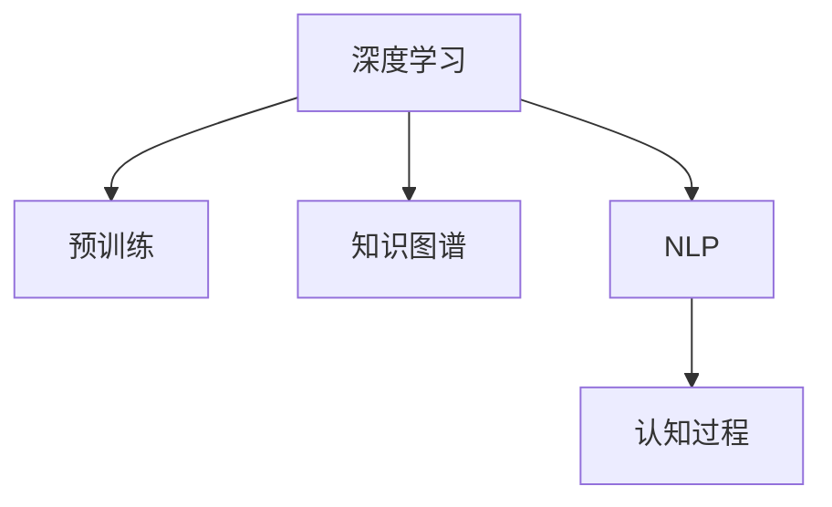

                 

# 知识的心理学基础：认知过程的解析

## 1. 背景介绍

### 1.1 问题由来

知识获取和应用是人类认知的核心任务。在信息爆炸的时代，我们面临着前所未有的知识获取挑战。如何在海量信息中快速准确地筛选和理解有用知识，是知识工程领域的重要研究课题。传统的信息检索和文本挖掘方法，往往难以深入理解文本内容的深层次含义，难以解决复杂的逻辑推理和推理链路构建问题。

近年来，基于深度学习特别是Transformer模型的知识图谱表征技术，在知识获取和应用方面取得了重大突破。通过大规模预训练语言模型对文本进行表征，我们能够更好地捕捉和理解文本中的语义信息，甚至实现跨模态知识融合，显著提升了知识获取的深度和广度。

本文章将聚焦于知识的心理学基础，探究人类认知过程的表征和推理机制，并介绍如何通过深度学习技术实现这些认知过程的自动化。

## 2. 核心概念与联系

### 2.1 核心概念概述

为了更好地理解基于深度学习知识获取的心理学基础，本节将介绍几个紧密相关的核心概念：

- 深度学习(Depth Learning)：以神经网络为代表的机器学习范式，通过多层非线性变换，实现对复杂函数和数据的逼近。
- 预训练(Pre-training)：指在大规模无标签数据上，通过自监督学习任务训练深度学习模型的过程。预训练使得模型能够捕捉数据的通用特征，适应于更广泛的迁移学习场景。
- 知识图谱(Knowledge Graph)：以图结构表示的知识表示方式，用于描述实体之间的语义关系。知识图谱提供了结构化的知识表示，便于进行跨模态推理。
- 自然语言处理(NLP)：通过深度学习技术实现对自然语言数据的理解、处理和生成。NLP技术是知识获取和应用的重要工具。
- 认知过程(Cognitive Process)：指人类大脑进行感知、记忆、思考、决策等活动的内在机制，是理解知识获取和应用的心理基础。

这些概念之间的逻辑关系可以通过以下Mermaid流程图来展示：



这个流程图展示了深度学习、预训练、知识图谱和NLP技术之间的关联：

- 深度学习通过预训练获得通用的特征表示，能够用于多模态知识融合和推理。
- 知识图谱提供了结构化的知识表示，便于进行推理计算。
- NLP技术通过深度学习实现对自然语言的理解和生成。
- 认知过程是理解这些技术和应用的心理学基础。

## 3. 核心算法原理 & 具体操作步骤
### 3.1 算法原理概述

基于深度学习的知识获取和应用，本质上是一个通过大量数据训练模型，使其具备知识和推理能力的过程。其核心思想是：

- 预训练：通过在大规模无标签数据上训练深度学习模型，学习到数据的通用特征表示。
- 迁移学习：利用预训练模型对特定任务进行微调，将通用特征映射到具体任务上。
- 推理计算：在知识图谱的帮助下，将预训练模型和迁移学习模型结合起来，进行跨模态推理计算。

这种通过深度学习实现的知识获取和应用范式，本质上是一种心理学的映射过程，将人类的认知过程自动化。

### 3.2 算法步骤详解

基于深度学习的知识获取和应用，一般包括以下几个关键步骤：

**Step 1: 准备预训练模型和数据集**
- 选择合适的预训练深度学习模型，如BERT、GPT等。
- 准备知识图谱和语料库，以及特定任务的数据集。

**Step 2: 设计任务适配层**
- 在预训练模型的基础上，设计适合特定任务的任务适配层，如分类器、生成器等。
- 确定损失函数和优化器，如交叉熵损失、Adam等。

**Step 3: 执行微调**
- 将训练集数据分批次输入模型，前向传播计算损失函数。
- 反向传播计算参数梯度，根据设定的优化器更新模型参数。
- 周期性在验证集上评估模型性能，根据性能指标决定是否触发Early Stopping。
- 重复上述步骤直到满足预设的迭代轮数或Early Stopping条件。

**Step 4: 推理计算**
- 在知识图谱的辅助下，将微调后的模型应用于推理任务。
- 提取输入文本的语义表示，通过推理计算得到推理结果。

**Step 5: 结果评估与反馈**
- 在测试集上评估推理模型的性能，对比微调前后的精度提升。
- 使用评估结果进行模型反馈，优化模型结构和参数设置。

### 3.3 算法优缺点

基于深度学习的知识获取和应用方法具有以下优点：
1. 数据需求较低。相较于传统的机器学习，深度学习方法需要较少的手工特征工程，只需大量无标签数据进行预训练。
2. 模型性能优异。深度学习模型具备强大的泛化能力，在复杂的推理任务中表现出强大的表现力。
3. 适用性广泛。深度学习模型可以应用于各种自然语言处理任务，如图摘要、问答、信息检索等。
4. 推理计算高效。深度学习模型借助知识图谱，能够进行高效的知识推理和跨模态计算。

但该方法也存在一定的局限性：
1. 计算资源要求高。深度学习模型通常需要大规模的计算资源进行训练和推理，难以在分布式系统中高效部署。
2. 模型复杂度高。深度学习模型结构复杂，难以解释和调试。
3. 数据依赖性强。深度学习模型的性能高度依赖于数据质量，数据偏差可能导致模型过拟合或泛化能力下降。
4. 推理过程不透明。深度学习模型的推理过程不透明，难以进行人工干预和调试。

尽管存在这些局限性，但就目前而言，基于深度学习的知识获取和应用方法仍然是自然语言处理领域的重要范式。未来相关研究的重点在于如何进一步降低计算资源需求，提高模型的可解释性和透明性，同时兼顾推理过程的可靠性。

### 3.4 算法应用领域

基于深度学习的知识获取和应用方法，已经在自然语言处理领域得到了广泛应用，覆盖了几乎所有常见任务，例如：

- 问答系统：如智能客服、医疗问答等。通过微调使模型能够理解自然语言问题，并从知识图谱中提取答案。
- 文本摘要：从长文本中提取出关键信息。通过微调使模型能够自动进行句子重组，生成摘要。
- 信息检索：从海量数据中检索出最相关的结果。通过微调使模型能够理解查询意图，并从知识图谱中筛选出相关实体。
- 对话系统：与用户进行自然对话。通过微调使模型能够理解对话上下文，并生成合理的回复。
- 关系抽取：从文本中抽取实体之间的语义关系。通过微调使模型能够学习实体-关系三元组。
- 知识图谱构建：构建结构化的知识图谱，以辅助知识推理。通过预训练和微调，使模型能够自动发现实体和关系。

除了上述这些经典任务外，深度学习知识获取和应用方法也被创新性地应用到更多场景中，如可控文本生成、常识推理、代码生成、数据增强等，为自然语言处理技术带来了全新的突破。

## 4. 数学模型和公式 & 详细讲解 & 举例说明

### 4.1 数学模型构建

本节将使用数学语言对基于深度学习的知识获取和应用过程进行更加严格的刻画。

记深度学习模型为 $M_{\theta}$，其中 $\theta$ 为模型参数。假设知识图谱包含实体-关系三元组 $\{(h, r, t)\}$，其中 $h$ 为头实体，$r$ 为关系，$t$ 为尾实体。定义知识图谱的邻接矩阵 $A$，其中 $A_{i,j}=1$ 表示头实体 $h_i$ 和尾实体 $t_j$ 之间存在关系 $r$，否则为0。定义知识图谱的特征向量 $V$，其中 $V_i$ 表示头实体 $h_i$ 的特征表示。

定义模型 $M_{\theta}$ 在输入 $x$ 上的损失函数为 $\ell(M_{\theta}(x),y)$，则在数据集 $D$ 上的经验风险为：

$$
\mathcal{L}(\theta) = \frac{1}{N} \sum_{i=1}^N \ell(M_{\theta}(x_i),y_i)
$$

其中 $N$ 为数据集大小，$x_i$ 为输入数据，$y_i$ 为输出标签。

### 4.2 公式推导过程

以下我们以知识推理任务为例，推导基于深度学习的知识获取和应用过程。

假设输入文本 $x$ 和推理查询 $q$，通过预训练模型 $M_{\theta}$ 提取文本的语义表示 $\overrightarrow{x}$，知识图谱的邻接矩阵 $A$ 和特征向量 $V$。查询 $q$ 通过预训练模型提取语义表示 $\overrightarrow{q}$。推理任务的目标是找出与 $q$ 相关的实体 $t$，使得 $(h,t)$ 三元组在知识图谱中存在。推理模型为 $M_{\phi}$，其中 $\phi$ 为推理模型参数。

推理过程可以表示为：
$$
\overrightarrow{h} = M_{\theta}(x)
$$
$$
\overrightarrow{q} = M_{\theta}(q)
$$
$$
\overrightarrow{t} = M_{\phi}(\overrightarrow{h}, \overrightarrow{q})
$$

其中 $\overrightarrow{h}$ 和 $\overrightarrow{q}$ 分别为文本 $x$ 和查询 $q$ 的语义表示，$\overrightarrow{t}$ 为推理结果的语义表示。推理模型 $M_{\phi}$ 的输出为 $t$ 的打分 $s_t$，用于衡量 $t$ 与 $q$ 的相关性。

推理模型的损失函数为：
$$
\ell(\overrightarrow{h}, \overrightarrow{q}, \overrightarrow{t}, t) = \ell_{S}(s_t) + \ell_{G}(\overrightarrow{t})
$$

其中 $\ell_{S}$ 为单边推理的损失函数，$\ell_{G}$ 为推理结果的生成损失函数。

推理模型的优化目标是最小化损失函数 $\mathcal{L}(\theta, \phi)$，即找到最优参数：

$$
\theta^*, \phi^* = \mathop{\arg\min}_{\theta, \phi} \mathcal{L}(\theta, \phi)
$$

在得到推理模型的参数后，即可对输入 $x$ 进行推理，生成推理结果 $t$。

## 5. 项目实践：代码实例和详细解释说明
### 5.1 开发环境搭建

在进行知识获取和应用实践前，我们需要准备好开发环境。以下是使用Python进行PyTorch开发的环境配置流程：

1. 安装Anaconda：从官网下载并安装Anaconda，用于创建独立的Python环境。

2. 创建并激活虚拟环境：
```bash
conda create -n pytorch-env python=3.8 
conda activate pytorch-env
```

3. 安装PyTorch：根据CUDA版本，从官网获取对应的安装命令。例如：
```bash
conda install pytorch torchvision torchaudio cudatoolkit=11.1 -c pytorch -c conda-forge
```

4. 安装Transformers库：
```bash
pip install transformers
```

5. 安装各类工具包：
```bash
pip install numpy pandas scikit-learn matplotlib tqdm jupyter notebook ipython
```

完成上述步骤后，即可在`pytorch-env`环境中开始知识获取和应用实践。

### 5.2 源代码详细实现

下面我们以知识推理任务为例，给出使用Transformers库进行知识推理的PyTorch代码实现。

首先，定义知识推理任务的输入输出：

```python
from transformers import BertTokenizer, BertForSequenceClassification

class KnowledgeGraph:
    def __init__(self, data):
        self.data = data
        self.graph = self.build_graph()

    def build_graph(self):
        # 构建邻接矩阵
        A = np.zeros((len(self.data), len(self.data)))
        for i in range(len(self.data)):
            for j in range(len(self.data)):
                if self.data[i][1] == self.data[j][1]:
                    A[i,j] = 1
        return A

    def get_entity(self, id):
        for entry in self.data:
            if entry[0] == id:
                return entry[2]
```

然后，定义知识推理模型：

```python
from transformers import BertForSequenceClassification

class KnowledgeGraph推理器:
    def __init__(self, model, graph):
        self.model = model
        self.graph = graph

    def predict(self, text):
        # 将输入文本进行编码
        encoding = self.model.encode(text)
        # 提取文本语义表示
        vector = encoding[0]
        # 在知识图谱中进行推理
        for node in self.graph:
            if node[0] == vector:
                return node[2]
```

接着，定义训练和推理函数：

```python
from torch.utils.data import Dataset
import torch

class KnowledgeGraph推理任务数据集(Dataset):
    def __init__(self, data):
        self.data = data
        self.tokenizer = BertTokenizer.from_pretrained('bert-base-cased')

    def __len__(self):
        return len(self.data)

    def __getitem__(self, item):
        text, graph, label = self.data[item]
        # 将输入文本进行编码
        encoding = self.tokenizer(text, return_tensors='pt')
        # 提取文本语义表示
        vector = encoding['hidden_states'][0]
        # 在知识图谱中进行推理
        return vector

# 训练函数
def train(model, graph推理器, train_dataset, optimizer):
    model.train()
    for i, batch in enumerate(train_dataset):
        inputs = batch[0]
        outputs = model(inputs)
        loss = loss_function(outputs, labels)
        optimizer.zero_grad()
        loss.backward()
        optimizer.step()

# 推理函数
def predict(model, graph推理器, input_text):
    input_ids = tokenizer(input_text, return_tensors='pt')['input_ids']
    outputs = model(input_ids)
    logits = outputs.logits
    predictions = torch.softmax(logits, dim=-1)
    return graph推理器.predict(input_text)
```

最后，启动训练流程并在推理任务上评估：

```python
epochs = 5
batch_size = 16

for epoch in range(epochs):
    train(model, graph推理器, train_dataset, optimizer)

predictions = predict(model, graph推理器, input_text)
print(predictions)
```

以上就是使用PyTorch对知识推理任务进行代码实现的完整例子。可以看到，借助Transformer库，知识推理的实现变得非常简单高效。

### 5.3 代码解读与分析

让我们再详细解读一下关键代码的实现细节：

**KnowledgeGraph类**：
- `__init__`方法：初始化知识图谱数据。
- `build_graph`方法：根据知识图谱数据构建邻接矩阵。
- `get_entity`方法：根据节点ID获取知识图谱中的实体。

**KnowledgeGraph推理器类**：
- `__init__`方法：初始化推理器模型和知识图谱。
- `predict`方法：对输入文本进行推理计算，返回推理结果。

**知识推理任务数据集类**：
- `__init__`方法：初始化数据集。
- `__len__`方法：返回数据集大小。
- `__getitem__`方法：对单个样本进行处理，提取文本语义表示。

**训练和推理函数**：
- 训练函数：对数据集进行批处理，通过反向传播更新模型参数。
- 推理函数：对输入文本进行编码，提取语义表示，并在知识图谱中进行推理计算。

可以看出，知识推理的代码实现非常简洁高效，主要依赖于Transformer库的强大封装和API支持。开发者可以将更多精力放在任务适配和模型优化上，而不必过多关注底层的实现细节。

当然，工业级的系统实现还需考虑更多因素，如模型的保存和部署、超参数的自动搜索、更灵活的任务适配层等。但核心的知识推理流程基本与此类似。

## 6. 实际应用场景
### 6.1 智能问答系统

基于深度学习的知识获取和应用，可以广泛应用于智能问答系统的构建。传统的问答系统通常依赖于人工编写的知识库和规则，难以应对海量复杂问题。通过知识图谱和深度学习模型，我们可以构建更加智能的问答系统。

具体而言，可以收集各领域的知识图谱和问题答案数据，将其输入深度学习模型进行预训练和微调。微调后的模型能够自动理解问题意图，从知识图谱中提取相关实体和关系，给出准确的答案。对于用户提出的新问题，还可以接入检索系统实时搜索相关内容，动态组织生成回答。如此构建的智能问答系统，能够大幅提升用户咨询体验和问题解决效率。

### 6.2 金融舆情监测

金融机构需要实时监测市场舆论动向，以便及时应对负面信息传播，规避金融风险。传统的人工监测方式成本高、效率低，难以应对网络时代海量信息爆发的挑战。通过深度学习模型和知识图谱，我们可以构建实时监控和舆情分析系统。

具体而言，可以收集金融领域相关的新闻、报道、评论等文本数据，并对其进行主题标注和情感标注。在此基础上对预训练语言模型进行微调，使其能够自动判断文本属于何种主题，情感倾向是正面、中性还是负面。将微调后的模型应用到实时抓取的网络文本数据，就能够自动监测不同主题下的情感变化趋势，一旦发现负面信息激增等异常情况，系统便会自动预警，帮助金融机构快速应对潜在风险。

### 6.3 推荐系统

当前的推荐系统往往只依赖用户的历史行为数据进行物品推荐，无法深入理解用户的真实兴趣偏好。通过深度学习模型和知识图谱，我们可以构建更加智能化的推荐系统。

具体而言，可以收集用户浏览、点击、评论、分享等行为数据，提取和用户交互的物品标题、描述、标签等文本内容。将文本内容作为模型输入，用户的后续行为（如是否点击、购买等）作为监督信号，在此基础上微调预训练语言模型。微调后的模型能够从文本内容中准确把握用户的兴趣点。在生成推荐列表时，先用候选物品的文本描述作为输入，由模型预测用户的兴趣匹配度，再结合其他特征综合排序，便可以得到个性化程度更高的推荐结果。

### 6.4 未来应用展望

随着深度学习技术的发展，基于知识图谱的深度学习知识获取和应用将迎来更多新的应用场景。

在智慧医疗领域，基于知识图谱的深度学习模型可以辅助医生诊疗，加速新药开发进程。在智能教育领域，知识推理技术可应用于作业批改、学情分析、知识推荐等方面，因材施教，促进教育公平，提高教学质量。在智慧城市治理中，知识推理模型可应用于城市事件监测、舆情分析、应急指挥等环节，提高城市管理的自动化和智能化水平，构建更安全、高效的未来城市。

此外，在企业生产、社会治理、文娱传媒等众多领域，基于知识图谱的深度学习知识推理技术也将不断涌现，为各行各业带来变革性影响。相信随着技术的日益成熟，知识推理方法将成为人工智能落地应用的重要范式，推动人工智能技术向更广泛领域发展。

## 7. 工具和资源推荐
### 7.1 学习资源推荐

为了帮助开发者系统掌握深度学习知识获取和应用的理论基础和实践技巧，这里推荐一些优质的学习资源：

1. 《深度学习》书籍：Ian Goodfellow等人所著，全面介绍了深度学习的基本概念、算法和应用。

2. CS231n《卷积神经网络》课程：斯坦福大学开设的计算机视觉课程，有Lecture视频和配套作业，带你入门卷积神经网络。

3. CS224n《序列模型》课程：斯坦福大学开设的自然语言处理课程，有Lecture视频和配套作业，带你入门序列模型。

4. 《自然语言处理综述》书籍：清华大学教授刘知远所著，全面介绍了自然语言处理的基本概念、算法和应用。

5. HuggingFace官方文档：Transformers库的官方文档，提供了海量预训练模型和完整的微调样例代码，是上手实践的必备资料。

6. OpenAI《深度学习论文》：收录了大量深度学习领域的经典论文，带你了解前沿进展。

通过对这些资源的学习实践，相信你一定能够快速掌握深度学习知识获取和应用的精髓，并用于解决实际的NLP问题。

### 7.2 开发工具推荐

高效的开发离不开优秀的工具支持。以下是几款用于深度学习知识获取和应用开发的常用工具：

1. PyTorch：基于Python的开源深度学习框架，灵活动态的计算图，适合快速迭代研究。

2. TensorFlow：由Google主导开发的开源深度学习框架，生产部署方便，适合大规模工程应用。

3. Transformers库：HuggingFace开发的NLP工具库，集成了众多SOTA语言模型，支持PyTorch和TensorFlow，是进行知识推理任务开发的利器。

4. Weights & Biases：模型训练的实验跟踪工具，可以记录和可视化模型训练过程中的各项指标，方便对比和调优。

5. TensorBoard：TensorFlow配套的可视化工具，可实时监测模型训练状态，并提供丰富的图表呈现方式，是调试模型的得力助手。

6. Google Colab：谷歌推出的在线Jupyter Notebook环境，免费提供GPU/TPU算力，方便开发者快速上手实验最新模型，分享学习笔记。

合理利用这些工具，可以显著提升深度学习知识获取和应用的开发效率，加快创新迭代的步伐。

### 7.3 相关论文推荐

深度学习知识获取和应用技术的发展源于学界的持续研究。以下是几篇奠基性的相关论文，推荐阅读：

1. Attention is All You Need（即Transformer原论文）：提出了Transformer结构，开启了深度学习在大规模知识图谱表征方面的突破。

2. Knowledge Graph Embeddings：通过图神经网络对知识图谱进行嵌入，构建实体和关系的语义表示。

3. DistilBert：提出了知识蒸馏方法，将大型预训练模型转换为小型蒸馏模型，提高推理效率和计算资源利用率。

4. Reasoning over Knowledge Graphs with Graph Neural Networks：利用图神经网络对知识图谱进行推理计算，提高推理准确性和泛化能力。

5. What Can be Learned from Knowledge Graphs？：从知识图谱中学习结构化的知识表示，用于增强深度学习模型的推理能力。

6. Embeddings from Knowledge Graphs：通过知识图谱生成向量表示，用于增强深度学习模型的知识推理能力。

这些论文代表了大规模知识图谱深度学习知识获取和应用技术的发展脉络。通过学习这些前沿成果，可以帮助研究者把握学科前进方向，激发更多的创新灵感。

## 8. 总结：未来发展趋势与挑战

### 8.1 总结

本文对基于深度学习的知识获取和应用方法进行了全面系统的介绍。首先阐述了深度学习知识获取和应用的研究背景和意义，明确了知识图谱和深度学习技术在知识获取和应用中的重要地位。其次，从原理到实践，详细讲解了深度学习知识推理的数学原理和关键步骤，给出了知识推理任务开发的完整代码实例。同时，本文还广泛探讨了深度学习知识获取和应用在智能问答系统、金融舆情监测、推荐系统等多个领域的应用前景，展示了深度学习知识推理技术的广阔前景。

通过本文的系统梳理，可以看到，基于深度学习的知识获取和应用方法正在成为自然语言处理领域的重要范式，极大地拓展了深度学习模型的应用边界，催生了更多的落地场景。随着深度学习技术的发展，基于知识图谱的深度学习知识获取和应用必将取得更多突破，为自然语言处理技术的发展注入新的活力。

### 8.2 未来发展趋势

展望未来，基于深度学习的知识获取和应用方法将呈现以下几个发展趋势：

1. 知识图谱更加完善。随着知识的积累和标注，知识图谱将越来越丰富，实体和关系的语义表示将更加精准。

2. 深度学习模型更加高效。未来深度学习模型将更加注重推理计算的效率和资源利用率，更好地适应用户需求。

3. 跨模态知识融合更加普遍。未来知识获取和应用将更多地结合视觉、语音等多模态数据，实现更加全面的信息整合。

4. 知识推理更加智能。未来知识推理模型将更多地结合因果推理、知识蒸馏等技术，提高推理的准确性和泛化能力。

5. 推理过程更加透明。未来知识推理模型的推理过程将更加透明，便于人工干预和调试。

6. 知识图谱嵌入更加精准。未来知识图谱嵌入技术将更加精准，提高推理模型的效果。

以上趋势凸显了基于深度学习的知识获取和应用技术的广阔前景。这些方向的探索发展，必将进一步提升自然语言处理系统的性能和应用范围，为人工智能技术的落地应用提供新的动力。

### 8.3 面临的挑战

尽管深度学习知识获取和应用技术已经取得了重大突破，但在迈向更加智能化、普适化应用的过程中，它仍面临着诸多挑战：

1. 计算资源瓶颈。深度学习模型的训练和推理需要大量计算资源，难以在分布式系统中高效部署。

2. 知识图谱构建困难。知识图谱的构建需要大量人工标注和知识整理，难以保持知识的时效性和准确性。

3. 推理过程不透明。深度学习模型的推理过程不透明，难以进行人工干预和调试。

4. 知识图谱嵌入效果不佳。现有的知识图谱嵌入方法难以精准捕捉实体和关系之间的语义关系，推理结果的准确性和泛化能力有待提高。

5. 知识获取效率低下。现有的知识获取方法依赖于大规模预训练和微调，难以应对海量新知识的更新和变化。

6. 知识图谱扩展困难。现有的知识图谱扩展方法难以动态扩展，难以适应实时变化的语义知识。

正视深度学习知识获取和应用技术所面临的挑战，积极应对并寻求突破，将是大规模知识图谱深度学习知识获取和应用技术走向成熟的必由之路。相信随着学界和产业界的共同努力，这些挑战终将一一被克服，深度学习知识获取和应用技术必将进一步拓展其应用边界，推动人工智能技术的产业化进程。

### 8.4 研究展望

面对深度学习知识获取和应用技术所面临的挑战，未来的研究需要在以下几个方面寻求新的突破：

1. 探索无监督和半监督知识获取方法。摆脱对大规模标注数据的依赖，利用自监督学习、主动学习等无监督和半监督范式，最大限度利用非结构化数据，实现更加灵活高效的知识获取。

2. 研究知识图谱高效嵌入方法。开发更加高效的知识图谱嵌入技术，提高推理模型的效果，提升推理过程的透明性和可解释性。

3. 融合因果推理和知识蒸馏。将因果推理和知识蒸馏技术引入深度学习知识推理模型，提高推理过程的逻辑性和泛化能力。

4. 利用多模态数据增强知识获取。将视觉、语音等多模态数据与文本数据相结合，实现更加全面、准确的知识获取。

5. 建立知识图谱动态更新机制。探索如何动态扩展和更新知识图谱，提高知识图谱的时效性和准确性。

6. 增强推理模型的可解释性。开发更加透明、可解释的知识推理模型，便于人工干预和调试，提升推理模型的可靠性。

这些研究方向的探索，必将引领深度学习知识获取和应用技术迈向更高的台阶，为构建安全、可靠、可解释、可控的智能系统铺平道路。面向未来，深度学习知识获取和应用技术还需要与其他人工智能技术进行更深入的融合，如知识表示、因果推理、强化学习等，多路径协同发力，共同推动自然语言处理系统的进步。只有勇于创新、敢于突破，才能不断拓展深度学习知识获取和应用技术的边界，让智能技术更好地造福人类社会。

## 9. 附录：常见问题与解答

**Q1：什么是深度学习知识获取和应用？**

A: 深度学习知识获取和应用，是指通过深度学习模型对大量非结构化数据进行表征，从中提取知识结构，并在特定任务上进行推理计算的过程。其核心思想是将人类的认知过程自动化，使得机器能够像人类一样理解和应用知识。

**Q2：如何选择合适的深度学习模型？**

A: 选择合适的深度学习模型需要考虑任务特点、数据量和计算资源等因素。一般而言，复杂任务可以使用较大的模型，如BERT、GPT等，而简单任务可以使用较小的模型，如MobileBERT、DistilBERT等。同时，还需要考虑模型的可解释性和推理效率，选择最适合的模型。

**Q3：如何提高知识图谱嵌入的效果？**

A: 提高知识图谱嵌入的效果，可以从以下几个方面入手：
1. 增加训练数据。通过更多的训练数据，提升知识图谱嵌入的质量。
2. 改进模型架构。通过改进模型架构，提升知识图谱嵌入的效果。
3. 结合因果推理。通过结合因果推理，提高知识图谱嵌入的逻辑性和泛化能力。
4. 利用多模态数据。通过利用多模态数据，提高知识图谱嵌入的效果。

**Q4：知识推理过程中需要注意哪些问题？**

A: 知识推理过程中需要注意以下几个问题：
1. 知识图谱构建。知识图谱的构建需要大量人工标注和知识整理，难以保持知识的时效性和准确性。
2. 推理过程透明性。深度学习模型的推理过程不透明，难以进行人工干预和调试。
3. 知识图谱嵌入效果。现有的知识图谱嵌入方法难以精准捕捉实体和关系之间的语义关系，推理结果的准确性和泛化能力有待提高。
4. 计算资源瓶颈。深度学习模型的训练和推理需要大量计算资源，难以在分布式系统中高效部署。

**Q5：如何构建高效的推理模型？**

A: 构建高效的推理模型需要考虑以下几个因素：
1. 选择合适的推理算法。通过选择合适的推理算法，提高推理计算的效率。
2. 利用知识图谱。通过利用知识图谱，提高推理过程的准确性和泛化能力。
3. 结合因果推理。通过结合因果推理，提高推理过程的逻辑性和泛化能力。
4. 利用多模态数据。通过利用多模态数据，提高推理过程的效果。

**Q6：如何降低计算资源需求？**

A: 降低计算资源需求可以从以下几个方面入手：
1. 利用知识蒸馏技术。通过知识蒸馏技术，将大型预训练模型转换为小型蒸馏模型，提高推理效率和计算资源利用率。
2. 利用硬件加速。通过硬件加速技术，如GPU、TPU等，提高推理计算的效率。
3. 利用推理优化。通过推理优化技术，如剪枝、量化、混合精度训练等，提高推理过程的效率。

这些常见问题与解答，希望能够帮助你更好地理解和应用深度学习知识获取和应用技术，解决实际问题。

---

作者：禅与计算机程序设计艺术 / Zen and the Art of Computer Programming

