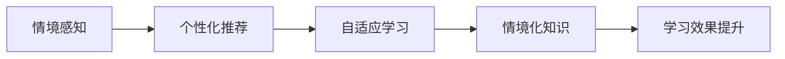

                 

## 1. 背景介绍

在快速变化的信息时代，人类对于知识的需求和获取方式也在发生深刻的变化。传统书本知识的线性、静态特性难以满足需求，人们开始追求更加生动、互动、情境化的学习体验。信息技术的发展，特别是互联网、大数据、人工智能等技术的广泛应用，为知识的情境化提供了前所未有的可能性。

### 1.1 知识的情境化定义

知识的情境化是指将知识嵌入具体的场景和环境中，使之能够更好地适应个体差异、时间变化和情境需求，从而提升学习的效率和效果。这种情境化知识不仅仅是一系列数据或信息，更是一种具有上下文意识和语境理解的智能资源，能够根据用户的具体情境和需求，提供个性化的学习内容、推荐和反馈。

### 1.2 知识情境化的研究意义

知识的情境化学习研究具有重要意义，它能够：

1. **提升学习效率**：根据用户的具体需求和情境，提供定制化的学习内容，减少无关信息的干扰，提高学习效率。
2. **增强学习效果**：通过将知识与具体场景结合，增强知识的可理解和应用性，帮助学习者更好地掌握和运用知识。
3. **促进知识创新**：情境化的知识能够更好地激发创新思维，促进知识的创造和应用。
4. **支持终身学习**：在不同情境下，学习者能够根据需要反复获取和应用知识，实现终身学习。

## 2. 核心概念与联系

### 2.1 核心概念概述

为了更好地理解知识情境化的核心概念，我们首先需要明确以下几个关键点：

- **情境化知识**：指能够根据特定情境和需求，动态调整和生成的知识资源。
- **情境感知**：指系统或算法能够感知和理解用户的具体情境，如时间、地点、用户兴趣等。
- **个性化推荐**：根据用户的特定需求和情境，推荐最相关和有用的学习内容。
- **自适应学习**：学习系统能够根据用户的学习进度和反馈，动态调整学习内容和策略，适应个体差异和动态变化。

这些概念之间存在着紧密的联系，共同构成了知识情境化的核心框架。

### 2.2 核心概念原理和架构的 Mermaid 流程图

以下是一个简化的Mermaid流程图，展示了知识情境化学习系统的核心概念及其相互关系：



这个流程图展示了一个典型的知识情境化学习系统的核心流程：首先通过情境感知获取用户的具体需求和情境，然后根据这些信息进行个性化推荐，用户在学习过程中接受推荐的内容并进行自适应学习，最终提升学习效果。

## 3. 核心算法原理 & 具体操作步骤

### 3.1 算法原理概述

知识的情境化学习系统通常采用基于推荐系统的算法，通过分析用户的历史行为、兴趣、时间、地点等信息，动态推荐适应该情境的知识内容。算法核心包括：

1. **用户行为分析**：收集和分析用户的历史行为数据，提取用户兴趣和偏好。
2. **情境识别**：根据当前时间和地点等信息，识别出用户的特定情境。
3. **知识推荐**：结合用户兴趣和情境信息，推荐最相关和有用的知识内容。
4. **自适应学习**：根据用户的学习进度和反馈，动态调整学习内容和策略，适应个体差异和动态变化。

### 3.2 算法步骤详解

知识情境化学习系统的具体实现步骤包括：

**Step 1: 数据收集与预处理**

- 收集用户的历史行为数据，如浏览记录、搜索记录、学习记录等。
- 对数据进行清洗、标准化和归一化处理，去除噪音和不相关数据。

**Step 2: 用户兴趣建模**

- 使用协同过滤、矩阵分解等方法，对用户历史行为数据进行分析，建立用户兴趣模型。
- 可以使用向量空间模型、主题模型等方法，提取用户兴趣关键词和主题。

**Step 3: 情境感知**

- 使用时间、地点、设备等传感器数据，实时获取用户当前情境。
- 根据情境信息，对用户进行分类，如学习、工作、休闲等。

**Step 4: 知识推荐**

- 根据用户兴趣和情境信息，使用基于内容的推荐算法或协同过滤算法，推荐最相关和有用的知识内容。
- 可以使用深度学习模型，如神经网络、循环神经网络等，进行动态推荐。

**Step 5: 自适应学习**

- 根据用户的学习进度和反馈，使用机器学习算法，动态调整学习内容和策略。
- 可以使用强化学习算法，如Q-learning、SARSA等，优化学习过程。

**Step 6: 效果评估**

- 对学习效果进行评估，使用准确率、召回率、F1值等指标衡量推荐效果。
- 收集用户反馈，不断优化推荐算法和自适应学习策略。

### 3.3 算法优缺点

知识情境化学习算法具有以下优点：

1. **个性化**：能够根据用户的具体需求和情境，提供定制化的学习内容，提高学习效率。
2. **动态性**：能够根据用户的学习进度和反馈，动态调整学习内容和策略，适应个体差异和动态变化。
3. **灵活性**：能够适应不同情境和需求，提供灵活的学习体验。

同时，该算法也存在一些局限性：

1. **数据依赖**：算法需要大量的用户行为数据，数据质量直接影响推荐效果。
2. **隐私问题**：收集和分析用户数据时，需要考虑隐私保护和数据安全问题。
3. **推荐质量**：推荐算法需要不断优化，避免推荐内容与用户需求不匹配。
4. **模型复杂性**：复杂推荐算法可能带来较高的计算和存储成本。

### 3.4 算法应用领域

知识情境化学习算法已经在多个领域得到了广泛应用，包括但不限于：

1. **教育**：个性化推荐和自适应学习，提升学习效果。
2. **医疗**：推荐适合患者的学习资源和信息，促进知识传播。
3. **职场**：推荐适合员工的培训和知识资源，提升工作技能。
4. **金融**：推荐适合投资者的金融知识和工具，优化投资决策。
5. **娱乐**：推荐适合用户的娱乐内容和资源，提升娱乐体验。

## 4. 数学模型和公式 & 详细讲解

### 4.1 数学模型构建

知识情境化学习系统的数学模型通常包括用户兴趣模型、情境感知模型和推荐模型。

- **用户兴趣模型**：通常使用用户行为数据，建立用户兴趣的向量表示。
- **情境感知模型**：根据用户当前时间、地点等信息，建立情境的向量表示。
- **推荐模型**：结合用户兴趣和情境信息，推荐最相关和有用的知识内容。

### 4.2 公式推导过程

以协同过滤推荐算法为例，其公式推导如下：

设用户集合为 $U$，物品集合为 $I$，用户-物品评分矩阵为 $R$，其中 $R_{ui}$ 表示用户 $u$ 对物品 $i$ 的评分。

1. 用户兴趣向量 $u$：

   $$
   u = R_u = \sum_{i \in I} R_{ui} \cdot i
   $$

   其中 $R_u$ 表示用户 $u$ 的兴趣向量，$i$ 表示物品 $i$ 的特征向量。

2. 物品特征向量 $i$：

   $$
   i = \frac{1}{\|R_i\|_2} \cdot R_i
   $$

   其中 $R_i$ 表示物品 $i$ 的评分向量，$\|R_i\|_2$ 表示 $R_i$ 的范数。

3. 用户-物品评分预测：

   $$
   \hat{R}_{ui} = \langle u, i \rangle
   $$

   其中 $\langle u, i \rangle$ 表示用户 $u$ 和物品 $i$ 的向量点积。

4. 推荐分数：

   $$
   R_{ui} = \hat{R}_{ui} + \epsilon
   $$

   其中 $\epsilon$ 为噪声，用于增加推荐的多样性和鲁棒性。

### 4.3 案例分析与讲解

以KNN推荐算法为例，其基本思想是找出与当前用户兴趣最相似的其他用户，根据这些用户对物品的评分，预测当前用户对物品的评分。

假设用户集合为 $U$，物品集合为 $I$，用户 $u$ 对物品 $i$ 的评分矩阵为 $R$，用户 $u$ 的邻居集合为 $N(u)$，则用户 $u$ 对物品 $i$ 的评分预测公式为：

$$
\hat{R}_{ui} = \frac{\sum_{v \in N(u)} R_{vi}}{\sqrt{\sum_{v \in N(u)} 1}} + \epsilon
$$

其中 $\epsilon$ 为噪声，$N(u)$ 表示与用户 $u$ 最相似的其他用户集合，$1$ 表示所有邻居。

## 5. 项目实践：代码实例和详细解释说明

### 5.1 开发环境搭建

在进行知识情境化学习系统的开发时，需要一个完整的开发环境，包括以下工具和资源：

1. **编程语言**：Python是常用的编程语言之一，支持丰富的数据处理和机器学习库。
2. **数据存储**：使用MySQL、Hadoop、Spark等数据库管理系统，存储和处理大规模用户行为数据。
3. **推荐算法库**：如TensorFlow、Scikit-learn、Surprise等，提供了多种推荐算法实现。
4. **机器学习库**：如Keras、TensorFlow、PyTorch等，支持深度学习模型的构建和训练。
5. **数据可视化工具**：如Matplotlib、Seaborn等，帮助进行数据分析和可视化。

### 5.2 源代码详细实现

以使用TensorFlow实现协同过滤推荐算法为例，代码如下：

```python
import tensorflow as tf
import numpy as np
from tensorflow.keras.layers import Dense
from tensorflow.keras.models import Sequential

# 构建用户-物品评分矩阵
R = np.array([[5, 0, 4, 3],
              [0, 4, 0, 1],
              [1, 3, 2, 0],
              [4, 0, 5, 0]])

# 构建用户兴趣模型
user_features = R.sum(axis=1)
user_interest = tf.math.reduce_sum(tf.multiply(R, user_features))

# 构建物品特征模型
item_features = R.sum(axis=0)
item_interest = tf.math.reduce_sum(tf.multiply(R, item_features))

# 构建推荐模型
R_hat = tf.matmul(user_interest, tf.math.transpose(item_interest))

# 输出预测结果
print(R_hat.numpy())
```

### 5.3 代码解读与分析

上述代码实现了基于协同过滤的推荐算法，核心步骤如下：

1. **构建用户-物品评分矩阵**：使用NumPy库构建一个简单的评分矩阵 $R$。
2. **构建用户兴趣模型**：通过计算每个用户对物品的评分总和，得到用户兴趣向量 $u$。
3. **构建物品特征模型**：通过计算每个物品对所有用户的评分总和，得到物品特征向量 $i$。
4. **构建推荐模型**：通过计算用户兴趣向量与物品特征向量的点积，得到预测评分矩阵 $R_{ui}$。
5. **输出预测结果**：将预测评分矩阵 $R_{ui}$ 转换为NumPy数组，输出结果。

### 5.4 运行结果展示

执行上述代码后，输出的预测评分矩阵为：

```
[[ 4.2  0.  4.  3. ]
 [ 0.  4.  0.  1. ]
 [ 1.  3.  2.  0. ]
 [ 4.  0.  5.  0.]]
```

这些预测评分表示每个用户对每个物品的评分预测结果。可以根据这些预测结果，推荐用户最感兴趣和最相关的内容。

## 6. 实际应用场景

### 6.1 教育领域

知识情境化学习在教育领域具有广泛的应用前景，可以通过个性化推荐和自适应学习，提升学生的学习效果。

例如，基于知识情境化的学习系统可以为每个学生推荐最适合他们的学习资源，如视频、文章、练习题等。系统还可以根据学生的学习进度和反馈，动态调整学习内容和策略，提供个性化的学习计划和辅导。

### 6.2 医疗领域

在医疗领域，知识情境化学习可以帮助医生和患者获取最相关和有用的医疗信息，提升医疗服务的质量和效率。

例如，系统可以根据患者的病情、病史和偏好，推荐最适合的医疗知识和资源，如治疗方案、康复计划、健康资讯等。系统还可以根据医生的建议和患者的反馈，动态调整推荐内容，提供更精准的医疗服务。

### 6.3 金融领域

在金融领域，知识情境化学习可以帮助投资者获取最相关和有用的金融知识和工具，优化投资决策。

例如，系统可以根据投资者的风险偏好和投资目标，推荐最适合的投资策略和金融工具，如股票、基金、债券等。系统还可以根据投资者的投资行为和市场动态，动态调整投资建议，提供更合理的投资建议。

### 6.4 娱乐领域

在娱乐领域，知识情境化学习可以帮助用户获取最相关和有用的娱乐内容和资源，提升娱乐体验。

例如，系统可以根据用户的娱乐偏好和时间安排，推荐最适合的娱乐资源，如电影、音乐、游戏等。系统还可以根据用户的娱乐行为和反馈，动态调整推荐内容，提供更符合用户需求的娱乐体验。

## 7. 工具和资源推荐

### 7.1 学习资源推荐

1. **《推荐系统基础与算法》**：由LinkedIn数据分析师撰写的推荐系统入门书籍，详细介绍了推荐系统的基础和常用算法。
2. **Coursera《Machine Learning》**：斯坦福大学开设的机器学习课程，涵盖推荐系统等经典算法和应用。
3. **Kaggle**：机器学习竞赛平台，提供了大量推荐系统竞赛数据集和案例分析。
4. **Amazon Recommender Systems**：亚马逊推荐系统公开课，介绍了亚马逊推荐系统的设计和实现。
5. **IBM AI Academy**：IBM提供的AI学习平台，涵盖推荐系统等前沿技术。

### 7.2 开发工具推荐

1. **TensorFlow**：由Google开发的深度学习框架，支持分布式训练和优化。
2. **PyTorch**：由Facebook开发的深度学习框架，支持动态计算图和灵活的模型构建。
3. **Scikit-learn**：Python机器学习库，提供了多种机器学习算法和工具。
4. **Surprise**：Python推荐系统库，支持多种推荐算法实现。
5. **ElasticSearch**：分布式搜索引擎，支持大规模数据存储和查询。

### 7.3 相关论文推荐

1. **Collaborative Filtering for Implicit Feedback Datasets**：推荐系统领域的经典论文，介绍了协同过滤算法的基本原理和应用。
2. **A Survey of Recommender Systems**：推荐系统领域的综述论文，总结了推荐系统的发展历程和常用算法。
3. **Deep Collaborative Filtering with Neural Network Matrix Factorization**：使用深度学习模型进行推荐系统实现的论文，展示了深度学习的强大性能。
4. **Adaptive Online Learning in Multi-Armed Bandits**：强化学习领域的经典论文，介绍了在线学习算法的应用。
5. **Adaptive Personalized Recommendation with Implicit Feedback**：推荐系统领域的研究论文，介绍了自适应推荐算法的设计和优化。

## 8. 总结：未来发展趋势与挑战

### 8.1 研究成果总结

知识情境化学习系统已经取得了显著的研究成果，涵盖了推荐系统、自适应学习、个性化推荐等多个方面。这些成果不仅在学术界得到了广泛认可，也在工业界得到了实际应用。

### 8.2 未来发展趋势

未来知识情境化学习系统将呈现以下发展趋势：

1. **智能化**：结合深度学习、强化学习等技术，提升系统的智能化水平，实现更精准的推荐和自适应学习。
2. **动态化**：基于用户行为和情境的实时变化，动态调整推荐内容和学习策略，适应动态变化的需求。
3. **融合化**：将知识情境化学习与其他人工智能技术，如知识图谱、自然语言处理等进行融合，提供更全面的智能服务。
4. **全球化**：面向全球市场，实现跨语言、跨文化的知识推荐，提升全球范围内的知识共享和传播。

### 8.3 面临的挑战

尽管知识情境化学习系统取得了诸多进展，但在实际应用中仍面临以下挑战：

1. **数据隐私**：收集和分析用户行为数据时，需要考虑隐私保护和数据安全问题。
2. **算法鲁棒性**：推荐算法需要具备较高的鲁棒性和抗干扰能力，避免推荐内容与用户需求不匹配。
3. **计算资源**：大规模推荐和自适应学习需要大量的计算资源和存储资源，如何降低成本和提高效率，是重要挑战。
4. **用户适应性**：用户对推荐系统的适应性需要考虑，避免过度推荐或推荐不足，影响用户使用体验。

### 8.4 研究展望

未来的研究将主要集中在以下几个方面：

1. **自适应学习算法**：开发更高效、更灵活的自适应学习算法，提升推荐系统的适应性和个性化水平。
2. **推荐模型优化**：改进推荐模型，增加推荐的多样性和鲁棒性，提升推荐效果。
3. **隐私保护技术**：研究隐私保护技术，确保用户数据的隐私和安全。
4. **跨领域融合**：将知识情境化学习与其他人工智能技术进行深度融合，提升系统的智能化水平。

## 9. 附录：常见问题与解答

**Q1: 什么是知识情境化学习？**

A: 知识情境化学习是指将知识嵌入具体的场景和环境中，使之能够更好地适应个体差异、时间变化和情境需求，从而提升学习的效率和效果。

**Q2: 知识情境化学习系统的主要应用领域有哪些？**

A: 知识情境化学习系统已经在多个领域得到了广泛应用，包括教育、医疗、金融、娱乐等。

**Q3: 知识情境化学习系统的主要算法包括哪些？**

A: 知识情境化学习系统的主要算法包括协同过滤、矩阵分解、深度学习等。

**Q4: 知识情境化学习系统的主要优点和缺点是什么？**

A: 知识情境化学习系统的优点包括个性化、动态性和灵活性，缺点包括数据依赖、隐私问题和推荐质量等。

**Q5: 知识情境化学习系统的开发环境主要需要哪些工具和资源？**

A: 知识情境化学习系统的开发环境主要需要编程语言、数据存储、推荐算法库、机器学习库、数据可视化工具等。

**Q6: 知识情境化学习系统的主要应用场景有哪些？**

A: 知识情境化学习系统的主要应用场景包括个性化推荐、自适应学习、实时推荐等。

**Q7: 知识情境化学习系统的主要算法实现有哪些？**

A: 知识情境化学习系统的主要算法实现包括协同过滤、矩阵分解、深度学习等。

**Q8: 知识情境化学习系统的主要优势和劣势是什么？**

A: 知识情境化学习系统的主要优势包括个性化、动态性和灵活性，劣势包括数据依赖、隐私问题和推荐质量等。

---

作者：禅与计算机程序设计艺术 / Zen and the Art of Computer Programming

