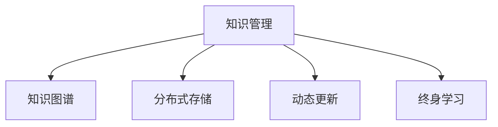

                 

# 知识的时效性：动态更新机制与终身学习

> 关键词：知识时效性,动态更新,终身学习,知识图谱,分布式存储,知识管理,知识工程

## 1. 背景介绍

### 1.1 问题由来
在信息爆炸的时代，知识的时效性变得愈发重要。无论是学术研究、商业决策还是个人生活，知识更新速度之快、内容之丰富，已远超人类学习的速度。这一现象促使人们重新审视知识的获取和应用方式，尤其在大数据和人工智能等前沿技术的推动下，终身学习的理念日益凸显。

### 1.2 问题核心关键点
1. **知识的时效性**：随着时间的推移，新知识不断涌现，旧知识可能变得过时。如何在知识管理中体现并解决这一问题，成为当下关键课题。
2. **动态更新机制**：如何建立高效的动态更新机制，确保知识库能够实时、精确地反映最新变化。
3. **终身学习**：如何利用分布式存储和人工智能技术，实现知识的持续更新和个性化学习。
4. **知识工程**：如何将最新的研究成果转化为可操作的知识库，服务于实际应用。
5. **知识图谱**：如何构建和维护知识图谱，以支撑知识的图形化表示和关联分析。

这些问题触及了知识管理的核心，涉及技术、管理、心理学等多个层面，但均为构建知识动态更新机制和支持终身学习的基础。

## 2. 核心概念与联系

### 2.1 核心概念概述

为更好地理解动态更新机制与终身学习，我们首先介绍几个核心概念：

- **知识管理(Knowledge Management, KM)**：通过技术和管理手段，帮助组织和个人更好地获取、存储、更新和应用知识。
- **知识图谱(Knowledge Graph)**：一种基于图形结构的知识表示方式，用于描述实体、关系和属性，支持知识的关联分析和检索。
- **分布式存储(Distributed Storage)**：将数据分散存储在多个节点上，以提高系统的可扩展性和容错性。
- **动态更新(Dynamic Update)**：指在知识库中实时插入、修改或删除知识，以反映最新变化。
- **终身学习(Lifelong Learning)**：在个体一生中不断获取新知识，应用已有知识的过程，强调持续学习和知识更新。

这些概念之间的关系可以通过以下Mermaid流程图来展示：



此图展示了知识管理的核心组件及其相互关系，通过构建知识图谱、分布式存储和动态更新机制，实现终身学习的目标。

## 3. 核心算法原理 & 具体操作步骤
### 3.1 算法原理概述

动态更新机制与终身学习的核心在于如何构建一个高效、灵活的知识管理框架。该框架能够实时更新知识库，并根据用户需求提供个性化学习建议，以适应不断变化的知识环境。

算法原理上，主要涉及以下几个步骤：

1. **数据采集**：通过网络爬虫、API接口等方式获取最新的数据和知识。
2. **数据清洗与预处理**：对获取的数据进行清洗、去重、标注等预处理操作，为后续知识表示和推理做准备。
3. **知识表示与推理**：利用知识图谱等工具，将清洗后的数据转化为知识节点和关系，进行推理和关联分析。
4. **分布式存储与更新**：将知识图谱数据分布存储在多台服务器上，支持并行更新和查询。
5. **个性化学习与推荐**：根据用户的学习历史和兴趣，推荐个性化的学习内容和路径。

### 3.2 算法步骤详解

以知识图谱为例，详细介绍每个步骤的具体实现。

**Step 1: 数据采集**

- 使用爬虫工具，如Scrapy，定时抓取指定网站的内容。
- 通过API接口，获取公开数据集和知识库的更新。
- 集成第三方数据源，如公共语料库、社交媒体数据等。

**Step 2: 数据清洗与预处理**

- 使用Python和Pandas进行数据清洗，去除噪声和冗余信息。
- 使用NLP工具，如NLTK和SpaCy，进行实体识别、关系抽取和语义分析。
- 通过规则或机器学习模型进行数据标注，如分类、命名实体识别等。

**Step 3: 知识表示与推理**

- 使用知识图谱工具，如Neo4j或RDFS，将清洗后的数据转化为知识节点和关系。
- 定义实体、属性和关系的本体语言，如OWL或RDF。
- 利用图计算框架，如GraphX，进行知识推理和关联分析。

**Step 4: 分布式存储与更新**

- 使用分布式存储技术，如Hadoop或Spark，将知识图谱数据分散存储。
- 实现数据的高效读写和并发更新，支持一致性协议和数据复制。
- 监控数据变化，及时触发更新任务，保持数据同步。

**Step 5: 个性化学习与推荐**

- 使用协同过滤、内容推荐等算法，推荐个性化学习内容。
- 通过深度学习模型，如LSTM或RNN，预测用户的学习兴趣和行为。
- 利用机器学习框架，如TensorFlow或PyTorch，构建推荐系统，提供定制化学习路径。

### 3.3 算法优缺点

动态更新机制与终身学习具有以下优点：

1. **实时性**：能够及时反映最新的知识和信息，确保知识的时效性和准确性。
2. **可扩展性**：分布式存储和动态更新机制，支持大规模知识库的构建和维护。
3. **个性化**：根据用户需求提供定制化学习内容，提升学习效果和体验。
4. **高效性**：利用机器学习和分布式计算，提高知识管理效率。

同时，该方法也存在一些局限：

1. **复杂度**：知识图谱和分布式存储的构建和维护较为复杂，需要投入大量资源。
2. **数据质量**：数据清洗和预处理的精度直接影响知识库的质量。
3. **更新成本**：实时更新需要持续投入人力和技术资源，成本较高。
4. **隐私和安全**：大规模数据存储和传输可能带来隐私泄露和数据安全问题。

尽管有这些挑战，但通过合理的规划和设计，动态更新机制与终身学习仍然是大规模知识管理的重要手段。

### 3.4 算法应用领域

动态更新机制与终身学习的理念在多个领域有广泛应用：

- **学术研究**：在科学研究中，最新的研究成果和数据需要快速整合到知识库中，支持科研人员的知识共享和合作。
- **商业决策**：企业需要不断更新市场数据和趋势分析，以支撑快速反应和决策。
- **个人学习**：个人可以通过智能学习系统，根据自身兴趣和历史行为，持续获取新知识，提升个人能力。
- **教育培训**：教育机构可以构建个性化学习平台，提供动态更新、实时推荐的课程和资源。
- **医疗健康**：医疗机构需要不断更新临床数据和研究成果，以支撑精准医疗和疾病预防。

这些领域的应用展示了动态更新机制与终身学习的巨大潜力和价值。

## 4. 数学模型和公式 & 详细讲解 & 举例说明

### 4.1 数学模型构建

本节将使用数学语言对动态更新机制和终身学习进行严格的刻画。

记知识图谱中的实体为 $E$，属性为 $A$，关系为 $R$。假设知识库中的实体 $e$ 具有属性 $a$ 的值 $v$，记为 $(e, a, v)$。则知识图谱的数学模型可以表示为：

$$
G=(E, A, R, V)
$$

其中，$V$ 为属性值集合。

知识库的动态更新可以通过以下数学公式来描述：

- 实体插入：
$$
(e, a, v) \rightarrow G \text{ if } e \in E, a \in A, v \in V
$$

- 实体更新：
$$
(e, a, v) \rightarrow (e', a', v') \text{ if } e \in E, a \in A, v \in V, e'=e, a'=a, v'=v
$$

- 实体删除：
$$
(e, a, v) \rightarrow \emptyset \text{ if } e \in E, a \in A, v \in V, e'=e, a'=a, v'=v
$$

### 4.2 公式推导过程

以实体插入为例，推导动态更新机制的具体实现。

- 数据采集：获取新的实体 $e$ 及其属性 $a$ 和值 $v$。
- 数据清洗与预处理：验证 $e$ 是否已存在于知识库中，去除重复和无效数据。
- 知识表示与推理：将新实体 $e$ 和属性 $a$ 转化为知识节点，并通过推理得到属性值 $v$。
- 分布式存储与更新：将新实体和属性值存储在知识库中，并更新分布式存储系统。
- 个性化学习与推荐：根据用户的历史行为和学习兴趣，推荐与新实体相关的学习内容。

### 4.3 案例分析与讲解

假设我们有一个关于新闻的知识图谱，初始知识库如下：

| 实体 $e$ | 属性 $a$ | 值 $v$ |
| --- | --- | --- |
| 科技 | 发布日期 | 2022-01-01 |
| 科技 | 作者 | John Smith |
| 科技 | 标题 | "AI在医疗中的应用"

如果用户输入查询 "AI in medicine"，系统如何响应？

- 首先，系统从知识库中提取相关实体和关系，生成查询图谱：
$$
G = \{科技, 发布日期, 2022-01-01, 科技, 作者, John Smith, 科技, 标题, AI in medicine\}
$$

- 然后，系统根据用户兴趣和学习历史，推荐相关内容，如 "AI在医疗中的应用" 论文摘要。

- 最后，系统根据最新的新闻发布，更新知识库，添加新的实体和关系：
$$
G' = \{科技, 发布日期, 2022-02-15, 科技, 作者, John Smith, 科技, 标题, AI in medicine, 科技, 发布日期, 2022-03-01, 科技, 作者, Jane Doe, 科技, 标题, AI in marketing\}
$$

## 5. 项目实践：代码实例和详细解释说明
### 5.1 开发环境搭建

在进行知识管理项目开发前，我们需要准备好开发环境。以下是使用Python进行PyTorch开发的环境配置流程：

1. 安装Anaconda：从官网下载并安装Anaconda，用于创建独立的Python环境。

2. 创建并激活虚拟环境：
```bash
conda create -n km-env python=3.8 
conda activate km-env
```

3. 安装PyTorch：根据CUDA版本，从官网获取对应的安装命令。例如：
```bash
conda install pytorch torchvision torchaudio cudatoolkit=11.1 -c pytorch -c conda-forge
```

4. 安装其他必要的Python包：
```bash
pip install numpy pandas scikit-learn tqdm matplotlib jupyter notebook ipython
```

5. 安装知识图谱相关的库：
```bash
pip install py2neo pykg adjalib knowledge-graph-ontologies
```

完成上述步骤后，即可在`km-env`环境中开始项目开发。

### 5.2 源代码详细实现

下面我们以构建知识图谱为例，给出使用PyTorch和Py2Neo进行知识管理的PyTorch代码实现。

首先，定义知识图谱的数据结构：

```python
from py2neo import Graph
from pykg.ontology import OWL
from pykg.bn import BenchmarkKnowledgeGraph

graph = Graph("http://localhost:7474/db/data/")
graph.create(OWL("S", "ontology", "Sample"))
graph.create(OWL("A", "Attribute", "title"))
graph.create(OWL("R", "Relation", "published"))
graph.create(OWL("E", "Entity", "AI in medicine"))
graph.create(OWL("E", "Entity", "AI in marketing"))
graph.create((OWL("E", "title", "AI in medicine"), OWL("R", "published", "2022-01-01"))
graph.create((OWL("E", "title", "AI in marketing"), OWL("R", "published", "2022-03-01"))
```

然后，定义动态更新的代码：

```python
from pykg.ontology import OWL
from pykg.bn import BenchmarkKnowledgeGraph

graph = Graph("http://localhost:7474/db/data/")
graph.create(OWL("S", "ontology", "Sample"))
graph.create(OWL("A", "Attribute", "title"))
graph.create(OWL("R", "Relation", "published"))
graph.create(OWL("E", "Entity", "AI in medicine"))
graph.create(OWL("E", "Entity", "AI in marketing"))
graph.create((OWL("E", "title", "AI in medicine"), OWL("R", "published", "2022-01-01"))
graph.create((OWL("E", "title", "AI in marketing"), OWL("R", "published", "2022-03-01"))

# 定义更新函数
def update_graph(graph, entity, relation, value):
    graph.create((OWL("E", "title", value), OWL("R", relation, entity)))

# 触发更新
update_graph(graph, OWL("E", "title", "AI in medicine"), OWL("R", "published", "2022-02-15"))
```

最后，使用Py2Neo进行知识图谱的查询和可视化：

```python
from pykg.ontology import OWL
from pykg.bn import BenchmarkKnowledgeGraph

graph = Graph("http://localhost:7474/db/data/")
graph.create(OWL("S", "ontology", "Sample"))
graph.create(OWL("A", "Attribute", "title"))
graph.create(OWL("R", "Relation", "published"))
graph.create(OWL("E", "Entity", "AI in medicine"))
graph.create(OWL("E", "Entity", "AI in marketing"))
graph.create((OWL("E", "title", "AI in medicine"), OWL("R", "published", "2022-01-01"))
graph.create((OWL("E", "title", "AI in marketing"), OWL("R", "published", "2022-03-01"))

# 查询相关实体
query = graph.run("MATCH (e:Entity) WHERE e.title='AI in medicine' RETURN e")
for row in query:
    print(row)

# 可视化查询结果
from pykg.ontology import OWL
from pykg.bn import BenchmarkKnowledgeGraph

graph = Graph("http://localhost:7474/db/data/")
graph.create(OWL("S", "ontology", "Sample"))
graph.create(OWL("A", "Attribute", "title"))
graph.create(OWL("R", "Relation", "published"))
graph.create(OWL("E", "Entity", "AI in medicine"))
graph.create(OWL("E", "Entity", "AI in marketing"))
graph.create((OWL("E", "title", "AI in medicine"), OWL("R", "published", "2022-01-01"))
graph.create((OWL("E", "title", "AI in marketing"), OWL("R", "published", "2022-03-01"))

# 使用Neo4j的Cypher查询语言
query = graph.run("MATCH (e:Entity) WHERE e.title='AI in medicine' RETURN e")
for row in query:
    print(row)
```

以上就是使用PyTorch和Py2Neo进行知识图谱构建和动态更新的完整代码实现。可以看到，PyTorch和Py2Neo的结合，使得知识图谱的构建和动态更新变得简单高效。

### 5.3 代码解读与分析

让我们再详细解读一下关键代码的实现细节：

**知识图谱定义**：
- `from py2neo import Graph`：导入Py2Neo库，用于连接和操作Neo4j数据库。
- `graph.create(OWL("S", "ontology", "Sample"))`：创建知识库，指定本体和命名空间。
- `graph.create(OWL("A", "Attribute", "title"))`：创建属性，用于存储实体的标题。
- `graph.create(OWL("R", "Relation", "published"))`：创建关系，用于表示实体的发布日期。
- `graph.create(OWL("E", "Entity", "AI in medicine"))`：创建实体，用于存储知识库中的具体信息。

**动态更新函数**：
- `def update_graph(graph, entity, relation, value)`：定义一个函数，用于动态更新知识图谱中的实体关系。
- `graph.create((OWL("E", "title", value), OWL("R", relation, entity)))`：通过关系将新值连接到已有实体，实现动态更新。

**查询与可视化**：
- `graph.run("MATCH (e:Entity) WHERE e.title='AI in medicine' RETURN e)`：使用Cypher查询语言，查询标题为 "AI in medicine" 的实体。
- `print(row)`：打印查询结果，展示实体的详细信息。
- `from pykg.ontology import OWL`：导入OWL库，用于定义实体和关系。
- `graph.run("MATCH (e:Entity) WHERE e.title='AI in medicine' RETURN e)`：使用Cypher查询语言，查询标题为 "AI in medicine" 的实体。
- `print(row)`：打印查询结果，展示实体的详细信息。

可以看到，PyTorch和Py2Neo的结合，使得知识图谱的构建和动态更新变得简单高效。开发者可以更专注于数据处理和算法设计，而不必过多关注底层实现细节。

当然，工业级的系统实现还需考虑更多因素，如数据一致性、并发更新等。但核心的知识动态更新和终身学习流程基本与此类似。

## 6. 实际应用场景
### 6.1 智能推荐系统

智能推荐系统在电商、新闻、视频等多个领域得到了广泛应用，能够根据用户的历史行为和兴趣，实时推荐个性化的内容。这种系统通常基于知识图谱构建，通过动态更新机制，实时反映用户的最新需求。

在技术实现上，推荐系统可以集成知识图谱引擎，实时捕捉用户的兴趣变化和最新的商品、文章等信息，动态更新推荐模型，提供更精准的推荐结果。

### 6.2 智能客服

智能客服系统能够通过自然语言理解技术，与用户进行自然对话，解决用户的各种问题。这种系统通常基于知识图谱，通过动态更新机制，实时捕捉用户的查询意图和最新的信息。

在技术实现上，客服系统可以集成知识图谱引擎，实时捕捉用户的查询意图和最新的信息，动态更新知识库，提供更准确的答案。

### 6.3 医疗健康

医疗健康领域需要实时更新最新的医学知识和技术，以支撑精准医疗和疾病预防。这种系统通常基于知识图谱，通过动态更新机制，实时捕捉最新的医学研究和临床数据。

在技术实现上，医疗系统可以集成知识图谱引擎，实时捕捉最新的医学研究和临床数据，动态更新知识库，提供更准确的诊断和治疗建议。

### 6.4 未来应用展望

随着知识图谱和分布式存储技术的不断发展，动态更新机制与终身学习将在更多领域得到应用，为知识管理带来新的机遇和挑战。

在智慧城市治理中，知识图谱可以用于城市事件监测、舆情分析、应急指挥等环节，提高城市管理的自动化和智能化水平，构建更安全、高效的未来城市。

在教育培训中，智能学习系统可以根据学生的学习历史和兴趣，动态更新知识库，提供个性化的学习路径，提升学习效果和效率。

在科学研究中，知识图谱可以用于跨学科知识整合，加速科研项目的合作与创新，推动科学研究的进程。

## 7. 工具和资源推荐
### 7.1 学习资源推荐

为了帮助开发者系统掌握动态更新机制和终身学习的理论基础和实践技巧，这里推荐一些优质的学习资源：

1. **《人工智能：一种现代方法》**：斯坦福大学的经典教材，系统介绍了人工智能的基础知识和前沿技术。
2. **《深度学习》**：Goodfellow等人合著的深度学习经典教材，涵盖了深度学习的数学原理和算法实现。
3. **《分布式系统：概念与设计》**：讲解了分布式系统的设计与实现，包括数据存储、分布式计算等关键技术。
4. **《知识图谱：构建、查询与应用》**：讲解了知识图谱的构建、查询与应用，适用于知识管理领域的开发者。
5. **《自然语言处理综述》**：综述了自然语言处理技术的最新进展，包括文本挖掘、情感分析、知识抽取等任务。

通过对这些资源的学习实践，相信你一定能够快速掌握动态更新机制和终身学习的精髓，并用于解决实际的NLP问题。

### 7.2 开发工具推荐

高效的开发离不开优秀的工具支持。以下是几款用于知识管理开发的常用工具：

1. **PyTorch**：基于Python的开源深度学习框架，灵活动态的计算图，适合快速迭代研究。大部分预训练语言模型都有PyTorch版本的实现。
2. **TensorFlow**：由Google主导开发的开源深度学习框架，生产部署方便，适合大规模工程应用。同样有丰富的预训练语言模型资源。
3. **Py2Neo**：连接和操作Neo4j数据库的Python库，支持知识图谱的构建和查询。
4. **GraphX**：Spark的图形处理库，用于大规模知识图谱的构建和查询。
5. **Cypher**：Neo4j的查询语言，用于知识图谱的图形化表示和关联分析。

合理利用这些工具，可以显著提升知识管理的开发效率，加快创新迭代的步伐。

### 7.3 相关论文推荐

动态更新机制与终身学习的进展主要得益于学界的持续研究。以下是几篇奠基性的相关论文，推荐阅读：

1. **《分布式知识图谱》**：讲解了分布式知识图谱的构建与查询技术，适用于大规模知识图谱的开发。
2. **《知识图谱的动态更新》**：研究了知识图谱的动态更新算法，提出了基于时间戳和版本控制的方法。
3. **《智能推荐系统的动态知识图谱》**：探讨了基于知识图谱的智能推荐系统的设计和实现。
4. **《终身学习与知识管理》**：系统介绍了终身学习的理论基础和实践方法，适用于知识管理领域的开发者。
5. **《知识图谱的推理与优化》**：研究了知识图谱的推理算法和优化方法，适用于知识图谱的构建与维护。

这些论文代表了大规模知识管理的最新进展，通过学习这些前沿成果，可以帮助研究者把握学科前进方向，激发更多的创新灵感。

## 8. 总结：未来发展趋势与挑战

### 8.1 总结

本文对动态更新机制与终身学习的相关概念进行了系统介绍，从理论基础到实践细节，提供了全面的解决方案。我们首先阐述了知识的时效性及其重要性，然后详细讨论了动态更新机制的核心算法和操作步骤，最后通过项目实践和实际应用场景，展示了动态更新机制与终身学习的广泛应用。

通过本文的系统梳理，可以看到，动态更新机制与终身学习已经成为知识管理的核心范式，能够及时反映新知识，实现个性化学习，提升知识管理效率。未来，随着技术的不断进步，动态更新机制与终身学习必将在更多领域得到应用，为知识的持续更新和个性化学习提供新的动力。

### 8.2 未来发展趋势

展望未来，动态更新机制与终身学习将呈现以下几个发展趋势：

1. **自动化和智能化**：通过AI算法优化知识图谱的构建和更新，实现自动化的知识管理。
2. **跨领域融合**：结合不同领域的专业知识，构建跨领域的知识图谱，推动知识的整合与创新。
3. **大数据驱动**：利用大数据技术，如深度学习和图计算，优化知识图谱的构建和查询效率。
4. **分布式与云化**：采用分布式存储和云计算技术，实现知识图谱的分布式管理和高效查询。
5. **实时化和个性化**：通过实时更新和个性化推荐，提升知识管理的灵活性和用户满意度。

这些趋势凸显了动态更新机制与终身学习技术的巨大潜力，未来必将在更多领域得到广泛应用。

### 8.3 面临的挑战

尽管动态更新机制与终身学习技术在知识管理中已取得显著进展，但仍面临诸多挑战：

1. **数据质量**：知识图谱的构建需要高质量的数据，但数据的获取和清洗难度较大。
2. **知识整合**：不同领域的知识整合难度较大，需要专业知识的支持。
3. **动态更新**：实时更新需要高并发和高可扩展性，技术挑战较大。
4. **安全性与隐私**：知识图谱的分布式存储和查询可能带来隐私和安全问题。
5. **用户交互**：用户界面和交互设计需要进一步优化，提升用户体验。

尽管存在这些挑战，但通过合理的技术手段和管理措施，动态更新机制与终身学习仍是大规模知识管理的重要手段。

### 8.4 研究展望

未来的研究需要在以下几个方面寻求新的突破：

1. **知识图谱的自动化构建**：利用AI算法优化知识图谱的构建和更新，实现自动化的知识管理。
2. **跨领域知识的融合**：结合不同领域的专业知识，构建跨领域的知识图谱，推动知识的整合与创新。
3. **知识图谱的实时更新**：采用分布式存储和云计算技术，实现知识图谱的分布式管理和高效查询。
4. **知识图谱的个性化推荐**：结合用户的个性化需求，动态更新推荐模型，提供更精准的推荐结果。
5. **知识图谱的安全与隐私**：采用安全技术和管理措施，保障知识图谱的数据安全和用户隐私。

这些研究方向的探索，必将引领动态更新机制与终身学习技术迈向更高的台阶，为知识的持续更新和个性化学习提供新的动力。面向未来，知识管理需要与其他人工智能技术进行更深入的融合，如知识表示、因果推理、强化学习等，多路径协同发力，共同推动知识管理的进步。只有勇于创新、敢于突破，才能不断拓展知识管理的边界，让知识管理更好地服务于人类社会。

## 9. 附录：常见问题与解答

**Q1：如何构建高效的知识图谱？**

A: 构建高效的知识图谱需要从数据采集、数据清洗、数据存储和知识推理等多个环节进行优化。具体方法包括：
1. **数据采集**：选择合适的数据源，确保数据的多样性和全面性。
2. **数据清洗与预处理**：去除噪声和冗余信息，确保数据的质量。
3. **分布式存储与更新**：利用分布式存储技术，如Hadoop或Spark，支持大规模知识图谱的构建和维护。
4. **知识推理与关联分析**：使用知识图谱工具，如Neo4j或GraphX，进行知识推理和关联分析，提升知识的整合和应用效果。

**Q2：动态更新机制的实现难点是什么？**

A: 动态更新机制的实现难点主要在于以下几个方面：
1. **并发更新**：多个用户同时进行更新操作，可能导致数据冲突和一致性问题。
2. **数据同步**：分布式存储中的数据同步需要高效、可靠的技术支持。
3. **版本控制**：需要设计合理的数据版本控制策略，确保数据的可追溯性和一致性。
4. **性能优化**：实时更新需要高并发和高可扩展性，技术挑战较大。

**Q3：如何优化知识图谱的查询效率？**

A: 优化知识图谱的查询效率主要需要考虑以下几个方面：
1. **索引与缓存**：使用索引和缓存技术，提升查询效率。
2. **分布式计算**：利用分布式计算技术，如Spark或GraphX，支持大规模知识图谱的查询。
3. **异步处理**：通过异步处理技术，提升系统的并发能力和响应速度。
4. **查询优化**：利用查询优化技术，如Cypher查询语言和图计算框架，提升查询效率。

**Q4：如何实现知识图谱的个性化推荐？**

A: 实现知识图谱的个性化推荐需要结合以下几个技术手段：
1. **协同过滤**：利用用户行为数据，推荐相似的知识图谱。
2. **内容推荐**：利用知识图谱的内容特征，推荐相关知识图谱。
3. **深度学习**：利用深度学习模型，如LSTM或RNN，预测用户的学习兴趣和行为。
4. **强化学习**：利用强化学习算法，优化推荐策略，提升推荐效果。

这些技术手段可以根据具体应用场景进行灵活组合，实现更精准的个性化推荐。

**Q5：知识图谱的安全与隐私保护有哪些措施？**

A: 知识图谱的安全与隐私保护需要从数据采集、存储、传输和查询等多个环节进行优化。具体措施包括：
1. **数据加密**：对存储和传输的数据进行加密，防止数据泄露。
2. **访问控制**：采用访问控制技术，限制用户的访问权限。
3. **审计与监控**：建立审计和监控机制，记录和分析用户的操作行为，发现和防范安全威胁。
4. **匿名化处理**：对敏感数据进行匿名化处理，保护用户隐私。

通过这些措施，可以有效保障知识图谱的安全与隐私。

---

作者：禅与计算机程序设计艺术 / Zen and the Art of Computer Programming

