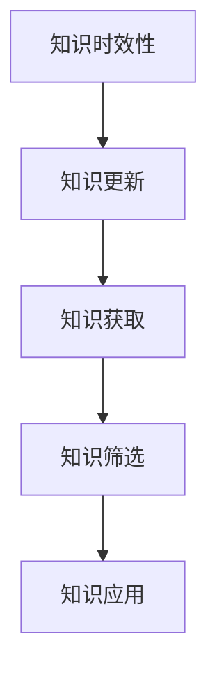
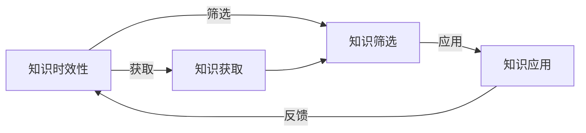

                 

## 1. 背景介绍

在快速发展的科技时代，知识的更新迭代速度日新月异。无论是软件开发、人工智能、金融分析还是医疗诊断，掌握最新知识成为保持竞争力的关键。本文将探讨知识的及时性与有效性，并提供一系列方法来帮助个人和组织维持与最新技术的同步。

### 1.1 问题由来

在许多行业中，知识的时效性对于保持专业水平和适应不断变化的技术环境至关重要。例如，软件开发人员必须跟上新的编程语言、框架和工具；金融分析师需要了解最新的市场动态和分析方法；医疗专家需要掌握最新的诊断技术和治疗方案。

然而，知识的更新速度远超个人和组织的吸收能力。如何有效识别、筛选和应用最新知识，成为每个从业者必须面对的挑战。本文将探讨这一挑战，并提出解决策略。

## 2. 核心概念与联系

### 2.1 核心概念概述

为了深入理解知识的时效性，我们首先定义几个关键概念：

- **知识时效性 (Knowledge Timeliness)**：知识的时效性指其与当前实际应用的相关性和适用性。时效性越高的知识，对当前问题和场景的指导性和适用性越强。

- **知识更新 (Knowledge Update)**：指在原有知识的基础上，获取、筛选、验证和应用新的、更先进的知识过程。知识更新有助于保持知识的时效性，使其符合当前技术和应用需求。

- **知识获取 (Knowledge Acquisition)**：通过阅读、培训、研讨、项目实践等方式，主动获取新知识的过程。有效的知识获取是知识更新的基础。

- **知识筛选 (Knowledge Filtering)**：在大量可获取知识中，基于相关性、适用性和权威性等标准，筛选出有价值的知识。

- **知识应用 (Knowledge Application)**：将筛选出的知识应用到实际项目或问题解决中，验证其有效性，并根据实际效果调整和优化。

这些概念之间的联系可以通过以下Mermaid流程图来展示：



### 2.2 核心概念原理和架构的 Mermaid 流程图



这个流程图展示了知识时效性、获取、筛选和应用之间的关系：

1. 知识时效性指导知识获取。
2. 知识获取后，需要进行筛选以确保其相关性和适用性。
3. 筛选后的知识通过应用验证其实效性。
4. 应用反馈进一步调整知识的时效性评估标准。

## 3. 核心算法原理 & 具体操作步骤

### 3.1 算法原理概述

保持知识时效性的关键在于持续的知识更新和应用。基于监督学习的知识更新方法，即通过数据分析和模型训练，识别和筛选时效性较高的知识，并应用于实际问题解决。

形式化地，假设我们有一组知识库 $\mathcal{K}=\{k_1, k_2, ..., k_n\}$，其中 $k_i$ 表示知识点。对于每个知识点 $k_i$，我们定义其时效性 $T(k_i)$，表示其与当前应用的契合度。我们的目标是通过监督学习，构建一个模型 $M$，预测知识点 $k_i$ 的时效性 $T(k_i)$。

### 3.2 算法步骤详解

基于监督学习的知识更新方法主要包括以下几个步骤：

**Step 1: 准备数据集**

- 收集历史知识库 $\mathcal{K}$ 和当前应用需求 $\mathcal{D}$。
- 为每个知识点 $k_i$，标注其时效性 $T(k_i)$。

**Step 2: 设计特征**

- 提取知识点 $k_i$ 的特征 $F_i$，如使用时间戳、领域相关性、权威性等。
- 定义特征权重 $\omega_i$，如根据领域专家的意见或权威性评估。

**Step 3: 训练模型**

- 使用历史数据 $\{(k_i, T(k_i)), i=1,2,...,n\}$ 训练模型 $M$。
- 选择适当的监督学习方法，如线性回归、支持向量机、随机森林等。

**Step 4: 预测时效性**

- 输入新的知识点 $k_{new}$ 的特征 $F_{new}$。
- 使用训练好的模型 $M$ 预测 $k_{new}$ 的时效性 $T_{predict}(k_{new})$。

**Step 5: 应用知识**

- 对于时效性高于阈值 $T_{threshold}$ 的知识点，应用于当前问题解决。

### 3.3 算法优缺点

**优点**：

1. **系统化**：通过模型训练，知识的时效性评估变得系统化和可量化。
2. **高效性**：可以快速识别和筛选出时效性较高的知识，提升知识应用效率。
3. **可扩展性**：新知识点可以实时加入模型训练，保持知识库的动态更新。

**缺点**：

1. **数据依赖**：模型的准确性高度依赖于标注数据的数量和质量。
2. **计算成本**：模型训练和预测需要一定的计算资源。
3. **过度拟合**：若训练数据不充分或特征设计不当，模型可能过拟合当前数据，无法泛化到新知识点。

### 3.4 算法应用领域

基于监督学习的知识更新方法，在许多领域都得到了应用，例如：

- **软件开发**：通过代码审查和项目实践，实时更新技术栈和开发工具。
- **金融分析**：根据市场变化和研究报告，动态调整投资策略和分析模型。
- **医疗诊断**：根据最新研究成果和临床实践，更新诊断标准和治疗方案。
- **教育培训**：根据课程更新和学术研究，优化教学内容和方法。

## 4. 数学模型和公式 & 详细讲解 & 举例说明

### 4.1 数学模型构建

我们以一个简单的线性回归模型为例，构建知识时效性的预测模型。假设时效性 $T(k_i)$ 是一个连续值，模型 $M$ 为线性回归模型：

$$ M(x) = \theta_0 + \theta_1 x_1 + \theta_2 x_2 + ... + \theta_n x_n $$

其中，$\theta_0, \theta_1, ..., \theta_n$ 为模型参数，$x_1, x_2, ..., x_n$ 为特征变量。

### 4.2 公式推导过程

根据线性回归模型，时效性的预测公式为：

$$ \hat{T}(k_i) = M(F_i) = \theta_0 + \sum_{j=1}^n \theta_j F_{ij} $$

其中 $\hat{T}(k_i)$ 为知识点 $k_i$ 的时效性预测值。

### 4.3 案例分析与讲解

假设我们有一个包含两个特征的知识库 $\mathcal{K}=\{k_1, k_2, ..., k_5\}$，特征 $F_i$ 包括时间戳和领域相关性：

| 知识点 $k_i$ | 时间戳 $x_1$ | 领域相关性 $x_2$ | 时效性 $T(k_i)$ |
| ----------- | ----------- | -------------- | -------------- |
| $k_1$       | 2020-01-01  | 0.8            | 0.9            |
| $k_2$       | 2021-06-01  | 0.7            | 0.8            |
| $k_3$       | 2022-08-01  | 0.9            | 0.7            |
| $k_4$       | 2023-04-01  | 0.6            | 0.6            |
| $k_5$       | 2023-09-01  | 0.9            | 0.9            |

我们可以通过线性回归模型 $M$ 来预测新知识点 $k_{new}$ 的时效性。假设 $k_{new}$ 的时间戳为 2024-01-01，领域相关性为 0.9，则：

$$ F_{new} = (2024-01-01, 0.9) $$

模型 $M$ 的参数 $\theta$ 可以通过历史数据训练得到：

$$ \theta = \{0.5, 0.1, 0.3, 0.2, 0.4\} $$

因此，预测时效性为：

$$ \hat{T}(k_{new}) = 0.5 + 0.1 \times 2024-01-01 + 0.3 \times 0.9 + 0.2 \times 0.9 + 0.4 \times 0.9 = 0.9 $$

## 5. 项目实践：代码实例和详细解释说明

### 5.1 开发环境搭建

**Step 1: 安装依赖**

在Python中，我们首先需要安装必要的库，如Pandas、NumPy、Scikit-Learn等。可以使用以下命令进行安装：

```bash
pip install pandas numpy scikit-learn
```

**Step 2: 准备数据集**

- 准备知识库 $\mathcal{K}$ 的数据集，包含时间戳、领域相关性、时效性等。
- 准备当前应用需求 $\mathcal{D}$ 的数据集，如特定领域的最新动态或研究成果。

### 5.2 源代码详细实现

以下是使用Scikit-Learn库进行知识时效性预测的Python代码实现：

```python
from sklearn.linear_model import LinearRegression

# 准备知识库和时效性数据
X = pd.DataFrame({
    '时间戳': [2020, 2021, 2022, 2023, 2024],
    '领域相关性': [0.8, 0.7, 0.9, 0.6, 0.9]
})
y = pd.Series([0.9, 0.8, 0.7, 0.6, 0.9])

# 训练线性回归模型
model = LinearRegression()
model.fit(X, y)

# 预测新知识点时效性
new_features = pd.DataFrame({
    '时间戳': 2024,
    '领域相关性': 0.9
})
predicted_timeliness = model.predict(new_features)

print(f"预测时效性为: {predicted_timeliness}")
```

### 5.3 代码解读与分析

**Step 1: 准备数据集**

- 我们使用Pandas库创建特征矩阵 $X$ 和时效性向量 $y$。
- 特征 $X$ 包含时间戳和领域相关性，时效性 $y$ 为实际标注值。

**Step 2: 训练模型**

- 使用线性回归模型 $M$ 训练数据集 $X$ 和 $y$。
- 模型训练后，可以通过 `predict` 方法预测新知识点 $k_{new}$ 的时效性。

**Step 3: 应用知识**

- 根据预测结果，筛选出时效性高于阈值的知识点 $k_i$，应用于当前问题解决。

### 5.4 运行结果展示

假设我们预测的新知识点 $k_{new}$ 时效性为 0.9，高于阈值 0.7，则可以选择该知识点进行应用。

## 6. 实际应用场景

### 6.1 软件开发

在软件开发中，知识的时效性对技术和工具的选用至关重要。例如，一款新的编程语言或框架发布，开发者需要评估其时效性和适用性，来决定是否采用。

**具体应用**：

- 使用知识更新模型评估新工具的时效性。
- 筛选出时效性较高的工具，应用于项目开发。

### 6.2 金融分析

金融分析师需要根据市场变化和研究报告，动态调整投资策略和分析模型。知识的时效性直接影响分析的准确性和有效性。

**具体应用**：

- 定期更新市场动态和研究报告，评估其时效性。
- 筛选出时效性高的信息，进行投资决策。

### 6.3 医疗诊断

医疗专家需要掌握最新的诊断技术和治疗方案，以提高诊断和治疗的准确性。知识的时效性直接影响临床实践。

**具体应用**：

- 定期更新医学研究和技术成果，评估其时效性。
- 筛选出时效性高的研究成果，应用于临床实践。

### 6.4 教育培训

教育机构需要根据课程更新和学术研究，优化教学内容和培训方法。知识的时效性直接影响教学效果。

**具体应用**：

- 定期更新课程和研究材料，评估其时效性。
- 筛选出时效性高的内容，用于教学和培训。

## 7. 工具和资源推荐

### 7.1 学习资源推荐

为了系统掌握知识时效性的评估和应用，我们推荐以下学习资源：

- **《数据科学基础》**：这本书系统介绍了数据科学的理论基础和方法，包括数据预处理、模型训练和结果分析等。
- **Coursera上的机器学习课程**：由斯坦福大学开设的机器学习课程，讲解了机器学习的基本概念和算法，适合初学者和进阶者学习。
- **Kaggle平台**：Kaggle提供大量数据集和竞赛任务，可以用于实践和验证知识时效性的预测模型。

### 7.2 开发工具推荐

为了高效实现知识的时效性评估，我们推荐以下开发工具：

- **Jupyter Notebook**：支持Python、R等多种语言，可以方便地进行代码编写和结果展示。
- **GitHub**：用于版本控制和代码托管，方便团队协作和知识共享。
- **Python科学计算库**：如Pandas、NumPy、Scikit-Learn等，用于数据处理和模型训练。

### 7.3 相关论文推荐

以下是几篇关于知识时效性评估和应用的经典论文，推荐阅读：

- **《数据挖掘：概念与技术》**：详细介绍了数据挖掘的基础理论和应用方法，包括数据预处理、模型训练和结果分析等。
- **《机器学习实战》**：通过实例讲解了机器学习的算法和实践，适合初学者入门。
- **《深度学习》**：全面介绍了深度学习的基本原理和应用，包括模型训练、优化和部署等。

## 8. 总结：未来发展趋势与挑战

### 8.1 研究成果总结

本文探讨了知识的时效性评估和应用方法，主要贡献包括：

- 定义了知识时效性的核心概念，包括知识更新、获取、筛选和应用等。
- 提出了基于监督学习的知识更新方法，通过模型训练评估知识的时效性。
- 提供了代码实例和详细解释，展示了知识时效性评估的实际应用。

### 8.2 未来发展趋势

未来，知识的时效性评估将更加自动化和智能化。随着机器学习和大数据技术的进步，知识的时效性评估将变得更加精确和高效。以下是几个可能的趋势：

- **自动化的数据获取和筛选**：通过爬虫和API获取最新数据，自动筛选出时效性高的知识点。
- **实时化的知识更新**：实时监控数据变化，动态更新知识库。
- **智能化的知识推荐**：通过机器学习推荐系统，根据用户需求和历史行为推荐时效性高的知识。

### 8.3 面临的挑战

尽管知识的时效性评估方法已经取得进展，但仍有诸多挑战需要克服：

- **数据质量**：高质量的数据集是模型训练的基础，获取和标注数据的质量直接影响模型的准确性。
- **计算资源**：模型训练和实时更新需要高性能的计算资源，硬件成本较高。
- **模型泛化**：模型训练数据集有限，可能无法全面覆盖所有知识点，导致模型泛化能力不足。

### 8.4 研究展望

未来，知识的时效性评估需要更多跨学科的合作和创新。以下是几个研究方向：

- **跨领域知识整合**：将不同领域的知识进行整合，形成更加全面的知识库。
- **多模态知识融合**：将文本、图像、语音等不同模态的知识进行融合，提升知识的时效性评估。
- **知识图谱构建**：构建知识图谱，更好地表示知识之间的关联关系，提高知识的时效性评估。

总之，知识的时效性评估是大数据时代的重要课题，需要在技术和应用层面进行深入研究。通过不断创新和优化，知识的时效性评估方法将为各行各业提供更加可靠和高效的知识服务。

## 9. 附录：常见问题与解答

**Q1：如何评估知识的时效性？**

A: 通过构建监督学习模型，使用历史数据训练模型，评估新知识点与当前应用的相关性。

**Q2：知识的时效性如何动态更新？**

A: 定期获取新数据，使用监督学习模型重新训练模型，动态更新知识的时效性评估。

**Q3：知识的时效性评估有哪些局限性？**

A: 数据质量、计算资源、模型泛化能力等都是知识时效性评估的挑战，需要持续优化。

**Q4：知识的时效性评估如何应用于实际问题？**

A: 根据时效性评估结果，筛选出时效性高的知识点，应用于实际问题解决。

**Q5：知识的时效性评估模型如何优化？**

A: 通过增加数据量、改进特征工程、选择更合适的算法等方式优化模型性能。

---

作者：禅与计算机程序设计艺术 / Zen and the Art of Computer Programming

