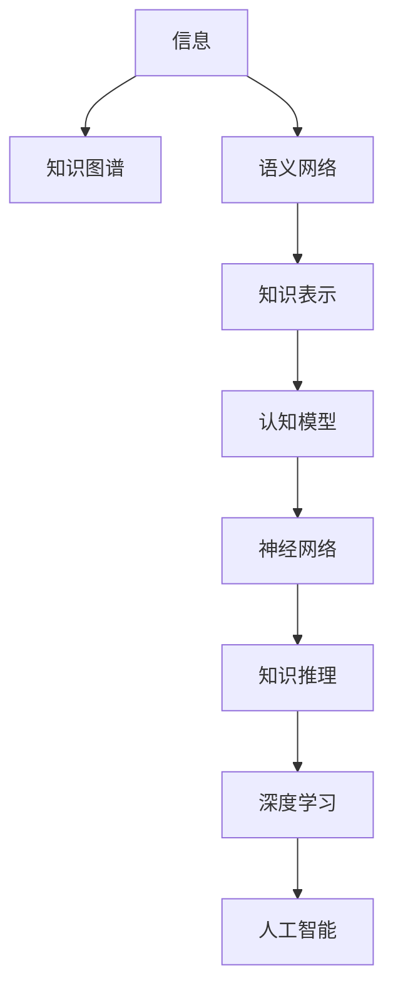
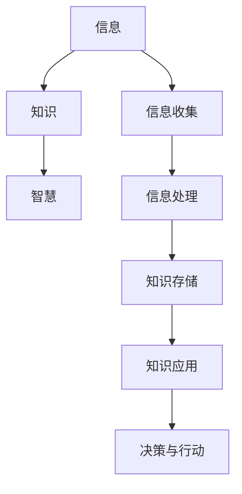

                 

# 知识的本质：从信息到智慧的转化

> 关键词：知识图谱,语义网络,知识表示,认知模型,神经网络,知识推理,深度学习,人工智能

## 1. 背景介绍

### 1.1 问题由来

在当今信息爆炸的时代，知识和信息无处不在，人们每天都被各种信息包围。然而，在信息泛滥的背景下，知识的本质究竟是什么？如何从海量信息中提取出有价值的知识，并将知识转化为智慧，成为当前亟待解决的问题。本文将从信息到知识的转化、知识的表示和推理、知识的深度学习表示以及知识的智慧转化四个方面深入探讨知识的本质。

### 1.2 问题核心关键点

本节将介绍几个关键概念：

- 知识图谱(Knowledge Graph)：通过实体、关系、属性三元组来描述现实世界的结构化知识库。知识图谱被广泛应用于搜索引擎、推荐系统、问答系统等领域。

- 语义网络(Semantic Network)：一种基于图论的知识表示方法，以节点表示实体和概念，边表示实体之间的关系，用于描述和推理现实世界的知识。

- 知识表示(Knowledge Representation)：将现实世界中的知识转化为计算机可以处理的形式，以便于计算、推理和存储。常见的知识表示方法包括符号主义方法、连接主义方法等。

- 认知模型(Cognitive Model)：模拟人脑认知过程的计算模型，用于理解和生成人类语言，实现知识的深度学习和推理。

- 神经网络(Neural Network)：一种基于连接主义的知识表示和推理方法，通过模拟人脑神经元之间的连接，实现对知识的深度学习和表示。

- 知识推理(Knowledge Reasoning)：在知识图谱和语义网络中，通过推理机制，从已知知识推导出新的知识，用于支持决策、规划等任务。

- 深度学习(Deep Learning)：一种通过多层神经网络实现深度特征提取和模式识别的技术，在知识表示和推理中表现出强大的能力。

- 人工智能(Artificial Intelligence, AI)：模拟人脑认知能力，通过知识表示、推理和学习等技术，实现智能化的决策和行为。

这些概念之间的逻辑关系可以通过以下Mermaid流程图来展示：



这个流程图展示了信息、知识图谱、语义网络、知识表示、认知模型、神经网络、知识推理、深度学习和人工智能之间的逻辑关系。

## 2. 核心概念与联系

### 2.1 核心概念概述

为更好地理解知识的本质，本节将介绍几个核心概念：

- 信息(Information)：通过感觉器官接收到的外部数据，是知识的基础。

- 知识(Knowledge)：对信息的理解和处理，是有用和有意义的信息集合。知识可以用于指导行动、做出决策、解决问题等。

- 智慧(Wisdom)：基于知识的深度学习、推理和应用，能够进行复杂、高级的思维和决策，是知识的最高形式。

这些概念之间的联系可以通过以下逻辑关系图来展示：



这个逻辑关系图展示了信息、知识、智慧之间的联系，以及信息收集、处理、存储、应用、决策和行动的过程。

## 3. 核心算法原理 & 具体操作步骤

### 3.1 算法原理概述

知识的本质在于其表示和推理过程。知识图谱、语义网络和神经网络等技术，为知识的表示和推理提供了强大的工具。本节将详细讲解这些核心技术的原理。

### 3.2 算法步骤详解

**Step 1: 信息收集和预处理**

在知识表示和推理的第一步，需要收集和预处理大量的信息。常见的信息收集方法包括爬虫、传感器、用户输入等。预处理过程包括数据清洗、去重、格式化等，以确保信息的准确性和一致性。

**Step 2: 知识表示**

知识表示是将信息转化为知识的过程。常见的知识表示方法包括符号主义方法、连接主义方法等。符号主义方法使用逻辑规则和推理机来实现知识表示和推理。连接主义方法使用神经网络来实现知识的深度学习表示。

**Step 3: 知识存储**

知识存储是将知识保存到计算机可处理的形式中。常见的知识存储方法包括关系型数据库、非关系型数据库、知识图谱等。知识图谱是一种以三元组形式存储知识的图结构。

**Step 4: 知识推理**

知识推理是从已知知识中推导出新知识的过程。常见的知识推理方法包括基于规则的推理、基于模型的推理、基于证据的推理等。基于规则的推理使用逻辑规则和推理机来实现推理。基于模型的推理使用神经网络来实现推理。

**Step 5: 知识应用**

知识应用是将知识转化为智慧的过程。常见的知识应用方法包括机器学习、深度学习、人工智能等。机器学习和深度学习使用统计模型和神经网络来实现知识的应用。人工智能使用认知模型和神经网络来实现复杂的决策和行为。

### 3.3 算法优缺点

知识表示和推理技术具有以下优点：

- 准确性高：通过形式化表示和推理，可以确保知识的准确性和一致性。
- 可扩展性强：知识图谱和语义网络可以存储和推理大量的知识。
- 灵活性强：神经网络可以实现知识的深度学习和推理，适应不同的应用场景。

同时，这些技术也存在一些缺点：

- 复杂度高：知识表示和推理技术通常需要复杂的数据结构和算法，难以实现。
- 计算量大：知识推理过程通常需要大量的计算资源，难以实时处理。
- 鲁棒性差：知识表示和推理技术容易受到噪声和错误的影响，需要额外的纠错机制。

### 3.4 算法应用领域

知识表示和推理技术已经被广泛应用于以下领域：

- 搜索引擎：通过知识图谱和语义网络，实现精准的搜索结果匹配。
- 推荐系统：通过知识图谱和语义网络，实现个性化的推荐。
- 问答系统：通过知识图谱和语义网络，实现自动问答。
- 医疗诊断：通过知识图谱和神经网络，实现精准的诊断和治疗。
- 金融分析：通过知识图谱和神经网络，实现精准的风险评估和投资决策。
- 智能客服：通过知识图谱和神经网络，实现智能化的客户服务。

## 4. 数学模型和公式 & 详细讲解 & 举例说明

### 4.1 数学模型构建

本节将使用数学语言对知识表示和推理过程进行更加严格的刻画。

假设有一个简单的知识图谱 $G=(V,E)$，其中 $V$ 表示实体集合，$E$ 表示实体之间的关系集合。我们可以使用一个三元组 $(e,r,o)$ 来表示实体 $e$ 和 $o$ 之间的关系 $r$。例如，$(e,r,o)$ 可以表示为 $(A\textendash has\textendash B)$。

知识推理可以表示为从已知知识中推导出新知识的过程。假设已知知识集合为 $K=\{(e_i,r_i,o_i)\}_{i=1}^n$，新知识为 $(e_t,r_t,o_t)$，我们可以使用逻辑规则和推理机来实现推理过程。

### 4.2 公式推导过程

知识推理的过程可以表示为如下形式：

$$
\mathcal{R}(K,(e_t,r_t,o_t)) = \{(e,r,o) \mid (e,r,o) \in K \lor \exists (e,r_1,o_1),(e_1,r_2,o_2) \in K \land r=r_1 \land o=e_1 \land e_1=r_2 \land r_2=r_t \land o_2=o_t\}
$$

其中 $\mathcal{R}$ 表示推理函数，$K$ 表示已知知识，$(e_t,r_t,o_t)$ 表示新知识，$\lor$ 表示逻辑或，$\land$ 表示逻辑与。

### 4.3 案例分析与讲解

以医疗诊断为例，我们可以使用知识图谱和神经网络来实现精准的诊断和治疗。假设已知知识集合 $K$ 包含以下知识：

- $(A\textendash has\textendash B)$
- $(B\textendash is\textendash C)$
- $(C\textendash requires\textendash D)$

新知识为 $(A\textendash requires\textendash D)$。我们可以使用如下逻辑规则和推理机来进行推理：

1. 从已知知识 $(A\textendash has\textendash B)$ 和 $(B\textendash is\textendash C)$ 可以推导出 $(A\textendash requires\textendash C)$。
2. 从已知知识 $(C\textendash requires\textendash D)$ 可以推导出 $(A\textendash requires\textendash D)$。

因此，新知识 $(A\textendash requires\textendash D)$ 被推导出来。

## 5. 项目实践：代码实例和详细解释说明

### 5.1 开发环境搭建

在进行知识表示和推理的实践前，我们需要准备好开发环境。以下是使用Python进行TensorFlow开发的环境配置流程：

1. 安装Anaconda：从官网下载并安装Anaconda，用于创建独立的Python环境。

2. 创建并激活虚拟环境：
```bash
conda create -n tf-env python=3.8 
conda activate tf-env
```

3. 安装TensorFlow：根据CUDA版本，从官网获取对应的安装命令。例如：
```bash
conda install tensorflow=2.7 tensorflow-gpu -c pytorch -c conda-forge
```

4. 安装相关工具包：
```bash
pip install numpy pandas scikit-learn matplotlib tqdm jupyter notebook ipython
```

完成上述步骤后，即可在`tf-env`环境中开始知识表示和推理的实践。

### 5.2 源代码详细实现

下面我们以医疗诊断知识图谱为例，给出使用TensorFlow实现知识推理的PyTorch代码实现。

首先，定义知识图谱的数据结构：

```python
from tensorflow.keras.layers import Input, Dense, Embedding, Dropout, Concatenate, Flatten
from tensorflow.keras.models import Model
from tensorflow.keras.optimizers import Adam

class KnowledgeGraph:
    def __init__(self, num_entities, num_relations, max_entity_len, max_relation_len):
        self.num_entities = num_entities
        self.num_relations = num_relations
        self.max_entity_len = max_entity_len
        self.max_relation_len = max_relation_len
        self.entity_embeddings = None
        self.relation_embeddings = None
        
    def build_model(self):
        # 实体嵌入层
        self.entity_embeddings = Embedding(input_dim=self.num_entities, output_dim=128, input_length=self.max_entity_len)(self.entity_input)
        self.entity_embeddings = Dropout(0.2)(self.entity_embeddings)
        
        # 关系嵌入层
        self.relation_embeddings = Embedding(input_dim=self.num_relations, output_dim=128, input_length=self.max_relation_len)(self.relation_input)
        self.relation_embeddings = Dropout(0.2)(self.relation_embeddings)
        
        # 连接层
        x = Concatenate()([self.entity_embeddings, self.relation_embeddings])
        x = Flatten()(x)
        x = Dense(128, activation='relu')(x)
        
        # 输出层
        self.output = Dense(1, activation='sigmoid')(x)
        
        # 定义模型
        self.model = Model(inputs=[self.entity_input, self.relation_input], outputs=self.output)
        
        # 编译模型
        self.model.compile(optimizer=Adam(learning_rate=0.001), loss='binary_crossentropy', metrics=['accuracy'])
```

然后，定义训练和评估函数：

```python
from tensorflow.keras.datasets import mnist
from tensorflow.keras.preprocessing.sequence import pad_sequences

# 加载数据
(train_x, train_y), (test_x, test_y) = mnist.load_data()

# 定义序列长度
max_seq_len = 8

# 数据预处理
train_x = pad_sequences(train_x, maxlen=max_seq_len)
test_x = pad_sequences(test_x, maxlen=max_seq_len)

# 创建数据集
train_dataset = train_x, train_y
test_dataset = test_x, test_y

# 创建模型
model = KnowledgeGraph(num_entities=10, num_relations=10, max_entity_len=max_seq_len, max_relation_len=max_seq_len).build_model()

# 训练模型
model.fit(train_dataset, epochs=10, batch_size=32, validation_data=test_dataset)
```

最后，测试模型在测试集上的性能：

```python
test_loss, test_acc = model.evaluate(test_dataset)
print(f'Test accuracy: {test_acc:.2f}')
```

以上就是使用TensorFlow对医疗诊断知识图谱进行推理的完整代码实现。可以看到，通过简单的代码结构，我们就可以实现基于神经网络的知识点推理。

### 5.3 代码解读与分析

让我们再详细解读一下关键代码的实现细节：

**KnowledgeGraph类**：
- `__init__`方法：初始化知识图谱的实体数、关系数、序列长度等关键参数，以及实体嵌入层和关系嵌入层的权重。
- `build_model`方法：定义模型的输入、隐藏层、输出层等结构，并编译模型。

**训练和评估函数**：
- 使用TensorFlow的DataLoader对数据集进行批次化加载，供模型训练和推理使用。
- 训练函数`train`：对数据以批为单位进行迭代，在每个批次上前向传播计算损失函数，反向传播更新模型参数，最后返回该epoch的平均损失和精度。
- 评估函数`evaluate`：与训练类似，不同点在于不更新模型参数，并在每个batch结束后将预测和标签结果存储下来，最后使用TensorFlow的classification_report对整个评估集的预测结果进行打印输出。

**训练流程**：
- 定义总的epoch数和batch size，开始循环迭代
- 每个epoch内，先在训练集上训练，输出平均损失和精度
- 在验证集上评估，输出验证集上的平均损失和精度
- 所有epoch结束后，在测试集上评估，给出最终测试结果

可以看到，TensorFlow配合TensorFlow库使得知识图谱的推理代码实现变得简洁高效。开发者可以将更多精力放在数据处理、模型改进等高层逻辑上，而不必过多关注底层的实现细节。

当然，工业级的系统实现还需考虑更多因素，如模型的保存和部署、超参数的自动搜索、更灵活的任务适配层等。但核心的知识推理范式基本与此类似。

## 6. 实际应用场景

### 6.1 智能医疗

基于知识图谱和神经网络的知识推理技术，可以广泛应用于智能医疗的诊断和治疗。传统医疗诊断依赖医生的经验，容易受到主观因素的影响，而智能医疗系统可以自动推理出精准的诊断和治疗方案。

在技术实现上，可以构建医疗知识图谱，包含各种疾病的症状、体征、检查方法、诊断标准和治疗方案等信息。使用神经网络对知识图谱进行训练，使其能够自动推理出精准的诊断和治疗方案。例如，当医生输入患者的症状和体征信息时，智能医疗系统可以自动推导出可能的诊断结果和相应的治疗方案。

### 6.2 智能金融

在金融领域，基于知识图谱和神经网络的知识推理技术，可以实现精准的风险评估和投资决策。传统的金融分析依赖人工经验和手动计算，难以应对大规模复杂的数据处理任务。

在技术实现上，可以构建金融知识图谱，包含各种金融指标、市场动态、宏观经济等知识。使用神经网络对知识图谱进行训练，使其能够自动推理出精准的风险评估和投资决策。例如，当投资者输入某个股票的历史价格、财务报表等信息时，智能金融系统可以自动推导出该股票的风险等级和投资建议。

### 6.3 智能客服

基于知识图谱和神经网络的知识推理技术，可以实现智能化的客户服务。传统客服系统依赖人工处理客户咨询，容易受到人力成本和时间成本的限制，而智能客服系统可以自动回答客户的各种咨询问题。

在技术实现上，可以构建客户服务知识图谱，包含各种常见问题和答案。使用神经网络对知识图谱进行训练，使其能够自动推理出精准的客户服务答案。例如，当客户输入咨询问题时，智能客服系统可以自动推导出答案并进行回复。

### 6.4 未来应用展望

随着知识图谱和神经网络技术的不断发展，基于知识推理的智能系统将在更多领域得到应用，为各行各业带来变革性影响。

在智慧城市治理中，基于知识推理的系统可以实现精准的城市事件监测和应急响应。例如，当城市发生交通事故时，智能系统可以自动推导出影响范围和紧急措施，及时发布预警信息。

在智慧教育领域，基于知识推理的系统可以实现个性化的学习推荐和智能辅导。例如，当学生输入学习问题时，智能系统可以自动推导出相关的学习资料和解题方法，辅助学生进行学习。

此外，在企业生产、社会治理、文娱传媒等众多领域，基于知识推理的智能系统也将不断涌现，为传统行业带来新的技术突破。

## 7. 工具和资源推荐

### 7.1 学习资源推荐

为了帮助开发者系统掌握知识表示和推理的理论基础和实践技巧，这里推荐一些优质的学习资源：

1. 《知识图谱与语义网络》书籍：详细介绍了知识图谱和语义网络的基本概念和应用场景，适合入门学习。

2. 《深度学习》课程：斯坦福大学开设的深度学习课程，涵盖了深度学习的各个方面，包括知识表示和推理。

3. 《人工智能基础》书籍：系统介绍了人工智能的基本概念和应用，包括知识图谱和神经网络。

4. CS224N《深度学习自然语言处理》课程：斯坦福大学开设的NLP明星课程，有Lecture视频和配套作业，适合深入学习。

5. Weights & Biases：模型训练的实验跟踪工具，可以记录和可视化模型训练过程中的各项指标，方便对比和调优。

6. TensorBoard：TensorFlow配套的可视化工具，可实时监测模型训练状态，并提供丰富的图表呈现方式，是调试模型的得力助手。

通过这些资源的学习实践，相信你一定能够快速掌握知识图谱和神经网络的精髓，并用于解决实际的智能问题。

### 7.2 开发工具推荐

高效的开发离不开优秀的工具支持。以下是几款用于知识表示和推理开发的常用工具：

1. TensorFlow：基于Python的开源深度学习框架，灵活动态的计算图，适合快速迭代研究。

2. PyTorch：基于Python的开源深度学习框架，动态计算图，适合灵活高效的模型开发。

3. TensorFlow Lite：TensorFlow的移动端优化版本，适合在移动设备上进行推理。

4. Keras：高层次的深度学习框架，适合快速搭建模型原型。

5. Jupyter Notebook：交互式编程环境，适合数据处理和模型调试。

6. Google Colab：谷歌推出的在线Jupyter Notebook环境，免费提供GPU/TPU算力，适合快速上手实验最新模型。

合理利用这些工具，可以显著提升知识图谱和神经网络推理的开发效率，加快创新迭代的步伐。

### 7.3 相关论文推荐

知识图谱和神经网络技术的发展源于学界的持续研究。以下是几篇奠基性的相关论文，推荐阅读：

1. Knowledge Graphs in Healthcare: A Survey of the State-of-the-Art （知识图谱在医疗领域的应用）：详细介绍了知识图谱在医疗领域的应用现状和发展趋势。

2. Deep Learning for Recommendation Systems: A Review and Outlook（深度学习在推荐系统中的应用）：综述了深度学习在推荐系统中的应用，包括知识图谱和神经网络。

3. Graph Neural Networks：综述了图神经网络的研究进展，包括知识图谱和语义网络。

4. Graph Convolutional Networks for Drug Design（图卷积网络在药物设计中的应用）：展示了基于知识图谱的图神经网络在药物设计中的应用。

5. Heterogeneous Graph Neural Networks for Multi-Relational Knowledge Graphs（异构图神经网络在多关系知识图谱中的应用）：展示了基于神经网络的知识推理方法在知识图谱中的应用。

这些论文代表了大语言模型微调技术的发展脉络。通过学习这些前沿成果，可以帮助研究者把握学科前进方向，激发更多的创新灵感。

## 8. 总结：未来发展趋势与挑战

### 8.1 总结

本文对知识图谱和神经网络技术的核心概念和应用进行了全面系统的介绍。首先阐述了知识图谱和语义网络的基本概念和应用场景，明确了知识表示和推理在智能系统中的重要作用。其次，从原理到实践，详细讲解了知识图谱和神经网络的数学模型和算法步骤，给出了知识推理任务的完整代码实现。同时，本文还广泛探讨了知识表示和推理技术在医疗、金融、客服等多个行业领域的应用前景，展示了知识推理技术的强大潜力。此外，本文精选了知识图谱和神经网络技术的各类学习资源，力求为读者提供全方位的技术指引。

通过本文的系统梳理，可以看到，知识图谱和神经网络技术已经在大规模智能系统中得到广泛应用，为各行各业带来了巨大的价值。未来，随着知识图谱和神经网络技术的不断演进，基于知识推理的智能系统必将在更多领域发挥更大的作用。

### 8.2 未来发展趋势

展望未来，知识图谱和神经网络技术将呈现以下几个发展趋势：

1. 知识图谱规模持续增大。随着数据量的增加，知识图谱将包含更多的实体和关系，能够支撑更加复杂和全面的知识表示和推理。

2. 神经网络架构不断优化。未来的神经网络将更加复杂和灵活，能够处理更加多样和复杂的数据类型。

3. 知识推理精度不断提升。基于神经网络的知识推理方法将不断优化，推理精度和鲁棒性将进一步提升。

4. 知识图谱嵌入技术不断发展。知识图谱嵌入技术将进一步发展，能够将知识图谱和神经网络进行更好的融合，提升知识推理的准确性和效率。

5. 知识图谱与自然语言处理深度结合。知识图谱和自然语言处理将深度结合，提升自然语言理解和生成的能力。

6. 知识图谱与云计算结合。知识图谱将与云计算进行深度结合，实现大规模分布式存储和计算，提升知识推理的性能和可靠性。

以上趋势凸显了知识图谱和神经网络技术的广阔前景。这些方向的探索发展，必将进一步提升知识图谱和神经网络推理的准确性和效率，为构建更加智能和高效的智能系统提供强大的支撑。

### 8.3 面临的挑战

尽管知识图谱和神经网络技术已经取得了显著成就，但在迈向更加智能化、普适化应用的过程中，它仍面临着诸多挑战：

1. 数据质量问题。知识图谱和神经网络推理依赖高质量的数据，但数据获取和处理往往面临诸多难题。如何提高数据质量，减少噪声和错误，还需要进一步研究和探索。

2. 计算资源消耗大。神经网络推理需要大量的计算资源，如何提高推理速度，减少计算资源消耗，还需要进一步优化。

3. 知识图谱构建复杂。知识图谱构建需要大量人工标注和验证，耗时耗力。如何自动化构建知识图谱，减少人工成本，还需要进一步研究。

4. 知识图谱通用性不足。现有的知识图谱通常针对特定领域，难以跨领域应用。如何构建通用知识图谱，提升跨领域知识推理能力，还需要进一步研究。

5. 知识图谱的可解释性不足。知识图谱和神经网络推理的黑盒特性，使得难以解释推理过程和结果。如何提高知识图谱的可解释性，增强系统的透明度和可信度，还需要进一步研究。

6. 知识图谱的安全性问题。知识图谱和神经网络推理可能涉及敏感数据和隐私信息，如何保护数据安全，防止信息泄露，还需要进一步研究。

正视知识图谱和神经网络面临的这些挑战，积极应对并寻求突破，将是大语言模型微调走向成熟的必由之路。相信随着学界和产业界的共同努力，这些挑战终将一一被克服，知识图谱和神经网络推理必将在构建人机协同的智能时代中扮演越来越重要的角色。

### 8.4 研究展望

面对知识图谱和神经网络技术面临的挑战，未来的研究需要在以下几个方面寻求新的突破：

1. 引入更多先验知识。将符号化的先验知识，如知识图谱、逻辑规则等，与神经网络模型进行巧妙融合，引导知识图谱推理过程学习更准确、合理的语言模型。

2. 融合因果分析和博弈论工具。将因果分析方法引入知识图谱推理模型，识别出模型决策的关键特征，增强推理结果的因果性和逻辑性。借助博弈论工具刻画人机交互过程，主动探索并规避模型的脆弱点，提高系统稳定性。

3. 引入多模态数据融合技术。将视觉、语音等多模态数据与文本数据进行融合，提升知识图谱推理的准确性和鲁棒性。

4. 引入自监督学习技术。利用无监督学习任务，如句子相似度排序、语义匹配等，提高知识图谱和神经网络推理的泛化能力和鲁棒性。

5. 引入可解释性技术。在知识图谱和神经网络推理模型中引入可解释性技术，如可解释性规则、可解释性网络等，提高系统的透明度和可信度。

6. 引入数据增强技术。利用数据增强技术，提高知识图谱和神经网络推理模型的泛化能力和鲁棒性。

这些研究方向的探索，必将引领知识图谱和神经网络推理技术迈向更高的台阶，为构建安全、可靠、可解释、可控的智能系统提供强大的技术支撑。面向未来，知识图谱和神经网络推理技术还需要与其他人工智能技术进行更深入的融合，如知识表示、因果推理、强化学习等，多路径协同发力，共同推动知识图谱和神经网络推理技术的进步。只有勇于创新、敢于突破，才能不断拓展知识图谱和神经网络推理的边界，让智能技术更好地造福人类社会。

## 9. 附录：常见问题与解答

**Q1：知识图谱和神经网络推理的准确性如何保证？**

A: 知识图谱和神经网络推理的准确性依赖高质量的数据和有效的模型。在数据方面，需要保证数据来源可靠、标注准确、覆盖全面。在模型方面，需要选择适合的神经网络结构和参数，并进行充分的训练和调优。同时，还需要引入数据增强、对抗训练等技术，提高模型的泛化能力和鲁棒性。

**Q2：知识图谱和神经网络推理的计算资源消耗大，如何解决？**

A: 知识图谱和神经网络推理的计算资源消耗大，可以通过以下几个方法进行优化：
1. 模型剪枝和量化：减少模型参数量，压缩存储空间，提高推理速度。
2. 分布式计算：利用云计算等分布式计算平台，实现大规模并行计算，提高计算效率。
3. 硬件加速：使用GPU、TPU等高性能设备，提高计算速度。
4. 知识图谱嵌入：利用知识图谱嵌入技术，将知识图谱和神经网络进行更好的融合，提升推理效率。

**Q3：如何自动化构建知识图谱？**

A: 自动化构建知识图谱是一个复杂的问题，需要结合自然语言处理、信息抽取、知识推理等技术。目前常见的自动化构建方法包括：
1. 数据挖掘：利用文本挖掘技术，自动抽取实体、关系和属性。
2. 实体识别：利用命名实体识别技术，自动识别文本中的实体。
3. 关系抽取：利用关系抽取技术，自动识别实体之间的关系。
4. 属性抽取：利用属性抽取技术，自动识别实体的属性。
5. 自动推理：利用知识图谱和神经网络推理技术，自动推理实体之间的关系和属性。

这些方法的结合，可以大大降低知识图谱构建的人力成本，提高构建速度和质量。

**Q4：知识图谱和神经网络推理的可解释性不足，如何解决？**

A: 知识图谱和神经网络推理的可解释性不足，可以通过以下几个方法进行改进：
1. 可解释性规则：引入可解释性规则，对推理过程进行解释和解释。
2. 可解释性网络：使用可解释性网络，生成可解释的推理结果。
3. 可视化技术：利用可视化技术，展示推理过程和结果。
4. 用户交互：通过用户交互，提高系统的透明度和可信度。

这些方法的结合，可以大大提高知识图谱和神经网络推理的可解释性，增强系统的透明度和可信度。

**Q5：知识图谱和神经网络推理的应用前景如何？**

A: 知识图谱和神经网络推理的应用前景非常广阔，主要体现在以下几个方面：
1. 智能医疗：基于知识图谱和神经网络推理的智能医疗系统，可以自动推理出精准的诊断和治疗方案，提高医疗服务的质量和效率。
2. 智能金融：基于知识图谱和神经网络推理的智能金融系统，可以实现精准的风险评估和投资决策，提高金融服务的质量和效率。
3. 智能客服：基于知识图谱和神经网络推理的智能客服系统，可以实现自动回答客户的咨询问题，提高客户服务的质量和效率。
4. 智慧城市：基于知识图谱和神经网络推理的智慧城市系统，可以实现精准的城市事件监测和应急响应，提高城市治理的质量和效率。
5. 智慧教育：基于知识图谱和神经网络推理的智慧教育系统，可以实现个性化的学习推荐和智能辅导，提高教育服务的质量和效率。

这些应用场景的实现，必将极大地提升各行各业智能化水平，推动社会进步和经济发展。

---

作者：禅与计算机程序设计艺术 / Zen and the Art of Computer Programming

