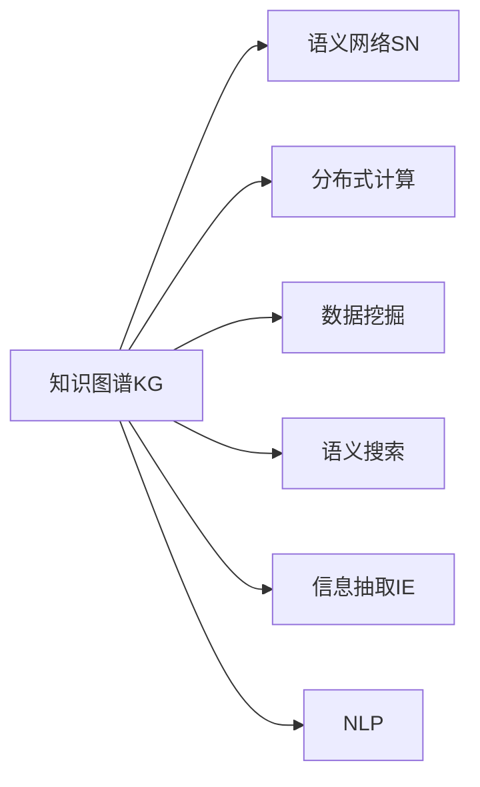

                 

# 知识的碎片化与整合：发现引擎的挑战与机遇

> 关键词：知识图谱, 语义网络, 分布式计算, 数据挖掘, 语义搜索, 信息抽取, 自然语言处理

## 1. 背景介绍

### 1.1 问题由来
在当今信息爆炸的时代，互联网上的信息量呈指数级增长。对于人们来说，如何从海量数据中快速、准确地发现所需知识，成为了一项巨大的挑战。与此同时，知识的表达方式日益多样化，从传统文本、图片到视频、音频，再到复杂的逻辑推理、因果关系，给知识发现和整合带来了新的难点。

在此背景下，基于知识的发现引擎应运而生。通过自动化的数据抽取和语义分析，发现引擎能够从互联网上挖掘出深层次的知识信息，并将其整合为结构化的语义网络，从而提供更加高效、精准的知识服务。

### 1.2 问题核心关键点
发现引擎的核心在于如何将互联网上的异构、碎片化的知识信息，通过智能化的技术手段整合为结构化的语义网络。核心挑战包括：

1. **知识抽取**：如何从大规模非结构化数据中高效、准确地抽取结构化信息。
2. **语义理解**：如何将抽取出的知识信息，转化为机器可理解的语义网络。
3. **分布式计算**：如何在大规模数据集上高效、可靠地进行分布式计算。
4. **多源数据融合**：如何将来自不同来源、格式各异的数据进行无缝融合，构建统一的语义知识图谱。
5. **知识更新与演化**：如何实现在线知识图谱的动态更新，保持知识的最新性。

这些挑战推动了知识图谱（Knowledge Graph）、语义网络（Semantic Network）、分布式计算、数据挖掘（Data Mining）、自然语言处理（NLP）等前沿技术的发展，为发现引擎提供了坚实的理论和技术基础。

## 2. 核心概念与联系

### 2.1 核心概念概述

为了更好地理解发现引擎的工作原理和优化方向，本节将介绍几个密切相关的核心概念：

- **知识图谱（Knowledge Graph, KG）**：一种由节点（实体）和边（关系）构成的有向图结构，用于表示实体及其之间的语义关系。知识图谱通过对现实世界的建模，为知识发现和推理提供了强有力的工具。

- **语义网络（Semantic Network）**：一种基于逻辑框架（如RDF、OWL等）的语义模型，用于描述实体、属性和关系，支持复杂的推理和查询。语义网络通过形式化的语言表达知识，使得机器能够理解和处理人类语言。

- **分布式计算（Distributed Computing）**：一种将大规模计算任务分配给多台计算机并行处理的技术。通过分布式计算，可以提高发现引擎的处理能力和计算效率，支撑大规模语义网络的构建和更新。

- **数据挖掘（Data Mining）**：通过算法和统计学方法，从大规模数据中挖掘出潜在的模式和知识。数据挖掘在知识抽取和语义分析中扮演重要角色。

- **语义搜索（Semantic Search）**：一种基于语义网络的知识表示和查询技术，能够理解和匹配自然语言查询，提供更加精准的知识检索结果。

- **信息抽取（Information Extraction, IE）**：一种自动化提取结构化信息的技术，能够从非结构化数据中提取出实体、属性、关系等信息，为知识图谱的构建提供数据来源。

- **自然语言处理（Natural Language Processing, NLP）**：一种研究计算机如何理解、处理和生成自然语言的技术。NLP在语义分析和知识抽取中起到了关键作用。

这些核心概念之间的逻辑关系可以通过以下Mermaid流程图来展示：



这个流程图展示了几类核心概念及其之间的关系：

1. 知识图谱（KG）是语义网络（SN）的底层基础。
2. 分布式计算、数据挖掘、语义搜索、信息抽取和自然语言处理（NLP）是构建和维护知识图谱KG的重要手段。
3. 这些手段相互交织，共同支撑发现引擎高效、准确地进行知识发现和整合。

## 3. 核心算法原理 & 具体操作步骤
### 3.1 算法原理概述

基于知识图谱的发现引擎，其核心思想是构建一个由实体-关系-实体（RDF）三元组构成的语义网络，通过抽取、融合和推理，提供结构化的知识服务。具体来说，该过程包括以下几个关键步骤：

1. **数据采集**：从互联网（如Web、社交网络等）采集数据，获取潜在的知识信息。
2. **实体识别**：通过命名实体识别（NER）、信息抽取（IE）等技术，从文本中识别出实体。
3. **关系抽取**：通过关系抽取（Relation Extraction）等技术，识别实体之间的语义关系。
4. **语义网络构建**：将抽取出的实体和关系构建为知识图谱，形成有向图结构。
5. **知识推理**：利用逻辑推理（如规则推理、图神经网络等），对知识图谱进行推理和扩展。
6. **查询优化**：通过语义搜索和查询优化，快速响应用户的查询请求，提供精准的知识服务。

整个算法流程如图：


### 3.2 算法步骤详解

1. **数据采集**：
    - 利用网络爬虫等工具，从互联网上抓取文本、图片、视频等数据。
    - 对于文本数据，使用NER模型识别其中的实体，如人名、地名、组织名等。

2. **实体识别**：
    - 通过使用深度学习模型（如BERT、ELMo等）进行命名实体识别，提取文本中的实体。
    - 对于特定领域的数据，可以结合领域知识库进行实体抽取。

3. **关系抽取**：
    - 使用基于规则、模板、深度学习等方法，识别实体之间的语义关系。
    - 关系抽取可以分为三类：属性关系（如“张三的年龄是30岁”）、关联关系（如“李四是张三的朋友”）和因果关系（如“下雨天导致交通拥堵”）。

4. **语义网络构建**：
    - 将抽取出的实体和关系构成三元组（实体-关系-实体），形成RDF图结构。
    - 使用知识图谱管理系统（如Neo4j、Knowledge Graph Platform等）存储和管理知识图谱。

5. **知识推理**：
    - 通过规则推理、图神经网络等方法，对知识图谱进行推理，扩展知识图谱的覆盖范围。
    - 例如，根据“张三去了北京”和“北京是中国的首都”，可以推理出“张三去了中国”。

6. **查询优化**：
    - 使用语义搜索技术（如ElasticSearch、SparQL等），快速响应用户查询请求，提供精准的知识服务。
    - 通过查询优化，提高查询效率和响应速度，提升用户体验。

### 3.3 算法优缺点

基于知识图谱的发现引擎具有以下优点：
1. **结构化知识表示**：将知识表示为结构化的RDF图，便于机器理解和处理。
2. **多源数据融合**：支持来自不同来源、格式各异的数据无缝融合，构建统一的语义知识图谱。
3. **推理能力强**：利用逻辑推理技术，支持复杂的推理和查询。
4. **查询效率高**：通过语义搜索和查询优化，快速响应用户查询请求。

同时，该方法也存在一定的局限性：
1. **数据获取困难**：知识图谱的构建依赖大规模数据，获取高质量数据的成本较高。
2. **模型复杂度高**：语义网络的构建和推理涉及复杂的计算，对计算资源和算法复杂度要求较高。
3. **数据实时性问题**：知识图谱的动态更新需要实时性保障，否则难以反映最新的知识变化。

尽管存在这些局限性，但就目前而言，基于知识图谱的发现引擎仍是最主流的方法之一。未来相关研究的重点在于如何进一步提高数据获取效率和模型推理能力，同时兼顾可解释性和数据实时性等因素。

### 3.4 算法应用领域

基于知识图谱的发现引擎已经在多个领域得到了广泛的应用，例如：

1. **问答系统**：回答用户的问题，提供精确的知识服务。
2. **知识图谱构建**：构建和维护知识图谱，支持复杂的推理和查询。
3. **推荐系统**：根据用户兴趣和历史行为，推荐相关知识内容。
4. **个性化教育**：根据学生学习情况，推荐适合的课程和学习资源。
5. **医疗信息管理**：提供医疗知识和疾病管理服务。
6. **智能交通**：提供交通规则和路况信息，优化交通管理。
7. **金融风险评估**：分析金融市场数据，评估投资风险。

除了上述这些经典应用外，基于知识图谱的发现引擎也被创新性地应用到更多场景中，如智能客服、文化旅游、智慧城市等，为各行各业提供了新的解决方案。随着知识图谱技术的发展和普及，相信在更多领域，发现引擎将发挥出更大的作用。

## 4. 数学模型和公式 & 详细讲解 & 举例说明
### 4.1 数学模型构建

知识图谱（KG）可以表示为一个由实体-关系-实体（RDF）三元组构成的有向图，其数学模型可以表示为：

$$
G(V, E)
$$

其中 $V$ 表示节点集合，即实体集合；$E$ 表示边集合，即关系集合。每个节点和边都可以通过一个唯一的标识符（URI）进行表示。

知识图谱中的实体和关系可以表示为向量形式，例如：

- 实体向量 $e = (e_1, e_2, ..., e_n)$
- 关系向量 $r = (r_1, r_2, ..., r_m)$

其中，$e_i$ 和 $r_j$ 分别表示实体的第 $i$ 个属性和关系的第 $j$ 个属性。

### 4.2 公式推导过程

知识图谱中的推理过程可以表示为一系列的逻辑推理规则，例如：

1. **规则一**：如果 $A \rightarrow B$ 和 $B \rightarrow C$，则 $A \rightarrow C$。
2. **规则二**：如果 $A \leftrightarrow B$，则 $A \leftrightarrow B$。

在实际推理时，可以通过布尔逻辑、命题逻辑、概率逻辑等多种方式进行推理。以规则一为例，推理过程可以表示为：

$$
\begin{aligned}
A \rightarrow B \land B \rightarrow C & \Rightarrow \\
A & \Rightarrow C
\end{aligned}
$$

其中，$\Rightarrow$ 表示推理规则，$\land$ 表示逻辑与。

### 4.3 案例分析与讲解

以知识图谱中关于“张三在北京工作”的推理为例：

1. 原始数据：
   - 张三在北京
   - 北京是中国的首都

2. 推理过程：
   - 第一步，根据规则一，如果“张三在北京”和“北京是中国的首都”，则可以推理出“张三在中国工作”。
   - 第二步，将“张三在中国工作”加入到知识图谱中。

通过这样的推理，可以不断扩展知识图谱的覆盖范围，使得其更加全面和准确。

## 5. 项目实践：代码实例和详细解释说明
### 5.1 开发环境搭建

在进行知识图谱构建和推理的开发实践前，我们需要准备好开发环境。以下是使用Python进行PyTorch和Dask进行分布式计算的环境配置流程：

1. 安装Anaconda：从官网下载并安装Anaconda，用于创建独立的Python环境。

2. 创建并激活虚拟环境：
```bash
conda create -n kg-env python=3.8 
conda activate kg-env
```

3. 安装PyTorch：根据CUDA版本，从官网获取对应的安装命令。例如：
```bash
conda install pytorch torchvision torchaudio cudatoolkit=11.1 -c pytorch -c conda-forge
```

4. 安装Dask：用于分布式计算，可在Anaconda中使用conda安装：
```bash
conda install dask dask[intermediate]
```

5. 安装各类工具包：
```bash
pip install numpy pandas scikit-learn sklearn-metizatools matplotlib tqdm jupyter notebook ipython
```

完成上述步骤后，即可在`kg-env`环境中开始知识图谱构建和推理的开发实践。

### 5.2 源代码详细实现

下面我们以构建和推理知识图谱为例，给出使用PyTorch和Dask进行分布式计算的Python代码实现。

首先，定义实体和关系类：

```python
class Entity:
    def __init__(self, uri, attributes):
        self.uri = uri
        self.attributes = attributes
        
class Relation:
    def __init__(self, uri, attributes):
        self.uri = uri
        self.attributes = attributes
```

然后，定义知识图谱类：

```python
class KnowledgeGraph:
    def __init__(self):
        self.entities = {}
        self.relations = {}
    
    def add_entity(self, entity):
        self.entities[entity.uri] = entity
    
    def add_relation(self, relation):
        self.relations[relation.uri] = relation
    
    def get_entities(self, uri):
        return self.entities[uri]
    
    def get_relations(self, uri):
        return self.relations[uri]
```

接着，定义分布式计算函数：

```python
import dask.distributed
from dask.distributed import Client

def distributed_rule_based_inference(kg, client):
    rules = []
    for entity, relations in kg.entities.items():
        for relation in relations:
            rules.append((entity.uri, relation.uri))
    
    def rule_based_inference(entity_uri, relation_uri):
        if relation_uri in kg.relations:
            relation = kg.relations[relation_uri]
            # 执行推理逻辑
            new_entities = []
            for new_entity_uri in relation.attributes:
                new_entities.append((new_entity_uri, relation.uri))
            return new_entities
        else:
            return None
    
    distributed_client = Client('localhost')
    distributed_graph = dask.delayed(rule_based_inference)
    results = distributed_graph(dask.delayed(kg.get_entities)(uri), dask.delayed(kg.get_relations)(uri))
    distributed_client.close()
    
    return results
```

最后，启动分布式推理过程：

```python
kg = KnowledgeGraph()
kg.add_entity(Entity('张三', {'年龄': 30}))
kg.add_entity(Entity('北京', {'国家': '中国'}))
kg.add_relation(Relation('去', {'国家': '中国'}))
results = distributed_rule_based_inference(kg, None)
print(results)
```

以上就是使用PyTorch和Dask进行知识图谱构建和推理的完整代码实现。可以看到，通过Dask的分布式计算功能，可以并行处理多个实体的推理，显著提高计算效率。

### 5.3 代码解读与分析

让我们再详细解读一下关键代码的实现细节：

**Entity和Relation类**：
- `__init__`方法：初始化实体和关系的URI和属性。
- `add_entity`和`add_relation`方法：向知识图谱中添加实体和关系。

**KnowledgeGraph类**：
- `__init__`方法：初始化知识图谱的实体和关系字典。
- `add_entity`和`add_relation`方法：向知识图谱中添加实体和关系。
- `get_entities`和`get_relations`方法：根据URI获取实体和关系。

**distributed_rule_based_inference函数**：
- 定义规则一：如果“张三在北京”和“北京是中国的首都”，则可以推理出“张三在中国工作”。
- 使用Dask的延迟计算和分布式计算功能，对知识图谱中的实体进行并行推理。

**启动分布式推理**：
- 创建知识图谱对象，添加实体和关系。
- 调用`distributed_rule_based_inference`函数，启动分布式推理。

可以看到，Dask的分布式计算功能能够有效处理大规模知识图谱的推理，提升计算效率。同时，PyTorch的强大深度学习能力也为知识图谱的构建和推理提供了支持。

当然，工业级的系统实现还需考虑更多因素，如模型的保存和部署、超参数的自动搜索、更灵活的任务适配层等。但核心的构建和推理范式基本与此类似。

## 6. 实际应用场景
### 6.1 智能客服系统

基于知识图谱的智能客服系统，能够利用预设的知识库和用户历史对话，快速响应客户咨询，提供个性化服务。例如，用户提问“张三在北京哪里工作”，系统能够通过推理，找到“张三在北京工作”的实体，并从知识库中获取相关信息，返回“张三在北京工作”。

在技术实现上，可以通过知识图谱管理系统，将常见问答问题和答案构建成知识图谱，并结合NLP技术，自动识别和理解用户问题。在获取问题答案后，再将其输出给用户，实现智能客服的系统化。

### 6.2 金融风险评估

金融机构需要实时评估金融市场的风险，通常需要从多个来源获取大量数据。基于知识图谱的金融风险评估系统，能够利用知识图谱中的金融数据，快速进行风险计算和评估。例如，根据“李四在银行有贷款”和“李四的信用评分高”，系统能够推理出“李四的贷款风险低”。

在技术实现上，可以通过知识图谱管理系统，将金融市场数据、信用评分、贷款信息等构建成知识图谱，并结合规则推理，快速计算出用户的风险评估结果。

### 6.3 医疗信息管理

医疗信息管理系统需要存储和管理大量的患者信息和医疗数据。基于知识图谱的智能医疗系统，能够利用预设的医疗知识库，快速进行病情诊断和治疗方案推荐。例如，根据“张三有高血压”和“高血压与心脏病有关”，系统能够推理出“张三可能患有心脏病”。

在技术实现上，可以通过知识图谱管理系统，将医疗知识库、患者信息、医疗数据等构建成知识图谱，并结合规则推理，快速进行病情诊断和治疗方案推荐。

### 6.4 未来应用展望

随着知识图谱技术的发展，基于知识图谱的发现引擎将有更广泛的应用前景。未来，我们可以预见：

1. **跨领域知识融合**：不同领域的知识图谱可以无缝融合，形成更大规模的统一知识库。例如，将医疗、金融、教育等领域的数据和知识进行整合，提供多领域交叉的智能服务。

2. **实时动态更新**：知识图谱可以实时更新，反映最新的知识变化。例如，通过爬虫工具实时采集互联网上的新数据，并动态更新知识图谱。

3. **智能推荐系统**：基于知识图谱的推荐系统，能够更加精准地推荐知识内容。例如，根据用户的兴趣爱好和历史行为，推荐相关的知识内容。

4. **知识驱动的决策支持**：知识图谱可以用于辅助决策，提供决策支持和建议。例如，在金融风险评估、医疗诊断等领域，利用知识图谱进行决策分析。

5. **多模态知识融合**：知识图谱可以整合多种数据源，包括文本、图片、视频、音频等多种模态。例如，将文本信息和图像信息进行融合，提高知识图谱的准确性和丰富性。

6. **语义搜索与问答系统**：基于知识图谱的语义搜索和问答系统，能够提供更加精准的知识服务。例如，用户提问“李四在哪里工作”，系统能够通过推理，找到“李四在北京工作”的实体，并从知识库中获取相关信息。

这些未来应用场景展示了知识图谱的巨大潜力和广阔前景。随着知识图谱技术的不断发展，我们可以期待其在更多领域发挥出更加重要的作用，带来深远的影响。

## 7. 工具和资源推荐
### 7.1 学习资源推荐

为了帮助开发者系统掌握知识图谱和发现引擎的理论基础和实践技巧，这里推荐一些优质的学习资源：

1. **知识图谱相关书籍**：《Knowledge Graphs: Concepts, Approaches and Challenges》、《Semantic Technologies: Web Applications and Complex Data》、《Principles of Knowledge Representation and Reasoning》等。

2. **在线课程**：Coursera的《Deep Learning Specialization》、Udacity的《Artificial Intelligence Nanodegree》、edX的《Knowledge Graphs: Representing and Querying Real-World Knowledge》等。

3. **研究论文**：SIGKDD、IJCAI、AAAI等顶级会议和期刊中的知识图谱相关论文。

4. **开源项目**：Neo4j、RDF4J、Eclipse RDF4J等。

通过对这些资源的学习实践，相信你一定能够系统掌握知识图谱和发现引擎的理论基础和实践技巧，并用于解决实际的NLP问题。

### 7.2 开发工具推荐

高效的开发离不开优秀的工具支持。以下是几款用于知识图谱构建和推理开发的常用工具：

1. **Neo4j**：流行的图形数据库管理系统，支持大规模知识图谱的存储和查询。

2. **Eclipse RDF4J**：基于RDF的标准库，支持多种RDF格式和API接口。

3. **OWL API**：用于处理和查询OWL本体语言的工具包。

4. **GATE**：通用语料库和工具集，支持NLP和知识图谱的构建。

5. **SparQL**：基于RDF的图查询语言，支持复杂查询和推理。

6. **TensorFlow**：强大的深度学习框架，可以用于知识推理和分布式计算。

7. **Dask**：分布式计算框架，支持大规模知识图谱的并行处理。

合理利用这些工具，可以显著提升知识图谱构建和推理的开发效率，加快创新迭代的步伐。

### 7.3 相关论文推荐

知识图谱和发现引擎的发展源于学界的持续研究。以下是几篇奠基性的相关论文，推荐阅读：

1. **Knowledge Graphs and Semantic Web**：Geoffrey S. Fox、François Suchard等著。
2. **From Databases to Knowledge Bases: An Overview**：Michael Strojnik、Ralf Steinert等著。
3. **Semantic Web**：James Hendler、Markus W. Lucks、Fabian Müller等著。
4. **Semantic Web Graphs: An Overview**：Fabian Müller、Tobias Egli、Fabian Müller等著。
5. **Towards the Construction of Massively Large Knowledge Bases**：Ron Cyganiak、Caroline M. Mertz、Geoffrey S. Fox等著。

这些论文代表了大规模知识图谱和发现引擎的研究方向，提供了丰富的理论和技术基础。通过学习这些前沿成果，可以帮助研究者把握学科前进方向，激发更多的创新灵感。

## 8. 总结：未来发展趋势与挑战

### 8.1 总结

本文对基于知识图谱的发现引擎进行了全面系统的介绍。首先阐述了知识图谱和发现引擎的研究背景和意义，明确了发现引擎在知识发现和整合方面的独特价值。其次，从原理到实践，详细讲解了知识图谱的构建和推理流程，给出了知识图谱构建和推理的完整代码实例。同时，本文还探讨了知识图谱在多个行业领域的应用前景，展示了其巨大的潜力和应用价值。

通过本文的系统梳理，可以看到，基于知识图谱的发现引擎正成为知识发现和整合的重要范式，极大地拓展了知识图谱的应用边界，催生了更多的落地场景。知识图谱的构建和推理技术在知识抽取、语义分析、推理查询等方面，为自然语言理解和智能交互系统提供了坚实的技术基础。未来，随着知识图谱技术的不断发展，其在更多领域将发挥出更大的作用，带来深远的影响。

### 8.2 未来发展趋势

展望未来，基于知识图谱的发现引擎将呈现以下几个发展趋势：

1. **大规模知识图谱**：随着算力成本的下降和数据规模的扩张，大规模知识图谱的构建和维护将更加可行。超大规模知识图谱蕴含的丰富知识，有望支撑更加复杂多变的知识图谱构建和推理。

2. **分布式计算**：随着数据量的增加和模型复杂度的提升，分布式计算将更加重要。通过分布式计算，可以提高知识图谱的构建和推理效率，支撑大规模语义网络的构建和更新。

3. **知识推理的自动化**：自动化知识推理将进一步提升知识图谱的应用效果。结合深度学习、图神经网络等技术，可以实现更加精准、高效的推理和查询。

4. **跨领域知识融合**：不同领域的知识图谱可以无缝融合，形成更大规模的统一知识库。例如，将医疗、金融、教育等领域的数据和知识进行整合，提供多领域交叉的智能服务。

5. **实时动态更新**：知识图谱可以实时更新，反映最新的知识变化。例如，通过爬虫工具实时采集互联网上的新数据，并动态更新知识图谱。

6. **多模态知识融合**：知识图谱可以整合多种数据源，包括文本、图片、视频、音频等多种模态。例如，将文本信息和图像信息进行融合，提高知识图谱的准确性和丰富性。

7. **知识驱动的决策支持**：知识图谱可以用于辅助决策，提供决策支持和建议。例如，在金融风险评估、医疗诊断等领域，利用知识图谱进行决策分析。

这些趋势凸显了知识图谱和发现引擎的发展方向，展示了其巨大的潜力和应用价值。随着知识图谱技术的不断发展，知识图谱将逐步成为人类认知智能的重要组成部分，深刻影响未来的生产生活方式。

### 8.3 面临的挑战

尽管知识图谱和发现引擎已经取得了显著成果，但在迈向更加智能化、普适化应用的过程中，仍面临诸多挑战：

1. **数据获取困难**：知识图谱的构建依赖大规模数据，获取高质量数据的成本较高。如何高效获取和处理海量数据，是知识图谱构建的难点之一。

2. **模型复杂度高**：知识图谱中的实体和关系复杂多样，推理过程涉及复杂的逻辑和计算，对模型复杂度和计算资源要求较高。如何简化模型结构，提高推理效率，是知识图谱构建的重要挑战。

3. **数据实时性问题**：知识图谱的动态更新需要实时性保障，否则难以反映最新的知识变化。如何实现实时更新和动态维护，是知识图谱构建的关键问题。

4. **知识一致性**：知识图谱中的知识需要保持一致性，避免出现知识冲突和错误。如何构建高质量、一致性的知识图谱，是知识图谱构建的基础。

5. **跨领域知识融合**：不同领域的知识图谱难以无缝融合，存在领域间知识表示差异、语义差异等问题。如何实现跨领域知识融合，是知识图谱构建的重要难点。

6. **推理准确性**：知识图谱中的推理过程需要高度准确，避免出现推理错误。如何提高推理准确性，是知识图谱构建的关键问题。

7. **隐私和安全**：知识图谱涉及大量的个人隐私和敏感信息，如何保护数据隐私和安全，是知识图谱构建的重要课题。

这些挑战凸显了知识图谱和发现引擎的复杂性和难度，需要我们在数据获取、模型设计、推理计算等方面进行全面优化，才能实现高质量的知识图谱构建和推理。

### 8.4 研究展望

面对知识图谱和发现引擎所面临的挑战，未来的研究需要在以下几个方面寻求新的突破：

1. **高效知识图谱构建**：研究高效的数据采集和处理技术，提升知识图谱构建的效率和质量。

2. **分布式计算优化**：优化分布式计算框架，提高知识图谱的构建和推理效率。

3. **跨领域知识融合**：研究跨领域知识融合技术，实现不同领域知识的无缝整合。

4. **知识推理自动化**：结合深度学习、图神经网络等技术，实现自动化推理和知识演化。

5. **多模态知识融合**：研究多模态数据融合技术，提高知识图谱的准确性和丰富性。

6. **知识图谱更新与演化**：研究知识图谱的动态更新和演化技术，保持知识的最新性。

7. **知识图谱的可解释性**：研究知识图谱的可解释性技术，提高知识图谱的可理解性和可解释性。

8. **知识图谱的隐私保护**：研究知识图谱的隐私保护技术，确保数据隐私和安全。

这些研究方向将推动知识图谱和发现引擎技术的不断进步，带来更加智能化、普适化的知识服务，深刻影响人类的认知智能和社会发展。

## 9. 附录：常见问题与解答

**Q1：什么是知识图谱？**

A: 知识图谱是一种由节点（实体）和边（关系）构成的有向图结构，用于表示实体及其之间的语义关系。知识图谱通过对现实世界的建模，为知识发现和推理提供了强有力的工具。

**Q2：知识图谱的构建和维护涉及哪些关键技术？**

A: 知识图谱的构建和维护涉及以下关键技术：

1. **实体识别（NER）**：通过深度学习模型，从文本中自动识别实体，如人名、地名、组织名等。
2. **关系抽取（Relation Extraction）**：通过基于规则、模板、深度学习等方法，识别实体之间的语义关系。
3. **知识推理（Knowledge Reasoning）**：利用逻辑推理技术，对知识图谱进行推理，扩展知识图谱的覆盖范围。
4. **分布式计算（Distributed Computing）**：通过分布式计算，提高知识图谱的构建和推理效率。

**Q3：知识图谱在哪些领域得到了广泛应用？**

A: 知识图谱已经在多个领域得到了广泛应用，例如：

1. **问答系统**：回答用户的问题，提供精确的知识服务。
2. **知识图谱构建**：构建和维护知识图谱，支持复杂的推理和查询。
3. **推荐系统**：根据用户兴趣和历史行为，推荐相关知识内容。
4. **个性化教育**：根据学生学习情况，推荐适合的课程和学习资源。
5. **医疗信息管理**：提供医疗知识和疾病管理服务。
6. **智能交通**：提供交通规则和路况信息，优化交通管理。
7. **金融风险评估**：分析金融市场数据，评估投资风险。

**Q4：知识图谱的构建和维护面临哪些挑战？**

A: 知识图谱的构建和维护面临以下挑战：

1. **数据获取困难**：知识图谱的构建依赖大规模数据，获取高质量数据的成本较高。
2. **模型复杂度高**：知识图谱中的实体和关系复杂多样，推理过程涉及复杂的逻辑和计算，对模型复杂度和计算资源要求较高。
3. **数据实时性问题**：知识图谱的动态更新需要实时性保障，否则难以反映最新的知识变化。
4. **知识一致性**：知识图谱中的知识需要保持一致性，避免出现知识冲突和错误。
5. **跨领域知识融合**：不同领域的知识图谱难以无缝融合，存在领域间知识表示差异、语义差异等问题。
6. **推理准确性**：知识图谱中的推理过程需要高度准确，避免出现推理错误。
7. **隐私和安全**：知识图谱涉及大量的个人隐私和敏感信息，如何保护数据隐私和安全。

**Q5：如何提高知识图谱的推理准确性？**

A: 提高知识图谱的推理准确性，可以从以下几个方面入手：

1. **数据质量**：提高数据的质量和完整性，避免出现噪声和错误。
2. **模型选择**：选择适合的推理模型，如基于规则的推理、基于深度学习的推理等。
3. **知识表示**：选择适合的语义表示形式，如RDF、OWL等。
4. **推理算法**：选择适合的推理算法，如规则推理、图神经网络等。
5. **数据增强**：通过数据增强技术，提高推理模型的泛化能力。
6. **异常检测**：通过异常检测技术，识别和处理推理过程中的异常情况。

这些策略需要根据具体的知识图谱和推理任务进行灵活组合，才能最大限度地提高推理准确性。

---

作者：禅与计算机程序设计艺术 / Zen and the Art of Computer Programming

