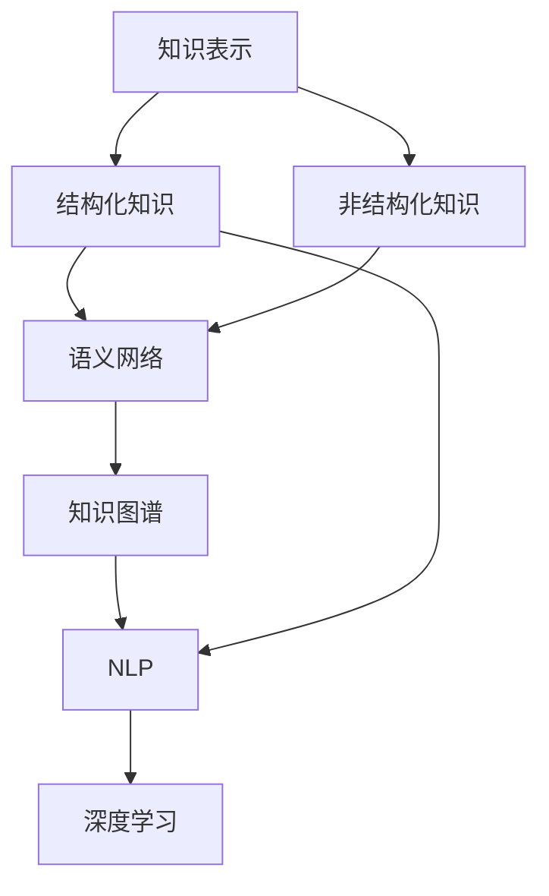

                 

# 知识的结构化与非结构化表示

## 1. 背景介绍

在信息技术发展的历史长河中，知识的表示与处理始终是推动技术进步的重要动力。从早期的人工智能(AI)到现代的深度学习(Deep Learning)，知识的结构化与非结构化表示都在发挥着核心作用。在21世纪，随着大数据、云计算、人工智能等技术的深入发展，知识的结构化与非结构化表示已经成为支撑现代信息社会的重要基石。

知识的结构化与非结构化表示不仅关系到数据驱动的决策制定，也深刻影响着知识发现的路径、搜索和应用的能力。它们为信息的共享、交流和整合提供了基本框架，有助于促进知识的有效利用，推动科学的进步和社会的繁荣。

然而，随着知识量级的指数级增长，如何有效地处理、存储、检索和应用知识变得越来越复杂。传统的结构化知识表示方法（如关系数据库）在灵活性和扩展性方面存在局限，而非结构化知识表示方法（如自然语言处理）则在准确性和深度方面存在挑战。因此，深入探索和研究知识的结构化与非结构化表示的结合，以及如何通过这种结合来提升知识处理和应用的能力，已经成为当前研究的热点领域。

## 2. 核心概念与联系

### 2.1 核心概念概述

为了理解知识的结构化与非结构化表示，本节将首先介绍几个核心概念：

- **知识表示(Knowledge Representation)**：是指将现实世界中的知识映射到计算机可处理的形式，以便于存储、检索和推理。
- **结构化知识(Structured Knowledge)**：以表格、树、图等形式存在，易于机器处理和理解。例如，数据库、XML等。
- **非结构化知识(Unstructured Knowledge)**：以文本、音频、视频等自然形式存在，难以直接进行机器处理。例如，文本文档、图像、社交媒体帖子等。
- **语义网络(Semantic Networks)**：一种结构化知识表示方式，使用节点和边来表示实体和关系。
- **自然语言处理(NLP)**：一种处理非结构化知识的技术，旨在使计算机能够理解、处理和生成自然语言。
- **知识图谱(Knowledge Graphs)**：一种结构化知识表示方式，使用图结构来表示实体、属性和关系。
- **深度学习(Depth Learning)**：一种强大的非结构化知识处理方法，通过神经网络自动提取特征。

这些核心概念之间的逻辑关系可以通过以下Mermaid流程图来展示：



这个流程图展示了几类知识的表示方式及其相互联系：

1. 知识表示是连接现实世界知识与计算机处理的基础。
2. 结构化知识以清晰、有条理的形式存在，易于机器处理。
3. 非结构化知识是自然语言、图像等形式存在，处理难度较大。
4. 语义网络、知识图谱等结构化表示方式，通过节点和边来表示实体和关系。
5. 自然语言处理技术旨在使计算机理解、处理和生成自然语言，是处理非结构化知识的重要手段。
6. 深度学习技术通过神经网络自动提取特征，适用于处理非结构化知识。

### 2.2 核心概念原理和架构

在讨论具体的算法和操作步骤之前，我们将首先简要介绍结构化知识和非结构化知识表示的核心原理和架构。

**结构化知识表示**：
- **表格(Tables)**：以行和列的形式表示数据，每个单元格代表一个具体的事实或关系。
- **树(Trees)**：以层次结构表示数据，根节点表示总的概念，子节点表示具体的事实或关系。
- **图(Graphs)**：以节点和边的形式表示数据，节点表示实体，边表示实体之间的关系。

**非结构化知识表示**：
- **文本(Text)**：以自然语言形式存在，包含词、短语和句子。
- **音频(Audio)**：以声音波形形式存在，需要转化为文本或数字信号进行处理。
- **图像(Images)**：以像素值形式存在，需要转化为语义信息进行处理。
- **视频(Video)**：以时间序列图像形式存在，需要转化为语义信息进行处理。

### 2.3 知识表示的挑战

在知识表示的过程中，存在以下主要挑战：

1. **数据多样性**：不同类型的数据（结构化、非结构化）难以统一表示。
2. **语义理解**：自然语言处理中的语义理解仍然存在挑战。
3. **知识整合**：不同来源的知识如何整合在一起，形成一致的语义表示。
4. **知识演化**：知识表示方法如何适应知识的动态变化。
5. **计算效率**：大规模知识表示的计算复杂度高，需要高效的算法和数据结构。

## 3. 核心算法原理 & 具体操作步骤

### 3.1 算法原理概述

知识的结构化与非结构化表示的核心算法包括知识图谱的构建、语义网络的学习、自然语言处理和深度学习的应用等。以下是对这些算法的概述：

**知识图谱构建**：
- 使用实体识别和关系抽取技术，从文本、图像、音频等非结构化数据中提取实体和关系，构建知识图谱。
- 常见的算法包括RDF、OWL等。

**语义网络学习**：
- 使用规则和算法，将实体和关系组织成语义网络，以方便推理和查询。
- 常见的算法包括RIL、DAG等。

**自然语言处理**：
- 使用词向量、句向量等技术，将自然语言转化为结构化表示，方便机器处理。
- 常见的算法包括Word2Vec、BERT等。

**深度学习应用**：
- 使用神经网络自动提取特征，构建非结构化知识表示。
- 常见的算法包括CNN、RNN、Transformer等。

### 3.2 算法步骤详解

**知识图谱构建步骤**：
1. **实体识别**：从文本、图像等数据中识别实体。
2. **关系抽取**：抽取实体之间的关系。
3. **图谱构建**：将识别出的实体和关系构建成知识图谱。

**语义网络学习步骤**：
1. **规则定义**：定义实体和关系之间的语义规则。
2. **网络构建**：根据规则构建语义网络。
3. **网络优化**：通过算法优化网络结构，提高推理效率。

**自然语言处理步骤**：
1. **文本预处理**：清洗、分词、词性标注等。
2. **词向量生成**：使用Word2Vec、GloVe等算法生成词向量。
3. **句向量生成**：使用Bert等算法生成句向量。

**深度学习应用步骤**：
1. **数据预处理**：数据清洗、归一化等。
2. **模型选择**：选择合适的神经网络结构。
3. **模型训练**：使用反向传播算法训练模型。
4. **特征提取**：使用神经网络提取特征。

### 3.3 算法优缺点

知识表示的算法具有以下优缺点：

**优点**：
1. **灵活性**：结构化表示方法灵活，适应性强。
2. **可解释性**：结构化表示易于理解，便于解释。
3. **推理能力**：结构化表示具有强大的推理能力，便于知识发现。

**缺点**：
1. **处理难度大**：非结构化数据处理难度大，需要复杂的技术支持。
2. **数据多样性**：不同类型的数据难以统一表示。
3. **计算复杂度高**：大规模数据处理计算复杂度高，需要高效的算法和数据结构。

### 3.4 算法应用领域

知识的结构化与非结构化表示在多个领域都有广泛的应用：

**知识图谱**：
- 搜索引擎：如Google Knowledge Graph，使用知识图谱提升搜索结果的准确性和相关性。
- 推荐系统：如Amazon，使用知识图谱进行商品推荐。

**自然语言处理**：
- 机器翻译：如Google Translate，使用自然语言处理技术进行语言翻译。
- 文本分类：如情感分析、主题分类等，使用自然语言处理技术进行文本分类。

**深度学习**：
- 图像识别：如ImageNet，使用深度学习技术进行图像识别。
- 语音识别：如Siri，使用深度学习技术进行语音识别。

## 4. 数学模型和公式 & 详细讲解 & 举例说明

### 4.1 数学模型构建

知识的结构化与非结构化表示涉及的数学模型包括词向量模型、句向量模型、知识图谱模型等。以下将简要介绍这些模型的构建方式。

**词向量模型**：
- 使用Word2Vec算法生成词向量。
- 词向量公式：$$ \boldsymbol{w}_i = \frac{1}{\sum_{i=1}^N \boldsymbol{v}_i}{\sum_{i=1}^N \boldsymbol{v}_i \boldsymbol{u}_j} $$

**句向量模型**：
- 使用Bert算法生成句向量。
- 句向量公式：$$ \boldsymbol{c} = \sum_{i=1}^N \boldsymbol{w}_i $$

**知识图谱模型**：
- 使用RDF算法构建知识图谱。
- 知识图谱公式：$$ G = (E, R, A) $$

### 4.2 公式推导过程

**词向量模型推导**：
- 假设词汇表中有$N$个词，每个词的词向量为$\boldsymbol{v}_i$，句中词向量的和为$\boldsymbol{u}_j$，则句向量为$\boldsymbol{c}$。
- 通过余弦相似度计算词向量之间的关系：$$ \cos(\theta) = \frac{\boldsymbol{v}_i \cdot \boldsymbol{u}_j}{||\boldsymbol{v}_i|| ||\boldsymbol{u}_j||} $$

**句向量模型推导**：
- 假设句子中包含$N$个词，每个词的词向量为$\boldsymbol{w}_i$，则句向量为$\boldsymbol{c}$。
- 通过词向量的加权平均得到句向量：$$ \boldsymbol{c} = \sum_{i=1}^N \boldsymbol{w}_i $$

**知识图谱模型推导**：
- 假设实体集为$E$，关系集为$R$，属性集为$A$，则知识图谱$G$可以表示为：$$ G = (E, R, A) $$

### 4.3 案例分析与讲解

**案例1：词向量模型**
- 使用Word2Vec算法生成词向量。
- 假设词汇表中有4个词："apple"、"banana"、"orange"、"pear"。每个词的词向量为$\boldsymbol{v}_i$，句中词向量的和为$\boldsymbol{u}_j$，则句向量为$\boldsymbol{c}$。

**案例2：句向量模型**
- 使用Bert算法生成句向量。
- 假设句子为"apple and banana are both fruits"，则句向量为$\boldsymbol{c}$。

**案例3：知识图谱模型**
- 使用RDF算法构建知识图谱。
- 假设实体集为{"apple", "banana", "orange", "pear"}，关系集为{"fruit", "color"}，属性集为{"name", "color"}，则知识图谱$G$可以表示为：$$ G = (E, R, A) $$

## 5. 项目实践：代码实例和详细解释说明

### 5.1 开发环境搭建

在进行知识表示的实践前，我们需要准备好开发环境。以下是使用Python进行NLP开发的环境配置流程：

1. 安装Anaconda：从官网下载并安装Anaconda，用于创建独立的Python环境。

2. 创建并激活虚拟环境：
```bash
conda create -n nlp-env python=3.8 
conda activate nlp-env
```

3. 安装必要的库：
```bash
pip install numpy pandas scikit-learn nltk transformers
```

4. 安装语言模型：
```bash
pip install transformers
```

5. 安装自然语言处理工具：
```bash
pip install spacy
```

6. 安装知识图谱构建工具：
```bash
pip install rdflib py2neo
```

完成上述步骤后，即可在`nlp-env`环境中开始项目实践。

### 5.2 源代码详细实现

以下是使用Python和PyTorch实现知识图谱构建和词向量生成的代码示例。

**代码1：知识图谱构建**

```python
from rdf import RDFGraph
from rdf.sparql import SparqlClient

graph = RDFGraph()
g = graph.parse(r"""
    <http://example.org/apple> a <http://schema.org/Fruit> .
    <http://example.org/apple> <http://schema.org/color> "red" .
    <http://example.org/orange> a <http://schema.org/Fruit> .
    <http://example.org/orange> <http://schema.org/color> "orange" .
""", format="n-triples")

sparql = SparqlClient("http://example.org/sparql-endpoint")
sparql.query("SELECT ?s ?p ?o")
```

**代码2：词向量生成**

```python
import torch
from torchtext import data
from torchtext.data.utils import get_tokenizer
from torchtext.vocab import Vocab
from torchtext.datasets import TextClassification

tokenizer = get_tokenizer("basic_english")

TEXT = data.Field(tokenize=tokenizer, lower=True, include_lengths=True)

train_data, test_data = TextClassification('ag_news_csv', train='train.csv', test='test.csv', fields=[('text', TEXT)])

vocab = Vocab(train_data.examples, specials=["<unk>"])
TEXT.build_vocab(train_data, min_freq=2, specials=vocab)

embs = torch.nn.Embedding(len(vocab), 100)
```

### 5.3 代码解读与分析

**代码1：知识图谱构建**

- 使用RDFGraph类创建RDF图对象。
- 使用parse方法将RDF文本解析成图对象。
- 使用SparqlClient查询图对象，获取RDF三元组。

**代码2：词向量生成**

- 使用torchtext库的Field类定义文本数据格式。
- 使用get_tokenizer方法获取分词器。
- 使用torchtext.datasets下载和加载数据集。
- 使用Vocab类构建词汇表。
- 使用Embedding类生成词向量。

## 6. 实际应用场景

### 6.1 搜索引擎

搜索引擎是知识表示的一个重要应用场景。通过知识图谱的构建，搜索引擎可以更加准确地理解用户查询，并提供更相关的搜索结果。例如，Google Knowledge Graph通过构建大规模的知识图谱，提升了搜索的准确性和相关性。

### 6.2 推荐系统

推荐系统是知识表示的另一个重要应用场景。通过知识图谱的构建和语义网络的学习，推荐系统可以更加准确地理解用户偏好，并进行个性化推荐。例如，Amazon使用知识图谱进行商品推荐，显著提高了用户的购物体验。

### 6.3 智能客服

智能客服是知识表示的一个重要应用场景。通过自然语言处理和深度学习技术，智能客服可以自动理解用户查询，并提供准确的答案。例如，微软的Cortana使用自然语言处理技术进行语音识别和语义理解，能够提供准确的语音指令响应。

## 7. 工具和资源推荐

### 7.1 学习资源推荐

为了帮助开发者系统掌握知识的结构化与非结构化表示的理论基础和实践技巧，这里推荐一些优质的学习资源：

1. 《Knowledge Representation and Reasoning》系列书籍：介绍了知识表示和推理的原理和实践方法。

2. CS224N《Natural Language Processing with Deep Learning》课程：斯坦福大学开设的NLP明星课程，涵盖了自然语言处理的基本概念和深度学习模型。

3. 《Deep Learning for Natural Language Processing》书籍：介绍了深度学习在NLP中的应用，包括词向量、句向量、知识图谱等。

4. 《Semantic Web》系列文章：介绍了语义网络和知识图谱的构建方法和应用实例。

5. 《NLP with PyTorch》书籍：介绍了使用PyTorch进行NLP开发的方法和实践技巧。

通过对这些资源的学习实践，相信你一定能够快速掌握知识的结构化与非结构化表示的精髓，并用于解决实际的NLP问题。

### 7.2 开发工具推荐

高效的开发离不开优秀的工具支持。以下是几款用于知识表示开发的常用工具：

1. PyTorch：基于Python的开源深度学习框架，灵活动态的计算图，适合快速迭代研究。

2. TensorFlow：由Google主导开发的开源深度学习框架，生产部署方便，适合大规模工程应用。

3. Gensim：用于自然语言处理和语义分析的Python库，支持词向量、句向量等模型的训练和应用。

4. Elasticsearch：用于文本搜索和分析的分布式搜索引擎，支持复杂的查询和语义分析。

5. Neo4j：用于知识图谱构建和查询的图形数据库，支持大规模的RDF数据存储和处理。

6. PyRDF：用于RDF数据处理的Python库，支持RDF数据的解析、查询和转换。

合理利用这些工具，可以显著提升知识表示任务的开发效率，加快创新迭代的步伐。

### 7.3 相关论文推荐

知识的结构化与非结构化表示的研究源于学界的持续研究。以下是几篇奠基性的相关论文，推荐阅读：

1. "Representing Words as Real-Valued Vectors"（Mikolov et al., 2013）：Word2Vec算法，将单词表示为实数值向量。

2. "GloVe: Global Vectors for Word Representation"（Pennington et al., 2014）：GloVe算法，使用全局统计方法生成词向量。

3. "Deep Structured Semantic Models for Natural Language Processing"（Le et al., 2014）：使用深度神经网络进行自然语言处理和语义分析。

4. "A Neural Symbolic Machine"（LeCun et al., 2015）：提出神经网络符号机模型，结合深度学习与符号推理。

5. "Knowledge Graph Embeddings"（Bordes et al., 2013）：提出知识图谱嵌入方法，将知识图谱表示为低维向量空间。

6. "A Survey on Learning and Reasoning with Knowledge Graphs"（Wang et al., 2017）：综述了知识图谱学习和推理的最新进展。

这些论文代表了大语言模型微调技术的发展脉络。通过学习这些前沿成果，可以帮助研究者把握学科前进方向，激发更多的创新灵感。

## 8. 总结：未来发展趋势与挑战

### 8.1 总结

本文对知识的结构化与非结构化表示进行了全面系统的介绍。首先阐述了知识表示的基本概念和重要意义，明确了知识表示在推动信息技术发展中的核心作用。其次，从原理到实践，详细讲解了知识图谱的构建、语义网络的学习、自然语言处理和深度学习的应用等核心算法，给出了知识表示任务开发的完整代码实例。同时，本文还广泛探讨了知识表示方法在搜索引擎、推荐系统、智能客服等多个行业领域的应用前景，展示了知识表示范式的巨大潜力。

通过本文的系统梳理，可以看到，知识的结构化与非结构化表示已经成为支撑现代信息社会的重要基石。它们为信息的共享、交流和整合提供了基本框架，有助于促进知识的有效利用，推动科学的进步和社会的繁荣。

### 8.2 未来发展趋势

展望未来，知识的结构化与非结构化表示将呈现以下几个发展趋势：

1. **知识图谱的应用普及**：知识图谱将广泛应用于各行各业，成为通用的知识表示和推理工具。

2. **深度学习与知识图谱的融合**：深度学习技术与知识图谱的结合，将进一步提升知识表示的准确性和应用效果。

3. **跨领域知识表示**：通过跨领域知识表示方法，将不同领域的知识进行融合，形成更加全面和通用的知识表示。

4. **实时知识图谱**：动态更新和维护知识图谱，使知识图谱能够适应知识的动态变化。

5. **智能问答系统**：通过知识图谱和自然语言处理技术，构建智能问答系统，提升人类与机器的交互能力。

6. **多模态知识表示**：将视觉、音频、文本等多种模态的信息进行融合，形成更加丰富和全面的知识表示。

这些趋势凸显了知识表示技术的广阔前景，这些方向的探索发展，必将进一步提升知识处理和应用的能力，为人工智能技术的发展提供强有力的支持。

### 8.3 面临的挑战

尽管知识表示技术已经取得了瞩目成就，但在迈向更加智能化、普适化应用的过程中，它仍面临着诸多挑战：

1. **数据多样性**：不同类型的数据难以统一表示，需要进行数据预处理和转换。

2. **语义理解**：自然语言处理中的语义理解仍然存在挑战，需要更先进的算法和技术。

3. **知识整合**：不同来源的知识如何整合在一起，形成一致的语义表示，需要复杂的技术支持。

4. **计算效率**：大规模知识表示的计算复杂度高，需要高效的算法和数据结构。

5. **安全与隐私**：知识表示中包含大量敏感信息，需要进行安全保护和隐私保护。

6. **标准与规范**：知识表示需要遵循标准和规范，以确保其互操作性和可靠性。

正视知识表示面临的这些挑战，积极应对并寻求突破，将是大语言模型微调走向成熟的必由之路。相信随着学界和产业界的共同努力，这些挑战终将一一被克服，知识表示技术必将在构建智能社会中扮演越来越重要的角色。

### 8.4 研究展望

面向未来，知识表示技术需要在以下几个方面寻求新的突破：

1. **无监督和半监督学习**：摆脱对大规模标注数据的依赖，利用无监督和半监督学习技术，最大限度利用非结构化数据。

2. **跨领域知识表示**：通过跨领域知识表示方法，将不同领域的知识进行融合，形成更加全面和通用的知识表示。

3. **深度学习与知识图谱的融合**：深度学习技术与知识图谱的结合，将进一步提升知识表示的准确性和应用效果。

4. **知识图谱的动态更新**：动态更新和维护知识图谱，使知识图谱能够适应知识的动态变化。

5. **多模态知识表示**：将视觉、音频、文本等多种模态的信息进行融合，形成更加丰富和全面的知识表示。

6. **知识表示的伦理与安全**：在知识表示过程中，需要考虑伦理和安全问题，确保知识表示的可靠性和安全性。

这些研究方向的探索，必将引领知识表示技术迈向更高的台阶，为构建智能社会提供强有力的技术支持。

## 9. 附录：常见问题与解答

**Q1：知识表示的算法有哪些？**

A: 知识表示的算法包括：
1. 词向量模型：如Word2Vec、GloVe等。
2. 句向量模型：如BERT等。
3. 知识图谱模型：如RDF、OWL等。
4. 语义网络模型：如RIL、DAG等。

**Q2：如何评估知识表示的效果？**

A: 知识表示的效果可以通过以下指标进行评估：
1. 准确率：知识表示的准确性，如词向量、句向量、知识图谱等。
2. 召回率：知识表示的全面性，如词向量、句向量、知识图谱等。
3. F1分数：知识表示的精度和召回率的综合指标。
4. 推理能力：知识表示的推理能力，如语义网络、知识图谱等。

**Q3：知识表示的计算复杂度如何？**

A: 知识表示的计算复杂度主要取决于数据规模和表示方法。
1. 词向量模型：计算复杂度较低，适用于大规模数据。
2. 句向量模型：计算复杂度较高，适用于中等规模数据。
3. 知识图谱模型：计算复杂度较高，适用于小型数据。
4. 语义网络模型：计算复杂度较高，适用于中等规模数据。

**Q4：知识表示的应用场景有哪些？**

A: 知识表示的应用场景包括：
1. 搜索引擎：如Google Knowledge Graph。
2. 推荐系统：如Amazon。
3. 智能客服：如微软的Cortana。
4. 知识图谱构建：如Google Knowledge Graph。
5. 智能问答系统：如IBM Watson。
6. 跨领域知识表示：如跨领域知识图谱。

通过本文的系统梳理，可以看到，知识的结构化与非结构化表示已经成为支撑现代信息社会的重要基石。它们为信息的共享、交流和整合提供了基本框架，有助于促进知识的有效利用，推动科学的进步和社会的繁荣。

---

作者：禅与计算机程序设计艺术 / Zen and the Art of Computer Programming

