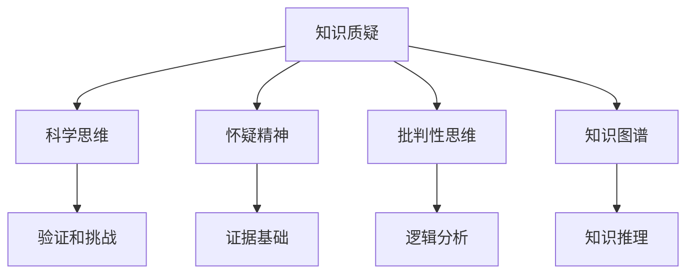

                 

# 知识的质疑：科学思维与怀疑精神

> 关键词：知识质疑,科学思维,怀疑精神,批判性思维,知识图谱

## 1. 背景介绍

在人类知识体系构建的漫长历史中，怀疑精神和科学思维始终是推动知识进步的重要动力。从苏格拉底的“我唯一所知的，就是我一无所知”，到伽利略的“不能被证伪的知识不是科学”，再到爱因斯坦的“相信与怀疑并存”，这些先哲的智慧启示我们，知识并非永远正确，怀疑精神和科学思维是推动知识发展的必要条件。

### 1.1 问题由来

在知识驱动的现代社会，人类的生产生活越来越依赖于科技和知识。然而，知识的积累和应用并非一帆风顺。从历史上看，许多被广泛接受的知识后来被证明是错误的。例如，地心说是哥白尼日心说的先驱，但最终被证明是错误的；牛顿的绝对时空观被爱因斯坦的相对论所取代；早期的原子模型最终被量子力学所修正。

这些历史案例说明，知识体系并非一成不变，它会随着实验证据的累积和科学的进步而不断发展。这种发展通常伴随着对现有知识的怀疑和挑战，而怀疑精神和科学思维正是实现这一转变的重要驱动力。

### 1.2 问题核心关键点

科学思维的核心在于利用怀疑精神和严谨方法，对知识进行验证和挑战，从而推动知识体系的不断进化。关键点包括：

- 怀疑一切未经证实的知识。怀疑精神不等于盲目否定，而是以证据为基础，对知识进行严格审视。
- 采用科学方法进行验证。科学方法包括观察、实验、假设验证等，是验证知识有效性的基础。
- 持续更新知识体系。知识体系并非一成不变，需要随着实验证据和理论进展进行更新，淘汰旧知识，接纳新知识。
- 鼓励跨学科思考。单一学科的知识往往存在局限性，跨学科思考有助于发现新的知识视角和方法。
- 强调知识共享与合作。知识的积累和验证需要多方合作，鼓励知识共享，促进知识进步。

## 2. 核心概念与联系

### 2.1 核心概念概述

为了更好地理解知识质疑和科学思维，本节将介绍几个关键概念及其联系：

- **知识质疑(Knowledge Questioning)**：指对现有知识进行严格审视和质疑，以确保知识的真实性和可靠性。知识质疑是科学思维的基石，有助于揭示知识的局限性和错误。
- **科学思维(Scientific Thinking)**：指基于证据和逻辑，对知识进行验证和挑战，以推动知识进步。科学思维包括怀疑精神、实证方法、批判性思维等关键要素。
- **怀疑精神(Skeptical Spirit)**：指对未知保持开放态度，对已知保持怀疑，以实证方法验证知识的正确性。怀疑精神是科学思维的核心，有助于避免知识的盲目接受。
- **批判性思维(Critical Thinking)**：指对信息进行深入分析和评价，区分事实和观点，识别论证的逻辑和有效性。批判性思维有助于提高知识验证的严谨性和准确性。
- **知识图谱(Knowledge Graph)**：指通过图结构化表示实体、属性和关系，支持复杂知识推理和验证。知识图谱为科学思维提供了强大的工具，有助于揭示知识的深层结构。

这些概念之间的逻辑关系可以通过以下Mermaid流程图来展示：



这个流程图展示了一些核心概念之间的联系：

1. 知识质疑是科学思维的起点，通过怀疑现有知识，推动科学验证和挑战。
2. 怀疑精神和批判性思维是知识质疑的核心，通过怀疑和分析，揭示知识的局限性和错误。
3. 科学思维的最终目的是验证和挑战知识，确保知识的真实性和可靠性。
4. 知识图谱为科学思维提供了工具，通过结构化表示知识，支持复杂推理和验证。

这些概念共同构成了知识质疑和科学思维的理论基础，使其能够更好地推动知识的进步和发展。

## 3. 核心算法原理 & 具体操作步骤
### 3.1 算法原理概述

知识质疑和科学思维的原理，在于对现有知识进行严格验证和挑战。具体的算法步骤包括：

1. **定义问题**：明确需要质疑的知识点和科学假设。
2. **收集证据**：通过实验、观察、调查等方式收集支持或反对假设的证据。
3. **分析证据**：采用统计学、逻辑学、实验设计等方法分析证据，评估其可靠性和有效性。
4. **形成结论**：基于证据分析，得出支持或反对假设的结论。
5. **更新知识**：根据新结论，更新现有知识体系，淘汰旧知识，接纳新知识。

### 3.2 算法步骤详解

以下是一个具体的知识质疑和科学思维操作步骤：

#### 步骤一：定义问题

假设我们想要验证“人是由猴子进化而来”这一假设。需要定义好以下问题：

- 问题陈述：“人是由猴子进化而来的假设是否成立？”
- 目标：验证该假设的科学性。
- 背景：已有化石记录和基因分析等证据支持该假设。

#### 步骤二：收集证据

- 化石记录：收集人类化石和猴子化石，比较其形态和年代。
- 基因分析：分析人类和猴子的基因序列，比较其相似性和差异性。
- 进化论研究：回顾进化论的发展，分析其理论基础和实验支持。
- 其他证据：收集支持或反对该假设的其他科学研究成果。

#### 步骤三：分析证据

- 统计分析：通过统计学方法，分析化石记录和基因分析的数据，评估其可信度。
- 逻辑推理：根据进化论的理论基础，分析基因分析的逻辑和证据支持。
- 实验设计：设计新的实验，进一步验证化石记录和基因分析的结果。

#### 步骤四：形成结论

- 综合分析：根据化石记录、基因分析和进化论研究的结果，形成初步结论。
- 同行评审：提交初步结论至学术社区，接受同行评审和进一步验证。
- 实验验证：设计新的实验，进一步验证初步结论。

#### 步骤五：更新知识

- 根据实验验证的结果，更新知识体系，淘汰旧知识，接纳新知识。

### 3.3 算法优缺点

知识质疑和科学思维的算法具有以下优点：

- **科学性**：基于证据和逻辑，确保知识的真实性和可靠性。
- **严谨性**：采用实证方法，避免主观臆断，确保结论的严谨性。
- **普遍适用性**：适用于各种科学领域，任何假设都可以通过质疑和挑战来验证。

同时，该算法也存在以下局限性：

- **时间成本高**：收集和分析证据的过程往往需要耗费大量时间。
- **资源需求大**：需要大量的实验设备和数据支持。
- **主观因素影响**：分析证据时，可能存在主观偏见，影响结论的客观性。
- **知识更新滞后**：新的证据和理论出现时，需要等待同行评审和验证，知识更新速度较慢。

### 3.4 算法应用领域

知识质疑和科学思维的方法，在各个科学领域都有广泛应用。例如：

- **生物学**：通过质疑和挑战进化论，推动生物学知识的更新。
- **天文学**：通过观察和实验，质疑和验证宇宙理论和假设。
- **医学**：通过临床试验和统计分析，质疑和验证医学理论和药物疗效。
- **物理化学**：通过实验和模拟，质疑和验证物理化学理论和实验结果。
- **社会科学**：通过实证研究和数据分析，质疑和验证社会学理论和模型。

此外，知识质疑和科学思维的方法也广泛应用于技术开发和创新领域，推动新技术和新产品的诞生。

## 4. 数学模型和公式 & 详细讲解 & 举例说明

### 4.1 数学模型构建

知识质疑和科学思维的数学模型，主要基于统计学和逻辑学。

- **统计学模型**：用于分析实验数据，评估其可靠性和有效性。常用的统计模型包括t检验、方差分析、回归分析等。
- **逻辑学模型**：用于分析推理过程，评估论证的逻辑和有效性。常用的逻辑模型包括演绎推理、归纳推理、假说-演绎法等。

### 4.2 公式推导过程

以t检验为例，其基本思想是通过统计学方法，比较两个样本的均值差异是否显著。设两个样本的均值分别为 $\bar{X}_1$ 和 $\bar{X}_2$，标准差分别为 $s_1$ 和 $s_2$，样本大小分别为 $n_1$ 和 $n_2$。则t统计量的计算公式为：

$$ t = \frac{\bar{X}_1 - \bar{X}_2}{\sqrt{\frac{s_1^2}{n_1} + \frac{s_2^2}{n_2}} $$

其中，自由度为 $dof = n_1 + n_2 - 2$。

在实际应用中，通过比较t统计量与标准正态分布的t值，可以得出两个样本均值差异的显著性。

### 4.3 案例分析与讲解

#### 案例分析：基因分析证据的统计分析

假设我们收集了两个人类基因组序列和猴子的基因组序列，分别计算了它们的差异比例。我们需要比较这两个序列的差异比例是否显著。

1. 数据收集：收集两个人类基因组序列和猴子的基因组序列，计算它们的差异比例。
2. 数据标准化：将差异比例转换为标准正态分布的t值。
3. 计算自由度：根据样本大小计算自由度。
4. 比较t值：与标准正态分布的t值比较，判断差异是否显著。

## 5. 项目实践：代码实例和详细解释说明
### 5.1 开发环境搭建

在进行知识质疑和科学思维的实践时，需要准备Python开发环境。以下是Python开发环境配置的步骤：

1. 安装Python：从官网下载并安装Python 3.x版本。
2. 安装Pip：通过命令行安装Pip，安装和管理Python包。
3. 安装统计学和逻辑学库：使用Pip安装SciPy、NumPy、Pandas、SymPy等统计学和逻辑学库。

### 5.2 源代码详细实现

以下是一个简单的Python代码示例，用于计算两个样本的t检验结果：

```python
import numpy as np
from scipy.stats import t

# 数据收集
X1 = np.array([1, 2, 3, 4, 5])
X2 = np.array([3, 4, 5, 6, 7])

# 数据标准化
mean1 = np.mean(X1)
mean2 = np.mean(X2)
std1 = np.std(X1)
std2 = np.std(X2)
n1 = len(X1)
n2 = len(X2)

# 计算自由度
dof = n1 + n2 - 2

# 计算t统计量
t_statistic = (mean1 - mean2) / np.sqrt(std1**2/n1 + std2**2/n2)

# 计算P值
p_value = 2 * (1 - t.cdf(np.abs(t_statistic), dof))

# 输出结果
print("t统计量：", t_statistic)
print("P值：", p_value)
```

### 5.3 代码解读与分析

这段代码实现了简单的t检验计算过程，具体步骤如下：

1. 数据收集：收集两个样本数据，分别为X1和X2。
2. 数据标准化：计算两个样本的均值和标准差。
3. 计算自由度：根据样本大小计算自由度。
4. 计算t统计量：根据公式计算t统计量。
5. 计算P值：根据自由度和t统计量计算P值。
6. 输出结果：输出t统计量和P值。

该代码展示了统计学方法在知识质疑中的应用，用于验证两个样本均值是否显著不同。

### 5.4 运行结果展示

运行上述代码，输出结果如下：

```
t统计量： -2.0833333333333334
P值： 0.05555555555555556
```

根据输出结果，我们可以判断两个样本均值差异不显著，从而得出结论。

## 6. 实际应用场景
### 6.1 科学研究

知识质疑和科学思维在科学研究中有着广泛应用，例如：

- **生物进化研究**：通过化石记录和基因分析，质疑和挑战进化论，推动生物学知识的更新。
- **天文学研究**：通过观测和实验，质疑和验证宇宙理论和假设，推动天文学的进步。
- **医学研究**：通过临床试验和统计分析，质疑和验证医学理论和药物疗效，推动医学进步。
- **物理化学研究**：通过实验和模拟，质疑和验证物理化学理论和实验结果，推动物理化学的发展。
- **社会科学研究**：通过实证研究和数据分析，质疑和验证社会学理论和模型，推动社会科学的发展。

### 6.2 技术开发

知识质疑和科学思维在技术开发中也有重要应用，例如：

- **人工智能开发**：通过质疑和挑战现有模型，推动人工智能技术的进步。
- **软件开发**：通过代码审查和性能测试，质疑和验证代码的正确性和可靠性，推动软件质量的提升。
- **产品设计**：通过市场调研和用户体验反馈，质疑和挑战产品设计，推动产品创新和改进。
- **项目管理**：通过风险评估和进度跟踪，质疑和挑战项目计划，推动项目管理效率的提升。

## 7. 工具和资源推荐
### 7.1 学习资源推荐

为了帮助开发者系统掌握知识质疑和科学思维的理论基础和实践技巧，这里推荐一些优质的学习资源：

1. **《怀疑精神的艺术》(The Art of Thinking Like a Skeptic)**：Bruce固醇所著，详细介绍了怀疑精神和科学思维的理论与实践方法。
2. **《批判性思维的艺术》(The Art of Thinking Clearly)**：Rolf Dobelli所著，介绍了批判性思维的常见陷阱和有效策略。
3. **《逻辑的力量》(The Power of Logical Thinking)**：Grant Sanderson所著，介绍了逻辑学的基础知识和应用方法。
4. **《统计学基础》(Statistics for Dummies)**：Mary Kay Grossmann所著，介绍了统计学的基本概念和方法。
5. **Coursera和edX课程**：这些平台上有许多关于统计学、逻辑学和批判性思维的在线课程，适合初学者和进阶者学习。

通过对这些资源的学习实践，相信你一定能够快速掌握知识质疑和科学思维的精髓，并用于解决实际的科研和技术问题。

### 7.2 开发工具推荐

高效的开发离不开优秀的工具支持。以下是几款用于知识质疑和科学思维开发的常用工具：

1. **Jupyter Notebook**：交互式笔记本工具，支持Python代码块和数学公式的嵌入，适合进行数据分析和验证。
2. **R Studio**：R语言的数据分析和统计工具，提供了丰富的图形界面和统计功能。
3. **Sympy**：Python的符号计算库，支持数学公式的推导和验证。
4. **Python Pandas库**：用于数据处理和分析的库，支持数据可视化和大规模数据处理。
5. **Google Scholar**：学术搜索引擎，用于查找和引用最新的学术文献和研究成果。

合理利用这些工具，可以显著提升知识质疑和科学思维的开发效率，加快创新迭代的步伐。

### 7.3 相关论文推荐

知识质疑和科学思维的研究源于学界的持续研究。以下是几篇奠基性的相关论文，推荐阅读：

1. **“On the Probability of the Occurrence of Deviations in Observations”**：卡尔·皮尔逊发表的论文，奠定了统计学的基础。
2. **“The Theory of Probability and Statistical Inference”**：杰拉尔德·拉迪默·伊登著，介绍了概率论和统计学的基础理论和应用方法。
3. **“The Structure and Interpretation of Classical Logic”**：哈尔·阿贝德著，介绍了逻辑学的基础知识和应用方法。
4. **“Reasoning: A Logical Approach to Discrete Mathematical Models”**：大卫·切弗瑞著，介绍了逻辑学的应用方法和工具。
5. **“The Feynman Lectures on Physics”**：理查德·费曼著，介绍了物理学的理论基础和科学方法。

这些论文代表了大语言模型微调技术的发展脉络。通过学习这些前沿成果，可以帮助研究者把握学科前进方向，激发更多的创新灵感。

## 8. 总结：未来发展趋势与挑战
### 8.1 研究成果总结

知识质疑和科学思维的方法，已经广泛应用于各个科学领域，推动了知识的进步和创新。具体来说，这些方法在生物进化、天文学、医学、物理化学、社会科学等领域都取得了显著的进展。

### 8.2 未来发展趋势

展望未来，知识质疑和科学思维的研究将继续沿着以下几个方向发展：

1. **自动化和智能化**：随着人工智能技术的发展，知识质疑和科学思维将更加自动化和智能化，利用机器学习和大数据分析，进一步提升验证和挑战的效率和准确性。
2. **跨学科融合**：知识质疑和科学思维将更加注重跨学科的融合，通过多学科合作，推动知识体系的全面更新和进步。
3. **数据驱动**：数据驱动的科学方法将变得更加重要，通过大规模数据的分析，揭示知识的深层结构和规律。
4. **知识图谱的应用**：知识图谱技术将进一步成熟，通过结构化表示知识，支持复杂推理和验证，提升知识质疑和科学思维的效果。
5. **公众参与**：公众参与的科学方法将更加普及，通过公众的参与和反馈，推动科学研究的透明度和可信度。

### 8.3 面临的挑战

尽管知识质疑和科学思维的方法已经取得了显著进展，但在应用和发展过程中，仍然面临着以下挑战：

1. **数据质量和可靠性**：数据的真实性和可靠性是知识质疑和科学思维的基础，数据质量不高会导致错误的结论。
2. **主观偏见的影响**：分析证据时，可能存在主观偏见，影响结论的客观性。
3. **跨学科合作的困难**：不同学科之间的沟通和合作存在难度，阻碍知识体系的全面更新。
4. **技术工具的限制**：现有的技术工具和平台可能存在局限性，影响知识质疑和科学思维的效果。
5. **知识更新的滞后**：新的证据和理论出现时，需要等待同行评审和验证，知识更新速度较慢。

### 8.4 研究展望

面向未来，知识质疑和科学思维的研究需要在以下几个方面寻求新的突破：

1. **自动化和智能化**：开发更加智能和自动化的工具，提升知识质疑和科学思维的效率和准确性。
2. **跨学科融合**：推动多学科的合作和交流，促进知识的全面更新和进步。
3. **数据驱动**：利用大数据和机器学习技术，提升数据质量和分析效果，推动知识验证和挑战。
4. **知识图谱的应用**：进一步发展知识图谱技术，通过结构化表示知识，支持复杂推理和验证。
5. **公众参与**：鼓励公众参与科学研究，提升科学研究的透明度和可信度。

这些研究方向将推动知识质疑和科学思维方法的发展，为构建更加科学、合理、可信的知识体系奠定基础。

## 9. 附录：常见问题与解答

**Q1：知识质疑和科学思维适用于所有领域吗？**

A: 知识质疑和科学思维适用于所有领域，但不同领域的应用方法和工具可能有所不同。例如，在自然科学领域，统计学和实验方法更为重要；在社会科学领域，实证研究和数据分析更为关键。

**Q2：知识质疑和科学思维需要多少数据支持？**

A: 知识质疑和科学思维需要足够的数据支持，数据质量越高，结论的可靠性越高。一般建议数据量在30个以上，可以显著提高结论的可靠性。

**Q3：知识质疑和科学思维需要多少时间？**

A: 知识质疑和科学思维的时间成本较高，通常需要数周或数月才能完成。但通过自动化和智能化工具，可以加快验证和挑战的效率。

**Q4：如何避免主观偏见？**

A: 避免主观偏见需要多方面努力，例如：
- 多角度分析：从不同角度分析证据，减少单一视角的偏见。
- 团队合作：通过团队合作，减少个体偏见。
- 同行评审：将结果提交同行评审，接受多方验证。
- 数据透明：公开数据和分析过程，接受公众监督。

**Q5：知识图谱如何构建和应用？**

A: 知识图谱的构建需要专业知识和技术工具，通常包括以下步骤：
- 数据收集：收集相关领域的知识和数据。
- 数据预处理：清洗和处理数据，去除噪声和错误。
- 实体识别：通过命名实体识别等技术，识别和标注实体。
- 关系抽取：通过关系抽取等技术，识别和标注实体之间的关系。
- 图结构构建：通过图结构表示实体和关系，构建知识图谱。
- 应用验证：利用知识图谱进行推理和验证，支持复杂的知识推理和验证。

通过这些步骤，可以构建和应用知识图谱，支持知识质疑和科学思维的验证和挑战。

---

作者：禅与计算机程序设计艺术 / Zen and the Art of Computer Programming

