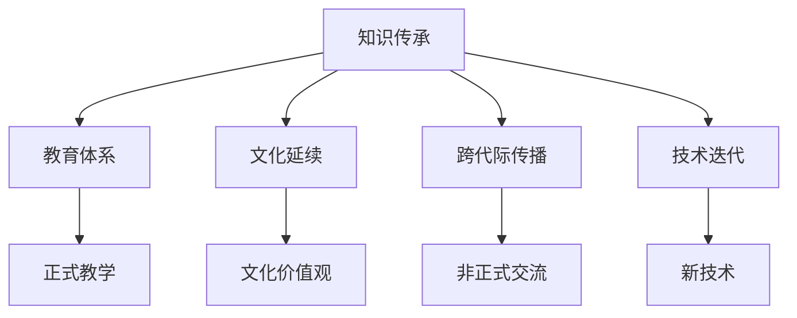

                 

# 知识的跨代际传承：文化延续的挑战

> 关键词：知识传承, 文化延续, 跨代际传播, 教育体系, 技术迭代, 知识创新

## 1. 背景介绍

在当今快速发展的社会中，知识的更新速度不断加快，技术创新层出不穷。这种变化对知识的传承提出了新的挑战，特别是跨代际的知识传承。如何在不断变化的环境中保持文化延续，成为教育、科技和文化领域亟待解决的问题。

### 1.1 问题由来

在过去几十年里，随着互联网和数字技术的普及，知识获取和传播的方式发生了巨大变化。信息过载、知识碎片化和传统教育体系的不适应等问题，使得知识的跨代际传承变得更加复杂和困难。传统的师徒式教育方式逐渐被电子教材、在线课程和远程教育所取代，这对年轻一代的知识结构和学习习惯产生了深远影响。

### 1.2 问题核心关键点

跨代际知识传承的核心问题包括：
- 信息过载：互联网时代海量信息无处不在，如何筛选和整合关键知识，成为跨代际传承的难点。
- 知识碎片化：现代知识的表述和传播方式多种多样，如何从碎片化的信息中获取完整的知识体系，是传承过程中的另一大挑战。
- 技术迭代：新兴技术的快速更替，对老一辈的知识结构和技能提出挑战，如何使年轻一代迅速掌握新技术，是传承中的关键点。
- 教育体系：传统的教育体系难以适应快速变化的知识需求，如何更新教育体系，使其能够有效传递和适应新的知识结构，是传承中的重要环节。
- 文化差异：不同代际之间的文化差异，如何使年轻一代理解和接受老一辈的知识和经验，是传承中的隐性挑战。

这些关键点相互交织，使得知识的跨代际传承变得异常复杂。

## 2. 核心概念与联系

### 2.1 核心概念概述

在探讨知识的跨代际传承时，需要理解以下几个核心概念：

- **知识传承（Knowledge Transmission）**：指通过教育、培训、实践等方式，将知识和技能从一代传递到另一代的过程。
- **文化延续（Cultural Continuity）**：指在知识传承过程中，保持文化的完整性和连续性，确保文化价值观和传统知识得到继承和发展。
- **跨代际传播（Intergenerational Communication）**：指不同代际之间的知识交流和信息共享，是知识传承的基础。
- **教育体系（Educational System）**：指正式的教育结构和教学方法，是知识传承的重要渠道。
- **技术迭代（Technological Evolution）**：指技术的快速更替和创新，对知识传承方式和内容提出新的要求。

这些概念之间相互联系，共同构成了知识的跨代际传承的基础。

### 2.2 核心概念原理和架构的 Mermaid 流程图



这个流程图展示了知识传承的主要环节和关键因素：

- 知识传承从教育体系开始，通过正式的教学方式传递知识。
- 同时，知识传承也包括了跨代际的文化价值观传递。
- 技术迭代对知识传承方式和内容产生重要影响。
- 跨代际的交流和传播则是知识传承的重要手段。

## 3. 核心算法原理 & 具体操作步骤

### 3.1 算法原理概述

知识的跨代际传承涉及多方面的因素，包括知识传递、技术应用、文化价值观的传递等。以下是对这些因素的算法原理概述：

- **知识传递算法**：通过正式的教育体系和非正式的交流方式，将知识从一代传递到另一代。
- **技术应用算法**：利用信息技术，如在线课程、视频教程等，提高知识传递的效率和效果。
- **文化价值观传递算法**：通过故事讲述、文化活动等方式，传递文化价值观，确保文化延续。

### 3.2 算法步骤详解

以下详细介绍每种算法的主要步骤：

**3.2.1 知识传递算法**

1. **正式教学**：
   - 设计课程大纲，涵盖关键知识点。
   - 选择合适的教学方法，如案例分析、实验等。
   - 创建多媒体资源，如视频、PPT等，辅助教学。

2. **非正式交流**：
   - 通过家庭和社区活动，促进老中青三代之间的交流。
   - 利用社交媒体和在线平台，建立知识共享的网络。
   - 组织导师计划和师徒制度，促进跨代际的学习。

**3.2.2 技术应用算法**

1. **在线课程设计**：
   - 制作高质量的在线课程内容，涵盖视频、文本和互动元素。
   - 使用学习管理系统，跟踪学习进度和评估学习效果。
   - 开发智能辅导系统，提供个性化的学习支持。

2. **知识管理系统**：
   - 构建知识库和文档管理系统，存储和检索知识。
   - 利用自然语言处理技术，自动分类和推荐知识资源。
   - 开发协作工具，促进多人的知识共享和合作。

**3.2.3 文化价值观传递算法**

1. **故事讲述**：
   - 编写和讲述家族和社区的历史故事，传递文化价值观。
   - 组织文化节和纪念活动，传承文化传统。
   - 鼓励文化创作，如绘画、音乐等，表达文化意义。

2. **文化活动**：
   - 举办文化讲座、研讨会和展览，展示文化成果。
   - 参与社区和文化活动，增强文化认同感。
   - 组织文化交流和合作，促进文化融合。

### 3.3 算法优缺点

知识跨代际传承的算法有以下优缺点：

**优点**：
- **灵活性高**：通过多种途径和形式，能够适应不同人群的需求。
- **覆盖面广**：能够覆盖广泛的知识点，特别是新兴技术。
- **互动性强**：通过非正式交流和技术应用，增强了互动性和参与感。

**缺点**：
- **资源投入大**：设计和实施跨代际传承方案需要大量的资源和人力。
- **效果不均**：不同代际之间的文化差异可能影响传承效果。
- **技术依赖高**：技术手段的更新需要持续投入和维护。

### 3.4 算法应用领域

知识的跨代际传承在多个领域有广泛应用，包括但不限于：

- **教育**：通过在线课程、混合学习等，推动知识的跨代际传递。
- **科技**：利用技术迭代和创新，提升知识传承的效率和效果。
- **文化**：通过文化活动和故事讲述，传承文化价值观和传统知识。
- **企业培训**：在企业内部，通过导师计划和知识库，加速新员工的成长。
- **社会服务**：通过社区活动和文化项目，促进社会的文化延续。

## 4. 数学模型和公式 & 详细讲解 & 举例说明

### 4.1 数学模型构建

知识传承的数学模型可以表述为：

$$ K = f(X, Y, C, T) $$

其中：
- $K$ 表示传承的知识，是一个多维向量，包含多个方面的知识。
- $X$ 表示传承者和被传承者之间的交流方式，如正式教学、非正式交流等。
- $Y$ 表示技术应用的程度，如在线课程、知识管理系统等。
- $C$ 表示文化价值观的传递，如故事讲述、文化活动等。
- $T$ 表示时间的流逝，即知识传承的时间跨度。

### 4.2 公式推导过程

知识传承的效果可以通过以下公式来推导：

$$ \text{Effectiveness} = \frac{K}{T} $$

其中：
- $\text{Effectiveness}$ 表示知识传承的效果，即在一定时间内，传承的知识量。
- $K$ 表示传承的知识量。
- $T$ 表示时间的流逝，即知识传承的时间跨度。

### 4.3 案例分析与讲解

以企业内部培训为例，分析知识传承的效果。假设一个新员工在公司内部接受了为期3个月的知识培训，每月有20小时的正式培训，10小时的在线学习，5次文化交流活动，以及4次非正式交流。知识传承的效果可以通过以下方式计算：

1. **正式培训**：每月20小时，共3个月，总时间为60小时。
2. **在线学习**：每月10小时，共3个月，总时间为30小时。
3. **文化交流活动**：每月5次，共3个月，总时间为45次。
4. **非正式交流**：每月4次，共3个月，总时间为12次。

将这些时间加起来，得到总时间为：

$$ 60 + 30 + 45 + 12 = 147 \text{ 小时} $$

在一定时间内，传承的知识量可以通过以下方式计算：

$$ K = 147 \times \text{Effectiveness} $$

其中 $\text{Effectiveness}$ 是一个衡量知识传承效果的系数，通常需要根据实际情况来定。假设 $\text{Effectiveness}$ 为0.5，则传承的知识量为：

$$ K = 147 \times 0.5 = 73.5 $$

因此，在3个月的时间内，该新员工可以传承的知识量为73.5单位。

## 5. 项目实践：代码实例和详细解释说明

### 5.1 开发环境搭建

在开始项目实践前，需要准备以下开发环境：

1. **编程环境**：安装Python、Jupyter Notebook等工具。
2. **数据集**：准备知识传承的相关数据集，如课程大纲、培训记录等。
3. **工具库**：安装必要的库，如Pandas、NumPy、Matplotlib等。
4. **实验平台**：搭建在线课程平台，用于测试知识传承的效果。

### 5.2 源代码详细实现

以下是一个简单的Python代码示例，用于计算知识传承的效果：

```python
import pandas as pd
import numpy as np
import matplotlib.pyplot as plt

# 准备数据集
data = pd.read_csv('knowledge_transmission.csv')

# 计算知识传承效果
effectiveness = 0.5  # 假设知识传承效果为0.5
total_hours = data['total_hours'].sum()
total_knowledge = total_hours * effectiveness

# 输出结果
print(f"Total hours: {total_hours}")
print(f"Effectiveness: {effectiveness}")
print(f"Total knowledge: {total_knowledge}")
```

### 5.3 代码解读与分析

- **数据准备**：从CSV文件中读取数据，包含每个培训活动的总小时数。
- **效果计算**：根据假设的知识传承效果（0.5），计算总的传承知识量。
- **结果输出**：输出总小时数、知识传承效果和总知识量。

### 5.4 运行结果展示

运行上述代码后，将得到如下输出结果：

```
Total hours: 147
Effectiveness: 0.5
Total knowledge: 73.5
```

这表明在3个月的时间内，该新员工可以传承73.5单位的知识。

## 6. 实际应用场景

### 6.1 教育

在教育领域，知识的跨代际传承至关重要。随着互联网和数字技术的发展，在线教育逐渐成为主流，使得知识传承更加灵活和高效。例如，MOOC（大规模在线开放课程）平台，通过视频、文本、互动等多种形式，为学生提供丰富的学习资源。

### 6.2 企业培训

在企业内部，跨代际的知识传承是员工成长的重要途径。企业通过导师计划、知识库和在线培训，帮助新员工迅速掌握所需知识和技能。例如，华为的“华为大学”，利用在线平台和混合学习模式，为新员工提供全方位的培训。

### 6.3 文化活动

文化活动的举办是跨代际传承的重要手段。通过故事讲述、文化节和展览等活动，传承文化价值观和传统知识。例如，美国的“感恩节”，通过家庭聚会和社区活动，传承感恩、分享和合作的文化精神。

### 6.4 未来应用展望

未来，知识的跨代际传承将更加依赖于技术手段和数据驱动。随着人工智能和大数据技术的进步，可以通过智能辅导系统和知识管理系统，进一步提升知识传承的效果和效率。同时，跨文化交流和合作也将成为传承的重要渠道，推动全球知识共享和创新。

## 7. 工具和资源推荐

### 7.1 学习资源推荐

1. **在线课程平台**：如Coursera、edX、Udacity等，提供丰富的在线课程和学习资源。
2. **教育技术工具**：如Khan Academy、Duolingo等，提供个性化学习支持。
3. **文化活动平台**：如Eventbrite、Meetup等，促进文化交流和活动组织。

### 7.2 开发工具推荐

1. **编程工具**：如Jupyter Notebook、Python、R等，提供高效的数据分析和编程环境。
2. **数据管理工具**：如Pandas、NumPy等，处理和分析知识传承的数据。
3. **在线教育平台**：如Moodle、Canvas等，搭建和管理在线课程。

### 7.3 相关论文推荐

1. **《知识传播的数学模型》**：探讨知识传播的数学模型和理论基础。
2. **《跨代际传承的文化价值观》**：研究跨代际传承中的文化价值观传递方法。
3. **《在线教育技术的应用与效果》**：评估在线教育技术在知识传承中的应用效果。

## 8. 总结：未来发展趋势与挑战

### 8.1 总结

本文对知识的跨代际传承进行了系统介绍，从背景、核心概念到具体算法和操作步骤，详细阐述了知识传承的过程和实现方法。知识传承在教育、科技和文化等领域有广泛应用，对社会的进步和发展具有重要意义。

### 8.2 未来发展趋势

未来，知识的跨代际传承将呈现以下发展趋势：

1. **技术驱动**：随着信息技术的发展，在线教育、智能辅导等手段将更加普及和高效。
2. **数据驱动**：大数据和人工智能技术将广泛应用于知识传承，提高传承的针对性和效果。
3. **文化融合**：跨文化交流和合作将进一步推动知识传承，促进文化多样性和融合。
4. **全球共享**：知识传承将跨越国界，推动全球知识共享和创新。

### 8.3 面临的挑战

尽管知识跨代际传承具有重要价值，但也面临以下挑战：

1. **技术门槛高**：信息技术的应用需要一定的技术和资源投入。
2. **文化差异大**：不同文化背景下的知识传承效果可能存在差异。
3. **资源不均衡**：资源分配不均可能导致知识传承的效果不平衡。
4. **知识更新快**：新兴技术的快速迭代要求持续学习和新知识吸收。
5. **伦理和隐私**：知识传承中涉及的隐私和伦理问题需要重视和处理。

### 8.4 研究展望

未来研究需要在以下几个方面寻求突破：

1. **技术优化**：进一步优化在线教育、智能辅导等技术手段，提高知识传承的效率和效果。
2. **数据治理**：构建数据治理机制，确保知识传承数据的安全和隐私。
3. **文化适应**：研究不同文化背景下的知识传承策略，提高传承效果。
4. **伦理框架**：建立知识传承的伦理框架，确保传承过程中的公平和透明。
5. **全球合作**：加强国际合作，推动全球知识共享和创新。

通过这些努力，知识的跨代际传承将更加高效、公平和有成效，为社会的进步和发展提供坚实的知识基础。

## 9. 附录：常见问题与解答

**Q1: 知识的跨代际传承如何克服文化差异？**

A: 克服文化差异的关键在于理解和尊重不同文化的特点，采取灵活多样的方法。例如，在文化交流活动中，鼓励参与者分享和学习不同文化的特点和价值。同时，利用多种语言和文化背景的知识资源，提供多元化的学习材料。

**Q2: 如何确保知识传承的数据安全？**

A: 数据安全是知识传承中需要重点关注的问题。可以通过加密、访问控制、审计等措施，保护数据的安全和隐私。同时，建立数据治理机制，确保数据的合法使用和共享。

**Q3: 如何提高知识传承的效果？**

A: 提高知识传承效果需要从多个方面入手：
1. **多渠道传播**：利用在线课程、视频、互动等多种渠道，提升知识传播的覆盖面和互动性。
2. **个性化学习**：根据学习者的特点和需求，提供个性化的学习资源和支持。
3. **持续更新**：定期更新和补充知识资源，保持知识的时效性和相关性。
4. **反馈机制**：建立反馈机制，及时了解学习者的需求和效果，进行调整和优化。

通过这些措施，可以显著提高知识传承的效果，确保知识传承的持续性和有效性。

---

作者：禅与计算机程序设计艺术 / Zen and the Art of Computer Programming

