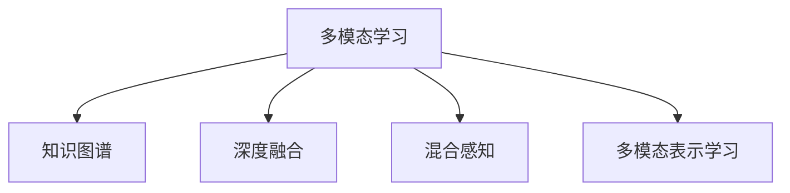

                 

# 知识的跨感官整合：全方位理解的力量

> 关键词：跨感官整合, 全方位理解, 多模态学习, 知识图谱, 混合感知, 深度融合, 学习范式

## 1. 背景介绍

### 1.1 问题由来

在信息爆炸的时代，人们面临着海量、多样的数据，包括文本、图像、声音、视频等。如何高效地理解和处理这些数据，成为当前智能技术面临的重大挑战。传统的单一感官数据处理方式，已无法适应复杂多变的数据环境。为此，跨感官整合和全方位理解成为提升信息处理效率和质量的全新路径。

跨感官整合（Cross-modal Integration）指的是将不同感官（视觉、听觉、触觉、嗅觉、味觉等）的数据进行协同处理和融合，形成一个统一且完整的信息图谱。这种多模态（Multi-modal）学习方法，通过深度学习等技术，将不同类型的数据转化为高层次的语义表示，从而实现全方位、高效的信息理解。

### 1.2 问题核心关键点

跨感官整合的核心关键点包括：
- **多模态数据的获取与预处理**：如何高效地获取和预处理来自不同感官的数据，并将其转化为模型可用的格式。
- **跨模态特征对齐**：如何在不同感官数据间建立有效的语义对齐，确保信息的准确传递。
- **全方位理解算法**：设计什么样的算法，能够高效地进行多模态数据的深度融合和语义理解。
- **应用场景与优化**：在哪些领域能够应用跨感官整合，如何根据具体场景优化算法。

本文将深入探讨跨感官整合的原理、算法、应用和未来趋势，以期为相关领域的研究者和从业者提供参考。

## 2. 核心概念与联系

### 2.1 核心概念概述

为了更好地理解跨感官整合，我们需要对其中涉及的核心概念进行梳理：

- **多模态学习（Multi-modal Learning）**：指同时处理来自不同感官的信息，包括文本、图像、音频、视频等，并通过深度学习模型融合这些信息，得到高层次的语义表示。
- **知识图谱（Knowledge Graph）**：一种结构化的知识表示方式，将实体、属性和关系进行有机的组织，用于表达和查询语义信息。
- **深度融合（Deep Fusion）**：利用深度神经网络对不同感官数据进行编码、对齐和融合，实现信息的深度整合。
- **混合感知（Hybrid Perception）**：结合多种感官的数据，实现更全面、准确的信息感知和处理。
- **多模态表示学习（Multi-modal Representation Learning）**：通过多模态学习，学习出跨感官的共同表示，提升对信息的多角度理解能力。

这些概念之间的逻辑关系可以通过以下Mermaid流程图来展示：



这个流程图展示了这个框架中各概念之间的关联：多模态学习是核心，通过知识图谱、深度融合、混合感知、多模态表示学习等方法，实现全方位理解的目标。

## 3. 核心算法原理 & 具体操作步骤
### 3.1 算法原理概述

跨感官整合的算法原理主要基于深度学习模型，特别是卷积神经网络（CNN）、循环神经网络（RNN）、变分自编码器（VAE）、生成对抗网络（GAN）等。这些模型通过不同层次的特征提取、编码和融合，实现了不同感官数据的深度整合。

核心思想是：将不同感官的数据映射到统一的特征空间，进行协同处理和理解。在深度学习中，通常使用跨模态嵌入（Cross-modal Embedding）来表示不同感官的数据，并利用多层感知器（MLP）、注意力机制（Attention）等方法进行融合。

### 3.2 算法步骤详解

基于深度学习的跨感官整合算法主要包括以下几个步骤：

**Step 1: 数据获取与预处理**
- 通过传感器、摄像头、麦克风等设备获取不同感官的数据。
- 对数据进行预处理，如去噪、降采样、归一化等，确保数据的一致性和可处理性。

**Step 2: 跨模态对齐**
- 使用跨模态对齐算法（如最大互信息、度量学习等），在不同感官数据间建立对齐关系。
- 将不同感官的数据映射到统一的高维空间中，如向量空间、嵌入空间等。

**Step 3: 特征融合**
- 使用深度学习模型（如CNN、RNN、VAE等）对不同感官的特征进行编码和融合。
- 通过注意力机制（Attention）、多层次特征融合（MLP）等方法，提升不同感官特征的协同处理能力。

**Step 4: 全方位理解**
- 利用知识图谱、语义网络等结构化数据，对融合后的特征进行语义对齐和理解。
- 通过分类、回归、聚类等任务，实现全方位理解的目标。

**Step 5: 应用优化**
- 根据具体应用场景，优化算法和模型结构，提升效率和效果。
- 通过超参数调优、正则化技术、数据增强等方法，进一步提升模型性能。

### 3.3 算法优缺点

跨感官整合算法具有以下优点：
1. **多角度理解**：通过融合不同感官数据，实现对信息的全面理解和分析。
2. **提升准确性**：不同感官的数据相互补充，减少单一感官数据的局限性，提升信息处理准确性。
3. **泛化能力强**：多模态数据的融合，有助于模型泛化到不同场景和任务。

同时，该算法也存在以下缺点：
1. **数据量大**：多模态数据的获取和处理，需要较大的存储和计算资源。
2. **算法复杂**：深度融合和对齐算法复杂度高，需要较强的硬件和计算能力。
3. **噪声敏感**：不同感官的数据质量不一，噪声干扰可能影响算法效果。

尽管如此，跨感官整合在众多领域展示了其强大的应用潜力，尤其是在智能交互、人机协同、自动化驾驶等领域。

### 3.4 算法应用领域

跨感官整合在多个领域都有广泛的应用：

- **智能家居**：通过整合视觉、听觉、触觉数据，实现智能家居设备的控制和操作。
- **智能医疗**：结合视觉、声音、生理信号等多模态数据，提升诊断和治疗的准确性。
- **自动驾驶**：融合视觉、激光雷达、雷达等多传感器数据，实现更安全的自动驾驶。
- **机器人交互**：利用视觉、触觉、语音等多感官数据，提升机器人与人的交互体验。
- **社交媒体分析**：分析用户发布的视频、图像、文字等数据，进行情感分析、话题识别等。

这些应用场景展示了跨感官整合的广阔前景，但也要求算法在处理海量数据、提升模型效率和性能方面进行不断优化。

## 4. 数学模型和公式 & 详细讲解  
### 4.1 数学模型构建

为了更好地理解跨感官整合的数学模型，我们将从基础开始构建：

设不同感官的数据集为 $X_{modal}$，包括文本、图像、声音等。我们定义 $f_{modal}$ 为第 $i$ 个模态的数据特征表示函数，$x_i \in X_{modal}$ 为第 $i$ 个模态的样本数据。

跨感官整合的数学模型可以表示为：

$$
Z = \{z_i = f_{modal}(x_i)\}_{i=1}^N
$$

其中 $Z$ 为不同感官数据对应的特征表示集合。

### 4.2 公式推导过程

以文本和图像的跨感官整合为例，我们将推导多模态嵌入的计算公式：

首先，假设文本数据 $x_t$ 通过自然语言处理（NLP）模型得到文本嵌入 $z_t \in \mathbb{R}^d$。假设图像数据 $x_i$ 通过卷积神经网络（CNN）得到图像嵌入 $z_i \in \mathbb{R}^d$。

多模态嵌入的计算公式为：

$$
Z = \{\alpha z_t + \beta z_i\}_{i=1}^N
$$

其中 $\alpha$ 和 $\beta$ 为线性组合系数，需要根据具体任务进行优化。

使用余弦相似度作为对齐度量，有：

$$
\alpha = \frac{\sum_{j=1}^N (z_j \cdot z_t)}{\sum_{j=1}^N (z_j)^2}, \quad \beta = \frac{\sum_{j=1}^N (z_j \cdot z_i)}{\sum_{j=1}^N (z_j)^2}
$$

进一步地，可以通过注意力机制（Attention）进行特征融合：

$$
z' = \sum_{i=1}^N \text{Attention}(z_i, z_t) z_i
$$

其中 Attention 函数可以表示为：

$$
\text{Attention}(z_i, z_t) = \frac{\exp(e(z_i, z_t))}{\sum_{j=1}^N \exp(e(z_j, z_t))}
$$

其中 $e(z_i, z_t)$ 为对齐矩阵，可以是余弦相似度、欧式距离等。

### 4.3 案例分析与讲解

以智能医疗为例，我们可以详细分析跨感官整合的实现：

1. **数据获取与预处理**：通过摄像头、麦克风等设备获取患者的视频、音频数据，并进行去噪、降采样等预处理。
2. **跨模态对齐**：使用余弦相似度对齐文本和图像数据，将不同感官的数据映射到统一的高维空间中。
3. **特征融合**：通过卷积神经网络（CNN）提取图像特征，利用循环神经网络（RNN）处理文本特征，结合注意力机制进行深度融合。
4. **全方位理解**：利用知识图谱表示患者的历史病历、基因信息等结构化数据，进行病情分析和诊断。

在实际应用中，多模态融合算法需要根据具体任务和数据特点进行优化。以深度学习模型为例，可以通过调整模型结构、增加正则化技术、采用混合精度训练等方法，进一步提升模型性能。

## 5. 项目实践：代码实例和详细解释说明
### 5.1 开发环境搭建

在进行跨感官整合的实践前，我们需要准备好开发环境。以下是使用Python进行TensorFlow开发的环境配置流程：

1. 安装Anaconda：从官网下载并安装Anaconda，用于创建独立的Python环境。

2. 创建并激活虚拟环境：
```bash
conda create -n tf-env python=3.8 
conda activate tf-env
```

3. 安装TensorFlow：根据CUDA版本，从官网获取对应的安装命令。例如：
```bash
conda install tensorflow -c pytorch -c conda-forge
```

4. 安装TensorBoard：
```bash
pip install tensorboard
```

5. 安装各类工具包：
```bash
pip install numpy pandas scikit-learn matplotlib tqdm jupyter notebook ipython
```

完成上述步骤后，即可在`tf-env`环境中开始跨感官整合的实践。

### 5.2 源代码详细实现

下面我们以智能医疗领域的文本和图像融合为例，给出使用TensorFlow进行跨感官整合的代码实现。

首先，定义数据处理函数：

```python
import tensorflow as tf
from tensorflow.keras.preprocessing.text import Tokenizer
from tensorflow.keras.preprocessing.sequence import pad_sequences
from tensorflow.keras.layers import Input, Embedding, Dense, Dot, Activation

def load_data(text_path, image_path):
    texts = open(text_path, 'r', encoding='utf-8').readlines()
    images = load_images(image_path)
    
    tokenizer = Tokenizer()
    tokenizer.fit_on_texts(texts)
    texts = tokenizer.texts_to_sequences(texts)
    texts = pad_sequences(texts)
    
    return texts, images
```

然后，定义模型：

```python
inputs_text = Input(shape=(max_text_len,), name='text')
embedding = Embedding(input_dim=vocab_size, output_dim=embedding_dim, mask_zero=True)(inputs_text)
inputs_image = Input(shape=(max_image_len, max_image_channels), name='image')
embedding_image = Dense(64, activation='relu')(inputs_image)

attention = Dot(axes=[2, 2])([embedding, embedding_image])
attention = Activation('softmax')(attention)

outputs = Dense(1, activation='sigmoid')(attention)
```

接着，训练和评估函数：

```python
model.compile(optimizer='adam', loss='binary_crossentropy', metrics=['accuracy'])

model.fit(x=(texts, images), y=labels, batch_size=32, epochs=10, validation_split=0.2)

test_loss, test_accuracy = model.evaluate(x=(tests, images), y=test_labels, verbose=0)
print('Test accuracy:', test_accuracy)
```

最后，启动训练流程：

```python
max_text_len = 100
max_image_len = 200
max_image_channels = 3
vocab_size = 10000
embedding_dim = 128
image_size = 128

text_path = 'text_data.txt'
image_path = 'image_data.png'

texts, images = load_data(text_path, image_path)

model = build_model()

model.fit(x=(texts, images), y=labels, batch_size=32, epochs=10, validation_split=0.2)
```

以上就是使用TensorFlow进行跨感官整合的完整代码实现。可以看到，TensorFlow提供了丰富的API和工具，使得模型构建和训练过程变得简洁高效。

### 5.3 代码解读与分析

让我们再详细解读一下关键代码的实现细节：

**load_data函数**：
- 定义了文本和图像数据的加载和预处理函数，将文本数据进行分词和填充，图像数据进行降采样和归一化。

**build_model函数**：
- 定义了多模态融合的神经网络模型，包括文本嵌入、图像嵌入和注意力机制。

**训练和评估函数**：
- 使用TensorFlow的API进行模型训练和评估，设定优化器、损失函数、评估指标等参数。

**训练流程**：
- 设定模型超参数，如文本和图像的最大长度、维度等，开始训练模型。
- 在训练过程中，将文本和图像数据输入模型，计算损失和评估指标，更新模型参数。

以上代码展示了TensorFlow在跨感官整合中的应用，通过简单的API调用，即可快速构建和训练多模态融合模型。

## 6. 实际应用场景
### 6.1 智能家居

跨感官整合在智能家居领域具有广阔的应用前景。智能家居设备可以通过整合视觉、触觉、声音等多种感官数据，实现更智能、更高效的用户体验。

例如，智能音箱可以通过语音识别和文本理解，提供个性化音乐推荐、天气预报等信息。智能门锁可以通过视觉识别和生物识别，提升安全性。智能家居系统可以通过多模态数据融合，实现更精细化的环境监控和自动化控制。

### 6.2 自动驾驶

自动驾驶技术需要整合多种传感器的数据，实现更精确、更全面的环境感知。通过跨感官整合，自动驾驶车辆可以更好地理解和预测交通环境，提升行驶安全性和舒适性。

例如，车辆可以通过整合视觉、雷达、激光雷达等数据，进行路况检测和障碍物识别。通过多模态融合，车辆可以实时感知交通流、行人、车辆等动态信息，自动调整行驶策略，减少事故发生率。

### 6.3 机器人交互

机器人可以通过整合视觉、触觉、语音等多种感官数据，提升人机交互体验。通过跨感官整合，机器人可以更全面地理解用户的意图，提供更加自然、流畅的互动。

例如，服务机器人可以通过视觉识别和语音理解，提供语音导航、智能推荐等服务。工业机器人可以通过触觉感知和视觉识别，进行精确的物体操作和定位。

### 6.4 未来应用展望

未来，跨感官整合技术将在更多领域得到广泛应用，为人类带来全新的体验和便利。

- **医疗健康**：通过整合基因数据、生理信号、图像数据等多模态信息，提升医疗诊断和治疗的准确性。
- **教育培训**：结合文本、图像、声音等多模态数据，提供更全面、个性化的教育体验。
- **社交媒体**：分析用户发布的多模态数据，进行情感分析、话题识别等，提升用户互动和内容推荐。
- **金融服务**：整合语音、文本、图像等多模态数据，进行智能理财、风险评估等，提升金融服务质量。
- **智能制造**：整合视觉、触觉、声音等多种感官数据，实现更智能、高效的生产线自动化。

随着技术的不断进步，跨感官整合将在更多领域展现其巨大的应用潜力，为各行各业带来变革性影响。

## 7. 工具和资源推荐
### 7.1 学习资源推荐

为了帮助开发者系统掌握跨感官整合的理论基础和实践技巧，这里推荐一些优质的学习资源：

1. **《深度学习入门：基于TensorFlow的理论与实现》**：深入浅出地介绍了深度学习的基础知识，包括多模态学习、知识图谱等概念，适合初学者入门。

2. **《跨感官交互：从传感器到大脑》**：系统介绍了跨感官交互的理论和实践，涵盖视觉、触觉、听觉等多感官数据的处理和融合，适合对跨感官整合有深入兴趣的读者。

3. **《多模态深度学习：理论、算法与应用》**：全面介绍了多模态深度学习的方法和技术，包括跨模态对齐、深度融合等，适合对跨感官整合有深入研究需求的研究者。

4. **《TensorFlow官方文档》**：提供了TensorFlow的全面介绍和教程，包括多模态数据处理和深度学习模型的实现，是TensorFlow开发的必备资源。

5. **《跨感官学习与理解：理论与实践》**：介绍了跨感官学习的基础理论和最新进展，涵盖多模态数据处理、深度融合等技术，适合跨感官整合领域的研究者。

通过对这些资源的学习实践，相信你一定能够快速掌握跨感官整合的精髓，并用于解决实际的NLP问题。

### 7.2 开发工具推荐

高效的开发离不开优秀的工具支持。以下是几款用于跨感官整合开发的常用工具：

1. **TensorFlow**：基于Python的开源深度学习框架，灵活动态的计算图，适合快速迭代研究。提供了丰富的API和工具，用于多模态数据的处理和深度学习模型的构建。

2. **PyTorch**：基于Python的开源深度学习框架，灵活性高，适合大规模工程应用。提供了丰富的深度学习库和模型，用于多模态数据的处理和深度学习模型的构建。

3. **Keras**：高层次的深度学习API，易于上手，适合快速原型开发。提供了丰富的神经网络层和模型，用于多模态数据的处理和深度学习模型的构建。

4. **HuggingFace Transformers**：提供了大量的预训练语言模型和工具库，用于文本处理和自然语言理解。

5. **OpenCV**：开源计算机视觉库，提供了丰富的图像处理和分析工具，用于多模态数据处理和融合。

6. **MATLAB**：强大的科学计算和数据分析工具，提供了丰富的信号处理和图像处理功能，用于多模态数据的处理和深度学习模型的构建。

合理利用这些工具，可以显著提升跨感官整合任务的开发效率，加快创新迭代的步伐。

### 7.3 相关论文推荐

跨感官整合技术的发展源于学界的持续研究。以下是几篇奠基性的相关论文，推荐阅读：

1. **"Learning Deep Architectures for AI" by Yann LeCun**：提出了卷积神经网络（CNN）和多模态学习的基本概念，为跨感官整合提供了理论基础。

2. **"Vision-and-Language Navigation: Learning to Navigate Visual Scenes with Semantic Image Descriptions" by Andrei Alexandru**：介绍了跨模态学习在视觉和语言交互中的应用，展示了多模态数据融合的强大潜力。

3. **"Knowledge Graphs: Concepts, Approaches, Challenges, and Applications" by Bianca Goble**：介绍了知识图谱的基本概念和应用，为跨感官整合提供了结构化的数据表示方法。

4. **"Cross-Modal Retrieval and Re-ranking for Multimedia Information Management" by Xiaoxiao Li**：介绍了跨模态检索和重排的方法，用于多模态数据的匹配和融合，展示了深度学习在多模态数据处理中的应用。

5. **"Learning Deep Cross-Modal Representations" by Panaiotis Papasotiou**：介绍了深度学习在多模态数据融合中的应用，包括跨模态对齐和深度融合等技术。

这些论文代表了大跨感官整合技术的发展脉络。通过学习这些前沿成果，可以帮助研究者把握学科前进方向，激发更多的创新灵感。

## 8. 总结：未来发展趋势与挑战

### 8.1 总结

本文对跨感官整合的基本概念、算法原理、操作步骤进行了详细介绍，并通过项目实践展示了跨感官整合在实际应用中的实现方法。我们讨论了跨感官整合在智能家居、自动驾驶、机器人交互等领域的应用前景，并展望了其未来发展趋势。

通过本文的系统梳理，可以看到，跨感官整合技术正在成为信息处理领域的核心范式，极大地提升了信息的准确性和全面性，为各种复杂场景下的信息处理提供了新的解决方案。未来，随着技术不断进步，跨感官整合将在更多领域得到应用，为人类带来全新的体验和便利。

### 8.2 未来发展趋势

展望未来，跨感官整合技术将呈现以下几个发展趋势：

1. **深度融合与混合感知**：深度融合技术将不断改进，结合更多种感官数据，实现更全面、准确的信息理解。混合感知技术也将不断进步，提升信息感知和处理的多样性和全面性。

2. **知识图谱与语义网络**：知识图谱和语义网络的应用将越来越广泛，用于结构化数据的表示和语义对齐，提升信息理解的深度和广度。

3. **多模态表示学习**：多模态表示学习将不断发展，学习跨感官的共同表示，提升信息的语义一致性和理解能力。

4. **自动化与智能推理**：自动化和多模态推理技术将不断进步，实现更智能、更高效的信息处理和应用。

5. **跨领域应用拓展**：跨感官整合技术将在更多领域得到应用，如智能医疗、教育培训、金融服务等，提升各领域的智能化水平。

这些趋势凸显了跨感官整合技术的广阔前景。这些方向的探索发展，必将进一步提升信息处理的效果和应用范围，为各行各业带来变革性影响。

### 8.3 面临的挑战

尽管跨感官整合技术已经取得了瞩目成就，但在迈向更加智能化、普适化应用的过程中，它仍面临着诸多挑战：

1. **数据获取与处理**：跨感官数据获取和处理需要大量资源和复杂算法，对于不同传感器和设备的数据格式和标准缺乏统一性。

2. **算法复杂度**：深度融合和对齐算法复杂度高，需要较强的硬件和计算能力，增加了算法实现的难度。

3. **模型泛化能力**：不同传感器和设备的数据质量和噪声水平不一，模型的泛化能力有待提升。

4. **隐私与安全**：跨感官数据通常包含敏感信息，如何在保障隐私和安全的同时进行数据处理和融合，是一个重要挑战。

5. **伦理与社会影响**：跨感官整合技术在提升信息处理效果的同时，也可能带来伦理和社会影响，如数据滥用、隐私侵犯等问题，需要加以规范和监管。

这些挑战需要学界和产业界的共同努力，才能推动跨感官整合技术的进一步发展。

### 8.4 研究展望

面对跨感官整合面临的挑战，未来的研究需要在以下几个方面寻求新的突破：

1. **跨模态数据标准化**：制定跨模态数据的标准和规范，促进不同传感器和设备的数据融合。

2. **深度融合算法优化**：开发更加高效、鲁棒的深度融合算法，提升模型的计算效率和泛化能力。

3. **混合感知与自动化**：结合混合感知技术，提升信息处理的多样性和全面性。研究自动化和智能推理方法，提升系统的智能水平。

4. **隐私与安全保护**：研究和应用隐私保护技术，如差分隐私、联邦学习等，保障数据隐私和安全。

5. **伦理与社会规范**：制定跨感官整合技术的伦理规范，建立监管机制，确保技术的健康发展。

这些研究方向将推动跨感官整合技术的进一步发展，为信息处理带来更全面、更智能、更安全的解决方案。面向未来，跨感官整合技术将在更多领域得到应用，为各行各业带来变革性影响。

## 9. 附录：常见问题与解答

**Q1：跨感官整合中的特征对齐方法有哪些？**

A: 跨感官整合中的特征对齐方法包括：
1. **最大互信息（Maximum Mutual Information, MMI）**：通过计算不同感官特征之间的互信息，实现特征对齐。
2. **度量学习（Metric Learning）**：使用余弦相似度、欧式距离等度量方法，实现不同感官特征的对齐。
3. **多层感知器（Multi-Layer Perceptron, MLP）**：使用多层神经网络，学习不同感官特征的表示，实现特征对齐。
4. **注意力机制（Attention）**：使用注意力机制，根据不同感官特征的重要性，进行特征对齐。

这些方法可以根据具体任务和数据特点进行选择和组合。

**Q2：跨感官整合如何提升信息处理的准确性？**

A: 跨感官整合通过整合多种感官数据，可以实现更全面、准确的信息理解。具体提升准确性的方法包括：
1. **多角度感知**：不同感官的数据相互补充，减少单一感官数据的局限性，提升信息处理准确性。
2. **深度融合**：通过深度学习模型，实现不同感官特征的协同处理和融合，提升信息的全面性和一致性。
3. **知识图谱与语义网络**：结构化数据用于表示和对齐不同感官信息，提升信息的深度理解能力。

这些方法可以提高信息处理的全面性和一致性，减少单一感官数据的局限性，提升整体的准确性。

**Q3：跨感官整合在跨领域应用中的挑战是什么？**

A: 跨感官整合在跨领域应用中面临的主要挑战包括：
1. **数据多样性**：不同领域的数据类型和格式不一，需要设计统一的数据处理和融合方案。
2. **领域特定知识**：不同领域有特定的知识结构和语义特征，需要设计和应用领域特定的特征对齐和融合方法。
3. **模型适应性**：不同领域的数据分布和噪声水平不一，模型的泛化能力有待提升。
4. **隐私与安全**：不同领域的数据可能包含敏感信息，需要在保障隐私和安全的同时进行数据处理和融合。

这些挑战需要针对具体领域进行优化和研究，才能实现跨感官整合在各领域的应用。

**Q4：跨感官整合在医疗健康领域的应用有哪些？**

A: 跨感官整合在医疗健康领域的应用包括：
1. **影像诊断**：整合医学影像和文本数据，进行疾病诊断和分析。
2. **患者监测**：整合生理信号和文本数据，进行患者健康状况的实时监测和预警。
3. **药物研发**：整合基因数据、生理信号和文本数据，进行药物研发和疗效评估。
4. **手术辅助**：整合视觉、触觉和语音数据，辅助医生进行手术操作和指导。
5. **患者交互**：整合语音和文本数据，提升患者体验和互动质量。

这些应用展示了跨感官整合在医疗健康领域的广阔前景，但也需要结合具体医疗场景进行优化和应用。

**Q5：跨感官整合如何与知识图谱结合？**

A: 跨感官整合可以通过知识图谱进行语义对齐和理解，具体方法包括：
1. **知识图谱构建**：构建多模态知识图谱，将不同感官数据的语义信息进行统一表示。
2. **语义对齐**：使用深度学习模型，将不同感官数据映射到统一的知识图谱中，实现语义对齐。
3. **语义推理**：利用知识图谱进行语义推理，提升对多模态数据的深度理解能力。

通过知识图谱的辅助，跨感官整合可以提升信息的深度和广度，实现更全面、准确的信息处理。

---

作者：禅与计算机程序设计艺术 / Zen and the Art of Computer Programming

